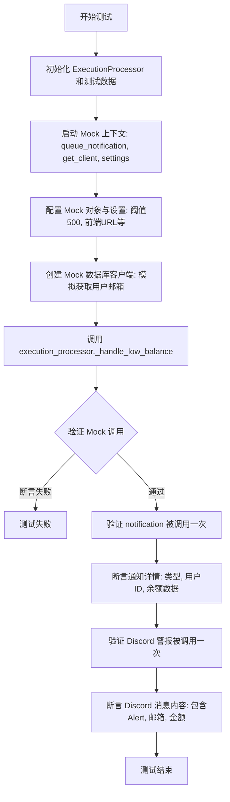
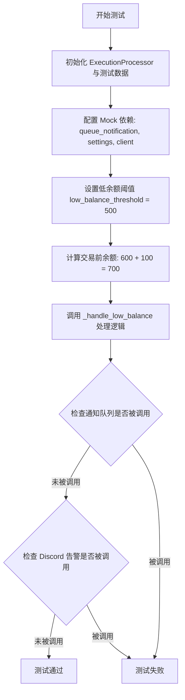
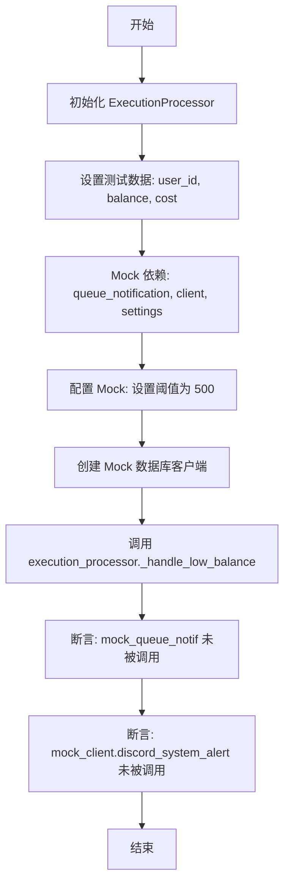
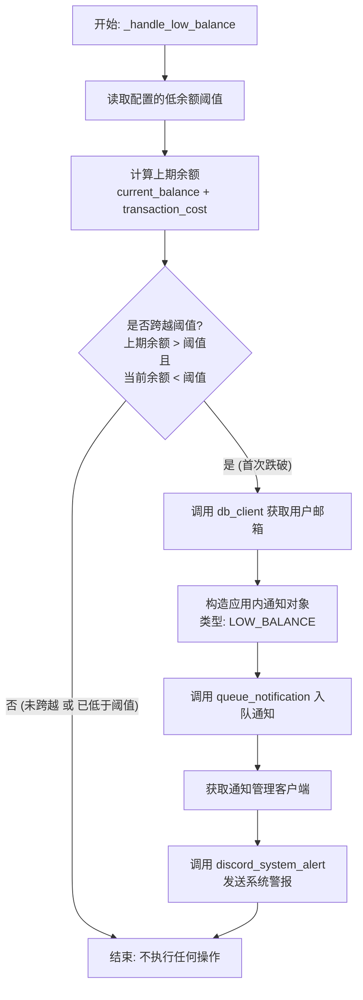
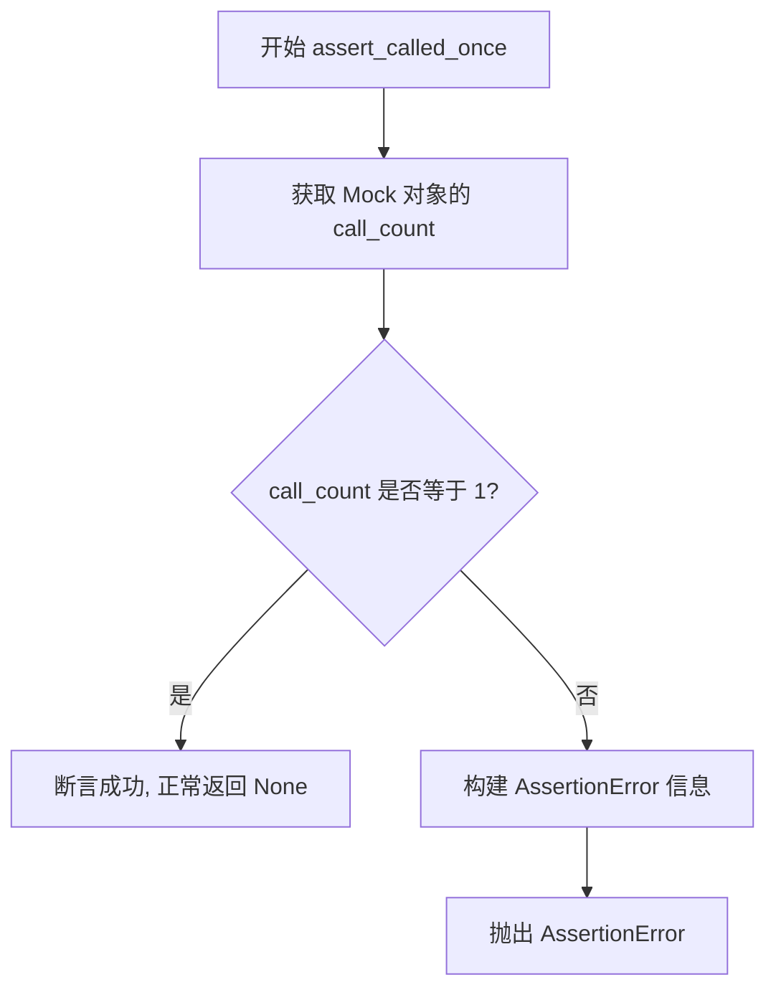
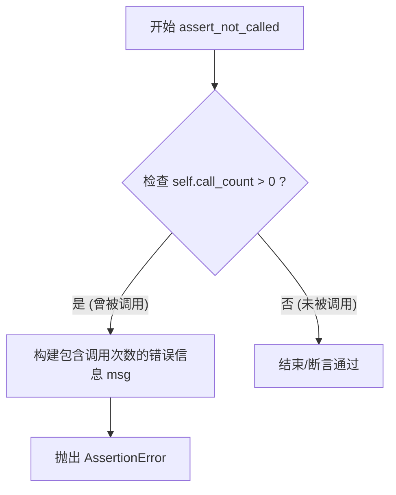
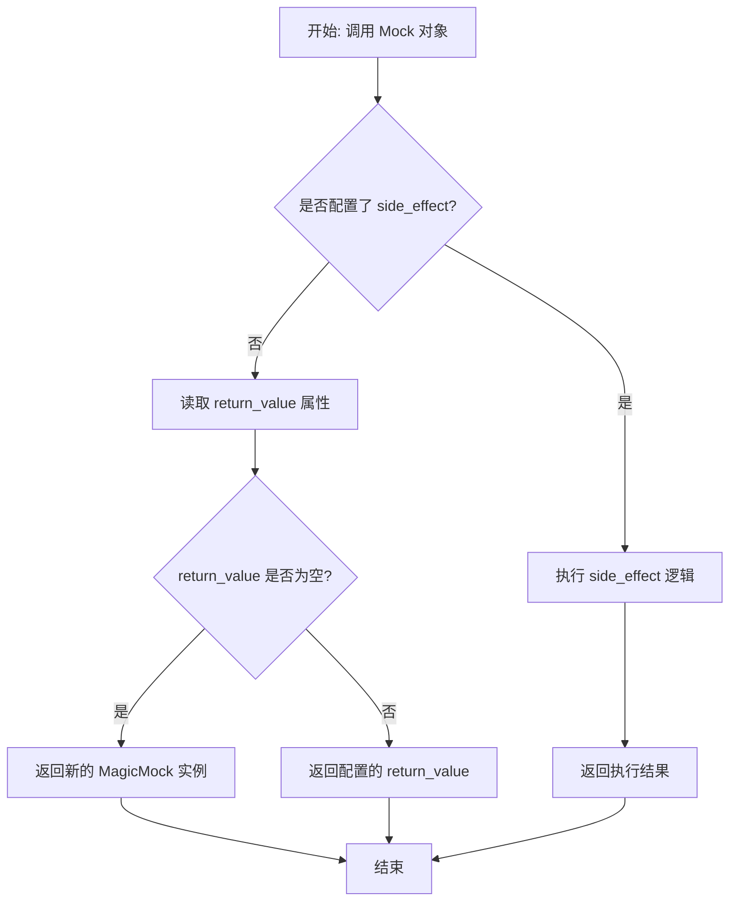

# `.\AutoGPT\autogpt_platform\backend\backend\executor\manager_low_balance_test.py` 详细设计文档

该代码包含针对执行处理器中低余额处理逻辑的单元测试，旨在验证当用户余额低于设定阈值时的通知触发机制，包括首次穿越阈值、未穿越阈值以及已在阈值以下这三种场景的行为是否符合预期。

## 整体流程

```mermaid
graph TD
    A[开始测试流程] --> B[初始化 ExecutionProcessor]
    B --> C[输入当前余额 current_balance 与 交易额 transaction_cost]
    C --> D[计算交易前余额 pre_balance = current_balance + transaction_cost]
    D --> E{pre_balance >= 阈值?}
    E -- 否 --> F[不触发通知 (已在阈值下或未触及)]
    E -- 是 --> G{current_balance < 阈值?}
    G -- 否 --> H[不触发通知 (仍处于安全状态)]
    G -- 是 --> I[触发低余额通知]
    I --> J[发送 Discord 系统警报]
    J --> K[验证通知内容与数据准确性]
    F --> L[测试结束]
    H --> L
    K --> L
```

## 类结构

```
Test Module (测试模块)
├── Dependencies (依赖项)
│   ├── ExecutionProcessor (被测核心类)
│   ├── LowBalanceData (通知数据模型)
│   ├── NotificationType (通知类型枚举)
│   └── SpinTestServer (测试服务器基类)
└── Test Functions (测试函数)
    ├── test_handle_low_balance_threshold_crossing (场景1: 穿越阈值)
    ├── test_handle_low_balance_no_notification_when_not_crossing (场景2: 未穿越)
    └── test_handle_low_balance_no_duplicate_when_already_below (场景3: 重复警报抑制)
```

## 全局变量及字段


### `execution_processor`
    
ExecutionProcessor 类的实例，用于处理任务执行逻辑及余额阈值检查。

类型：`ExecutionProcessor`
    


### `user_id`
    
用于测试场景的模拟用户唯一标识符。

类型：`str`
    


### `current_balance`
    
用户的当前账户余额（通常以最小货币单位表示，如分），用于与阈值比较。

类型：`int`
    


### `transaction_cost`
    
交易所需的金额，用于计算交易前后的余额状态以判断是否跨过阈值。

类型：`int`
    


### `mock_queue_notif`
    
用于模拟 `queue_notification` 函数的对象，以验证通知是否被正确加入队列。

类型：`MagicMock`
    


### `mock_get_client`
    
用于模拟 `get_notification_manager_client` 函数的对象，提供模拟的客户端实例。

类型：`MagicMock`
    


### `mock_settings`
    
用于模拟全局 `settings` 对象，用于配置低余额阈值和前端 URL 等设置。

类型：`MagicMock`
    


### `mock_client`
    
模拟的通知管理器客户端实例，用于验证 Discord 系统警报等外部调用。

类型：`MagicMock`
    


### `mock_db_client`
    
模拟的数据库客户端实例，用于在测试中提供用户数据（如电子邮件地址）。

类型：`MagicMock`
    


### `notification_call`
    
被传入通知队列的通知对象，包含通知类型和载荷数据，用于断言验证。

类型：`Notification`
    


### `discord_message`
    
发送给 Discord 系统警报的消息文本内容，包含余额和用户详情。

类型：`str`
    


### `LowBalanceData.current_balance`
    
在低余额通知数据中存储的用户当前余额值。

类型：`int`
    


### `NotificationType.LOW_BALANCE`
    
表示通知类型为“余额不足”的枚举常量。

类型：`NotificationType`
    
    

## 全局函数及方法


### `test_handle_low_balance_threshold_crossing`

该函数是一个异步测试用例，用于验证当用户的当前余额低于设定的阈值时，`ExecutionProcessor` 内部的 `_handle_low_balance` 方法是否能正确触发通知。测试通过 Mock 依赖项（如通知队列、客户端和配置），模拟了余额从高于阈值变为低于阈值的场景，并断言通知队列被调用、通知数据正确以及 Discord 警报已发送。

参数：

-   `server`：`SpinTestServer`，由 pytest 提供的测试服务器夹具实例，用于构建测试环境上下文。

返回值：`None`，该函数为测试用例，没有显式的返回值。

#### 流程图



#### 带注释源码

```python
@pytest.mark.asyncio(loop_scope="session")
async def test_handle_low_balance_threshold_crossing(server: SpinTestServer):
    """Test that _handle_low_balance triggers notification when crossing threshold."""

    # 初始化执行处理器实例
    execution_processor = ExecutionProcessor()
    user_id = "test-user-123"
    current_balance = 400  # $4 - below $5 threshold (当前余额低于阈值)
    transaction_cost = 600  # $6 transaction (交易成本)

    # 开始 Mock 外部依赖，隔离测试环境
    with patch(
        "backend.executor.manager.queue_notification"
    ) as mock_queue_notif, patch(
        "backend.executor.manager.get_notification_manager_client"
    ) as mock_get_client, patch(
        "backend.executor.manager.settings"
    ) as mock_settings:

        # 设置 Mock 对象的返回值和配置
        mock_client = MagicMock()
        mock_get_client.return_value = mock_client
        mock_settings.config.low_balance_threshold = 500  # 设置阈值为 $5
        mock_settings.config.frontend_base_url = "https://test.com"

        # 创建 Mock 数据库客户端并预设返回值
        mock_db_client = MagicMock()
        mock_db_client.get_user_email_by_id.return_value = "test@example.com"

        # 调用被测方法：处理低余额逻辑
        execution_processor._handle_low_balance(
            db_client=mock_db_client,
            user_id=user_id,
            current_balance=current_balance,
            transaction_cost=transaction_cost,
        )

        # 验证通知队列是否被调用了一次
        mock_queue_notif.assert_called_once()
        notification_call = mock_queue_notif.call_args[0][0]

        # 验证通知的具体数据是否符合预期
        assert notification_call.type == NotificationType.LOW_BALANCE
        assert notification_call.user_id == user_id
        assert isinstance(notification_call.data, LowBalanceData)
        assert notification_call.data.current_balance == current_balance

        # 验证 Discord 系统警报是否被发送
        mock_client.discord_system_alert.assert_called_once()
        discord_message = mock_client.discord_system_alert.call_args[0][0]
        assert "Low Balance Alert" in discord_message
        assert "test@example.com" in discord_message
        assert "$4.00" in discord_message
        assert "$6.00" in discord_message
```


### `test_handle_low_balance_no_notification_when_not_crossing`

该函数测试在用户的余额（包括当前余额和交易前余额）均未低于设定的低余额阈值时，系统确保不会触发任何低余额通知或告警的逻辑，以验证边界条件的正确性。

参数：

- `server`：`SpinTestServer`，测试服务器实例，由 pytest fixture 提供，用于在测试环境中运行。

返回值：`None`，该函数为测试用例，无返回值。

#### 流程图



#### 带注释源码

```python
@pytest.mark.asyncio(loop_scope="session")
async def test_handle_low_balance_no_notification_when_not_crossing(
    server: SpinTestServer,
):
    """Test that no notification is sent when not crossing the threshold."""

    # 初始化执行处理器
    execution_processor = ExecutionProcessor()
    user_id = "test-user-123"
    # 当前余额设定为 600 ($6)，高于阈值
    current_balance = 600
    # 交易成本设定为 100 ($1)，意味着交易前余额为 700 ($7)，也高于阈值
    transaction_cost = 100

    # Mock 外部依赖：通知队列、通知管理客户端、配置设置
    with patch(
        "backend.executor.manager.queue_notification"
    ) as mock_queue_notif, patch(
        "backend.executor.manager.get_notification_manager_client"
    ) as mock_get_client, patch(
        "backend.executor.manager.settings"
    ) as mock_settings:

        # 配置 Mock 对象的返回值和属性
        mock_client = MagicMock()
        mock_get_client.return_value = mock_client
        # 设定低余额阈值为 500 ($5)
        mock_settings.config.low_balance_threshold = 500

        # 创建 Mock 数据库客户端
        mock_db_client = MagicMock()

        # 调用处理低余额的核心方法
        execution_processor._handle_low_balance(
            db_client=mock_db_client,
            user_id=user_id,
            current_balance=current_balance,
            transaction_cost=transaction_cost,
        )

        # 验证：断言通知队列方法未被调用（因为未跨越阈值）
        mock_queue_notif.assert_not_called()
        # 验证：断言 Discord 系统告警方法未被调用
        mock_client.discord_system_alert.assert_not_called()
```


### `test_handle_low_balance_no_duplicate_when_already_below`

该测试函数用于验证当用户余额在交易前后均低于设定阈值时，低余额处理器不会发送重复的通知。其核心目的是确保警报逻辑仅在余额从高于阈值的状态跨越到低于阈值的状态时触发，而不是在用户已经处于低余额状态时持续触发。

参数：

-  `server`：`SpinTestServer`，测试服务器实例，由 pytest fixture 提供，用于模拟测试环境。

返回值：`None`，该函数为异步测试用例，主要用于验证行为逻辑，无显式返回值。

#### 流程图



#### 带注释源码

```python
@pytest.mark.asyncio(loop_scope="session")
async def test_handle_low_balance_no_duplicate_when_already_below(
    server: SpinTestServer,
):
    """Test that no notification is sent when already below threshold."""

    # 1. 初始化执行处理器
    execution_processor = ExecutionProcessor()
    user_id = "test-user-123"
    # 当前余额 300 ($3) - 低于 $5 阈值
    current_balance = 300
    # 交易花费 100 ($1)
    # 这意味着交易前的余额是 400 ($4)，也低于阈值
    transaction_cost = (
        100  # $1 transaction (balance before was $4, also below threshold)
    )

    # 2. Mock 外部依赖项
    with patch(
        "backend.executor.manager.queue_notification"
    ) as mock_queue_notif, patch(
        "backend.executor.manager.get_notification_manager_client"
    ) as mock_get_client, patch(
        "backend.executor.manager.settings"
    ) as mock_settings:

        # 3. 配置 Mock 对象
        mock_client = MagicMock()
        mock_get_client.return_value = mock_client
        # 设置低余额阈值为 500 ($5)
        mock_settings.config.low_balance_threshold = 500  # $5 threshold

        # 创建模拟数据库客户端
        mock_db_client = MagicMock()

        # 4. 执行被测方法
        # 场景：当前余额(300) < 阈值，且 交易前余额(300+100=400) < 阈值
        execution_processor._handle_low_balance(
            db_client=mock_db_client,
            user_id=user_id,
            current_balance=current_balance,
            transaction_cost=transaction_cost,
        )

        # 5. 验证结果
        # 由于用户已经在阈值之下，应该发送通知，以避免重复警报
        mock_queue_notif.assert_not_called()
        mock_client.discord_system_alert.assert_not_called()
```


### `ExecutionProcessor._handle_low_balance`

该私有方法用于在交易处理后检测用户余额是否首次跌破预设的低余额阈值。如果检测到余额从阈值之上降至阈值之下，它将触发应用内通知和 Discord 系统警报，同时避免对已经处于低余额状态的用户发送重复通知。

参数：

-   `db_client`：`Any` (Database Client)，数据库客户端对象，用于查询用户信息（如邮箱地址）。
-   `user_id`：`str`，待检查余额的用户唯一标识符。
-   `current_balance`：`int`，交易发生后的当前用户余额（单位通常为最小货币单位，如美分）。
-   `transaction_cost`：`int`，导致当前余额变动的交易金额。

返回值：`None`，该方法主要处理副作用（发送通知和警报），不返回具体值。

#### 流程图



#### 带注释源码

```python
# 基于测试用例逻辑推断的重构代码
# 实际源码路径: backend/executor/manager.py

from backend.data.notifications import LowBalanceData
from prisma.enums import NotificationType
from backend.executor.manager import queue_notification, get_notification_manager_client
from backend.config import settings

def _handle_low_balance(
    self, 
    db_client, 
    user_id, 
    current_balance, 
    transaction_cost
):
    """
    处理用户低余额检查及通知逻辑。
    仅在余额从高于阈值跌至低于阈值时触发通知。
    """
    # 获取配置中设定的低余额阈值（单位：美分，例如 500 代表 $5.00）
    threshold = settings.config.low_balance_threshold

    # 计算交易前的余额
    # 逻辑：上期余额 = 当前余额 + 本次交易花费
    previous_balance = current_balance + transaction_cost

    # 核心判断：只有当上期余额高于阈值，且当前余额低于阈值时才触发
    # 这避免了在用户余额已经很低的情况下，每次交易都发送重复通知
    if previous_balance > threshold and current_balance < threshold:
        
        # 1. 获取用户详细信息（如电子邮箱）用于通知内容
        user_email = db_client.get_user_email_by_id(user_id)

        # 2. 准备应用内通知数据
        notification_data = LowBalanceData(current_balance=current_balance)
        
        # 3. 将通知加入队列，发送给应用内用户
        queue_notification(
            type=NotificationType.LOW_BALANCE,
            user_id=user_id,
            data=notification_data
        )

        # 4. 发送 Discord 系统警报给运维人员
        client = get_notification_manager_client()
        
        # 构建消息内容，将整数金额转换为美元字符串格式
        # 测试中验证了消息包含 "Low Balance Alert", 邮箱, "$4.00", "$6.00" 等字样
        balance_str = f"${current_balance / 100:.2f}"
        cost_str = f"${transaction_cost / 100:.2f}"
        
        alert_message = (
            f"Low Balance Alert: User {user_email} has balance {balance_str} "
            f"after transaction of {cost_str}."
        )
        
        client.discord_system_alert(alert_message)
```


### `MagicMock.assert_called_once`

该方法属于 `unittest.mock.MagicMock` 类，用于断言该 Mock 对象在测试过程中恰好被调用了一次。这是编写单元测试时的常用断言，用于验证某个特定行为或事件是否按预期只发生了一次。如果调用次数不为 1，该方法会抛出 `AssertionError` 异常。

参数：

- 无参数

返回值：`None`，该方法在断言成功时无返回值，失败时抛出异常。

#### 流程图



#### 带注释源码

```python
    def assert_called_once(self):
        """
        Assert that the mock was called exactly once.
        """
        # 检查 mock 对象的调用计数 (call_count) 是否不等于 1
        if self.call_count != 1:
            # 如果不等于 1，构建错误消息
            # 消息包含 mock 的名称、实际调用次数以及调用详情
            msg = (
                f"Expected '{self._mock_name or 'mock'}' to have been called once. "
                f"Called {self.call_count} times."
            )
            # 抛出断言错误，阻止测试通过
            raise AssertionError(msg)
        # 如果等于 1，方法隐式返回 None
```


### `MagicMock.assert_not_called`

该方法用于断言 mock 对象在测试过程中从未被调用。如果 mock 对象被调用过一次或多次，该方法将抛出 AssertionError，从而验证代码逻辑中的特定路径未被执行。

参数：

- `self`：`MagicMock`，mock 对象的实例。

返回值：`None`，如果断言成功（即未被调用），则静默返回；否则抛出异常。

#### 流程图



#### 带注释源码

```python
def assert_not_called(self):
    """
    断言 mock 对象从未被调用。
    如果 mock.call_count 大于 0，则抛出 AssertionError。
    """
    # 检查 mock 对象的调用计数是否大于 0
    if self.call_count > 0:
        # 格式化错误消息，包含 mock 的名称（如果没有名称则为 'mock'）和实际调用次数
        msg = ("Expected {!r} to not have been called. Called {} times."
               .format(self._mock_name or 'mock', self.call_count))
        # 抛出断言错误，终止测试并提示预期行为不符
        raise AssertionError(msg)
```


### `MagicMock.return_value`

`unittest.mock.MagicMock` 类的一个属性，用于定义当模拟对象被调用时返回的值。如果在模拟对象上调用了该方法（如 `mock_db_client.get_user_email_by_id()`），并且没有配置特定的 `side_effect`，则该模拟调用将返回存储在 `return_value` 中的值。在提供的代码上下文中，它用于模拟数据库查询结果或依赖注入的客户端实例。

参数：

*   （该属性为类成员变量，无函数参数）

返回值：`Any`，配置在模拟对象上的返回值，默认为一个新的 `MagicMock` 实例。

#### 流程图



#### 带注释源码

```python
# 注意：以下代码基于 unittest.mock 库的 MagicMock 类行为逻辑进行说明，
# 并非直接提取自提供的测试文件，因为测试文件仅使用了该属性而未定义它。

class MagicMock:
    def __init__(self):
        # 默认情况下，return_value 也是一个 MagicMock 实例
        # 这允许链式调用，例如 mock.method().another_method()
        self.return_value = MagicMock()

    def __call__(self, *args, **kwargs):
        """
        当模拟对象被像函数一样调用时触发。
        """
        # 优先检查是否有 side_effect (例如抛出异常或迭代器)
        if self.side_effect is not None:
            return self.side_effect(*args, **kwargs)
        
        # 如果没有 side_effect，则返回 return_value
        # 在测试代码中：mock_get_client.return_value = mock_client
        # 这意味着当调用 mock_get_client() 时，会返回 mock_client
        return self.return_value
```


## 关键组件


### ExecutionProcessor

负责管理工作流执行生命周期，并在交易后评估财务状态（如余额阈值检查）的核心处理类。

### _handle_low_balance

ExecutionProcessor 的私有方法，用于判断用户当前余额是否低于设定阈值，并仅在余额从上方穿越阈值时触发通知和系统警报。

### queue_notification

用于将通知对象（包含类型、用户 ID 和具体数据）加入队列以便异步发送的工具函数。

### NotificationType.LOW_BALANCE

表示低余额状态的通知类型枚举，用于标识特定场景下的用户通知。

### LowBalanceData

承载低余额事件详细数据（如当前余额、交易成本等）的数据结构，用于填充通知内容。

### discord_system_alert

通知管理器客户端的方法，用于向 Discord 频道发送系统级的监控警报或警告信息。


## 问题及建议


### 已知问题

-   **测试代码重复**：三个测试用例中存在大量重复的 Mock 设置代码（如 `patch` `backend.executor.manager` 下的多个函数），违反了 DRY（Don't Repeat Yourself）原则，增加了维护成本。
-   **未使用的参数**：所有测试函数均接收了 `server: SpinTestServer` 参数，但在测试体内部并未实际使用该对象，属于冗余代码。
-   **脆弱的字符串断言**：测试中对 Discord 消息内容进行了硬编码的字符串匹配（如 `"$4.00"`），这种对具体格式化结果的依赖使得测试非常脆弱，一旦货币显示格式或文案发生微调，测试即会失败。
-   **异常场景覆盖缺失**：测试仅覆盖了逻辑判断的正常路径，未包含当 `db_client.get_user_email_by_id` 查询失败（如用户不存在、数据库连接超时）时的异常处理逻辑验证。

### 优化建议

-   **引入共享 Fixture**：将重复的 Mock 对象创建和 Patch 逻辑提取到 `pytest.fixture` 中，在测试用例中通过依赖注入的方式复用，从而简化测试代码结构。
-   **使用参数化测试**：利用 `@pytest.mark.parametrize` 将不同的余额状态（触发阈值、未触发阈值、已在阈值下）转化为测试数据驱动，将三个相似的测试函数合并为一个，提高测试代码的简洁度和可扩展性。
-   **使用常量定义魔术数字**：将测试中使用的具体数值（如用户ID `test-user-123`、余额 `400`、阈值 `500`）定义为模块级的常量，增强代码的可读性和可维护性。
-   **改进断言策略**：对于通知内容的验证，优先校验传递给通知对象的数据模型（如 `LowBalanceData` 中的数值），而非校验最终生成的字符串文本，以降低测试对表现层细节的耦合。


## 其它


### 设计目标与约束

**设计目标：**
该模块旨在通过实时监控用户账户余额，在余额低于预设阈值时主动触发警报机制。核心目标是确保用户能够及时获知余额不足的情况，以避免服务中断，同时通过 Discord 向系统管理员发送告警，以便进行潜在的用户干预或服务支持。

**约束条件：**
1.  **阈值配置化**：低余额阈值（如 $5.00）必须通过配置系统进行管理，而非硬编码，以支持灵活调整。
2.  **告警去重**：系统必须仅在余额**穿过**阈值（即从高于或等于阈值变为低于阈值）时触发通知。如果用户余额已经低于阈值，后续的交易不应再次触发通知，以防止告警轰炸。
3.  **非阻塞设计**：余额检查和通知发送逻辑应当轻量且快速，避免阻塞主执行流程（如交易处理）。

### 错误处理与异常设计

基于测试用例分析，该模块在错误处理方面遵循以下策略（尽管测试代码主要模拟了成功路径，但设计上隐含了以下处理机制）：

1.  **依赖项容错**：通知逻辑依赖于外部服务（如 Discord 通知客户端、数据库客户端）。设计上应确保即使这些外部依赖项调用失败（例如数据库无法获取邮箱或 Discord API 不可达），也不会回滚或中断主要的业务交易逻辑。
2.  **数据有效性**：输入参数 `current_balance` 和 `transaction_cost` 应为非负数值。虽然测试用例未显式测试负值处理，但在实际设计中应防止无效的金额计算。
3.  **Mock 隔离**：在测试环境中，通过 Mock 对象隔离了真实的外部调用，确保了单元测试的稳定性和逻辑验证的纯粹性，不受外部网络或数据库状态影响。

### 数据流与状态机

**数据流：**
1.  **输入阶段**：接收 `user_id`、`current_balance`（交易后余额）和 `transaction_cost`（交易金额）。
2.  **计算阶段**：基于输入数据推算交易前的余额 (`previous_balance = current_balance + transaction_cost`)。
3.  **判断阶段**：读取配置中的 `low_balance_threshold`。判断是否满足触发条件：`previous_balance >= threshold` 且 `current_balance < threshold`。
4.  **数据获取阶段**：若满足条件，调用 `db_client.get_user_email_by_id` 获取用户联系信息。
5.  **输出阶段**：构建通知对象（包含 `NotificationType` 和 `LowBalanceData`）并调用 `queue_notification`；同时构建告警字符串并调用 `discord_system_alert`。

**状态机：**
用户余额状态可抽象为两个主要状态：
*   **Healthy (健康)**：余额 >= 阈值。
*   **Low (不足)**：余额 < 阈值。

**状态转换：**
*   **Healthy -> Low**：触发 `Alert` 动作（发送通知和 Discord 告警）。
*   **Healthy -> Healthy**：无动作。
*   **Low -> Low**：无动作（防止重复告警）。
*   *注：从 Low -> Healthy 的转换（充值）不在本逻辑处理范围内。*

### 外部依赖与接口契约

1.  **`backend.executor.manager.queue_notification`**
    *   **类型**：全局函数/模块方法
    *   **契约**：接收一个 `Notification` 对象作为参数。该对象必须包含 `type` (枚举), `user_id` (字符串), 和 `data` (特定通知数据结构)。该函数负责将通知异步加入处理队列，无返回值。

2.  **`backend.executor.manager.get_notification_manager_client`**
    *   **类型**：模块方法
    *   **契约**：返回一个客户端对象，该对象必须实现 `discord_system_alert(message: str)` 方法，用于向 Discord 发送系统级告警。

3.  **Database Client (`db_client`)**
    *   **类型**：对象实例（在测试中为 `MagicMock`）
    *   **接口**：`get_user_email_by_id(user_id: str) -> str`
    *   **契约**：根据提供的用户 ID 返回对应的电子邮箱地址。如果用户不存在，可能抛出异常或返回空（取决于具体实现，测试假设返回有效邮箱）。

4.  **Settings (`backend.executor.manager.settings`)**
    *   **类型**：配置对象
    *   **接口**：`settings.config.low_balance_threshold` (int/float), `settings.config.frontend_base_url` (str)
    *   **契约**：提供系统运行时所需的配置参数，阈值必须为数值类型。

5.  **Data Objects (`prisma.enums`, `backend.data.notifications`)**
    *   **`NotificationType`**：枚举类型，此处使用 `NotificationType.LOW_BALANCE`。
    *   **`LowBalanceData`**：数据类/结构，必须包含 `current_balance` 字段用于存储当前余额信息。

    