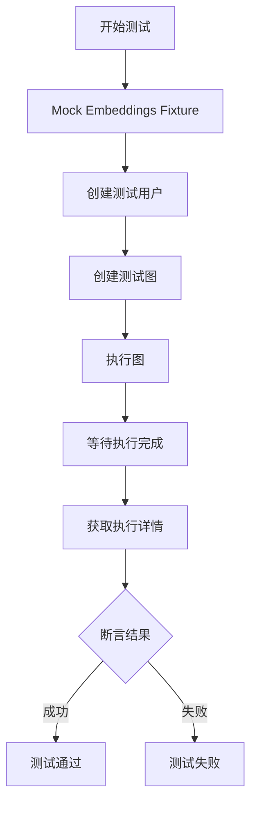
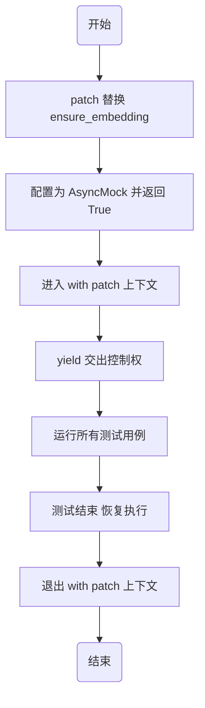
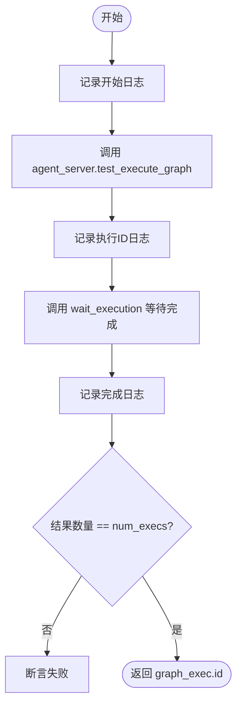
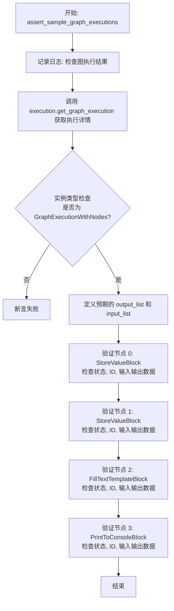
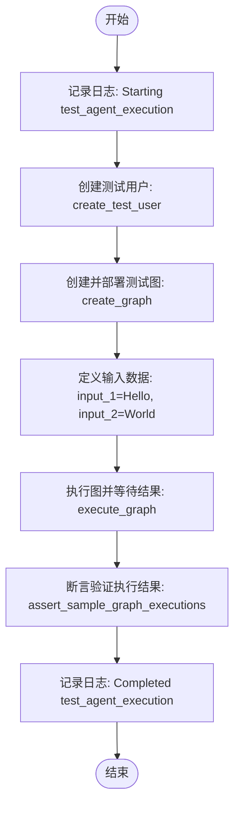
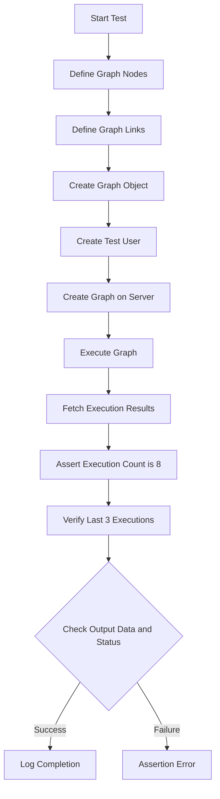
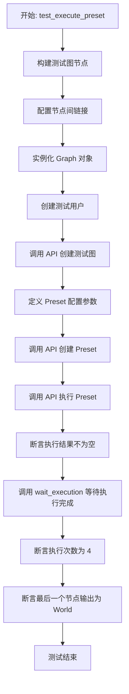
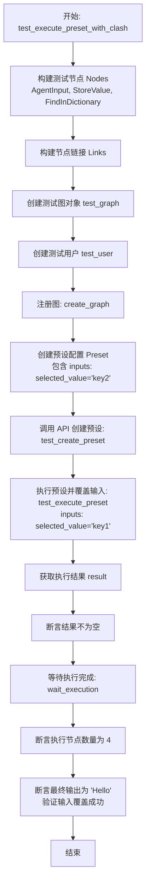
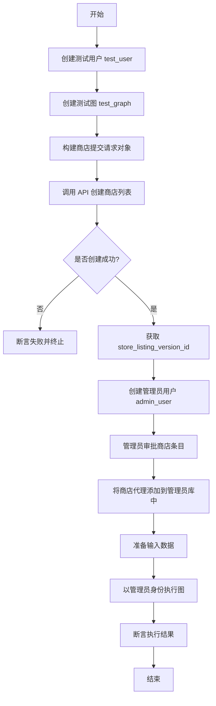

# `.\AutoGPT\autogpt_platform\backend\backend\executor\manager_test.py` 详细设计文档

该文件是一个包含异步测试用例和辅助函数的测试套件，用于验证后端 'AgentServer' 的图执行逻辑，涵盖了图创建、基本执行流、输入引脚行为（如默认值与静态链接）、预设执行及商店上市列表的端到端测试。

## 整体流程



## 类结构

```
Test Suite (test_execution.py)
├── Fixtures
│   └── mock_embedding_functions
├── Helper Functions
│   ├── create_graph
│   ├── execute_graph
│   └── assert_sample_graph_executions
└── Test Cases
    ├── test_agent_execution
    ├── test_input_pin_always_waited
    ├── test_static_input_link_on_graph
    ├── test_execute_preset
    ├── test_execute_preset_with_clash
    └── test_store_listing_graph
```

## 全局变量及字段


### `logger`
    
用于在测试执行过程中记录日志信息的全局日志记录器实例。

类型：`logging.Logger`
    


    

## 全局函数及方法


### `mock_embedding_functions`

这是一个 Pytest fixture 函数，用于在整个测试会话中自动模拟 embedding 函数。它通过替换实际的数据库/API 调用，确保测试不依赖于外部依赖，从而提高测试的稳定性和速度。

参数：

返回值：`Generator`，生成一个上下文管理器，在该上下文中 `ensure_embedding` 被异步 Mock 对象替换。

#### 流程图



#### 带注释源码

```python
@pytest.fixture(scope="session", autouse=True)
def mock_embedding_functions():
    """Mock embedding functions for all tests to avoid database/API dependencies."""
    # 使用 patch 装饰器或上下文管理器替换指定路径的函数
    with patch(
        "backend.api.features.store.db.ensure_embedding", # 目标替换函数的路径
        new_callable=AsyncMock,  # 指定替换为异步 Mock 对象
        return_value=True,      # 设置 Mock 对象调用时的返回值为 True
    ):
        # yield 关键字暂停 fixture 执行，将控制权交给测试代码
        # 此时 patch 已经生效，所有测试都会使用 Mock 对象
        yield
        # 当测试 session 结束后，代码执行到这里，退出上下文，模拟还原
```


### `create_graph`

该函数是一个异步辅助函数，用于在测试环境中为指定用户创建一个图（Graph）。它封装了通过测试服务器代理调用图创建逻辑的过程。

参数：

-   `s`：`SpinTestServer`，测试服务器实例，用于访问底层的 AgentServer 服务。
-   `g`：`graph.Graph`，需要被创建的图数据结构对象。
-   `u`：`User`，与该图关联的用户对象，用于权限和归属验证。

返回值：`graph.Graph`，服务器端返回的已创建的图对象。

#### 流程图

```mermaid
flowchart TD
    Start([开始]) --> Log[记录日志: Creating graph for user {u.id}]
    Log --> Call[调用 s.agent_server.test_create_graph]
    Call --> PassParams[传入参数: CreateGraph graph=g, u.id]
    PassParams --> Await[等待异步操作完成]
    Await --> ReturnResult([返回创建的 Graph 对象])
```

#### 带注释源码

```python
async def create_graph(s: SpinTestServer, g: graph.Graph, u: User) -> graph.Graph:
    # 记录日志，输出正在为哪个用户创建图
    logger.info(f"Creating graph for user {u.id}")
    # 调用测试服务器的代理方法，传入封装好的 CreateGraph 请求体和用户ID，并等待结果返回
    return await s.agent_server.test_create_graph(CreateGraph(graph=g), u.id)
```


### `execute_graph`

异步执行测试图，验证执行节点数量，并返回执行ID的辅助函数。

参数：

-  `agent_server`：`AgentServer`，提供图执行逻辑的服务器实例。
-  `test_graph`：`graph.Graph`，待执行的图实体对象。
-  `test_user`：`User`，触发执行的用户对象。
-  `input_data`：`dict`，传递给图中节点起始点的输入数据。
-  `num_execs`：`int`，预期产生的节点执行总数，默认为 4。

返回值：`str`，创建的图执行的唯一标识符。

#### 流程图



#### 带注释源码

```python
async def execute_graph(
    agent_server: AgentServer,
    test_graph: graph.Graph,
    test_user: User,
    input_data: dict,
    num_execs: int = 4,
) -> str:
    # 记录执行开始的日志，包含用户ID和图ID
    logger.info(f"Executing graph {test_graph.id} for user {test_user.id}")
    logger.info(f"Input data: {input_data}")

    # --- 测试添加新的执行 --- #
    # 调用 AgentServer 的测试方法触发图执行
    graph_exec = await agent_server.test_execute_graph(
        user_id=test_user.id,
        graph_id=test_graph.id,
        graph_version=test_graph.version,
        node_input=input_data,
    )
    # 记录生成的执行ID
    logger.info(f"Created execution with ID: {graph_exec.id}")

    # 等待执行队列为空并获取执行结果
    logger.info("Waiting for execution to complete...")
    # 调用 wait_execution 辅助函数等待执行完成，超时时间为30秒
    result = await wait_execution(test_user.id, graph_exec.id, 30)
    logger.info(f"Execution completed with {len(result)} results")

    # 断言实际执行的节点结果数量是否符合预期
    assert len(result) == num_execs
    # 返回执行ID，供后续测试步骤使用
    return graph_exec.id
```


### `assert_sample_graph_executions`

该函数用于验证示例图执行后的结果。它通过获取包含节点执行详情的图执行记录，按顺序验证特定节点的执行状态、输入输出数据及节点ID是否符合预期，以确认图执行逻辑的正确性。

参数：

- `test_graph`：`graph.Graph`，用于比对节点ID的测试图对象。
- `test_user`：`User`，执行该图的用户对象，用于获取执行记录。
- `graph_exec_id`：`str`，需要验证的图执行记录的唯一标识符。

返回值：`None`，无返回值，主要通过断言抛出异常来验证结果。

#### 流程图



#### 带注释源码

```python
async def assert_sample_graph_executions(
    test_graph: graph.Graph,
    test_user: User,
    graph_exec_id: str,
):
    # 记录开始检查日志
    logger.info(f"Checking execution results for graph {test_graph.id}")
    
    # 根据用户ID和执行ID获取图执行记录，并包含节点执行详情
    graph_run = await execution.get_graph_execution(
        test_user.id, graph_exec_id, include_node_executions=True
    )
    # 断言获取到的对象是 GraphExecutionWithNodes 类型
    assert isinstance(graph_run, execution.GraphExecutionWithNodes)

    # 定义预期的输出列表和输入列表，用于后续断言比对
    output_list = [{"result": ["Hello"]}, {"result": ["World"]}]
    input_list = [
        {
            "name": "input_1",
            "value": "Hello",
        },
        {
            "name": "input_2",
            "value": "World",
            "description": "This is my description of this parameter",
        },
    ]

    # --- 验证第一个 StoreValueBlock 执行情况 ---
    exec = graph_run.node_executions[0]
    logger.info(f"Checking first StoreValueBlock execution: {exec}")
    # 断言执行状态为已完成
    assert exec.status == execution.ExecutionStatus.COMPLETED
    # 断言所属图执行ID正确
    assert exec.graph_exec_id == graph_exec_id
    # 断言输出数据在预期列表中
    assert (
        exec.output_data in output_list
    ), f"Output data: {exec.output_data} and {output_list}"
    # 断言输入数据在预期列表中
    assert (
        exec.input_data in input_list
    ), f"Input data: {exec.input_data} and {input_list}"
    # 断言节点ID属于测试图的前两个节点之一
    assert exec.node_id in [test_graph.nodes[0].id, test_graph.nodes[1].id]

    # --- 验证第二个 StoreValueBlock 执行情况 ---
    exec = graph_run.node_executions[1]
    logger.info(f"Checking second StoreValueBlock execution: {exec}")
    assert exec.status == execution.ExecutionStatus.COMPLETED
    assert exec.graph_exec_id == graph_exec_id
    assert (
        exec.output_data in output_list
    ), f"Output data: {exec.output_data} and {output_list}"
    assert (
        exec.input_data in input_list
    ), f"Input data: {exec.input_data} and {input_list}"
    assert exec.node_id in [test_graph.nodes[0].id, test_graph.nodes[1].id]

    # --- 验证 FillTextTemplateBlock 执行情况 ---
    exec = graph_run.node_executions[2]
    logger.info(f"Checking FillTextTemplateBlock execution: {exec}")
    assert exec.status == execution.ExecutionStatus.COMPLETED
    assert exec.graph_exec_id == graph_exec_id
    # 断言特定的输出格式
    assert exec.output_data == {"output": ["Hello, World!!!"]}
    # 断言特定的模板参数输入
    assert exec.input_data == {
        "format": "{{a}}, {{b}}{{c}}",
        "values": {"a": "Hello", "b": "World", "c": "!!!"},
        "values_#_a": "Hello",
        "values_#_b": "World",
        "values_#_c": "!!!",
    }
    assert exec.node_id == test_graph.nodes[2].id

    # --- 验证 PrintToConsoleBlock 执行情况 ---
    exec = graph_run.node_executions[3]
    logger.info(f"Checking PrintToConsoleBlock execution: {exec}")
    assert exec.status == execution.ExecutionStatus.COMPLETED
    assert exec.graph_exec_id == graph_exec_id
    assert exec.output_data == {"output": ["Hello, World!!!"]}
    assert exec.input_data == {"input": "Hello, World!!!"}
    assert exec.node_id == test_graph.nodes[3].id
```


### `test_agent_execution`

该函数是一个异步的端到端测试用例，用于验证整个Agent系统的执行流程。它通过创建测试用户、部署测试图、传入输入数据执行图，并对执行结果进行断言，以确保系统的各个组件（如输入块、存储块、数据处理块等）能够协同工作并产生符合预期的输出。

参数：

- `server`：`SpinTestServer`，测试服务器实例，提供模拟的API环境和后台服务管理能力。

返回值：`None`，该函数作为测试用例，通过断言验证逻辑正确性，无直接返回值。

#### 流程图



#### 带注释源码

```python
@pytest.mark.asyncio(loop_scope="session")
async def test_agent_execution(server: SpinTestServer):
    # 记录测试开始日志
    logger.info("Starting test_agent_execution")
    
    # 创建测试用户对象，用于隔离测试数据和权限
    test_user = await create_test_user()
    
    # 在服务器上创建并部署一个预定义的测试图结构
    test_graph = await create_graph(server, create_test_graph(), test_user)
    
    # 准备输入数据，这些数据将被注入到图的起始节点
    data = {"input_1": "Hello", "input_2": "World"}
    
    # 执行图，传入服务器实例、图对象、用户、输入数据及预期的执行节点数量(4个)
    # 该函数会阻塞直到执行完成或超时
    graph_exec_id = await execute_graph(
        server.agent_server,
        test_graph,
        test_user,
        data,
        4,
    )
    
    # 验证图中各个节点的执行状态和输出数据是否符合预期
    await assert_sample_graph_executions(test_graph, test_user, graph_exec_id)
    
    # 记录测试结束日志
    logger.info("Completed test_agent_execution")
```


### `test_input_pin_always_waited`

该测试用于验证在图执行过程中，即使节点的输入引脚定义了默认值，当有外部链接或数据输入时，输入引脚必须等待并使用实际输入的数据，而忽略默认值。测试场景包含两个存储值的节点和一个在字典中查找的节点，验证查找节点能正确接收链接的数据而非其默认的空值。

参数：

-   `server`：`SpinTestServer`，用于测试的测试服务器 fixture 实例。

返回值：`None`，无返回值（测试函数）。

#### 流程图

```mermaid
flowchart TD
    A[开始] --> B[记录开始日志]
    B --> C[定义节点列表<br/>StoreValueBlock x2, FindInDictionaryBlock]
    C --> D[定义链接列表<br/>Node0输出->Node2输入, Node1输出->Node2键]
    D --> E[创建测试图对象 Graph]
    E --> F[创建测试用户 User]
    F --> G[调用 create_graph 在服务器上创建图]
    G --> H[调用 execute_graph 执行图<br/>输入数据: {}, 期望执行数: 3]
    H --> I[调用 execution.get_graph_execution 获取执行结果]
    I --> J{断言检查}
    J --> |节点执行数量 == 3| K[断言第三个节点状态为 COMPLETED]
    K --> L[断言第三个节点输出为 value2<br/>验证使用了输入而非默认值]
    L --> M[记录结束日志]
    M --> N[结束]
    J --> |断言失败| O[抛出异常]
```

#### 带注释源码

```python
@pytest.mark.asyncio(loop_scope="session")
async def test_input_pin_always_waited(server: SpinTestServer):
    """
    This test is asserting that the input pin should always be waited for the execution,
    even when default value on that pin is defined, the value has to be ignored.

    Test scenario:
    StoreValueBlock1
                \\ input
                     >------- FindInDictionaryBlock | input_default: key: "", input: {}
                // key
    StoreValueBlock2
    """
    # 记录测试开始日志
    logger.info("Starting test_input_pin_always_waited")
    
    # 定义图的节点：两个 StoreValueBlock 用于提供数据，一个 FindInDictionaryBlock 用于处理数据
    nodes = [
        graph.Node(
            block_id=StoreValueBlock().id,
            input_default={"input": {"key1": "value1", "key2": "value2"}}, # 提供字典数据
        ),
        graph.Node(
            block_id=StoreValueBlock().id,
            input_default={"input": "key2"}, # 提供键名
        ),
        graph.Node(
            block_id=FindInDictionaryBlock().id,
            # 注意：此处定义了默认值 key: "", input: {}，测试应验证这些默认值被上游链接数据覆盖
            input_default={"key": "", "input": {}},
        ),
    ]
    
    # 定义节点之间的链接，将前两个节点的输出连接到第三个节点的输入
    links = [
        graph.Link(
            source_id=nodes[0].id,
            sink_id=nodes[2].id,
            source_name="output",
            sink_name="input", # 连接字典数据到 FindInDictionaryBlock 的 input 引脚
        ),
        graph.Link(
            source_id=nodes[1].id,
            sink_id=nodes[2].id,
            source_name="output",
            sink_name="key", # 连接键名到 FindInDictionaryBlock 的 key 引脚
        ),
    ]
    
    # 构建图对象
    test_graph = graph.Graph(
        name="TestGraph",
        description="Test graph",
        nodes=nodes,
        links=links,
    )
    
    # 创建测试用户
    test_user = await create_test_user()
    
    # 在测试服务器上创建图
    test_graph = await create_graph(server, test_graph, test_user)
    
    # 执行图，输入为空字典 {}，预期有 3 个节点执行完成
    graph_exec_id = await execute_graph(
        server.agent_server, test_graph, test_user, {}, 3
    )

    # 记录检查结果日志
    logger.info("Checking execution results")
    
    # 获取图执行详情，包含节点执行情况
    graph_exec = await execution.get_graph_execution(
        test_user.id, graph_exec_id, include_node_executions=True
    )
    assert isinstance(graph_exec, execution.GraphExecutionWithNodes)
    
    # 断言执行的节点数量为 3
    assert len(graph_exec.node_executions) == 3
    
    # 核心断言：FindInDictionaryBlock 应该等待 input 引脚的数据，
    # 从而从 {"key1": "value1", "key2": "value2"} 中提取 "key2" 对应的值 "value2"
    assert graph_exec.node_executions[2].status == execution.ExecutionStatus.COMPLETED
    assert graph_exec.node_executions[2].output_data == {"output": ["value2"]}
    
    # 记录测试完成日志
    logger.info("Completed test_input_pin_always_waited")
```


### `test_static_input_link_on_graph`

该函数是一个异步测试用例，用于验证图执行过程中静态输入链接（可重用输入链接）的行为。测试构建了一个特定的图结构，其中计算器块节点接收多个指向输入引脚'a'的动态链接，以及一个通过中间块指向输入引脚'b'的静态链接。测试断言当静态链接上的输入就绪后，所有等待动态输入的未完成执行都能被成功触发，并计算出正确的结果（4 + 5 = 9）。

参数：

-   `server`：`SpinTestServer`，测试服务器实例装置，用于托管图执行环境并提供相关服务。

返回值：`None`，该函数不返回值，主要通过断言验证执行结果。

#### 流程图



#### 带注释源码

```python
@pytest.mark.asyncio(loop_scope="session")
async def test_static_input_link_on_graph(server: SpinTestServer):
    """
    This test is asserting the behaviour of static input link, e.g: reusable input link.

    Test scenario:
    *StoreValueBlock1*===a=========\\
    *StoreValueBlock2*===a=====\\  ||
    *StoreValueBlock3*===a===*MathBlock*====b / static====*StoreValueBlock5*
    *StoreValueBlock4*=========================================//

    In this test, there will be three input waiting in the MathBlock input pin `a`.
    And later, another output is produced on input pin `b`, which is a static link,
    this input will complete the input of those three incomplete executions.
    """
    logger.info("Starting test_static_input_link_on_graph")
    
    # 定义图中的节点，包括三个值为4的StoreValueBlock，一个值为5的，一个空的，以及一个计算器块
    nodes = [
        graph.Node(block_id=StoreValueBlock().id, input_default={"input": 4}),  # a
        graph.Node(block_id=StoreValueBlock().id, input_default={"input": 4}),  # a
        graph.Node(block_id=StoreValueBlock().id, input_default={"input": 4}),  # a
        graph.Node(block_id=StoreValueBlock().id, input_default={"input": 5}),  # b
        graph.Node(block_id=StoreValueBlock().id),
        graph.Node(
            block_id=CalculatorBlock().id,
            input_default={"operation": Operation.ADD.value},
        ),
    ]
    
    # 定义节点之间的连接，建立三个指向计算器'a'的链接，以及一个通过中间节点指向计算器'b'的静态链接
    links = [
        graph.Link(
            source_id=nodes[0].id,
            sink_id=nodes[5].id,
            source_name="output",
            sink_name="a",
        ),
        graph.Link(
            source_id=nodes[1].id,
            sink_id=nodes[5].id,
            source_name="output",
            sink_name="a",
        ),
        graph.Link(
            source_id=nodes[2].id,
            sink_id=nodes[5].id,
            source_name="output",
            sink_name="a",
        ),
        graph.Link(
            source_id=nodes[3].id,
            sink_id=nodes[4].id,
            source_name="output",
            sink_name="input",
        ),
        graph.Link(
            source_id=nodes[4].id,
            sink_id=nodes[5].id,
            source_name="output",
            sink_name="b",
            is_static=True,  # This is the static link to test.
        ),
    ]
    
    # 创建图对象
    test_graph = graph.Graph(
        name="TestGraph",
        description="Test graph",
        nodes=nodes,
        links=links,
    )
    
    # 创建测试用户并在服务器上创建图
    test_user = await create_test_user()
    test_graph = await create_graph(server, test_graph, test_user)
    
    # 执行图，预期会有8个节点执行（4个StoreValue + 3个Calculator + 1个中间StoreValue）
    graph_exec_id = await execute_graph(
        server.agent_server, test_graph, test_user, {}, 8
    )
    
    logger.info("Checking execution results")
    # 获取图执行结果详情
    graph_exec = await execution.get_graph_execution(
        test_user.id, graph_exec_id, include_node_executions=True
    )
    
    # 断言执行结果类型和节点执行总数
    assert isinstance(graph_exec, execution.GraphExecutionWithNodes)
    assert len(graph_exec.node_executions) == 8
    
    # 验证最后3个执行（即Calculator块的执行）的状态和输出数据是否为 4+5=9
    for i, exec_data in enumerate(graph_exec.node_executions[-3:]):
        logger.info(f"Checking execution {i+1} of last 3: {exec_data}")
        assert exec_data.status == execution.ExecutionStatus.COMPLETED
        assert exec_data.output_data == {"result": [9]}
        
    logger.info("Completed test_static_input_link_on_graph")
```


### `test_execute_preset`

该函数用于测试预设执行功能。它构建一个包含输入、存储和字典查找节点的图，创建一个预设以注入特定的输入值，执行该预设，并验证最终的执行结果是否符合预期（即能够根据预设的输入正确查找字典值）。

参数：

-  `server`：`SpinTestServer`，测试服务器实例，用于提供创建图、用户和执行预设的测试环境。

返回值：`None`，无返回值，该函数通过断言验证预设创建和执行的正确性。

#### 流程图



#### 带注释源码

```python
@pytest.mark.asyncio(loop_scope="session")
async def test_execute_preset(server: SpinTestServer):
    """
    Test executing a preset.

    This test ensures that:
    1. A preset can be successfully executed
    2. The execution results are correct

    Args:
        server (SpinTestServer): The test server instance.
    """
    # --- 构建测试图的节点 ---
    # 节点0和1作为输入接口，分别对应字典和键值
    # 节点2存储字典数据（虽然预设会覆盖，但此处定义了默认结构）
    # 节点3用于从字典中查找值
    nodes = [
        graph.Node(  # 0
            block_id=AgentInputBlock().id,
            input_default={"name": "dictionary"},
        ),
        graph.Node(  # 1
            block_id=AgentInputBlock().id,
            input_default={"name": "selected_value"},
        ),
        graph.Node(  # 2
            block_id=StoreValueBlock().id,
            input_default={"input": {"key1": "Hi", "key2": "Everyone"}},
        ),
        graph.Node(  # 3
            block_id=FindInDictionaryBlock().id,
            input_default={"key": "", "input": {}},
        ),
    ]
    
    # --- 构建节点间的连接关系 ---
    links = [
        graph.Link(
            source_id=nodes[0].id,
            sink_id=nodes[2].id,
            source_name="result",
            sink_name="input",
        ),
        graph.Link(
            source_id=nodes[1].id,
            sink_id=nodes[3].id,
            source_name="result",
            sink_name="key",
        ),
        graph.Link(
            source_id=nodes[2].id,
            sink_id=nodes[3].id,
            source_name="output",
            sink_name="input",
        ),
    ]
    
    # 初始化图对象
    test_graph = graph.Graph(
        name="TestGraph",
        description="Test graph",
        nodes=nodes,
        links=links,
    )
    
    # 创建测试用户并在服务器上注册图
    test_user = await create_test_user()
    test_graph = await create_graph(server, test_graph, test_user)

    # --- 创建预设 ---
    # 定义预设的输入数据，这将在执行时注入到图的输入块中
    preset = backend.api.features.library.model.LibraryAgentPresetCreatable(
        name="Test Preset With Clash",
        description="Test preset with clashing input values",
        graph_id=test_graph.id,
        graph_version=test_graph.version,
        inputs={
            "dictionary": {"key1": "Hello", "key2": "World"},
            "selected_value": "key2",
        },
        credentials={},
        is_active=True,
    )
    # 调用服务器接口创建预设
    created_preset = await server.agent_server.test_create_preset(preset, test_user.id)

    # --- 执行预设 ---
    # 直接执行预设，不在此处传递额外输入，使用预设中保存的值
    result = await server.agent_server.test_execute_preset(
        preset_id=created_preset.id,
        user_id=test_user.id,
    )

    # --- 验证执行结果 ---
    assert result is not None
    graph_exec_id = result.id

    # 等待异步执行完成
    executions = await wait_execution(test_user.id, graph_exec_id)
    assert len(executions) == 4

    # 验证最后一个节点（FindInDictionaryBlock）的执行状态和输出
    # 预期逻辑：查找 "key2" 于 {"key1": "Hello", "key2": "World"}，结果应为 "World"
    assert executions[3].status == execution.ExecutionStatus.COMPLETED
    assert executions[3].output_data == {"output": ["World"]}
```


### `test_execute_preset_with_clash`

测试在执行预设（Preset）时，通过传入新的输入数据来覆盖预设中已定义的初始值（即处理输入冲突）的功能。该测试验证了当预设中定义了 `selected_value` 为 `key2` 时，在执行阶段传入 `selected_value` 为 `key1`，系统是否能正确使用运行时传入的值进行计算并返回预期结果 `Hello`。

参数：

-   `server`：`SpinTestServer`，测试服务器实例，用于模拟后端环境并提供代理服务器相关的测试接口（如创建预设、执行预设等）。

返回值：`None`，该方法是一个异步测试函数，主要用于断言验证，没有显式的业务返回值。

#### 流程图



#### 带注释源码

```python
@pytest.mark.asyncio(loop_scope="session")
async def test_execute_preset_with_clash(server: SpinTestServer):
    """
    Test executing a preset with clashing input data.
    """
    # --- 步骤 1: 构建测试图结构 ---
    # 定义图中的节点：两个输入块（字典和选中值），一个存储值块，一个字典查找块
    nodes = [
        graph.Node(  # 0: 接收字典输入的 AgentInputBlock
            block_id=AgentInputBlock().id,
            input_default={"name": "dictionary"},
        ),
        graph.Node(  # 1: 接收键名输入的 AgentInputBlock
            block_id=AgentInputBlock().id,
            input_default={"name": "selected_value"},
        ),
        graph.Node(  # 2: 默认存储一个字典的 StoreValueBlock
            block_id=StoreValueBlock().id,
            input_default={"input": {"key1": "Hi", "key2": "Everyone"}},
        ),
        graph.Node(  # 3: 根据键查找值的 FindInDictionaryBlock
            block_id=FindInDictionaryBlock().id,
            input_default={"key": "", "input": {}},
        ),
    ]
    # 定义节点之间的数据流向链接
    links = [
        graph.Link(
            source_id=nodes[0].id,
            sink_id=nodes[2].id,
            source_name="result",
            sink_name="input",
        ),
        graph.Link(
            source_id=nodes[1].id,
            sink_id=nodes[3].id,
            source_name="result",
            sink_name="key",
        ),
        graph.Link(
            source_id=nodes[2].id,
            sink_id=nodes[3].id,
            source_name="output",
            sink_name="input",
        ),
    ]
    # 组装图对象
    test_graph = graph.Graph(
        name="TestGraph",
        description="Test graph",
        nodes=nodes,
        links=links,
    )
    
    # --- 步骤 2: 创建测试用户并注册图 ---
    test_user = await create_test_user()
    test_graph = await create_graph(server, test_graph, test_user)

    # --- 步骤 3: 创建预设，设定初始输入值 ---
    # 预设中定义 selected_value 为 "key2"
    preset = backend.api.features.library.model.LibraryAgentPresetCreatable(
        name="Test Preset With Clash",
        description="Test preset with clashing input values",
        graph_id=test_graph.id,
        graph_version=test_graph.version,
        inputs={
            "dictionary": {"key1": "Hello", "key2": "World"},
            "selected_value": "key2",
        },
        credentials={},
        is_active=True,
    )
    created_preset = await server.agent_server.test_create_preset(preset, test_user.id)

    # --- 步骤 4: 执行预设，并传入覆盖的输入值 ---
    # 在此处传入 inputs={"selected_value": "key1"}，期望它能覆盖预设中的 "key2"
    result = await server.agent_server.test_execute_preset(
        preset_id=created_preset.id,
        inputs={"selected_value": "key1"},
        user_id=test_user.id,
    )

    # --- 步骤 5: 验证执行结果 ---
    assert result is not None, "Result must not be None"
    graph_exec_id = result.id

    # 等待执行完成并获取所有节点执行记录
    executions = await wait_execution(test_user.id, graph_exec_id)
    assert len(executions) == 4

    # 验证最后一个节点 FindInDictionaryBlock 的输出
    # 如果覆盖成功，应该提取 key1 对应的值 "Hello"，而不是 key2 的 "World"
    assert executions[3].status == execution.ExecutionStatus.COMPLETED
    assert executions[3].output_data == {"output": ["Hello"]}
```


### `test_store_listing_graph`

该函数用于测试商店列表功能的完整生命周期，涵盖了创建图代理、提交商店条目、管理员审批、将代理添加到用户库以及最终执行代理并验证结果的端到端流程。

参数：

-  `server`：`SpinTestServer`，测试服务器实例，用于提供测试所需的 API 服务和环境。

返回值：`None`，该函数为测试用例，通过断言验证逻辑，无显式返回值。

#### 流程图



#### 带注释源码

```python
@pytest.mark.asyncio(loop_scope="session")
async def test_store_listing_graph(server: SpinTestServer):
    logger.info("Starting test_agent_execution")
    # 1. 创建测试用户
    test_user = await create_test_user()
    # 2. 创建测试图
    test_graph = await create_graph(server, create_test_graph(), test_user)

    # 3. 准备商店提交请求数据
    store_submission_request = backend.api.features.store.model.StoreSubmissionRequest(
        agent_id=test_graph.id,
        agent_version=test_graph.version,
        slug=test_graph.id,
        name="Test name",
        sub_heading="Test sub heading",
        video_url=None,
        image_urls=[],
        description="Test description",
        categories=[],
    )

    # 4. 调用 API 创建商店列表
    store_listing = await server.agent_server.test_create_store_listing(
        store_submission_request, test_user.id
    )

    # 5. 检查是否返回错误响应
    if isinstance(store_listing, fastapi.responses.JSONResponse):
        assert False, "Failed to create store listing"

    # 6. 获取商店列表版本 ID
    slv_id = (
        store_listing.store_listing_version_id
        if store_listing.store_listing_version_id is not None
        else None
    )

    # 断言 ID 有效
    assert slv_id is not None

    # 7. 创建管理员用户并模拟审批流程
    admin_user = await create_test_user(alt_user=True)
    await server.agent_server.test_review_store_listing(
        backend.api.features.store.model.ReviewSubmissionRequest(
            store_listing_version_id=slv_id,
            is_approved=True,
            comments="Test comments",
        ),
        user_id=admin_user.id,
    )

    # 8. 将已批准的商店代理添加到管理员的库中
    from backend.api.features.library.db import add_store_agent_to_library

    await add_store_agent_to_library(
        store_listing_version_id=slv_id, user_id=admin_user.id
    )

    alt_test_user = admin_user

    # 9. 准备输入数据
    data = {"input_1": "Hello", "input_2": "World"}
    
    # 10. 执行图并等待结果
    graph_exec_id = await execute_graph(
        server.agent_server,
        test_graph,
        alt_test_user,
        data,
        4,
    )

    # 11. 验证执行结果是否符合预期
    await assert_sample_graph_executions(test_graph, alt_test_user, graph_exec_id)
    logger.info("Completed test_agent_execution")
```


## 关键组件


### 图执行调度器
负责编排图结构中各节点的异步执行，处理任务分发、状态轮询及最终结果的收集与验证。

### 静态输入链接
一种特殊的连接配置，强制下游节点在触发执行前必须等待特定的静态输入到达，以解决动态多路输入时的执行冲突。

### 预设管理器
提供图配置的持久化存储与复用功能，支持定义默认输入参数，并允许在执行实例化时进行值覆盖。

### Agent 商店与审核流
管理 Graph Agent 的提交、审批、入库及分发流程，实现社区或组织内的 Agent 资源共享。

### 输入依赖解析器
确保节点在执行前严格等待所有必需的输入引脚就绪，即使该引脚定义了默认值，也必须依赖实际数据传入。


## 问题及建议


### 已知问题

-   **脆弱的索引断言**：`assert_sample_graph_executions` 函数通过硬编码的索引（如 `node_executions[0]`）来访问和验证执行结果。这种做法隐式假设了节点的执行顺序是固定且线性的。在异步并行执行或图拓扑结构发生微小变化时，执行顺序可能无法保证，从而导致测试用例出现随机失败。
-   **硬编码的超时配置**：在 `execute_graph` 辅助函数中，`wait_execution` 的超时时间被硬编码为 `30` 秒。这种缺乏灵活性的配置在不同负载环境下（如资源受限的 CI 环境或本地开发环境）容易导致测试不稳定（因超时而失败）或等待时间过长。
-   **代码重复严重**：测试用例 `test_execute_preset` 和 `test_execute_preset_with_clash` 存在大量重复代码，包括 Nodes 列表定义、Links 列表定义以及图的创建过程。这违反了 DRY（Don't Repeat Yourself）原则，增加了后续维护和重构的成本。
-   **断言逻辑不够精确**：在验证输入数据时，使用了 `assert exec.input_data in input_list`。这种列表包含关系的断言方式较弱，如果 `input_list` 中有多个相似的字典，或者数据结构发生微小变化，可能无法准确捕获错误，或者掩盖了实际的数据不匹配问题。

### 优化建议

-   **基于节点 ID 的结果映射**：重构断言逻辑，在验证前将 `node_executions` 列表转换为以 `node_id` 为键的字典。在断言时通过 `node_id` 精确获取对应的执行记录，使测试逻辑与节点的执行顺序解耦，提高测试的健壮性。
-   **提取公共 Fixture**：将预设测试中重复的图构建逻辑提取为独立的 `pytest.fixture` 或辅助函数。可以使用参数化测试来合并 `test_execute_preset` 和 `test_execute_preset_with_clash`，减少样板代码，提升代码的可读性和可维护性。
-   **配置化超时管理**：将测试中的超时时间参数化，允许通过 `pytest` 配置文件或环境变量进行配置。这样可以根据不同的运行环境动态调整等待时间，平衡测试速度与稳定性。
-   **增强测试隔离与清理**：虽然当前使用了 `scope="session"` 以提升速度，但在涉及状态变更的测试（如 `test_store_listing_graph`）中，建议增加显式的清理步骤或使用事务回滚机制，确保测试数据不会意外影响后续用例。
-   **改进 Mock 的路径管理**：`mock_embedding_functions` 中使用了字符串路径 `"backend.api.features.store.db.ensure_embedding"` 进行 Patch。建议在项目结构稳定的情况下，使用常量或配置类管理这些路径，或者利用依赖注入的方式减少对具体实现路径的强依赖，提高重构时的安全性。


## 其它


### 设计目标与约束

该测试代码揭示了系统在图执行方面的核心设计目标与约束：
1.  **输入引脚优先级约束**：当节点输入引脚定义了默认值，但同时也存在动态链接指向该引脚时，系统必须忽略默认值，强制等待链接数据的到来。这确保了数据流的确定性。
2.  **静态链接的广播机制**：静态输入链接（Static Link）设计为可重用输入。当一个静态链接提供数据时，它必须能够同时满足下游节点该输入引脚上的所有挂起执行实例，实现数据的一对多广播。
3.  **预设参数的动态覆盖**：系统设计要求在执行预设时，允许执行时传入的参数覆盖预设中预先定义的静态值，同时保持对未覆盖参数的兼容。
4.  **异步执行模型**：整个图执行过程基于异步 I/O 模型，要求所有核心执行逻辑支持 `async/await`，以处理高并发和阻塞操作。

### 数据流与状态机

**数据流**：
数据在图中的流动基于节点和链接的定义。
1.  **标准流**：数据从一个节点的输出端口通过标准链接传递到另一个节点的输入端口。
2.  **静态流**：静态链接用于将上游节点的输出分发到下游节点的多个并发执行上下文中。测试场景表明，当下游节点因多个输入产生挂起队列时，静态链接的数据会广播并激活所有挂起的实例。
3.  **输入合并**：节点的最终输入是由默认值、链接数据动态决定的。测试验证了“链接输入覆盖默认输入”的逻辑。

**状态机**：
1.  **执行状态**：节点和图执行具有明确的生命周期状态。代码中主要验证了 `execution.ExecutionStatus.COMPLETED` 状态，表示节点成功处理并产生了输出。
2.  **图执行状态**：`GraphExecution` 对象包含其内部所有 `NodeExecution` 的列表。系统通过追踪这些子状态来确定整个图的执行进度。

### 外部依赖与接口契约

**外部依赖**：
1.  **后端模块**：深度依赖 `backend.api` (REST API), `backend.blocks` (功能块), `backend.data` (数据模型与执行逻辑), `backend.util.test` (测试工具)。
2.  **嵌入服务**：通过 `backend.api.features.store.db.ensure_embedding` 依赖外部嵌入数据库/API。在测试环境中，通过 `unittest.mock.AsyncMock` 对其进行 Mock，以解耦外部真实依赖。
3.  **Web 框架**：依赖 `FastAPI` 进行 HTTP 响应处理（如 `fastapi.responses.JSONResponse`）。

**接口契约**：
测试代码通过 `AgentServer` 的测试方法（`test_*` 前缀）定义了核心接口契约：
1.  **图管理**：
    *   `test_create_graph(CreateGraph, user_id) -> graph.Graph`：契约要求返回包含 ID 和版本信息的图对象。
2.  **图执行**：
    *   `test_execute_graph(user_id, graph_id, graph_version, node_input) -> GraphExecution`：启动异步执行，并返回包含执行 ID 的对象。
    *   `test_execute_preset(preset_id, user_id, inputs) -> GraphExecution`：允许通过 ID 执行预设，并支持传入输入覆盖。
3.  **商店与库管理**：
    *   `test_create_store_listing(...) -> StoreListing`：处理代理的提交。
    *   `test_review_store_listing(...) -> ReviewResult`：处理管理员审核流程。
    *   `add_store_agent_to_library(...)`：将已审核的代理添加到用户库中。

### 错误处理与异常设计

1.  **状态断言验证**：系统在代码逻辑层面通过状态枚举（`ExecutionStatus`）而非抛出异常来表示执行结果。测试代码通过 `assert exec.status == execution.ExecutionStatus.COMPLETED` 来验证成功路径，暗示异常或失败情况会有对应的状态（如 `FAILED`）。
2.  **API 错误响应**：对于服务器端接口（如创建商店列表），错误处理并非总是抛出 Python 异常，而是返回 HTTP 错误响应。测试代码中包含显式检查：`if isinstance(store_listing, fastapi.responses.JSONResponse): assert False`，表明调用方必须处理返回对象类型，区分成功的数据对象和错误的响应对象。
3.  **数据一致性校验**：错误处理逻辑包含对输出数据结构的严格校验。例如，检查 `output_data` 是否符合预期的键值对结构（如 `{"output": ["..."]}`），若结构不符，测试将失败，从而捕获数据格式错误。

### 测试策略与覆盖范围

1.  **Mock 与 隔离**：使用 `unittest.mock.patch` 和 `AsyncMock` 对耗时或外部依赖（如嵌入函数）进行 Session 级别的 Mock，确保测试专注于业务逻辑而非环境依赖。
2.  **端到端 (E2E) 测试**：测试用例覆盖了从图创建、执行、结果验证到商店发布、审核、再执行的完整闭环。
3.  **异步测试支持**：全面使用 `pytest.mark.asyncio(loop_scope="session")` 以支持全生命周期的异步测试，适应 FastAPI 和异步数据库交互的特性。
4.  **场景覆盖**：
    *   **基础流**：验证基本的节点串联和执行。
    *   **并发与等待**：验证节点在输入未就绪时的等待行为。
    *   **静态链接逻辑**：验证一对多数据广播的复杂逻辑。
    *   **预设逻辑**：验证预设参数与运行参数的合并逻辑。
    *   **权限与审核**：验证普通用户提交与管理员审核的流程分离。

    