# `.\AutoGPT\autogpt_platform\backend\backend\executor\scheduler.py` 详细设计文档

The code defines a scheduler system that manages and executes various background tasks such as processing batches, weekly summaries, late executions, block error rates, cloud storage cleanup, OAuth token cleanup, and execution accuracy alerts. It uses the apscheduler library for scheduling and the SQLAlchemy library for job storage.

## 整体流程

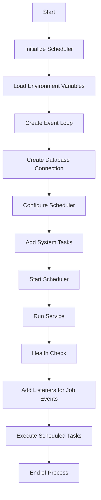

## 类结构

```
Scheduler (主类)
├── AppService (父类)
│   ├── __init__
│   ├── run_service
│   ├── cleanup
│   └── health_check
└── GraphExecutionJobArgs (模型类)
    ├── __init__
    ├── model_dump
    └── model_validate
```

## 全局变量及字段


### `_event_loop`
    
The shared event loop for asynchronous operations.

类型：`asyncio.AbstractEventLoop | None`
    


### `_event_loop_thread`
    
The thread running the event loop.

类型：`threading.Thread | None`
    


### `logger`
    
The logger for the module.

类型：`logging.Logger`
    


### `apscheduler_logger`
    
The logger for the APScheduler component.

类型：`logging.Logger`
    


### `config`
    
The configuration object.

类型：`Config`
    


### `SCHEDULER_OPERATION_TIMEOUT_SECONDS`
    
The timeout for scheduler operations in seconds.

类型：`int`
    


### `Scheduler.scheduler`
    
The scheduler instance.

类型：`BackgroundScheduler`
    


### `Scheduler.register_system_tasks`
    
Whether to register system tasks on initialization.

类型：`bool`
    


### `GraphExecutionJobArgs.schedule_id`
    
The ID of the schedule.

类型：`str | None`
    


### `GraphExecutionJobArgs.user_id`
    
The user ID.

类型：`str`
    


### `GraphExecutionJobArgs.graph_id`
    
The graph ID.

类型：`str`
    


### `GraphExecutionJobArgs.graph_version`
    
The version of the graph.

类型：`int`
    


### `GraphExecutionJobArgs.agent_name`
    
The name of the agent.

类型：`str | None`
    


### `GraphExecutionJobArgs.cron`
    
The cron expression for scheduling.

类型：`str`
    


### `GraphExecutionJobArgs.input_data`
    
The input data for the graph.

类型：`BlockInput`
    


### `GraphExecutionJobArgs.input_credentials`
    
The input credentials for the graph.

类型：`dict[str, CredentialsMetaInput]`
    
    

## 全局函数及方法

### _extract_schema_from_url

#### 描述

Extracts the schema from the DATABASE_URL and returns the schema and cleaned URL.

#### 参数

- `database_url`：`str`，The URL from which to extract the schema.

#### 返回值

- `tuple[str, str]`：A tuple containing the schema and the cleaned URL.

#### 流程图

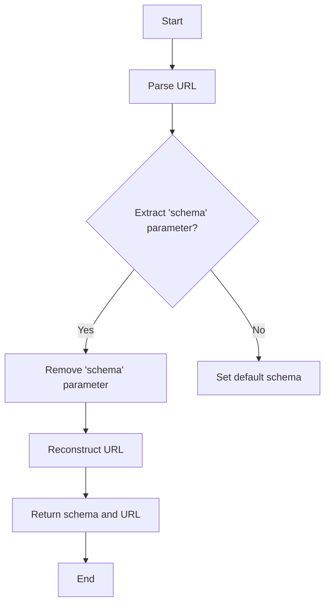

#### 带注释源码

```python
def _extract_schema_from_url(database_url) -> tuple[str, str]:
    """
    Extracts the schema from the DATABASE_URL and returns the schema and cleaned URL.
    """
    parsed_url = urlparse(database_url)
    query_params = parse_qs(parsed_url.query)

    # Extract the 'schema' parameter
    schema_list = query_params.pop("schema", None)
    schema = schema_list[0] if schema_list else "public"

    # Reconstruct the query string without the 'schema' parameter
    new_query = urlencode(query_params, doseq=True)
    new_parsed_url = parsed_url._replace(query=new_query)
    database_url_clean = str(urlunparse(new_parsed_url))

    return schema, database_url_clean
```

### job_listener

Logs job execution outcomes for better monitoring.

参数：

- `event`：`apscheduler.events.Event`，The event object that contains information about the job execution.

返回值：无

#### 流程图

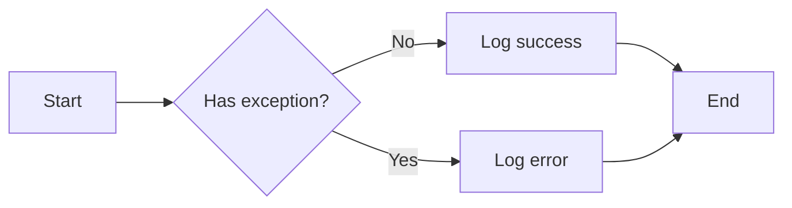

#### 带注释源码

```python
def job_listener(event):
    """Logs job execution outcomes for better monitoring."""
    if event.exception:
        logger.error(
            f"Job {event.job_id} failed: {type(event.exception).__name__}: {event.exception}"
        )
    else:
        logger.info(f"Job {event.job_id} completed successfully.")
```

### job_missed_listener

Logs when jobs are missed due to scheduling issues.

参数：

- `event`：`Event`，Represents the event that triggered the listener.

返回值：无

#### 流程图

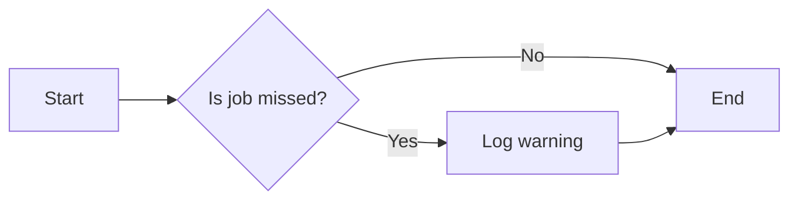

#### 带注释源码

```python
def job_missed_listener(event):
    """Logs when jobs are missed due to scheduling issues."""
    logger.warning(
        f"Job {event.job_id} was missed at scheduled time {event.scheduled_run_time}. "
        f"This can happen if the scheduler is overloaded or if previous executions are still running."
    )
```

### job_max_instances_listener

Logs when jobs hit max instances limit.

参数：

- `event`：`Event`，The event object containing information about the job that hit the max instances limit.

返回值：无

#### 流程图

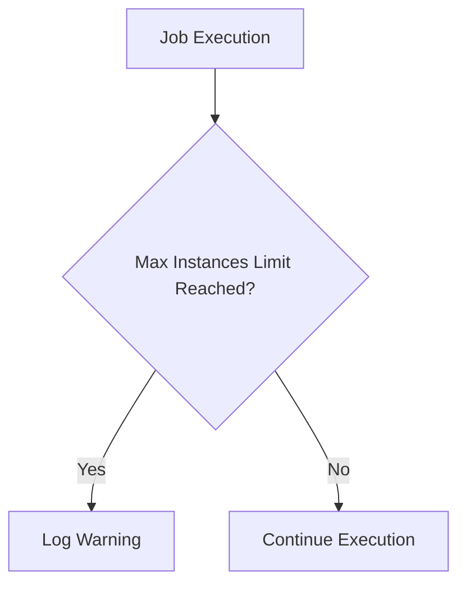

#### 带注释源码

```python
def job_max_instances_listener(event):
    """Logs when jobs hit max instances limit."""
    logger.warning(
        f"Job {event.job_id} execution was SKIPPED - max instances limit reached. "
        f"Previous execution(s) are still running. "
        f"Consider increasing max_instances or check why previous executions are taking too long."
    )
```

### get_event_loop

**描述**

`get_event_loop` 函数用于获取共享的事件循环。

**参数**

- 无

**返回值**

- `asyncio.AbstractEventLoop | None`：共享的事件循环对象，如果没有初始化则返回 `None`。

**流程图**

```mermaid
graph LR
A[get_event_loop()] --> B{检查_event_loop}
B -->|_event_loop is None| C[抛出 RuntimeError]
B -->|_event_loop is not None| D[返回 _event_loop]
```

#### 带注释源码

```python
@func_retry
def get_event_loop():
    """Get the shared event loop."""
    if _event_loop is None:
        raise RuntimeError("Event loop not initialized. Scheduler not started.")
    return _event_loop
```

### run_async

#### 描述

`run_async` 函数用于在共享的事件循环中运行一个协程，并等待其完成。

#### 参数

- `coro`：`coroutine`，要运行的协程。
- `timeout`：`float`，超时时间（默认为 5 分钟）。

#### 返回值

- `Any`，协程的返回值。

#### 流程图

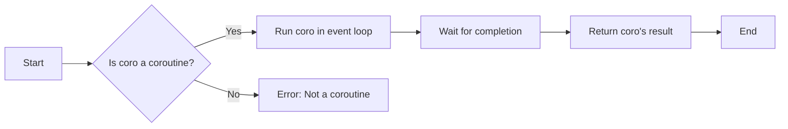

#### 带注释源码

```python
@func_retry
def run_async(coro, timeout: float = SCHEDULER_OPERATION_TIMEOUT_SECONDS):
    """Run a coroutine in the shared event loop and wait for completion."""
    loop = get_event_loop()
    future = asyncio.run_coroutine_threadsafe(coro, loop)
    try:
        return future.result(timeout=timeout)
    except Exception as e:
        logger.error(f"Async operation failed: {type(e).__name__}: {e}")
        raise
```

### execute_graph

#### 描述

`execute_graph` 函数用于在共享事件循环中执行图，并等待其完成。

#### 参数

- `**kwargs`：`dict`，包含用于执行图的参数。

#### 返回值

- 无返回值。

#### 流程图

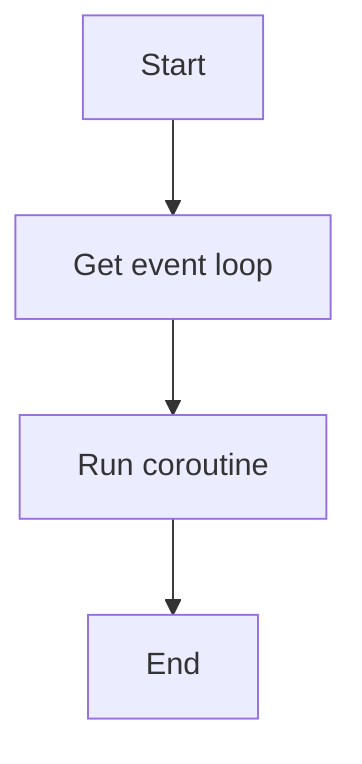

#### 带注释源码

```python
def execute_graph(**kwargs):
    """Execute graph in the shared event loop and wait for completion."""
    # Wait for completion to ensure job doesn't exit prematurely
    run_async(_execute_graph, **kwargs)
```

### execute_graph

**描述**

`execute_graph` 函数用于在共享事件循环中执行图，并等待其完成。

**参数**

- `**kwargs`：`dict`，包含用于执行图的参数。

**返回值**

- 无返回值。

#### 流程图


#### 带注释源码

```python
def execute_graph(**kwargs):
    """Execute graph in the shared event loop and wait for completion."""
    # Wait for completion to ensure job doesn't exit prematurely
    run_async(_execute_graph, **kwargs)
```

### _execute_graph

**描述**

`_execute_graph` 函数异步执行图，并处理可能发生的异常。

**参数**

- `**kwargs`：`dict`，包含用于执行图的参数。

**返回值**

- 无返回值。

#### 流程图

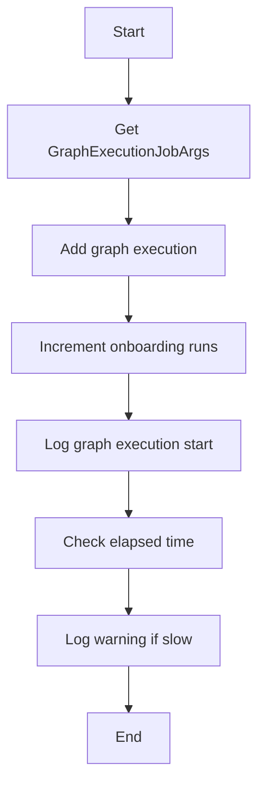

#### 带注释源码

```python
async def _execute_graph(**kwargs):
    args = GraphExecutionJobArgs(**kwargs)
    start_time = asyncio.get_event_loop().time()
    db = get_database_manager_async_client()
    try:
        logger.info(f"Executing recurring job for graph #{args.graph_id}")
        graph_exec: GraphExecutionWithNodes = await execution_utils.add_graph_execution(
            user_id=args.user_id,
            graph_id=args.graph_id,
            graph_version=args.graph_version,
            inputs=args.input_data,
            graph_credentials_inputs=args.input_credentials,
        )
        await db.increment_onboarding_runs(args.user_id)
        elapsed = asyncio.get_event_loop().time() - start_time
        logger.info(
            f"Graph execution started with ID {graph_exec.id} for graph {args.graph_id} "
            f"(took {elapsed:.2f}s to create and publish)"
        )
        if elapsed > 10:
            logger.warning(
                f"Graph execution {graph_exec.id} took {elapsed:.2f}s to create/publish - "
                f"this is unusually slow and may indicate resource contention"
            )
    except GraphNotFoundError as e:
        await _handle_graph_not_available(e, args, start_time)
    except GraphNotInLibraryError as e:
        await _handle_graph_not_available(e, args, start_time)
    except GraphValidationError:
        await _handle_graph_validation_error(args)
    except Exception as e:
        elapsed = asyncio.get_event_loop().time() - start_time
        logger.error(
            f"Error executing graph {args.graph_id} after {elapsed:.2f}s: "
            f"{type(e).__name__}: {e}"
        )
```

### `_handle_graph_validation_error`

#### 描述

该函数处理图形验证错误，记录错误信息，并尝试取消与图形相关的任何预定任务。

#### 参数

- `args`：`GraphExecutionJobArgs`，包含图形执行任务的参数。

#### 返回值

- 无返回值。

#### 流程图

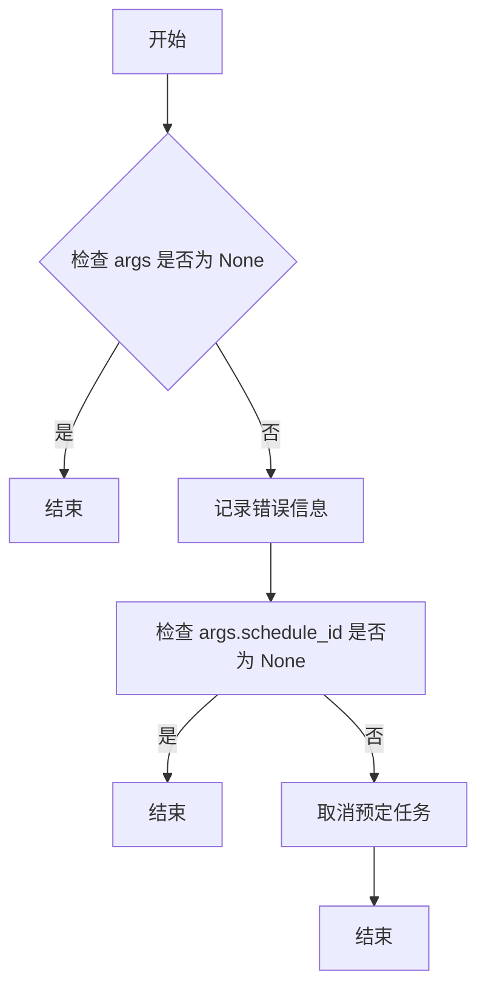

#### 带注释源码

```python
async def _handle_graph_validation_error(args: "GraphExecutionJobArgs") -> None:
    logger.error(
        f"Scheduled Graph {args.graph_id} failed validation. Unscheduling graph"
    )
    if args.schedule_id:
        scheduler_client = get_scheduler_client()
        await scheduler_client.delete_schedule(
            schedule_id=args.schedule_id,
            user_id=args.user_id,
        )
    else:
        logger.error(
            f"Unable to unschedule graph: {args.graph_id} as this is an old job with no associated schedule_id please remove manually"
        )
```

### `_handle_graph_not_available`

#### 描述

该函数处理当执行图失败时，因为图不存在或不在库中而导致的异常。

#### 参数

- `e`：`Exception`，异常对象，包含导致图不可用的原因。
- `args`：`GraphExecutionJobArgs`，包含图执行参数的模型。
- `start_time`：`float`，图执行开始的时间戳。

#### 返回值

- 无返回值。

#### 流程图

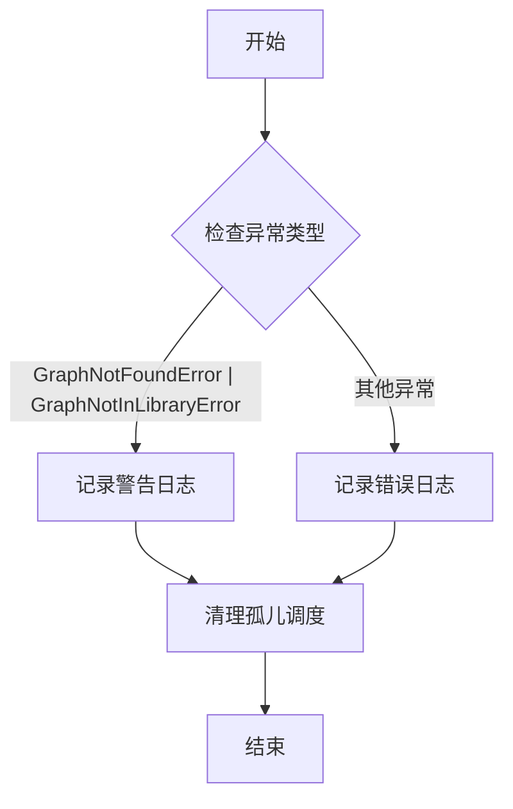

#### 带注释源码

```python
async def _handle_graph_not_available(
    e: Exception, args: "GraphExecutionJobArgs", start_time: float
) -> None:
    elapsed = asyncio.get_event_loop().time() - start_time
    logger.warning(
        f"Scheduled execution blocked for deleted/archived graph {args.graph_id} "
        f"(user {args.user_id}) after {elapsed:.2f}s: {e}"
    )
    # Clean up orphaned schedules for this graph
    await _cleanup_orphaned_schedules_for_graph(args.graph_id, args.user_id)
```

### _cleanup_orphaned_schedules_for_graph(graph_id: str, user_id: str)

#### 描述

该函数用于清理特定图形的孤儿调度。当图形执行失败时，如果图形不可用（例如，被删除或存档），则可能存在孤儿调度。此函数会查找并删除这些孤儿调度。

#### 参数

- `graph_id`：`str`，图形的唯一标识符。
- `user_id`：`str`，用户的唯一标识符。

#### 返回值

无返回值。

#### 流程图

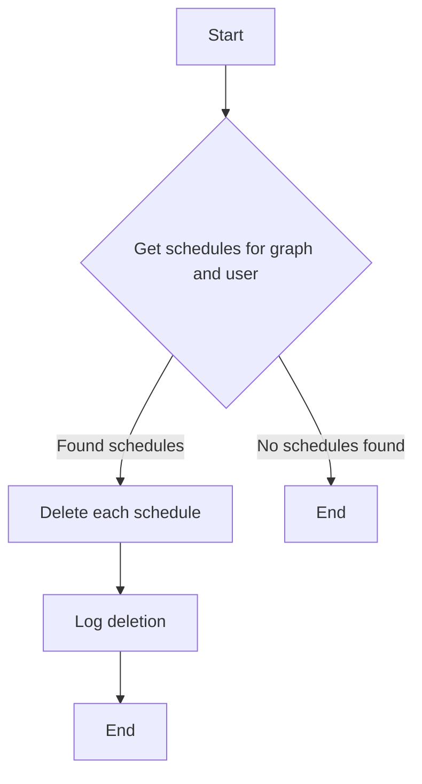

#### 带注释源码

```python
async def _cleanup_orphaned_schedules_for_graph(graph_id: str, user_id: str) -> None:
    """
    Clean up orphaned schedules for a specific graph when execution fails with GraphNotAccessibleError.
    This happens when an agent is pulled from the Marketplace or deleted
    but schedules still exist.
    """
    # Use scheduler client to access the scheduler service
    scheduler_client = get_scheduler_client()

    # Find all schedules for this graph and user
    schedules = await scheduler_client.get_execution_schedules(
        graph_id=graph_id, user_id=user_id
    )

    for schedule in schedules:
        try:
            await scheduler_client.delete_schedule(
                schedule_id=schedule.id, user_id=user_id
            )
            logger.info(
                f"Cleaned up orphaned schedule {schedule.id} for deleted/archived graph {graph_id}"
            )
        except Exception:
            logger.exception(
                f"Failed to delete orphaned schedule {schedule.id} for graph {graph_id}"
            )
```

### `cleanup_expired_files`

**描述**

该函数用于清理云存储中过期的文件。

**参数**

- 无

**返回值**

- 无

#### 流程图

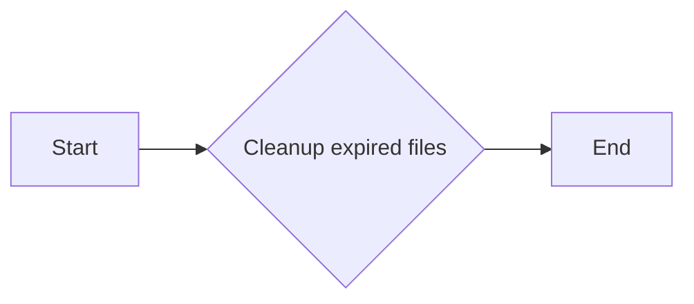

#### 带注释源码

```python
def cleanup_expired_files():
    """Clean up expired files from cloud storage."""
    # Wait for completion
    run_async(cleanup_expired_files_async())
```

### cleanup_oauth_tokens

**描述**

该函数用于清理数据库中过期的 OAuth 令牌。

**参数**

- 无

**返回值**

- 无

#### 流程图

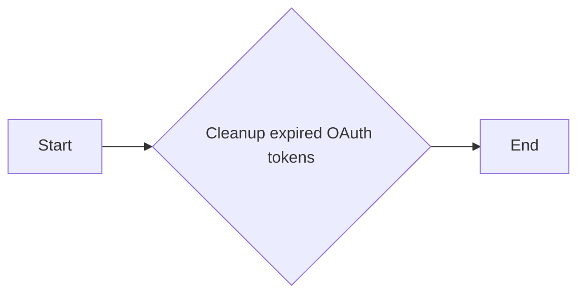

#### 带注释源码

```python
def cleanup_oauth_tokens():
    """Clean up expired OAuth tokens from the database."""

    # Wait for completion
    async def _cleanup():
        db = get_database_manager_async_client()
        return await db.cleanup_expired_oauth_tokens()

    run_async(_cleanup())
```

### execution_accuracy_alerts

该函数的核心功能是检查执行准确性，并在检测到准确性下降时发送警报。

#### 参数

- 无

#### 返回值

- 无

#### 流程图

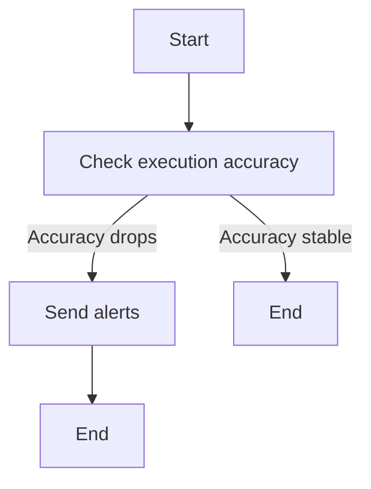

#### 带注释源码

```python
def execution_accuracy_alerts():
    """Check execution accuracy and send alerts if drops are detected."""
    return report_execution_accuracy_alerts()
```

### ensure_embeddings_coverage

**描述**

`ensure_embeddings_coverage` 函数确保所有内容类型（存储代理、块、文档）都有用于搜索的嵌入。它处理所有缺失的嵌入，直到每个内容类型达到 100% 的覆盖率。缺失的嵌入意味着内容在混合搜索中不可见。

**参数**

- 无

**返回值**

- `dict`，包含以下键：
  - `backfill`：包含以下键：
    - `processed`：处理的总嵌入数量。
    - `success`：成功处理的嵌入数量。
    - `failed`：失败处理的嵌入数量。
  - `cleanup`：包含以下键：
    - `deleted`：删除的孤儿嵌入数量。

#### 流程图

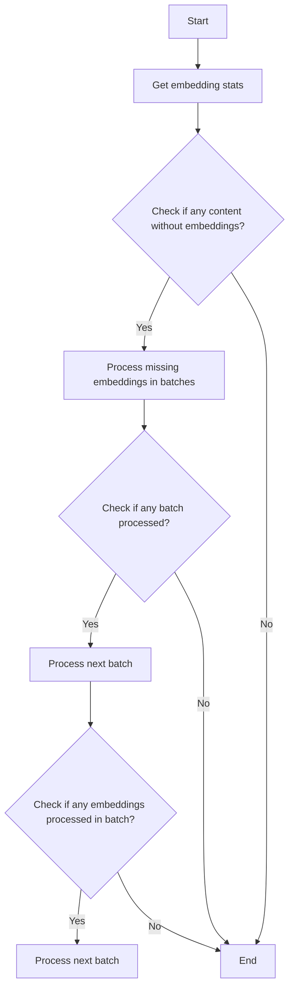

#### 带注释源码

```python
def ensure_embeddings_coverage():
    """
    Ensure all content types (store agents, blocks, docs) have embeddings for search.

    Processes ALL missing embeddings in batches of 10 per content type until 100% coverage.
    Missing embeddings = content invisible in hybrid search.

    Schedule: Runs every 6 hours (balanced between coverage and API costs).
    - Catches new content added between scheduled runs
    - Batch size 10 per content type: gradual processing to avoid rate limits
    - Manual trigger available via execute_ensure_embeddings_coverage endpoint
    """
    db_client = get_database_manager_client()
    stats = db_client.get_embedding_stats()

    # Check for error from get_embedding_stats() first
    if "error" in stats:
        logger.error(
            f"Failed to get embedding stats: {stats['error']} - skipping backfill"
        )
        return {
            "backfill": {"processed": 0, "success": 0, "failed": 0},
            "cleanup": {"deleted": 0},
            "error": stats["error"],
        }

    # Extract totals from new stats structure
    totals = stats.get("totals", {})
    without_embeddings = totals.get("without_embeddings", 0)
    coverage_percent = totals.get("coverage_percent", 0)

    total_processed = 0
    total_success = 0
    total_failed = 0

    if without_embeddings == 0:
        logger.info("All content has embeddings, skipping backfill")
    else:
        # Log per-content-type stats for visibility
        by_type = stats.get("by_type", {})
        for content_type, type_stats in by_type.items():
            if type_stats.get("without_embeddings", 0) > 0:
                logger.info(
                    f"{content_type}: {type_stats['without_embeddings']} items without embeddings "
                    f"({type_stats['coverage_percent']}% coverage)"
                )

        logger.info(
            f"Total: {without_embeddings} items without embeddings "
            f"({coverage_percent}% coverage) - processing all"
        )

        # Process in batches until no more missing embeddings
        while True:
            result = db_client.backfill_missing_embeddings(batch_size=100)

            total_processed += result["processed"]
            total_success += result["success"]
            total_failed += result["failed"]

            if result["processed"] == 0:
                # No more missing embeddings
                break

            if result["success"] == 0 and result["processed"] > 0:
                # All attempts in this batch failed - stop to avoid infinite loop
                logger.error(
                    f"All {result['processed']} embedding attempts failed - stopping backfill"
                )
                break

            # Small delay between batches to avoid rate limits
            time.sleep(1)

        logger.info(
            f"Embedding backfill completed: {total_success}/{total_processed} succeeded, "
            f"{total_failed} failed"
        )

    # Clean up orphaned embeddings for blocks and docs
    logger.info("Running cleanup for orphaned embeddings (blocks/docs)...")
    cleanup_result = db_client.cleanup_orphaned_embeddings()
    cleanup_totals = cleanup_result.get("totals", {})
    cleanup_deleted = cleanup_totals.get("deleted", 0)

    if cleanup_deleted > 0:
        logger.info(f"Cleanup completed: deleted {cleanup_deleted} orphaned embeddings")
        by_type = cleanup_result.get("by_type", {})
        for content_type, type_result in by_type.items():
            if type_result.get("deleted", 0) > 0:
                logger.info(
                    f"{content_type}: deleted {type_result['deleted']} orphaned embeddings"
                )
    else:
        logger.info("Cleanup completed: no orphaned embeddings found")

    return {
        "backfill": {
            "processed": total_processed,
            "success": total_success,
            "failed": total_failed,
        },
        "cleanup": {
            "deleted": cleanup_deleted,
        },
    }
```

### Scheduler.__init__

#### 描述

`Scheduler.__init__` 方法是 `Scheduler` 类的构造函数，用于初始化调度器实例。它设置调度器的基本配置，包括数据库连接、执行器配置、作业存储和监听器。

#### 参数

- `register_system_tasks`: `bool`，默认为 `True`。如果为 `True`，则注册系统任务。

#### 返回值

无

#### 流程图

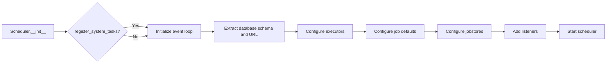

#### 带注释源码

```python
def __init__(self, register_system_tasks: bool = True):
    self.register_system_tasks = register_system_tasks

    # Initialize the event loop for async jobs
    global _event_loop
    _event_loop = asyncio.new_event_loop()

    # Use daemon thread since it should die with the main service
    global _event_loop_thread
    _event_loop_thread = threading.Thread(
        target=_event_loop.run_forever, daemon=True, name="SchedulerEventLoop"
    )
    _event_loop_thread.start()

    db_schema, db_url = _extract_schema_from_url(os.getenv("DIRECT_URL"))

    # Configure executors to limit concurrency without skipping jobs
    from apscheduler.executors.pool import ThreadPoolExecutor

    self.scheduler = BackgroundScheduler(
        executors={
            "default": ThreadPoolExecutor(
                max_workers=self.db_pool_size()
            ),  # Match DB pool size to prevent resource contention
        },
        job_defaults={
            "coalesce": True,  # Skip redundant missed jobs - just run the latest
            "max_instances": 1000,  # Effectively unlimited - never drop executions
            "misfire_grace_time": None,  # No time limit for missed jobs
        },
        jobstores={
            Jobstores.EXECUTION.value: SQLAlchemyJobStore(
                engine=create_engine(
                    url=db_url,
                    pool_size=self.db_pool_size(),
                    max_overflow=0,
                ),
                metadata=MetaData(schema=db_schema),
                tablename="apscheduler_jobs",
            ),
            Jobstores.BATCHED_NOTIFICATIONS.value: SQLAlchemyJobStore(
                engine=create_engine(
                    url=db_url,
                    pool_size=self.db_pool_size(),
                    max_overflow=0,
                ),
                metadata=MetaData(schema=db_schema),
                tablename="apscheduler_jobs_batched_notifications",
            ),
            # These don't really need persistence
            Jobstores.WEEKLY_NOTIFICATIONS.value: MemoryJobStore(),
        },
        logger=apscheduler_logger,
        timezone=ZoneInfo("UTC"),
    )

    if self.register_system_tasks:
        # Notification PROCESS WEEKLY SUMMARY
        # Runs every Monday at 9 AM UTC
        self.scheduler.add_job(
            process_weekly_summary,
            CronTrigger.from_crontab("0 9 * * 1"),
            id="process_weekly_summary",
            kwargs={},
            replace_existing=True,
            jobstore=Jobstores.WEEKLY_NOTIFICATIONS.value,
        )

        # Notification PROCESS EXISTING BATCHES
        # self.scheduler.add_job(
        #     process_existing_batches,
        #     id="process_existing_batches",
        #     CronTrigger.from_crontab("0 12 * * 5"),
        #     replace_existing=True,
        #     jobstore=Jobstores.BATCHED_NOTIFICATIONS.value,
        # )

        # Notification LATE EXECUTIONS ALERT
        self.scheduler.add_job(
            report_late_executions,
            id="report_late_executions",
            trigger="interval",
            replace_existing=True,
            seconds=config.execution_late_notification_threshold_secs,
            jobstore=Jobstores.EXECUTION.value,
        )

        # Block Error Rate Monitoring
        self.scheduler.add_job(
            report_block_error_rates,
            id="report_block_error_rates",
            trigger="interval",
            replace_existing=True,
            seconds=config.block_error_rate_check_interval_secs,
            jobstore=Jobstores.EXECUTION.value,
        )

        # Cloud Storage Cleanup - configurable interval
        self.scheduler.add_job(
            cleanup_expired_files,
            id="cleanup_expired_files",
            trigger="interval",
            replace_existing=True,
            seconds=config.cloud_storage_cleanup_interval_hours
            * 3600,  # Convert hours to seconds
            jobstore=Jobstores.EXECUTION.value,
        )

        # OAuth Token Cleanup - configurable interval
        self.scheduler.add_job(
            cleanup_oauth_tokens,
            id="cleanup_oauth_tokens",
            trigger="interval",
            replace_existing=True,
            seconds=config.oauth_token_cleanup_interval_hours
            * 3600,  # Convert hours to seconds
            jobstore=Jobstores.EXECUTION.value,
        )

        # Execution Accuracy Monitoring - configurable interval
        self.scheduler.add_job(
            execution_accuracy_alerts,
            id="report_execution_accuracy_alerts",
            trigger="interval",
            replace_existing=True,
            seconds=config.execution_accuracy_check_interval_hours
            * 3600,  # Convert hours to seconds
            jobstore=Jobstores.EXECUTION.value,
        )

        # Embedding Coverage - Every 6 hours
        # Ensures all approved agents have embeddings for hybrid search
        # Critical: missing embeddings = agents invisible in search
        self.scheduler.add_job(
            ensure_embeddings_coverage,
            id="ensure_embeddings_coverage",
            trigger="interval",
            hours=6,
            replace_existing=True,
            max_instances=1,  # Prevent overlapping runs
            jobstore=Jobstores.EXECUTION.value,
        )

    self.scheduler.add_listener(job_listener, EVENT_JOB_EXECUTED | EVENT_JOB_ERROR)
    self.scheduler.add_listener(job_missed_listener, EVENT_JOB_MISSED)
    self.scheduler.add_listener(job_max_instances_listener, EVENT_JOB_MAX_INSTANCES)
    self.scheduler.start()
```

### `{名称}`

`Scheduler.get_port`

获取执行调度器的端口号。

### 描述

`Scheduler.get_port` 方法是 `Scheduler` 类的一个类方法，用于获取执行调度器的端口号。这个端口号用于外部服务与调度器进行通信。

### 参数

- 无

### 返回值

- `int`：执行调度器的端口号。

### 流程图

```mermaid
graph LR
A[Scheduler.get_port()] --> B{返回端口号}
```

### 带注释源码

```python
# Scheduler 类定义
class Scheduler(AppService):
    # ...

    @classmethod
    def get_port(cls) -> int:
        return config.execution_scheduler_port

    # ...
```

这段代码中，`Scheduler.get_port` 方法直接返回了 `config` 对象中 `execution_scheduler_port` 字段的值，该字段存储了执行调度器的端口号。

### Scheduler.db_pool_size

该函数用于获取调度器数据库连接池的大小。

#### 参数

- 无

#### 返回值

- `int`：数据库连接池的大小

#### 流程图

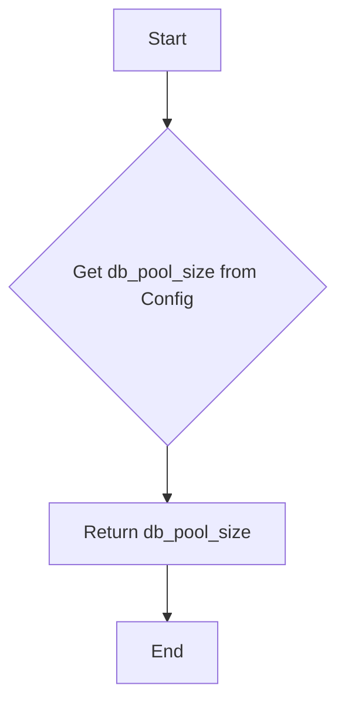

#### 带注释源码

```python
def db_pool_size(cls) -> int:
    return config.scheduler_db_pool_size
```

### `Scheduler.health_check`

#### 描述

`Scheduler.health_check` 方法用于检查调度器是否正在运行，并返回一个表示健康状态的字符串。

#### 参数

- 无

#### 返回值

- `str`，表示调度器的健康状态。

#### 流程图

```mermaid
graph LR
A[开始] --> B{调度器是否正在运行?}
B -- 是 --> C[返回 "健康"]
B -- 否 --> D[返回 "不健康"]
C --> E[结束]
D --> E
```

#### 带注释源码

```python
async def health_check(self) -> str:
    # Thread-safe health check with proper initialization handling
    if not hasattr(self, "scheduler"):
        raise UnhealthyServiceError("Scheduler is still initializing")

    # Check if we're in the middle of cleanup
    if self._shutting_down:
        return await super().health_check()

    # Normal operation - check if scheduler is running
    if not self.scheduler.running:
        raise UnhealthyServiceError("Scheduler is not running")

    return await super().health_check()
```

### run_service

该函数是`Scheduler`类的一个实例方法，用于启动调度器服务。

#### 描述

`run_service`方法负责初始化调度器，设置定时任务，并启动调度器循环。

#### 参数

- 无

#### 返回值

- 无

#### 流程图

```mermaid
graph LR
A[Start] --> B[Load .env]
B --> C[Create Event Loop]
C --> D[Extract Database Schema]
D --> E[Create Scheduler]
E --> F[Add System Tasks]
F --> G[Start Scheduler]
G --> H[Run Service]
H --> I[End]
```

#### 带注释源码

```python
def run_service(self):
    load_dotenv()

    # Initialize the event loop for async jobs
    global _event_loop
    _event_loop = asyncio.new_event_loop()

    # Use daemon thread since it should die with the main service
    global _event_loop_thread
    _event_loop_thread = threading.Thread(
        target=_event_loop.run_forever, daemon=True, name="SchedulerEventLoop"
    )
    _event_loop_thread.start()

    db_schema, db_url = _extract_schema_from_url(os.getenv("DIRECT_URL"))

    # Configure executors to limit concurrency without skipping jobs
    from apscheduler.executors.pool import ThreadPoolExecutor

    self.scheduler = BackgroundScheduler(
        executors={
            "default": ThreadPoolExecutor(
                max_workers=self.db_pool_size()
            ),  # Match DB pool size to prevent resource contention
        },
        job_defaults={
            "coalesce": True,  # Skip redundant missed jobs - just run the latest
            "max_instances": 1000,  # Effectively unlimited - never drop executions
            "misfire_grace_time": None,  # No time limit for missed jobs
        },
        jobstores={
            Jobstores.EXECUTION.value: SQLAlchemyJobStore(
                engine=create_engine(
                    url=db_url,
                    pool_size=self.db_pool_size(),
                    max_overflow=0,
                ),
                metadata=MetaData(schema=db_schema),
                # this one is pre-existing so it keeps the
                # default table name.
                tablename="apscheduler_jobs",
            ),
            Jobstores.BATCHED_NOTIFICATIONS.value: SQLAlchemyJobStore(
                engine=create_engine(
                    url=db_url,
                    pool_size=self.db_pool_size(),
                    max_overflow=0,
                ),
                metadata=MetaData(schema=db_schema),
                tablename="apscheduler_jobs_batched_notifications",
            ),
            # These don't really need persistence
            Jobstores.WEEKLY_NOTIFICATIONS.value: MemoryJobStore(),
        },
        logger=apscheduler_logger,
        timezone=ZoneInfo("UTC"),
    )

    if self.register_system_tasks:
        # Notification PROCESS WEEKLY SUMMARY
        # Runs every Monday at 9 AM UTC
        self.scheduler.add_job(
            process_weekly_summary,
            CronTrigger.from_crontab("0 9 * * 1"),
            id="process_weekly_summary",
            kwargs={},
            replace_existing=True,
            jobstore=Jobstores.WEEKLY_NOTIFICATIONS.value,
        )

        # Notification PROCESS EXISTING BATCHES
        # self.scheduler.add_job(
        #     process_existing_batches,
        #     id="process_existing_batches",
        #     CronTrigger.from_crontab("0 12 * * 5"),
        #     replace_existing=True,
        #     jobstore=Jobstores.BATCHED_NOTIFICATIONS.value,
        # )

        # Notification LATE EXECUTIONS ALERT
        self.scheduler.add_job(
            report_late_executions,
            id="report_late_executions",
            trigger="interval",
            replace_existing=True,
            seconds=config.execution_late_notification_threshold_secs,
            jobstore=Jobstores.EXECUTION.value,
        )

        # Block Error Rate Monitoring
        self.scheduler.add_job(
            report_block_error_rates,
            id="report_block_error_rates",
            trigger="interval",
            replace_existing=True,
            seconds=config.block_error_rate_check_interval_secs,
            jobstore=Jobstores.EXECUTION.value,
        )

        # Cloud Storage Cleanup - configurable interval
        self.scheduler.add_job(
            cleanup_expired_files,
            id="cleanup_expired_files",
            trigger="interval",
            replace_existing=True,
            seconds=config.cloud_storage_cleanup_interval_hours
            * 3600,  # Convert hours to seconds
            jobstore=Jobstores.EXECUTION.value,
        )

        # OAuth Token Cleanup - configurable interval
        self.scheduler.add_job(
            cleanup_oauth_tokens,
            id="cleanup_oauth_tokens",
            trigger="interval",
            replace_existing=True,
            seconds=config.oauth_token_cleanup_interval_hours
            * 3600,  # Convert hours to seconds
            jobstore=Jobstores.EXECUTION.value,
        )

        # Execution Accuracy Monitoring - configurable interval
        self.scheduler.add_job(
            execution_accuracy_alerts,
            id="report_execution_accuracy_alerts",
            trigger="interval",
            replace_existing=True,
            seconds=config.execution_accuracy_check_interval_hours
            * 3600,  # Convert hours to seconds
            jobstore=Jobstores.EXECUTION.value,
        )

        # Embedding Coverage - Every 6 hours
        # Ensures all approved agents have embeddings for hybrid search
        # Critical: missing embeddings = agents invisible in search
        self.scheduler.add_job(
            ensure_embeddings_coverage,
            id="ensure_embeddings_coverage",
            trigger="interval",
            hours=6,
            replace_existing=True,
            max_instances=1,  # Prevent overlapping runs
            jobstore=Jobstores.EXECUTION.value,
        )

    self.scheduler.add_listener(job_listener, EVENT_JOB_EXECUTED | EVENT_JOB_ERROR)
    self.scheduler.add_listener(job_missed_listener, EVENT_JOB_MISSED)
    self.scheduler.add_listener(job_max_instances_listener, EVENT_JOB_MAX_INSTANCES)
    self.scheduler.start()

    # Run embedding backfill immediately on startup
    # This ensures blocks/docs are searchable right away, not after 6 hours
    # Safe to run on multiple pods - uses upserts and checks for existing embeddings
    if self.register_system_tasks:
        logger.info("Running embedding backfill on startup...")
        try:
            result = ensure_embeddings_coverage()
            logger.info(f"Startup embedding backfill complete: {result}")
        except Exception as e:
            logger.error(f"Startup embedding backfill failed: {e}")
            # Don't fail startup - the scheduled job will retry later

    # Keep the service running since BackgroundScheduler doesn't block
    super().run_service()
```

### `Scheduler.cleanup`

该函数用于关闭调度器并清理相关资源。

#### 参数

- 无

#### 返回值

- 无

#### 流程图

```mermaid
graph LR
A[开始] --> B{调度器存在?}
B -- 是 --> C[关闭调度器]
B -- 否 --> D[结束]
C --> D
```

#### 带注释源码

```python
def cleanup(self):
    if self.scheduler:
        logger.info("⏳ Shutting down scheduler...")
        self.scheduler.shutdown(wait=True)

    global _event_loop
    if _event_loop:
        logger.info("⏳ Closing event loop...")
        _event_loop.call_soon_threadsafe(_event_loop.stop)

    global _event_loop_thread
    if _event_loop_thread:
        logger.info("⏳ Waiting for event loop thread to finish...")
        _event_loop_thread.join(timeout=SCHEDULER_OPERATION_TIMEOUT_SECONDS)

    super().cleanup()
```

### add_graph_execution_schedule

**描述**

该函数用于为用户添加一个图形执行计划。它接受用户ID、图形ID、图形版本、cron表达式、输入数据和输入凭据作为参数，并返回一个包含图形执行计划信息的对象。

**参数**

- `user_id`：`str`，用户ID。
- `graph_id`：`str`，图形ID。
- `graph_version`：`int`，图形版本。
- `cron`：`str`，cron表达式，用于定义执行计划的时间。
- `input_data`：`BlockInput`，图形输入数据。
- `input_credentials`：`dict[str, CredentialsMetaInput]`，图形输入凭据。
- `name`：`Optional[str]`，图形执行计划的名称，可选。
- `user_timezone`：`Optional[str]`，用户时区，可选。

**返回值**

- `GraphExecutionJobInfo`，包含图形执行计划信息的对象。

#### 流程图

```mermaid
graph LR
A[Start] --> B{Validate graph}
B -->|Success| C[Add job to scheduler]
B -->|Failure| D[Return error]
C --> E[Return job info]
D --> F[End]
```

#### 带注释源码

```python
@expose
def add_graph_execution_schedule(
    self,
    user_id: str,
    graph_id: str,
    graph_version: int,
    cron: str,
    input_data: BlockInput,
    input_credentials: dict[str, CredentialsMetaInput],
    name: Optional[str] = None,
    user_timezone: str | None = None,
) -> GraphExecutionJobInfo:
    # Validate the graph before scheduling to prevent runtime failures
    run_async(
        execution_utils.validate_and_construct_node_execution_input(
            graph_id=graph_id,
            user_id=user_id,
            graph_inputs=input_data,
            graph_version=graph_version,
            graph_credentials_inputs=input_credentials,
        )
    )

    # Use provided timezone or default to UTC
    if not user_timezone:
        user_timezone = "UTC"
        logger.warning(
            f"No timezone provided for user {user_id}, using UTC for scheduling. "
            f"Client should pass user's timezone for correct scheduling."
        )

    logger.info(
        f"Scheduling job for user {user_id} with timezone {user_timezone} (cron: {cron})"
    )
    schedule_id = str(uuid.uuid4())

    job_args = GraphExecutionJobArgs(
        schedule_id=schedule_id,
        user_id=user_id,
        graph_id=graph_id,
        graph_version=graph_version,
        agent_name=name,
        cron=cron,
        input_data=input_data,
        input_credentials=input_credentials,
    )
    job = self.scheduler.add_job(
        execute_graph,
        kwargs=job_args.model_dump(),
        name=name,
        trigger=CronTrigger.from_crontab(cron, timezone=user_timezone),
        jobstore=Jobstores.EXECUTION.value,
        replace_existing=True,
        id=schedule_id,
    )
    logger.info(
        f"Added job {job.id} with cron schedule '{cron}' in timezone {user_timezone}, input data: {input_data}"
    )
    return GraphExecutionJobInfo.from_db(job_args, job)
```

### delete_graph_execution_schedule

删除图形执行计划

参数：

- `schedule_id`：`str`，图形执行计划的唯一标识符
- `user_id`：`str`，用户ID，用于验证用户权限

返回值：`GraphExecutionJobInfo`，图形执行计划的详细信息

#### 流程图

```mermaid
graph LR
A[开始] --> B{检查作业是否存在}
B -->|是| C[删除作业]
B -->|否| D[抛出错误]
C --> E[结束]
D --> F[结束]
```

#### 带注释源码

```python
@expose
def delete_graph_execution_schedule(self, schedule_id: str, user_id: str) -> GraphExecutionJobInfo:
    job = self.scheduler.get_job(schedule_id, jobstore=Jobstores.EXECUTION.value)
    if not job:
        raise NotFoundError(f"Job #{schedule_id} not found.")

    job_args = GraphExecutionJobArgs(**job.kwargs)
    if job_args.user_id != user_id:
        raise NotAuthorizedError("User ID does not match the job's user ID")

    logger.info(f"Deleting job {schedule_id}")
    job.remove()

    return GraphExecutionJobInfo.from_db(job_args, job)
```

### get_graph_execution_schedules

该函数用于获取指定图的所有执行计划。

#### 参数

- `graph_id`: `str | None`，可选，指定要获取执行计划的图ID。
- `user_id`: `str | None`，可选，指定要获取执行计划的用户ID。

#### 返回值

- `list[GraphExecutionJobInfo]`，包含所有匹配的执行计划信息。

#### 流程图

```mermaid
graph LR
A[开始] --> B{检查参数}
B -->|graph_id 和 user_id 都为 None| C[获取所有执行计划]
B -->|graph_id 或 user_id 至少有一个不为 None| D{获取匹配的执行计划}
C --> E[结束]
D --> E
```

#### 带注释源码

```python
@expose
def get_graph_execution_schedules(
    self, graph_id: str | None = None, user_id: str | None = None
) -> list[GraphExecutionJobInfo]:
    jobs: list[JobObj] = self.scheduler.get_jobs(jobstore=Jobstores.EXECUTION.value)
    schedules = []
    for job in jobs:
        logger.debug(
            f"Found job {job.id} with cron schedule {job.trigger} and args {job.kwargs}"
        )
        try:
            job_args = GraphExecutionJobArgs.model_validate(job.kwargs)
        except ValidationError:
            continue
        if (
            job.next_run_time is not None
            and (graph_id is None or job_args.graph_id == graph_id)
            and (user_id is None or job_args.user_id == user_id)
        ):
            schedules.append(GraphExecutionJobInfo.from_db(job_args, job))
    return schedules
```

### execute_process_existing_batches

该函数执行现有的批次处理。

#### 参数

- `kwargs`：`dict`，包含执行批次所需的参数。

#### 返回值

无返回值。

#### 流程图

```mermaid
graph TD
    A[Start] --> B[Process existing batches]
    B --> C[End]
```

#### 带注释源码

```python
@expose
def execute_process_existing_batches(self, kwargs: dict):
    process_existing_batches(**kwargs)
```

### execute_process_weekly_summary

该函数执行每周总结的处理过程。

参数：

- 无

返回值：`None`，无返回值

#### 流程图

```mermaid
graph TD
    A[Start] --> B[process_weekly_summary]
    B --> C[End]
```

#### 带注释源码

```python
def execute_process_weekly_summary(self):
    process_weekly_summary()
```

### execute_report_late_executions

该函数用于报告延迟执行的任务。

#### 参数

- 无

#### 返回值

- `Optional[GraphExecutionJobInfo]`，表示执行报告的结果，如果没有延迟执行的任务，则返回 `None`。

#### 流程图

```mermaid
graph TD
    A[开始] --> B{检查延迟执行的任务}
    B -->|是| C[报告延迟执行的任务]
    B -->|否| D[结束]
    C --> E[结束]
```

#### 带注释源码

```python
@expose
def execute_report_late_executions(self):
    return report_late_executions()
```

### execute_report_block_error_rates

该函数用于报告块错误率。

#### 参数

- 无

#### 返回值

- 无

#### 流程图

```mermaid
graph TD
    A[Start] --> B[Report block error rates]
    B --> C[End]
```

#### 带注释源码

```python
def execute_report_block_error_rates(self):
    """Report block error rates."""
    return report_block_error_rates()
```

### execute_cleanup_expired_files

手动触发清理过期云存储文件。

参数：

- 无

返回值：`None`，无返回值

#### 流程图

```mermaid
graph LR
A[开始] --> B{调用cleanup_expired_files()}
B --> C[结束]
```

#### 带注释源码

```python
@expose
def execute_cleanup_expired_files(self):
    """Manually trigger cleanup of expired cloud storage files."""
    return cleanup_expired_files()
```

### execute_cleanup_oauth_tokens

手动触发清理过期的 OAuth 令牌。

参数：

- 无

返回值：`None`，无返回值

#### 流程图

```mermaid
graph TD
    A[Start] --> B[Get database manager async client]
    B --> C[Cleanup expired OAuth tokens]
    C --> D[End]
```

#### 带注释源码

```python
def execute_cleanup_oauth_tokens():
    """Manually trigger cleanup of expired OAuth tokens."""
    # Wait for completion
    async def _cleanup():
        db = get_database_manager_async_client()
        return await db.cleanup_expired_oauth_tokens()

    run_async(_cleanup())
```

### execute_report_execution_accuracy_alerts

该函数手动触发执行准确性警报检查。

#### 参数

- 无

#### 返回值

- `None`，无返回值

#### 流程图

```mermaid
graph TD
    A[Start] --> B[Call report_execution_accuracy_alerts()]
    B --> C[End]
```

#### 带注释源码

```python
def execute_report_execution_accuracy_alerts(self):
    """Manually trigger execution accuracy alert checking."""
    return execution_accuracy_alerts()
```

### execute_ensure_embeddings_coverage

手动触发嵌入覆盖确保，为批准的存储代理填充嵌入。

参数：

- 无

返回值：`dict`，包含处理和清理的结果统计信息

#### 流程图

```mermaid
graph TD
    A[Start] --> B[Get embedding stats]
    B --> C{Check if all content has embeddings}
    C -- Yes --> D[Log info: All content has embeddings, skip backfill]
    C -- No --> E[Log info: Process all missing embeddings]
    E --> F[Loop until no more missing embeddings]
    F --> G[Process in batches until no more missing embeddings]
    G --> H[Log info: Embedding backfill completed]
    H --> I[Run cleanup for orphaned embeddings (blocks/docs)]
    I --> J[Log info: Cleanup completed]
    J --> K[End]
```

#### 带注释源码

```python
def execute_ensure_embeddings_coverage():
    """
    Ensure all content types (store agents, blocks, docs) have embeddings for search.

    Processes ALL missing embeddings in batches of 10 per content type until 100% coverage.
    Missing embeddings = content invisible in hybrid search.

    Schedule: Runs every 6 hours (balanced between coverage and API costs).
    - Catches new content added between scheduled runs
    - Batch size 10 per content type: gradual processing to avoid rate limits
    - Manual trigger available via execute_ensure_embeddings_coverage endpoint
    """
    db_client = get_database_manager_client()
    stats = db_client.get_embedding_stats()

    # Check for error from get_embedding_stats() first
    if "error" in stats:
        logger.error(
            f"Failed to get embedding stats: {stats['error']} - skipping backfill"
        )
        return {
            "backfill": {"processed": 0, "success": 0, "failed": 0},
            "cleanup": {"deleted": 0},
            "error": stats["error"],
        }

    # Extract totals from new stats structure
    totals = stats.get("totals", {})
    without_embeddings = totals.get("without_embeddings", 0)
    coverage_percent = totals.get("coverage_percent", 0)

    total_processed = 0
    total_success = 0
    total_failed = 0

    if without_embeddings == 0:
        logger.info("All content has embeddings, skipping backfill")
    else:
        # Log per-content-type stats for visibility
        by_type = stats.get("by_type", {})
        for content_type, type_stats in by_type.items():
            if type_stats.get("without_embeddings", 0) > 0:
                logger.info(
                    f"{content_type}: {type_stats['without_embeddings']} items without embeddings "
                    f"({type_stats['coverage_percent']}% coverage)"
                )

        logger.info(
            f"Total: {without_embeddings} items without embeddings "
            f"({coverage_percent}% coverage) - processing all"
        )

        # Process in batches until no more missing embeddings
        while True:
            result = db_client.backfill_missing_embeddings(batch_size=100)

            total_processed += result["processed"]
            total_success += result["success"]
            total_failed += result["failed"]

            if result["processed"] == 0:
                # No more missing embeddings
                break

            if result["success"] == 0 and result["processed"] > 0:
                # All attempts in this batch failed - stop to avoid infinite loop
                logger.error(
                    f"All {result['processed']} embedding attempts failed - stopping backfill"
                )
                break

            # Small delay between batches to avoid rate limits
            time.sleep(1)

        logger.info(
            f"Embedding backfill completed: {total_success}/{total_processed} succeeded, "
            f"{total_failed} failed"
        )

    # Clean up orphaned embeddings for blocks and docs
    logger.info("Running cleanup for orphaned embeddings (blocks/docs)...")
    cleanup_result = db_client.cleanup_orphaned_embeddings()
    cleanup_totals = cleanup_result.get("totals", {})
    cleanup_deleted = cleanup_totals.get("deleted", 0)

    if cleanup_deleted > 0:
        logger.info(f"Cleanup completed: deleted {cleanup_deleted} orphaned embeddings")
        by_type = cleanup_result.get("by_type", {})
        for content_type, type_result in by_type.items():
            if type_result.get("deleted", 0) > 0:
                logger.info(
                    f"{content_type}: deleted {type_result['deleted']} orphaned embeddings"
                )
    else:
        logger.info("Cleanup completed: no orphaned embeddings found")

    return {
        "backfill": {
            "processed": total_processed,
            "success": total_success,
            "failed": total_failed,
        },
        "cleanup": {
            "deleted": cleanup_deleted,
        },
    }
```

### GraphExecutionJobArgs.__init__

GraphExecutionJobArgs 类的构造函数用于初始化 GraphExecutionJobArgs 对象。

#### 描述

GraphExecutionJobArgs 类的构造函数用于创建一个新的 GraphExecutionJobArgs 对象，它包含用于调度和执行图执行的参数。

#### 参数

- `schedule_id`: `str | None`，表示图执行的调度 ID。
- `user_id`: `str`，表示用户 ID。
- `graph_id`: `str`，表示图 ID。
- `graph_version`: `int`，表示图版本。
- `agent_name`: `str | None`，表示代理名称。
- `cron`: `str`，表示 cron 表达式。
- `input_data`: `BlockInput`，表示输入数据。
- `input_credentials`: `dict[str, CredentialsMetaInput]`，表示输入凭证。

#### 返回值

无返回值。

#### 流程图

```mermaid
graph LR
A[GraphExecutionJobArgs.__init__] --> B{参数}
B --> C{schedule_id}
B --> D{user_id}
B --> E{graph_id}
B --> F{graph_version}
B --> G{agent_name}
B --> H{cron}
B --> I{input_data}
B --> J{input_credentials}
```

#### 带注释源码

```python
class GraphExecutionJobArgs(BaseModel):
    schedule_id: str | None = None
    user_id: str
    graph_id: str
    graph_version: int
    agent_name: str | None = None
    cron: str
    input_data: BlockInput
    input_credentials: dict[str, CredentialsMetaInput] = Field(default_factory=dict)

    def __init__(self, **kwargs):
        super().__init__(**kwargs)
```

### GraphExecutionJobArgs.model_dump

该函数用于将`GraphExecutionJobArgs`类的实例转换为字典，以便将其作为参数传递给其他函数。

#### 描述

该函数将`GraphExecutionJobArgs`类的实例转换为字典，以便将其作为参数传递给其他函数。这允许将实例的状态和属性转换为可序列化的格式，以便在不同的组件之间传递。

#### 参数

- `self`：`GraphExecutionJobArgs`类的实例。

#### 返回值

- `dict`：包含`GraphExecutionJobArgs`实例属性的字典。

#### 流程图

```mermaid
graph LR
A[GraphExecutionJobArgs] --> B[.model_dump()]
B --> C[dict]
```

#### 带注释源码

```python
class GraphExecutionJobArgs(BaseModel):
    # ... (其他字段和方法)

    def model_dump(self):
        """
        Converts the instance to a dictionary containing its properties.
        """
        return self.dict()
```

### `GraphExecutionJobArgs.model_validate`

该函数用于验证和解析`GraphExecutionJobArgs`模型的数据。

#### 参数

- `kwargs`：`dict`，包含用于创建`GraphExecutionJobArgs`实例的键值对。

#### 返回值

- `GraphExecutionJobArgs`：验证后的`GraphExecutionJobArgs`实例。

#### 流程图

```mermaid
graph LR
A[开始] --> B{验证kwargs}
B -->|成功| C[创建GraphExecutionJobArgs实例]
B -->|失败| D[抛出ValidationError]
C --> E[结束]
D --> E
```

#### 带注释源码

```python
from pydantic import BaseModel, ValidationError

class GraphExecutionJobArgs(BaseModel):
    schedule_id: str | None = None
    user_id: str
    graph_id: str
    graph_version: int
    agent_name: str | None = None
    cron: str
    input_data: BlockInput
    input_credentials: dict[str, CredentialsMetaInput] = Field(default_factory=dict)

    @classmethod
    def model_validate(cls, kwargs: dict) -> "GraphExecutionJobArgs":
        try:
            return cls(**kwargs)
        except ValidationError as e:
            raise e
```

## 关键组件


### 张量索引与惰性加载

张量索引与惰性加载是用于高效处理大规模数据集的关键组件，它允许在需要时才加载数据，从而减少内存消耗并提高性能。

### 反量化支持

反量化支持是用于优化模型性能的关键组件，它允许模型在量化过程中保持精度，从而提高模型的运行速度和降低内存消耗。

### 量化策略

量化策略是用于优化模型性能的关键组件，它通过将模型的权重和激活值从浮点数转换为整数来减少模型的内存占用和加速模型的推理速度。


## 问题及建议


### 已知问题

-   **全局变量和函数的初始化**：代码中存在多个全局变量和函数，如 `_event_loop`、`_event_loop_thread`、`config` 等，这些变量和函数的初始化在代码的不同位置进行，可能导致初始化顺序的问题。
-   **异常处理**：代码中存在一些异常处理，但可能不够全面。例如，在 `run_async` 函数中，所有异常都被捕获并记录，但没有对异常进行分类处理。
-   **代码重复**：在 `Scheduler` 类中，存在多个 `expose` 装饰器用于暴露方法，这可能导致代码重复。
-   **日志记录**：代码中存在大量的日志记录，但可能缺乏对日志级别的控制，导致日志输出过于冗余。

### 优化建议

-   **全局变量和函数的初始化**：将全局变量和函数的初始化集中在一个地方，例如在 `__init__` 方法中，以确保初始化顺序的正确性。
-   **异常处理**：对异常进行分类处理，例如将业务异常和系统异常分开处理，并给出相应的错误信息。
-   **代码重复**：将 `expose` 装饰器应用于类级别，而不是方法级别，以减少代码重复。
-   **日志记录**：根据不同的日志级别进行日志记录，例如使用 `INFO`、`WARNING`、`ERROR` 级别，并避免在 `DEBUG` 级别记录过多的信息。
-   **代码结构**：考虑将一些功能模块化，例如将 `Scheduler` 类中的方法拆分成更小的类或模块，以提高代码的可读性和可维护性。
-   **性能优化**：对代码进行性能优化，例如减少不必要的数据库查询、优化循环结构等。
-   **安全性**：对代码进行安全性检查，例如防止 SQL 注入、XSS 攻击等。


## 其它


### 设计目标与约束

- 设计目标：
  - 实现一个可扩展的调度器，能够处理多种类型的任务，包括定期执行的任务和基于cron表达式的任务。
  - 提供一个API接口，允许用户添加、删除和获取任务调度信息。
  - 确保任务执行的准确性和可靠性，包括错误处理和异常管理。
  - 提供监控和日志记录功能，以便于跟踪任务执行情况。

- 约束：
  - 任务执行时间不能超过预设的超时时间。
  - 任务调度必须考虑时区差异。
  - 任务执行过程中，应避免资源竞争和死锁。
  - API接口应具有良好的可扩展性和可维护性。

### 错误处理与异常设计

- 错误处理：
  - 对于任务执行过程中出现的异常，应记录详细的错误信息，并通知相关责任人。
  - 对于无法恢复的异常，应尝试重新调度任务。
  - 对于可恢复的异常，应记录错误信息，并等待下一次执行尝试。

- 异常设计：
  - 定义自定义异常类，用于处理特定类型的错误。
  - 异常类应包含错误信息和错误代码，以便于调试和定位问题。

### 数据流与状态机

- 数据流：
  - 用户通过API接口提交任务调度请求。
  - 调度器解析请求，并将任务信息存储到数据库中。
  - 调度器根据任务类型和cron表达式，安排任务执行时间。
  - 任务执行完成后，调度器更新任务状态，并记录执行结果。

- 状态机：
  - 任务状态包括：待执行、执行中、已完成、已取消、已失败。
  - 状态转换规则：
    - 待执行 → 执行中：任务到达执行时间。
    - 执行中 → 已完成：任务执行成功。
    - 执行中 → 已失败：任务执行失败。
    - 已完成 → 已取消：用户取消任务。
    - 已失败 → 待执行：任务重新调度。

### 外部依赖与接口契约

- 外部依赖：
  - 数据库：用于存储任务调度信息。
  - 日志记录：用于记录任务执行情况和错误信息。
  - 异步执行：用于处理长时间运行的任务。

- 接口契约：
  - API接口应遵循RESTful设计原则。
  - API接口应提供详细的错误信息和状态码。
  - API接口应支持跨域请求。


    