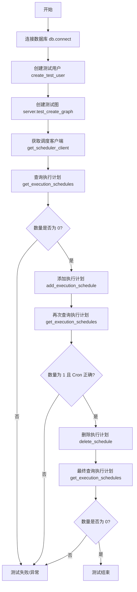
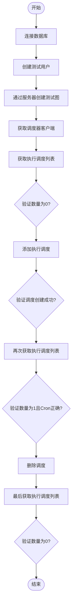
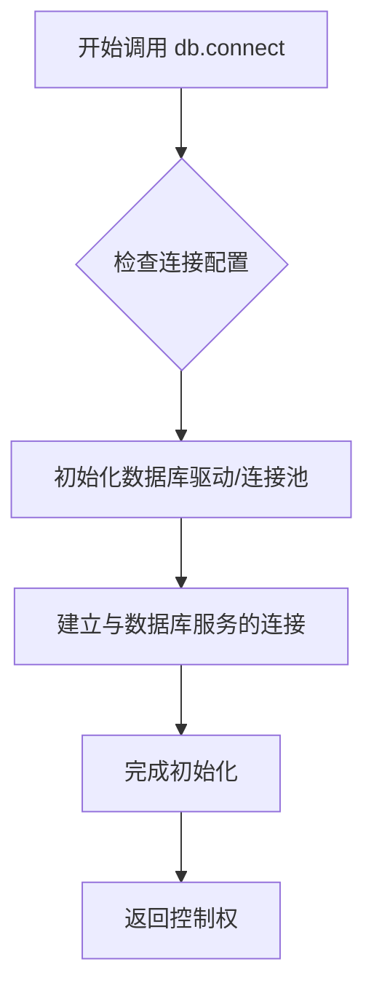
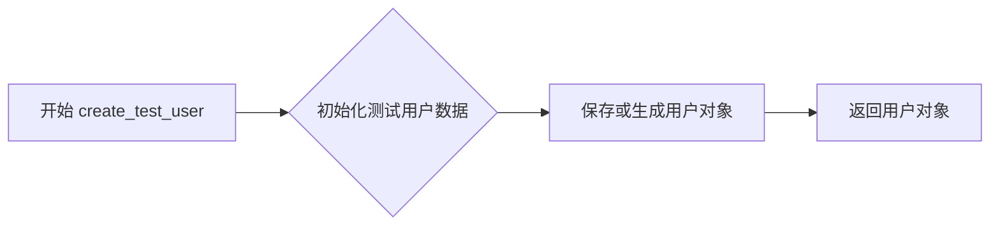
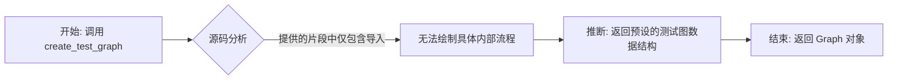
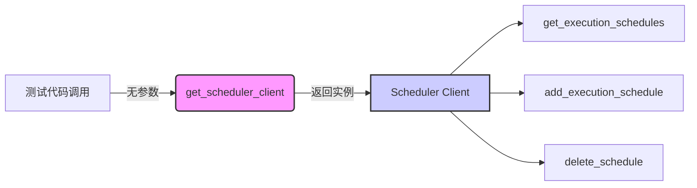

# `.\AutoGPT\autogpt_platform\backend\backend\executor\scheduler_test.py` 详细设计文档

该代码是一个基于 Pytest 的异步测试用例，旨在验证后端系统中代理执行调度的生命周期管理功能，涵盖了从数据库连接、测试数据（用户和图）的创建，到调度任务的添加、查询及删除的完整集成测试流程。

## 整体流程



## 类结构

```
test_agent_schedule (测试函数)
├── 外部依赖类
│   ├── SpinTestServer
│   └── CreateGraph
├── 外部依赖函数
│   ├── create_test_graph
│   ├── create_test_user
│   └── get_scheduler_client
└── 局部变量与对象交互
    ├── db (数据库连接)
    ├── scheduler (调度客户端实例)
    ├── test_user (测试用户)
    └── test_graph (测试图)
```

## 全局变量及字段


### `server`
    
用于测试的测试服务器实例，承载应用运行环境和测试辅助功能。

类型：`SpinTestServer`
    


### `test_user`
    
在测试过程中创建的测试用户实体，包含用户ID等信息。

类型：`User`
    


### `test_graph`
    
通过测试服务器接口创建的测试图实体，包含图的结构和版本信息。

类型：`Graph`
    


### `scheduler`
    
调度器客户端实例，用于与后端调度服务进行交互以管理执行计划。

类型：`SchedulerClient`
    


### `schedules`
    
从调度器获取的执行计划列表，包含特定图和用户关联的所有计划。

类型：`List[ExecutionSchedule]`
    


### `schedule`
    
单个执行计划对象，包含调度ID、Cron表达式及输入数据等信息。

类型：`ExecutionSchedule`
    


### `SpinTestServer.agent_server`
    
SpinTestServer 内部包含的代理服务器组件，用于处理代理相关的测试请求（如创建图）。

类型：`AgentServer`
    
    

## 全局函数及方法


### `test_agent_schedule`

这是一个异步测试函数，用于验证代理调度系统的核心功能。它测试了在给定的测试图和用户上下文中，执行调度的创建、查询及删除流程，确保调度器能正确管理代理的定时任务。

参数：

-  `server`：`SpinTestServer`，测试服务器实例，用于提供测试环境支持和创建测试图。

返回值：`None`，测试函数主要依赖断言来验证逻辑，无显式返回值。

#### 流程图



#### 带注释源码

```python
# 标记为异步测试，并指定事件循环作用域为session
@pytest.mark.asyncio(loop_scope="session")
async def test_agent_schedule(server: SpinTestServer):
    # 步骤1: 连接数据库，初始化数据存储层
    await db.connect()

    # 步骤2: 创建一个测试用户，用于后续的操作鉴权
    test_user = await create_test_user()

    # 步骤3: 使用测试服务器实例创建一个测试图 (Graph)
    test_graph = await server.agent_server.test_create_graph(
        create_graph=CreateGraph(graph=create_test_graph()),
        user_id=test_user.id,
    )

    # 步骤4: 获取调度器客户端，用于管理定时任务
    scheduler = get_scheduler_client()

    # 步骤5: 查询当前图的调度列表，预期此时应无调度
    schedules = await scheduler.get_execution_schedules(test_graph.id, test_user.id)
    assert len(schedules) == 0  # 断言列表为空

    # 步骤6: 为该图添加一个新的执行调度，设置Cron表达式和输入数据
    schedule = await scheduler.add_execution_schedule(
        graph_id=test_graph.id,
        user_id=test_user.id,
        graph_version=1,
        cron="0 0 * * *", # 每天午夜执行
        input_data={"input": "data"},
        input_credentials={},
    )
    assert schedule # 断言调度对象创建成功

    # 步骤7: 再次查询调度列表，验证刚才添加的调度
    schedules = await scheduler.get_execution_schedules(test_graph.id, test_user.id)
    assert len(schedules) == 1  # 断言数量为1
    assert schedules[0].cron == "0 0 * * *"  # 断言Cron表达式正确

    # 步骤8: 删除刚才创建的调度
    await scheduler.delete_schedule(schedule.id, user_id=test_user.id)

    # 步骤9: 最终查询调度列表，验证调度已被删除
    schedules = await scheduler.get_execution_schedules(
        test_graph.id, user_id=test_user.id
    )
    assert len(schedules) == 0  # 断言列表恢复为空
```


### `db.connect`

该代码段来自测试文件，`db.connect` 是一个异步函数，用于在测试开始前建立与后端数据库的连接。根据调用上下文推断，该方法通常负责初始化数据库连接池或会话。

参数：

无

返回值：`None`（或 `Coroutine`），该方法被直接 `await` 且未接收返回值，表明其主要作用是执行初始化副作用。

#### 流程图



#### 带注释源码

```python
# 注意：提供的代码片段为测试文件，未包含 backend.data.db 模块的具体实现源码。
# 以下为基于调用方式 await db.connect() 推断的接口定义。

async def connect():
    """
    异步连接数据库。
    该方法通常在应用启动或测试设置时调用，以建立持久化的数据库连接。
    """
    # Implementation details are in backend.data.db
    # 1. Load database configuration (e.g., URL, credentials)
    # 2. Initialize the database engine or connection pool
    # 3. Perform any necessary migration checks or setup
    pass
```


### `create_test_user`

该函数是一个异步测试辅助函数，用于创建并返回一个测试用户对象，以便在测试用例中进行相关的用户操作和验证。

参数：

- 无

返回值：`User`（推断类型），返回一个包含用户信息（如 `id`）的用户对象。

#### 流程图



#### 带注释源码

```python
# 注意：create_test_user 的具体实现未包含在提供的代码片段中。
# 该函数是从 backend.usecases.sample 模块导入的。
# 以下是根据测试代码中的调用推断出的函数签名和行为：

async def create_test_user():
    """
    异步创建一个测试用户。
    
    Returns:
        User: 包含用户属性（例如 id）的测试用户对象。
    """
    # 实际实现逻辑在 backend.usecases.sample 中
    # 根据用法 test_user = await create_test_user()
    # 以及后续使用 user_id=test_user.id
    # 可知返回值必须是一个具有 .id 属性的对象。
    pass
```


### `create_test_graph`

该函数是从 `backend.usecases.sample` 模块导入的辅助函数，用于生成测试用的图数据结构。在提供的测试代码中，它被实例化并作为参数传递给 `CreateGraph` 模型，用于在测试环境中初始化一个图对象。

参数：

-  无参数：`None`，基于函数调用 `create_test_graph()` 推断，该函数不接受任何参数。

返回值：`Graph` 或 `dict`，返回一个图定义对象或字典，包含测试图的节点、连线及元数据，用于填充 `CreateGraph` 模型的 `graph` 字段。

#### 流程图



#### 带注释源码

```python
# 注意：提供的代码片段中未包含 create_test_graph 的具体实现源码。
# 该函数通过以下语句导入：
# from backend.usecases.sample import create_test_graph
# 
# 根据其在测试代码中的使用方式：
# test_graph = await server.agent_server.test_create_graph(
#     create_graph=CreateGraph(graph=create_test_graph()),
#     user_id=test_user.id,
# )
# 
# 可以推断该函数的大致形式和功能如下：

# def create_test_graph():
#     """
#     创建并返回一个用于测试的图数据结构。
#     """
#     # 初始化图对象
#     # graph = Graph(...)
#     # 设置测试用的节点和边
#     # ...
#     return graph
```


### `get_scheduler_client`

该函数是一个外部导入的辅助函数（来自 `backend.util.clients`），用于获取调度器客户端实例。在测试代码中，它被调用以获取一个能够管理执行计划（如添加、获取、删除计划）的对象。

参数：

-   该函数在提供的代码中调用时未传递任何参数。

返回值：`SchedulerClient` (推断类型)，返回一个调度器客户端实例。该实例包含异步方法 `get_execution_schedules`、`add_execution_schedule` 和 `delete_schedule`，用于与后端调度服务进行交互。

#### 流程图



#### 带注释源码

```python
# 注意：提供的代码片段中未包含 `get_scheduler_client` 函数的具体实现源码。
# 以下为该函数在测试代码中的导入和调用上下文：

from backend.util.clients import get_scheduler_client

# 函数调用示例：无参数调用，返回客户端对象
scheduler = get_scheduler_client()
```


## 关键组件


### 调度器客户端

通过 `get_scheduler_client` 获取，负责对外提供与调度服务交互的能力，实现了获取、创建和删除执行计划的异步操作。

### 执行计划管理

处理调度业务逻辑的核心组件，涵盖基于 Cron 表达式的定时任务创建、状态查询（获取列表）以及资源的清理（删除操作）。

### 测试环境构建

集成了数据库连接 (`db`)、测试服务器 (`SpinTestServer`) 以及样本数据生成器 (`create_test_graph`, `create_test_user`)，为测试提供隔离且完整的运行上下文。


## 问题及建议


### 已知问题

-   **资源泄露风险**：代码中显式调用了 `await db.connect()`，但未在测试结束或异常处理中调用对应的断开连接逻辑，长期运行或在测试套件中可能导致数据库连接资源耗尽。
-   **测试数据残留**：测试过程中创建了 `test_user` 和 `test_graph`，但测试结束后没有执行清理操作（如删除用户和图），在数据库持久化环境下会导致脏数据堆积，可能影响后续测试的隔离性。
-   **代码重复**：获取调度列表的逻辑 `await scheduler.get_execution_schedules(test_graph.id, test_user.id)` 在代码中重复出现了三次，参数完全一致，违反了 DRY（Don't Repeat Yourself）原则，降低了代码的可维护性。

### 优化建议

-   **引入 Pytest Fixture**：将数据库连接、测试用户创建、测试图创建等前置操作封装为 `pytest.fixture`，利用 `yield` 语法和 `finalizer` 机制自动管理资源的开启与清理（确保数据回滚和连接关闭），提升测试的健壮性和隔离性。
-   **增强异常场景覆盖**：当前测试仅覆盖了正常的“增、删、查”快乐路径，建议补充测试用例以覆盖如“添加无效的 cron 表达式”、“删除不存在的 schedule ID”、“参数校验失败”等边界和异常情况。
-   **提取辅助函数或 Fixture**：将重复的 `get_execution_schedules` 调用及其断言逻辑封装为测试辅助函数或独立的 fixture，减少样板代码，提高测试用例的可读性。
-   **参数化测试**：考虑使用 `@pytest.mark.parametrize` 来测试不同的 cron 表达式或输入数据，以验证调度器在不同配置下的行为，从而用更少的代码覆盖更多的测试场景。


## 其它


### 设计目标与约束

本测试用例旨在验证 Agent 调度器（Scheduler）核心功能的正确性，具体涵盖了调度计划的创建、查询及删除的闭环流程。
主要约束包括：
- **异步执行环境**：测试运行在 `pytest` 的异步模式下，且 `loop_scope="session"` 表明整个测试会话共享一个事件循环，这对异步资源的管理提出了要求。
- **数据隔离**：依赖测试专用的用户和图数据，通过 `create_test_user` 和 `create_test_graph` 生成，确保测试环境与生产数据隔离。
- **时序依赖**：测试步骤严格串行，必须先完成数据初始化，才能进行调度操作，且每一步的断言都依赖于前一步操作的成功。

### 错误处理与异常设计

本代码作为测试脚本，其错误处理策略主要依赖测试框架的异常捕获机制，而非业务层面的容错：
- **断言失败**：通过 `assert` 语句对预期结果进行硬性检查。如果 `len(schedules)` 不符合预期或 `schedule` 对象为空，测试将抛出 `AssertionError` 并标记为失败。
- **异常传播**：代码中未包含 `try-except` 块。这意味着如果 `db.connect()`、`create_test_user()` 或调度客户端的任何方法抛出异常，测试将立即中断并报错。这种设计符合测试“快速失败”的原则，用于暴露底层逻辑的错误。
- **状态一致性假设**：代码假设 `add_execution_schedule` 和 `delete_schedule` 是幂等的或在无冲突状态下运行，未测试并发或重复操作带来的潜在异常。

### 数据流与状态机

**数据流**：
1. **输入数据生成**：通过工厂函数生成 `test_user` 和 `test_graph`，获取其 ID 作为后续调用的参数。
2. **指令下发**：将 `graph_id`、`user_id`、`cron` 表达式及 `input_data` 封装后传递给 `scheduler.add_execution_schedule`。
3. **状态反馈与验证**：从 `scheduler.get_execution_schedules` 获取数据流，比对返回列表中的对象属性（如 `cron` 字段）。
4. **清理指令**：调用 `delete_schedule` 并传入 `schedule.id`，完成数据生命周期的终结。

**状态机（测试上下文）**：
测试过程模拟了调度计划生命周期的状态变迁：
- **状态 A [初始空]**：系统中不存在针对该图的调度计划。
- **状态 B [已调度]**：系统中存在且仅存在一条调度计划，状态包含具体的 cron 和输入数据。
- **状态 C [已清理]**：调度计划被移除，系统回归到状态 A。

### 外部依赖与接口契约

**外部依赖**：
- **数据库服务 (`backend.data.db`)**：用于持久化存储测试所需的用户和图元数据。
- **调度服务客户端 (`backend.util.clients.get_scheduler_client`)**：实际执行调度逻辑的后端服务代理，是该测试的核心被测对象。
- **测试服务器 (`SpinTestServer`)**：提供模拟的 API 环境和辅助工具（如 `test_create_graph`），用于构建测试上下文。

**接口契约**：
- **`add_execution_schedule`**：
  - 契约：接收 `graph_id`, `user_id`, `cron` 等参数，成功后返回一个包含 `id` 属性的 Schedule 对象。
- **`get_execution_schedules`**：
  - 契约：根据 `graph_id` 和 `user_id` 返回当前活跃的调度计划列表。
- **`delete_schedule`**：
  - 契约：根据 `schedule.id` 和 `user_id` 删除指定计划，无显式返回值（通常以不抛出异常为成功依据）。

### 测试策略与验证逻辑

本测试采用标准的 **Arrange-Act-Assert (AAA)** 模式：
1. **准备阶段**：建立数据库连接，创建测试用户和测试图实例，初始化调度客户端。
2. **执行阶段**：
   - 验证初始状态（无调度）。
   - 执行添加调度操作，验证返回对象非空。
   - 执行查询操作，验证调度数量为 1 且内容匹配。
   - 执行删除操作。
   - 再次查询，验证数量回归为 0。
3. **验证逻辑**：
   - **覆盖范围**：覆盖了调度功能的 Create, Read, Delete (CRD) 路径。
   - **数据校验**：不仅校验了数据的存在性（长度），还校验了数据的准确性（`cron == "0 0 * * *"`）。
   - **边界条件**：通过检查空列表（初始和删除后）隐式覆盖了“零元素”的边界情况。

    