# `.\AutoGPT\autogpt_platform\backend\backend\executor\utils.py` 详细设计文档

该文件充当图执行系统的服务层，处理图执行的业务逻辑、输入验证、凭据管理、成本计算、消息队列集成、执行取消以及实时进度跟踪等核心功能。

## 整体流程

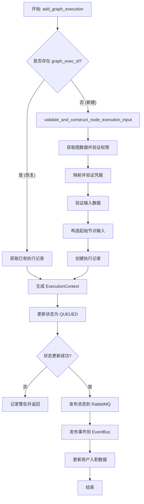

## 类结构

```
LogMetadata (TruncatedLogger)
CancelExecutionEvent (BaseModel)
ExecutionOutputEntry (BaseModel)
NodeExecutionProgress
```

## 全局变量及字段


### `config`
    
全局配置对象实例，用于获取系统运行时的各项配置参数，如执行成本阈值等。

类型：`Config`
    


### `logger`
    
带有截断功能的日志记录器实例，用于记录系统运行时的日志信息并控制日志长度。

类型：`TruncatedLogger`
    


### `GRAPH_EXECUTION_EXCHANGE`
    
RabbitMQ 交换机配置，用于路由图执行任务的消息，类型为 DIRECT。

类型：`Exchange`
    


### `GRAPH_EXECUTION_QUEUE_NAME`
    
存储图执行任务的消息队列名称，对应 'graph_execution_queue'。

类型：`str`
    


### `GRAPH_EXECUTION_ROUTING_KEY`
    
图执行任务的路由键，用于将消息发送到正确的执行队列，值为 'graph_execution.run'。

类型：`str`
    


### `GRAPH_EXECUTION_CANCEL_EXCHANGE`
    
RabbitMQ 交换机配置，用于广播取消执行请求的消息，类型为 FANOUT。

类型：`Exchange`
    


### `GRAPH_EXECUTION_CANCEL_QUEUE_NAME`
    
存储取消执行请求的消息队列名称，对应 'graph_execution_cancel_queue'。

类型：`str`
    


### `GRACEFUL_SHUTDOWN_TIMEOUT_SECONDS`
    
优雅关闭的超时时间（秒），设置为1天，允许长时间运行的图执行自然完成。

类型：`int`
    


### `CancelExecutionEvent.graph_exec_id`
    
需要被取消的图执行任务的唯一标识符。

类型：`str`
    


### `ExecutionOutputEntry.node`
    
产生该输出数据的图节点对象实例。

类型：`Node`
    


### `ExecutionOutputEntry.node_exec_id`
    
产生该输出的节点执行实例的唯一标识符。

类型：`str`
    


### `ExecutionOutputEntry.data`
    
节点执行产生的具体输出数据条目。

类型：`BlockOutputEntry`
    


### `NodeExecutionProgress.output`
    
存储节点执行输出的字典，键为节点执行ID，值为该节点的输出条目列表。

类型：`dict[str, list[ExecutionOutputEntry]]`
    


### `NodeExecutionProgress.tasks`
    
存储正在运行或已完成的异步任务字典，键为节点执行ID，值为对应的 Future 对象。

类型：`dict[str, Future]`
    


### `NodeExecutionProgress._lock`
    
线程锁，用于在多线程环境下安全地访问和修改 output 和 tasks 数据结构。

类型：`threading.Lock`
    
    

## 全局函数及方法


### `execution_usage_cost`

根据当前的节点执行次数计算执行图的成本。该函数实现了一种基于阈值的计费逻辑，仅在执行次数达到特定计费区间的倍数时产生费用。

参数：

-  `execution_count`：`int`，当前的节点执行次数

返回值：`tuple[int, int]`，包含计算出的成本金额和用于计算的执行次数阈值（通常是配置中的阈值常量）的元组

#### 流程图

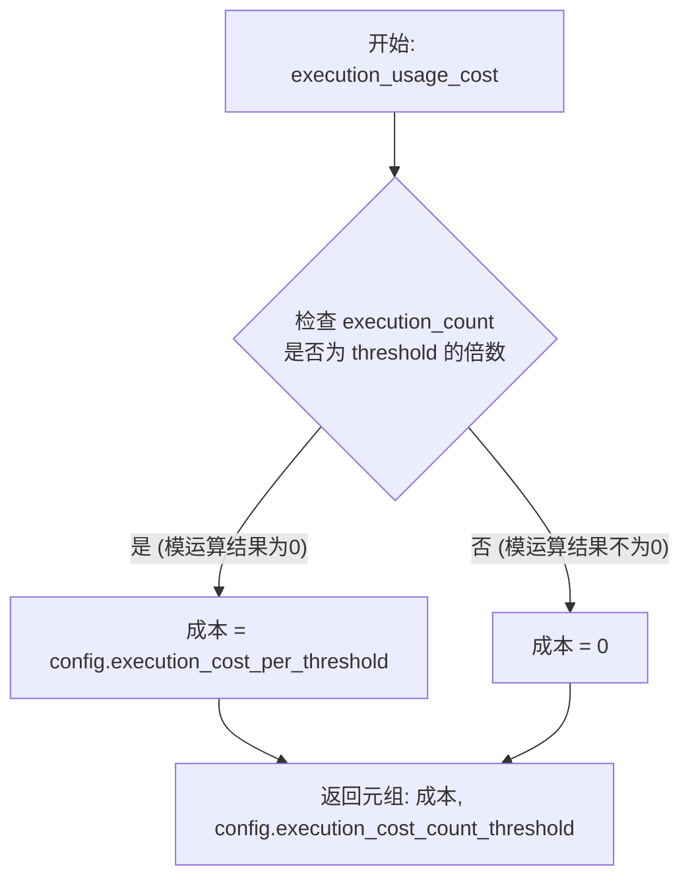

#### 带注释源码

```python
def execution_usage_cost(execution_count: int) -> tuple[int, int]:
    """
    Calculate the cost of executing a graph based on the current number of node executions.

    Args:
        execution_count: Number of node executions

    Returns:
        Tuple of cost amount and the number of execution count that is included in the cost.
    """
    return (
        (
            # 如果执行次数是计费阈值的整数倍，则扣除配置的单次阈值成本
            config.execution_cost_per_threshold
            if execution_count % config.execution_cost_count_threshold == 0
            else 0 # 否则不产生成本
        ),
        # 返回配置的计费阈值，表示该次计算基于多少次执行
        config.execution_cost_count_threshold,
    )
```


### `block_usage_cost`

根据输入数据、数据大小和运行时间，计算特定 Block 执行的用量成本。

参数：

-   `block`：`Block`，Block 对象实例，用于确定其特定的成本配置。
-   `input_data`：`BlockInput`，输入到 Block 的数据，用于匹配成本过滤规则。
-   `data_size`：`float`，输入数据的大小（以字节为单位），默认为 0，用于基于字节的成本计算。
-   `run_time`：`float`，Block 的执行时间（以秒为单位），默认为 0，用于基于时间的成本计算。

返回值：`tuple[int, BlockInput]`，包含计算出的成本金额（整数）和匹配到的成本过滤器（字典），如果没有匹配则返回 0 和空字典。

#### 流程图

```mermaid
flowchart TD
    A[开始: block_usage_cost] --> B[根据 Block 类型获取 block_costs]
    B --> C{是否找到 block_costs?}
    C -- 否 --> D[返回 0, {}]
    C -- 是 --> E[遍历 block_costs 列表]
    E --> F{检查 cost_filter 是否匹配 input_data}
    F -- 不匹配 --> E
    F -- 匹配 --> G{判断 cost_type}
    
    G -- RUN --> H[返回 cost_amount, cost_filter]
    G -- SECOND --> I[计算: run_time * cost_amount<br>返回结果]
    G -- BYTE --> J[计算: data_size * cost_amount<br>返回结果]
    
    E --> K[遍历结束]
    K --> D
```

#### 带注释源码

```python
def block_usage_cost(
    block: Block,
    input_data: BlockInput,
    data_size: float = 0,
    run_time: float = 0,
) -> tuple[int, BlockInput]:
    """
    Calculate the cost of using a block based on the input data and the block type.

    Args:
        block: Block object
        input_data: Input data for the block
        data_size: Size of the input data in bytes
        run_time: Execution time of the block in seconds

    Returns:
        Tuple of cost amount and cost filter
    """
    # 尝试获取当前 Block 类型对应的成本配置列表
    block_costs = BLOCK_COSTS.get(type(block))
    # 如果没有找到配置，则说明该 Block 不产生费用，返回 0
    if not block_costs:
        return 0, {}

    # 遍历该 Block 类型的所有成本规则
    for block_cost in block_costs:
        # 检查输入数据是否满足当前规则的成本过滤器条件
        if not _is_cost_filter_match(block_cost.cost_filter, input_data):
            continue

        # 根据成本类型计算费用
        
        # 如果是固定运行次数费用
        if block_cost.cost_type == BlockCostType.RUN:
            return block_cost.cost_amount, block_cost.cost_filter

        # 如果是基于时间的费用 (每秒单价)
        if block_cost.cost_type == BlockCostType.SECOND:
            return (
                int(run_time * block_cost.cost_amount),
                block_cost.cost_filter,
            )

        # 如果是基于数据量的费用 (每字节单价)
        if block_cost.cost_type == BlockCostType.BYTE:
            return (
                int(data_size * block_cost.cost_amount),
                block_cost.cost_filter,
            )

    # 如果遍历完所有规则都没有匹配项，返回 0
    return 0, {}
```


### `_is_cost_filter_match`

检查给定的成本过滤器条件是否匹配输入数据。该函数用于确定特定的计费规则是否适用于当前的执行上下文，通过递归比较字典结构或将非字典类型进行直接相等性比较，其中未定义、null 和空字符串被视为相等。

参数：

- `cost_filter`：`BlockInput`，定义成本计算条件的过滤器规则，可以是字典或基本类型。
- `input_data`：`BlockInput`，输入到块中的实际数据，用于对照过滤器进行检查。

返回值：`bool`，如果输入数据满足成本过滤器条件则返回 True，否则返回 False。

#### 流程图

```mermaid
flowchart TD
    Start([开始: _is_cost_filter_match]) --> CheckType{cost_filter 与 input_data<br/>均为 dict 类型?}
    CheckType -- 否 --> Equality[执行 cost_filter == input_data]
    Equality --> ReturnEq([返回比较结果])
    CheckType -- 是 --> Iterate[遍历 cost_filter 中的键值对 k, v]
    Iterate --> GetInput[获取 input_data.get k]
    GetInput --> CheckCondition{匹配条件检查}
    
    CheckCondition -- 条件1: 输入值为空且过滤器值为空 --> ContinueMatch([视为匹配])
    CheckCondition -- 条件2: 输入值存在且递归匹配 --> RecursiveCall[递归调用<br/>_is_cost_filter_match v, input_data[k]]
    
    RecursiveCall --> CheckRecur{递归结果是否为 True?}
    CheckRecur -- 否 --> ReturnFalse([返回 False: 匹配失败])
    CheckRecur -- 是 --> ContinueMatch
    CheckCondition -- 均不满足 --> ReturnFalse
    
    ContinueMatch --> Iterate
    Iterate -- 所有键均匹配成功 --> ReturnTrue([返回 True: 匹配成功])
```

#### 带注释源码

```python
def _is_cost_filter_match(cost_filter: BlockInput, input_data: BlockInput) -> bool:
    """
    Filter rules:
      - If cost_filter is an object, then check if cost_filter is the subset of input_data
      - Otherwise, check if cost_filter is equal to input_data.
      - Undefined, null, and empty string are considered as equal.
    """
    # 检查参数是否均为字典类型。如果任一不是字典，则进行简单的相等性比较。
    if not isinstance(cost_filter, dict) or not isinstance(input_data, dict):
        return cost_filter == input_data

    # 如果两者均为字典，检查 cost_filter 是否是 input_data 的子集。
    # 使用 all() 确保每一个过滤条件都满足。
    # 逻辑：(input_data 中对应键的值缺失/为假 且 过滤器值也为假) 
    # 或者 (input_data 中对应键的值存在 且 该值递归匹配过滤器的值)
    return all(
        (not input_data.get(k) and not v)
        or (input_data.get(k) and _is_cost_filter_match(v, input_data[k]))
        for k, v in cost_filter.items()
    )
```


### `validate_exec`

Validate the input data for a node execution.

参数：

-  `node`：`Node`，The node to execute.
-  `data`：`BlockInput`，The input data for the node execution.
-  `resolve_input`：`bool`，Whether to resolve dynamic pins into dict/list/object.

返回值：`tuple[BlockInput | None, str]`，A tuple of the validated data and the block name. If the data is invalid, the first element will be None, and the second element will be an error message. If the data is valid, the first element will be the resolved input data, and the second element will be the block name.

#### 流程图

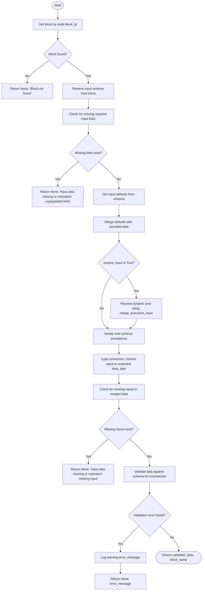

#### 带注释源码

```python
def validate_exec(
    node: Node,
    data: BlockInput,
    resolve_input: bool = True,
) -> tuple[BlockInput | None, str]:
    """
    Validate the input data for a node execution.

    Args:
        node: The node to execute.
        data: The input data for the node execution.
        resolve_input: Whether to resolve dynamic pins into dict/list/object.

    Returns:
        A tuple of the validated data and the block name.
        If the data is invalid, the first element will be None, and the second element
        will be an error message.
        If the data is valid, the first element will be the resolved input data, and
        the second element will be the block name.
    """
    # Retrieve the Block definition based on the node's block_id
    node_block = get_block(node.block_id)
    if not node_block:
        return None, f"Block for {node.block_id} not found."
    schema = node_block.input_schema

    # Input data (without default values) should contain all required fields.
    error_prefix = f"Input data missing or mismatch for `{node_block.name}`:"
    # Check if any required input links are missing in the provided data
    if missing_links := schema.get_missing_links(data, node.input_links):
        return None, f"{error_prefix} unpopulated links {missing_links}"

    # Merge input data with default values and resolve dynamic dict/list/object pins.
    input_default = schema.get_input_defaults(node.input_default)
    data = {**input_default, **data}
    if resolve_input:
        # Resolve complex dynamic structures if requested
        data = merge_execution_input(data)

    # Convert non-matching data types to the expected input schema.
    for name, data_type in schema.__annotations__.items():
        value = data.get(name)
        if (value is not None) and (type(value) is not data_type):
            # Cast or convert the value to the target type defined in the schema
            data[name] = convert(value, data_type)

    # Input data post-merge should contain all required fields from the schema.
    if missing_input := schema.get_missing_input(data):
        return None, f"{error_prefix} missing input {missing_input}"

    # Last validation: Validate the input values against the schema.
    if error := schema.get_mismatch_error(data):
        error_message = f"{error_prefix} {error}"
        logger.warning(error_message)
        return None, error_message

    return data, node_block.name
```


### `_validate_node_input_credentials`

检查图中所有节点的凭据，并返回结构化错误以及由于缺少可选凭据而应跳过的节点集合。

参数：

-   `graph`：`GraphModel`，待执行和验证的图模型对象。
-   `user_id`：`str`，执行该图的用户的 ID，用于查找对应的凭据。
-   `nodes_input_masks`：`Optional[NodesInputMasks]`，节点的输入掩码，用于覆盖或提供特定的输入值（包括凭据）。

返回值：`tuple[dict[str, dict[str, str]], set[str]]`，包含两个元素的元组：
1.  字典字典，键为节点 ID，值为该节点凭据字段对应的错误信息（字段名 -> 错误消息）。
2.  节点 ID 集合，包含那些因可选凭据未配置而应被跳过的节点。

#### 流程图

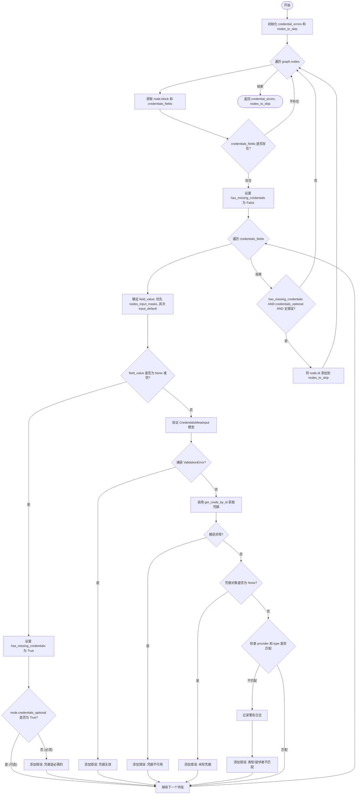

#### 带注释源码

```python
async def _validate_node_input_credentials(
    graph: GraphModel,
    user_id: str,
    nodes_input_masks: Optional[NodesInputMasks] = None,
) -> tuple[dict[str, dict[str, str]], set[str]]:
    """
    Checks all credentials for all nodes of the graph and returns structured errors
    and a set of nodes that should be skipped due to optional missing credentials.
    """
    # 初始化返回数据结构
    credential_errors: dict[str, dict[str, str]] = defaultdict(dict)
    nodes_to_skip: set[str] = set()

    # 遍历图中的每个节点
    for node in graph.nodes:
        block = node.block

        # 获取当前节点的凭据字段定义（类型为 CredentialsMetaInput 的字段）
        credentials_fields = block.input_schema.get_credentials_fields()
        if not credentials_fields:
            continue  # 如果该节点不涉及凭据，跳过

        # 标记当前节点是否存在缺失的凭据
        has_missing_credentials = False

        # 遍历每个凭据字段进行校验
        for field_name, credentials_meta_type in credentials_fields.items():
            try:
                # 步骤 1: 确定当前字段的值
                # 优先级: nodes_input_masks (运行时覆盖) > node.input_default (默认配置)
                field_value = None
                if (
                    nodes_input_masks
                    and (node_input_mask := nodes_input_masks.get(node.id))
                    and field_name in node_input_mask
                ):
                    field_value = node_input_mask[field_name]
                elif field_name in node.input_default:
                    # 特殊处理: 如果节点标记为凭据可选，则忽略 input_default，视为未配置
                    # 这可以防止使用过期的凭据 ID 导致校验失败
                    if node.credentials_optional:
                        field_value = None
                    else:
                        field_value = node.input_default[field_name]

                # 步骤 2: 检查凭据是否缺失
                # 判定标准: None, 空字典, 或字典中缺少 "id"
                if field_value is None or (
                    isinstance(field_value, dict) and not field_value.get("id")
                ):
                    has_missing_credentials = True
                    # 如果节点凭据是可选的，不报错，仅记录缺失状态，稍后决定是否跳过节点
                    if node.credentials_optional:
                        continue
                    else:
                        # 凭据是必须的，记录错误
                        credential_errors[node.id][
                            field_name
                        ] = "These credentials are required"
                        continue

                # 步骤 3: 校验凭据元数据结构是否符合 Pydantic 模型
                credentials_meta = credentials_meta_type.model_validate(field_value)

            except ValidationError as e:
                # 结构校验失败，说明提供了数据但格式不对
                # 即使是可选凭据，提供了错误的格式也应报错
                credential_errors[node.id][field_name] = f"Invalid credentials: {e}"
                continue

            try:
                # 步骤 4: 从存储中获取实际的凭据对象并进行完整性检查
                credentials = await get_integration_credentials_store().get_creds_by_id(
                    user_id, credentials_meta.id
                )
            except Exception as e:
                # 获取凭据时发生异常（如数据库错误）
                credential_errors[node.id][
                    field_name
                ] = f"Credentials not available: {e}"
                continue

            if not credentials:
                # 未找到凭据记录
                credential_errors[node.id][
                    field_name
                ] = f"Unknown credentials #{credentials_meta.id}"
                continue

            # 步骤 5: 校验凭据类型和提供者是否匹配元数据
            if (
                credentials.provider != credentials_meta.provider
                or credentials.type != credentials_meta.type
            ):
                logger.warning(
                    f"Invalid credentials #{credentials.id} for node #{node.id}: "
                    "type/provider mismatch: "
                    f"{credentials_meta.type}<>{credentials.type};"
                    f"{credentials_meta.provider}<>{credentials.provider}"
                )
                credential_errors[node.id][
                    field_name
                ] = "Invalid credentials: type/provider mismatch"
                continue

        # 节点级别检查:
        # 如果节点配置了可选凭据，且存在凭据缺失，且该节点没有其他错误（如格式错误）
        # 则将该节点加入跳过列表
        if (
            has_missing_credentials
            and node.credentials_optional
            and node.id not in credential_errors
        ):
            nodes_to_skip.add(node.id)
            logger.info(
                f"Node #{node.id} will be skipped: optional credentials not configured"
            )

    return credential_errors, nodes_to_skip
```


### `make_node_credentials_input_map`

该函数用于将执行凭据映射到图中正确的节点。它接收图模型和图级别的凭据输入，生成一个节点到凭据字段的映射字典。

参数：

-  `graph`：`GraphModel`，要执行的图模型对象。
-  `graph_credentials_input`：`Mapping[str, CredentialsMetaInput]`，一个映射表，键为图输入名称，值为凭据元数据对象。

返回值：`NodesInputMasks`，返回一个字典，键为节点ID（`node_id`），值为另一个字典（键为字段名 `field_name`，值为凭据的JSON表示），表示每个节点需要注入的凭据数据。

#### 流程图

```mermaid
flowchart TD
    A([开始]) --> B[初始化 result: 空字典]
    B --> C[调用 graph.aggregate_credentials_inputs 获取聚合凭据配置]
    C --> D{遍历 graph_cred_inputs}
    D --> E{检查 graph_input_name 是否存在于 graph_credentials_input}
    E -- 否 --> D
    E -- 是 --> F[获取 compatible_node_fields 列表]
    F --> G{遍历 compatible_node_fields}
    G --> H[初始化 result[node_id] 如果不存在]
    H --> I[将 graph_credentials_input 对应的值 model_dump 后赋值给 result[node_id][node_field_name]]
    I --> G
    G -- 结束 --> D
    D -- 结束 --> J([返回 result])
```

#### 带注释源码

```python
def make_node_credentials_input_map(
    graph: GraphModel,
    graph_credentials_input: Mapping[str, CredentialsMetaInput],
) -> NodesInputMasks:
    """
    Maps credentials for an execution to the correct nodes.

    Params:
        graph: The graph to be executed.
        graph_credentials_input: A (graph_input_name, credentials_meta) map.

    Returns:
        dict[node_id, dict[field_name, CredentialsMetaRaw]]: Node credentials input map.
    """
    # 初始化结果字典，用于存储 node_id -> {field_name: credential_value} 的映射
    result: dict[str, dict[str, JsonValue]] = {}

    # 获取图中所有聚合的凭据输入字段信息
    # graph_cred_items 结构通常为: {graph_input_name: (input_type, [(node_id, field_name), ...], ...)}
    graph_cred_inputs = graph.aggregate_credentials_inputs()

    for graph_input_name, (_, compatible_node_fields, _) in graph_cred_inputs.items():
        # 最佳匹配映射：如果传入的 graph_credentials_input 中没有该图输入名称，则跳过
        if graph_input_name not in graph_credentials_input:
            continue

        # 遍历所有兼容该凭据输入的节点字段
        for node_id, node_field_name in compatible_node_fields:
            # 确保节点 ID 在结果字典中已初始化
            if node_id not in result:
                result[node_id] = {}
            
            # 将传入的凭据元数据转换为字典（排除 None 值），并赋值给对应节点的对应字段
            result[node_id][node_field_name] = graph_credentials_input[
                graph_input_name
            ].model_dump(exclude_none=True)

    return result
```


### `validate_graph_with_credentials`

验证图的结构完整性以及节点的凭证配置，返回各节点的综合错误信息以及因缺少可选凭证而应跳过的节点集合。

参数：

- `graph`：`GraphModel`，待验证的图模型对象。
- `user_id`：`str`，执行该图的用户的 ID。
- `nodes_input_masks`：`Optional[NodesInputMasks]`，特定于节点的输入掩码，可能包含凭证信息或输入覆盖，默认为 None。

返回值：`tuple[Mapping[str, Mapping[str, str]], set[str]]`，返回一个元组：第一个元素是包含所有验证错误的字典（结构为 `node_id -> field_name -> error_message`），第二个元素是由于缺少可选凭证而应跳过的节点 ID 集合。

#### 流程图

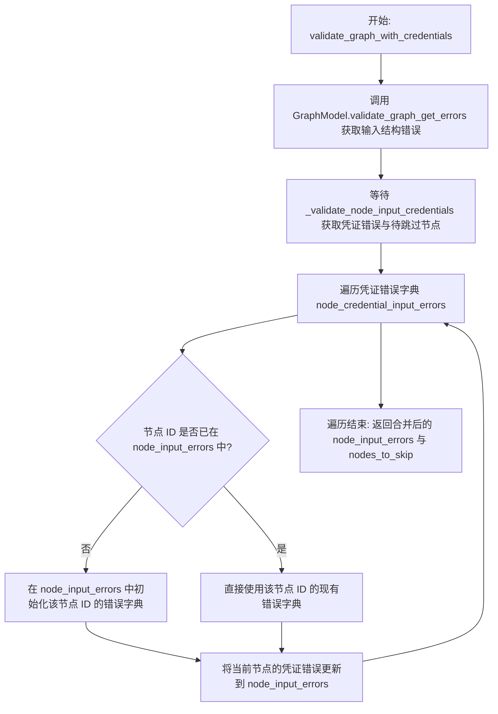

#### 带注释源码

```python
async def validate_graph_with_credentials(
    graph: GraphModel,
    user_id: str,
    nodes_input_masks: Optional[NodesInputMasks] = None,
) -> tuple[Mapping[str, Mapping[str, str]], set[str]]:
    """
    Validate graph including credentials and return structured errors per node,
    along with a set of nodes that should be skipped due to optional missing credentials.

    Returns:
        tuple[
            dict[node_id, dict[field_name, error_message]]: Validation errors per node,
            set[node_id]: Nodes that should be skipped (optional credentials not configured)
        ]
    """
    # 获取输入验证错误（检查数据结构、必填项等）
    node_input_errors = GraphModel.validate_graph_get_errors(
        graph, for_run=True, nodes_input_masks=nodes_input_masks
    )

    # 获取凭证验证错误及因缺少可选凭证而需要跳过的节点集合
    node_credential_input_errors, nodes_to_skip = (
        await _validate_node_input_credentials(graph, user_id, nodes_input_masks)
    )

    # 将凭证相关的错误合并到输入错误字典中
    # 这样可以返回一个包含所有类型错误的统一视图
    for node_id, field_errors in node_credential_input_errors.items():
        if node_id not in node_input_errors:
            node_input_errors[node_id] = {}
        node_input_errors[node_id].update(field_errors)

    return node_input_errors, nodes_to_skip
```


### `_construct_starting_node_execution_input`

验证并准备用于执行图的输入数据。该函数检查图的起始节点，根据 schema 验证输入数据（包括凭证验证），并将动态输入 pin 解析为单个列表、字典或对象，同时返回应跳过的节点集合。

参数：

-  `graph`：`GraphModel`，待执行的图模型对象。
-  `user_id`：`str`，执行该图的用户 ID。
-  `graph_inputs`：`BlockInput`，提供给图执行的输入数据。
-  `nodes_input_masks`：`Optional[NodesInputMasks]`，可选参数，用于覆盖特定节点输入的映射（常用于凭证注入）。

返回值：`tuple[list[tuple[str, BlockInput]], set[str]]`，包含一个元组列表（每个元组包含节点 ID 和对应的输入数据）以及一个节点 ID 集合（包含因缺少可选凭证而应跳过的节点）。

#### 流程图

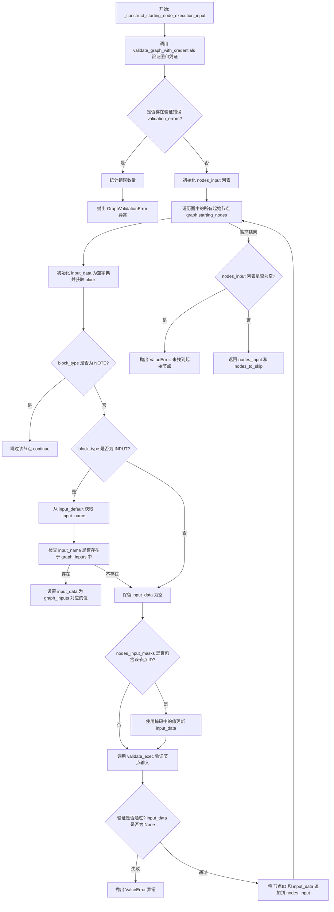

#### 带注释源码

```python
async def _construct_starting_node_execution_input(
    graph: GraphModel,
    user_id: str,
    graph_inputs: BlockInput,
    nodes_input_masks: Optional[NodesInputMasks] = None,
) -> tuple[list[tuple[str, BlockInput]], set[str]]:
    """
    Validates and prepares the input data for executing a graph.
    This function checks the graph for starting nodes, validates the input data
    against the schema, and resolves dynamic input pins into a single list,
    dictionary, or object.

    Args:
        graph (GraphModel): The graph model to execute.
        user_id (str): The ID of the user executing the graph.
        data (BlockInput): The input data for the graph execution.
        node_credentials_map: `dict[node_id, dict[input_name, CredentialsMetaInput]]`

    Returns:
        tuple[
            list[tuple[str, BlockInput]]: A list of tuples, each containing the node ID
                and the corresponding input data for that node.
            set[str]: Node IDs that should be skipped (optional credentials not configured)
        ]
    """
    # 1. 调用验证函数，检查凭证和图结构的有效性
    # Use new validation function that includes credentials
    validation_errors, nodes_to_skip = await validate_graph_with_credentials(
        graph, user_id, nodes_input_masks
    )
    
    # 2. 如果存在验证错误，计算错误数量并抛出 GraphValidationError
    n_error_nodes = len(validation_errors)
    n_errors = sum(len(errors) for errors in validation_errors.values())
    if validation_errors:
        raise GraphValidationError(
            f"Graph validation failed: {n_errors} issues on {n_error_nodes} nodes",
            node_errors=validation_errors,
        )

    # 3. 初始化存储起始节点输入的列表
    nodes_input = []
    
    # 4. 遍历图中的所有起始节点（没有入边连线的节点）
    for node in graph.starting_nodes:
        input_data = {}
        block = node.block

        # Note block should never be executed.
        # 5. 如果是 NOTE 类型的块，直接跳过执行
        if block.block_type == BlockType.NOTE:
            continue

        # 6. 如果是 INPUT 类型的块，从 graph_inputs 中提取对应的值
        # Extract request input data, and assign it to the input pin.
        if block.block_type == BlockType.INPUT:
            input_name = cast(str | None, node.input_default.get("name"))
            if input_name and input_name in graph_inputs:
                input_data = {"value": graph_inputs[input_name]}

        # 7. 应用节点输入掩码（例如注入的凭证），这会覆盖上面的 input_data
        # Apply node input overrides
        if nodes_input_masks and (node_input_mask := nodes_input_masks.get(node.id)):
            input_data.update(node_input_mask)

        # 8. 调用 validate_exec 对节点进行最终的数据验证
        input_data, error = validate_exec(node, input_data)
        
        # 9. 如果验证失败（input_data 为 None），抛出 ValueError
        if input_data is None:
            raise ValueError(error)
        else:
            # 10. 否则，将节点 ID 和准备好的输入数据加入列表
            nodes_input.append((node.id, input_data))

    # 11. 检查是否找到了任何有效的起始节点，如果没有则抛出错误
    if not nodes_input:
        raise ValueError(
            "No starting nodes found for the graph, make sure an AgentInput or blocks with no inbound links are present as starting nodes."
        )

    # 12. 返回准备好的节点输入列表和需要跳过的节点集合
    return nodes_input, nodes_to_skip
```


### `validate_and_construct_node_execution_input`

这是一个公共封装器，用于处理图获取、凭证映射，以及验证和构造节点执行输入。该函数集中了用于调度器验证和实际执行两者的逻辑。

参数：

-   `graph_id`：`str`，要验证/构造的图的 ID。
-   `user_id`：`str`，用户的 ID。
-   `graph_inputs`：`BlockInput`，图执行的输入数据。
-   `graph_version`：`Optional[int]`，要使用的图版本（可选）。
-   `graph_credentials_inputs`：`Optional[Mapping[str, CredentialsMetaInput]]`，要使用的凭证输入（可选）。
-   `nodes_input_masks`：`Optional[NodesInputMasks]`，要使用的节点输入掩码（可选）。
-   `is_sub_graph`：`bool`，指示该图是否作为子图执行。

返回值：`tuple[GraphModel, list[tuple[str, BlockInput]], NodesInputMasks, set[str]]`，返回一个元组，包含：完整的图模型对象、起始节点 ID 及其对应输入数据的列表、包含所有传入凭证的节点输入掩码字典、以及因可选凭证未配置而应跳过的节点 ID 集合。

#### 流程图

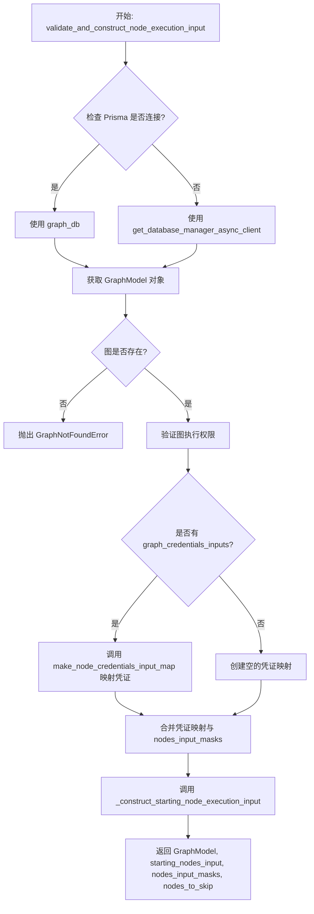

#### 带注释源码

```python
async def validate_and_construct_node_execution_input(
    graph_id: str,
    user_id: str,
    graph_inputs: BlockInput,
    graph_version: Optional[int] = None,
    graph_credentials_inputs: Optional[Mapping[str, CredentialsMetaInput]] = None,
    nodes_input_masks: Optional[NodesInputMasks] = None,
    is_sub_graph: bool = False,
) -> tuple[GraphModel, list[tuple[str, BlockInput]], NodesInputMasks, set[str]]:
    """
    Public wrapper that handles graph fetching, credential mapping, and validation+construction.
    This centralizes the logic used by both scheduler validation and actual execution.

    Args:
        graph_id: The ID of the graph to validate/construct.
        user_id: The ID of the user.
        graph_inputs: The input data for the graph execution.
        graph_version: The version of the graph to use.
        graph_credentials_inputs: Credentials inputs to use.
        nodes_input_masks: Node inputs to use.

    Returns:
        GraphModel: Full graph object for the given `graph_id`.
        list[tuple[node_id, BlockInput]]: Starting node IDs with corresponding inputs.
        dict[str, BlockInput]: Node input masks including all passed-in credentials.
        set[str]: Node IDs that should be skipped (optional credentials not configured).

    Raises:
        NotFoundError: If the graph is not found.
        GraphValidationError: If the graph has validation issues.
        ValueError: If there are other validation errors.
    """
    # 根据数据库连接状态选择合适的数据库客户端
    if prisma.is_connected():
        gdb = graph_db
    else:
        gdb = get_database_manager_async_client()

    # 获取图模型，包含子图信息，并跳过访问检查（因为随后会进行显式的权限检查）
    graph: GraphModel | None = await gdb.get_graph(
        graph_id=graph_id,
        user_id=user_id,
        version=graph_version,
        include_subgraphs=True,
        # Execution/access permission is checked by validate_graph_execution_permissions
        skip_access_check=True,
    )
    # 如果图不存在，抛出异常
    if not graph:
        raise GraphNotFoundError(f"Graph #{graph_id} not found.")

    # 验证用户是否有权限执行该图（检查库成员资格和执行权限）
    await gdb.validate_graph_execution_permissions(
        user_id=user_id,
        graph_id=graph.id,
        graph_version=graph.version,
        is_sub_graph=is_sub_graph,
    )

    # 合并节点输入掩码：
    # 1. 将图级别的凭证输入转换为节点级别的凭证映射
    # 2. 将其与现有的 nodes_input_masks 合并
    nodes_input_masks = _merge_nodes_input_masks(
        (
            make_node_credentials_input_map(graph, graph_credentials_inputs)
            if graph_credentials_inputs
            else {}
        ),
        nodes_input_masks or {},
    )

    # 构造起始节点的执行输入，并验证凭据，确定需要跳过的节点
    starting_nodes_input, nodes_to_skip = (
        await _construct_starting_node_execution_input(
            graph=graph,
            user_id=user_id,
            graph_inputs=graph_inputs,
            nodes_input_masks=nodes_input_masks,
        )
    )

    # 返回图对象、起始节点输入列表、合并后的输入掩码和需跳过的节点集合
    return graph, starting_nodes_input, nodes_input_masks, nodes_to_skip
```


### `_merge_nodes_input_masks`

该函数用于合并两个节点输入掩码字典。它将第二个字典中的输入掩码合并到第一个字典中。如果节点ID存在于两个字典中，则它们的内部字典（具体输入字段）会被合并，第二个字典的值优先。如果节点仅存在于第二个字典中，则将其添加到结果中。

参数：

-   `overrides_map_1`：`NodesInputMasks`，基础字典，包含节点ID到其输入掩码的映射。
-   `overrides_map_2`：`NodesInputMasks`，覆盖字典，包含需要合并到基础字典之上的节点ID及其输入掩码。

返回值：`NodesInputMasks`，合并后的输入掩码字典，包含来自两个输入映射的 combined 输入掩码。

#### 流程图

```mermaid
flowchart TD
    A[开始] --> B[复制 overrides_map_1 到 result]
    B --> C[遍历 overrides_map_2 中的键值对]
    C --> D{node_id 是否存在于 result 中?}
    D -- 是 --> E[合并 result[node_id] 与 overrides_map_2[node_id]]
    D -- 否 --> F[将 node_id 和 overrides_map_2[node_id] 添加到 result]
    E --> C
    F --> C
    C -- 遍历结束 --> G[返回 result]
```

#### 带注释源码

```python
def _merge_nodes_input_masks(
    overrides_map_1: NodesInputMasks,
    overrides_map_2: NodesInputMasks,
) -> NodesInputMasks:
    """执行每个节点的输入掩码合并"""
    # 创建第一个映射的浅拷贝作为结果的基础，避免修改原始输入
    result = dict(overrides_map_1).copy()
    
    # 遍历第二个映射中的节点ID和对应的输入掩码
    for node_id, overrides2 in overrides_map_2.items():
        # 检查当前节点ID是否已经存在于结果中
        if node_id in result:
            # 如果存在，将第二个映射的输入字段合并到现有节点中
            # **result[node_id] 展开现有字段，**overrides2 展开新字段，后者覆盖前者
            result[node_id] = {**result[node_id], **overrides2}
        else:
            # 如果不存在，直接将节点及其输入掩码添加到结果中
            result[node_id] = overrides2
            
    # 返回合并后的结果
    return result
```


### `create_execution_queue_config`

构建并返回用于处理图执行任务和取消请求的 RabbitMQ 配置对象。该配置定义了两个交换机及其对应的队列，分别用于运行图任务和发送取消指令，并为长时间运行的图执行任务设置了特定的消费者超时参数。

参数：

无

返回值：`RabbitMQConfig`，包含 RabbitMQ 虚拟主机、交换机列表及队列列表的完整配置对象。

#### 流程图

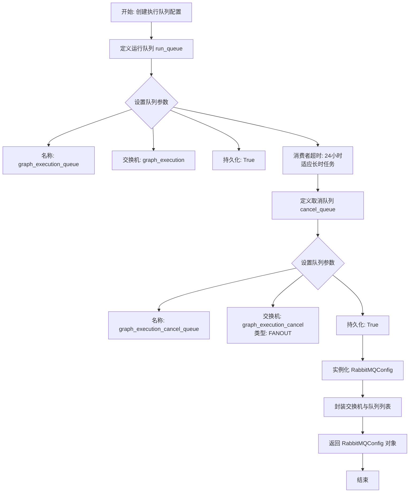

#### 带注释源码

```python
def create_execution_queue_config() -> RabbitMQConfig:
    """
    Define two exchanges and queues:
    - 'graph_execution' (DIRECT) for run tasks.
    - 'graph_execution_cancel' (FANOUT) for cancel requests.
    """
    # 配置用于执行图任务的队列
    run_queue = Queue(
        name=GRAPH_EXECUTION_QUEUE_NAME,
        exchange=GRAPH_EXECUTION_EXCHANGE,
        routing_key=GRAPH_EXECUTION_ROUTING_KEY,
        durable=True,  # 队列持久化
        auto_delete=False,
        arguments={
            # 设置消费者超时时间为24小时
            # 解决默认30分钟超时导致长时间运行的图执行被强制终止的问题
            # 使用心跳机制检测死消费者，允许图任务无限期运行（如AI模型训练）
            "x-consumer-timeout": GRACEFUL_SHUTDOWN_TIMEOUT_SECONDS
            * 1000,
        },
    )
    
    # 配置用于取消图执行的队列
    cancel_queue = Queue(
        name=GRAPH_EXECUTION_CANCEL_QUEUE_NAME,
        exchange=GRAPH_EXECUTION_CANCEL_EXCHANGE,
        routing_key="",  # FANOUT 类型交换机不需要 routing key
        durable=True,    # 队列持久化
        auto_delete=False,
    )
    
    # 返回包含虚拟主机、交换机和队列列表的完整配置
    return RabbitMQConfig(
        vhost="/",
        exchanges=[GRAPH_EXECUTION_EXCHANGE, GRAPH_EXECUTION_CANCEL_EXCHANGE],
        queues=[run_queue, cancel_queue],
    )
```


### `_get_child_executions`

使用 execution_db 模式获取父执行的所有子执行。

参数：

- `parent_exec_id`：`str`，父图执行 ID

返回值：`list["GraphExecutionMeta"]`，子图执行列表

#### 流程图

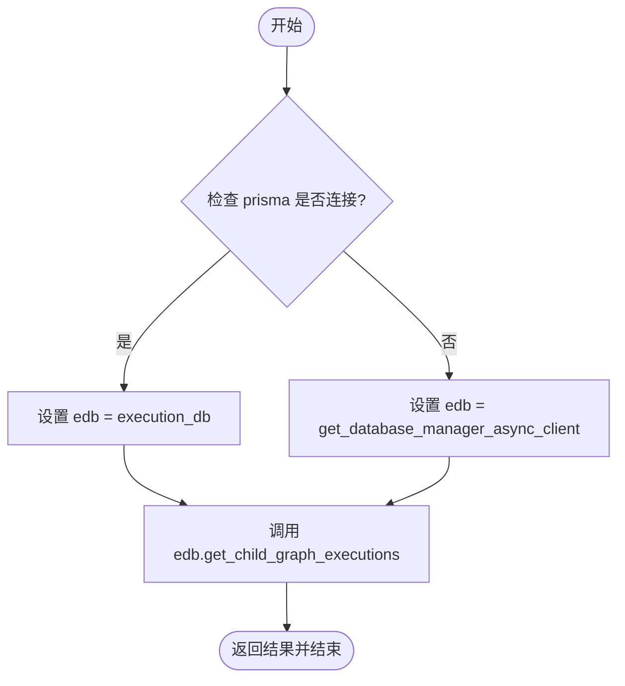

#### 带注释源码

```python
async def _get_child_executions(parent_exec_id: str) -> list["GraphExecutionMeta"]:
    """
    Get all child executions of a parent execution using the execution_db pattern.

    Args:
        parent_exec_id: Parent graph execution ID

    Returns:
        List of child graph executions
    """
    # 导入 prisma 实例以检查当前数据库连接状态
    from backend.data.db import prisma

    # 根据数据库连接状态选择数据库客户端
    # 如果 prisma 已连接，直接使用 execution_db 模块
    if prisma.is_connected():
        edb = execution_db
    else:
        # 否则获取异步数据库管理器客户端
        edb = get_database_manager_async_client()

    # 调用数据库客户端的方法获取所有子执行并返回
    return await edb.get_child_graph_executions(parent_exec_id)
```


### `stop_graph_execution`

Stop a graph execution and optionally all its child executions by sending a cancellation signal to the message queue and waiting for the execution status to update in the database. If the execution is actively running, it waits for the executor to process the cancellation; if it is queued or paused for review, it terminates immediately.

参数：

-  `user_id`：`str`，User ID who owns the execution
-  `graph_exec_id`：`str`，Graph execution ID to stop
-  `wait_timeout`：`float`，Maximum time to wait for execution to stop (seconds)
-  `cascade`：`bool`，If True, recursively stop all child executions

返回值：`None`，This function does not return a value on success, but raises exceptions if execution is not found or times out.

#### 流程图

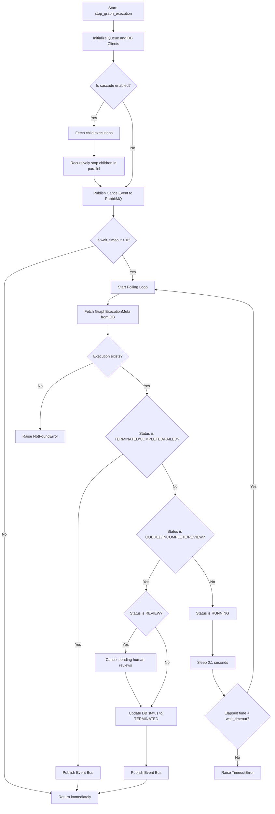

#### 带注释源码

```python
async def stop_graph_execution(
    user_id: str,
    graph_exec_id: str,
    wait_timeout: float = 15.0,
    cascade: bool = True,
):
    """
    Stop a graph execution and optionally all its child executions.

    Mechanism:
    1. Set the cancel event for this execution
    2. If cascade=True, recursively stop all child executions
    3. Graph executor's cancel handler thread detects the event, terminates workers,
       reinitializes worker pool, and returns.
    4. Update execution statuses in DB and set `error` outputs to `"TERMINATED"`.

    Args:
        user_id: User ID who owns the execution
        graph_exec_id: Graph execution ID to stop
        wait_timeout: Maximum time to wait for execution to stop (seconds)
        cascade: If True, recursively stop all child executions
    """
    # Initialize clients for messaging and database operations
    queue_client = await get_async_execution_queue()
    db = execution_db if prisma.is_connected() else get_database_manager_async_client()

    # Step 1: Handle cascading stop for child executions if requested
    if cascade:
        # Retrieve all child executions associated with the current execution
        children = await _get_child_executions(graph_exec_id)
        logger.info(
            f"Stopping {len(children)} child executions of execution {graph_exec_id}"
        )

        # Stop all children in parallel (recursively, with cascading enabled)
        if children:
            await asyncio.gather(
                *[
                    stop_graph_execution(
                        user_id=user_id,
                        graph_exec_id=child.id,
                        wait_timeout=wait_timeout,
                        cascade=True,  # Recursively cascade to grandchildren
                    )
                    for child in children
                ],
                return_exceptions=True,  # Don't fail parent stop if child stop fails
            )

    # Step 2: Send the cancellation signal to the message queue
    # This triggers the executor listening on the cancel exchange to stop processing
    await queue_client.publish_message(
        routing_key="",
        message=CancelExecutionEvent(graph_exec_id=graph_exec_id).model_dump_json(),
        exchange=GRAPH_EXECUTION_CANCEL_EXCHANGE,
    )

    # If no wait time is specified, return immediately (fire and forget)
    if not wait_timeout:
        return

    # Step 3: Poll the database to check if the execution has stopped
    start_time = time.time()
    while time.time() - start_time < wait_timeout:
        # Fetch the latest metadata for the execution
        graph_exec = await db.get_graph_execution_meta(
            execution_id=graph_exec_id, user_id=user_id
        )

        # Handle case where execution does not exist
        if not graph_exec:
            raise NotFoundError(f"Graph execution #{graph_exec_id} not found.")

        # Check for terminal statuses (stopped successfully)
        if graph_exec.status in [
            ExecutionStatus.TERMINATED,
            ExecutionStatus.COMPLETED,
            ExecutionStatus.FAILED,
        ]:
            # If graph execution is terminated/completed/failed, cancellation is complete
            await get_async_execution_event_bus().publish(graph_exec)
            return

        # Check for non-running statuses that might require immediate status update
        if graph_exec.status in [
            ExecutionStatus.QUEUED,
            ExecutionStatus.INCOMPLETE,
            ExecutionStatus.REVIEW,
        ]:
            # If the graph is queued/incomplete/paused for review, terminate immediately
            # No need to wait for executor since it's not actively running

            # Special handling for REVIEW status: clean up pending reviews
            if graph_exec.status == ExecutionStatus.REVIEW:
                # Determine correct DB client (Prisma or Manager)
                review_db = (
                    human_review_db
                    if prisma.is_connected()
                    else get_database_manager_async_client()
                )
                # Mark all pending reviews as rejected/cancelled
                cancelled_count = await review_db.cancel_pending_reviews_for_execution(
                    graph_exec_id, user_id
                )
                logger.info(
                    f"Cancelled {cancelled_count} pending review(s) for stopped execution {graph_exec_id}"
                )

            # Update status to TERMINATED in the DB
            graph_exec.status = ExecutionStatus.TERMINATED

            await asyncio.gather(
                # Update graph execution status
                db.update_graph_execution_stats(
                    graph_exec_id=graph_exec.id,
                    status=ExecutionStatus.TERMINATED,
                ),
                # Publish graph execution event
                get_async_execution_event_bus().publish(graph_exec),
            )
            return

        # If the graph is still RUNNING, wait briefly before checking again
        if graph_exec.status == ExecutionStatus.RUNNING:
            await asyncio.sleep(0.1)

    # Step 4: If the loop exits, the timeout has been reached without stopping
    raise TimeoutError(
        f"Graph execution #{graph_exec_id} will need to take longer than {wait_timeout} seconds to stop. "
        f"You can check the status of the execution in the UI or try again later."
    )
```


### `add_graph_execution`

该函数负责创建或恢复图执行任务，进行输入验证、凭证处理，并将执行任务推送到消息队列以供后续处理，同时返回执行记录的详细信息。

参数：

- `graph_id`：`str`，要执行的图的 ID。
- `user_id`：`str`，执行该图的用户 ID。
- `inputs`：`Optional[BlockInput]`，图执行的输入数据，默认为 None。
- `preset_id`：`Optional[str]`，要使用的预设 ID，默认为 None。
- `graph_version`：`Optional[int]`，要执行的图的版本，默认为 None。
- `graph_credentials_inputs`：`Optional[Mapping[str, CredentialsMetaInput]]`，执行中使用的凭证输入，键应与 `GraphModel.aggregate_credentials_inputs` 生成的键映射，默认为 None。
- `nodes_input_masks`：`Optional[NodesInputMasks]`，执行中使用的节点输入掩码，默认为 None。
- `execution_context`：`Optional[ExecutionContext]`，执行上下文对象，包含用户时区、安全设置等信息，默认为 None。
- `graph_exec_id`：`Optional[str]`，如果提供，则恢复此现有执行而不是创建新执行，默认为 None。

返回值：`GraphExecutionWithNodes`，图执行记录的详细条目。

#### 流程图

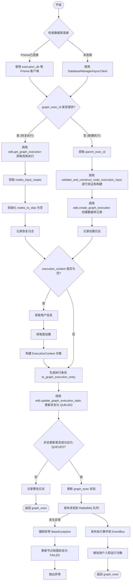

#### 带注释源码

```python
async def add_graph_execution(
    graph_id: str,
    user_id: str,
    inputs: Optional[BlockInput] = None,
    preset_id: Optional[str] = None,
    graph_version: Optional[int] = None,
    graph_credentials_inputs: Optional[Mapping[str, CredentialsMetaInput]] = None,
    nodes_input_masks: Optional[NodesInputMasks] = None,
    execution_context: Optional[ExecutionContext] = None,
    graph_exec_id: Optional[str] = None,
) -> GraphExecutionWithNodes:
    """
    Adds a graph execution to the queue and returns the execution entry.

    Args:
        graph_id: The ID of the graph to execute.
        user_id: The ID of the user executing the graph.
        inputs: The input data for the graph execution.
        preset_id: The ID of the preset to use.
        graph_version: The version of the graph to execute.
        graph_credentials_inputs: Credentials inputs to use in the execution.
            Keys should map to the keys generated by `GraphModel.aggregate_credentials_inputs`.
        nodes_input_masks: Node inputs to use in the execution.
        parent_graph_exec_id: The ID of the parent graph execution (for nested executions).
        graph_exec_id: If provided, resume this existing execution instead of creating a new one.
    Returns:
        GraphExecutionEntry: The entry for the graph execution.
    Raises:
        ValueError: If the graph is not found or if there are validation errors.
        NotFoundError: If graph_exec_id is provided but execution is not found.
    """
    # 根据数据库连接状态选择相应的数据库客户端（Prisma 或 异步管理器）
    if prisma.is_connected():
        edb = execution_db
        udb = user_db
        gdb = graph_db
        odb = onboarding_db
    else:
        edb = udb = gdb = odb = get_database_manager_async_client()

    # 获取或创建图执行记录
    if graph_exec_id:
        # === 恢复现有执行逻辑 ===
        graph_exec = await edb.get_graph_execution(
            user_id=user_id,
            execution_id=graph_exec_id,
            include_node_executions=True,
        )

        if not graph_exec:
            raise NotFoundError(f"Graph execution #{graph_exec_id} not found.")

        # 使用现有执行已编译的输入掩码
        compiled_nodes_input_masks = graph_exec.nodes_input_masks or {}
        # 对于恢复的执行，nodes_to_skip 在创建时已确定
        # TODO: 如果需要跨恢复保留 nodes_to_skip，考虑将其存储在 DB 中
        nodes_to_skip: set[str] = set()

        logger.info(f"Resuming graph execution #{graph_exec.id} for graph #{graph_id}")
    else:
        # === 创建新执行逻辑 ===
        parent_exec_id = (
            execution_context.parent_execution_id if execution_context else None
        )

        # 验证输入并构造节点执行输入，包括凭证映射
        graph, starting_nodes_input, compiled_nodes_input_masks, nodes_to_skip = (
            await validate_and_construct_node_execution_input(
                graph_id=graph_id,
                user_id=user_id,
                graph_inputs=inputs or {},
                graph_version=graph_version,
                graph_credentials_inputs=graph_credentials_inputs,
                nodes_input_masks=nodes_input_masks,
                is_sub_graph=parent_exec_id is not None,
            )
        )

        # 在数据库中创建图执行记录
        graph_exec = await edb.create_graph_execution(
            user_id=user_id,
            graph_id=graph_id,
            graph_version=graph.version,
            inputs=inputs or {},
            credential_inputs=graph_credentials_inputs,
            nodes_input_masks=nodes_input_masks,
            starting_nodes_input=starting_nodes_input,
            preset_id=preset_id,
            parent_graph_exec_id=parent_exec_id,
        )

        logger.info(
            f"Created graph execution #{graph_exec.id} for graph "
            f"#{graph_id} with {len(starting_nodes_input)} starting nodes"
        )

    # 如果未提供执行上下文，则生成一个新的上下文
    if execution_context is None:
        user = await udb.get_user_by_id(user_id)
        settings = await gdb.get_graph_settings(user_id=user_id, graph_id=graph_id)

        execution_context = ExecutionContext(
            # 执行身份
            user_id=user_id,
            graph_id=graph_id,
            graph_exec_id=graph_exec.id,
            graph_version=graph_exec.graph_version,
            # 安全设置
            human_in_the_loop_safe_mode=settings.human_in_the_loop_safe_mode,
            sensitive_action_safe_mode=settings.sensitive_action_safe_mode,
            # 用户设置
            user_timezone=(
                user.timezone if user.timezone != USER_TIMEZONE_NOT_SET else "UTC"
            ),
            # 执行层级
            root_execution_id=graph_exec.id,
        )

    try:
        # 将执行对象转换为执行条目，包含已编译的掩码和跳过节点
        graph_exec_entry = graph_exec.to_graph_execution_entry(
            compiled_nodes_input_masks=compiled_nodes_input_masks,
            nodes_to_skip=nodes_to_skip,
            execution_context=execution_context,
        )
        logger.info(f"Queueing execution {graph_exec.id}")

        # 在发布到队列之前更新执行状态为 QUEUED，以防止竞争条件
        #（例如两个并发请求都发布同一个执行）
        updated_exec = await edb.update_graph_execution_stats(
            graph_exec_id=graph_exec.id,
            status=ExecutionStatus.QUEUED,
        )

        # 验证状态更新成功（防止在竞争条件下重复入队）
        # 如果另一个请求已经更新了状态，该执行将不会处于 QUEUED 状态
        if not updated_exec or updated_exec.status != ExecutionStatus.QUEUED:
            logger.warning(
                f"Skipping queue publish for execution {graph_exec.id} - "
                f"status update failed or execution already queued by another request"
            )
            return graph_exec

        graph_exec.status = ExecutionStatus.QUEUED

        # 发布到执行队列供执行器拾取
        # 这发生在状态更新之后，以确保只有一个请求进行发布
        exec_queue = await get_async_execution_queue()
        await exec_queue.publish_message(
            routing_key=GRAPH_EXECUTION_ROUTING_KEY,
            message=graph_exec_entry.model_dump_json(),
            exchange=GRAPH_EXECUTION_EXCHANGE,
        )
        logger.info(f"Published execution {graph_exec.id} to RabbitMQ queue")
    except BaseException as e:
        # 捕获并处理发布过程中的异常，将状态标记为 FAILED
        err = str(e) or type(e).__name__
        if not graph_exec:
            logger.error(f"Unable to execute graph #{graph_id} failed: {err}")
            raise

        logger.error(
            f"Unable to publish graph #{graph_id} exec #{graph_exec.id}: {err}"
        )
        await edb.update_node_execution_status_batch(
            [node_exec.node_exec_id for node_exec in graph_exec.node_executions],
            ExecutionStatus.FAILED,
        )
        await edb.update_graph_execution_stats(
            graph_exec_id=graph_exec.id,
            status=ExecutionStatus.FAILED,
            stats=GraphExecutionStats(error=err),
        )
        raise

    try:
        # 尝试发布执行更新到事件总线
        await get_async_execution_event_bus().publish(graph_exec)
        logger.info(f"Published update for execution #{graph_exec.id} to event bus")
    except Exception as e:
        # 事件发布失败仅记录日志，不影响主流程
        logger.error(
            f"Failed to publish execution event for graph exec #{graph_exec.id}: {e}"
        )

    try:
        # 尝试增加用户的入职运行次数
        await odb.increment_onboarding_runs(user_id)
        logger.info(
            f"Incremented user #{user_id} onboarding runs for exec #{graph_exec.id}"
        )
    except Exception as e:
        # 入职统计失败仅记录日志
        logger.error(f"Failed to increment onboarding runs for user #{user_id}: {e}")

    return graph_exec
```


### `LogMetadata.__init__`

初始化 `LogMetadata` 对象，设置日志记录所需的元数据字典和前缀字符串，用于在执行上下文中追踪用户、图和节点的相关信息。

参数：

- `logger`：`logging.Logger`，底层日志记录器实例，用于实际的日志输出。
- `user_id`：`str`，执行该图操作的用户 ID。
- `graph_eid`：`str`，图执行实例 ID。
- `graph_id`：`str`，图定义的 ID。
- `node_eid`：`str`，节点执行实例 ID。
- `node_id`：`str`，节点定义的 ID。
- `block_name`：`str`，正在执行的块的名称。
- `max_length`：`int`，日志消息的最大长度，默认为 1000。

返回值：`None`，初始化方法无返回值。

#### 流程图

```mermaid
flowchart TD
    A[开始初始化] --> B[构建 metadata 字典<br/>包含 component, user_id, graph_eid 等]
    B --> C{是否启用结构化日志?}
    C -- 是 --> D[设置 prefix 为 '[ExecutionManager]']
    C -- 否 --> E[拼接详细前缀字符串<br/>包含 uid, gid, nid 等信息]
    D --> F[调用 super().__init__<br/>初始化父类 TruncatedLogger]
    E --> F
    F --> G[结束]
```

#### 带注释源码

```python
def __init__(
    self,
    logger: logging.Logger,
    user_id: str,
    graph_eid: str,
    graph_id: str,
    node_eid: str,
    node_id: str,
    block_name: str,
    max_length: int = 1000,
):
    # 构建日志元数据字典，包含组件名称及用户、图、节点的各类 ID，用于结构化日志
    metadata = {
        "component": "ExecutionManager",
        "user_id": user_id,
        "graph_eid": graph_eid,
        "graph_id": graph_id,
        "node_eid": node_eid,
        "node_id": node_id,
        "block_name": block_name,
    }
    # 根据是否启用结构化日志决定前缀格式
    # 如果启用，使用简单前缀；如果未启用，将关键信息拼接在字符串前以便阅读
    prefix = (
        "[ExecutionManager]"
        if is_structured_logging_enabled()
        else f"[ExecutionManager|uid:{user_id}|gid:{graph_id}|nid:{node_id}]|geid:{graph_eid}|neid:{node_eid}|{block_name}]"  # noqa
    )
    # 调用父类 TruncatedLogger 的初始化方法，传入配置好的前缀、元数据和最大长度
    super().__init__(
        logger,
        max_length=max_length,
        prefix=prefix,
        metadata=metadata,
    )
```


### `NodeExecutionProgress.__init__`

该方法用于初始化 `NodeExecutionProgress` 类的实例，设置用于追踪节点执行输出、异步任务引用以及线程同步锁的数据结构。

参数：

- `self`：`NodeExecutionProgress`，类实例本身。

返回值：`None`，该方法无返回值，仅在内存中初始化实例属性。

#### 流程图

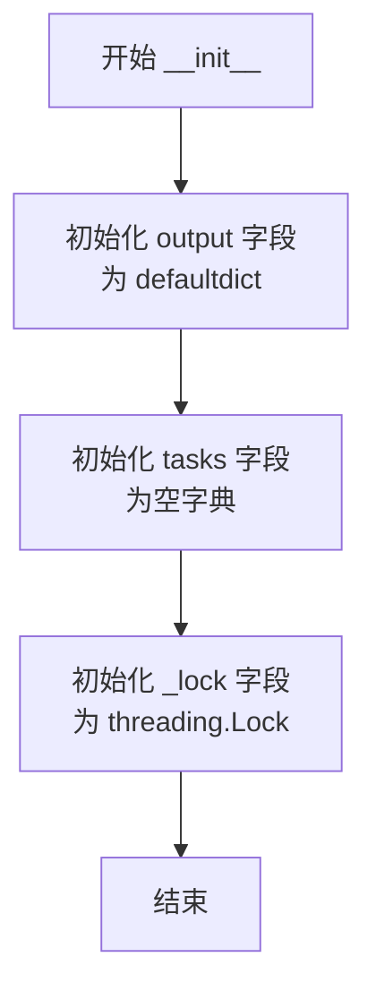

#### 带注释源码

```python
def __init__(self):
    # 初始化 output 字典，用于存储节点执行输出
    # 键为 node_exec_id (str)，值为 ExecutionOutputEntry 列表
    # 使用 defaultdict(list) 自动处理新键的初始化
    self.output: dict[str, list[ExecutionOutputEntry]] = defaultdict(list)

    # 初始化 tasks 字典，用于存储正在执行的异步任务
    # 键为 node_exec_id (str)，值为对应的 Future 对象
    self.tasks: dict[str, Future] = {}

    # 初始化线程锁，用于保护共享资源（如 output）的并发访问安全
    self._lock = threading.Lock()
```


### `NodeExecutionProgress.add_task`

该方法用于将一个异步执行任务（Future对象）与特定的节点执行ID进行关联，并存储在内部的任务字典中以便后续跟踪和管理。

参数：

-  `node_exec_id`：`str`，节点执行的唯一标识符，用作字典的键。
-  `task`：`Future`，代表该节点正在执行的后台任务对象，通常来自 `concurrent.futures`。

返回值：`None`，该方法无返回值。

#### 流程图

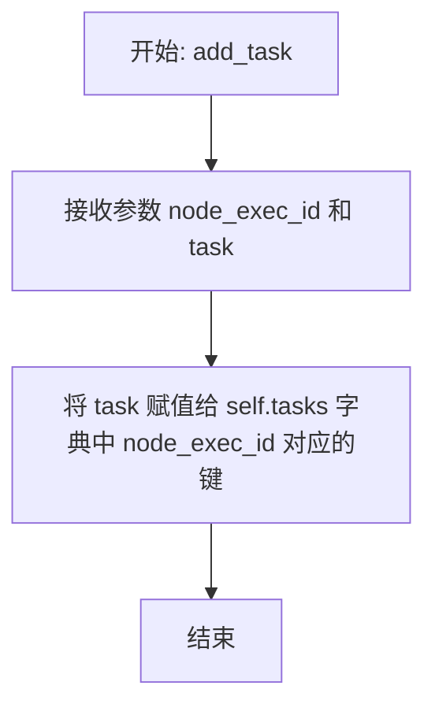

#### 带注释源码

```python
    def add_task(self, node_exec_id: str, task: Future):
        # 将传入的 Future 任务对象存储到 self.tasks 字典中
        # 以便后续通过 node_exec_id 来查询、等待或检查该任务的状态
        self.tasks[node_exec_id] = task
```


### `NodeExecutionProgress.add_output`

将单个节点的执行输出条目追加到当前的执行进度跟踪中。此操作是线程安全的，使用锁来防止并发访问时的数据竞争。

参数：

-  `output`：`ExecutionOutputEntry`，表示节点执行的输出条目，包含节点信息和输出数据。

返回值：`None`，无返回值。

#### 流程图

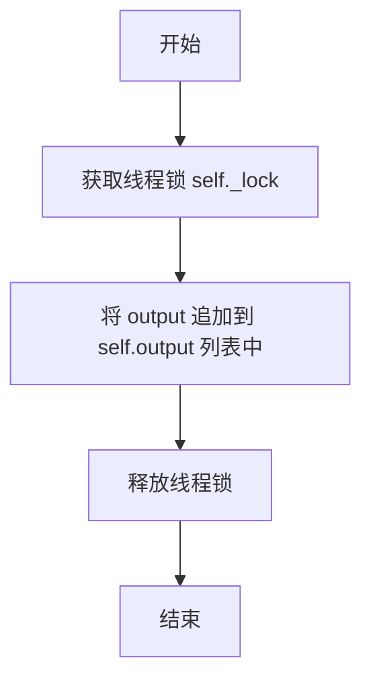

#### 带注释源码

```python
    def add_output(self, output: ExecutionOutputEntry):
        # 使用上下文管理器获取线程锁，确保多线程环境下对 self.output 的操作是原子性的
        with self._lock:
            # 将传入的 ExecutionOutputEntry 对象追加到字典中对应 node_exec_id 的列表里
            self.output[output.node_exec_id].append(output)
```


### `NodeExecutionProgress.pop_output`

该方法用于从节点的执行进度中获取并移除下一个可用的输出条目。它会按照任务添加的顺序检查任务状态，如果任务已完成且无输出则清理该任务并检查下一个，否则尝试返回当前任务的输出数据。

参数：

- `无`

返回值：`ExecutionOutputEntry | None`，如果存在可用的输出条目则返回该条目；如果没有更多任务或当前没有数据则返回 None。

#### 流程图

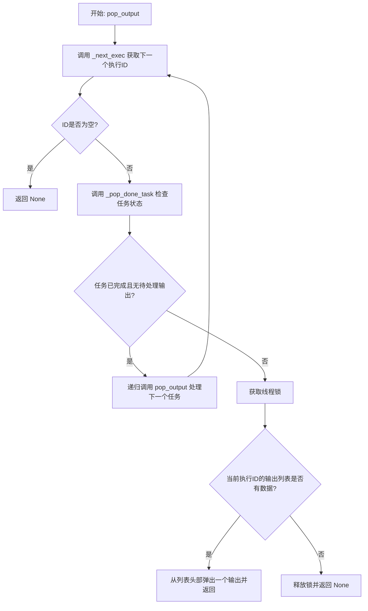

#### 带注释源码

```python
    def pop_output(self) -> ExecutionOutputEntry | None:
        # 获取当前待处理的第一个执行任务的ID
        exec_id = self._next_exec()
        # 如果没有待处理的任务，返回None
        if not exec_id:
            return None

        # 检查该任务是否已完成且没有剩余的输出
        # 如果是，将其从任务字典中移除，并递归调用pop_output以处理下一个任务
        if self._pop_done_task(exec_id):
            return self.pop_output()

        # 获取线程锁以确保线程安全地访问输出列表
        with self._lock:
            # 检查当前任务是否有输出数据
            if next_output := self.output[exec_id]:
                # 如果有，移除并返回列表中的第一个输出条目
                return next_output.pop(0)

        # 如果任务未完成且暂无输出，返回None
        return None
```


### `NodeExecutionProgress.is_done`

检查节点执行进度是否已完成。该方法通过管理任务队列和输出队列，确定当前是否所有任务都已处理完毕。它支持阻塞等待（指定 `wait_time`）或非阻塞检查，并在任务完成或失败后自动清理任务状态。

参数：

- `wait_time`：`float`，等待下一个任务完成的最长时间（秒）。默认为 0.0，表示非阻塞检查。

返回值：`bool`，如果没有剩余任务或所有任务均已成功处理，则返回 `True`；如果任务仍在运行或待处理，则返回 `False`。

#### 流程图

```mermaid
flowchart TD
    A([开始]) --> B[获取下一个执行ID<br/>exec_id = _next_exec]
    B --> C{是否存在 exec_id?}
    C -- 否 --> D([返回 True])
    C -- 是 --> E[检查并弹出已完成任务<br/>_pop_done_task]
    E --> F{任务是否已弹出并移除?}
    F -- 是 --> G[递归调用<br/>return self.is_done]
    F -- 否 --> H{wait_time <= 0?}
    H -- 是 --> I([返回 False])
    H -- 否 --> J[尝试获取任务结果<br/>task.result]
    J --> K{发生异常?}
    K -- TimeoutError --> L[捕获超时]
    K -- 其他异常 --> M[记录错误日志]
    L --> N[递归调用<br/>return self.is_done]
    M --> N
    N --> O([返回])
```

#### 带注释源码

```python
def is_done(self, wait_time: float = 0.0) -> bool:
    # 获取当前待处理的下一个执行ID
    exec_id = self._next_exec()
    # 如果没有待处理的执行ID，说明所有任务已完成
    if not exec_id:
        return True

    # 尝试检查并移除已完成的任务
    # _pop_done_task 会检查任务是否 done，且该任务没有待处理的输出
    # 如果任务已完成且无输出，将其从字典中移除并返回 True
    if self._pop_done_task(exec_id):
        # 递归调用自身，检查下一个任务
        # 递归调用保持了原有的 wait_time 参数
        return self.is_done(wait_time)

    # 如果指定了等待时间 <= 0，说明是非阻塞模式，任务未完成直接返回 False
    if wait_time <= 0:
        return False

    try:
        # 阻塞等待任务完成，最长等待 wait_time 秒
        self.tasks[exec_id].result(wait_time)
    except TimeoutError:
        # 捕获超时异常，不做处理，继续后续逻辑
        pass
    except Exception as e:
        # 捕获其他执行异常，记录错误日志
        logger.error(
            f"Task for exec ID {exec_id} failed with error: {e.__class__.__name__} {str(e)}"
        )
        pass

    # 等待（或出错）结束后，递归调用自身检查状态
    # 注意这里传入 0，因为如果刚刚等待了 wait_time 后仍未完成（或出错），
    # 再次等待可能会导致累积等待时间过长，或者需要重新评估队列状态
    return self.is_done(0)
```


### `NodeExecutionProgress.stop`

停止所有正在运行的任务并清理输出，该方法主要用于在执行被取消或终止时进行资源清理。

参数：

-   `self`: `NodeExecutionProgress`, 类的实例对象，用于访问当前管理的任务集合。

返回值：`list[str]`, 包含所有被取消的任务 ID（字符串）的列表。

#### 流程图

```mermaid
flowchart TD
    A[开始] --> B[初始化 cancelled_ids 空列表]
    B --> C[遍历 self.tasks 字典]
    C --> D{task.done()?}
    D -- 是 (已完成) --> C
    D -- 否 (未完成) --> E[调用 task.cancel]
    E --> F[将 task_id 添加到 cancelled_ids]
    F --> C
    C --> G[遍历结束]
    G --> H[返回 cancelled_ids]
```

#### 带注释源码

```python
def stop(self) -> list[str]:
    """
    Stops all tasks and clears the output.
    This is useful for cleaning up when the execution is cancelled or terminated.
    Returns a list of execution IDs that were stopped.
    """
    cancelled_ids = []  # 初始化列表，用于存储被取消的任务 ID
    # 遍历所有正在管理的任务（self.tasks 是一个字典，key 是 task_id，value 是 Future 对象）
    for task_id, task in self.tasks.items():
        # 检查任务是否已经完成
        if task.done():
            continue  # 如果已完成，跳过取消操作
        # 如果任务未完成，调用 cancel() 方法请求取消任务
        task.cancel()
        # 将被取消的任务 ID 添加到返回列表中
        cancelled_ids.append(task_id)
    # 返回所有被取消的任务 ID 列表
    return cancelled_ids
```


### `NodeExecutionProgress.wait_for_done`

该方法用于在指定的超时时间内，等待所有关联的任务完成执行或完成取消流程。它通过循环处理输出缓冲区并检查任务状态来确保所有资源已被正确清理或处理，直到所有任务完成或超时。

参数：

-  `timeout`：`float`，等待操作完成的最大时间（以秒为单位）。默认为 5.0 秒。

返回值：`None`，当所有任务成功完成时返回，不返回具体值。

#### 流程图

```mermaid
flowchart TD
    A[开始: wait_for_done] --> B[记录开始时间 start_time]
    B --> C{当前时间 - start_time < timeout?}
    
    C -- 是 --> D[循环调用 self.pop_output 清空输出缓冲区]
    D --> E{self.is_done 返回 True?}
    
    E -- 是 --> F[正常结束返回]
    
    E -- 否 --> G[休眠 0.1 秒避免忙等待]
    G --> C
    
    C -- 否 (超时) --> H[抛出 TimeoutError 异常]
```

#### 带注释源码

```python
    def wait_for_done(self, timeout: float = 5.0):
        """
        Wait for all cancelled tasks to complete cancellation.

        Args:
            timeout: Maximum time to wait for cancellation in seconds
        """
        # 记录开始时间，用于计算是否超时
        start_time = time.time()

        # 循环检查，直到当前时间超过起始时间加上超时阈值
        while time.time() - start_time < timeout:
            # 循环处理并清空输出缓冲区
            # pop_output() 会取出并移除一个输出项，如果还有输出则继续循环
            while self.pop_output():
                pass

            # 检查所有任务是否已完成
            if self.is_done():
                return  # 如果完成，直接退出函数

            # 如果未完成且未超时，休眠一小段时间（0.1秒）以避免 CPU 忙等待
            time.sleep(0.1)

        # 如果循环结束（即超时），抛出超时异常，并列出当前尚未完成的任务 ID
        raise TimeoutError(
            f"Timeout waiting for cancellation of tasks: {list(self.tasks.keys())}"
        )
```


### `NodeExecutionProgress._pop_done_task`

检查并移除已完成的任务。如果任务不存在，或者任务已完成且没有剩余输出需要处理，则将其从内部任务字典中移除并返回真。此方法用于确保在清理任务引用之前，该任务的所有输出数据都已被消费者处理完毕。

参数：

-  `exec_id`：`str`，要检查的节点执行任务的唯一标识符。

返回值：`bool`，如果任务不存在、被成功移除（完成且无输出）返回 `True`；如果任务仍在运行、已完成但仍有待处理输出则返回 `False`。

#### 流程图

```mermaid
flowchart TD
    Start([开始]) --> GetTask[从 self.tasks 获取 exec_id 对应的 task]
    GetTask --> CheckExists{Task 是否存在?}
    CheckExists -- 否 --> ReturnTrue1[返回 True: 任务不存在视为已处理]
    CheckExists -- 是 --> CheckDone{task.done 是否为真?}
    CheckDone -- 否 --> ReturnFalse1[返回 False: 任务仍在运行]
    CheckDone -- 是 --> AcquireLock[获取线程锁 self._lock]
    AcquireLock --> CheckOutput{self.output[exec_id] 是否有残留数据?}
    CheckOutput -- 是 (不为空) --> ReleaseLock1[释放锁] --> ReturnFalse2[返回 False: 任务完成但仍有输出未处理]
    CheckOutput -- 否 (为空) --> PopTask[从 self.tasks 中移除该 exec_id]
    PopTask --> ReleaseLock2[释放锁] --> ReturnTrue2[返回 True: 任务完成且无残留, 已移除]
```

#### 带注释源码

```python
def _pop_done_task(self, exec_id: str) -> bool:
    # 尝试根据 exec_id 获取对应的 Future 对象
    task = self.tasks.get(exec_id)
    # 如果任务不存在，说明已经被移除或从未存在，直接返回 True
    if not task:
        return True

    # 如果任务存在但尚未完成（Future 未就绪），返回 False
    if not task.done():
        return False

    # 使用线程锁确保对 output 字典的访问是线程安全的
    with self._lock:
        # 即使任务已完成，如果仍有关联的输出数据在队列中（output[exec_id] 不为空），
        # 也不移除任务，返回 False 以确保输出被消费完毕
        if self.output[exec_id]:
            return False

    # 任务已完成且无残留输出，从任务字典中移除该任务
    self.tasks.pop(exec_id)
    return True
```


### `NodeExecutionProgress._next_exec`

该方法用于获取内部任务队列中下一个待处理的节点执行任务的 ID。

参数：

- `self`：`NodeExecutionProgress`，类的实例对象。

返回值：`str | None`，返回下一个执行任务的 ID（`node_exec_id`），如果没有剩余任务则返回 `None`。

#### 流程图

```mermaid
graph TD
    A[开始: _next_exec] --> B{self.tasks 是否为空?}
    B -- 是 --> C[返回 None]
    B -- 否 --> D[获取 self.tasks 的第一个键]
    D --> E[返回该键]
```

#### 带注释源码

```python
    def _next_exec(self) -> str | None:
        # 检查任务字典是否为空
        if not self.tasks:
            return None
        # 返回任务字典中的第一个键
        # 依赖 Python 3.7+ 字典保持插入顺序的特性，实现先进先出逻辑
        return next(iter(self.tasks.keys()))
```


## 关键组件


### Execution Cost Calculation

Calculates the resource consumption cost for graph and block executions based on execution counts, runtime duration, data size, and specific block cost filters.

### Credential Validation and Mapping

Validates the presence, type, and provider matching of integration credentials required by graph nodes, maps global graph-level credentials to specific node inputs, and determines which nodes should be skipped due to missing optional credentials.

### Input Validation and Construction

Validates node input data against defined schemas, merges default values, resolves dynamic field pins, checks for missing links, and constructs the final input payload for starting nodes in a graph.

### Execution Queue Configuration

Defines the RabbitMQ infrastructure, including exchanges and queues for submitting graph execution tasks and cancellation signals, with specific configurations for consumer timeouts to support long-running executions.

### Execution Lifecycle Management

Manages the creation, queuing, resumption, and cancellation of graph executions, including handling cascading stops for child executions and updating execution statuses in the database.

### Node Execution Progress Tracker

A thread-safe utility class that manages concurrent node execution futures, aggregates outputs sequentially, and tracks the completion status of individual node executions within a graph run.


## 问题及建议


### 已知问题

-   数据库客户端获取逻辑重复。代码在多处（如 `_get_child_executions`、`stop_graph_execution`、`add_graph_execution`）使用 `if prisma.is_connected()` 判断以选择数据库客户端（直接使用 `prisma` 模块或 `get_database_manager_async_client`），这种硬编码的切换逻辑散落在各处，增加了维护成本且容易出错。
-   `stop_graph_execution` 采用轮询机制。该函数通过 `while` 循环配合 `sleep(0.1)` 轮询数据库状态以确认执行是否停止，这种方式效率低下，增加了数据库负载，并且在高并发场景下可能导致响应延迟。
-   `NodeExecutionProgress` 可能阻塞事件循环。该类使用了 `concurrent.futures.Future` 和 `threading.Lock`。在 `is_done` 方法中，如果传入 `wait_time > 0`，会调用阻塞式的 `task.result(wait_time)`。如果在异步上下文中调用此方法，将阻塞整个事件循环，影响系统并发性能。
-   凭证验证存在 N+1 查询问题。在 `_validate_node_input_credentials` 函数中，代码在遍历节点和字段的循环内部串行调用 `get_integration_credentials_store().get_creds_by_id`。对于包含大量需要凭证节点的图，这将导致大量的网络往返延迟，严重影响验证性能。
-   异常捕获过于宽泛。在 `_validate_node_input_credentials` 中使用了 `except Exception as e` 来捕获获取凭证时的错误。这种做法可能会掩盖非预期的系统级错误（如数据库连接断开、网络超时等），使得问题难以追踪和诊断。

### 优化建议

-   统一数据库访问层。引入依赖注入或统一的服务定位器模式来管理数据库客户端的获取，移除分散在各个函数中的 `if prisma.is_connected()` 判断逻辑，确保数据访问的一致性和可测试性。
-   优化凭证获取性能。重构 `_validate_node_input_credentials` 函数，先收集所有需要验证的凭证 ID，然后使用 `asyncio.gather` 进行批量并行获取，将串行 IO 操作改为并行，显著减少验证阶段的总耗时。
-   改进停止执行的通信机制。利用现有的 `get_async_execution_event_bus`，在执行器停止时发布确认事件，或者让取消消息的发送者监听特定的响应队列，从而替代低效的数据库状态轮询，实现近实时的停止确认。
-   使用 `asyncio` 原生并发原语。鉴于项目整体基于 `asyncio`，建议将 `NodeExecutionProgress` 中的 `concurrent.futures.Future` 替换为 `asyncio.Future`，将 `threading.Lock` 替换为 `asyncio.Lock`，以完全适配异步编程模型，消除阻塞事件循环的风险。
-   细化错误处理与日志。区分业务逻辑错误（如凭证 ID 不存在、类型不匹配）和基础设施错误（如数据库连接失败），分别进行捕获和处理。对于基础设施错误，应记录详细的堆栈信息并可能触发告警，而不是简单地将其作为凭证验证失败处理。


## 其它


### 设计目标与约束

本模块的设计目标是提供一个健壮、可扩展且安全的图执行编排层。核心目标包括：
1.  **异步与解耦**：通过 RabbitMQ 将执行请求与实际执行逻辑解耦，支持高并发和长时运行的任务。
2.  **安全性与合规性**：确保用户对图有执行权限，并严格验证节点所需的凭据。支持凭据的可选配置，若缺少非关键凭据则跳过节点执行而非报错。
3.  **成本透明**：在执行前和执行中计算节点和图的使用成本（基于运行时间、数据量或次数），为资源计费提供依据。
4.  **容错与控制**：提供完善的执行停止（包括级联停止子图）、恢复和状态追踪机制，支持长时运行任务的优雅关闭。
5.  **约束条件**：
    *   **消息队列超时**：RabbitMQ 消费者超时被设置为 24 小时（`GRACEFUL_SHUTDOWN_TIMEOUT_SECONDS`），以适应长时间运行的 AI 模型训练等任务。
    *   **数据库兼容性**：代码需兼容 Prisma ORM 直接连接和数据库管理器异步客户端（`get_database_manager_async_client`）两种模式。
    *   **并发控制**：使用 `asyncio` 进行异步 IO 操作，使用 `threading.Lock` 处理多线程环境下的输出共享状态。

### 错误处理与异常设计

本模块采用分层错误处理策略，确保在发生异常时系统能够保持一致的状态并提供有用的反馈：

1.  **验证阶段错误处理**：
    *   **输入验证**：`validate_graph_with_credentials` 会聚合所有节点的输入错误和凭据错误。如果发现错误，抛出 `GraphValidationError`，包含具体的节点 ID 和错误详情，而不是在第一个错误处失败。
    *   **凭据处理**：区分“必需凭据缺失”（抛出错误）和“可选凭据缺失”（将节点加入 `nodes_to_skip` 集合）。如果凭据存在但格式无效或类型/提供者不匹配，视为硬性错误。
2.  **执行阶段错误处理**：
    *   **入队失败**：如果在将执行任务发布到 RabbitMQ 后发生异常，系统会尝试将相关的图执行和节点执行状态在数据库中更新为 `FAILED`，并记录错误信息，防止任务“悬空”。
    *   **停止超时**：在 `stop_graph_execution` 中，如果在指定的 `wait_timeout` 时间内执行未进入终态（TERMINATED, COMPLETED, FAILED），将抛出 `TimeoutError`，提示用户稍后重试。
3.  **资源清理**：
    *   当执行被停止且处于 `REVIEW`（人工审核）状态时，会自动取消该执行下的所有待审核请求，确保数据一致性。
    *   `NodeExecutionProgress` 类提供了 `stop` 方法，用于取消底层的 `Future` 任务，防止资源泄漏。

### 数据流与状态机

1.  **数据流**：
    *   **输入流**：用户提交 `graph_inputs` 和 `graph_credentials_inputs` -> 系统通过 `make_node_credentials_input_map` 将凭据映射到具体节点 -> 结合 `nodes_input_masks` -> 经过 `validate_and_construct_node_execution_input` 进行清洗和验证 -> 生成标准的 `GraphExecutionWithNodes` 对象。
    *   **执行流**：创建/获取图执行记录 -> 生成 `ExecutionContext`（包含用户设置、时区等） -> 将执行对象序列化为 JSON -> 发布到 RabbitMQ `graph_execution` 交换机 -> 执行器（消费者）接收并处理。
    *   **停止流**：调用 `stop_graph_execution` -> 发布 `CancelExecutionEvent` 到 `graph_execution_cancel` 交换机 -> 执行器监听到取消信号 -> 更新数据库状态为 `TERMINATED`。

2.  **状态机**：
    图执行的主要状态流转如下：
    *   **CREATED** (隐含): 数据库记录创建，初始状态。
    *   **QUEUED**: 入队前显式设置，防止重复入队。
    *   **RUNNING**: 执行器开始处理（由执行器更新，本模块负责等待）。
    *   **TERMINATED**: 用户主动停止或系统级终止。
    *   **COMPLETED**: 执行成功。
    *   **FAILED**: 执行过程中发生不可恢复的错误。
    *   **REVIEW**: 等待人工审核。在此状态下如果收到停止命令，系统会清理审核请求并转入 `TERMINATED`。
    *   **INCOMPLETE**: 执行未完成或被中断。

### 外部依赖与接口契约

本模块依赖于以下外部服务和组件，并遵循特定的接口契约：

1.  **数据库服务**:
    *   **依赖模块**: `backend.data.execution`, `backend.data.graph`, `backend.data.user` 等。
    *   **接口契约**:
        *   `get_graph`: 根据 `graph_id`, `user_id`, `version` 获取图结构数据。
        *   `create_graph_execution`: 创建执行记录，包含输入数据、凭据掩码等。
        *   `update_graph_execution_stats`: 更新执行状态（如 QUEUED, FAILED, TERMINATED）和统计数据。
        *   `get_integration_credentials_store`: 获取凭据存储实例，用于验证凭据的有效性。
    *   **容错**: 优先使用 Prisma 客户端，如果未连接则回退到 `get_database_manager_async_client`。

2.  **消息队列 (RabbitMQ)**:
    *   **依赖模块**: `backend.data.rabbitmq`, `backend.util.clients` (通过 `get_async_execution_queue` 获取)。
    *   **接口契约**:
        *   **Exchanges**:
            *   `graph_execution` (DIRECT): 用于分发执行任务。
            *   `graph_execution_cancel` (FANOUT): 用于广播取消信号。
        *   **Message Format**: JSON 序列化的 `GraphExecutionEntry` 对象（用于执行）或 `CancelExecutionEvent` 对象（用于取消）。
        *   **Queue Arguments**: `x-consumer-timeout` 设置为 86400000ms (24小时)，确保长任务不被消费者超时断开。

3.  **事件总线**:
    *   **依赖模块**: `backend.util.clients` (通过 `get_async_execution_event_bus` 获取)。
    *   **接口契约**: 发布 `GraphExecutionMeta` 对象，用于通知前端或其他服务执行状态的变更。

4.  **块系统**:
    *   **依赖模块**: `backend.data.block`.
    *   **接口契约**: `Block` 类必须包含 `input_schema`，且 Schema 需支持 `get_missing_links`、`get_input_defaults`、`get_credentials_fields` 等方法用于数据校验。

    