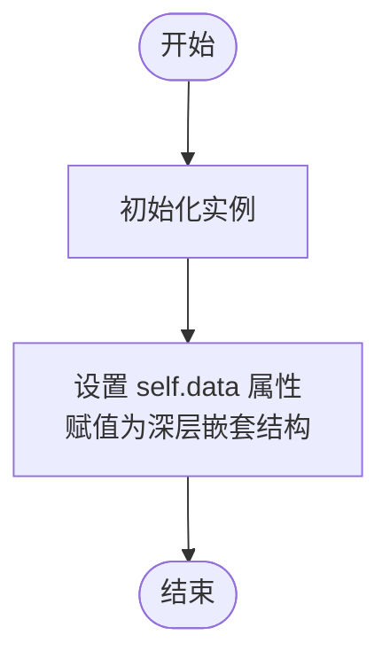

# `.\AutoGPT\autogpt_platform\backend\backend\executor\utils_test.py` 详细设计文档

该文件包含针对后端执行工具（backend.executor.utils）的单元测试和异步集成测试，核心功能涵盖动态字段（列表、字典、对象）的输入输出解析、图执行的生命周期管理（添加、停止、状态检查）以及节点凭证的可选性与验证逻辑。

## 整体流程


## 类结构

```
Test Helper Classes (测试辅助类)
├── Sample
├── NestedSample
├── NestedObj
├── ParentObj
└── ComplexObj
```

## 全局变量及字段


### `Sample.attr1`
    
第一个字符串属性

类型：`str`
    


### `Sample.attr2`
    
第二个字符串属性

类型：`str`
    


### `NestedSample.attr1`
    
包含整数的列表属性

类型：`list`
    


### `NestedSample.attr2`
    
包含键值对的字典属性

类型：`dict`
    


### `NestedObj.value`
    
存储嵌套值的字符串属性

类型：`str`
    


### `ParentObj.items`
    
包含字典的列表属性

类型：`list`
    


### `ComplexObj.data`
    
包含复杂嵌套结构的列表属性

类型：`list`
    
    

## 全局函数及方法


### `test_parse_execution_output`

单元测试函数，用于验证 `parse_execution_output` 函数能够正确解析各种复杂的数据结构（包括基本类型、列表、字典、对象及其嵌套组合），处理特定分隔符语法（`$_`、`_#_`、`_@_`）的路径访问，支持工具 Pin 路由逻辑，并能够妥善处理无效路径或缺失参数等异常情况。

参数：

- 无

返回值：`None`，不返回值，仅执行断言验证。

#### 流程图

```mermaid
flowchart TD
    Start([开始测试]) --> Basic[基础输出解析]
    Basic --> List[列表输出解析<br>$_索引]
    List --> Dict[字典输出解析<br>_#_键]
    Dict --> Obj[对象输出解析<br>_@_属性]
    Obj --> NestedList[嵌套列表解析]
    NestedList --> ListDict[列表包含字典]
    ListDict --> DictList[字典包含列表]
    DictList --> ComplexNested[复杂嵌套结构解析]
    ComplexNested --> InvalidPaths[无效路径处理<br>预期返回 None]
    InvalidPaths --> DelimiterOrder[分隔符处理顺序测试]
    DelimiterOrder --> InvalidPathsMixed[混合分隔符与无效路径]
    InvalidPathsMixed --> ToolPinRouting[工具 Pin 路由测试]
    ToolPinRouting --> ToolPinMatch[节点ID和Pin名称匹配]
    ToolPinMatch --> ToolPinMismatch[节点ID或Pin名称不匹配]
    ToolPinMismatch --> ToolPinComplex[复杂字段名路由]
    ToolPinComplex --> ToolPinError[缺失参数异常测试]
    ToolPinError --> NonToolLogic[非工具Pin模式回退]
    NonToolLogic --> End([结束])
```

#### 带注释源码

```python
def test_parse_execution_output():
    # 测试基本输出解析：直接获取元组的第二个元素
    output = ("result", "value")
    assert parse_execution_output(output, "result") == "value"

    # 测试列表输出解析：使用 $_ 获取列表索引为1的元素
    output = ("result", [10, 20, 30])
    assert parse_execution_output(output, "result_$_1") == 20

    # 测试字典输出解析：使用 _#_ 获取字典键为key1的值
    output = ("result", {"key1": "value1", "key2": "value2"})
    assert parse_execution_output(output, "result_#_key1") == "value1"

    # 测试对象输出解析：使用 @_ 获取对象属性attr1的值
    class Sample:
        def __init__(self):
            self.attr1 = "value1"
            self.attr2 = "value2"

    output = ("result", Sample())
    assert parse_execution_output(output, "result_@_attr1") == "value1"

    # 测试嵌套列表输出：解析 [[1, 2], [3, 4]] 中的特定元素
    output = ("result", [[1, 2], [3, 4]])
    assert parse_execution_output(output, "result_$_0_$_1") == 2
    assert parse_execution_output(output, "result_$_1_$_0") == 3

    # 测试列表包含字典：解析列表中字典的特定键值
    output = ("result", [{"key1": "value1"}, {"key2": "value2"}])
    assert parse_execution_output(output, "result_$_0_#_key1") == "value1"
    assert parse_execution_output(output, "result_$_1_#_key2") == "value2"

    # 测试字典包含列表：解析字典中列表的特定索引值
    output = ("result", {"key1": [1, 2], "key2": [3, 4]})
    assert parse_execution_output(output, "result_#_key1_$_1") == 2
    assert parse_execution_output(output, "result_#_key2_$_0") == 3

    # 测试复杂的嵌套结构：结合列表、对象、字典的混合路径
    class NestedSample:
        def __init__(self):
            self.attr1 = [1, 2]
            self.attr2 = {"key": "value"}

    output = ("result", [NestedSample(), {"key": [1, 2]}])
    assert parse_execution_output(output, "result_$_0_@_attr1_$_1") == 2
    assert parse_execution_output(output, "result_$_0_@_attr2_#_key") == "value"
    assert parse_execution_output(output, "result_$_1_#_key_$_0") == 1

    # 测试不存在的路径：验证对于越界索引、缺失键、错误属性均返回 None
    output = ("result", [1, 2, 3])
    assert parse_execution_output(output, "result_$_5") is None
    assert parse_execution_output(output, "result_#_key") is None
    assert parse_execution_output(output, "result_@_attr") is None
    assert parse_execution_output(output, "wrong_name") is None

    # 测试分隔符处理顺序：验证深层嵌套路径的解析能力
    # Test case 1: List -> Dict -> List
    output = ("result", [[{"key": [1, 2]}], [3, 4]])
    assert parse_execution_output(output, "result_$_0_$_0_#_key_$_1") == 2

    # Test case 2: Dict -> List -> Object
    class NestedObj:
        def __init__(self):
            self.value = "nested"

    output = ("result", {"key": [NestedObj(), 2]})
    assert parse_execution_output(output, "result_#_key_$_0_@_value") == "nested"

    # Test case 3: Object -> List -> Dict
    class ParentObj:
        def __init__(self):
            self.items = [{"nested": "value"}]

    output = ("result", ParentObj())
    assert parse_execution_output(output, "result_@_items_$_0_#_nested") == "value"

    # Test case 4: 复杂嵌套结构包含所有类型
    class ComplexObj:
        def __init__(self):
            self.data = [{"items": [{"value": "deep"}]}]

    output = ("result", {"key": [ComplexObj()]})
    assert (
        parse_execution_output(
            output, "result_#_key_$_0_@_data_$_0_#_items_$_0_#_value"
        )
        == "deep"
    )

    # Test case 5: 无效路径应返回 None
    output = ("result", [{"key": [1, 2]}])
    assert parse_execution_output(output, "result_$_0_#_wrong_key") is None
    assert parse_execution_output(output, "result_$_0_#_key_$_5") is None
    assert parse_execution_output(output, "result_$_0_@_attr") is None

    # Test case 6: 错误顺序的混合分隔符类型
    output = ("result", {"key": [1, 2]})
    assert (
        parse_execution_output(output, "result_#_key_$_1_@_attr") is None
    )  # 应在 @_attr 处失败
    assert (
        parse_execution_output(output, "result_@_attr_$_0_#_key") is None
    )  # 应在 @_attr 处失败

    # Test case 7: 工具 Pin 路由匹配节点ID和Pin名称
    output = ("tools_^_node123_~_query", "search term")
    assert parse_execution_output(output, "tools", "node123", "query") == "search term"

    # Test case 8: 工具 Pin 路由节点ID不匹配
    output = ("tools_^_node123_~_query", "search term")
    assert parse_execution_output(output, "tools", "node456", "query") is None

    # Test case 9: 工具 Pin 路由Pin名称不匹配
    output = ("tools_^_node123_~_query", "search term")
    assert parse_execution_output(output, "tools", "node123", "different_pin") is None

    # Test case 10: 工具 Pin 路由复杂字段名
    output = ("tools_^_node789_~_nested_field", {"key": "value"})
    result = parse_execution_output(output, "tools", "node789", "nested_field")
    assert result == {"key": "value"}

    # Test case 11: 工具 Pin 路由缺失必要参数应抛出错误
    output = ("tools_^_node123_~_query", "search term")
    try:
        parse_execution_output(output, "tools", "node123")  # 缺少 sink_pin_name
        assert False, "Should have raised ValueError"
    except ValueError as e:
        assert "must be provided for tool pin routing" in str(e)

    # Test case 12: 相似模式的非工具 Pin 应使用普通逻辑
    output = ("tools_^_node123_~_query", "search term")
    assert parse_execution_output(output, "different_name", "node123", "query") is None
```


### `test_merge_execution_input`

该函数是 `merge_execution_input` 的单元测试函数，旨在验证将扁平化的键值对数据合并为复杂数据结构（如列表、字典、对象及其嵌套组合）的正确性。它测试了通过特定定界符（`$_` 表示列表索引，`#` 表示字典键，`@` 表示对象属性）解析路径的逻辑，并覆盖了基本结构、深层嵌套、定界符顺序以及无效输入引发的异常情况。

参数：

返回值：`None`，该函数为测试用例，不返回具体值，通过断言验证逻辑正确性。

#### 流程图

```mermaid
graph TD
    A[开始: test_merge_execution_input] --> B[测试基本列表提取<br/>list_$_0, list_$_1]
    B --> C[测试基本字典提取<br/>dict_#_key1]
    C --> D[测试对象属性提取<br/>object_@_attr1]
    D --> E[测试嵌套结构<br/>List, Dict, Object]
    E --> F[测试复杂混合嵌套结构]
    F --> G[测试无效列表索引异常<br/>ValueError]
    G --> H[测试定界符顺序逻辑<br/>1. List->Dict->List<br/>2. Dict->List->Object<br/>3. Object->List->Dict<br/>4. Complex]
    H --> I[测试混合定界符类型与覆盖逻辑]
    I --> J[结束: 所有断言通过]
```

#### 带注释源码

```python
def test_merge_execution_input():
    # Test case for basic list extraction
    # 测试基本的列表提取：将带索引的字段合并为列表
    data = {
        "list_$_0": "a",
        "list_$_1": "b",
    }
    result = merge_execution_input(data)
    assert "list" in result
    assert result["list"] == ["a", "b"]

    # Test case for basic dict extraction
    # 测试基本的字典提取：将带键的字段合并为字典
    data = {
        "dict_#_key1": "value1",
        "dict_#_key2": "value2",
    }
    result = merge_execution_input(data)
    assert "dict" in result
    assert result["dict"] == {"key1": "value1", "key2": "value2"}

    # Test case for object extraction
    # 测试对象提取：将带属性名的字段合并为 MockObject
    class Sample:
        def __init__(self):
            self.attr1 = None
            self.attr2 = None

    data = {
        "object_@_attr1": "value1",
        "object_@_attr2": "value2",
    }
    result = merge_execution_input(data)
    assert "object" in result
    assert isinstance(result["object"], MockObject)
    assert result["object"].attr1 == "value1"
    assert result["object"].attr2 == "value2"

    # Test case for nested list extraction
    # 测试嵌套列表提取：二维列表的重建
    data = {
        "nested_list_$_0_$_0": "a",
        "nested_list_$_0_$_1": "b",
        "nested_list_$_1_$_0": "c",
    }
    result = merge_execution_input(data)
    assert "nested_list" in result
    assert result["nested_list"] == [["a", "b"], ["c"]]

    # Test case for list containing dict
    # 测试列表中包含字典的结构
    data = {
        "list_with_dict_$_0_#_key1": "value1",
        "list_with_dict_$_0_#_key2": "value2",
        "list_with_dict_$_1_#_key3": "value3",
    }
    result = merge_execution_input(data)
    assert "list_with_dict" in result
    assert result["list_with_dict"] == [
        {"key1": "value1", "key2": "value2"},
        {"key3": "value3"},
    ]

    # Test case for dict containing list
    # 测试字典中包含列表的结构
    data = {
        "dict_with_list_#_key1_$_0": "value1",
        "dict_with_list_#_key1_$_1": "value2",
        "dict_with_list_#_key2_$_0": "value3",
    }
    result = merge_execution_input(data)
    assert "dict_with_list" in result
    assert result["dict_with_list"] == {
        "key1": ["value1", "value2"],
        "key2": ["value3"],
    }

    # Test case for complex nested structure
    # 测试复杂嵌套结构：List -> Dict -> Object
    data = {
        "complex_$_0_#_key1_$_0": "value1",
        "complex_$_0_#_key1_$_1": "value2",
        "complex_$_0_#_key2_@_attr1": "value3",
        "complex_$_1_#_key3_$_0": "value4",
    }
    result = merge_execution_input(data)
    assert "complex" in result
    assert result["complex"][0]["key1"] == ["value1", "value2"]
    assert isinstance(result["complex"][0]["key2"], MockObject)
    assert result["complex"][0]["key2"].attr1 == "value3"
    assert result["complex"][1]["key3"] == ["value4"]

    # Test case for invalid list index
    # 测试无效列表索引：期望抛出 ValueError
    data = {"list_$_invalid": "value"}
    with pytest.raises(ValueError, match="index must be an integer"):
        merge_execution_input(data)

    # Test cases for delimiter ordering
    # 测试定界符处理顺序的各种组合
    # Test case 1: List -> Dict -> List
    data = {
        "nested_$_0_#_key_$_0": "value1",
        "nested_$_0_#_key_$_1": "value2",
    }
    result = merge_execution_input(data)
    assert "nested" in result
    assert result["nested"][0]["key"] == ["value1", "value2"]

    # Test case 2: Dict -> List -> Object
    data = {
        "nested_#_key_$_0_@_attr": "value1",
        "nested_#_key_$_1_@_attr": "value2",
    }
    result = merge_execution_input(data)
    assert "nested" in result
    assert isinstance(result["nested"]["key"][0], MockObject)
    assert result["nested"]["key"][0].attr == "value1"
    assert result["nested"]["key"][1].attr == "value2"

    # Test case 3: Object -> List -> Dict
    data = {
        "nested_@_items_$_0_#_key": "value1",
        "nested_@_items_$_1_#_key": "value2",
    }
    result = merge_execution_input(data)
    assert "nested" in result
    nested = result["nested"]
    assert isinstance(nested, MockObject)
    items = nested.items
    assert isinstance(items, list)
    assert items[0]["key"] == "value1"
    assert items[1]["key"] == "value2"

    # Test case 4: Complex nested structure with all types
    # 测试包含所有类型的极深嵌套结构
    data = {
        "deep_#_key_$_0_@_data_$_0_#_items_$_0_#_value": "deep_value",
        "deep_#_key_$_0_@_data_$_1_#_items_$_0_#_value": "another_value",
    }
    result = merge_execution_input(data)
    assert "deep" in result
    deep_key = result["deep"]["key"][0]
    assert deep_key is not None
    data0 = getattr(deep_key, "data", None)
    assert isinstance(data0, list)
    # Check items0
    items0 = None
    if len(data0) > 0 and isinstance(data0[0], dict) and "items" in data0[0]:
        items0 = data0[0]["items"]
    assert isinstance(items0, list)
    items0 = cast(list, items0)
    assert len(items0) > 0
    assert isinstance(items0[0], dict)
    assert items0[0]["value"] == "deep_value"  # type: ignore
    # Check items1
    items1 = None
    if len(data0) > 1 and isinstance(data0[1], dict) and "items" in data0[1]:
        items1 = data0[1]["items"]
    assert isinstance(items1, list)
    items1 = cast(list, items1)
    assert len(items1) > 0
    assert isinstance(items1[0], dict)
    assert items1[0]["value"] == "another_value"  # type: ignore

    # Test case 5: Mixed delimiter types in different orders
    # 测试混合定界符类型，最后出现的定界符应决定结构类型
    # the last one should replace the type
    data = {
        "mixed_$_0_#_key_@_attr": "value1",  # List -> Dict -> Object
        "mixed_#_key_$_0_@_attr": "value2",  # Dict -> List -> Object
        "mixed_@_attr_$_0_#_key": "value3",  # Object -> List -> Dict
    }
    result = merge_execution_input(data)
    assert "mixed" in result
    # 最终结构应为 Object -> List -> Dict
    assert result["mixed"].attr[0]["key"] == "value3"
```


### `test_add_graph_execution_is_repeatable`

该测试函数旨在验证 `add_graph_execution` 函数的执行具有可重复性和一致性。具体而言，它测试了使用一次执行返回的输出属性（如 `graph_id`, `inputs`, `graph_version` 等）作为输入参数再次调用 `add_graph_execution` 时，两次调用传递给底层数据库创建方法（`create_graph_execution`）的参数是否完全一致。这确保了图执行逻辑在处理相同配置时能够产生相同的数据请求，对于实现如重试、重放或状态恢复等功能至关重要。

参数：

-   `mocker`：`MockerFixture`，Pytest 提供的夹具，用于在测试过程中模拟对象、修补函数以及控制 Mock 对象的行为。

返回值：`None`，这是一个异步测试函数，用于断言验证，不返回具体数值。

#### 流程图


#### 带注释源码

```python
@pytest.mark.asyncio
async def test_add_graph_execution_is_repeatable(mocker: MockerFixture):
    """
    Verify that calling the function with its own output creates the same execution again.
    """
    from backend.data.execution import GraphExecutionWithNodes
    from backend.data.model import CredentialsMetaInput
    from backend.executor.utils import add_graph_execution
    from backend.integrations.providers import ProviderName

    # ==============================
    # 步骤 1: 定义模拟输入数据
    # ==============================
    graph_id = "test-graph-id"
    user_id = "test-user-id"
    inputs = {"test_input": "test_value"}
    preset_id = "test-preset-id"
    graph_version = 1
    graph_credentials_inputs = {
        "cred_key": CredentialsMetaInput(
            id="cred-id", provider=ProviderName("test_provider"), type="oauth2"
        )
    }
    nodes_input_masks = {"node1": {"input1": "masked_value"}}

    # ==============================
    # 步骤 2: 准备内部依赖的 Mock 对象
    # ==============================
    # Mock graph object
    mock_graph = mocker.MagicMock()
    mock_graph.version = graph_version

    # Mock starting nodes input and compiled nodes input masks
    starting_nodes_input = [
        ("node1", {"input1": "value1"}),
        ("node2", {"input1": "value2"}),
    ]
    compiled_nodes_input_masks = {"node1": {"input1": "compiled_mask"}}

    # Mock the graph execution object (第一次执行返回的对象)
    mock_graph_exec = mocker.MagicMock(spec=GraphExecutionWithNodes)
    mock_graph_exec.id = "execution-id-123"
    mock_graph_exec.node_executions = []  # 避免 AttributeError
    mock_graph_exec.status = ExecutionStatus.QUEUED  # 用于竞态条件检查
    mock_graph_exec.graph_version = graph_version
    mock_graph_exec.to_graph_execution_entry.return_value = mocker.MagicMock()

    # Mock the queue and event bus
    mock_queue = mocker.AsyncMock()
    mock_event_bus = mocker.MagicMock()
    mock_event_bus.publish = mocker.AsyncMock()

    # ==============================
    # 步骤 3: 设置外部依赖
    # ==============================
    mock_validate = mocker.patch(
        "backend.executor.utils.validate_and_construct_node_execution_input"
    )
    mock_edb = mocker.patch("backend.executor.utils.execution_db")
    mock_prisma = mocker.patch("backend.executor.utils.prisma")
    mock_udb = mocker.patch("backend.executor.utils.user_db")
    mock_gdb = mocker.patch("backend.executor.utils.graph_db")
    mock_get_queue = mocker.patch("backend.executor.utils.get_async_execution_queue")
    mock_get_event_bus = mocker.patch(
        "backend.executor.utils.get_async_execution_event_bus"
    )

    # ==============================
    # 步骤 4: 配置 Mock 返回行为
    # ==============================
    # 返回 (graph, starting_nodes_input, compiled_nodes_input_masks, nodes_to_skip)
    nodes_to_skip: set[str] = set()
    mock_validate.return_value = (
        mock_graph,
        starting_nodes_input,
        compiled_nodes_input_masks,
        nodes_to_skip,
    )
    mock_prisma.is_connected.return_value = True
    
    # 配置 create_graph_execution 返回第一次执行的 mock 对象
    mock_edb.create_graph_execution = mocker.AsyncMock(return_value=mock_graph_exec)
    mock_edb.update_graph_execution_stats = mocker.AsyncMock(
        return_value=mock_graph_exec
    )
    mock_edb.update_node_execution_status_batch = mocker.AsyncMock()

    # Mock user and settings data
    mock_user = mocker.MagicMock()
    mock_user.timezone = "UTC"
    mock_settings = mocker.MagicMock()
    mock_settings.human_in_the_loop_safe_mode = True
    mock_settings.sensitive_action_safe_mode = False

    mock_udb.get_user_by_id = mocker.AsyncMock(return_value=mock_user)
    mock_gdb.get_graph_settings = mocker.AsyncMock(return_value=mock_settings)
    mock_get_queue.return_value = mock_queue
    mock_get_event_bus.return_value = mock_event_bus

    # ==============================
    # 步骤 5: 第一次执行调用
    # ==============================
    result1 = await add_graph_execution(
        graph_id=graph_id,
        user_id=user_id,
        inputs=inputs,
        preset_id=preset_id,
        graph_version=graph_version,
        graph_credentials_inputs=graph_credentials_inputs,
        nodes_input_masks=nodes_input_masks,
    )

    # ==============================
    # 步骤 6: 捕获并验证第一次调用的参数
    # ==============================
    first_call_kwargs = mock_edb.create_graph_execution.call_args[1]

    mock_edb.create_graph_execution.assert_called_once_with(
        user_id=user_id,
        graph_id=graph_id,
        graph_version=mock_graph.version,
        inputs=inputs,
        credential_inputs=graph_credentials_inputs,
        nodes_input_masks=nodes_input_masks,
        starting_nodes_input=starting_nodes_input,
        preset_id=preset_id,
        parent_graph_exec_id=None,
    )

    # 设置 mock_graph_exec 的属性，使其看起来像真实的执行结果
    mock_graph_exec.graph_id = graph_id
    mock_graph_exec.user_id = user_id
    mock_graph_exec.graph_version = graph_version
    mock_graph_exec.inputs = inputs
    mock_graph_exec.credential_inputs = graph_credentials_inputs
    mock_graph_exec.nodes_input_masks = nodes_input_masks
    mock_graph_exec.preset_id = preset_id

    # ==============================
    # 步骤 7: 准备第二次执行的环境
    # ==============================
    # 创建第二次执行的 mock 对象
    mock_graph_exec_2 = mocker.MagicMock(spec=GraphExecutionWithNodes)
    mock_graph_exec_2.id = "execution-id-456"
    mock_graph_exec_2.node_executions = []
    mock_graph_exec_2.status = ExecutionStatus.QUEUED
    mock_graph_exec_2.graph_version = graph_version
    mock_graph_exec_2.to_graph_execution_entry.return_value = mocker.MagicMock()

    # 重置 create_graph_execution 的 mock，以便捕获第二次调用
    mock_edb.create_graph_execution.reset_mock()
    mock_edb.create_graph_execution.return_value = mock_graph_exec_2
    mock_validate.reset_mock()

    # ==============================
    # 步骤 8: 第二次执行调用 (使用第一次的输出)
    # ==============================
    result2 = await add_graph_execution(
        graph_id=mock_graph_exec.graph_id,
        user_id=mock_graph_exec.user_id,
        inputs=mock_graph_exec.inputs,
        preset_id=mock_graph_exec.preset_id,
        graph_version=mock_graph_exec.graph_version,
        graph_credentials_inputs=mock_graph_exec.credential_inputs,
        nodes_input_masks=mock_graph_exec.nodes_input_masks,
    )

    # ==============================
    # 步骤 9: 捕获并比较参数
    # ==============================
    second_call_kwargs = mock_edb.create_graph_execution.call_args[1]

    # 核心断言：验证两次调用的参数完全一致
    assert first_call_kwargs == second_call_kwargs

    # 验证执行返回的对象
    assert result1 == mock_graph_exec
    assert result2 == mock_graph_exec_2
```


### `test_validate_node_input_credentials_returns_nodes_to_skip`

该函数是一个异步测试用例，用于验证内部函数 `_validate_node_input_credentials` 在节点设置了 `credentials_optional=True` 且缺失凭证时，能正确地将该节点ID添加到 `nodes_to_skip` 集合中，而不是报错。

参数：

- `mocker`：`MockerFixture`，pytest-mock 提供的夹具，用于模拟对象和修补函数依赖。

返回值：`None`，该函数为测试函数，主要用于断言验证，无显式返回值。

#### 流程图

```mermaid
flowchart TD
    A[开始: test_validate_node_input_credentials_returns_nodes_to_skip] --> B[Mock 节点对象<br/>credentials_optional=True<br/>input_default={}]
    B --> C[Mock Block 对象<br/>配置 get_credentials_fields 返回凭证字段]
    C --> D[Mock Graph 对象<br/>包含上述节点]
    D --> E[调用 _validate_node_input_credentials<br/>传入 graph, user_id, nodes_input_masks=None]
    E --> F[获取返回值: errors, nodes_to_skip]
    F --> G{断言: 节点ID是否在 nodes_to_skip 中?}
    G -- 否 --> H[测试失败]
    G -- 是 --> I{断言: 节点ID是否不在 errors 中?}
    I -- 否 --> H
    I -- 是 --> J[测试通过]
```

#### 带注释源码

```python
@pytest.mark.asyncio
async def test_validate_node_input_credentials_returns_nodes_to_skip(
    mocker: MockerFixture,
):
    """
    Test that _validate_node_input_credentials returns nodes_to_skip set
    for nodes with credentials_optional=True and missing credentials.
    """
    from backend.executor.utils import _validate_node_input_credentials

    # 1. 创建一个模拟节点对象，设置 credentials_optional 为 True
    # 意味着该节点虽然需要凭证配置，但在缺失时不应该报错，而是跳过执行
    mock_node = mocker.MagicMock()
    mock_node.id = "node-with-optional-creds"
    mock_node.credentials_optional = True
    mock_node.input_default = {}  # 模拟未配置凭证的情况

    # 2. 创建模拟 Block 对象，并模拟其 input_schema.get_credentials_fields 方法
    # 使其返回包含 "credentials" 字段的字典，表示该节点定义了凭证字段
    mock_block = mocker.MagicMock()
    mock_credentials_field_type = mocker.MagicMock()
    mock_block.input_schema.get_credentials_fields.return_value = {
        "credentials": mock_credentials_field_type
    }
    mock_node.block = mock_block

    # 3. 创建模拟 Graph 对象，并将上述节点加入节点列表
    mock_graph = mocker.MagicMock()
    mock_graph.nodes = [mock_node]

    # 4. 调用待测试函数 _validate_node_input_credentials
    # 传入模拟的 graph 和 user_id，以及空 masks
    errors, nodes_to_skip = await _validate_node_input_credentials(
        graph=mock_graph,
        user_id="test-user-id",
        nodes_input_masks=None,
    )

    # 5. 验证结果：该节点 ID 应该存在于 nodes_to_skip 集合中
    # 表示系统识别到了该节点因缺少可选凭证而应被跳过
    assert mock_node.id in nodes_to_skip
    
    # 6. 验证结果：该节点 ID 不应该存在于 errors 字典中
    # 表示虽然缺少凭证，但因为标记为 optional，所以不算作错误
    assert mock_node.id not in errors
```


### `test_validate_node_input_credentials_required_missing_creds_error`

该测试函数用于验证 `_validate_node_input_credentials` 的行为，当节点的凭证被标记为必选（`credentials_optional=False`）且未提供凭证时，确保该函数能正确返回相应的错误信息，而不是将该节点加入跳过列表。

参数：

-  `mocker`：`MockerFixture`，Pytest 提供的 fixture，用于模拟对象和函数的行为。

返回值：`None`，该函数为异步测试用例，无返回值，主要通过断言验证逻辑正确性。

#### 流程图

```mermaid
flowchart TD
    A[开始测试] --> B[Mock 节点 node<br>credentials_optional=False<br>input_default={}]
    B --> C[Mock 模块 Block<br>包含 credentials 字段定义]
    C --> D[构建 Mock 图 Graph<br>包含上述节点]
    D --> E[调用 _validate_node_input_credentials]
    E --> F[获取返回值 errors 和 nodes_to_skip]
    F --> G{断言检查}
    G --> G1[节点 ID 在 errors 中?]
    G --> G2[errors 包含 'credentials' 键?]
    G --> G3[错误信息包含 'required'?]
    G --> G4[节点 ID 不在 nodes_to_skip 中?]
    G1 --> H[测试通过]
    G2 --> H
    G3 --> H
    G4 --> H
```

#### 带注释源码

```python
@pytest.mark.asyncio
async def test_validate_node_input_credentials_required_missing_creds_error(
    mocker: MockerFixture,
):
    """
    Test that _validate_node_input_credentials returns errors
    for nodes with credentials_optional=False and missing credentials.
    """
    from backend.executor.utils import _validate_node_input_credentials

    # 创建一个模拟节点，设置 credentials_optional 为 False（即必选），且 input_default 为空（未配置凭证）
    mock_node = mocker.MagicMock()
    mock_node.id = "node-with-required-creds"
    mock_node.credentials_optional = False
    mock_node.input_default = {}  # No credentials configured

    # 创建一个模拟块，模拟其包含一个凭证字段定义
    mock_block = mocker.MagicMock()
    mock_credentials_field_type = mocker.MagicMock()
    mock_block.input_schema.get_credentials_fields.return_value = {
        "credentials": mock_credentials_field_type
    }
    mock_node.block = mock_block

    # 创建模拟图并将节点加入其中
    mock_graph = mocker.MagicMock()
    mock_graph.nodes = [mock_node]

    # 调用被测函数 _validate_node_input_credentials
    errors, nodes_to_skip = await _validate_node_input_credentials(
        graph=mock_graph,
        user_id="test-user-id",
        nodes_input_masks=None,
    )

    # 断言验证结果：
    # 1. 节点 ID 应该出现在 errors 字典中
    assert mock_node.id in errors
    # 2. 错误详情中应包含 'credentials' 字段
    assert "credentials" in errors[mock_node.id]
    # 3. 错误信息应包含 "required" 字样（因为设置了 credentials_optional=False）
    assert "required" in errors[mock_node.id]["credentials"].lower()
    # 4. 节点 ID 不应出现在 nodes_to_skip 集合中（只有可选凭证缺失时才跳过）
    assert mock_node.id not in nodes_to_skip
```


### `test_validate_graph_with_credentials_returns_nodes_to_skip`

该函数是一个异步测试用例，用于验证 `validate_graph_with_credentials` 方法能够正确地从内部的 `_validate_node_input_credentials` 函数中获取并返回 `nodes_to_skip` 集合。它确保了当节点因为可选凭证缺失而应被跳过时，这些节点 ID 能够被正确传递给调用者。

参数：

- `mocker`：`MockerFixture`，Pytest 提供的 fixture，用于模拟对象和补丁函数。

返回值：`None`，该函数没有返回值，主要通过断言来验证逻辑的正确性。

#### 流程图


#### 带注释源码

```python
@pytest.mark.asyncio
async def test_validate_graph_with_credentials_returns_nodes_to_skip(
    mocker: MockerFixture,
):
    """
    Test that validate_graph_with_credentials returns nodes_to_skip set
    from _validate_node_input_credentials.
    """
    # 导入需要测试的目标函数
    from backend.executor.utils import validate_graph_with_credentials

    # Mock 内部函数 _validate_node_input_credentials
    # 这样我们可以控制它的返回值，而不需要真实的数据库或逻辑
    mock_validate = mocker.patch(
        "backend.executor.utils._validate_node_input_credentials"
    )
    
    # 定义 Mock 函数应该返回的预期数据
    expected_errors = {"node1": {"field": "error"}}
    expected_nodes_to_skip = {"node2", "node3"}
    mock_validate.return_value = (expected_errors, expected_nodes_to_skip)

    # 创建一个模拟的 GraphModel 对象，并模拟其 validate_graph_get_errors 方法
    # 使其返回空字典，表示图结构验证本身没有错误
    mock_graph = mocker.MagicMock()
    mock_graph.validate_graph_get_errors.return_value = {}

    # 调用待测试的函数 validate_graph_with_credentials
    # 传入模拟的 graph 和 user_id
    errors, nodes_to_skip = await validate_graph_with_credentials(
        graph=mock_graph,
        user_id="test-user-id",
        nodes_input_masks=None,
    )

    # 验证返回的 nodes_to_skip 是否与预期一致
    # 这确认了来自 _validate_node_input_credentials 的跳过集合被正确传递了
    assert nodes_to_skip == expected_nodes_to_skip
    
    # 验证错误字典中包含了预期的错误信息
    assert "node1" in errors
```


### `test_add_graph_execution_with_nodes_to_skip`

测试 `add_graph_execution` 函数是否能正确将 `nodes_to_skip` 参数传递给图执行条目的创建逻辑。

参数：

- `mocker`：`MockerFixture`，Pytest 提供的 fixture，用于模拟外部依赖和配置测试环境。

返回值：`None`，该函数为测试用例，无返回值，通过断言验证行为。

#### 流程图


#### 带注释源码

```python
@pytest.mark.asyncio
async def test_add_graph_execution_with_nodes_to_skip(mocker: MockerFixture):
    """
    Test that add_graph_execution properly passes nodes_to_skip
    to the graph execution entry.
    """
    from backend.data.execution import GraphExecutionWithNodes
    from backend.executor.utils import add_graph_execution

    # Mock data
    graph_id = "test-graph-id"
    user_id = "test-user-id"
    inputs = {"test_input": "test_value"}
    graph_version = 1

    # Mock the graph object
    mock_graph = mocker.MagicMock()
    mock_graph.version = graph_version

    # Starting nodes and masks
    starting_nodes_input = [("node1", {"input1": "value1"})]
    compiled_nodes_input_masks = {}
    # 定义预期的需要跳过的节点集合
    nodes_to_skip = {"skipped-node-1", "skipped-node-2"}

    # Mock the graph execution object
    mock_graph_exec = mocker.MagicMock(spec=GraphExecutionWithNodes)
    mock_graph_exec.id = "execution-id-123"
    mock_graph_exec.node_executions = []
    mock_graph_exec.status = ExecutionStatus.QUEUED  # Required for race condition check
    mock_graph_exec.graph_version = graph_version

    # Track what's passed to to_graph_execution_entry
    captured_kwargs = {}

    # 定义副作用函数，用于捕获调用 to_graph_execution_entry 时传入的关键字参数
    def capture_to_entry(**kwargs):
        captured_kwargs.update(kwargs)
        return mocker.MagicMock()

    mock_graph_exec.to_graph_execution_entry.side_effect = capture_to_entry

    # Setup mocks
    # Patch 验证函数，使其返回包含 nodes_to_skip 的元组
    mock_validate = mocker.patch(
        "backend.executor.utils.validate_and_construct_node_execution_input"
    )
    mock_edb = mocker.patch("backend.executor.utils.execution_db")
    mock_prisma = mocker.patch("backend.executor.utils.prisma")
    mock_udb = mocker.patch("backend.executor.utils.user_db")
    mock_gdb = mocker.patch("backend.executor.utils.graph_db")
    mock_get_queue = mocker.patch("backend.executor.utils.get_async_execution_queue")
    mock_get_event_bus = mocker.patch(
        "backend.executor.utils.get_async_execution_event_bus"
    )

    # Setup returns - include nodes_to_skip in the tuple
    mock_validate.return_value = (
        mock_graph,
        starting_nodes_input,
        compiled_nodes_input_masks,
        nodes_to_skip,  # This should be passed through
    )
    mock_prisma.is_connected.return_value = True
    mock_edb.create_graph_execution = mocker.AsyncMock(return_value=mock_graph_exec)
    mock_edb.update_graph_execution_stats = mocker.AsyncMock(
        return_value=mock_graph_exec
    )
    mock_edb.update_node_execution_status_batch = mocker.AsyncMock()

    mock_user = mocker.MagicMock()
    mock_user.timezone = "UTC"
    mock_settings = mocker.MagicMock()
    mock_settings.human_in_the_loop_safe_mode = True
    mock_settings.sensitive_action_safe_mode = False

    mock_udb.get_user_by_id = mocker.AsyncMock(return_value=mock_user)
    mock_gdb.get_graph_settings = mocker.AsyncMock(return_value=mock_settings)
    mock_get_queue.return_value = mocker.AsyncMock()
    mock_get_event_bus.return_value = mocker.MagicMock(publish=mocker.AsyncMock())

    # Call the function
    await add_graph_execution(
        graph_id=graph_id,
        user_id=user_id,
        inputs=inputs,
        graph_version=graph_version,
    )

    # Verify nodes_to_skip was passed to to_graph_execution_entry
    # 验证 captured_kwargs 中是否包含了 nodes_to_skip，并且值正确
    assert "nodes_to_skip" in captured_kwargs
    assert captured_kwargs["nodes_to_skip"] == nodes_to_skip
```


### `test_stop_graph_execution_in_review_status_cancels_pending_reviews`

验证当停止处于 REVIEW 状态的图执行时，系统能够正确取消该执行的所有待人工审核请求，并将执行状态更新为 TERMINATED。

参数：

-   `mocker`：`MockerFixture`，Pytest 提供的模拟对象 fixture，用于模拟外部依赖和数据库交互。

返回值：`None`，测试函数无返回值，主要通过断言验证行为。

#### 流程图


#### 带注释源码

```python
@pytest.mark.asyncio
async def test_stop_graph_execution_in_review_status_cancels_pending_reviews(
    mocker: MockerFixture,
):
    """Test that stopping an execution in REVIEW status cancels pending reviews."""
    from backend.data.execution import ExecutionStatus, GraphExecutionMeta
    from backend.executor.utils import stop_graph_execution

    # 初始化测试用的用户ID和图执行ID
    user_id = "test-user"
    graph_exec_id = "test-exec-123"

    # 模拟一个处于 REVIEW 状态的图执行对象
    mock_graph_exec = mocker.MagicMock(spec=GraphExecutionMeta)
    mock_graph_exec.id = graph_exec_id
    mock_graph_exec.status = ExecutionStatus.REVIEW

    # 模拟获取异步执行队列的依赖
    mock_get_queue = mocker.patch("backend.executor.utils.get_async_execution_queue")
    mock_queue_client = mocker.AsyncMock()
    mock_get_queue.return_value = mock_queue_client

    # 模拟 Prisma 客户端连接状态
    mock_prisma = mocker.patch("backend.executor.utils.prisma")
    mock_prisma.is_connected.return_value = True

    # 模拟人工审核数据库 (human_review_db)
    # 设定取消待审核的返回值为 2 (表示取消了 2 个审核)
    mock_human_review_db = mocker.patch("backend.executor.utils.human_review_db")
    mock_human_review_db.cancel_pending_reviews_for_execution = mocker.AsyncMock(
        return_value=2  # 2 reviews cancelled
    )

    # 模拟执行数据库 (execution_db)
    # get_graph_execution_meta 返回前面创建的 mock_graph_exec
    mock_execution_db = mocker.patch("backend.executor.utils.execution_db")
    mock_execution_db.get_graph_execution_meta = mocker.AsyncMock(
        return_value=mock_graph_exec
    )
    # update_graph_execution_stats 用于验证状态更新
    mock_execution_db.update_graph_execution_stats = mocker.AsyncMock()

    # 模拟事件总线
    mock_get_event_bus = mocker.patch(
        "backend.executor.utils.get_async_execution_event_bus"
    )
    mock_event_bus = mocker.MagicMock()
    mock_event_bus.publish = mocker.AsyncMock()
    mock_get_event_bus.return_value = mock_event_bus

    # 模拟获取子执行，此处返回空列表
    mock_get_child_executions = mocker.patch(
        "backend.executor.utils._get_child_executions"
    )
    mock_get_child_executions.return_value = []  # No children

    # 调用被测试函数 stop_graph_execution
    # wait_timeout=1.0 允许内部进行状态检查
    await stop_graph_execution(
        user_id=user_id,
        graph_exec_id=graph_exec_id,
        wait_timeout=1.0,  # Wait to allow status check
        cascade=True,
    )

    # 断言：验证 human_review_db 的取消方法被正确调用
    mock_human_review_db.cancel_pending_reviews_for_execution.assert_called_once_with(
        graph_exec_id, user_id
    )

    # 断言：验证 execution_db 的更新统计方法被调用，且状态变更为 TERMINATED
    mock_execution_db.update_graph_execution_stats.assert_called_once()
    call_kwargs = mock_execution_db.update_graph_execution_stats.call_args[1]
    assert call_kwargs["graph_exec_id"] == graph_exec_id
    assert call_kwargs["status"] == ExecutionStatus.TERMINATED
```


### `test_stop_graph_execution_with_database_manager_when_prisma_disconnected`

验证当 Prisma 客户端连接状态不可用时，系统是否能正确回退并使用数据库管理器来停止图执行，包括取消待处理的审核请求并更新执行状态。

参数：

- `mocker`：`MockerFixture`，用于模拟对象和打补丁的 pytest fixture，用于配置测试环境中的依赖项和返回值。

返回值：`None`，该函数为测试用例，用于验证行为逻辑，不直接返回业务数据。

#### 流程图


#### 带注释源码

```python
@pytest.mark.asyncio
async def test_stop_graph_execution_with_database_manager_when_prisma_disconnected(
    mocker: MockerFixture,
):
    """Test that stop uses database manager when Prisma is not connected."""
    from backend.data.execution import ExecutionStatus, GraphExecutionMeta
    from backend.executor.utils import stop_graph_execution

    user_id = "test-user"
    graph_exec_id = "test-exec-456"

    # Mock graph execution in REVIEW status
    # 模拟一个处于审核状态的图执行对象
    mock_graph_exec = mocker.MagicMock(spec=GraphExecutionMeta)
    mock_graph_exec.id = graph_exec_id
    mock_graph_exec.status = ExecutionStatus.REVIEW

    # Mock dependencies
    # 模拟异步执行队列的获取
    mock_get_queue = mocker.patch("backend.executor.utils.get_async_execution_queue")
    mock_queue_client = mocker.AsyncMock()
    mock_get_queue.return_value = mock_queue_client

    # Prisma is NOT connected
    # 关键步骤：模拟 Prisma 数据库客户端未连接，触发回退逻辑
    mock_prisma = mocker.patch("backend.executor.utils.prisma")
    mock_prisma.is_connected.return_value = False

    # Mock database manager client
    # 模拟数据库管理器客户端，这是当 Prisma 不可用时的替代方案
    mock_get_db_manager = mocker.patch(
        "backend.executor.utils.get_database_manager_async_client"
    )
    mock_db_manager = mocker.AsyncMock()
    mock_db_manager.get_graph_execution_meta = mocker.AsyncMock(
        return_value=mock_graph_exec
    )
    mock_db_manager.cancel_pending_reviews_for_execution = mocker.AsyncMock(
        return_value=3  # 3 reviews cancelled
    )
    mock_db_manager.update_graph_execution_stats = mocker.AsyncMock()
    mock_get_db_manager.return_value = mock_db_manager

    # 模拟事件总线
    mock_get_event_bus = mocker.patch(
        "backend.executor.utils.get_async_execution_event_bus"
    )
    mock_event_bus = mocker.MagicMock()
    mock_event_bus.publish = mocker.AsyncMock()
    mock_get_event_bus.return_value = mock_event_bus

    # 模拟子执行获取（此处设为空）
    mock_get_child_executions = mocker.patch(
        "backend.executor.utils._get_child_executions"
    )
    mock_get_child_executions.return_value = []  # No children

    # Call stop_graph_execution with timeout
    # 调用被测函数 stop_graph_execution
    await stop_graph_execution(
        user_id=user_id,
        graph_exec_id=graph_exec_id,
        wait_timeout=1.0,
        cascade=True,
    )

    # Verify database manager was used for cancel_pending_reviews
    # 断言验证：确实使用了数据库管理器来取消待审核
    mock_db_manager.cancel_pending_reviews_for_execution.assert_called_once_with(
        graph_exec_id, user_id
    )

    # Verify execution status was updated via database manager
    # 断言验证：确实使用了数据库管理器来更新执行状态
    mock_db_manager.update_graph_execution_stats.assert_called_once()
```


### `test_stop_graph_execution_cascades_to_child_with_reviews`

该测试函数用于验证当停止一个父级图执行时，若启用了级联模式（cascade=True），停止操作会正确传播到子级执行，并且会取消子级执行中处于待处理状态的人工审查。

参数：

-   `mocker`：`MockerFixture`，Pytest 提供的模拟夹具，用于模拟外部依赖、数据库连接和异步调用。

返回值：`None`，该函数为单元测试，不返回具体值，主要通过断言验证逻辑正确性。

#### 流程图


#### 带注释源码

```python
async def test_stop_graph_execution_cascades_to_child_with_reviews(
    mocker: MockerFixture,
):
    """Test that stopping parent execution cascades to children and cancels their reviews."""
    from backend.data.execution import ExecutionStatus, GraphExecutionMeta
    from backend.executor.utils import stop_graph_execution

    # 定义测试用的用户ID和执行ID
    user_id = "test-user"
    parent_exec_id = "parent-exec"
    child_exec_id = "child-exec"

    # 模拟父级执行对象，初始状态为 RUNNING
    mock_parent_exec = mocker.MagicMock(spec=GraphExecutionMeta)
    mock_parent_exec.id = parent_exec_id
    mock_parent_exec.status = ExecutionStatus.RUNNING

    # 模拟子级执行对象，初始状态为 REVIEW (需要人工审查)
    mock_child_exec = mocker.MagicMock(spec=GraphExecutionMeta)
    mock_child_exec.id = child_exec_id
    mock_child_exec.status = ExecutionStatus.REVIEW

    # 模拟异步执行队列依赖
    mock_get_queue = mocker.patch("backend.executor.utils.get_async_execution_queue")
    mock_queue_client = mocker.AsyncMock()
    mock_get_queue.return_value = mock_queue_client

    # 模拟 Prisma 客户端连接状态为已连接
    mock_prisma = mocker.patch("backend.executor.utils.prisma")
    mock_prisma.is_connected.return_value = True

    # 模拟人工审查数据库，设置取消审查的异步方法
    mock_human_review_db = mocker.patch("backend.executor.utils.human_review_db")
    mock_human_review_db.cancel_pending_reviews_for_execution = mocker.AsyncMock(
        return_value=1  # 模拟取消了1条审查记录
    )

    # 模拟执行数据库操作
    mock_execution_db = mocker.patch("backend.executor.utils.execution_db")

    # 使用计数器跟踪调用次数，以模拟执行状态的异步变化
    call_count = {"count": 0}

    async def get_exec_meta_side_effect(execution_id, user_id):
        call_count["count"] += 1
        if execution_id == parent_exec_id:
            # 当调用次数超过3次（模拟子级处理完成后），将父级状态更新为 TERMINATED
            if call_count["count"] > 3:
                mock_parent_exec.status = ExecutionStatus.TERMINATED
            return mock_parent_exec
        elif execution_id == child_exec_id:
            return mock_child_exec
        return None

    # 设置 get_graph_execution_meta 的副作用函数
    mock_execution_db.get_graph_execution_meta = mocker.AsyncMock(
        side_effect=get_exec_meta_side_effect
    )
    mock_execution_db.update_graph_execution_stats = mocker.AsyncMock()

    # 模拟事件总线发布
    mock_get_event_bus = mocker.patch(
        "backend.executor.utils.get_async_execution_event_bus"
    )
    mock_event_bus = mocker.MagicMock()
    mock_event_bus.publish = mocker.AsyncMock()
    mock_get_event_bus.return_value = mock_event_bus

    # 模拟获取子级执行的辅助函数
    mock_get_child_executions = mocker.patch(
        "backend.executor.utils._get_child_executions"
    )

    def get_children_side_effect(parent_id):
        # 当查询父级ID时，返回包含子级执行的列表
        if parent_id == parent_exec_id:
            return [mock_child_exec]
        return []

    mock_get_child_executions.side_effect = get_children_side_effect

    # 调用被测函数 stop_graph_execution，开启级联停止模式
    await stop_graph_execution(
        user_id=user_id,
        graph_exec_id=parent_exec_id,
        wait_timeout=1.0,
        cascade=True,
    )

    # 验证：确认针对子级执行调用了取消待处理审查的方法
    mock_human_review_db.cancel_pending_reviews_for_execution.assert_called_once_with(
        child_exec_id, user_id
    )

    # 验证：确认数据库状态更新方法被调用（更新父级和子级状态）
    assert mock_execution_db.update_graph_execution_stats.call_count >= 1
```


### `Sample.__init__`

Sample 类的构造函数，负责初始化实例的属性值。

参数：

-   `self`：`Sample`，类的实例本身。

返回值：`None`，无返回值。

#### 流程图


#### 带注释源码

```python
def __init__(self):
    # 初始化实例属性 attr1，赋值为字符串 "value1"
    self.attr1 = "value1"
    # 初始化实例属性 attr2，赋值为字符串 "value2"
    self.attr2 = "value2"
```


### `NestedSample.__init__`

初始化嵌套属性

参数：无

返回值：`None`，无返回值

#### 流程图

```mermaid
flowchart TD
    Start([开始: __init__]) --> InitList[设置 self.attr1 = [1, 2]]
    InitList --> InitDict[设置 self.attr2 = {'key': 'value'}]
    InitDict --> End([结束: None])
```

#### 带注释源码

```python
def __init__(self):
    # 初始化列表属性 attr1
    self.attr1 = [1, 2]
    # 初始化字典属性 attr2
    self.attr2 = {"key": "value"}
```


### `NestedObj.__init__`

初始化 `NestedObj` 对象的实例，并将 `value` 属性赋值为字符串 "nested"。

参数：
- 无参数

返回值：`None`，构造函数不返回任何值。

#### 流程图


#### 带注释源码

```python
def __init__(self):
    # 初始化实例属性 value，赋值为字符串 "nested"
    self.value = "nested"
```


### `ParentObj.__init__`

初始化 `ParentObj` 实例的列表属性 `items`。该方法主要用于测试环境中，模拟一个包含字典元素的列表数据结构，以验证从对象属性到列表索引再到字典键值的解析逻辑。

参数：

- `self`：`ParentObj`，表示 `ParentObj` 类的实例对象本身。

返回值：`None`，构造函数不返回任何值。

#### 流程图

```mermaid
flowchart TD
    Start([开始初始化]) --> Init[初始化实例属性 self.items]
    Init --> Assign[赋值为包含字典的列表: [{'nested': 'value'}]]
    Assign --> End([结束])
```

#### 带注释源码

```python
    # Test case 3: Object -> List -> Dict
    class ParentObj:
        def __init__(self):
            # 初始化 items 属性，设置为一个包含字典的列表
            # 用于测试对象 -> 列表 -> 字典的嵌套解析路径
            self.items = [{"nested": "value"}]
```


### `ComplexObj.__init__`

初始化复杂数据属性，用于构建包含多层级嵌套结构（列表、字典）的测试数据对象。

参数：

-   `self`：`ComplexObj`，类实例引用。

返回值：`None`，初始化方法无返回值。

#### 流程图



#### 带注释源码

```python
def __init__(self):
    # 初始化 data 属性，构建一个包含列表、字典和字符串的深层嵌套结构
    # 结构逻辑：列表 -> 字典 -> 列表 -> 字典
    self.data = [{"items": [{"value": "deep"}]}]
```

## 关键组件


### 动态字段解析与合并

处理复杂嵌套数据结构（列表、字典、对象）的解析和合并，通过特定的分隔符语法（如 `$_`, `_#_`, `_@_`）来定位数据路径，支持扁平化输入的重建和嵌套输出的提取。

### 图执行编排

管理图执行的生命周期，包括创建执行记录、验证输入、处理凭证、排队执行以及发布事件；确保通过先前的执行输出重复调用时能产生一致的结果。

### 凭证验证策略

区分节点输入中凭证的“必需”与“可选”属性，在执行前验证凭证是否存在，并根据 `credentials_optional` 标志决定是将节点标记为跳过还是抛出错误。

### 执行终止与审查管理

处理图执行的停止操作，特别是针对处于“评审（REVIEW）”状态的执行，能够取消挂起的人工评审请求；同时支持将停止指令级联传递给子执行，并在数据库连接状态变化时切换不同的数据访问客户端。

### 工具引脚路由

提供一种特殊的解析逻辑，用于处理工具类节点的输出，通过匹配节点 ID 和引脚名称（如 `tools_^_nodeID_~_pinName`）来提取特定的执行结果。


## 问题及建议


### 已知问题

-   **魔法字符串分隔符的脆弱性**：`parse_execution_output` 和 `merge_execution_input` 严重依赖自定义的分隔符（如 `_$_` 表示列表，`_#_` 表示字典，`_@_` 表示对象，`^_` 和 `~_` 用于工具路由）。如果实际数据内容中包含这些特定字符串，会导致解析错误或歧义，且这种隐式约定增加了代码的认知负担和维护难度。
-   **测试代码与实现代码的高耦合**：测试文件中使用了大量的 `mocker.patch` 来模拟数据库（`execution_db`, `user_db`, `graph_db`）和工具（`prisma`）。这表明被测的 `add_graph_execution` 等函数可能依赖于全局状态或具体的实现细节，导致测试脆弱，难以维护，且当依赖项变更时测试极易失败。
-   **路径解析失败的静默处理**：`parse_execution_output` 在遇到非存在路径或无效路径时返回 `None`。这种静默失败虽然在某些场景下方便，但会掩盖配置错误（如拼写错误）或逻辑缺陷，使得系统调试变得困难。
-   **动态对象操作导致的类型不安全**：在合并输入数据时，使用 `MockObject` 或动态设置属性 (`setattr`) 来构建对象。这种做法绕过了 Python 的类型检查机制（mypy 等），缺乏编译时安全性，重构时容易遗漏字段变更。
-   **复杂的条件逻辑测试**：`test_stop_graph_execution_in_review_status_cancels_pending_reviews` 等测试中，`side_effect` 内部通过计数器修改 Mock 对象的状态（如 `status`）。这种测试逻辑非常晦涩，不仅难以阅读，而且状态流转不直观，容易引入测试本身的 Bug。

### 优化建议

-   **采用标准路径语法（如 JSONPath）**：建议用 JSONPath 或类似的行业标准（如 `$.result[0].key`）替代自定义分隔符来解析和合并数据。这不仅能解决字符串冲突问题，还能提高代码的可读性和通用性，利用现有的成熟库提升稳定性。
-   **引入依赖注入重构**：重构 `backend.executor.utils` 中的核心函数，将数据库客户端、队列客户端等作为参数传入，而不是在函数内部直接导入全局单例。这将显著降低测试时的 Mock 难度，提高代码的可测试性和模块化程度。
-   **提取测试固件**：针对 `add_graph_execution` 和 `stop_graph_execution` 中大量重复的 Mock 设置（如 Mock Graph, Mock User, Mock Settings），建议提取为 `pytest.fixture`，以减少样板代码，统一初始化逻辑，并提高测试的可读性。
-   **增强错误处理与显式异常**：在 `parse_execution_output` 中，当路径无效或无法解析时，建议抛出特定的异常（如 `PathResolutionError`）或返回一个包含错误信息的 Result 对象，而不是简单地返回 `None`，以便调用方能够区分“值确实为 None”和“路径解析失败”。
-   **优化解析性能与正则预编译**：如果解析逻辑位于性能热点路径，建议对分隔符的正则匹配或字符串分割逻辑进行预编译或优化，避免在每次调用时重复解析字符串模式。同时，考虑为深层次嵌套结构提供更高效的遍历算法。


## 其它


### 设计目标与约束

设计目标旨在实现一个健壮的图执行系统，能够处理复杂的数据结构解析、灵活的节点跳过逻辑以及高可靠的执行控制。具体目标与约束如下：

1.  **动态数据解析**：系统必须支持通过特定的分隔符语法（如 `$_`, `_#_`, `_@_`）解析和重组嵌套的列表、字典和对象结构。解析过程需支持任意深度的嵌套，并在遇到无效路径时优雅地返回 `None`，而不是抛出异常。
2.  **执行一致性**：`add_graph_execution` 操作必须是确定性的。当使用相同的输入参数调用时，生成的执行记录（包括输入、掩码、版本等）应当保持一致，确保执行的可复现性。
3.  **可选凭证支持**：系统设计需支持节点的 `credentials_optional` 属性。对于标记为可选的节点，如果缺少凭证，系统应将其加入跳过集合而非报错；对于必须凭证的节点，则必须返回明确的错误信息。
4.  **故障转移机制**：在执行停止等关键操作中，系统设计了数据库连接状态的检测与故障转移逻辑。当主数据库连接断开时，系统应能够自动切换到备用的数据库管理器客户端，以保证操作的高可用性。
5.  **级联操作与状态一致性**：停止执行操作必须支持级联模式，即停止父执行时，必须递归地停止所有相关的子执行。同时，对于处于 `REVIEW` 状态的执行，必须先取消待审核的审查任务，再更新执行状态为 `TERMINATED`，以确保数据状态的完整性。

### 错误处理与异常设计

系统的错误处理策略结合了静默处理、显式异常抛出以及状态回滚机制，以适应不同场景下的容错需求：

1.  **数据解析的容错性**：
    *   `parse_execution_output` 函数在遇到不存在的路径、错误的分隔符顺序或不匹配的类型时，设计为返回 `None`。这种“静默失败”策略允许调用方灵活处理缺失数据，避免程序因数据格式问题中断。
    *   `merge_execution_input` 在遇到无效的列表索引（如非数字字符）时会抛出 `ValueError`，强制要求输入数据格式的严格合法性。
2.  **工具 Pin 路由验证**：
    *   当尝试使用工具 Pin 路由语法（`tools_^_node123_~_query`）但缺少必要的参数（如 `node_id` 或 `sink_pin_name`）时，系统会抛出 `ValueError`，提示必须提供完整的路由参数。
3.  **凭证验证的错误收集**：
    *   在图验证阶段，系统不采用“遇错即抛”的策略，而是收集所有节点的凭证错误。`_validate_node_input_credentials` 返回一个包含错误的字典和一个待跳过节点的集合。这使得系统能够一次性向用户展示所有配置问题，而不是逐个报错。
4.  **数据库操作的健壮性**：
    *   在 `stop_graph_execution` 中，实现了对数据库连接状态的检查（`prisma.is_connected()`）。如果主连接不可用，系统不会抛出连接错误，而是捕获该状态并切换至 `DatabaseManager` 客户端执行后续操作，确保停止指令能够生效。

### 数据流与状态机

系统的数据流主要集中在动态字段的转换和执行生命周期的管理，状态机清晰地定义了执行过程中的状态流转。

1.  **动态字段数据流**：
    *   **解析流**：输入为包含特定前缀的字符串（如 `result_$_0_#_key`）和原始数据对象。数据流通过分隔符逐层剥离（如列表索引 -> 字典键 -> 对象属性），最终提取出深层值。
    *   **合并流**：输入为扁平化的键值对字典（Key 包含分隔符）。数据流根据 Key 的前缀分组，通过构建嵌套容器（列表/字典/MockObject）并将值填入对应索引或键中，最终重组为复杂的嵌套结构。
2.  **执行生命周期状态机**：
    *   **初始化**：`add_graph_execution` 接收输入 -> 验证图结构与凭证 -> 创建状态为 `QUEUED` 的执行记录 -> 发布事件至总线 -> 入队。
    *   **凭证检查决策点**：
        *   如果凭证缺失且 `credentials_optional=True` -> 节点进入 `nodes_to_skip` 集合。
        *   如果凭证缺失且 `credentials_optional=False` -> 节点进入 `errors` 集合，阻止执行。
    *   **终止流程**：
        *   **正常/停止**：接收停止请求 -> 检查当前状态。
        *   **REVIEW 状态处理**：如果当前是 `REVIEW` -> 调用 `cancel_pending_reviews_for_execution` -> 状态流转至 `TERMINATED`。
        *   **级联终止**：如果是父执行 -> 递归查询子执行 -> 对每个子执行执行终止流程 -> 更新父执行状态。
        *   **故障恢复**：尝试更新数据库 -> 失败则切换 DB Client -> 重试更新。

### 外部依赖与接口契约

该模块依赖于多个后端服务和基础设施组件，通过明确的接口契约进行交互：

1.  **数据模型与执行引擎**：
    *   `backend.data.dynamic_fields`：提供 `merge_execution_input` 和 `parse_execution_output` 接口，契约规定了输入必须包含特定的分隔符标记，输出需匹配预期的嵌套结构。
    *   `backend.data.execution`：定义核心状态枚举 `ExecutionStatus` 和模型 `GraphExecutionWithNodes`, `GraphExecutionMeta`。契约要求执行记录必须包含 `id`, `status`, `graph_version` 等元数据。
2.  **数据库层**：
    *   `execution_db`, `user_db`, `graph_db`, `human_review_db`：提供持久化存储接口。契约包括 `create_graph_execution`, `get_graph_execution_meta`, `cancel_pending_reviews_for_execution` 等异步方法。
    *   `Prisma Client` 与 `DatabaseManager`：作为底层 ORM 或管理器，契约要求必须实现 `is_connected` 属性检查及标准的 CRUD 异步操作接口。
3.  **基础设施**：
    *   `get_async_execution_queue`：提供异步队列接口，契约要求支持将执行任务入队操作。
    *   `get_async_execution_event_bus`：提供事件总线接口，契约要求支持 `publish` 方法以发布执行状态变更事件。
4.  **模拟与测试工具**：
    *   `pytest_mock.MockerFixture`：用于测试环境下的依赖隔离和模拟。
    *   `backend.util.mock.MockObject`：用于在测试中动态生成具有特定属性的模拟对象，以替代真实的复杂类实例。

    