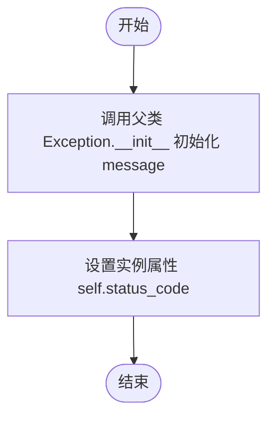

# `.\AutoGPT\autogpt_platform\backend\backend\integrations\ayrshare.py` 详细设计文档

该代码实现了一个用于 Ayrshare 社交媒体 API 的 Python 异步客户端，提供了生成 JWT 令牌、创建用户资料以及向多个社交媒体平台（如 Twitter, Facebook, Instagram 等）发布帖子的功能，并包含相应的数据模型定义和异常处理。

## 整体流程


## 类结构

```
AyrshareClient (客户端核心类)
AyrshareAPIException (自定义异常)
SocialPlatform (社交平台枚举)
BaseModel (Pydantic 基类)
├── EmailConfig
├── JWTResponse
├── ProfileResponse
├── PostResponse
├── PostIds
├── AutoHashtag
├── FirstComment
├── AutoSchedule
└── AutoRepost
```

## 全局变量及字段


### `logger`
    
Standard Python logger instance for recording module events.

类型：`logging.Logger`
    


### `settings`
    
Global application settings object containing configuration secrets and environment variables.

类型：`Settings`
    


### `AyrshareClient.API_URL`
    
The base URL for the Ayrshare API.

类型：`str`
    


### `AyrshareClient.POST_ENDPOINT`
    
The specific endpoint URL for creating social media posts.

类型：`str`
    


### `AyrshareClient.PROFILES_ENDPOINT`
    
The specific endpoint URL for managing user profiles.

类型：`str`
    


### `AyrshareClient.JWT_ENDPOINT`
    
The specific endpoint URL for generating JWT tokens for single sign-on.

类型：`str`
    


### `AyrshareClient.headers`
    
HTTP headers containing Content-Type and Authorization Bearer token for API requests.

类型：`dict[str, str]`
    


### `AyrshareClient._requests`
    
Internal utility client for making asynchronous HTTP requests.

类型：`Requests`
    


### `AyrshareAPIException.status_code`
    
The HTTP status code associated with the exception.

类型：`int`
    


### `SocialPlatform.BLUESKY`
    
Enumeration member representing the Bluesky platform.

类型：`SocialPlatform`
    


### `SocialPlatform.FACEBOOK`
    
Enumeration member representing the Facebook platform.

类型：`SocialPlatform`
    


### `SocialPlatform.TWITTER`
    
Enumeration member representing the Twitter platform.

类型：`SocialPlatform`
    


### `SocialPlatform.LINKEDIN`
    
Enumeration member representing the LinkedIn platform.

类型：`SocialPlatform`
    


### `SocialPlatform.INSTAGRAM`
    
Enumeration member representing the Instagram platform.

类型：`SocialPlatform`
    


### `SocialPlatform.YOUTUBE`
    
Enumeration member representing the YouTube platform.

类型：`SocialPlatform`
    


### `SocialPlatform.REDDIT`
    
Enumeration member representing the Reddit platform.

类型：`SocialPlatform`
    


### `SocialPlatform.TELEGRAM`
    
Enumeration member representing the Telegram platform.

类型：`SocialPlatform`
    


### `SocialPlatform.GOOGLE_MY_BUSINESS`
    
Enumeration member representing the Google My Business platform.

类型：`SocialPlatform`
    


### `SocialPlatform.PINTEREST`
    
Enumeration member representing the Pinterest platform.

类型：`SocialPlatform`
    


### `SocialPlatform.TIKTOK`
    
Enumeration member representing the TikTok platform.

类型：`SocialPlatform`
    


### `SocialPlatform.SNAPCHAT`
    
Enumeration member representing the Snapchat platform.

类型：`SocialPlatform`
    


### `SocialPlatform.THREADS`
    
Enumeration member representing the Threads platform.

类型：`SocialPlatform`
    


### `EmailConfig.to`
    
The recipient email address.

类型：`str`
    


### `EmailConfig.subject`
    
The subject line of the email.

类型：`Optional[str]`
    


### `EmailConfig.body`
    
The body content of the email.

类型：`Optional[str]`
    


### `EmailConfig.from_name`
    
The display name of the sender.

类型：`Optional[str]`
    


### `EmailConfig.from_email`
    
The email address of the sender.

类型：`Optional[str]`
    


### `JWTResponse.status`
    
The status of the JWT generation response.

类型：`str`
    


### `JWTResponse.title`
    
The title associated with the JWT response.

类型：`str`
    


### `JWTResponse.token`
    
The generated JSON Web Token.

类型：`str`
    


### `JWTResponse.url`
    
The URL associated with the JWT or login action.

类型：`str`
    


### `JWTResponse.emailSent`
    
Indicates whether the connect accounts email was sent.

类型：`Optional[bool]`
    


### `JWTResponse.expiresIn`
    
The duration until the token expires.

类型：`Optional[str]`
    


### `ProfileResponse.status`
    
The status of the profile creation request.

类型：`str`
    


### `ProfileResponse.title`
    
The title of the created profile.

类型：`str`
    


### `ProfileResponse.refId`
    
The reference ID for the profile.

类型：`str`
    


### `ProfileResponse.profileKey`
    
The unique key identifying the profile.

类型：`str`
    


### `ProfileResponse.messagingActive`
    
Indicates if messaging is active for the profile.

类型：`Optional[bool]`
    


### `PostResponse.status`
    
The status of the post creation request.

类型：`str`
    


### `PostResponse.id`
    
The ID of the post.

类型：`str`
    


### `PostResponse.refId`
    
The reference ID for the post request.

类型：`str`
    


### `PostResponse.profileTitle`
    
The title of the profile used to create the post.

类型：`str`
    


### `PostResponse.post`
    
The text content of the post.

类型：`str`
    


### `PostResponse.postIds`
    
A list of objects containing IDs and status for each platform the post was shared to.

类型：`Optional[list[PostIds]]`
    


### `PostResponse.scheduleDate`
    
The scheduled date and time for the post.

类型：`Optional[str]`
    


### `PostResponse.errors`
    
A list of error messages if the post failed.

类型：`Optional[list[str]]`
    


### `PostIds.status`
    
The status of the post on a specific platform.

类型：`str`
    


### `PostIds.id`
    
The ID of the post on the specific platform.

类型：`str`
    


### `PostIds.postUrl`
    
The URL of the post on the specific platform.

类型：`str`
    


### `PostIds.platform`
    
The name of the social media platform.

类型：`str`
    


### `AutoHashtag.max`
    
Maximum number of hashtags to auto-generate.

类型：`Optional[int]`
    


### `AutoHashtag.position`
    
Position to place auto-generated hashtags.

类型：`Optional[str]`
    


### `FirstComment.text`
    
The text content for the first comment.

类型：`str`
    


### `FirstComment.platforms`
    
List of platforms where the first comment should be posted.

类型：`Optional[list[SocialPlatform]]`
    


### `AutoSchedule.interval`
    
The time interval for auto-scheduling posts.

类型：`str`
    


### `AutoSchedule.platforms`
    
List of platforms to include in auto-scheduling.

类型：`Optional[list[SocialPlatform]]`
    


### `AutoSchedule.startDate`
    
The start date for auto-scheduling.

类型：`Optional[str]`
    


### `AutoSchedule.endDate`
    
The end date for auto-scheduling.

类型：`Optional[str]`
    


### `AutoRepost.interval`
    
The time interval for auto-reposting posts.

类型：`str`
    


### `AutoRepost.platforms`
    
List of platforms to include in auto-reposting.

类型：`Optional[list[SocialPlatform]]`
    


### `AutoRepost.startDate`
    
The start date for auto-reposting.

类型：`Optional[str]`
    


### `AutoRepost.endDate`
    
The end date for auto-reposting.

类型：`Optional[str]`
    
    

## 全局函数及方法


### `AyrshareClient.__init__`

初始化 Ayrshare API 客户端，验证必要配置并设置带有认证头的 HTTP 请求会话。

参数：

-  `custom_requests`：`Optional[Requests]`，用于注入自定义的 HTTP 请求客户端以进行测试或配置覆盖的可选参数。

返回值：`None`，该方法为类构造函数，无显式返回值。

#### 流程图


#### 带注释源码

```python
def __init__(
    self,
    custom_requests: Optional[Requests] = None,
):
    # 检查全局配置中是否设置了 Ayrshare API Key
    if not settings.secrets.ayrshare_api_key:
        # 如果未设置，抛出 MissingConfigError 异常，阻止客户端初始化
        raise MissingConfigError("AYRSHARE_API_KEY is not configured")

    # 构建请求头字典，设置内容类型为 JSON 并添加 Bearer Token 认证
    headers: dict[str, str] = {
        "Content-Type": "application/json",
        "Authorization": f"Bearer {settings.secrets.ayrshare_api_key}",
    }
    # 将构建好的请求头保存为实例变量，供后续请求使用
    self.headers = headers

    # 判断调用者是否传入了自定义的 Requests 实例（常用于单元测试 Mock）
    if custom_requests:
        # 如果提供了自定义实例，则直接使用它
        self._requests = custom_requests
    else:
        # 否则，创建一个新的 Requests 实例，配置预置的请求头和信任的 API 域名
        self._requests = Requests(
            extra_headers=headers,
            trusted_origins=["https://api.ayrshare.com"],
        )
```


### `AyrshareClient.generate_jwt`

该方法用于生成 JSON Web Token (JWT)，以支持单点登录 (SSO) 功能，允许用户链接其社交账户。

参数：

-  `private_key`：`str`，用于加密的私钥。
-  `profile_key`：`str`，用户配置文件密钥（非 API 密钥）。
-  `logout`：`Optional[bool]`，是否自动注销当前会话。
-  `redirect`：`Optional[str]`，点击“完成”按钮或 Logo 时重定向到的 URL。
-  `allowed_social`：`Optional[list[SocialPlatform]]`，在链接页面显示的社交网络列表。
-  `verify`：`Optional[bool]`，是否验证生成的令牌有效（推荐用于非生产环境）。
-  `base64`：`Optional[bool]`，私钥是否为 base64 编码。
-  `expires_in`：`Optional[int]`，令牌有效期（分钟，范围 1-2880）。
-  `email`：`Optional[EmailConfig]`，发送连接账户电子邮件的配置。

返回值：`JWTResponse`，包含 JWT 令牌和 URL 的响应对象。

#### 流程图


#### 带注释源码

```python
    async def generate_jwt(
        self,
        private_key: str,
        profile_key: str,
        logout: Optional[bool] = None,
        redirect: Optional[str] = None,
        allowed_social: Optional[list[SocialPlatform]] = None,
        verify: Optional[bool] = None,
        base64: Optional[bool] = None,
        expires_in: Optional[int] = None,
        email: Optional[EmailConfig] = None,
    ) -> JWTResponse:
        """
        Generate a JSON Web Token (JWT) for use with single sign on.
        ... (文档省略) ...
        """
        # 1. 构建基础请求负载，注意 domain 在此处被硬编码为 "id-pojeg"
        payload: dict[str, Any] = {
            "domain": "id-pojeg",
            "privateKey": private_key,
            "profileKey": profile_key,
        }

        # 2. 准备请求头，复用实例的 headers 并添加 Profile-Key
        headers = self.headers
        headers["Profile-Key"] = profile_key

        # 3. 根据传入的参数动态填充负载
        if logout is not None:
            payload["logout"] = logout
        if redirect is not None:
            payload["redirect"] = redirect
        if allowed_social is not None:
            # 将 SocialPlatform 枚举列表转换为字符串值列表
            payload["allowedSocial"] = [p.value for p in allowed_social]
        if verify is not None:
            payload["verify"] = verify
        if base64 is not None:
            payload["base64"] = base64
        if expires_in is not None:
            payload["expiresIn"] = expires_in
        if email is not None:
            # 如果提供了 EmailConfig，将其转换为字典并排除 None 值
            payload["email"] = email.model_dump(exclude_none=True)

        # 4. 发送 POST 请求到 Ayrshare JWT 生成端点
        response = await self._requests.post(
            self.JWT_ENDPOINT, json=payload, headers=headers
        )

        # 5. 处理 HTTP 错误响应
        if not response.ok:
            try:
                error_data = response.json()
                error_message = error_data.get("message", "Unknown error")
            except json.JSONDecodeError:
                error_message = response.text()

            raise AyrshareAPIException(
                f"Ayrshare API request failed ({response.status}): {error_message}",
                response.status,
            )

        # 6. 解析 JSON 响应数据
        response_data = response.json()
        
        # 7. 检查业务逻辑层面的成功状态
        if response_data.get("status") != "success":
            raise AyrshareAPIException(
                f"Ayrshare API returned error: {response_data.get('message', 'Unknown error')}",
                response.status,
            )

        # 8. 返回解析后的 JWTResponse 对象
        return JWTResponse(**response_data)
```


### `AyrshareClient.create_profile`

在主用户配置下创建一个新的用户配置文件。

参数：

-  `title`：`str`，新配置文件的标题，必须唯一。
-  `messaging_active`：`Optional[bool]`，设置为 true 以激活此用户配置的消息传递功能。
-  `hide_top_header`：`Optional[bool]`，在社交账户链接页面上隐藏顶部标题。
-  `top_header`：`Optional[str]`，更改社交账户链接页面上的标题。
-  `disable_social`：`Optional[list[SocialPlatform]]`，对此用户配置禁用的社交网络列表。
-  `team`：`Optional[bool]`，将新用户配置创建为团队成员。
-  `email`：`Optional[str]`，团队成员邀请的电子邮件地址（如果 team 为 true，则必填）。
-  `sub_header`：`Optional[str]`，更改社交账户链接页面上的子标题。
-  `tags`：`Optional[list[str]]`，用于标记用户配置的字符串数组。

返回值：`ProfileResponse`，包含配置文件详情和配置文件密钥 (profile key) 的 ProfileResponse 对象。

#### 流程图


#### 带注释源码

```python
    async def create_profile(
        self,
        title: str,
        messaging_active: Optional[bool] = None,
        hide_top_header: Optional[bool] = None,
        top_header: Optional[str] = None,
        disable_social: Optional[list[SocialPlatform]] = None,
        team: Optional[bool] = None,
        email: Optional[str] = None,
        sub_header: Optional[str] = None,
        tags: Optional[list[str]] = None,
    ) -> ProfileResponse:
        """
        Create a new User Profile under your Primary Profile.

        Docs: https://www.ayrshare.com/docs/apis/profiles/create-profile

        Args:
            title: Title of the new profile. Must be unique.
            messaging_active: Set to true to activate messaging for this user profile.
            hide_top_header: Hide the top header on the social accounts linkage page.
            top_header: Change the header on the social accounts linkage page.
            disable_social: Array of social networks that are disabled for this user's profile.
            team: Create a new user profile as a team member.
            email: Email address for team member invite (required if team is true).
            sub_header: Change the sub header on the social accounts linkage page.
            tags: Array of strings to tag user profiles.

        Returns:
            ProfileResponse object containing the profile details and profile key.

        Raises:
            AyrshareAPIException: If the API request fails or profile title already exists.
        """
        # 初始化请求负载，填入必填字段 title
        payload: dict[str, Any] = {
            "title": title,
        }

        # 检查并填充可选参数到 payload 中
        if messaging_active is not None:
            payload["messagingActive"] = messaging_active
        if hide_top_header is not None:
            payload["hideTopHeader"] = hide_top_header
        if top_header is not None:
            payload["topHeader"] = top_header
        if disable_social is not None:
            # 将 SocialPlatform 枚举列表转换为字符串值列表
            payload["disableSocial"] = [p.value for p in disable_social]
        if team is not None:
            payload["team"] = team
        if email is not None:
            payload["email"] = email
        if sub_header is not None:
            payload["subHeader"] = sub_header
        if tags is not None:
            payload["tags"] = tags

        # 发送异步 POST 请求到配置文件的 API 端点
        response = await self._requests.post(self.PROFILES_ENDPOINT, json=payload)

        # 检查 HTTP 响应状态
        if not response.ok:
            try:
                # 尝试解析 JSON 错误信息
                error_data = response.json()
                error_message = error_data.get("message", "Unknown error")
            except json.JSONDecodeError:
                # 如果不是 JSON，获取纯文本错误
                error_message = response.text()

            # 抛出 API 异常，包含状态码和错误信息
            raise AyrshareAPIException(
                f"Ayrshare API request failed ({response.status}): {error_message}",
                response.status,
            )

        # 解析成功的响应 JSON
        response_data = response.json()
        
        # 检查业务逻辑状态，Ayrshare API 可能返回 200 OK 但业务逻辑失败
        if response_data.get("status") != "success":
            raise AyrshareAPIException(
                f"Ayrshare API returned error: {response_data.get('message', 'Unknown error')}",
                response.status,
            )

        # 返回解析后的 ProfileResponse 对象
        return ProfileResponse(**response_data)
```


### `AyrshareClient.create_post`

创建一个跨多个社交媒体平台的帖子。

参数：

-  `post`：`str`，要发布的帖子文本内容 - 必填
-  `platforms`：`list[SocialPlatform]`，要发布的平台列表（例如 [SocialPlatform.TWITTER, SocialPlatform.FACEBOOK]） - 必填
-  `media_urls`：`Optional[list[str]]`，包含的媒体URL列表，如果 `is_video` 为 true 则必填
-  `is_video`：`Optional[bool]`，媒体是否为视频
-  `schedule_date`：`Optional[str]`，用于安排发布的 UTC 日期时间 (YYYY-MM-DDThh:mm:ssZ)
-  `validate_schedule`：`Optional[bool]`，是否验证调度日期
-  `first_comment`：`Optional[FirstComment]`，首条评论的配置
-  `disable_comments`：`Optional[bool]`，是否禁用评论
-  `shorten_links`：`Optional[bool]`，是否缩短链接
-  `auto_schedule`：`Optional[AutoSchedule]`，自动调度的配置
-  `auto_repost`：`Optional[AutoRepost]`，自动转发的配置
-  `auto_hashtag`：`Optional[AutoHashtag | bool]`，自动标签的配置或布尔值开关
-  `unsplash`：`Optional[str]`，Unsplash 图片配置
-  `bluesky_options`：`Optional[dict[str, Any]]`，Bluesky 特定选项
-  `facebook_options`：`Optional[dict[str, Any]]`，Facebook 特定选项
-  `gmb_options`：`Optional[dict[str, Any]]`，Google Business Profile 特定选项
-  `instagram_options`：`Optional[dict[str, Any]]`，Instagram 特定选项
-  `linkedin_options`：`Optional[dict[str, Any]]`，LinkedIn 特定选项
-  `pinterest_options`：`Optional[dict[str, Any]]`，Pinterest 特定选项
-  `reddit_options`：`Optional[dict[str, Any]]`，Reddit 特定选项
-  `snapchat_options`：`Optional[dict[str, Any]]`，Snapchat 特定选项
-  `telegram_options`：`Optional[dict[str, Any]]`，Telegram 特定选项
-  `threads_options`：`Optional[dict[str, Any]]`，Threads 特定选项
-  `tiktok_options`：`Optional[dict[str, Any]]`，TikTok 特定选项
-  `twitter_options`：`Optional[dict[str, Any]]`，Twitter 特定选项
-  `youtube_options`：`Optional[dict[str, Any]]`，YouTube 特定选项
-  `requires_approval`：`Optional[bool]`，是否启用审批工作流
-  `random_post`：`Optional[bool]`，是否生成随机帖子文本
-  `random_media_url`：`Optional[bool]`，是否生成随机媒体
-  `idempotency_key`：`Optional[str]`，帖子的唯一 ID
-  `notes`：`Optional[str]`，帖子的附加说明
-  `profile_key`：`Optional[str]`，用户配置文件密钥，如果不使用主 API Key 配置文件

返回值：`PostResponse`，包含帖子详细信息、状态和各平台 ID 的 PostResponse 对象

#### 流程图


#### 带注释源码

```python
    async def create_post(
        self,
        post: str,
        platforms: list[SocialPlatform],
        *,
        media_urls: Optional[list[str]] = None,
        is_video: Optional[bool] = None,
        schedule_date: Optional[str] = None,
        validate_schedule: Optional[bool] = None,
        first_comment: Optional[FirstComment] = None,
        disable_comments: Optional[bool] = None,
        shorten_links: Optional[bool] = None,
        auto_schedule: Optional[AutoSchedule] = None,
        auto_repost: Optional[AutoRepost] = None,
        auto_hashtag: Optional[AutoHashtag | bool] = None,
        unsplash: Optional[str] = None,
        bluesky_options: Optional[dict[str, Any]] = None,
        facebook_options: Optional[dict[str, Any]] = None,
        gmb_options: Optional[dict[str, Any]] = None,
        instagram_options: Optional[dict[str, Any]] = None,
        linkedin_options: Optional[dict[str, Any]] = None,
        pinterest_options: Optional[dict[str, Any]] = None,
        reddit_options: Optional[dict[str, Any]] = None,
        snapchat_options: Optional[dict[str, Any]] = None,
        telegram_options: Optional[dict[str, Any]] = None,
        threads_options: Optional[dict[str, Any]] = None,
        tiktok_options: Optional[dict[str, Any]] = None,
        twitter_options: Optional[dict[str, Any]] = None,
        youtube_options: Optional[dict[str, Any]] = None,
        requires_approval: Optional[bool] = None,
        random_post: Optional[bool] = None,
        random_media_url: Optional[bool] = None,
        idempotency_key: Optional[str] = None,
        notes: Optional[str] = None,
        profile_key: Optional[str] = None,
    ) -> PostResponse:
        """
        Create a post across multiple social media platforms.

        Docs: https://www.ayrshare.com/docs/apis/post/post

        Args:
            post: The post text to be published - required
            platforms: List of platforms to post to (e.g. [SocialPlatform.TWITTER, SocialPlatform.FACEBOOK]) - required
            media_urls: Optional list of media URLs to include - required if is_video is true
            is_video: Whether the media is a video - default is false (in api docs)
            schedule_date: UTC datetime for scheduling (YYYY-MM-DDThh:mm:ssZ) - default is None (in api docs)
            validate_schedule: Whether to validate the schedule date - default is false (in api docs)
            first_comment: Configuration for first comment - default is None (in api docs)
            disable_comments: Whether to disable comments - default is false (in api docs)
            shorten_links: Whether to shorten links - default is false (in api docs)
            auto_schedule: Configuration for automatic scheduling - default is None (in api docs https://www.ayrshare.com/docs/apis/auto-schedule/overview)
            auto_repost: Configuration for automatic reposting - default is None (in api docs https://www.ayrshare.com/docs/apis/post/overview#auto-repost)
            auto_hashtag: Configuration for automatic hashtags - default is None (in api docs https://www.ayrshare.com/docs/apis/post/overview#auto-hashtags)
            unsplash: Unsplash image configuration - default is None (in api docs https://www.ayrshare.com/docs/apis/post/overview#unsplash)

            ------------------------------------------------------------

            bluesky_options: Bluesky-specific options - https://www.ayrshare.com/docs/apis/post/social-networks/bluesky
            facebook_options: Facebook-specific options - https://www.ayrshare.com/docs/apis/post/social-networks/facebook
            gmb_options: Google Business Profile options - https://www.ayrshare.com/docs/apis/post/social-networks/google
            instagram_options: Instagram-specific options - https://www.ayrshare.com/docs/apis/post/social-networks/instagram
            linkedin_options: LinkedIn-specific options - https://www.ayrshare.com/docs/apis/post/social-networks/linkedin
            pinterest_options: Pinterest-specific options - https://www.ayrshare.com/docs/apis/post/social-networks/pinterest
            reddit_options: Reddit-specific options - https://www.ayrshare.com/docs/apis/post/social-networks/reddit
            snapchat_options: Snapchat-specific options - https://www.ayrshare.com/docs/apis/post/social-networks/snapchat
            telegram_options: Telegram-specific options - https://www.ayrshare.com/docs/apis/post/social-networks/telegram
            threads_options: Threads-specific options - https://www.ayrshare.com/docs/apis/post/social-networks/threads
            tiktok_options: TikTok-specific options - https://www.ayrshare.com/docs/apis/post/social-networks/tiktok
            twitter_options: Twitter-specific options - https://www.ayrshare.com/docs/apis/post/social-networks/twitter
            youtube_options: YouTube-specific options - https://www.ayrshare.com/docs/apis/post/social-networks/youtube

            ------------------------------------------------------------


            requires_approval: Whether to enable approval workflow - default is false (in api docs)
            random_post: Whether to generate random post text - default is false (in api docs)
            random_media_url: Whether to generate random media - default is false (in api docs)
            idempotency_key: Unique ID for the post - default is None (in api docs)
            notes: Additional notes for the post - default is None (in api docs)

        Returns:
            PostResponse object containing the post details and status

        Raises:
            AyrshareAPIException: If the API request fails
        """

        # 初始化请求负载，包含必填字段
        payload: dict[str, Any] = {
            "post": post,
            "platforms": [p.value for p in platforms], # 将枚举列表转换为字符串值列表
        }

        # 根据提供的参数构建可选字段
        if media_urls:
            payload["mediaUrls"] = media_urls
        if is_video is not None:
            payload["isVideo"] = is_video
        if schedule_date:
            payload["scheduleDate"] = schedule_date
        if validate_schedule is not None:
            payload["validateSchedule"] = validate_schedule
        
        # 处理 FirstComment 对象，转换枚举并序列化
        if first_comment:
            first_comment_dict = first_comment.model_dump(exclude_none=True)
            if first_comment.platforms:
                first_comment_dict["platforms"] = [
                    p.value for p in first_comment.platforms
                ]
            payload["firstComment"] = first_comment_dict
            
        if disable_comments is not None:
            payload["disableComments"] = disable_comments
        if shorten_links is not None:
            payload["shortenLinks"] = shorten_links
        
        # 处理 AutoSchedule 对象，转换枚举并序列化
        if auto_schedule:
            auto_schedule_dict = auto_schedule.model_dump(exclude_none=True)
            if auto_schedule.platforms:
                auto_schedule_dict["platforms"] = [
                    p.value for p in auto_schedule.platforms
                ]
            payload["autoSchedule"] = auto_schedule_dict
            
        # 处理 AutoRepost 对象，转换枚举并序列化
        if auto_repost:
            auto_repost_dict = auto_repost.model_dump(exclude_none=True)
            if auto_repost.platforms:
                auto_repost_dict["platforms"] = [p.value for p in auto_repost.platforms]
            payload["autoRepost"] = auto_repost_dict
            
        # auto_hashtag 可以是对象或布尔值，进行分别处理
        if auto_hashtag:
            payload["autoHashtag"] = (
                auto_hashtag.model_dump(exclude_none=True)
                if isinstance(auto_hashtag, AutoHashtag)
                else auto_hashtag
            )
        if unsplash:
            payload["unsplash"] = unsplash
            
        # 添加各平台特定的配置选项
        if bluesky_options:
            payload["blueskyOptions"] = bluesky_options
        if facebook_options:
            payload["faceBookOptions"] = facebook_options
        if gmb_options:
            payload["gmbOptions"] = gmb_options
        if instagram_options:
            payload["instagramOptions"] = instagram_options
        if linkedin_options:
            payload["linkedInOptions"] = linkedin_options
        if pinterest_options:
            payload["pinterestOptions"] = pinterest_options
        if reddit_options:
            payload["redditOptions"] = reddit_options
        if snapchat_options:
            payload["snapchatOptions"] = snapchat_options
        if telegram_options:
            payload["telegramOptions"] = telegram_options
        if threads_options:
            payload["threadsOptions"] = threads_options
        if tiktok_options:
            payload["tikTokOptions"] = tiktok_options
        if twitter_options:
            payload["twitterOptions"] = twitter_options
        if youtube_options:
            payload["youTubeOptions"] = youtube_options
            
        if requires_approval is not None:
            payload["requiresApproval"] = requires_approval
        if random_post is not None:
            payload["randomPost"] = random_post
        if random_media_url is not None:
            payload["randomMediaUrl"] = random_media_url
        if idempotency_key:
            payload["idempotencyKey"] = idempotency_key
        if notes:
            payload["notes"] = notes

        # 设置请求头，如果提供了 profile_key 则添加到 Header 中
        headers = self.headers
        if profile_key:
            headers["Profile-Key"] = profile_key

        # 发送异步 POST 请求
        response = await self._requests.post(
            self.POST_ENDPOINT, json=payload, headers=headers
        )
        logger.warning(f"Ayrshare request: {payload} and headers: {headers}")
        
        # 检查 HTTP 响应状态
        if not response.ok:
            logger.error(
                f"Ayrshare API request failed ({response.status}): {response.text()}"
            )
            try:
                error_data = response.json()
                error_message = error_data.get("message", "Unknown error")
            except json.JSONDecodeError:
                error_message = response.text()

            raise AyrshareAPIException(
                f"Ayrshare API request failed ({response.status}): {error_message}",
                response.status,
            )

        # 解析响应数据
        response_data = response.json()
        
        # 检查业务逻辑状态是否成功
        if response_data.get("status") != "success":
            logger.error(
                f"Ayrshare API returned error: {response_data.get('message', 'Unknown error')}"
            )
            raise AyrshareAPIException(
                f"Ayrshare API returned error: {response_data.get('message', 'Unknown error')}",
                response.status,
            )

        # Ayrshare 即使是单个帖子也会返回一个数组，这里取第一个元素
        # 代码逻辑假设数组中至少有一个元素，否则报错
        if len(response_data["posts"]) == 0:
            logger.error("Ayrshare API returned no posts")
            raise AyrshareAPIException(
                "Ayrshare API returned no posts",
                response.status,
            )
        logger.warn(f"Ayrshare API returned posts: {response_data['posts']}")
        return PostResponse(**response_data["posts"][0])
```


### `AyrshareAPIException.__init__`

初始化自定义异常类，用于封装 Ayrshare API 调用中发生的错误信息及对应的 HTTP 状态码。

参数：

-  `message`：`str`，描述异常详细信息的字符串
-  `status_code`：`int`，导致异常的 HTTP 请求状态码

返回值：`None`，构造函数返回新实例化的 `AyrshareAPIException` 对象

#### 流程图



#### 带注释源码

```python
    def __init__(self, message: str, status_code: int):
        # 调用父类 Exception 的构造函数，传入错误信息
        super().__init__(message)
        # 将 HTTP 状态码保存为实例属性，以便后续处理逻辑可以访问具体的错误状态
        self.status_code = status_code
```


## 关键组件


### AyrshareClient
封装与 Ayrshare Social Media API 交互逻辑的核心客户端类，提供生成 JWT、创建资料及跨平台发布帖子的异步方法。

### SocialPlatform Enumeration
定义支持的社交媒体平台（如 Twitter, Facebook）的枚举类，用于确保平台参数的类型安全和一致性。

### Pydantic Data Models
基于 Pydantic 的数据模型（如 PostResponse, EmailConfig），用于定义请求参数和响应体的结构，实现数据校验与序列化。

### API Exception Handling
包含自定义异常类 AyrshareAPIException 及响应校验逻辑，用于统一处理 API 请求失败及返回错误的情况。

### Configuration & Authentication
通过 Settings 管理配置并初始化 HTTP 请求头的机制，负责加载 API 密钥并处理缺失配置的异常。


## 问题及建议


### 已知问题

-   **敏感信息泄露风险**：在 `create_post` 方法中，代码使用 `logger.warning` 记录了完整的请求 `payload` 和 `headers`。这可能导致用户私密内容（Post 内容）或 API Key（Headers 中）被输出到日志中，造成严重的安全隐患。
-   **配置硬编码**：在 `generate_jwt` 方法中，`domain` 参数被硬编码为 `"id-pojeg"`。这使得该客户端代码无法灵活复用于不同的应用域，违反了通用性原则。
-   **使用已弃用的日志方法**：代码中混用了 `logger.warn` 和 `logger.warning`。`logger.warn` 在 Python 中已被弃用，应统一使用 `logger.warning`。
-   **响应解析逻辑脆弱**：在 `create_post` 方法中，处理响应时直接访问 `response_data["posts"][0]`。虽然代码注释说明 API 通常返回单个帖子数组，但这种假设缺乏防御性编程，如果 API 返回空数组或结构发生变化，将导致 IndexError。

### 优化建议

-   **消除重复代码（DRY原则）**：`generate_jwt`、`create_profile` 和 `create_post` 中包含高度重复的错误处理逻辑（检查 `response.ok`、解析 JSON、提取错误信息并抛出异常）。建议将这部分逻辑抽取为一个私有的辅助方法（如 `_handle_api_response`），以提高代码的可维护性并减少出错概率。
-   **增强类型安全与数据校验**：针对各个社交媒体平台的特定选项参数（如 `bluesky_options`, `facebook_options` 等），当前使用的是 `dict[str, Any]` 类型。建议为这些选项定义具体的 Pydantic 模型类，利用 Pydantic 的校验功能确保数据结构的正确性，同时提升 IDE 提示和代码可读性。
-   **简化 Payload 构建逻辑**：`create_post` 方法中包含大量 `if param is not None: payload[key] = value` 的重复代码。建议设计一个通用的字典构建策略或利用 Pydantic 的 `model_dump(exclude_none=True)` 机制来自动过滤空值，简化方法体。
-   **优化参数设计**：`create_post` 方法的参数列表过长（超过 20 个参数），违反了函数设计的简洁性原则。建议引入一个配置对象（例如 `PostOptions` 类）来封装非核心参数，或者利用 `**kwargs` 处理平台特定选项，以改善调用体验。


## 其它


### 设计目标与约束

1.  **API 封装与抽象**：旨在提供一个面向对象的 Python 接口来封装 Ayrshare Social Media API 的复杂性，将底层的 HTTP 请求细节隐藏在高级方法之后（如 `create_post`, `generate_jwt`）。
2.  **类型安全与数据验证**：使用 Pydantic 模型（如 `PostResponse`, `EmailConfig`）对 API 请求的输入和输出进行严格的数据结构定义和验证，确保类型安全并减少运行时错误。
3.  **异步 I/O 模型**：设计为异步客户端（`async`/`await`），以适应高并发或非阻塞的应用程序环境，避免网络请求阻塞主线程。
4.  **可配置性与依赖注入**：通过构造函数允许注入自定义的 `Requests` 客户端，便于在单元测试中使用 Mock 对象，提高代码的可测试性。
5.  **配置管理约束**：强制要求必须在全局 `Settings` 中配置 `AYRSHARE_API_KEY`，否则初始化失败，确保敏感配置的安全性和完整性。

### 错误处理与异常设计

1.  **统一异常类**：定义了 `AyrshareAPIException` 作为该模块所有 API 相关错误的统一抛出类型。该异常不仅包含错误消息，还包含 HTTP 状态码 (`status_code`)，便于调用者根据状态码进行不同的处理逻辑（如重试或放弃）。
2.  **双层错误检查机制**：
    *   **网络/HTTP 层**：检查 `response.ok`，处理网络错误或 HTTP 4xx/5xx 错误。
    *   **业务逻辑层**：即使 HTTP 状态为 200，仍检查响应体中的 JSON 字段 `status` 是否为 `"success"`。如果业务逻辑失败（如参数校验不通过），同样抛出异常。
3.  **异常消息提取**：在捕获错误时，尝试解析响应体 JSON 中的 `message` 字段作为详细的错误信息；如果解析失败，则降级使用原始响应文本。
4.  **日志记录**：在请求失败或业务逻辑报错时，使用 `logger.error` 记录详细的错误上下文（状态码、响应体），便于问题排查。

### 外部依赖与接口契约

1.  **内部依赖**：
    *   `backend.util.settings.Settings`：用于获取 API 密钥。契约要求必须包含有效的 `secrets.ayrshare_api_key`。
    *   `backend.util.request.Requests`：用于执行实际的 HTTP 请求。契约要求支持异步 `post` 方法，并接受 `url`、`json` 和 `headers` 参数，返回包含 `ok`、`status`、`text()` 和 `json()` 方法的响应对象。
    *   `backend.util.exceptions.MissingConfigError`：配置缺失时的标准异常。
2.  **外部依赖**：
    *   **Ayrshare API**：依赖于外部服务 `https://api.ayrshare.com` 的可用性。接口契约遵循其官方文档定义的 JSON 格式。
3.  **数据契约**：
    *   **请求**：将 Pydantic 模型（如 `EmailConfig`）或 Python 原生类型序列化为 JSON 格式发送。
    *   **响应**：期望 API 返回符合 Pydantic 模型（如 `JWTResponse`, `PostResponse`）定义的 JSON 结构。如果结构不符，反序列化将失败。

### 安全性设计

1.  **认证机制**：使用 Bearer Token 进行身份验证。API Key 存储在 `Settings` 中，并在初始化时自动添加到请求头的 `Authorization` 字段。
2.  **多租户/用户隔离**：通过 `Profile-Key` 请求头支持不同用户 Profile 的操作，确保操作是在特定的用户上下文中执行的。该 Key 在每次需要特定用户上下文的方法调用时（如 `generate_jwt`, `create_post`）动态添加。
3.  **敏感数据保护**：虽然代码中记录了日志，但日志主要记录错误信息和响应状态，并未显式记录完整的请求 Payload 中的敏感字段（虽然 `create_post` 中有一行 warning 记录了 payload，这在生产环境中可能需要审计，特别是包含私人信息时）。
4.  **HTTPS 支持**：`Requests` 初始化时指定了 `trusted_origins=["https://api.ayrshare.com"]`，强制使用 HTTPS 进行加密传输，防止中间人攻击。

### 数据流

1.  **输入阶段**：调用者调用 `AyrshareClient` 的方法（如 `create_post`），传入 Python 对象或 Pydantic 模型。
2.  **数据转换**：
    *   将枚举类型（如 `SocialPlatform`）转换为其对应的字符串值（`.value`）。
    *   使用 Pydantic 模型的 `.model_dump(exclude_none=True)` 方法将配置对象转换为字典，过滤掉空值。
    *   构建符合 API 要求的字典结构 `payload`。
3.  **请求发送**：
    *   准备 HTTP Headers（包含 Authorization 和 Profile-Key）。
    *   使用内部的 `Requests` 对象异步发送 POST 请求到指定的 API 端点。
4.  **响应处理**：
    *   **接收**：获取原始 HTTP 响应对象。
    *   **校验**：检查 HTTP 状态码和响应体中的 `status` 字段。
    *   **异常**：如果校验失败，抛出 `AyrshareAPIException`。
    *   **解析**：如果校验成功，将响应体 JSON 解析并映射回对应的 Pydantic 响应模型（如 `PostResponse`）。
5.  **输出阶段**：将构造好的 Pydantic 模型返回给调用者，提供类型安全的属性访问。

    