# `.\AutoGPT\autogpt_platform\backend\backend\integrations\creds_manager.py` 详细设计文档

The code manages the lifecycle of integration credentials, including creation, retrieval, refreshing, updating, and deletion. It ensures system-wide consistency and prevents invalidation of in-use tokens using locking mechanisms.

## 整体流程

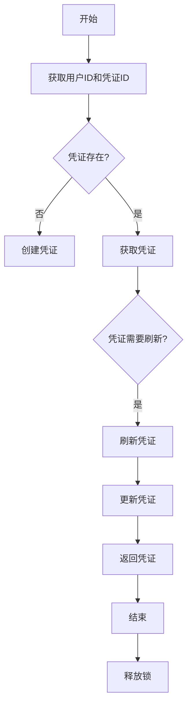

## 类结构

```
IntegrationCredentialsManager (主类)
├── IntegrationCredentialsStore (存储凭证)
└── AsyncRedisKeyedMutex (异步Redis互斥锁)
```

## 全局变量及字段


### `logger`
    
Logger instance for logging messages.

类型：`logging.Logger`
    


### `settings`
    
Settings instance for configuration parameters.

类型：`backend.util.settings.Settings`
    


### `_locks`
    
AsyncRedisKeyedMutex instance for managing locks on credentials access.

类型：`AsyncRedisKeyedMutex`
    


### `store`
    
IntegrationCredentialsStore instance for storing and managing credentials.

类型：`backend.integrations.credentials_store.IntegrationCredentialsStore`
    


### `IntegrationCredentialsManager`
    
Class for managing integration credentials.

类型：`class`
    


### `AsyncRedisKeyedMutex`
    
Class for managing Redis-based locks.

类型：`class`
    


### `IntegrationCredentialsStore`
    
Class for storing and managing credentials.

类型：`class`
    


### `BaseOAuthHandler`
    
Base class for OAuth handlers.

类型：`class`
    


### `ProviderName`
    
Enum for provider names.

类型：`enum`
    


### `HANDLERS_BY_NAME`
    
Dictionary mapping provider names to OAuth handler classes.

类型：`dict`
    


### `CREDENTIALS_BY_PROVIDER`
    
Dictionary mapping provider names to credentials objects.

类型：`dict`
    


### `Settings`
    
Class for managing settings.

类型：`class`
    


### `MissingConfigError`
    
Exception raised when configuration is missing.

类型：`exception`
    


### `KeyError`
    
Exception raised when a key is not found in a dictionary.

类型：`exception`
    


### `Exception`
    
Base exception class for all exceptions in Python.

类型：`base exception`
    


### `IntegrationCredentialsManager.store`
    
IntegrationCredentialsStore instance for storing and managing credentials.

类型：`IntegrationCredentialsStore`
    


### `IntegrationCredentialsManager._locks`
    
AsyncRedisKeyedMutex instance for managing locks on credentials access.

类型：`AsyncRedisKeyedMutex`
    


### `IntegrationCredentialsManager.locks`
    
Coroutine that returns an AsyncRedisKeyedMutex instance.

类型：`Coroutine[Any, Any, AsyncRedisKeyedMutex]`
    


### `IntegrationCredentialsManager.create`
    
Coroutine that adds credentials to the store.

类型：`Callable[[str, Credentials], Coroutine[Any, Any, None]]`
    


### `IntegrationCredentialsManager.exists`
    
Coroutine that checks if credentials exist in the store.

类型：`Callable[[str, str], Coroutine[Any, Any, bool]]`
    


### `IntegrationCredentialsManager.get`
    
Coroutine that retrieves credentials from the store.

类型：`Callable[[str, str, bool], Coroutine[Any, Any, Credentials | None]]`
    


### `IntegrationCredentialsManager.acquire`
    
Coroutine that acquires a lock on credentials and returns them.

类型：`Callable[[str, str], Coroutine[Any, Any, tuple[Credentials, AsyncRedisLock]]]`
    


### `IntegrationCredentialsManager.cached_getter`
    
Coroutine that returns a cached getter function for credentials.

类型：`Callable[[str], Callable[[str], Coroutine[Any, Any, Credentials | None]]]`
    


### `IntegrationCredentialsManager.refresh_if_needed`
    
Coroutine that refreshes OAuth credentials if needed.

类型：`Callable[[str, OAuth2Credentials, bool], Coroutine[Any, Any, OAuth2Credentials]]`
    


### `IntegrationCredentialsManager.update`
    
Coroutine that updates credentials in the store.

类型：`Callable[[str, Credentials], Coroutine[Any, Any, None]]`
    


### `IntegrationCredentialsManager.delete`
    
Coroutine that deletes credentials from the store.

类型：`Callable[[str, str], Coroutine[Any, Any, None]]`
    


### `IntegrationCredentialsManager.release_all_locks`
    
Coroutine that releases all locks held by the manager.

类型：`Callable[[], Coroutine[Any, Any, None]]`
    


### `IntegrationCredentialsStore.add_creds`
    
Coroutine that adds credentials to the store.

类型：`Callable[[str, Credentials], Coroutine[Any, Any, None]]`
    


### `IntegrationCredentialsStore.get_creds_by_id`
    
Coroutine that retrieves credentials by ID from the store.

类型：`Callable[[str, str], Coroutine[Any, Any, Credentials | None]]`
    


### `IntegrationCredentialsStore.get_all_creds`
    
Coroutine that retrieves all credentials for a user from the store.

类型：`Callable[[str], Coroutine[Any, Any, list[Credentials]]]`
    


### `IntegrationCredentialsStore.update_creds`
    
Coroutine that updates credentials in the store.

类型：`Callable[[str, Credentials], Coroutine[Any, Any, None]]`
    


### `IntegrationCredentialsStore.delete_creds_by_id`
    
Coroutine that deletes credentials by ID from the store.

类型：`Callable[[str, str], Coroutine[Any, Any, None]]`
    


### `AsyncRedisKeyedMutex.acquire`
    
Coroutine that acquires a lock with the given key.

类型：`Callable[[tuple[str, str, ...]], Coroutine[Any, Any, AsyncRedisLock]]`
    


### `AsyncRedisKeyedMutex.release_all_locks`
    
Coroutine that releases all locks held by the mutex.

类型：`Callable[[], Coroutine[Any, Any, None]]`
    
    

## 全局函数及方法


### `get_redis_async`

获取异步Redis客户端实例。

参数：

- `None`：无参数

返回值：`AsyncRedisKeyedMutex`，Redis客户端实例

#### 流程图

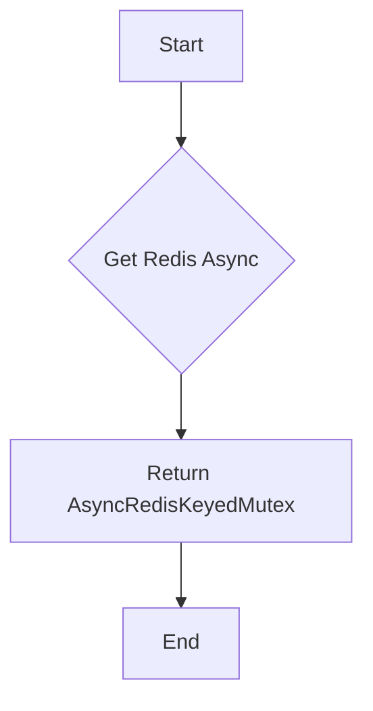

#### 带注释源码

```python
async def get_redis_async():
    from backend.data.redis_client import get_redis_async
    return await get_redis_async()
```


### `_get_provider_oauth_handler`

Retrieves the OAuth handler for a given provider name.

参数：

- `provider_name_str`：`str`，The name of the provider for which to retrieve the OAuth handler.

返回值：`BaseOAuthHandler`，The OAuth handler for the specified provider.

#### 流程图

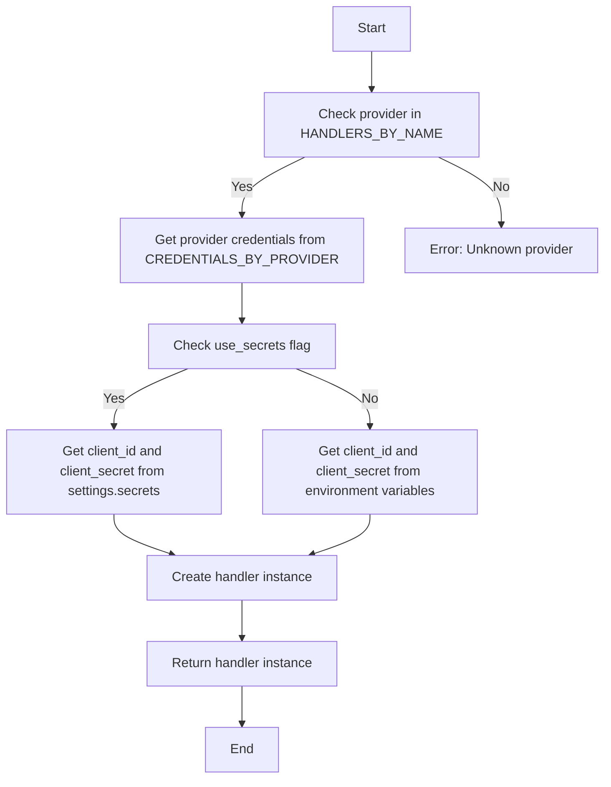

#### 带注释源码

```python
async def _get_provider_oauth_handler(provider_name_str: str) -> "BaseOAuthHandler":
    provider_name = ProviderName(provider_name_str)
    if provider_name not in HANDLERS_BY_NAME:
        raise KeyError(f"Unknown provider '{provider_name}'")

    provider_creds = CREDENTIALS_BY_PROVIDER[provider_name]
    if not provider_creds.use_secrets:
        # This is safe to do as we check that the env vars exist in the registry
        client_id = (
            os.getenv(provider_creds.client_id_env_var)
            if provider_creds.client_id_env_var
            else None
        )
        client_secret = (
            os.getenv(provider_creds.client_secret_env_var)
            if provider_creds.client_secret_env_var
            else None
        )
    else:
        client_id = getattr(settings.secrets, f"{provider_name.value}_client_id")
        client_secret = getattr(
            settings.secrets, f"{provider_name.value}_client_secret"
        )

    if not (client_id and client_secret):
        raise MissingConfigError(
            f"Integration with provider '{provider_name}' is not configured",
        )

    handler_class = HANDLERS_BY_NAME[provider_name]
    frontend_base_url = (
        settings.config.frontend_base_url or settings.config.platform_base_url
    )
    return handler_class(
        client_id=client_id,
        client_secret=client_secret,
        redirect_uri=f"{frontend_base_url}/auth/integrations/oauth_callback",
    )
```


### IntegrationCredentialsManager.create

This method adds a new set of credentials to the store for a given user.

参数：

- `user_id`：`str`，The unique identifier for the user.
- `credentials`：`Credentials`，The credentials object to be added.

返回值：`None`，This method does not return a value.

#### 流程图

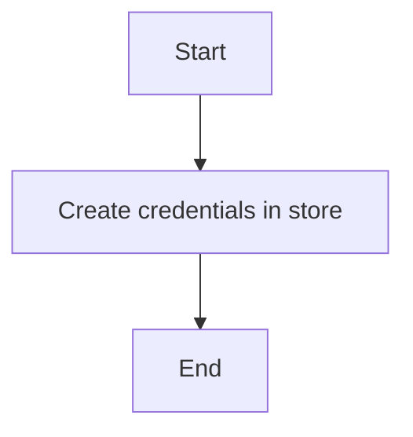

#### 带注释源码

```python
async def create(self, user_id: str, credentials: Credentials) -> None:
    # Add the credentials to the store for the given user
    return await self.store.add_creds(user_id, credentials)
```


### `IntegrationCredentialsManager.exists`

This method checks if the specified credentials exist for a given user.

参数：

- `user_id`：`str`，The unique identifier for the user.
- `credentials_id`：`str`，The unique identifier for the credentials.

返回值：`bool`，Returns `True` if the credentials exist, otherwise `False`.

#### 流程图

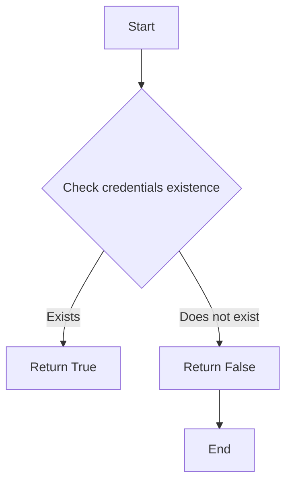

#### 带注释源码

```python
async def exists(self, user_id: str, credentials_id: str) -> bool:
    return (await self.store.get_creds_by_id(user_id, credentials_id)) is not None
```


### IntegrationCredentialsManager.get

Retrieves credentials for a specific user and credentials ID, refreshing them if necessary.

参数：

- `user_id`：`str`，The unique identifier for the user.
- `credentials_id`：`str`，The unique identifier for the credentials.
- `lock`：`bool`，Optional; whether to acquire a lock on the credentials. Defaults to `True`.

返回值：`Credentials | None`，The credentials object if found, otherwise `None`.

#### 流程图

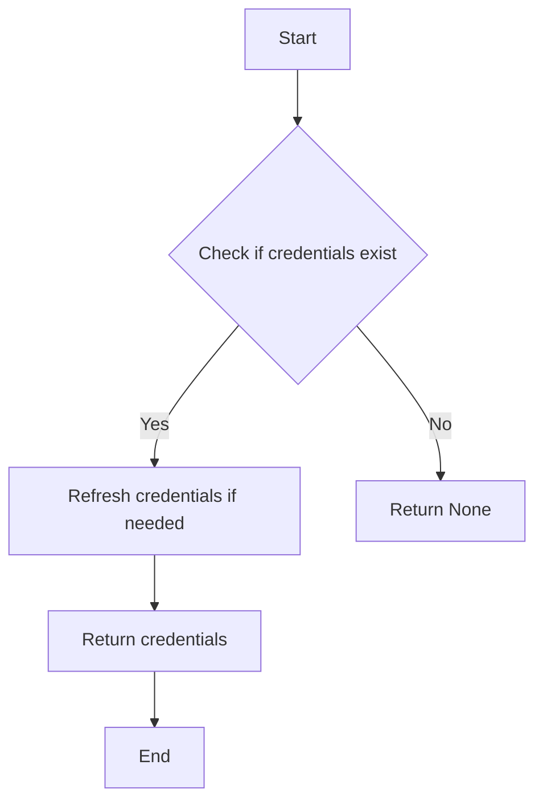

#### 带注释源码

```python
async def get(self, user_id: str, credentials_id: str, lock: bool = True) -> Credentials | None:
    credentials = await self.store.get_creds_by_id(user_id, credentials_id)
    if not credentials:
        return None

    # Refresh OAuth credentials if needed
    if credentials.type == "oauth2" and credentials.access_token_expires_at:
        logger.debug(
            f"Credentials #{credentials.id} expire at "
            f"{datetime.fromtimestamp(credentials.access_token_expires_at)}; "
            f"current time is {datetime.now()}"
        )
        credentials = await self.refresh_if_needed(user_id, credentials, lock)
    else:
        logger.debug(f"Credentials #{credentials.id} never expire")

    return credentials
```


### IntegrationCredentialsManager.acquire

This method is used to acquire credentials for a specific user and credentials ID. It ensures that the credentials are locked during acquisition to prevent concurrent access and potential invalidation.

参数：

- `user_id`：`str`，The unique identifier for the user.
- `credentials_id`：`str`，The unique identifier for the credentials.

返回值：`tuple[Credentials, AsyncRedisLock]`，A tuple containing the credentials and a lock object that must be released after use.

#### 流程图

```mermaid
graph TD
    A[Start] --> B[Acquire lock "!time_sensitive"]
    B --> C{Credentials exist?}
    C -- Yes --> D[Return credentials and lock]
    C -- No --> E[Get credentials]
    E --> F{Credentials need refresh?}
    F -- Yes --> G[Refresh credentials]
    G --> H[Update credentials in store]
    H --> I[Return credentials and lock]
    F -- No --> I
    I --> J[Release lock]
    J --> K[End]
```

#### 带注释源码

```python
async def acquire(self, user_id: str, credentials_id: str) -> tuple[Credentials, AsyncRedisLock]:
    """
    ⚠️ WARNING: this locks credentials system-wide and blocks both acquiring
    and updating them elsewhere until the lock is released.
    See the class docstring for more info.
    """
    # Use a low-priority (!time_sensitive) locking queue on top of the general lock
    # to allow priority access for refreshing/updating the tokens.
    async with self._locked(user_id, credentials_id, "!time_sensitive"):
        lock = await self._acquire_lock(user_id, credentials_id)
    credentials = await self.get(user_id, credentials_id, lock=False)
    if not credentials:
        raise ValueError(
            f"Credentials #{credentials_id} for user #{user_id} not found"
        )
    return credentials, lock
```


### IntegrationCredentialsManager.cached_getter

This method creates a cached getter function for credentials, which is used to fetch credentials from the store with caching.

参数：

- `user_id`：`str`，The user ID for which to fetch the credentials.
- ...

返回值：`Callable[[str], Coroutine[Any, Any, Credentials | None]]`，A coroutine function that fetches a single credential by its ID.

#### 流程图

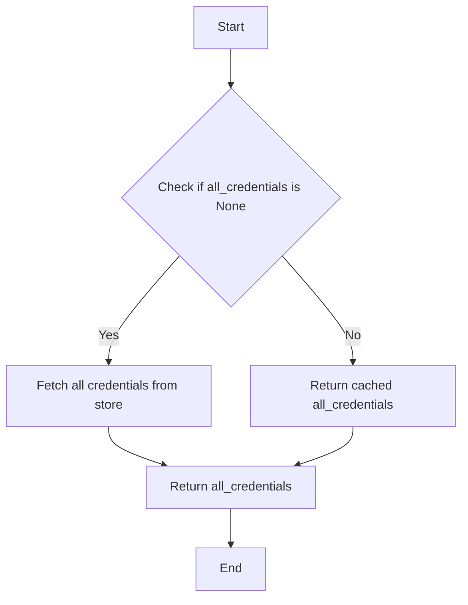

#### 带注释源码

```python
def cached_getter(self, user_id: str) -> Callable[[str], Coroutine[Any, Any, Credentials | None]]:
    all_credentials = None

    async def get_credentials(creds_id: str) -> "Credentials | None":
        nonlocal all_credentials
        if not all_credentials:
            # Fetch credentials on first necessity
            all_credentials = await self.store.get_all_creds(user_id)

        credential = next((c for c in all_credentials if c.id == creds_id), None)
        if not credential:
            return None
        if credential.type != "oauth2" or not credential.access_token_expires_at:
            # Credential doesn't expire
            return credential

        # Credential is OAuth2 credential and has expiration timestamp
        return await self.refresh_if_needed(user_id, credential)

    return get_credentials
```


### IntegrationCredentialsManager.refresh_if_needed

Refreshes OAuth2 credentials if they are about to expire.

参数：

- `user_id`: `str`，The user ID associated with the credentials.
- `credentials`: `OAuth2Credentials`，The credentials object to check and refresh if needed.
- `lock`: `bool`，Optional; whether to acquire a lock on the credentials during the refresh process. Defaults to `True`.

返回值：`OAuth2Credentials`，The refreshed credentials object.

#### 流程图

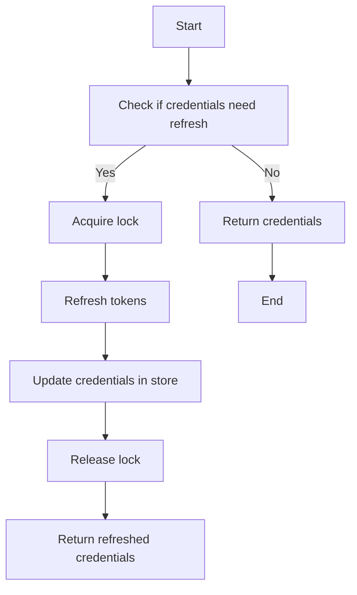

#### 带注释源码

```python
async def refresh_if_needed(
    self, user_id: str, credentials: OAuth2Credentials, lock: bool = True
) -> OAuth2Credentials:
    async with self._locked(user_id, credentials.id, "refresh"):
        oauth_handler = await _get_provider_oauth_handler(credentials.provider)
        if oauth_handler.needs_refresh(credentials):
            logger.debug(
                f"Refreshing '{credentials.provider}' "
                f"credentials #{credentials.id}"
            )
            _lock = None
            if lock:
                # Wait until the credentials are no longer in use anywhere
                _lock = await self._acquire_lock(user_id, credentials.id)

            fresh_credentials = await oauth_handler.refresh_tokens(credentials)
            await self.store.update_creds(user_id, fresh_credentials)
            if _lock and (await _lock.locked()) and (await _lock.owned()):
                try:
                    await _lock.release()
                except Exception as e:
                    logger.warning(f"Failed to release OAuth refresh lock: {e}")

            credentials = fresh_credentials
    return credentials
```


### IntegrationCredentialsManager.update

Updates the credentials for a specific user.

参数：

- `user_id`: `str`，The ID of the user for whom the credentials are being updated.
- `updated`: `Credentials`，The updated credentials object.

返回值：`None`，No value is returned as the method is void.

#### 流程图

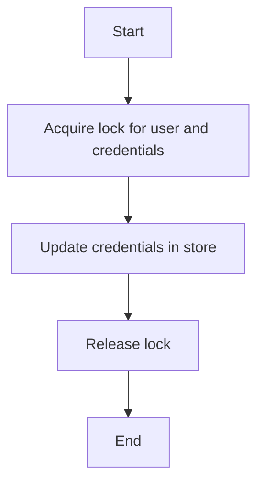

#### 带注释源码

```python
async def update(self, user_id: str, updated: Credentials) -> None:
    async with self._locked(user_id, updated.id):
        await self.store.update_creds(user_id, updated)
```


### IntegrationCredentialsManager.delete

Deletes integration credentials for a specific user and credentials ID.

参数：

- `user_id`: `str`，The ID of the user for whom the credentials are to be deleted.
- `credentials_id`: `str`，The ID of the credentials to be deleted.

返回值：`None`，Indicates that the credentials have been successfully deleted.

#### 流程图

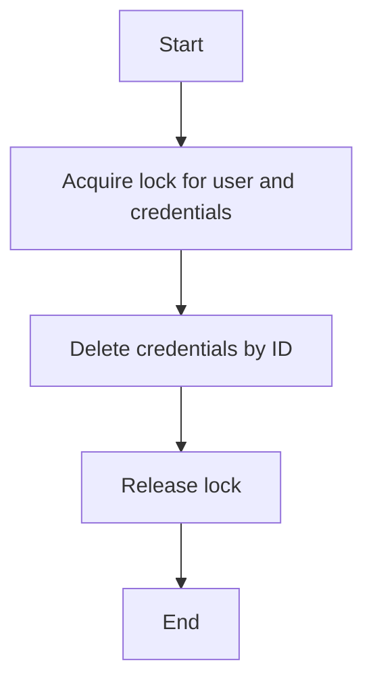

#### 带注释源码

```python
async def delete(self, user_id: str, credentials_id: str) -> None:
    async with self._locked(user_id, credentials_id):
        await self.store.delete_creds_by_id(user_id, credentials_id)
```


### IntegrationCredentialsManager.release_all_locks

This method is used to release all locks held by the `IntegrationCredentialsManager` instance, ensuring that all resources are properly released when the process is terminating.

参数：

- 无

返回值：`None`，无返回值

#### 流程图

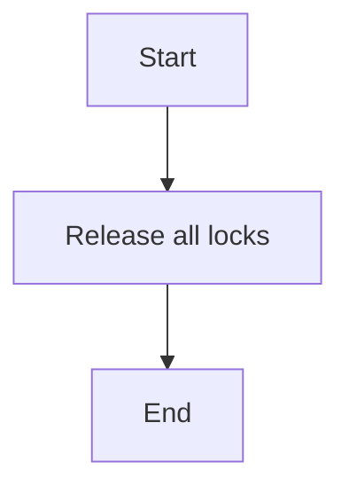

#### 带注释源码

```python
async def release_all_locks(self):
    """Call this on process termination to ensure all locks are released"""
    await (await self.locks()).release_all_locks()
    await (await self.store.locks()).release_all_locks()
``` 


### IntegrationCredentialsStore.add_creds

This function adds credentials to the store for a given user.

参数：

- `user_id`：`str`，The unique identifier for the user.
- `credentials`：`Credentials`，The credentials object to be added.

返回值：`None`，No value is returned.

#### 流程图

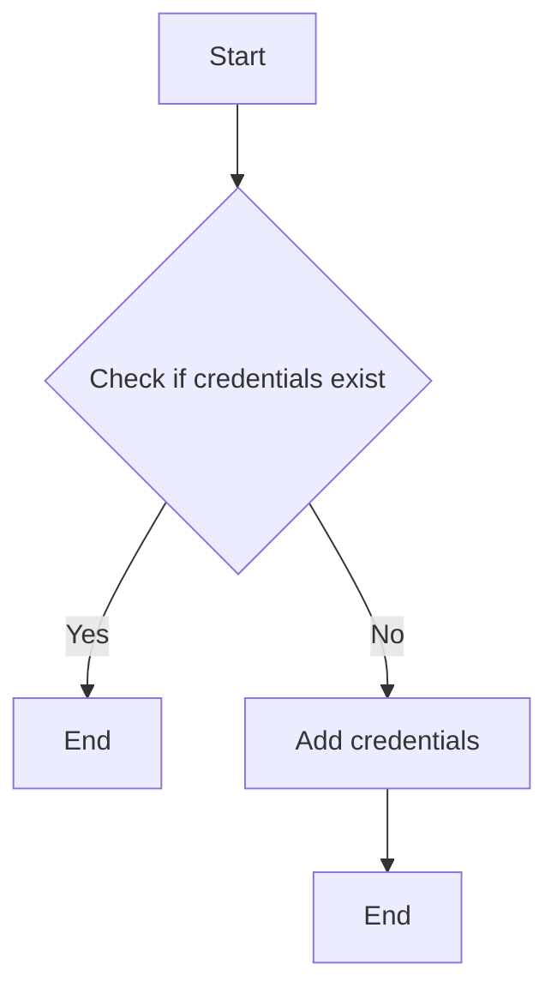

#### 带注释源码

```python
async def add_creds(self, user_id: str, credentials: Credentials) -> None:
    # Add the credentials to the store
    await self.redis_client.set(f"user:{user_id}:creds:{credentials.id}", credentials)
```


### IntegrationCredentialsStore.get_creds_by_id

Retrieves credentials by their ID for a specific user.

参数：

- `user_id`：`str`，The ID of the user for whom to retrieve the credentials.
- `credentials_id`：`str`，The ID of the credentials to retrieve.

返回值：`Credentials | None`，The retrieved credentials or `None` if not found.

#### 流程图

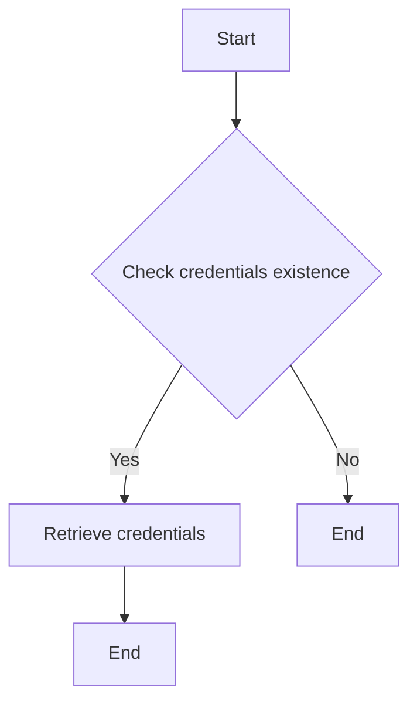

#### 带注释源码

```python
async def get_creds_by_id(self, user_id: str, credentials_id: str) -> Credentials | None:
    return (await self.redis_client.hgetall(
        f"user:{user_id}:creds:{credentials_id}"
    ))
```


### IntegrationCredentialsManager.cached_getter

This method is a cached getter for credentials, which returns a coroutine that fetches credentials from the store if they are not already cached.

参数：

- `user_id`：`str`，The unique identifier for the user.
- ...

返回值：`Coroutine[Any, Any, Credentials | None]`，A coroutine that returns a `Credentials` object if found, otherwise `None`.

#### 流程图

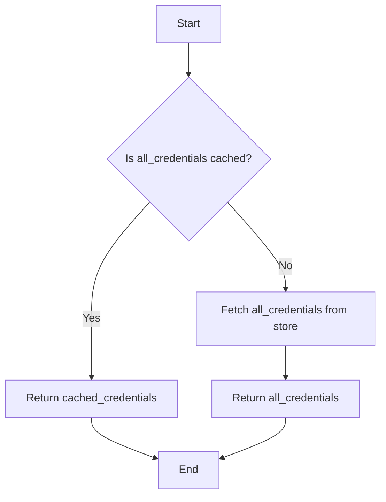

#### 带注释源码

```python
def cached_getter(self, user_id: str) -> Callable[[str], Coroutine[Any, Any, Credentials | None]]:
    all_credentials = None

    async def get_credentials(creds_id: str) -> Credentials | None:
        nonlocal all_credentials
        if not all_credentials:
            # Fetch credentials on first necessity
            all_credentials = await self.store.get_all_creds(user_id)

        credential = next((c for c in all_credentials if c.id == creds_id), None)
        if not credential:
            return None
        if credential.type != "oauth2" or not credential.access_token_expires_at:
            # Credential doesn't expire
            return credential

        # Credential is OAuth2 credential and has expiration timestamp
        return await self.refresh_if_needed(user_id, credential)

    return get_credentials
```


### IntegrationCredentialsStore.update_creds

Updates the credentials for a specific user.

参数：

- `user_id`: `str`，The ID of the user for whom to update the credentials.
- `updated`: `Credentials`，The updated credentials to store.

返回值：`None`，Indicates that the credentials have been successfully updated.

#### 流程图

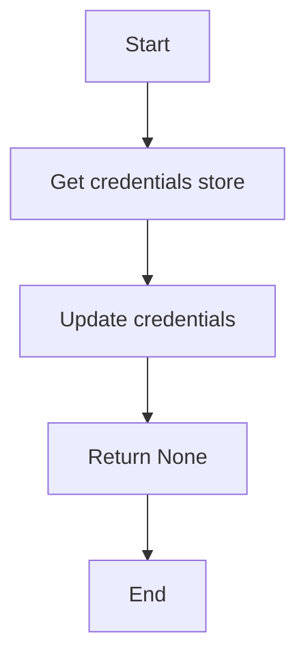

#### 带注释源码

```python
async def update(self, user_id: str, updated: Credentials) -> None:
    async with self._locked(user_id, updated.id):
        await self.store.update_creds(user_id, updated)
```


### IntegrationCredentialsStore.delete_creds_by_id

This function deletes credentials by their ID for a given user.

参数：

- `user_id`: `str`，The ID of the user for whom the credentials are to be deleted.
- `credentials_id`: `str`，The ID of the credentials to be deleted.

返回值：`None`，No value is returned as the function performs an action and does not return a result.

#### 流程图

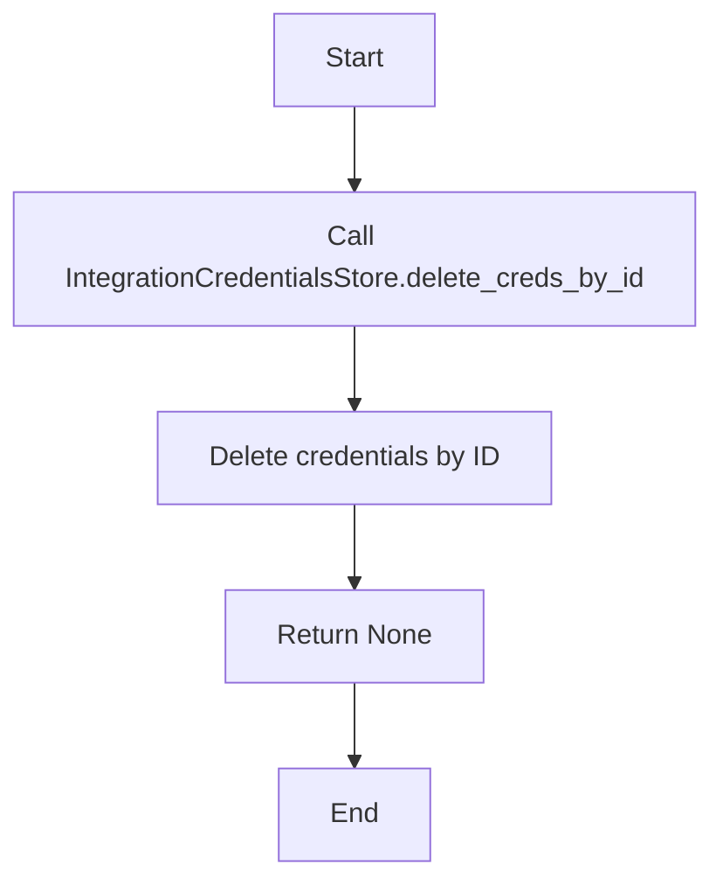

#### 带注释源码

```python
async def delete(self, user_id: str, credentials_id: str) -> None:
    async with self._locked(user_id, credentials_id):
        await self.store.delete_creds_by_id(user_id, credentials_id)
```


### AsyncRedisKeyedMutex.acquire

This method is used to acquire a lock on a specific set of credentials for a user, ensuring that the credentials are not accessed or modified by another part of the system while they are in use.

参数：

- `user_id`：`str`，The unique identifier for the user.
- `credentials_id`：`str`，The unique identifier for the credentials.

返回值：`tuple[Credentials, AsyncRedisLock]`，A tuple containing the credentials and the lock object.

#### 流程图

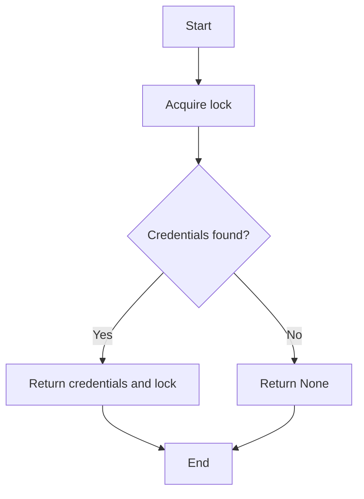

#### 带注释源码

```python
async def acquire(self, user_id: str, credentials_id: str) -> tuple[Credentials, AsyncRedisLock]:
    """
    ⚠️ WARNING: this locks credentials system-wide and blocks both acquiring
    and updating them elsewhere until the lock is released.
    See the class docstring for more info.
    """
    # Use a low-priority (!time_sensitive) locking queue on top of the general lock
    # to allow priority access for refreshing/updating the tokens.
    async with self._locked(user_id, credentials_id, "!time_sensitive"):
        lock = await self._acquire_lock(user_id, credentials_id)
    credentials = await self.get(user_id, credentials_id, lock=False)
    if not credentials:
        raise ValueError(
            f"Credentials #{credentials_id} for user #{user_id} not found"
        )
    return credentials, lock
```


### AsyncRedisKeyedMutex.release_all_locks

This function releases all locks held by the `AsyncRedisKeyedMutex` instance.

参数：

- 无

返回值：`None`，无返回值

#### 流程图


#### 带注释源码

```python
async def release_all_locks(self):
    """Call this on process termination to ensure all locks are released"""
    await (await self.locks()).release_all_locks()
    await (await self.store.locks()).release_all_locks()
``` 


## 关键组件


### 张量索引与惰性加载

用于在需要时才加载张量数据，以减少内存占用和提高性能。

### 反量化支持

支持对量化策略进行反量化处理，以便在量化过程中保持精度。

### 量化策略

定义了量化策略，用于在模型训练过程中对权重进行量化，以减少模型大小和提高推理速度。


## 问题及建议


### 已知问题

-   **Locking Mechanism Complexity**: The code uses a two-tier locking mechanism to ensure that credential refreshes and updates have priority over credential acquisitions. This adds complexity to the code and may be overkill for a system that doesn't require such strict prioritization.
-   **Error Handling**: The code does not provide detailed error handling for scenarios such as lock acquisition failures or issues during credential refresh.
-   **Dependency Injection**: The `Settings` object is used directly within the `_get_provider_oauth_handler` function, which may lead to tight coupling and difficulties in testing.
-   **Logging**: The logging statements are basic and do not provide enough context for debugging purposes, such as the specific error messages or the state of the system at the time of the error.

### 优化建议

-   **Simplify Locking Mechanism**: Consider simplifying the locking mechanism if the system does not require strict prioritization between refreshes and acquisitions. This could reduce the complexity and potential points of failure.
-   **Improve Error Handling**: Implement more robust error handling to provide clear error messages and recovery strategies for common failure scenarios, such as lock acquisition failures or issues during credential refresh.
-   **Use Dependency Injection**: Refactor the code to use dependency injection for the `Settings` object, which will make the code more testable and decoupled from the configuration.
-   **Enhance Logging**: Improve the logging by adding more detailed information, such as error codes, stack traces, and the state of the system at the time of the error, to aid in debugging and monitoring.
-   **Consider Asynchronous Locks**: If the system is highly concurrent, consider using asynchronous locks that can handle multiple readers and writers more efficiently.
-   **Review OAuth Handler Initialization**: Ensure that the initialization of OAuth handlers is efficient and that unnecessary environment variable checks are minimized.
-   **Implement Caching**: Consider implementing caching for credentials that do not require frequent updates to reduce the load on the database and improve performance.


## 其它


### 设计目标与约束

- **设计目标**:
  - 管理集成凭证的生命周期，包括创建、获取、更新和删除。
  - 自动刷新OAuth凭证，以保持其有效性。
  - 使用锁机制确保系统范围内的数据一致性，防止凭证无效化。
  - 提供一个线程安全的接口，以避免并发访问问题。

- **约束**:
  - 凭证获取操作可能需要读写访问权限。
  - 凭证刷新操作可能需要额外的锁，以防止不必要的连续刷新。
  - 凭证在使用时必须被锁定，以防止在刷新过程中被无效化。

### 错误处理与异常设计

- **错误处理**:
  - 如果凭证不存在，将抛出`ValueError`。
  - 如果配置错误，将抛出`MissingConfigError`。
  - 如果在获取或释放锁时发生异常，将记录警告并尝试释放锁。

- **异常设计**:
  - 使用自定义异常类来处理特定错误情况。
  - 异常信息应包含足够的信息，以便于调试和错误追踪。

### 数据流与状态机

- **数据流**:
  - 用户请求获取凭证。
  - 系统检查凭证是否存在和是否需要刷新。
  - 如果需要，系统刷新凭证。
  - 系统返回凭证给用户。

- **状态机**:
  - 凭证可以处于有效、过期、刷新中或无效状态。
  - 状态转换由凭证的过期时间和刷新操作触发。

### 外部依赖与接口契约

- **外部依赖**:
  - Redis客户端用于存储和检索凭证。
  - OAuth处理程序用于刷新OAuth凭证。

- **接口契约**:
  - `IntegrationCredentialsStore`接口用于存储和检索凭证。
  - `BaseOAuthHandler`接口用于处理OAuth凭证的刷新。

### 安全性

- **安全性**:
  - 凭证存储应加密，以防止未授权访问。
  - 凭证传输应使用安全的通信协议，如HTTPS。

### 性能

- **性能**:
  - 使用锁机制以避免并发访问问题，但应最小化锁的使用，以减少性能影响。
  - 使用缓存来减少对存储系统的访问次数。

### 可维护性

- **可维护性**:
  - 代码应遵循良好的编程实践，以便于理解和维护。
  - 应使用文档和注释来描述代码的功能和结构。

### 测试

- **测试**:
  - 应编写单元测试和集成测试来验证代码的功能。
  - 测试应覆盖所有关键路径和边界条件。

### 日志记录

- **日志记录**:
  - 应记录关键操作和错误信息，以便于调试和监控。
  - 日志级别应适当，以避免过度记录。

### 监控

- **监控**:
  - 应监控系统的关键性能指标，如响应时间和错误率。
  - 应设置警报，以便在性能下降或出现错误时及时通知。

### 可扩展性

- **可扩展性**:
  - 系统应设计为可扩展的，以便于添加新的集成和功能。
  - 应使用模块化和分层的设计原则。

### 用户界面

- **用户界面**:
  - 如果适用，用户界面应直观易用。
  - 应提供清晰的指示和反馈。

### 文档

- **文档**:
  - 应提供详细的文档，包括代码说明、API文档和用户指南。
  - 文档应易于理解和维护。

### 部署

- **部署**:
  - 应提供详细的部署指南，包括环境配置和依赖项安装。
  - 应使用自动化工具来简化部署过程。

### 维护

- **维护**:
  - 应定期更新代码，以修复错误和添加新功能。
  - 应监控系统的性能和稳定性，并及时进行维护。

### 法律合规

- **法律合规**:
  - 系统应符合适用的法律和法规要求。
  - 应保护用户数据的安全和隐私。

### 代码质量

- **代码质量**:
  - 代码应遵循编码标准和最佳实践。
  - 应使用代码审查和静态分析工具来提高代码质量。

### 依赖管理

- **依赖管理**:
  - 应使用版本控制系统来管理代码和依赖项。
  - 应定期更新依赖项，以修复安全漏洞和引入新功能。

### 架构设计

- **架构设计**:
  - 系统应设计为模块化和可扩展的。
  - 应使用分层和组件化的设计原则。

### 性能优化

- **性能优化**:
  - 应识别性能瓶颈并进行优化。
  - 应使用缓存和异步操作来提高性能。

### 安全优化

- **安全优化**:
  - 应识别安全漏洞并进行修复。
  - 应使用安全最佳实践来保护系统。

### 可用性

- **可用性**:
  - 系统应易于使用，并提供清晰的反馈。
  - 应支持多种语言和平台。

### 可访问性

- **可访问性**:
  - 系统应符合可访问性标准，以便于残障人士使用。

### 国际化

- **国际化**:
  - 系统应支持多语言和地区设置。
  - 应使用国际化最佳实践。

### 用户体验

- **用户体验**:
  - 系统应提供一致和直观的用户体验。
  - 应使用用户测试和反馈来改进用户体验。

### 可追踪性

- **可追踪性**:
  - 系统应提供日志记录和监控功能，以便于追踪和调试。

### 可重用性

- **可重用性**:
  - 系统应设计为可重用的，以便于在其他项目中使用。

### 可测试性

- **可测试性**:
  - 系统应设计为可测试的，以便于编写和执行测试。

### 可部署性

- **可部署性**:
  - 系统应设计为易于部署和扩展的。

### 可维护性

- **可维护性**:
  - 系统应设计为易于维护和更新的。

### 可扩展性

- **可扩展性**:
  - 系统应设计为易于扩展和添加新功能的。

### 可靠性

- **可靠性**:
  - 系统应设计为可靠的，能够处理错误和异常情况。

### 可用性

- **可用性**:
  - 系统应设计为易于使用的，并提供清晰的反馈。

### 可维护性

- **可维护性**:
  - 系统应设计为易于维护和更新的。

### 可扩展性

- **可扩展性**:
  - 系统应设计为易于扩展和添加新功能的。

### 可靠性

- **可靠性**:
  - 系统应设计为可靠的，能够处理错误和异常情况。

### 可用性

- **可用性**:
  - 系统应设计为易于使用的，并提供清晰的反馈。

### 可维护性

- **可维护性**:
  - 系统应设计为易于维护和更新的。

### 可扩展性

- **可扩展性**:
  - 系统应设计为易于扩展和添加新功能的。

### 可靠性

- **可靠性**:
  - 系统应设计为可靠的，能够处理错误和异常情况。

### 可用性

- **可用性**:
  - 系统应设计为易于使用的，并提供清晰的反馈。

### 可维护性

- **可维护性**:
  - 系统应设计为易于维护和更新的。

### 可扩展性

- **可扩展性**:
  - 系统应设计为易于扩展和添加新功能的。

### 可靠性

- **可靠性**:
  - 系统应设计为可靠的，能够处理错误和异常情况。

### 可用性

- **可用性**:
  - 系统应设计为易于使用的，并提供清晰的反馈。

### 可维护性

- **可维护性**:
  - 系统应设计为易于维护和更新的。

### 可扩展性

- **可扩展性**:
  - 系统应设计为易于扩展和添加新功能的。

### 可靠性

- **可靠性**:
  - 系统应设计为可靠的，能够处理错误和异常情况。

### 可用性

- **可用性**:
  - 系统应设计为易于使用的，并提供清晰的反馈。

### 可维护性

- **可维护性**:
  - 系统应设计为易于维护和更新的。

### 可扩展性

- **可扩展性**:
  - 系统应设计为易于扩展和添加新功能的。

### 可靠性

- **可靠性**:
  - 系统应设计为可靠的，能够处理错误和异常情况。

### 可用性

- **可用性**:
  - 系统应设计为易于使用的，并提供清晰的反馈。

### 可维护性

- **可维护性**:
  - 系统应设计为易于维护和更新的。

### 可扩展性

- **可扩展性**:
  - 系统应设计为易于扩展和添加新功能的。

### 可靠性

- **可靠性**:
  - 系统应设计为可靠的，能够处理错误和异常情况。

### 可用性

- **可用性**:
  - 系统应设计为易于使用的，并提供清晰的反馈。

### 可维护性

- **可维护性**:
  - 系统应设计为易于维护和更新的。

### 可扩展性

- **可扩展性**:
  - 系统应设计为易于扩展和添加新功能的。

### 可靠性

- **可靠性**:
  - 系统应设计为可靠的，能够处理错误和异常情况。

### 可用性

- **可用性**:
  - 系统应设计为易于使用的，并提供清晰的反馈。

### 可维护性

- **可维护性**:
  - 系统应设计为易于维护和更新的。

### 可扩展性

- **可扩展性**:
  - 系统应设计为易于扩展和添加新功能的。

### 可靠性

- **可靠性**:
  - 系统应设计为可靠的，能够处理错误和异常情况。

### 可用性

- **可用性**:
  - 系统应设计为易于使用的，并提供清晰的反馈。

### 可维护性

- **可维护性**:
  - 系统应设计为易于维护和更新的。

### 可扩展性

- **可扩展性**:
  - 系统应设计为易于扩展和添加新功能的。

### 可靠性

- **可靠性**:
  - 系统应设计为可靠的，能够处理错误和异常情况。

### 可用性

- **可用性**:
  - 系统应设计为易于使用的，并提供清晰的反馈。

### 可维护性

- **可维护性**:
  - 系统应设计为易于维护和更新的。

### 可扩展性

- **可扩展性**:
  - 系统应设计为易于扩展和添加新功能的。

### 可靠性

- **可靠性**:
  - 系统应设计为可靠的，能够处理错误和异常情况。

### 可用性

- **可用性**:
  - 系统应设计为易于使用的，并提供清晰的反馈。

### 可维护性

- **可维护性**:
  - 系统应设计为易于维护和更新的。

### 可扩展性

- **可扩展性**:
  - 系统应设计为易于扩展和添加新功能的。

### 可靠性

- **可靠性**:
  - 系统应设计为可靠的，能够处理错误和异常情况。

### 可用性

- **可用性**:
  - 系统应设计为易于使用的，并提供清晰的反馈。

### 可维护性

- **可维护性**:
  - 系统应设计为易于维护和更新的。

### 可扩展性

- **可扩展性**:
  - 系统应设计为易于扩展和添加新功能的。

### 可靠性

- **可靠性**:
  - 系统应设计为可靠的，能够处理错误和异常情况。

### 可用性

- **可用性**:
  - 系统应设计为易于使用的，并提供清晰的反馈。

### 可维护性

- **可维护性**:
  - 系统应设计为易于维护和更新的。

### 可扩展性

- **可扩展性**:
  - 系统应设计为易于扩展和添加新功能的。

### 可靠性

- **可靠性**:
  - 系统应设计为可靠的，能够处理错误和异常情况。

### 可用性

- **可用性**:
  - 系统应设计为易于使用的，并提供清晰的反馈。

### 可维护性

- **可维护性**:
  - 系统应设计为易于维护和更新的。

### 可扩展性

- **可扩展性**:
  - 系统应设计为易于扩展和添加新功能的。

### 可靠性

- **可靠性**:
  - 系统应设计为可靠的，能够处理错误和异常情况。

### 可用性

- **可用性**:
  - 系统应设计为易于使用的，并提供清晰的反馈。

### 可维护性

- **可维护性**:
  - 系统应设计为易于维护和更新的。

### 可扩展性

- **可扩展性**:
  - 系统应设计为易于扩展和添加新功能的。

### 可靠性

- **可靠性**:
  - 系统应设计为可靠的，能够处理错误和异常情况。

### 可用性

- **可用性**:
  - 系统应设计为易于使用的，并提供清晰的反馈。

### 可维护性

- **可维护性**:
  - 系统应设计为易于维护和更新的。

### 可扩展性

- **可扩展性**:
  - 系统应设计为易于扩展和添加新功能的。

### 可靠性

- **可靠性**:
  - 系统应设计为可靠的，能够处理错误和异常情况。

### 可用性

- **可用性**:
  - 系统应设计为易于使用的，并提供清晰的反馈。

### 可维护性

- **可维护性**:
  - 系统应设计为易于维护和更新的。

### 可扩展性

- **可扩展性**:
  - 系统应设计为易于扩展和添加新功能的。

### 可靠性

- **可靠性**:
  - 系统应设计为可靠的，能够处理错误和异常情况。

### 可用性

- **可用性**:
  - 系统应设计为易于使用的，并提供清晰的反馈。

### 可维护性

- **可维护性**:
  - 系统应设计为易于维护和更新的。

### 可扩展性

- **可扩展性**:
  - 系统应设计为易于扩展和添加新功能的。

### 可靠性

- **可靠性**:
  - 系统应设计为可靠的，能够处理错误和异常情况。

### 可用性

- **可用性**:
  - 系统应设计为易于使用的，并提供清晰的反馈。

### 可维护性

- **可维护性**:
  - 系统应设计为易于维护和更新的。

### 可扩展性

- **可扩展性**:
  - 系统应设计为易于扩展和添加新功能的。

### 可靠性

- **可靠性**:
  - 系统应设计为可靠的，能够处理错误和异常情况。

### 可用性

- **可用性**:
  - 系统应设计为易于使用的，并提供清晰的反馈。

### 可维护性

- **可维护性**:
  - 系统应设计为易于维护和更新的。

### 可扩展性

- **可扩展性**:
  - 系统应设计为易于扩展和添加新功能的。

### 可靠性

- **可靠性**:
  - 系统应设计为可靠的，能够处理错误和异常情况。

### 可用性

- **可用性**:
  - 系统应设计为易于使用的，并提供清晰的反馈。

### 可维护性

- **可维护性**:
  - 系统应设计为易于维护和更新的。

### 可扩展性

- **可扩展性**:
  - 系统应设计为易于扩展和添加新功能的。

### 可靠性

- **可靠性**:
  - 系统应设计为可靠的，能够处理错误和异常情况。

### 可用性

- **可用性**:
  - 系统应设计为易于使用的，并提供清晰的反馈。

### 可维护性

- **可维护性**:
  - 系统应设计为易于维护和更新的。

### 可扩展性

- **可扩展性**:
  - 系统应设计为易于扩展和添加新功能的。

### 可靠性

- **可靠性**:
  - 系统应设计为可靠的，能够处理错误和异常情况。

### 可用性

- **可用性**:
  - 系统应设计为易于使用的，并提供清晰的反馈。

### 可维护性

- **可维护性**:
  - 系统应设计为易于维护和更新的。

### 可扩展性

- **可扩展性**:
  - 系统应设计为易于扩展和添加新功能的。

### 可靠性

- **可靠性**:
  - 系统应设计为可靠的，能够处理错误和异常情况。

### 可用性

- **可用性**:
  - 系统应设计为易于使用的，并提供清晰的反馈。

### 可维护性

- **可维护性**:
  - 系统应设计为易于维护和更新的。

### 可扩展性

- **可扩展性**:
  - 系统应设计为易于扩展和添加新功能的。

### 可靠性

- **可靠性**:
  - 系统应设计为可靠的，能够处理错误和异常情况。

### 可用性

- **可用性**:
  - 系统应设计为易于使用的，并提供清晰的反馈。

### 可维护性

- **可维护性**:
  - 系统应设计为易于维护和更新的。

### 可扩展性

- **可扩展性**:
  - 系统应设计为易于扩展和添加新功能的。

### 可靠性

- **可靠性**:
  - 系统应设计为可靠的，能够处理错误和异常情况。

### 可用性

- **可用性**:
  - 系统应设计为易于使用的，并提供清晰的反馈。

### 可维护性

- **可维护性**:
  - 系统应设计为易于维护和更新的。

### 可扩展性

- **可扩展性**:
  - 系统应设计为易于扩展和添加新功能的。

### 可靠性

- **可靠性**:
  - 系统应设计为可靠的，能够处理错误和异常情况。

### 可用性

- **可用性**:
    