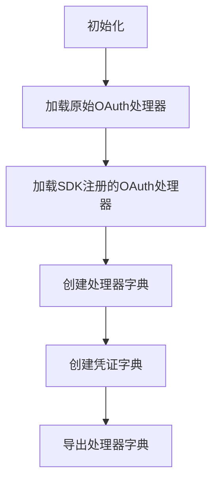
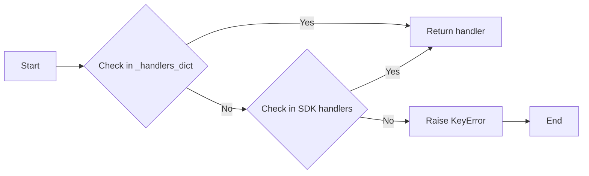
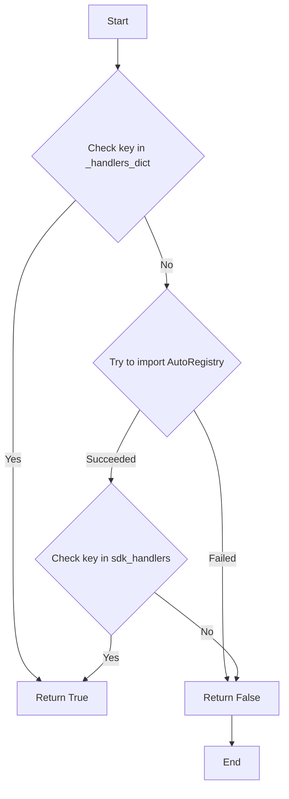
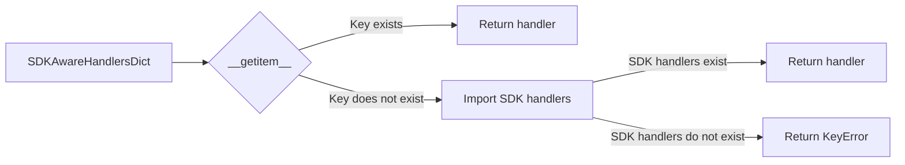
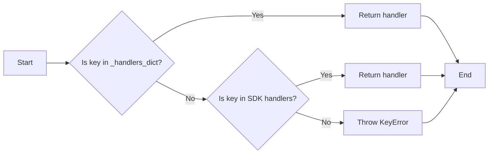
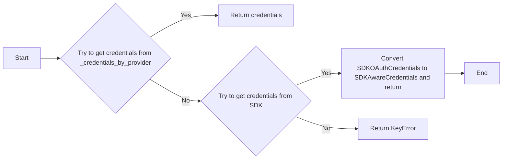
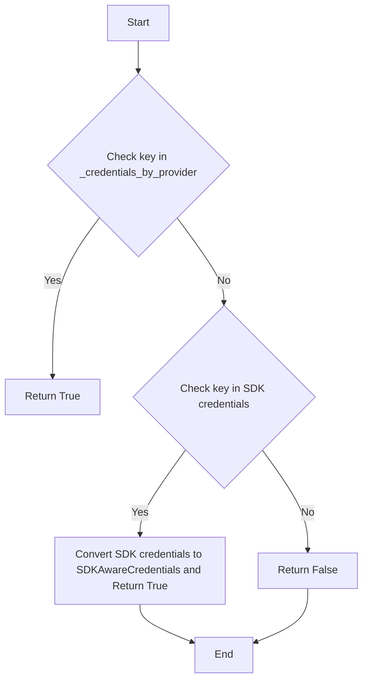
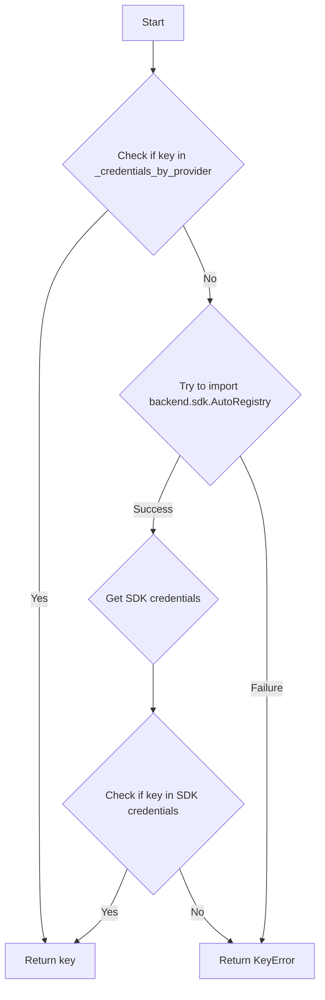
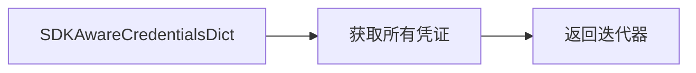

# `.\AutoGPT\autogpt_platform\backend\backend\integrations\oauth\__init__.py` 详细设计文档

This code defines a system for managing OAuth handlers and credentials for various providers, including both original and SDK-registered handlers and credentials.

## 整体流程



## 类结构

```
SDKAwareHandlersDict (处理器字典类)
├── SDKAwareCredentialsDict (凭证字典类)
│   ├── _handlers_dict (原始处理器字典)
│   ├── _credentials_by_provider (原始凭证字典)
│   ├── __getitem__ (获取处理器)
│   ├── get (获取处理器，带默认值)
│   ├── __contains__ (检查键是否存在)
│   ├── keys (获取所有键)
│   ├── values (获取所有值)
│   └── items (获取所有项)
└── __all__ (导出模块)
```

## 全局变量及字段


### `_ORIGINAL_HANDLERS`
    
List of OAuth handler classes for original providers.

类型：`list`
    


### `_handlers_dict`
    
Dictionary mapping provider names to OAuth handler classes.

类型：`dict`
    


### `_credentials_by_provider`
    
Dictionary mapping provider names to OAuth credentials configurations.

类型：`dict`
    


### `HANDLERS_BY_NAME`
    
Dictionary that automatically includes SDK-registered OAuth handlers.

类型：`SDKAwareHandlersDict`
    


### `CREDENTIALS_BY_PROVIDER`
    
Dictionary that automatically includes SDK-registered OAuth credentials.

类型：`SDKAwareCredentialsDict`
    


### `SDKAwareHandlersDict._handlers_dict`
    
Dictionary mapping provider names to OAuth handler classes, including SDK-registered handlers.

类型：`dict`
    


### `SDKAwareCredentialsDict._credentials_by_provider`
    
Dictionary mapping provider names to OAuth credentials configurations, including SDK-registered credentials.

类型：`dict`
    
    

## 全局函数及方法


### SDKAwareHandlersDict.__getitem__

This method is used to retrieve an OAuth handler from the `SDKAwareHandlersDict` class, which is a subclass of `dict`. It first checks if the key exists in the original handlers dictionary, then checks if it exists in the SDK-registered handlers dictionary.

参数：

- `key`：`str`，The key used to retrieve the OAuth handler. This is typically the provider name of the OAuth handler.

返回值：`type["BaseOAuthHandler"]`，The OAuth handler associated with the provided key.

#### 流程图



#### 带注释源码

```python
def __getitem__(self, key):
    # First try the original handlers
    if key in _handlers_dict:
        return _handlers_dict[key]

    # Then try SDK handlers
    try:
        from backend.sdk import AutoRegistry

        sdk_handlers = AutoRegistry.get_oauth_handlers()
        if key in sdk_handlers:
            return sdk_handlers[key]
    except ImportError:
        pass

    # If not found, raise KeyError
    raise KeyError(key)
```


### `SDKAwareHandlersDict.get`

该函数用于从`SDKAwareHandlersDict`字典中获取与指定键关联的OAuth处理器。

参数：

- `key`：`str`，要获取的OAuth处理器的键。

返回值：`type["BaseOAuthHandler"]`，与指定键关联的OAuth处理器。

#### 流程图

```mermaid
graph LR
A[SDKAwareHandlersDict.get] --> B{key in _handlers_dict?}
B -- 是 --> C[返回 _handlers_dict[key]]
B -- 否 --> D{try from backend.sdk import AutoRegistry}
D -- 成功 --> E[获取 sdk_handlers = AutoRegistry.get_oauth_handlers()]
D -- 失败 --> F[返回 KeyError(key)]
E --> G{key in sdk_handlers?}
G -- 是 --> H[返回 sdk_handlers[key]]
G -- 否 --> F
```

#### 带注释源码

```python
def get(self, key, default=None):
    try:
        return self[key]
    except KeyError:
        return default
``` 


### `SDKAwareHandlersDict.__contains__`

This method checks if a given key exists in the `SDKAwareHandlersDict` instance, which is a dictionary that includes SDK-registered OAuth handlers.

参数：

- `key`：`str`，The key to check for existence in the dictionary.

返回值：`bool`，Returns `True` if the key exists, otherwise `False`.

#### 流程图



#### 带注释源码

```python
def __contains__(self, key):
    if key in _handlers_dict:
        return True
    try:
        from backend.sdk import AutoRegistry
        sdk_handlers = AutoRegistry.get_oauth_handlers()
        return key in sdk_handlers
    except ImportError:
        return False
``` 


### HANDLERS_BY_NAME

This function is a class attribute that provides access to a dictionary containing OAuth handler classes, which are used for authentication with various services.

参数：

- 无

返回值：`dict[str, type["BaseOAuthHandler"]]`，A dictionary where the keys are strings representing the provider names and the values are the corresponding OAuth handler classes.

#### 流程图



#### 带注释源码

```python
class SDKAwareHandlersDict(dict):
    # ... (other methods)
    
    def __getitem__(self, key):
        # First try the original handlers
        if key in _handlers_dict:
            return _handlers_dict[key]

        # Then try SDK handlers
        try:
            from backend.sdk import AutoRegistry
            sdk_handlers = AutoRegistry.get_oauth_handlers()
            if key in sdk_handlers:
                return sdk_handlers[key]
        except ImportError:
            pass

        # If not found, raise KeyError
        raise KeyError(key)
```


### `SDKAwareHandlersDict.values`

`SDKAwareHandlersDict.values` 是 `SDKAwareHandlersDict` 类的一个方法，它返回一个包含所有 OAuth 处理器实例的迭代器。

参数：

- 无

返回值：`iterable`，一个包含所有 OAuth 处理器实例的迭代器。

#### 流程图

```mermaid
graph LR
A[SDKAwareHandlersDict.values()] --> B{尝试获取原始处理器}
B -->|成功| C[返回原始处理器值]
B -->|失败| D{尝试获取 SDK 处理器}
D -->|成功| C[返回 SDK 处理器值]
D -->|失败| E[抛出 KeyError]
```

#### 带注释源码

```python
def values(self):
    combined = dict(_handlers_dict)
    try:
        from backend.sdk import AutoRegistry

        sdk_handlers = AutoRegistry.get_oauth_handlers()
        combined.update(sdk_handlers)
    except ImportError:
        pass
    return combined.values()
```


### HANDLERS_BY_NAME.items()

该函数返回一个包含所有OAuth处理程序对象的迭代器，其中键是处理程序的提供者名称。

参数：

- 无

返回值：`iterable`，一个包含键值对（提供者名称和对应的`BaseOAuthHandler`对象）的迭代器。

#### 流程图



#### 带注释源码

```python
def items(self):
    combined = dict(_handlers_dict)
    try:
        from backend.sdk import AutoRegistry

        sdk_handlers = AutoRegistry.get_oauth_handlers()
        combined.update(sdk_handlers)
    except ImportError:
        pass
    return combined.items()
```


### SDKAwareCredentialsDict.__getitem__

This method is used to retrieve an OAuth credentials configuration for a specific provider by its key.

参数：

- `key`：`str`，The key used to identify the OAuth credentials configuration.

返回值：`SDKAwareCredentials`，The OAuth credentials configuration for the specified provider.

#### 流程图

```mermaid
graph TD
    A[Start] --> B[Check if key in _credentials_by_provider]
    B -->|Yes| C[Return _credentials_by_provider[key]]
    B -->|No| D[Check if backend.sdk is imported]
    D -->|Yes| E[Get sdk_credentials from AutoRegistry]
    D -->|No| F[Return KeyError]
    E -->|Key exists in sdk_credentials| C
    E -->|Key does not exist in sdk_credentials| F
    C --> G[End]
    F --> H[End]
```

#### 带注释源码

```python
def __getitem__(self, key):
    # First try the original handlers
    if key in _credentials_by_provider:
        return _credentials_by_provider[key]

    # Then try SDK credentials
    try:
        from backend.sdk import AutoRegistry

        sdk_credentials = AutoRegistry.get_oauth_credentials()
        if key in sdk_credentials:
            # Convert from SDKOAuthCredentials to SDKAwareCredentials
            sdk_cred = sdk_credentials[key]
            return SDKAwareCredentials(
                use_secrets=sdk_cred.use_secrets,
                client_id_env_var=sdk_cred.client_id_env_var,
                client_secret_env_var=sdk_cred.client_secret_env_var,
            )
    except ImportError:
        pass

    # If not found, raise KeyError
    raise KeyError(key)
```


### `SDKAwareCredentialsDict.get`

This method retrieves an OAuth credentials configuration for a given provider name.

参数：

- `key`：`str`，The name of the OAuth provider for which to retrieve the credentials.

返回值：`SDKAwareCredentials`，The OAuth credentials configuration for the specified provider.

#### 流程图



#### 带注释源码

```python
def __getitem__(self, key):
    # First try the original handlers
    if key in _credentials_by_provider:
        return _credentials_by_provider[key]

    # Then try SDK credentials
    try:
        from backend.sdk import AutoRegistry

        sdk_credentials = AutoRegistry.get_oauth_credentials()
        if key in sdk_credentials:
            # Convert from SDKOAuthCredentials to SDKAwareCredentials
            sdk_cred = sdk_credentials[key]
            return SDKAwareCredentials(
                use_secrets=sdk_cred.use_secrets,
                client_id_env_var=sdk_cred.client_id_env_var,
                client_secret_env_var=sdk_cred.client_secret_env_var,
            )
    except ImportError:
        pass

    # If not found, raise KeyError
    raise KeyError(key)
```


### SDKAwareCredentialsDict.__contains__

This method checks if a given key exists in the `SDKAwareCredentialsDict` dictionary, which includes both original and SDK-registered OAuth credentials.

参数：

- `key`：`str`，The key to check for existence in the dictionary.

返回值：`bool`，Returns `True` if the key exists, otherwise `False`.

#### 流程图



#### 带注释源码

```python
def __contains__(self, key):
    if key in _credentials_by_provider:
        return True
    try:
        from backend.sdk import AutoRegistry

        sdk_credentials = AutoRegistry.get_oauth_credentials()
        return key in sdk_credentials
    except ImportError:
        return False
``` 


### `SDKAwareCredentialsDict.keys`

该函数返回一个包含所有OAuth提供者名称的集合。

参数：

- 无

返回值：`set[str]`，包含所有OAuth提供者名称的集合。

#### 流程图



#### 带注释源码

```python
class SDKAwareCredentialsDict(dict):
    # ... (其他方法省略)

    def keys(self):
        # Combine all keys into a single dict and return its keys view
        combined = dict(_credentials_by_provider)
        try:
            from backend.sdk import AutoRegistry

            sdk_credentials = AutoRegistry.get_oauth_credentials()
            combined.update(sdk_credentials)
        except ImportError:
            pass
        return combined.keys()
``` 


### `SDKAwareCredentialsDict.values`

该函数返回一个包含所有OAuth凭证配置的值的迭代器。

参数：

- 无

返回值：`dict_values`，包含所有OAuth凭证配置的值的迭代器。

#### 流程图



#### 带注释源码

```python
class SDKAwareCredentialsDict(dict):
    # ... (其他方法省略)

    def values(self):
        combined = dict(_credentials_by_provider)
        try:
            from backend.sdk import AutoRegistry

            sdk_credentials = AutoRegistry.get_oauth_credentials()
            # Convert SDK credentials to SDKAwareCredentials
            for key, sdk_cred in sdk_credentials.items():
                combined[key] = SDKAwareCredentials(
                    use_secrets=sdk_cred.use_secrets,
                    client_id_env_var=sdk_cred.client_id_env_var,
                    client_secret_env_var=sdk_cred.client_secret_env_var,
                )
        except ImportError:
            pass
        return combined.values()
```


### `SDKAwareCredentialsDict.items`

`SDKAwareCredentialsDict.items` 是 `SDKAwareCredentialsDict` 类的一个方法，用于返回一个包含所有键值对的可迭代对象。

参数：

- 无

返回值：`dict_items`，包含字典中所有键值对的可迭代对象。

#### 流程图

```mermaid
graph LR
A[SDKAwareCredentialsDict.items()] --> B{获取所有键值对}
B --> C[返回 dict_items]
```

#### 带注释源码

```python
class SDKAwareCredentialsDict(dict):
    # ... (其他方法省略)

    def items(self):
        combined = dict(_credentials_by_provider)
        try:
            from backend.sdk import AutoRegistry
            sdk_credentials = AutoRegistry.get_oauth_credentials()
            # Convert SDK credentials to SDKAwareCredentials
            for key, sdk_cred in sdk_credentials.items():
                combined[key] = SDKAwareCredentials(
                    use_secrets=sdk_cred.use_secrets,
                    client_id_env_var=sdk_cred.client_id_env_var,
                    client_secret_env_var=sdk_cred.client_secret_env_var,
                )
        except ImportError:
            pass
        return combined.items()
```


## 关键组件


### HANDLERS_BY_NAME

A dictionary that maps OAuth provider names to their corresponding OAuth handler classes, including both original and SDK-registered handlers.

### CREDENTIALS_BY_PROVIDER

A dictionary that maps OAuth provider names to their corresponding OAuth credentials configurations, including both original and SDK-registered credentials.


## 问题及建议


### 已知问题

-   **硬编码的导入路径**：代码中硬编码了导入路径，这可能导致维护困难，尤其是在大型项目中。
-   **全局状态**：`_handlers_dict` 和 `_credentials_by_provider` 作为全局变量，这可能导致状态难以追踪和测试。
-   **异常处理**：代码中没有明确的异常处理机制，如果导入失败或字典访问失败，可能会抛出未处理的异常。
-   **类型检查**：虽然使用了 `TYPE_CHECKING`，但实际的类型检查可能不够全面，特别是在 SDK 注册的 OAuth 处理器和凭证中。

### 优化建议

-   **使用相对导入**：将导入路径改为相对导入，以减少硬编码并提高代码的可维护性。
-   **使用依赖注入**：将 OAuth 处理器和凭证作为参数传递给需要它们的函数或类，而不是使用全局状态。
-   **添加异常处理**：在可能抛出异常的地方添加 try-except 块，以避免程序崩溃并允许更优雅的错误处理。
-   **增强类型检查**：确保 SDK 注册的 OAuth 处理器和凭证在类型检查时得到适当的处理，可能需要使用更复杂的类型注解或运行时检查。
-   **模块化**：将 OAuth 处理器和凭证管理逻辑分解为更小的模块或服务，以提高代码的可读性和可测试性。
-   **文档化**：为代码添加详细的文档，包括如何注册新的 OAuth 处理器和凭证，以及如何处理异常情况。


## 其它


### 设计目标与约束

- 设计目标：
  - 提供一个统一的接口来管理不同OAuth服务提供商的认证流程。
  - 支持动态注册新的OAuth服务提供商。
  - 确保认证流程的安全性和可靠性。

- 约束：
  - 必须遵循OAuth 2.0协议。
  - 必须支持环境变量配置。
  - 必须支持从SDK动态注册新的OAuth服务提供商。

### 错误处理与异常设计

- 错误处理：
  - 当无法找到指定的OAuth服务提供商时，抛出`KeyError`。
  - 当环境变量配置不正确时，抛出`ValueError`。
  - 当OAuth认证过程中发生错误时，抛出自定义异常`OAuthAuthenticationError`。

### 数据流与状态机

- 数据流：
  - 用户请求认证。
  - 系统根据请求的服务提供商名称查找对应的OAuth处理器。
  - OAuth处理器处理认证请求，并将结果返回给用户。

- 状态机：
  - OAuth认证流程包括：授权请求、认证请求、令牌获取、令牌验证等状态。

### 外部依赖与接口契约

- 外部依赖：
  - `pydantic`：用于数据验证。
  - `backend.integrations.oauth.todoist`：Todoist OAuth处理器。
  - `backend.integrations.oauth.discord`：Discord OAuth处理器。
  - `backend.integrations.oauth.github`：GitHub OAuth处理器。
  - `backend.integrations.oauth.google`：Google OAuth处理器。
  - `backend.integrations.oauth.notion`：Notion OAuth处理器。
  - `backend.integrations.oauth.reddit`：Reddit OAuth处理器。
  - `backend.integrations.oauth.twitter`：Twitter OAuth处理器。
  - `backend.integrations.oauth.todoist`：Todoist OAuth处理器。

- 接口契约：
  - `BaseOAuthHandler`：所有OAuth处理器必须继承此基类。
  - `SDKAwareHandlersDict`：用于动态注册和获取OAuth处理器。
  - `SDKAwareCredentialsDict`：用于动态注册和获取OAuth凭证。

    