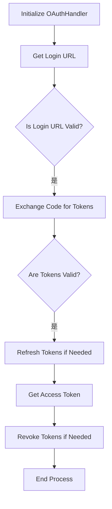
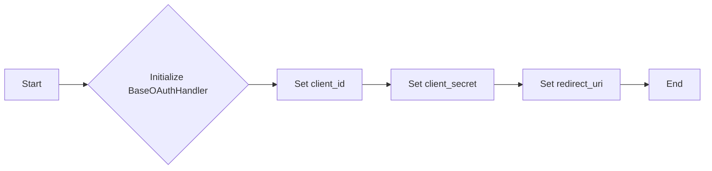
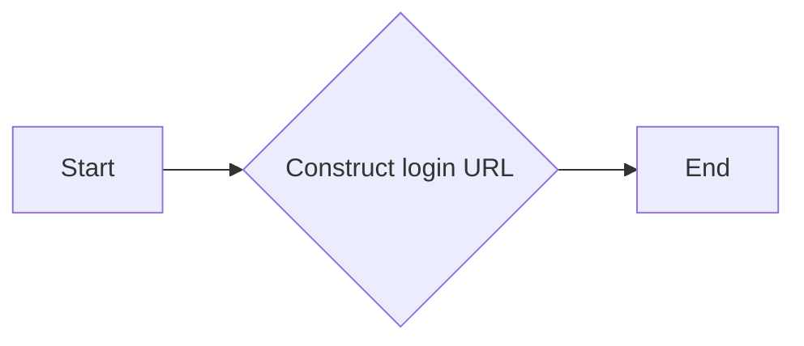
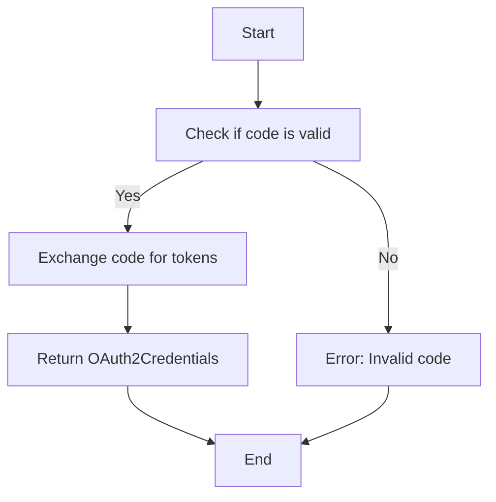
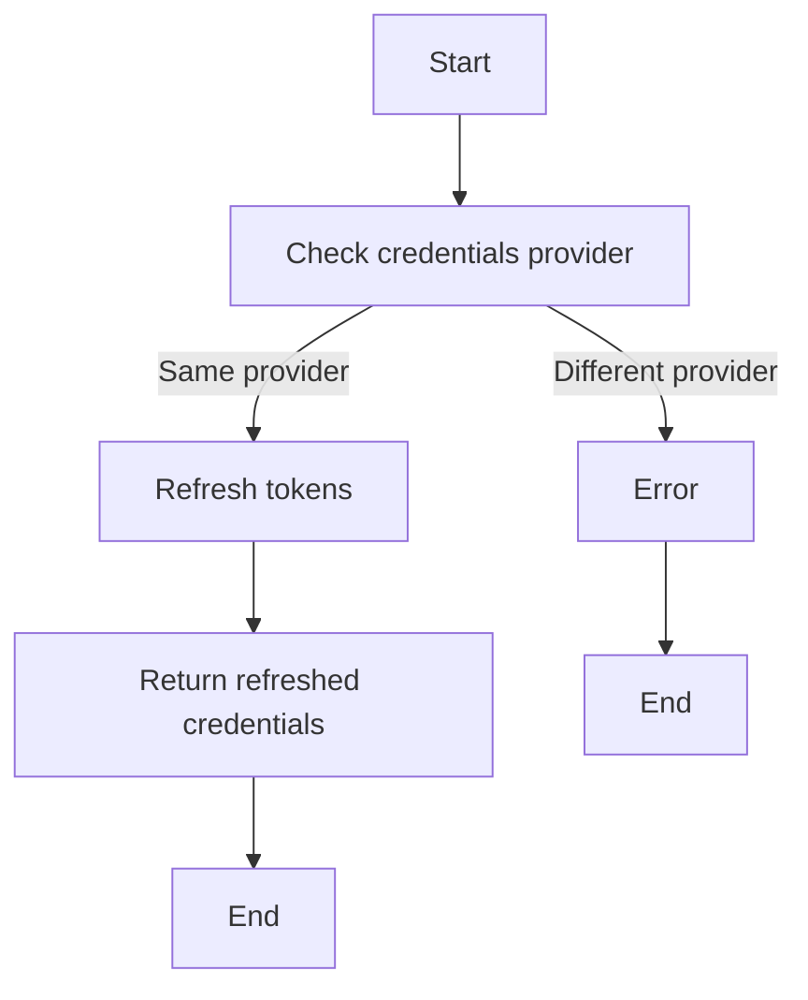
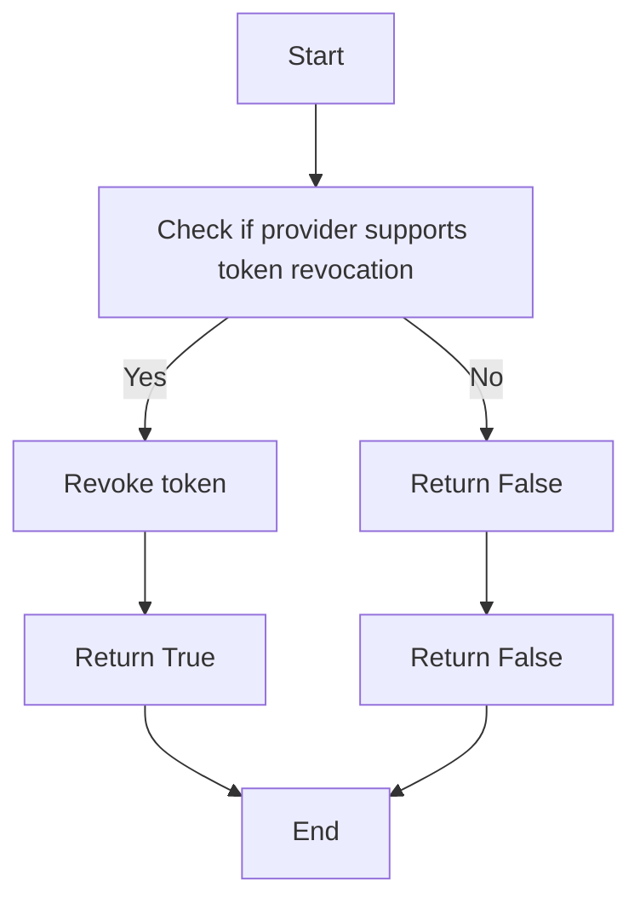
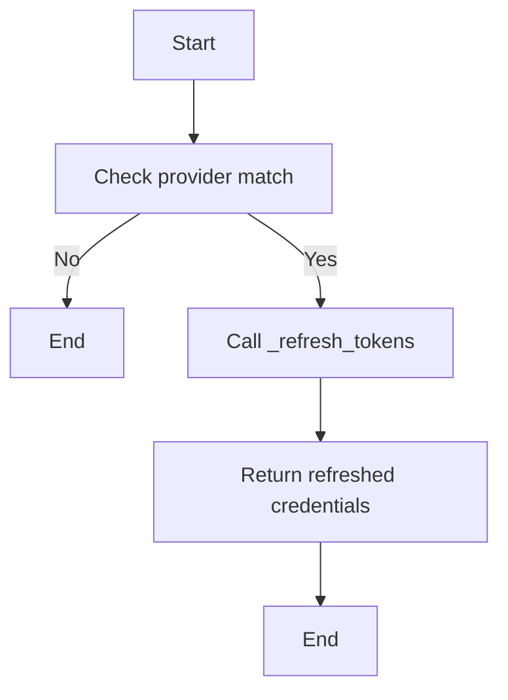
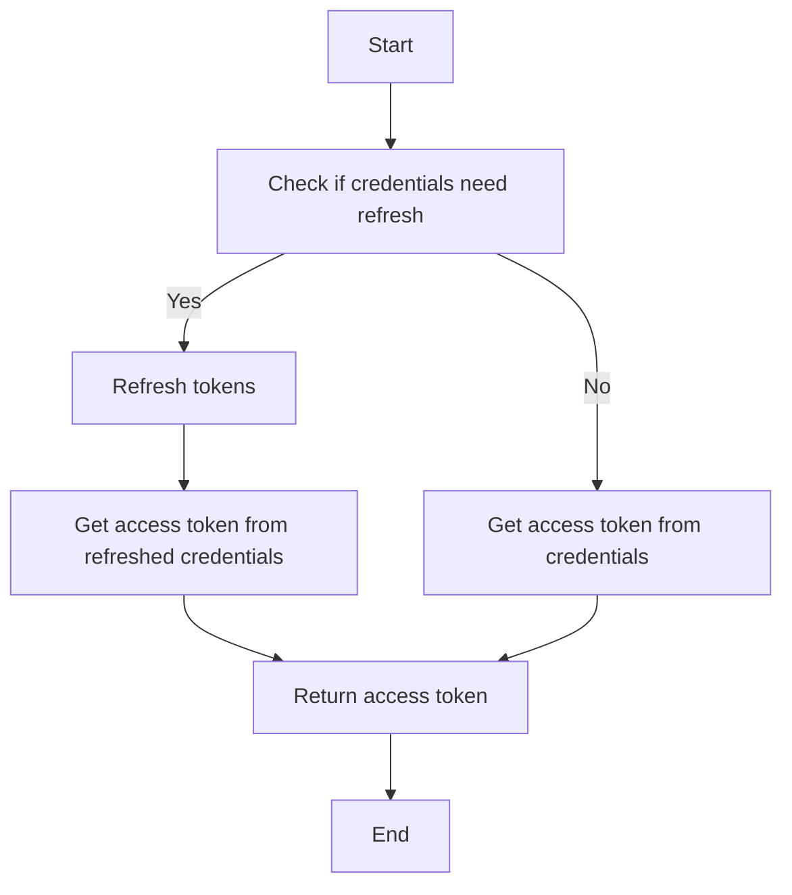
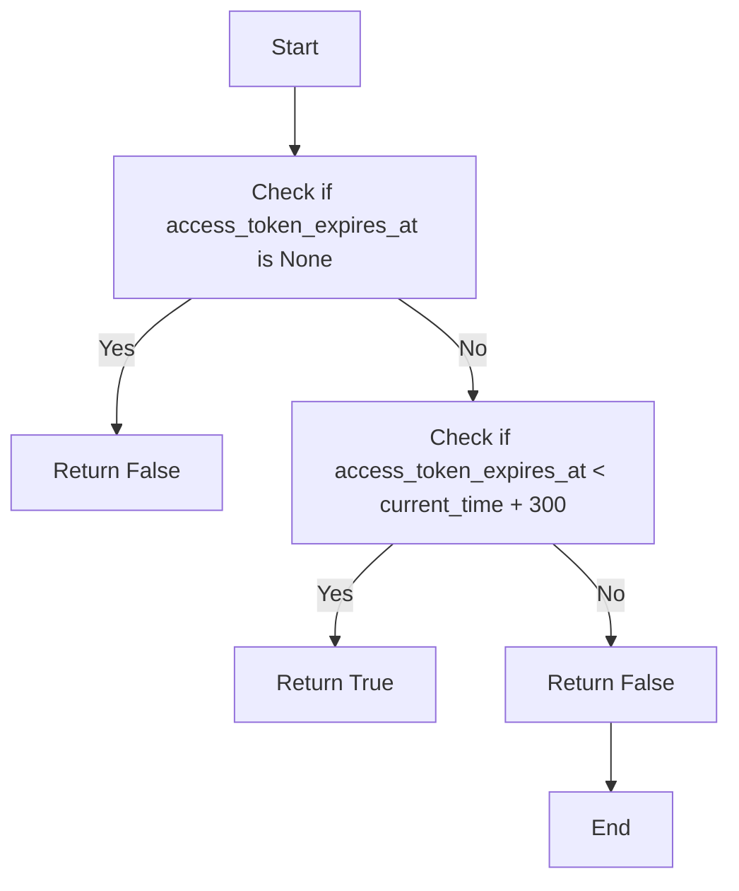
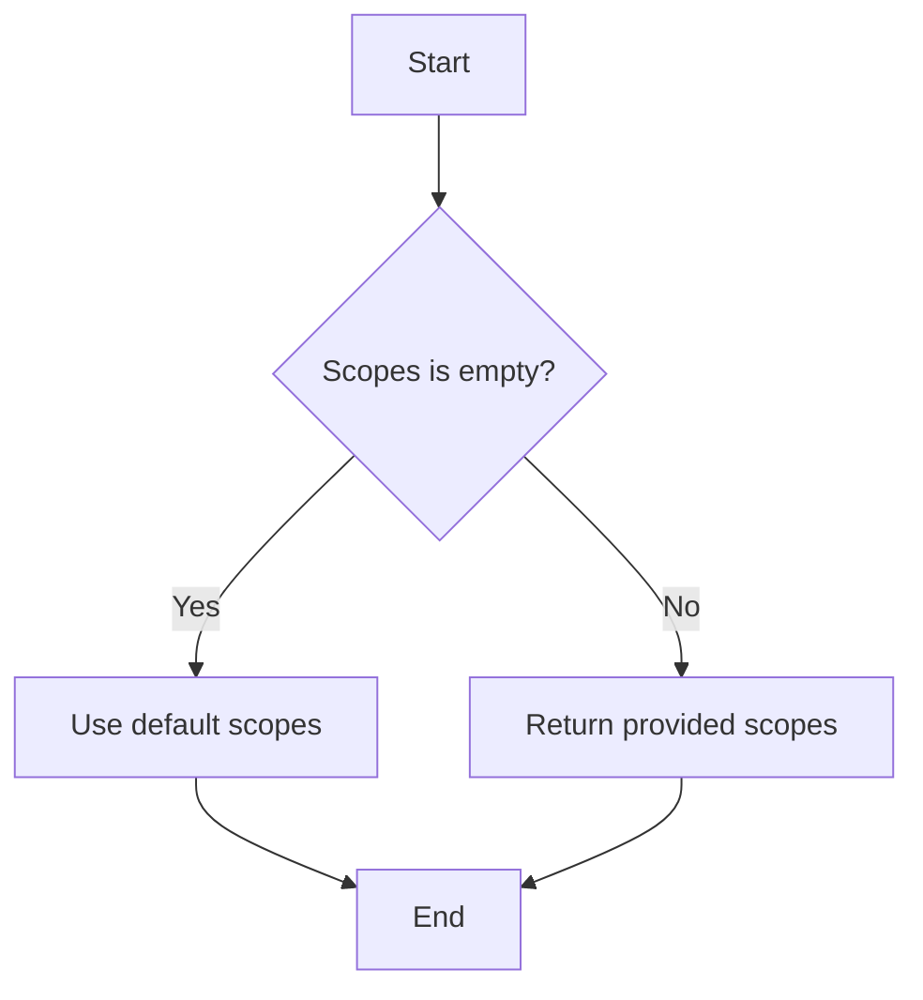

# `.\AutoGPT\autogpt_platform\backend\backend\integrations\oauth\base.py` 详细设计文档

The code defines an abstract base class for OAuth2 handlers, providing a framework for authentication, token exchange, refresh, and revocation of OAuth2 tokens across different providers.

## 整体流程



## 类结构

```
BaseOAuthHandler (抽象基类)
├── OAuth2Credentials (认证凭证类)
└── ProviderName (提供者名称枚举)
```

## 全局变量及字段


### `logger`
    
Logger instance for the module.

类型：`logging.Logger`
    


### `BaseOAuthHandler.PROVIDER_NAME`
    
Class variable representing the provider name for OAuth2 authentication.

类型：`ProviderName | str`
    


### `BaseOAuthHandler.DEFAULT_SCOPES`
    
Class variable representing the default scopes for the OAuth2 provider.

类型：`list[str]`
    


### `OAuth2Credentials.access_token`
    
Field representing the access token for OAuth2 authentication.

类型：`str`
    


### `OAuth2Credentials.access_token_expires_at`
    
Field representing the expiration time of the access token in seconds since the epoch.

类型：`Optional[int]`
    


### `OAuth2Credentials.provider`
    
Field representing the provider name for the OAuth2 credentials.

类型：`str`
    


### `BaseOAuthHandler.BaseOAuthHandler.PROVIDER_NAME`
    
Class variable representing the provider name for OAuth2 authentication.

类型：`ProviderName | str`
    


### `BaseOAuthHandler.BaseOAuthHandler.DEFAULT_SCOPES`
    
Class variable representing the default scopes for the OAuth2 provider.

类型：`list[str]`
    


### `OAuth2Credentials.OAuth2Credentials.access_token`
    
Field representing the access token for OAuth2 authentication.

类型：`str`
    


### `OAuth2Credentials.OAuth2Credentials.access_token_expires_at`
    
Field representing the expiration time of the access token in seconds since the epoch.

类型：`Optional[int]`
    


### `OAuth2Credentials.OAuth2Credentials.provider`
    
Field representing the provider name for the OAuth2 credentials.

类型：`str`
    
    

## 全局函数及方法


### `BaseOAuthHandler.__init__`

Initializes a new instance of the `BaseOAuthHandler` class.

参数：

- `client_id`：`str`，The client ID provided by the OAuth provider.
- `client_secret`：`str`，The client secret provided by the OAuth provider.
- `redirect_uri`：`str`，The URI to which the OAuth provider will redirect after authorization.

返回值：`None`，No return value.

#### 流程图



#### 带注释源码

```python
# --8<-- [start:BaseOAuthHandler2]
@abstractmethod
def __init__(self, client_id: str, client_secret: str, redirect_uri: str): ...
# --8<-- [end:BaseOAuthHandler2]
```


### BaseOAuthHandler.get_login_url

Constructs a login URL that the user can be redirected to.

参数：

- `scopes`：`list[str]`，The list of scopes to request from the OAuth provider.
- `state`：`str`，A state parameter used to maintain state between the OAuth provider and the application.
- `code_challenge`：`Optional[str]`，An optional code challenge used for additional security measures.

返回值：`str`，The login URL constructed for the OAuth provider.

#### 流程图



#### 带注释源码

```python
    def get_login_url(
        self, scopes: list[str], state: str, code_challenge: Optional[str]
    ) -> str:
        """Constructs a login URL that the user can be redirected to"""
        # --8<-- [end:BaseOAuthHandler3]
        ...
```


### `BaseOAuthHandler.exchange_code_for_tokens`

This method exchanges the authorization code obtained from the login process for a set of tokens.

参数：

- `code`：`str`，The authorization code received from the OAuth provider.
- `scopes`：`list[str]`，The list of scopes requested for the OAuth2 credentials.
- `code_verifier`：`Optional[str]`，The code verifier used during the authorization code flow (optional).

返回值：`OAuth2Credentials`，The OAuth2 credentials containing the access token, refresh token, and other relevant information.

#### 流程图



#### 带注释源码

```
async def exchange_code_for_tokens(
    self, code: str, scopes: list[str], code_verifier: Optional[str]
) -> OAuth2Credentials:
    # ... (Assuming the implementation details are here)
    # This is a placeholder for the actual implementation.
    # The actual implementation would involve making a request to the OAuth provider
    # to exchange the authorization code for tokens.
    # For the sake of this example, we'll return a dummy OAuth2Credentials object.
    return OAuth2Credentials(
        provider=self.PROVIDER_NAME,
        access_token="dummy_access_token",
        refresh_token="dummy_refresh_token",
        token_type="Bearer",
        scopes=scopes,
        access_token_expires_at=int(time.time()) + 3600,
    )
```


### BaseOAuthHandler._refresh_tokens

Implements the token refresh mechanism for OAuth2Credentials.

参数：

- `credentials`：`OAuth2Credentials`，The OAuth2Credentials object containing the tokens to be refreshed.

返回值：`OAuth2Credentials`，The refreshed OAuth2Credentials object.

#### 流程图



#### 带注释源码

```python
async def _refresh_tokens(self, credentials: OAuth2Credentials) -> OAuth2Credentials:
    # Check if the credentials provider matches the handler's provider
    if credentials.provider != self.PROVIDER_NAME:
        raise ValueError(
            f"{self.__class__.__name__} can not refresh tokens "
            f"for other provider '{credentials.provider}'"
        )
    
    # Refresh the tokens using the provider's refresh mechanism
    # This is a placeholder for the actual token refresh logic
    # For example, making a request to the provider's refresh endpoint
    # refreshed_credentials = await self.provider.refresh_tokens(credentials)
    
    # For demonstration purposes, we'll just return the original credentials
    # In a real implementation, you would replace this with the actual refreshed credentials
    return credentials
```


### `BaseOAuthHandler.revoke_tokens`

Revokes the given token at the provider, returns False if the provider does not support it.

参数：

- `credentials`：`OAuth2Credentials`，The OAuth2 credentials to revoke the token for.

返回值：`bool`，Indicates whether the token was successfully revoked.

#### 流程图



#### 带注释源码

```python
async def revoke_tokens(self, credentials: OAuth2Credentials) -> bool:
    """Revokes the given token at provider,
    returns False if the provider does not support it"""
    # Check if the provider supports token revocation
    if not self.provider.supports_token_revoke:
        return False

    # Revoke the token
    try:
        await self.provider.revoke_token(credentials.access_token)
        return True
    except Exception as e:
        logger.error(f"Failed to revoke token: {e}")
        return False
```


### BaseOAuthHandler.refresh_tokens

This method refreshes the OAuth2 tokens for a given set of credentials.

参数：

- `credentials`：`OAuth2Credentials`，The OAuth2 credentials to refresh the tokens for.

返回值：`OAuth2Credentials`，The refreshed OAuth2 credentials.

#### 流程图



#### 带注释源码

```python
async def refresh_tokens(self, credentials: OAuth2Credentials) -> OAuth2Credentials:
    if credentials.provider != self.PROVIDER_NAME:
        raise ValueError(
            f"{self.__class__.__name__} can not refresh tokens "
            f"for other provider '{credentials.provider}'"
        )
    return await self._refresh_tokens(credentials)
```


### BaseOAuthHandler.get_access_token

Returns a valid access token, refreshing it first if needed.

参数：

- `credentials`：`OAuth2Credentials`，The OAuth2 credentials object containing the access token and its expiration information.

返回值：`str`，The valid access token.

#### 流程图



#### 带注释源码

```python
async def get_access_token(self, credentials: OAuth2Credentials) -> str:
    """Returns a valid access token, refreshing it first if needed"""
    if self.needs_refresh(credentials):
        credentials = await self.refresh_tokens(credentials)
    return credentials.access_token.get_secret_value()
```


### BaseOAuthHandler.needs_refresh

Indicates whether the given tokens need to be refreshed.

参数：

- `credentials`：`OAuth2Credentials`，The OAuth2 credentials object to check for refresh.

返回值：`bool`，Returns `True` if the tokens need to be refreshed, otherwise `False`.

#### 流程图



#### 带注释源码

```python
def needs_refresh(self, credentials: OAuth2Credentials) -> bool:
    """Indicates whether the given tokens need to be refreshed"""
    return (
        credentials.access_token_expires_at is not None
        and credentials.access_token_expires_at < int(time.time()) + 300
    )
```


### BaseOAuthHandler.handle_default_scopes

Handles the default scopes for the provider.

参数：

- `scopes`：`list[str]`，The list of scopes provided by the user.

返回值：`list[str]`，The list of scopes to be used, which includes the default scopes if none were provided.

#### 流程图



#### 带注释源码

```
def handle_default_scopes(self, scopes: list[str]) -> list[str]:
    """Handles the default scopes for the provider"""
    # If scopes are empty, use the default scopes for the provider
    if not scopes:
        logger.debug(f"Using default scopes for provider {str(self.PROVIDER_NAME)}")
        scopes = self.DEFAULT_SCOPES
    return scopes
``` 


## 关键组件


### 张量索引与惰性加载

张量索引与惰性加载是用于高效处理大型数据集的关键组件，它允许在需要时才计算数据，从而减少内存消耗和提高性能。

### 反量化支持

反量化支持是用于将量化后的模型转换回原始浮点模型的关键组件，它允许模型在量化后仍然能够进行精确的计算。

### 量化策略

量化策略是用于将浮点数模型转换为低精度整数模型的关键组件，它包括选择合适的量化位宽和量化方法，以平衡模型精度和计算效率。


## 问题及建议


### 已知问题

-   **抽象类实现细节缺失**：`BaseOAuthHandler` 是一个抽象类，但它的方法实现细节（如 `...`）没有给出，这可能导致子类实现时需要自行处理逻辑，增加了实现难度和出错的可能性。
-   **全局变量 `logger` 的使用**：全局变量 `logger` 在类内部被使用，这可能导致在多线程环境中出现竞态条件，建议使用类变量或方法参数传递。
-   **异常处理**：代码中存在 `raise ValueError`，但没有明确指出异常的具体处理方式，建议增加异常处理逻辑，确保程序的健壮性。
-   **异步方法调用**：代码中使用了 `async` 关键字，但没有明确指出哪些方法需要异步执行，这可能导致性能问题，建议明确标注异步方法。

### 优化建议

-   **实现抽象方法**：为 `BaseOAuthHandler` 中的抽象方法提供具体的实现，或者要求子类必须实现这些方法，以确保所有 OAuth 处理器具有相同的行为。
-   **使用类变量或方法参数**：将 `logger` 作为类变量或方法参数传递，避免全局变量的使用，减少潜在的多线程问题。
-   **增加异常处理**：在调用 `raise ValueError` 的地方，增加具体的异常处理逻辑，例如记录错误日志或返回错误信息。
-   **明确异步方法**：明确标注哪些方法需要异步执行，并在文档中说明原因，以便开发者了解异步调用的必要性。
-   **代码注释**：在代码中添加必要的注释，解释复杂逻辑或重要的实现细节，提高代码的可读性和可维护性。
-   **单元测试**：为 `BaseOAuthHandler` 及其子类编写单元测试，确保代码的正确性和稳定性。
-   **文档化**：为代码和类提供详细的文档说明，包括类的设计目的、方法的功能和参数说明等。


## 其它


### 设计目标与约束

- 设计目标：
  - 提供一个抽象基类，用于处理不同OAuth2提供者的认证流程。
  - 确保所有子类都实现必要的认证方法，如获取登录URL、交换代码获取令牌、刷新令牌和撤销令牌。
  - 提供一个统一的接口，以便其他组件可以轻松地与OAuth2认证流程交互。
- 约束：
  - 所有子类必须实现抽象方法。
  - 认证流程必须符合OAuth2规范。
  - 认证令牌的刷新和撤销必须异步执行。

### 错误处理与异常设计

- 错误处理：
  - 如果令牌刷新失败，将抛出`ValueError`。
  - 如果尝试为非本提供者刷新令牌，将抛出`ValueError`。
  - 如果提供者不支持撤销令牌，将返回`False`。
- 异常设计：
  - 定义自定义异常类，如`OAuth2Error`，以处理特定的OAuth2错误情况。

### 数据流与状态机

- 数据流：
  - 用户通过登录URL开始认证流程。
  - 用户授权后，提供者返回授权代码。
  - 应用程序使用授权代码交换令牌。
  - 应用程序使用令牌进行API调用。
  - 应用程序根据需要刷新令牌。
- 状态机：
  - 认证流程包括以下状态：未认证、认证中、已认证、令牌刷新中、令牌撤销中。

### 外部依赖与接口契约

- 外部依赖：
  - `logging`: 用于记录日志。
  - `time`: 用于处理时间相关操作。
  - `abc`: 用于定义抽象基类。
  - `typing`: 用于类型注解。
  - `backend.data.model`: 包含`OAuth2Credentials`类。
  - `backend.integrations.providers`: 包含`ProviderName`枚举。
- 接口契约：
  - `BaseOAuthHandler`类定义了所有子类必须实现的接口。
  - 子类必须遵循OAuth2规范来实现认证流程。
  - 子类必须提供默认作用域列表。


    