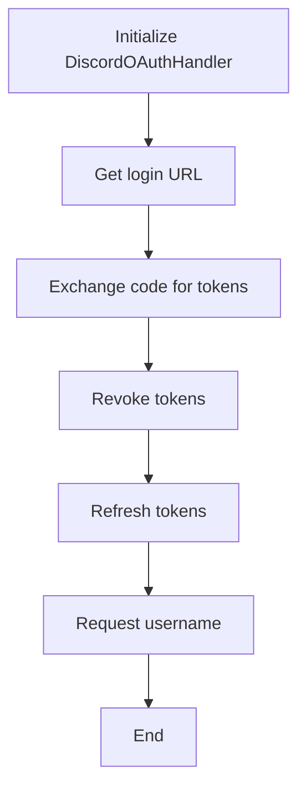
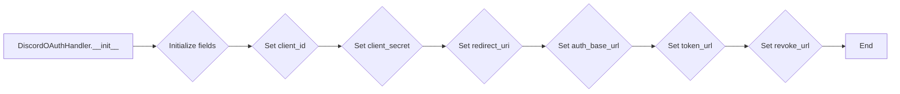
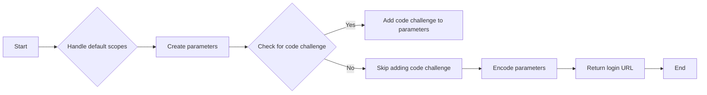
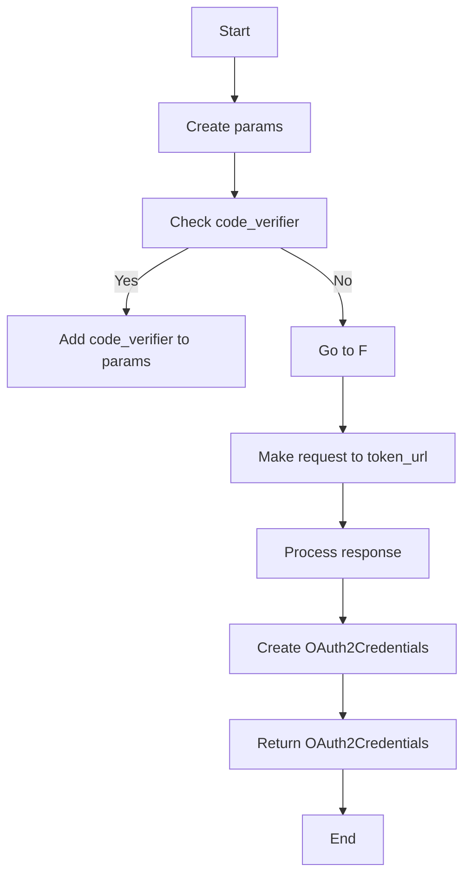
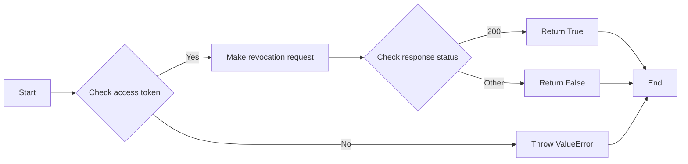
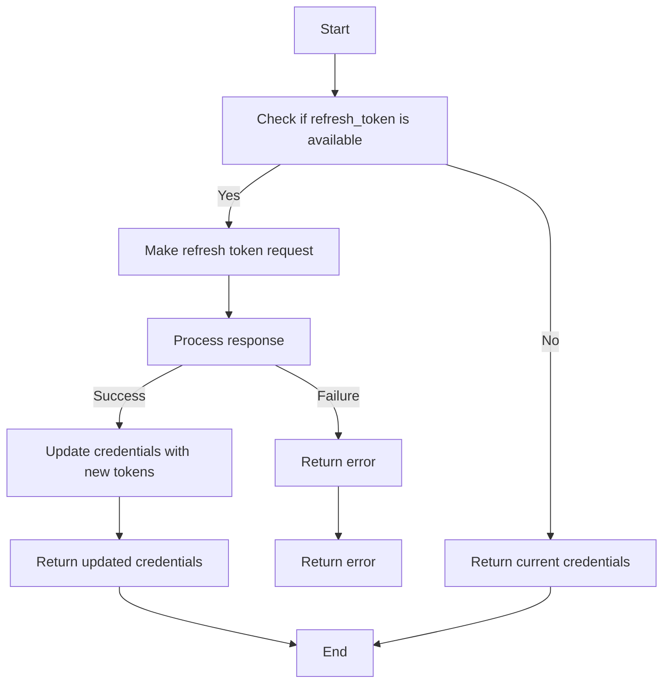
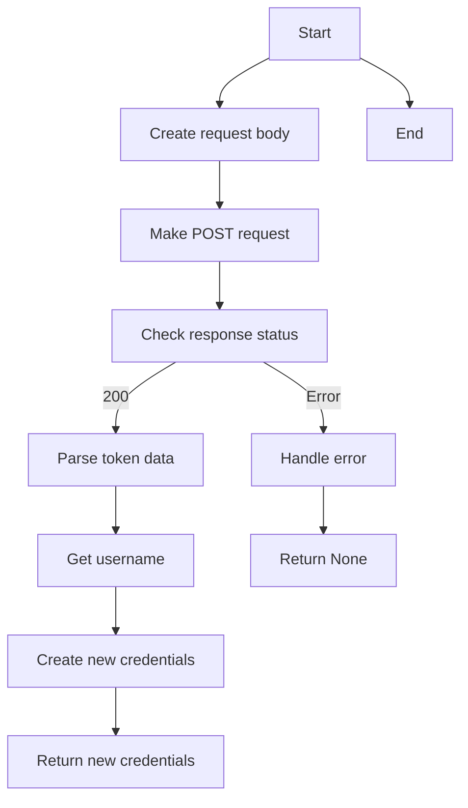

# `.\AutoGPT\autogpt_platform\backend\backend\integrations\oauth\discord.py` 详细设计文档

The code implements an OAuth2 handler for Discord, providing functionality to generate login URLs, exchange authorization codes for tokens, revoke tokens, refresh tokens, and fetch user information.

## 整体流程



## 类结构

```
DiscordOAuthHandler (类)
├── BaseOAuthHandler (基类)
```

## 全局变量及字段


### `PROVIDER_NAME`
    
The provider name constant for Discord OAuth2 handler.

类型：`ProviderName`
    


### `DEFAULT_SCOPES`
    
The default scopes for Discord OAuth2 handler.

类型：`list[str]`
    


### `expires_in`
    
The number of seconds until the access token expires, if provided by the token response.

类型：`Optional[int]`
    


### `DiscordOAuthHandler.client_id`
    
The client ID for Discord OAuth2 authentication.

类型：`str`
    


### `DiscordOAuthHandler.client_secret`
    
The client secret for Discord OAuth2 authentication.

类型：`str`
    


### `DiscordOAuthHandler.redirect_uri`
    
The redirect URI where Discord will send the authorization code.

类型：`str`
    


### `DiscordOAuthHandler.auth_base_url`
    
The base URL for Discord OAuth2 authorization endpoint.

类型：`str`
    


### `DiscordOAuthHandler.token_url`
    
The URL for Discord OAuth2 token endpoint.

类型：`str`
    


### `DiscordOAuthHandler.revoke_url`
    
The URL for Discord OAuth2 token revocation endpoint.

类型：`str`
    
    

## 全局函数及方法


### DiscordOAuthHandler.__init__

This method initializes a new instance of the DiscordOAuthHandler class, setting up the necessary credentials and URLs for Discord OAuth2 authentication.

参数：

- `client_id`：`str`，The client ID provided by Discord for the OAuth2 application.
- `client_secret`：`str`，The client secret provided by Discord for the OAuth2 application.
- `redirect_uri`：`str`，The redirect URI where Discord will send the authorization code after the user authorizes the application.

返回值：`None`，This method does not return any value.

#### 流程图



#### 带注释源码

```python
def __init__(self, client_id: str, client_secret: str, redirect_uri: str):
    # Initialize fields
    self.client_id = client_id
    self.client_secret = client_secret
    self.redirect_uri = redirect_uri
    # Set base URLs for Discord OAuth2
    self.auth_base_url = "https://discord.com/oauth2/authorize"
    self.token_url = "https://discord.com/api/oauth2/token"
    self.revoke_url = "https://discord.com/api/oauth2/token/revoke"
```


### DiscordOAuthHandler.get_login_url

This method generates a login URL for Discord OAuth2 authentication.

参数：

- `scopes`：`list[str]`，A list of scopes to request from Discord.
- `state`：`str`，A state parameter used to prevent CSRF attacks.
- `code_challenge`：`Optional[str]`，An optional code challenge for PKCE authentication.

返回值：`str`，The login URL for Discord OAuth2 authentication.

#### 流程图



#### 带注释源码

```python
def get_login_url(self, scopes: list[str], state: str, code_challenge: Optional[str] = None) -> str:
    # Handle default scopes
    scopes = self.handle_default_scopes(scopes)

    params = {
        "client_id": self.client_id,
        "redirect_uri": self.redirect_uri,
        "response_type": "code",
        "scope": " ".join(scopes),
        "state": state,
    }

    # Discord supports PKCE
    if code_challenge:
        params["code_challenge"] = code_challenge
        params["code_challenge_method"] = "S256"

    return f"{self.auth_base_url}?{urlencode(params)}"
```


### `DiscordOAuthHandler.exchange_code_for_tokens`

This method exchanges an authorization code for OAuth2 tokens provided by Discord.

参数：

- `code`：`str`，The authorization code received from Discord.
- `scopes`：`list[str]`，The list of scopes to request.
- `code_verifier`：`Optional[str]`，The code verifier for PKCE if provided.

返回值：`OAuth2Credentials`，The OAuth2 credentials obtained from the exchange.

#### 流程图



#### 带注释源码

```python
async def exchange_code_for_tokens(
    self, code: str, scopes: list[str], code_verifier: Optional[str]
) -> OAuth2Credentials:
    params = {
        "code": code,
        "redirect_uri": self.redirect_uri,
        "grant_type": "authorization_code",
    }

    # Include PKCE verifier if provided
    if code_verifier:
        params["code_verifier"] = code_verifier

    return await self._request_tokens(params)
```


### `DiscordOAuthHandler.revoke_tokens`

This method revokes Discord OAuth2 tokens for a given set of credentials.

参数：

- `credentials`：`OAuth2Credentials`，The OAuth2 credentials containing the access token to be revoked.

返回值：`bool`，Indicates whether the token revocation was successful.

#### 流程图



#### 带注释源码

```python
async def revoke_tokens(self, credentials: OAuth2Credentials) -> bool:
    if not credentials.access_token:
        raise ValueError("No access token to revoke")

    # Discord requires client authentication for token revocation
    data = {
        "token": credentials.access_token.get_secret_value(),
        "token_type_hint": "access_token",
    }

    headers = {
        "Content-Type": "application/x-www-form-urlencoded",
    }

    response = await Requests().post(
        url=self.revoke_url,
        data=data,
        headers=headers,
        auth=(self.client_id, self.client_secret),
    )

    # Discord returns 200 OK for successful revocation
    return response.status == 200
```


### `_refresh_tokens`

This method refreshes the OAuth2 tokens for a Discord user using the provided refresh token.

参数：

- `credentials`：`OAuth2Credentials`，The OAuth2 credentials object containing the refresh token to be used for refreshing the tokens.

返回值：`OAuth2Credentials`，The updated OAuth2 credentials object with the new access token and refresh token if the refresh was successful.

#### 流程图



#### 带注释源码

```python
async def _refresh_tokens(self, credentials: OAuth2Credentials) -> OAuth2Credentials:
    if not credentials.refresh_token:
        return credentials

    return await self._request_tokens(
        {
            "refresh_token": credentials.refresh_token.get_secret_value(),
            "grant_type": "refresh_token",
        },
        current_credentials=credentials,
    )
```


### `_request_tokens`

This method is responsible for making a POST request to the Discord API to exchange authorization codes or refresh tokens for OAuth2 tokens.

参数：

- `params`：`dict[str, str]`，A dictionary containing the parameters required for the token request, such as `code`, `redirect_uri`, `grant_type`, and `refresh_token`.
- `current_credentials`：`Optional[OAuth2Credentials]`，The current OAuth2 credentials object, which may be used to retrieve additional information like the username.

返回值：`OAuth2Credentials`，An OAuth2Credentials object containing the new access token, refresh token, and other relevant information.

#### 流程图



#### 带注释源码

```python
async def _request_tokens(
    self,
    params: dict[str, str],
    current_credentials: Optional[OAuth2Credentials] = None,
) -> OAuth2Credentials:
    request_body = {
        "client_id": self.client_id,
        "client_secret": self.client_secret,
        **params,
    }

    headers = {
        "Content-Type": "application/x-www-form-urlencoded",
    }

    response = await Requests().post(
        self.token_url, data=request_body, headers=headers
    )
    token_data: dict = response.json()

    # Get username if this is a new token request
    username = None
    if "access_token" in token_data:
        username = await self._request_username(token_data["access_token"])

    now = int(time.time())
    new_credentials = OAuth2Credentials(
        provider=self.PROVIDER_NAME,
        title=current_credentials.title if current_credentials else None,
        username=username,
        access_token=token_data["access_token"],
        scopes=token_data.get("scope", "").split()
        or (current_credentials.scopes if current_credentials else []),
        refresh_token=token_data.get("refresh_token"),
        # Discord tokens expire after expires_in seconds (typically 7 days)
        access_token_expires_at=(
            now + expires_in
            if (expires_in := token_data.get("expires_in", None))
            else None
        ),
        # Discord doesn't provide separate refresh token expiration
        refresh_token_expires_at=None,
    )

    if current_credentials:
        new_credentials.id = current_credentials.id

    return new_credentials
``` 


### `_request_username`

Fetch the username using the Discord OAuth2 @me endpoint.

参数：

- `access_token`：`str`，The OAuth2 access token used to authenticate the request to the Discord API.

返回值：`str | None`，The username of the user associated with the access token, or `None` if the request fails or the user is not found.

#### 流程图

```mermaid
graph TD
    A[Start] --> B[Make GET request to "https://discord.com/api/oauth2/@me"]
    B --> C{Check response status}
    C -- 200 OK --> D[Parse JSON response]
    C -- Not 200 OK --> E[Return None]
    D --> F[Extract "username" from response]
    F --> G[Return username]
    G --> H[End]
```

#### 带注释源码

```python
async def _request_username(self, access_token: str) -> str | None:
    """
    Fetch the username using the Discord OAuth2 @me endpoint.
    """
    url = "https://discord.com/api/oauth2/@me"
    headers = {
        "Authorization": f"Bearer {access_token}",
    }

    response = await Requests().get(url, headers=headers)

    if not response.ok:
        return None

    # Get user info from the response
    data = response.json()
    user_info = data.get("user", {})

    # Return username (without discriminator)
    return user_info.get("username")
```


## 关键组件


### DiscordOAuthHandler

Discord OAuth2 handler implementation.

### client_id

str
Client ID for Discord OAuth2.

### client_secret

str
Client Secret for Discord OAuth2.

### redirect_uri

str
Redirect URI for Discord OAuth2.

### auth_base_url

str
Base URL for Discord OAuth2 authorization.

### token_url

str
URL for Discord OAuth2 token exchange.

### revoke_url

str
URL for Discord OAuth2 token revocation.

### PROVIDER_NAME

ProviderName.DISCORD
Provider name for Discord OAuth2.

### DEFAULT_SCOPES

list[str]
Default scopes for Discord OAuth2.

### get_login_url

str, list[str], str, Optional[str]
Generates the login URL for Discord OAuth2.

### exchange_code_for_tokens

OAuth2Credentials, list[str], Optional[str]
Exchanges authorization code for OAuth2 credentials.

### revoke_tokens

bool, OAuth2Credentials
Revokes OAuth2 tokens.

### _refresh_tokens

OAuth2Credentials
Refreshes OAuth2 tokens.

### _request_tokens

OAuth2Credentials, dict[str, str], Optional[OAuth2Credentials]
Requests new tokens from Discord OAuth2.

### _request_username

str | None, str
Requests the username from Discord OAuth2 using an access token.


## 问题及建议


### 已知问题

-   **全局变量未定义**：代码中使用了 `expires_in` 变量，但没有在代码中定义或初始化它。这可能导致在尝试获取新的 `access_token_expires_at` 时引发错误。
-   **异常处理不足**：`_request_username` 方法在请求失败时返回 `None`，但没有抛出异常或处理可能的错误情况。这可能导致调用者无法得知请求失败的原因。
-   **代码重复**：`_request_tokens` 方法中，对于 `OAuth2Credentials` 对象的创建和更新逻辑存在重复代码。可以考虑将这些逻辑提取到一个单独的方法中，以减少代码重复并提高可维护性。

### 优化建议

-   **定义全局变量**：在代码顶部定义 `expires_in` 变量，并确保它在调用 `_request_tokens` 方法时被正确设置。
-   **增强异常处理**：在 `_request_username` 方法中添加异常处理，并在捕获异常时抛出适当的异常，以便调用者可以处理这些异常。
-   **减少代码重复**：创建一个单独的方法来处理 `OAuth2Credentials` 对象的创建和更新，这样可以在 `_request_tokens` 方法中复用这部分逻辑。
-   **代码风格一致性**：检查代码风格一致性，例如缩进、命名约定等，以提高代码的可读性和可维护性。
-   **单元测试**：为代码编写单元测试，以确保各个功能按预期工作，并帮助在未来的代码更改中保持代码质量。
-   **文档注释**：为代码添加必要的文档注释，以帮助其他开发者理解代码的功能和目的。


## 其它


### 设计目标与约束

- 设计目标：
  - 实现一个Discord OAuth2认证处理程序，支持获取、刷新和撤销令牌。
  - 提供一个统一的接口来处理Discord OAuth2认证流程。
  - 确保令牌的安全性和有效性。
- 约束：
  - 必须遵循Discord OAuth2规范。
  - 必须处理令牌过期和刷新。
  - 必须支持PKCE（Proof Key for Code Exchange）。

### 错误处理与异常设计

- 错误处理：
  - 对于无效的令牌、错误的请求或响应，抛出相应的异常。
  - 对于网络错误，重试请求或抛出异常。
- 异常设计：
  - `ValueError`：当尝试撤销不存在的访问令牌时。
  - `requests.exceptions.RequestException`：当网络请求失败时。

### 数据流与状态机

- 数据流：
  - 用户发起认证请求，获取授权码。
  - 应用程序使用授权码交换令牌。
  - 应用程序使用访问令牌获取用户信息。
  - 应用程序使用刷新令牌刷新访问令牌。
  - 应用程序撤销访问令牌。
- 状态机：
  - 初始状态：未认证。
  - 认证状态：已认证。
  - 令牌过期状态：需要刷新令牌。

### 外部依赖与接口契约

- 外部依赖：
  - `urllib.parse.urlencode`：用于编码URL参数。
  - `time`：用于处理时间。
  - `typing`：用于类型注解。
  - `backend.data.model.OAuth2Credentials`：用于存储OAuth2凭证。
  - `backend.integrations.providers.ProviderName`：用于指定提供者名称。
  - `backend.util.request.Requests`：用于发送HTTP请求。
- 接口契约：
  - `BaseOAuthHandler`：提供OAuth2处理程序的基本功能。
  - `OAuth2Credentials`：定义OAuth2凭证的结构。
  - `ProviderName`：定义提供者名称的枚举。
  - `Requests`：定义HTTP请求的接口。


    