# `.\AutoGPT\autogpt_platform\backend\backend\integrations\oauth\github.py` 详细设计文档

The code provides an OAuth2 handler for GitHub, enabling authentication, token exchange, and token revocation processes.

## 整体流程

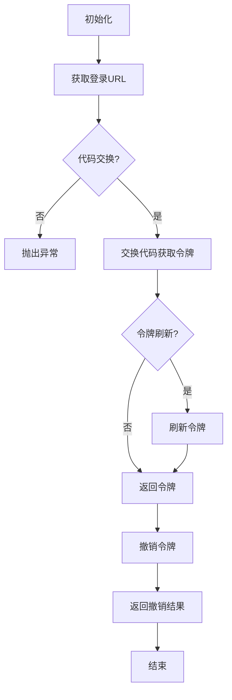

## 类结构

```
BaseOAuthHandler (基类)
├── GitHubOAuthHandler (GitHub OAuth处理器)
```

## 全局变量及字段


### `ProviderName`
    
Module containing constants for different OAuth providers.

类型：`module`
    


### `OAuth2Credentials`
    
Class representing OAuth2 credentials.

类型：`class`
    


### `Requests`
    
Class for making HTTP requests.

类型：`class`
    


### `time`
    
Module for time-related functions.

类型：`module`
    


### `urlencode`
    
Function to encode a dictionary for use in a URL query string.

类型：`function`
    


### `{'name': 'BaseOAuthHandler', 'fields': ['PROVIDER_NAME'], 'methods': ['__init__', 'get_login_url', 'exchange_code_for_tokens', 'revoke_tokens', '_refresh_tokens', '_request_tokens', '_request_username']}.PROVIDER_NAME`
    
Constant representing the provider name for the base OAuth handler class.

类型：`constant`
    


### `{'name': 'GitHubOAuthHandler', 'fields': ['client_id', 'client_secret', 'redirect_uri', 'auth_base_url', 'token_url', 'revoke_url'], 'methods': ['__init__', 'get_login_url', 'exchange_code_for_tokens', 'revoke_tokens', '_refresh_tokens', '_request_tokens', '_request_username']}.client_id`
    
Client ID for the GitHub OAuth application.

类型：`str`
    


### `{'name': 'GitHubOAuthHandler', 'fields': ['client_id', 'client_secret', 'redirect_uri', 'auth_base_url', 'token_url', 'revoke_url'], 'methods': ['__init__', 'get_login_url', 'exchange_code_for_tokens', 'revoke_tokens', '_refresh_tokens', '_request_tokens', '_request_username']}.client_secret`
    
Client secret for the GitHub OAuth application.

类型：`str`
    


### `{'name': 'GitHubOAuthHandler', 'fields': ['client_id', 'client_secret', 'redirect_uri', 'auth_base_url', 'token_url', 'revoke_url'], 'methods': ['__init__', 'get_login_url', 'exchange_code_for_tokens', 'revoke_tokens', '_refresh_tokens', '_request_tokens', '_request_username']}.redirect_uri`
    
Redirect URI for the GitHub OAuth application.

类型：`str`
    


### `{'name': 'GitHubOAuthHandler', 'fields': ['client_id', 'client_secret', 'redirect_uri', 'auth_base_url', 'token_url', 'revoke_url'], 'methods': ['__init__', 'get_login_url', 'exchange_code_for_tokens', 'revoke_tokens', '_refresh_tokens', '_request_tokens', '_request_username']}.auth_base_url`
    
Base URL for GitHub OAuth authorization endpoint.

类型：`str`
    


### `{'name': 'GitHubOAuthHandler', 'fields': ['client_id', 'client_secret', 'redirect_uri', 'auth_base_url', 'token_url', 'revoke_url'], 'methods': ['__init__', 'get_login_url', 'exchange_code_for_tokens', 'revoke_tokens', '_refresh_tokens', '_request_tokens', '_request_username']}.token_url`
    
URL for GitHub OAuth token exchange endpoint.

类型：`str`
    


### `{'name': 'GitHubOAuthHandler', 'fields': ['client_id', 'client_secret', 'redirect_uri', 'auth_base_url', 'token_url', 'revoke_url'], 'methods': ['__init__', 'get_login_url', 'exchange_code_for_tokens', 'revoke_tokens', '_refresh_tokens', '_request_tokens', '_request_username']}.revoke_url`
    
URL for GitHub OAuth token revocation endpoint.

类型：`str`
    


### `GitHubOAuthHandler.client_id`
    
Client ID for the GitHub OAuth application.

类型：`str`
    


### `GitHubOAuthHandler.client_secret`
    
Client secret for the GitHub OAuth application.

类型：`str`
    


### `GitHubOAuthHandler.redirect_uri`
    
Redirect URI for the GitHub OAuth application.

类型：`str`
    


### `GitHubOAuthHandler.auth_base_url`
    
Base URL for GitHub OAuth authorization endpoint.

类型：`str`
    


### `GitHubOAuthHandler.token_url`
    
URL for GitHub OAuth token exchange endpoint.

类型：`str`
    


### `GitHubOAuthHandler.revoke_url`
    
URL for GitHub OAuth token revocation endpoint.

类型：`str`
    
    

## 全局函数及方法


### `Requests().delete`

该函数用于向指定的URL发送DELETE请求，并处理响应。

参数：

- `url`：`str`，请求的URL。
- `auth`：`tuple`，用于认证的元组，通常包含用户名和密码。
- `headers`：`dict`，请求头信息。
- `json`：`dict`，请求体中的JSON数据。

返回值：`None`，表示请求成功。

#### 流程图

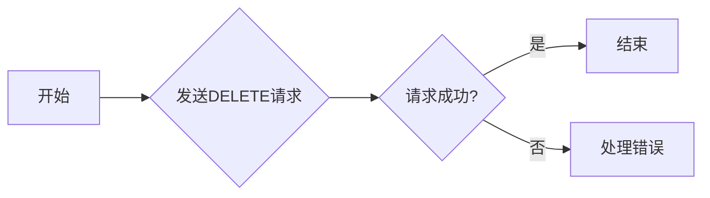

#### 带注释源码

```python
await Requests().delete(
    url=self.revoke_url.format(client_id=self.client_id),
    auth=(self.client_id, self.client_secret),
    headers=headers,
    json={"access_token": credentials.access_token.get_secret_value()},
)
```


### `Requests().post`

该函数用于向指定的URL发送POST请求，并返回响应数据。

参数：

- `url`：`str`，请求的URL地址。
- `data`：`dict`，请求的数据，以表单形式发送。
- `headers`：`dict`，请求的头部信息。

返回值：`dict`，响应数据。

#### 流程图

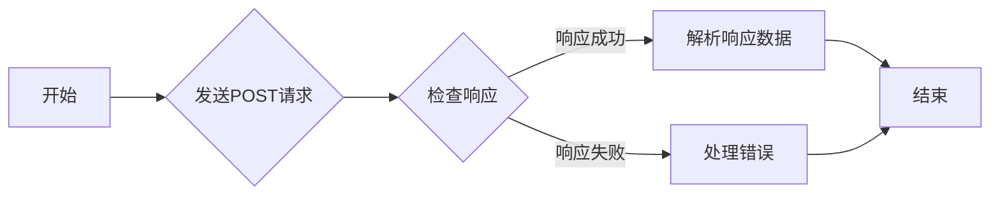

#### 带注释源码

```python
response = await Requests().post(
    self.token_url, data=request_body, headers=headers
)
token_data: dict = response.json()
```


### `Requests().get`

该函数用于发送一个HTTP GET请求到指定的URL，并返回响应。

参数：

- `url`：`str`，请求的URL。
- `headers`：`dict`，可选的HTTP头部信息。
- `params`：`dict`，可选的查询参数。
- `auth`：`tuple`，可选的认证信息，格式为`(username, password)`。
- `json`：`dict`，可选的JSON数据，将作为请求体发送。

返回值：`Response`，一个包含响应数据的对象。

#### 流程图

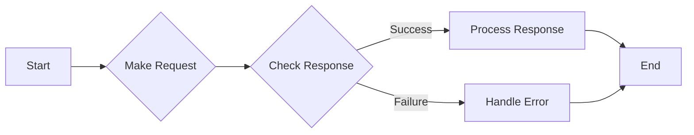

#### 带注释源码

```python
response = await Requests().get(
    url=self.revoke_url.format(client_id=self.client_id),
    auth=(self.client_id, self.client_secret),
    headers=headers,
    json={"access_token": credentials.access_token.get_secret_value()},
)
```

在这个例子中，`Requests().get`用于向GitHub API发送一个删除请求，以撤销访问令牌。参数包括请求的URL（`self.revoke_url.format(client_id=self.client_id)`），认证信息（`self.client_id, self.client_secret`），HTTP头部信息（`headers`），以及请求体（`{"access_token": credentials.access_token.get_secret_value()}`）。响应对象`response`被用于后续处理。


### `urlencode`

`urlencode` 是一个全局函数，用于将字典或类似可迭代对象转换为 URL 编码的查询字符串。

参数：

- `params`：`dict[str, str]`，一个字典，其键和值将被转换为 URL 编码的查询字符串。

返回值：`str`，一个 URL 编码的查询字符串。

#### 流程图

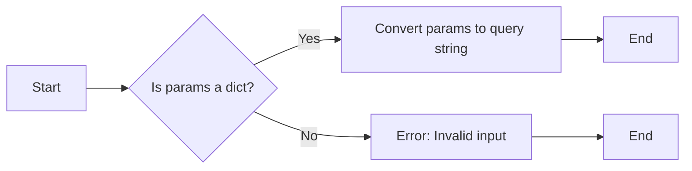

#### 带注释源码

```python
from urllib.parse import urlencode

def urlencode(params: dict[str, str]) -> str:
    # Convert the dictionary to a URL encoded query string
    return urlencode(params)
```


### time.time()

获取当前时间的时间戳。

参数：

- 无

返回值：`int`，表示自1970年1月1日以来的秒数。

#### 流程图

```mermaid
graph TD
    A[Start] --> B{Is time.time() called?}
    B -- Yes --> C[Get current timestamp]
    C --> D[End]
    B -- No --> D
```

#### 带注释源码

```
import time

def time_time():
    """
    Get the current time as a timestamp.
    """
    return int(time.time())
```


### `GitHubOAuthHandler.get_login_url`

获取用于启动OAuth流程的登录URL。

参数：

- `scopes`：`list[str]`，授权请求所需的权限范围列表。
- `state`：`str`，用于防止CSRF攻击的状态值。
- `code_challenge`：`Optional[str]`，用于OAuth 2.0代码挑战，可选。

返回值：`str`，返回一个包含所有参数的登录URL。

#### 流程图

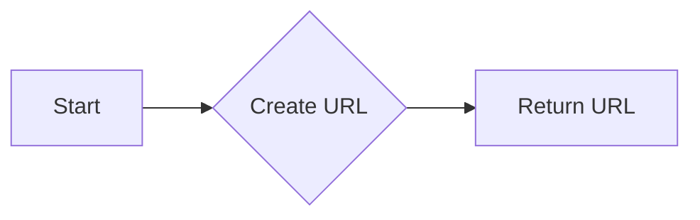

#### 带注释源码

```python
def get_login_url(
    self, scopes: list[str], state: str, code_challenge: Optional[str]
) -> str:
    params = {
        "client_id": self.client_id,
        "redirect_uri": self.redirect_uri,
        "scope": " ".join(scopes),
        "state": state,
    }
    return f"{self.auth_base_url}?{urlencode(params)}"
```


### `GitHubOAuthHandler.exchange_code_for_tokens`

交换授权码以获取访问令牌和刷新令牌。

参数：

- `code`：`str`，从GitHub OAuth流程中获得的授权码。
- `scopes`：`list[str]`，授权请求所需的权限范围列表。
- `code_verifier`：`Optional[str]`，用于OAuth 2.0代码挑战，可选。

返回值：`OAuth2Credentials`，包含访问令牌、刷新令牌和其他相关信息的对象。

#### 流程图

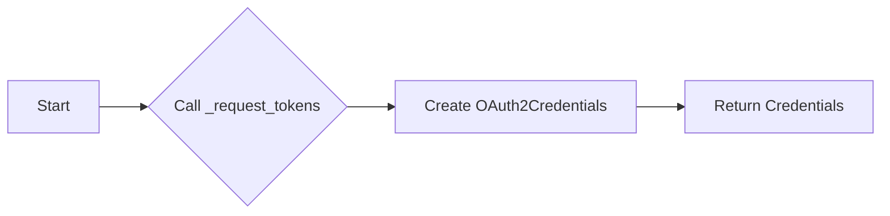

#### 带注释源码

```python
async def exchange_code_for_tokens(
    self, code: str, scopes: list[str], code_verifier: Optional[str]
) -> OAuth2Credentials:
    return await self._request_tokens(
        {"code": code, "redirect_uri": self.redirect_uri}
    )
```


### `GitHubOAuthHandler.revoke_tokens`

撤销访问令牌。

参数：

- `credentials`：`OAuth2Credentials`，包含要撤销的访问令牌的OAuth2Credentials对象。

返回值：`bool`，如果成功撤销令牌，则返回True，否则返回False。

#### 流程图

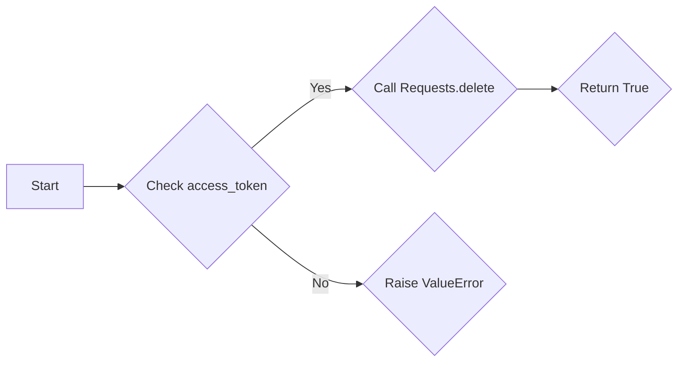

#### 带注释源码

```python
async def revoke_tokens(self, credentials: OAuth2Credentials) -> bool:
    if not credentials.access_token:
        raise ValueError("No access token to revoke")

    headers = {
        "Accept": "application/vnd.github+json",
        "X-GitHub-Api-Version": "2022-11-28",
    }

    await Requests().delete(
        url=self.revoke_url.format(client_id=self.client_id),
        auth=(self.client_id, self.client_secret),
        headers=headers,
        json={"access_token": credentials.access_token.get_secret_value()},
    )
    return True
```


### `GitHubOAuthHandler._refresh_tokens`

刷新访问令牌。

参数：

- `credentials`：`OAuth2Credentials`，包含要刷新的访问令牌的OAuth2Credentials对象。

返回值：`OAuth2Credentials`，包含刷新后的访问令牌和其他相关信息的对象。

#### 流程图

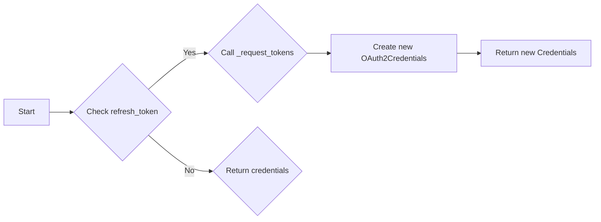

#### 带注释源码

```python
async def _refresh_tokens(
    self, credentials: OAuth2Credentials
) -> OAuth2Credentials:
    if not credentials.refresh_token:
        return credentials

    return await self._request_tokens(
        {
            "refresh_token": credentials.refresh_token.get_secret_value(),
            "grant_type": "refresh_token",
        }
    )
```


### `GitHubOAuthHandler._request_tokens`

请求访问令牌和刷新令牌。

参数：

- `params`：`dict[str, str]`，请求参数。
- `current_credentials`：`Optional[OAuth2Credentials]`，当前OAuth2Credentials对象，可选。

返回值：`OAuth2Credentials`，包含访问令牌、刷新令牌和其他相关信息的对象。

#### 流程图

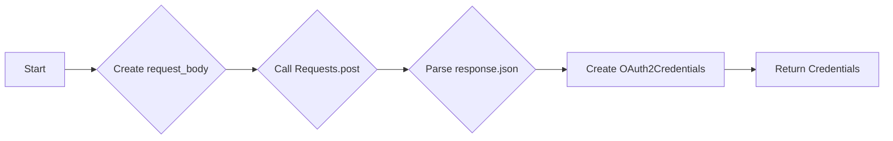

#### 带注释源码

```python
async def _request_tokens(
    self,
    params: dict[str, str],
    current_credentials: Optional[OAuth2Credentials] = None,
) -> OAuth2Credentials:
    request_body = {
        "client_id": self.client_id,
        "client_secret": self.client_secret,
        **params,
    }
    headers = {"Accept": "application/json"}
    response = await Requests().post(
        self.token_url, data=request_body, headers=headers
    )
    token_data: dict = response.json()

    username = await self._request_username(token_data["access_token"])

    now = int(time.time())
    new_credentials = OAuth2Credentials(
        provider=self.PROVIDER_NAME,
        title=current_credentials.title if current_credentials else None,
        username=username,
        access_token=token_data["access_token"],
        scopes=(
            token_data.get("scope", "").split(",")
            or (current_credentials.scopes if current_credentials else [])
        ),
        refresh_token=token_data.get("refresh_token"),
        access_token_expires_at=(
            now + expires_in
            if (expires_in := token_data.get("expires_in", None))
            else None
        ),
        refresh_token_expires_at=(
            now + expires_in
            if (expires_in := token_data.get("refresh_token_expires_in", None))
            else None
        ),
    )
    if current_credentials:
        new_credentials.id = current_credentials.id
    return new_credentials
```


### `GitHubOAuthHandler._request_username`

请求用户名。

参数：

- `access_token`：`str`，用于请求用户名的访问令牌。

返回值：`str | None`，返回用户名或None（如果请求失败）。

#### 流程图

```mermaid
graph LR
A[Start] --> B{Call Requests.get}
B --> C{Check response.ok}
C -->|Yes| D{Parse response.json}
C -->|No| E{Return None}
D --> F[Return login (username)]
```

#### 带注释源码

```python
async def _request_username(self, access_token: str) -> str | None:
    url = "https://api.github.com/user"
    headers = {
        "Accept": "application/vnd.github+json",
        "Authorization": f"Bearer {access_token}",
        "X-GitHub-Api-Version": "2022-11-28",
    }

    response = await Requests().get(url, headers=headers)

    if not response.ok:
        return None

    # Get the login (username)
    resp = response.json()
    return resp.get("login")
```


### `GitHubOAuthHandler._request_username`

获取用户名。

参数：

- `access_token`：`str`，用于认证的访问令牌。

返回值：`str | None`，用户的登录名（即用户名），如果没有找到则返回 `None`。

#### 流程图

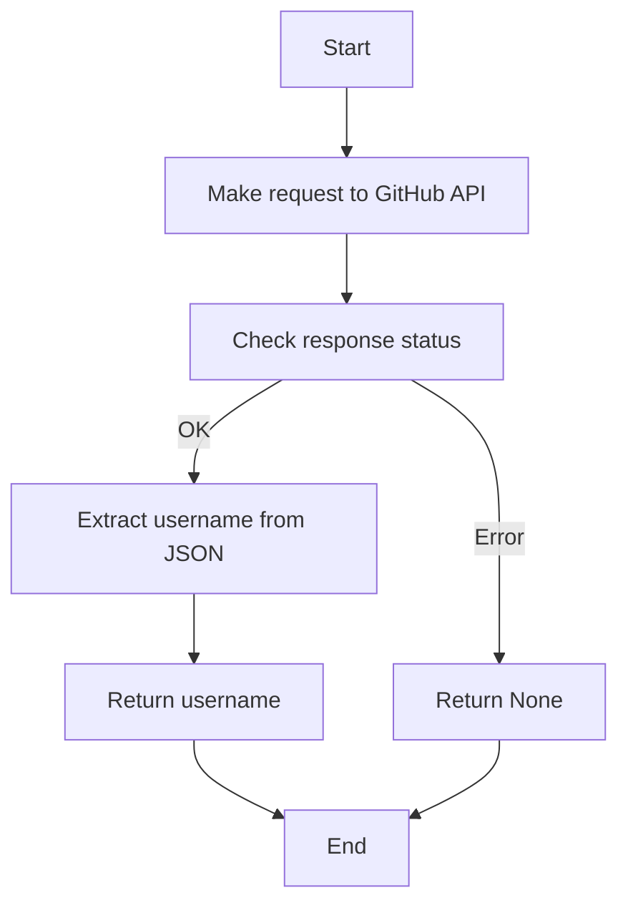

#### 带注释源码

```python
async def _request_username(self, access_token: str) -> str | None:
    url = "https://api.github.com/user"
    headers = {
        "Accept": "application/vnd.github+json",
        "Authorization": f"Bearer {access_token}",
        "X-GitHub-Api-Version": "2022-11-28",
    }

    response = await Requests().get(url, headers=headers)

    if not response.ok:
        return None

    # Get the login (username)
    resp = response.json()
    return resp.get("login")
```


### `GitHubOAuthHandler.__init__`

初始化 `GitHubOAuthHandler` 类实例，设置客户端ID、客户端密钥和重定向URI。

参数：

- `client_id`：`str`，GitHub应用的客户端ID。
- `client_secret`：`str`，GitHub应用的客户端密钥。
- `redirect_uri`：`str`，重定向URI，用于处理授权后的回调。

返回值：无

#### 流程图

```mermaid
classDiagram
    GitHubOAuthHandler <|-- BaseOAuthHandler
    GitHubOAuthHandler {
        +client_id: str
        +client_secret: str
        +redirect_uri: str
        +auth_base_url: str
        +token_url: str
        +revoke_url: str
        +__init__(client_id: str, client_secret: str, redirect_uri: str)
        +get_login_url(scopes: list[str], state: str, code_challenge: Optional[str]): str
        +exchange_code_for_tokens(code: str, scopes: list[str], code_verifier: Optional[str]): OAuth2Credentials
        +revoke_tokens(credentials: OAuth2Credentials): bool
        +_refresh_tokens(credentials: OAuth2Credentials): OAuth2Credentials
        +_request_tokens(params: dict[str, str], current_credentials: Optional[OAuth2Credentials] = None): OAuth2Credentials
        +_request_username(access_token: str): str | None
    }
```

#### 带注释源码

```python
def __init__(self, client_id: str, client_secret: str, redirect_uri: str):
    self.client_id = client_id  # GitHub应用的客户端ID
    self.client_secret = client_secret  # GitHub应用的客户端密钥
    self.redirect_uri = redirect_uri  # 重定向URI，用于处理授权后的回调
    self.auth_base_url = "https://github.com/login/oauth/authorize"  # 授权基础URL
    self.token_url = "https://github.com/login/oauth/access_token"  # 访问令牌URL
    self.revoke_url = "https://api.github.com/applications/{client_id}/token"  # 撤销令牌URL
```


### `GitHubOAuthHandler.get_login_url`

生成用于GitHub OAuth登录的URL。

参数：

- `scopes`：`list[str]`，授权请求所需的权限范围列表。
- `state`：`str`，用于防止CSRF攻击的状态值。
- `code_challenge`：`Optional[str]`，可选的代码挑战值，用于增强安全性。

返回值：`str`，返回一个包含所有参数的GitHub OAuth登录URL。

#### 流程图

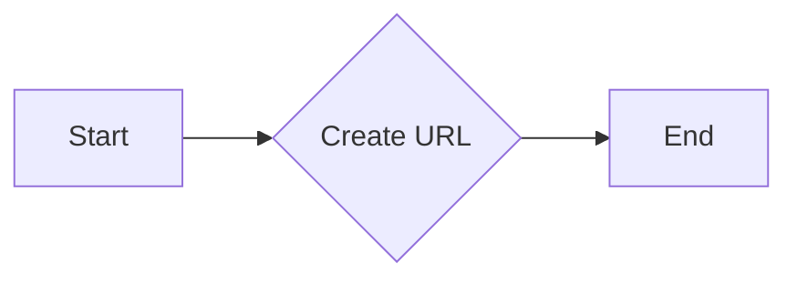

#### 带注释源码

```python
def get_login_url(self, scopes: list[str], state: str, code_challenge: Optional[str] = None) -> str:
    params = {
        "client_id": self.client_id,
        "redirect_uri": self.redirect_uri,
        "scope": " ".join(scopes),
        "state": state,
    }
    return f"{self.auth_base_url}?{urlencode(params)}"
```


### `GitHubOAuthHandler.exchange_code_for_tokens`

This method exchanges an authorization code for access and refresh tokens from the GitHub OAuth provider.

参数：

- `code`：`str`，The authorization code received from the OAuth provider.
- `scopes`：`list[str]`，The list of scopes to request from the OAuth provider.
- `code_verifier`：`Optional[str]`，The code verifier used during the authorization process (optional).

返回值：`OAuth2Credentials`，An object containing the access and refresh tokens, along with other relevant information.

#### 流程图

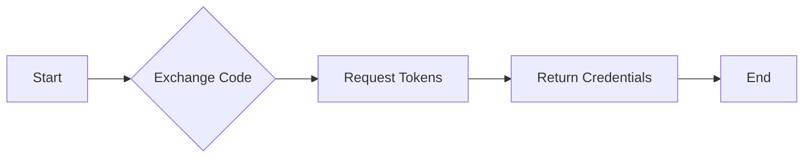

#### 带注释源码

```python
async def exchange_code_for_tokens(
    self, code: str, scopes: list[str], code_verifier: Optional[str]
) -> OAuth2Credentials:
    return await self._request_tokens(
        {"code": code, "redirect_uri": self.redirect_uri}
    )
```


### `GitHubOAuthHandler.revoke_tokens`

Revoke access tokens for a GitHub OAuth2 application.

参数：

- `credentials`：`OAuth2Credentials`，The OAuth2 credentials object containing the access token to be revoked.

返回值：`bool`，Indicates whether the token revocation was successful.

#### 流程图

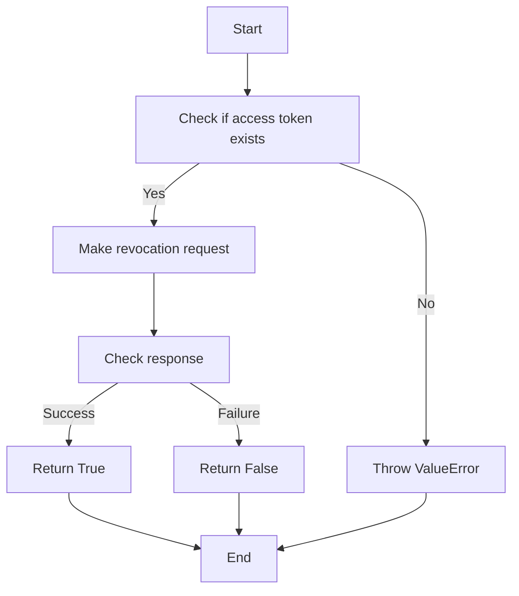

#### 带注释源码

```python
async def revoke_tokens(self, credentials: OAuth2Credentials) -> bool:
    if not credentials.access_token:
        raise ValueError("No access token to revoke")

    headers = {
        "Accept": "application/vnd.github+json",
        "X-GitHub-Api-Version": "2022-11-28",
    }

    await Requests().delete(
        url=self.revoke_url.format(client_id=self.client_id),
        auth=(self.client_id, self.client_secret),
        headers=headers,
        json={"access_token": credentials.access_token.get_secret_value()},
    )
    return True
```


### `_refresh_tokens`

This method refreshes the access tokens for a given OAuth2Credentials object using the refresh token provided.

参数：

- `credentials`：`OAuth2Credentials`，The OAuth2Credentials object containing the refresh token to be used for refreshing the access token.

返回值：`OAuth2Credentials`，The updated OAuth2Credentials object with the new access token.

#### 流程图

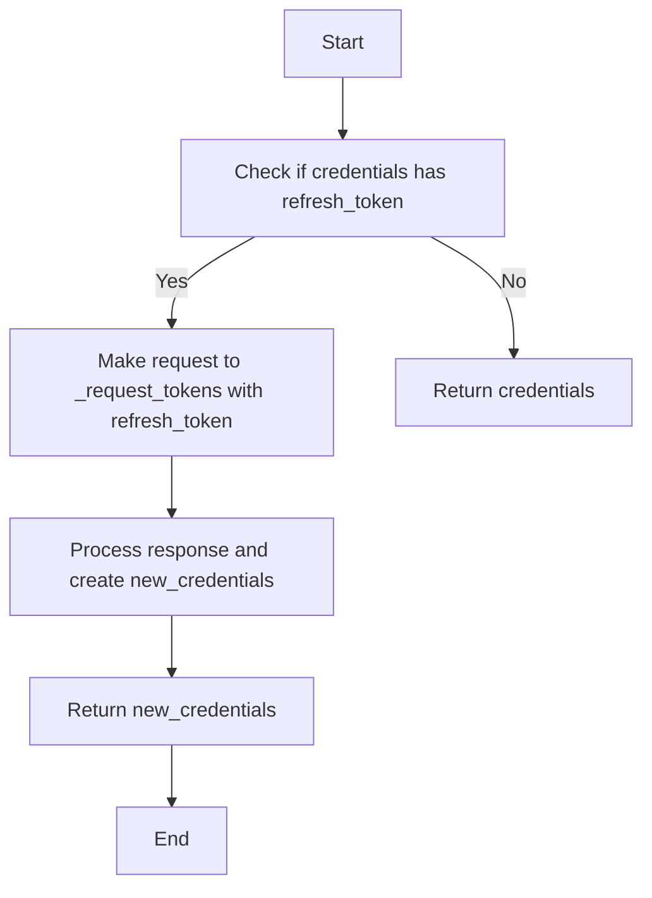

#### 带注释源码

```python
async def _refresh_tokens(self, credentials: OAuth2Credentials) -> OAuth2Credentials:
    if not credentials.refresh_token:
        return credentials

    return await self._request_tokens(
        {
            "refresh_token": credentials.refresh_token.get_secret_value(),
            "grant_type": "refresh_token",
        }
    )
```


### `_request_tokens`

This method is responsible for making a POST request to the GitHub OAuth token endpoint to exchange authorization codes or refresh tokens for access tokens.

参数：

- `params`：`dict[str, str]`，A dictionary containing the parameters required for the token exchange, such as `code`, `redirect_uri`, and `grant_type`.
- `current_credentials`：`Optional[OAuth2Credentials]`，An optional OAuth2Credentials object that contains the current credentials, which can be used to retrieve the username and other information.

返回值：`OAuth2Credentials`，An OAuth2Credentials object containing the new access token, refresh token, and other relevant information.

#### 流程图

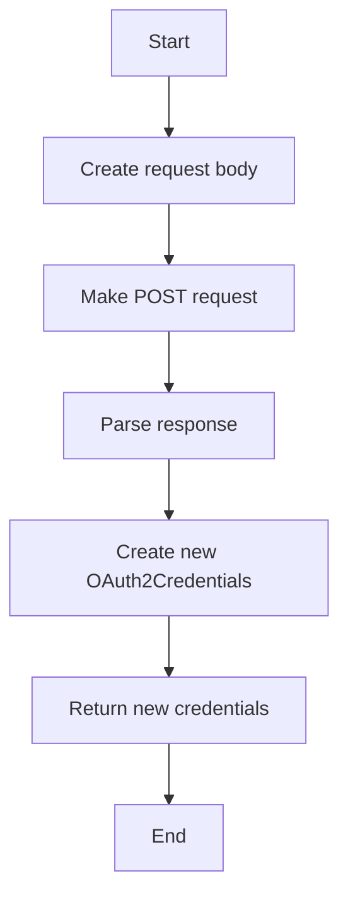

#### 带注释源码

```python
async def _request_tokens(
    self,
    params: dict[str, str],
    current_credentials: Optional[OAuth2Credentials] = None,
) -> OAuth2Credentials:
    request_body = {
        "client_id": self.client_id,
        "client_secret": self.client_secret,
        **params,
    }
    headers = {"Accept": "application/json"}
    response = await Requests().post(
        self.token_url, data=request_body, headers=headers
    )
    token_data: dict = response.json()

    username = await self._request_username(token_data["access_token"])

    now = int(time.time())
    new_credentials = OAuth2Credentials(
        provider=self.PROVIDER_NAME,
        title=current_credentials.title if current_credentials else None,
        username=username,
        access_token=token_data["access_token"],
        scopes=(
            token_data.get("scope", "").split(",")
            or (current_credentials.scopes if current_credentials else [])
        ),
        refresh_token=token_data.get("refresh_token"),
        access_token_expires_at=(
            now + expires_in
            if (expires_in := token_data.get("expires_in", None))
            else None
        ),
        refresh_token_expires_at=(
            now + expires_in
            if (expires_in := token_data.get("refresh_token_expires_in", None))
            else None
        ),
    )
    if current_credentials:
        new_credentials.id = current_credentials.id
    return new_credentials
```


### `_request_username`

获取用户名。

参数：

- `access_token`：`str`，用于认证的访问令牌。

返回值：`str | None`，用户的登录名（如果成功获取）或 `None`（如果请求失败或用户名不可用）。

#### 流程图

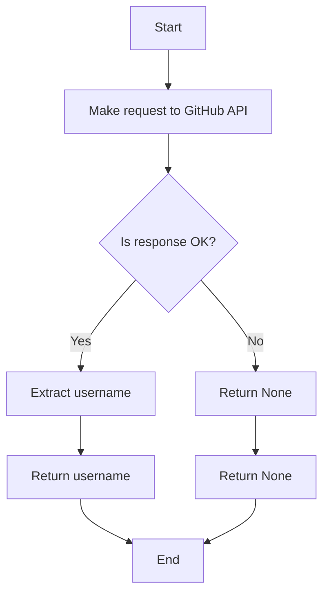

#### 带注释源码

```python
async def _request_username(self, access_token: str) -> str | None:
    url = "https://api.github.com/user"
    headers = {
        "Accept": "application/vnd.github+json",
        "Authorization": f"Bearer {access_token}",
        "X-GitHub-Api-Version": "2022-11-28",
    }

    response = await Requests().get(url, headers=headers)

    if not response.ok:
        return None

    # Get the login (username)
    resp = response.json()
    return resp.get("login")
```


### `GitHubOAuthHandler.__init__`

初始化 `GitHubOAuthHandler` 类实例，设置客户端ID、客户端密钥和重定向URI。

参数：

- `client_id`：`str`，GitHub应用的客户端ID。
- `client_secret`：`str`，GitHub应用的客户端密钥。
- `redirect_uri`：`str`，重定向URI，用于处理授权后的回调。

返回值：无

#### 流程图

```mermaid
classDiagram
    GitHubOAuthHandler <|-- BaseOAuthHandler
    GitHubOAuthHandler {
        client_id
        client_secret
        redirect_uri
        auth_base_url
        token_url
        revoke_url
    }
    GitHubOAuthHandler {
        +__init__(client_id: str, client_secret: str, redirect_uri: str)
    }
```

#### 带注释源码

```python
def __init__(self, client_id: str, client_secret: str, redirect_uri: str):
    self.client_id = client_id
    self.client_secret = client_secret
    self.redirect_uri = redirect_uri
    self.auth_base_url = "https://github.com/login/oauth/authorize"
    self.token_url = "https://github.com/login/oauth/access_token"
    self.revoke_url = "https://api.github.com/applications/{client_id}/token"
```


### `GitHubOAuthHandler.get_login_url`

This method generates the login URL for the GitHub OAuth flow.

参数：

- `scopes`：`list[str]`，A list of scopes to request from GitHub.
- `state`：`str`，A state parameter used to maintain state between the OAuth request and callback.
- `code_challenge`：`Optional[str]`，An optional code challenge for the OAuth 2.0 authorization code flow.

返回值：`str`，The login URL for the GitHub OAuth flow.

#### 流程图

```mermaid
graph LR
A[Start] --> B{Generate URL}
B --> C[Return URL]
C --> D[End]
```

#### 带注释源码

```python
def get_login_url(self, scopes: list[str], state: str, code_challenge: Optional[str] = None) -> str:
    params = {
        "client_id": self.client_id,
        "redirect_uri": self.redirect_uri,
        "scope": " ".join(scopes),
        "state": state,
    }
    return f"{self.auth_base_url}?{urlencode(params)}"
```


### `GitHubOAuthHandler.exchange_code_for_tokens`

This method exchanges a code received from the GitHub OAuth flow for access and refresh tokens.

参数：

- `code`：`str`，The authorization code received from the GitHub OAuth flow.
- `scopes`：`list[str]`，The list of scopes for the access token.
- `code_verifier`：`Optional[str]`，The code verifier used during the OAuth flow (optional).

返回值：`OAuth2Credentials`，An object containing the access and refresh tokens, along with other relevant information.

#### 流程图

```mermaid
graph LR
A[Start] --> B{Exchange Code}
B --> C[Request Tokens]
C --> D[Return Credentials]
D --> E[End]
```

#### 带注释源码

```python
async def exchange_code_for_tokens(
    self, code: str, scopes: list[str], code_verifier: Optional[str]
) -> OAuth2Credentials:
    return await self._request_tokens(
        {"code": code, "redirect_uri": self.redirect_uri}
    )
```


### `GitHubOAuthHandler.revoke_tokens`

Revoke access tokens for a GitHub OAuth application.

参数：

- `credentials`：`OAuth2Credentials`，The OAuth2 credentials object containing the access token to be revoked.

返回值：`bool`，Indicates whether the token revocation was successful.

#### 流程图

```mermaid
graph LR
A[Start] --> B{Check access token}
B -->|Yes| C[Make request to GitHub API]
B -->|No| D[Throw ValueError]
C --> E{Response from GitHub API}
E -->|Success| F[Return True]
E -->|Failure| G[Return False]
F --> H[End]
G --> H
D --> H
```

#### 带注释源码

```python
async def revoke_tokens(self, credentials: OAuth2Credentials) -> bool:
    if not credentials.access_token:
        raise ValueError("No access token to revoke")

    headers = {
        "Accept": "application/vnd.github+json",
        "X-GitHub-Api-Version": "2022-11-28",
    }

    await Requests().delete(
        url=self.revoke_url.format(client_id=self.client_id),
        auth=(self.client_id, self.client_secret),
        headers=headers,
        json={"access_token": credentials.access_token.get_secret_value()},
    )
    return True
```


### `_refresh_tokens`

This method refreshes the access tokens for a GitHub OAuth2 application using the provided refresh token.

参数：

- `credentials`：`OAuth2Credentials`，The OAuth2 credentials object containing the refresh token to be used for refreshing the access token.

返回值：`OAuth2Credentials`，The updated OAuth2 credentials object with the new access token.

#### 流程图

```mermaid
graph TD
    A[Start] --> B[Check if refresh_token exists]
    B -- Yes --> C[Request new tokens]
    B -- No --> D[Return existing credentials]
    C --> E[Receive token data]
    E --> F[Create new credentials]
    F --> G[Return new credentials]
    D --> H[End]
```

#### 带注释源码

```python
async def _refresh_tokens(self, credentials: OAuth2Credentials) -> OAuth2Credentials:
    if not credentials.refresh_token:
        return credentials

    return await self._request_tokens(
        {
            "refresh_token": credentials.refresh_token.get_secret_value(),
            "grant_type": "refresh_token",
        }
    )
```


### `_request_tokens`

This method is responsible for making a POST request to the GitHub OAuth token endpoint to exchange authorization codes or refresh tokens for access tokens.

参数：

- `params`：`dict[str, str]`，A dictionary containing the parameters required for the token exchange, such as `code`, `redirect_uri`, and `grant_type`.
- `current_credentials`：`Optional[OAuth2Credentials]`，An optional OAuth2Credentials object that may contain existing credentials to be used for refreshing tokens.

返回值：`OAuth2Credentials`，An OAuth2Credentials object containing the new access token, refresh token, and other relevant information.

#### 流程图

```mermaid
graph TD
    A[Start] --> B[Create request body]
    B --> C[Make POST request]
    C --> D[Parse response]
    D --> E[Create new OAuth2Credentials]
    E --> F[Return new credentials]
    F --> G[End]
```

#### 带注释源码

```python
async def _request_tokens(
    self,
    params: dict[str, str],
    current_credentials: Optional[OAuth2Credentials] = None,
) -> OAuth2Credentials:
    request_body = {
        "client_id": self.client_id,
        "client_secret": self.client_secret,
        **params,
    }
    headers = {"Accept": "application/json"}
    response = await Requests().post(
        self.token_url, data=request_body, headers=headers
    )
    token_data: dict = response.json()

    username = await self._request_username(token_data["access_token"])

    now = int(time.time())
    new_credentials = OAuth2Credentials(
        provider=self.PROVIDER_NAME,
        title=current_credentials.title if current_credentials else None,
        username=username,
        access_token=token_data["access_token"],
        scopes=(
            token_data.get("scope", "").split(",")
            or (current_credentials.scopes if current_credentials else [])
        ),
        refresh_token=token_data.get("refresh_token"),
        access_token_expires_at=(
            now + expires_in
            if (expires_in := token_data.get("expires_in", None))
            else None
        ),
        refresh_token_expires_at=(
            now + expires_in
            if (expires_in := token_data.get("refresh_token_expires_in", None))
            else None
        ),
    )
    if current_credentials:
        new_credentials.id = current_credentials.id
    return new_credentials
```


### `_request_username`

Retrieves the username associated with a given access token from GitHub's API.

参数：

- `access_token`：`str`，The access token used to authenticate the request to GitHub's API.

返回值：`str | None`，The username associated with the access token if successful, otherwise `None`.

#### 流程图

```mermaid
graph TD
    A[Start] --> B[Make GET request to GitHub API]
    B --> C{Check response status}
    C -- 200 --> D[Extract username from response]
    C -- !200 --> E[Return None]
    D --> F[Return username]
    E --> G[End]
```

#### 带注释源码

```python
async def _request_username(self, access_token: str) -> str | None:
    url = "https://api.github.com/user"
    headers = {
        "Accept": "application/vnd.github+json",
        "Authorization": f"Bearer {access_token}",
        "X-GitHub-Api-Version": "2022-11-28",
    }

    response = await Requests().get(url, headers=headers)

    if not response.ok:
        return None

    # Get the login (username)
    resp = response.json()
    return resp.get("login")
```


## 关键组件


### GitHubOAuthHandler

GitHubOAuthHandler 类负责处理 GitHub OAuth 认证流程，包括获取登录 URL、交换代码以获取令牌、撤销令牌和刷新令牌。

### get_login_url

- **名称**: get_login_url
- **参数**: 
  - `scopes`: list[str] - OAuth2 授权请求的权限范围
  - `state`: str - 用于防止跨站请求伪造的随机状态值
  - `code_challenge`: Optional[str] - 用于代码挑战的值
- **返回值**: str - GitHub 登录 URL
- **描述**: 生成 GitHub 登录 URL，用于启动 OAuth2 授权流程。

### exchange_code_for_tokens

- **名称**: exchange_code_for_tokens
- **参数**: 
  - `code`: str - 从 GitHub 登录流程中获取的授权代码
  - `scopes`: list[str] - OAuth2 授权请求的权限范围
  - `code_verifier`: Optional[str] - 用于代码验证的值
- **返回值**: OAuth2Credentials - 包含访问令牌和刷新令牌的 OAuth2 凭据对象
- **描述**: 使用授权代码交换访问令牌和刷新令牌。

### revoke_tokens

- **名称**: revoke_tokens
- **参数**: 
  - `credentials`: OAuth2Credentials - 包含要撤销的访问令牌的 OAuth2 凭据对象
- **返回值**: bool - 表示是否成功撤销令牌
- **描述**: 撤销指定的 OAuth2 凭据对象中的访问令牌。

### _refresh_tokens

- **名称**: _refresh_tokens
- **参数**: 
  - `credentials`: OAuth2Credentials - 包含要刷新的刷新令牌的 OAuth2 凭据对象
- **返回值**: OAuth2Credentials - 包含刷新后的访问令牌和刷新令牌的 OAuth2 凭据对象
- **描述**: 使用刷新令牌刷新访问令牌。

### _request_tokens

- **名称**: _request_tokens
- **参数**: 
  - `params`: dict[str, str] - 请求令牌的参数
  - `current_credentials`: Optional[OAuth2Credentials] - 当前 OAuth2 凭据对象
- **返回值**: OAuth2Credentials - 包含访问令牌和刷新令牌的 OAuth2 凭据对象
- **描述**: 向 GitHub API 发送请求以获取访问令牌和刷新令牌。

### _request_username

- **名称**: _request_username
- **参数**: 
  - `access_token`: str - GitHub API 访问令牌
- **返回值**: str | None - 用户名或 None
- **描述**: 使用访问令牌请求用户名。


## 问题及建议


### 已知问题

-   **全局变量和函数依赖**：代码中使用了全局变量和函数，如`Requests`类和`OAuth2Credentials`类，这些可能需要在文档中明确说明其来源和定义，以避免依赖性问题。
-   **异常处理**：代码中存在异常处理，但可能需要更详细的异常处理逻辑，例如在`revoke_tokens`方法中，如果`Requests().delete`调用失败，应该抛出更具体的异常。
-   **代码复用**：`_request_tokens`方法在多个地方被调用，但可能存在代码复用不足的问题，可以考虑将此方法提取为独立的类或模块。
-   **文档注释**：代码中的注释较为详细，但可能需要进一步优化，例如在方法注释中添加返回值描述和异常描述。

### 优化建议

-   **模块化**：将`_request_tokens`方法提取为独立的类或模块，以提高代码的可维护性和可测试性。
-   **异常处理**：在`revoke_tokens`方法中，如果`Requests().delete`调用失败，应该抛出`requests.exceptions.RequestException`或自定义异常，以便调用者能够更好地处理错误。
-   **代码复用**：考虑使用工厂模式或其他设计模式来创建`OAuth2Credentials`对象，以减少代码重复。
-   **文档注释**：在方法注释中添加返回值描述和异常描述，以便其他开发者更好地理解代码的功能和预期行为。
-   **单元测试**：编写单元测试来覆盖关键功能，确保代码的稳定性和可靠性。
-   **代码风格**：遵循统一的代码风格指南，以提高代码的可读性和一致性。


## 其它


### 设计目标与约束

- 设计目标：
  - 实现一个基于GitHub OAuth的认证流程。
  - 提供获取访问令牌、刷新令牌和撤销令牌的功能。
  - 确保令牌的安全性和有效性。
- 约束：
  - 遵循GitHub OAuth规范。
  - 令牌过期策略与GitHub App设置保持一致。
  - 确保所有敏感信息（如客户端密钥）的安全存储和传输。

### 错误处理与异常设计

- 错误处理：
  - 对于无效的令牌、错误的请求参数等，抛出相应的异常。
  - 使用自定义异常类来提供更具体的错误信息。
- 异常设计：
  - `ValueError`：当撤销令牌时没有访问令牌。
  - `RequestsException`：当HTTP请求失败时。

### 数据流与状态机

- 数据流：
  - 用户访问登录URL，开始认证流程。
  - 用户授权后，GitHub返回授权码。
  - 应用程序使用授权码交换访问令牌。
  - 应用程序使用访问令牌进行API调用。
  - 应用程序使用刷新令牌刷新访问令牌。
- 状态机：
  - 认证状态：未认证、已认证、令牌过期、令牌撤销。

### 外部依赖与接口契约

- 外部依赖：
  - `Requests`库：用于发送HTTP请求。
  - `OAuth2Credentials`类：用于存储和操作OAuth2令牌。
- 接口契约：
  - `BaseOAuthHandler`类：定义了OAuth认证流程的基本方法。
  - `Requests`类：定义了发送HTTP请求的接口。
  - `OAuth2Credentials`类：定义了OAuth2令牌的接口。


    