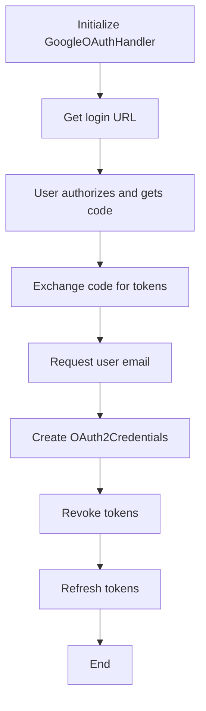
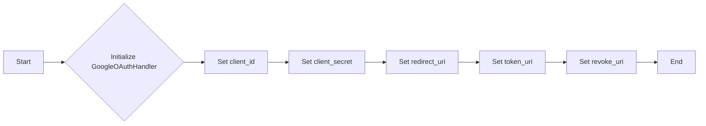
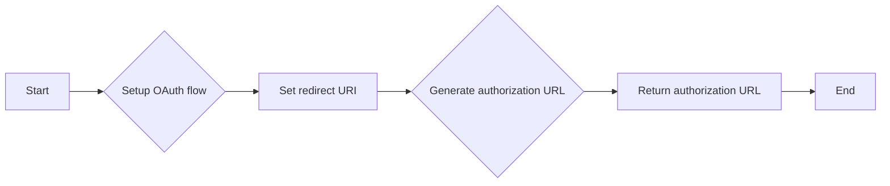
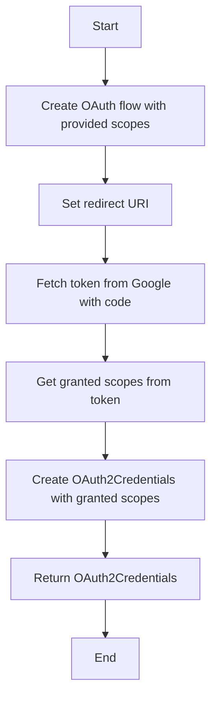
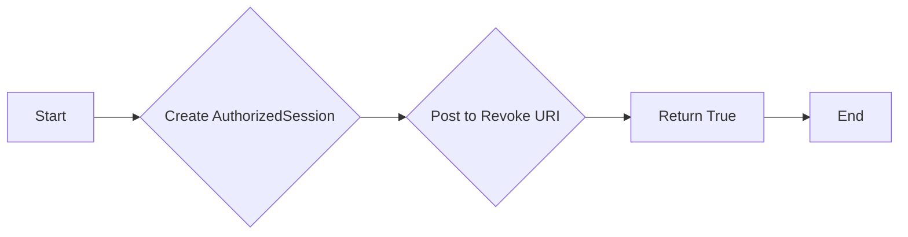
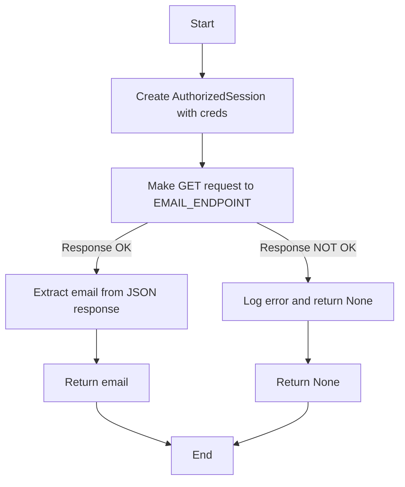
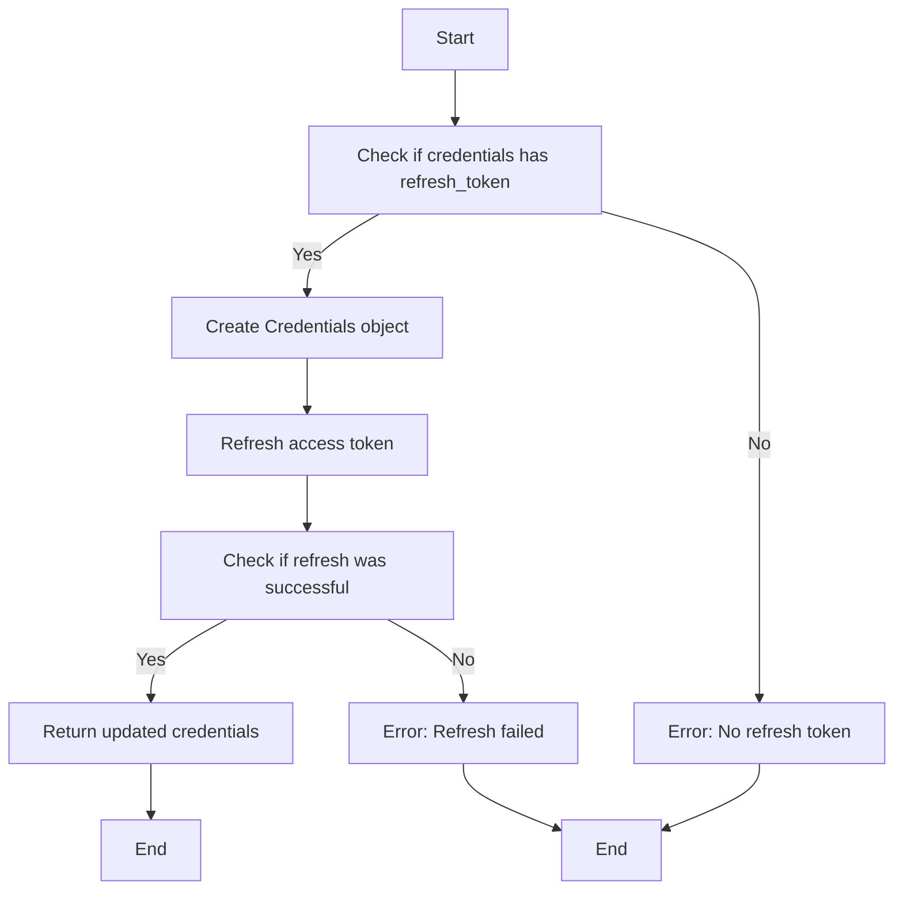
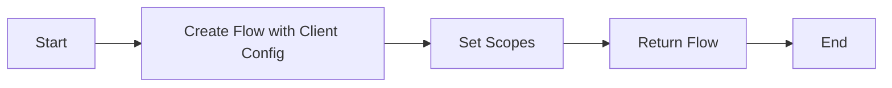

# `.\AutoGPT\autogpt_platform\backend\backend\integrations\oauth\google.py` 详细设计文档

The code provides a handler for OAuth2 authentication with Google, handling login, token exchange, token revocation, and token refresh.

## 整体流程



## 类结构

```
GoogleOAuthHandler (Concrete class)
├── BaseOAuthHandler (Abstract base class)
```

## 全局变量及字段


### `logger`
    
Logger instance for logging messages.

类型：`logging.Logger`
    


### `client_id`
    
Client ID for the OAuth 2.0 application.

类型：`str`
    


### `client_secret`
    
Client secret for the OAuth 2.0 application.

类型：`str`
    


### `redirect_uri`
    
Redirect URI for the OAuth 2.0 application.

类型：`str`
    


### `token_uri`
    
URI to exchange authorization code for access token.

类型：`str`
    


### `revoke_uri`
    
URI to revoke OAuth 2.0 tokens.

类型：`str`
    


### `PROVIDER_NAME`
    
Enum representing the OAuth 2.0 provider name (GOOGLE).

类型：`ProviderName`
    


### `EMAIL_ENDPOINT`
    
Endpoint to request user email from Google.

类型：`str`
    


### `DEFAULT_SCOPES`
    
Default scopes for the OAuth 2.0 application.

类型：`list[str]`
    


### `GoogleOAuthHandler.client_id`
    
Client ID for the OAuth 2.0 application.

类型：`str`
    


### `GoogleOAuthHandler.client_secret`
    
Client secret for the OAuth 2.0 application.

类型：`str`
    


### `GoogleOAuthHandler.redirect_uri`
    
Redirect URI for the OAuth 2.0 application.

类型：`str`
    


### `GoogleOAuthHandler.token_uri`
    
URI to exchange authorization code for access token.

类型：`str`
    


### `GoogleOAuthHandler.revoke_uri`
    
URI to revoke OAuth 2.0 tokens.

类型：`str`
    


### `GoogleOAuthHandler.PROVIDER_NAME`
    
Enum representing the OAuth 2.0 provider name (GOOGLE).

类型：`ProviderName`
    


### `GoogleOAuthHandler.EMAIL_ENDPOINT`
    
Endpoint to request user email from Google.

类型：`str`
    


### `GoogleOAuthHandler.DEFAULT_SCOPES`
    
Default scopes for the OAuth 2.0 application.

类型：`list[str]`
    
    

## 全局函数及方法


### GoogleOAuthHandler.__init__

This method initializes a `GoogleOAuthHandler` instance with the necessary credentials and configuration for Google OAuth2 authentication.

参数：

- `client_id`：`str`，Google OAuth2 client ID, used to identify the application to Google.
- `client_secret`：`str`，Google OAuth2 client secret, used to authenticate the application to Google.
- `redirect_uri`：`str`，The URI to which Google will redirect after authorization.

返回值：无

#### 流程图



#### 带注释源码

```python
def __init__(self, client_id: str, client_secret: str, redirect_uri: str):
    self.client_id = client_id  # Google OAuth2 client ID
    self.client_secret = client_secret  # Google OAuth2 client secret
    self.redirect_uri = redirect_uri  # URI to which Google will redirect after authorization
    self.token_uri = "https://oauth2.googleapis.com/token"  # URI to exchange authorization code for tokens
    self.revoke_uri = "https://oauth2.googleapis.com/revoke"  # URI to revoke tokens
```


### `GoogleOAuthHandler.get_login_url`

This method generates the login URL for Google OAuth authentication.

参数：

- `scopes`：`list[str]`，A list of additional scopes to request.
- `state`：`str`，A state parameter to send to the authorization server.
- `code_challenge`：`Optional[str]`，An optional code challenge for the authorization server.

返回值：`str`，The login URL for Google OAuth authentication.

#### 流程图



#### 带注释源码

```python
def get_login_url(self, scopes: list[str], state: str, code_challenge: Optional[str] = None) -> str:
    all_scopes = list(set(scopes + self.DEFAULT_SCOPES))
    logger.debug(f"Setting up OAuth flow with scopes: {all_scopes}")
    flow = self._setup_oauth_flow(all_scopes)
    flow.redirect_uri = self.redirect_uri
    authorization_url, _ = flow.authorization_url(
        access_type="offline",
        include_granted_scopes="true",
        state=state,
        prompt="consent",
    )
    return authorization_url
```


### `GoogleOAuthHandler.exchange_code_for_tokens`

This method exchanges an authorization code received from Google for access and refresh tokens.

参数：

- `code`：`str`，The authorization code received from Google.
- `scopes`：`list[str]`，The list of scopes for which the tokens are requested.
- `code_verifier`：`Optional[str]`，The code verifier used during the authorization process (optional).

返回值：`OAuth2Credentials`，An object containing the OAuth2 credentials.

#### 流程图



#### 带注释源码

```python
async def exchange_code_for_tokens(
    self, code: str, scopes: list[str], code_verifier: Optional[str]
) -> OAuth2Credentials:
    logger.debug(f"Exchanging code for tokens with scopes: {scopes}")

    # Use the scopes from the initial request
    flow = self._setup_oauth_flow(scopes)
    flow.redirect_uri = self.redirect_uri

    logger.debug("Fetching token from Google")

    # Disable scope check in fetch_token
    flow.oauth2session.scope = None
    token = flow.fetch_token(code=code)
    logger.debug("Token fetched successfully")

    # Get the actual scopes granted by Google
    granted_scopes: list[str] = token.get("scope", [])

    logger.debug(f"Scopes granted by Google: {granted_scopes}")

    google_creds = flow.credentials
    logger.debug("Received credentials")

    logger.debug("Requesting user email")
    username = self._request_email(google_creds)
    logger.debug(f"User email retrieved: {username}")

    assert google_creds.token
    assert google_creds.refresh_token
    assert google_creds.expiry
    assert granted_scopes

    # Create OAuth2Credentials with the granted scopes
    credentials = OAuth2Credentials(
        provider=self.PROVIDER_NAME,
        title=None,
        username=username,
        access_token=SecretStr(google_creds.token),
        refresh_token=(SecretStr(google_creds.refresh_token)),
        access_token_expires_at=(
            int(google_creds.expiry.timestamp()) if google_creds.expiry else None
        ),
        refresh_token_expires_at=None,
        scopes=granted_scopes,
    )
    logger.debug(
        f"OAuth2Credentials object created successfully with scopes: {credentials.scopes}"
    )

    return credentials
```


### `GoogleOAuthHandler.revoke_tokens`

Revokes OAuth 2.0 tokens for a given OAuth2Credentials object.

参数：

- `credentials`：`OAuth2Credentials`，The OAuth2Credentials object containing the access token to be revoked.

返回值：`bool`，Indicates whether the token revocation was successful.

#### 流程图



#### 带注释源码

```python
async def revoke_tokens(self, credentials: OAuth2Credentials) -> bool:
    session = AuthorizedSession(credentials)
    session.post(
        self.revoke_uri,
        params={"token": credentials.access_token.get_secret_value()},
        headers={"content-type": "application/x-www-form-urlencoded"},
    )
    return True
```


### `_request_email`

Retrieves the user's email address from Google's userinfo endpoint using the provided credentials.

参数：

- `creds`：`Credentials | ExternalAccountCredentials`，The credentials used to make the request to Google's userinfo endpoint.

返回值：`str | None`，The user's email address if successful, otherwise `None`.

#### 流程图



#### 带注释源码

```python
def _request_email(self, creds: Credentials | ExternalAccountCredentials) -> str | None:
    session = AuthorizedSession(creds)
    response = session.get(self.EMAIL_ENDPOINT)
    if not response.ok:
        logger.error(f"Failed to get user email. Status code: {response.status_code}")
        return None
    return response.json()["email"]
```


### `_refresh_tokens`

This method refreshes the access tokens for the OAuth2Credentials object by using the refresh token provided by Google.

参数：

- `credentials`：`OAuth2Credentials`，The OAuth2Credentials object containing the access token, refresh token, and other information.

返回值：`OAuth2Credentials`，The updated OAuth2Credentials object with the new access token.

#### 流程图



#### 带注释源码

```python
async def _refresh_tokens(self, credentials: OAuth2Credentials) -> OAuth2Credentials:
    # Google credentials should ALWAYS have a refresh token
    assert credentials.refresh_token

    google_creds = Credentials(
        token=credentials.access_token.get_secret_value(),
        refresh_token=credentials.refresh_token.get_secret_value(),
        token_uri=self.token_uri,
        client_id=self.client_id,
        client_secret=self.client_secret,
        scopes=credentials.scopes,
    )
    # Google's OAuth library is poorly typed so we need some of these:
    assert google_creds.refresh_token
    assert google_creds.scopes

    google_creds.refresh(Request())
    assert google_creds.expiry

    return OAuth2Credentials(
        provider=self.PROVIDER_NAME,
        id=credentials.id,
        title=credentials.title,
        username=credentials.username,
        access_token=SecretStr(google_creds.token),
        refresh_token=SecretStr(google_creds.refresh_token),
        access_token_expires_at=int(google_creds.expiry.timestamp()),
        refresh_token_expires_at=None,
        scopes=google_creds.scopes,
    )
```


### `_setup_oauth_flow`

This method sets up the OAuth flow for Google authentication.

参数：

- `scopes`：`list[str]`，A list of scopes to be requested during the OAuth flow.

返回值：`Flow`，An instance of `Flow` that can be used to initiate the OAuth process.

#### 流程图



#### 带注释源码

```python
def _setup_oauth_flow(self, scopes: list[str]) -> Flow:
    return Flow.from_client_config(
        {
            "web": {
                "client_id": self.client_id,
                "client_secret": self.client_secret,
                "auth_uri": "https://accounts.google.com/o/oauth2/auth",
                "token_uri": self.token_uri,
            }
        },
        scopes=scopes,
    )
```


## 关键组件


### 张量索引与惰性加载

张量索引与惰性加载是处理大型数据集时常用的技术，它允许在需要时才计算或加载数据，从而提高效率。

### 反量化支持

反量化支持是指系统对量化操作的反向操作的支持，允许在需要时恢复原始数据。

### 量化策略

量化策略是指将浮点数转换为低精度表示（如整数）的策略，以减少模型大小和加速计算。


## 问题及建议


### 已知问题

-   **异步方法与同步代码**: `GoogleOAuthHandler` 类中包含异步方法（如 `exchange_code_for_tokens` 和 `_refresh_tokens`），但在这些方法中调用了同步代码（如 `session.get` 和 `session.post`）。这可能导致并发问题，特别是在高负载情况下。
-   **全局变量**: `logger` 被用作全局变量，这可能导致在多线程环境中出现竞态条件。
-   **类型断言**: 在 `_request_email` 方法中，对 `creds` 参数的类型进行了断言，这可能导致运行时错误，如果传入的对象不是预期的类型。
-   **异常处理**: 代码中缺少对可能发生的异常的处理，例如网络请求失败或认证失败。

### 优化建议

-   **异步与同步代码分离**: 将异步方法和同步代码分离，确保异步方法只调用异步操作。
-   **使用线程安全日志记录**: 使用线程安全的日志记录机制，例如 `logging` 模块的 `basicConfig` 方法，以确保在多线程环境中安全地使用 `logger`。
-   **类型检查**: 在代码中增加类型检查，确保传入的对象符合预期类型，或者使用类型注解和类型检查工具来减少类型错误。
-   **异常处理**: 在可能发生异常的地方添加异常处理逻辑，例如使用 `try-except` 块来捕获和处理异常。
-   **代码复用**: 将重复的代码（如获取用户电子邮件的代码）提取到单独的方法中，以提高代码的可维护性和可读性。
-   **单元测试**: 为代码编写单元测试，以确保代码在各种情况下都能正常工作，并帮助发现潜在的错误。
-   **文档**: 为代码添加详细的文档注释，包括每个方法的功能、参数和返回值，以便其他开发者更容易理解和使用代码。


## 其它


### 设计目标与约束

- 设计目标：
  - 实现一个基于Google OAuth2协议的认证流程。
  - 提供用户登录、令牌交换、令牌刷新和令牌撤销的功能。
  - 确保认证过程的安全性和可靠性。
  - 与现有的认证系统集成，提供统一的认证接口。

- 约束：
  - 必须使用Google OAuth2协议。
  - 必须支持异步操作。
  - 必须处理错误和异常情况。
  - 必须遵守Google API的使用条款。

### 错误处理与异常设计

- 错误处理：
  - 使用Python的`logging`模块记录错误信息。
  - 对于网络请求错误，捕获异常并记录错误详情。
  - 对于认证过程中的错误，返回相应的错误信息。

- 异常设计：
  - 定义自定义异常类，用于处理特定的错误情况。
  - 在方法中抛出异常，并在调用者处捕获和处理。

### 数据流与状态机

- 数据流：
  - 用户发起登录请求，系统生成登录URL。
  - 用户在Google登录页面完成认证，系统接收授权码。
  - 系统使用授权码交换令牌，获取用户信息。
  - 系统根据令牌信息创建OAuth2Credentials对象。

- 状态机：
  - 定义认证状态机，包括登录、令牌交换、令牌刷新和令牌撤销等状态。

### 外部依赖与接口契约

- 外部依赖：
  - Google OAuth2协议。
  - `google-auth`库。
  - `google-auth-oauthlib`库。
  - `pydantic`库。

- 接口契约：
  - 定义OAuth2Credentials对象的接口，包括属性和方法。
  - 定义GoogleOAuthHandler类的接口，包括方法参数和返回值。


    