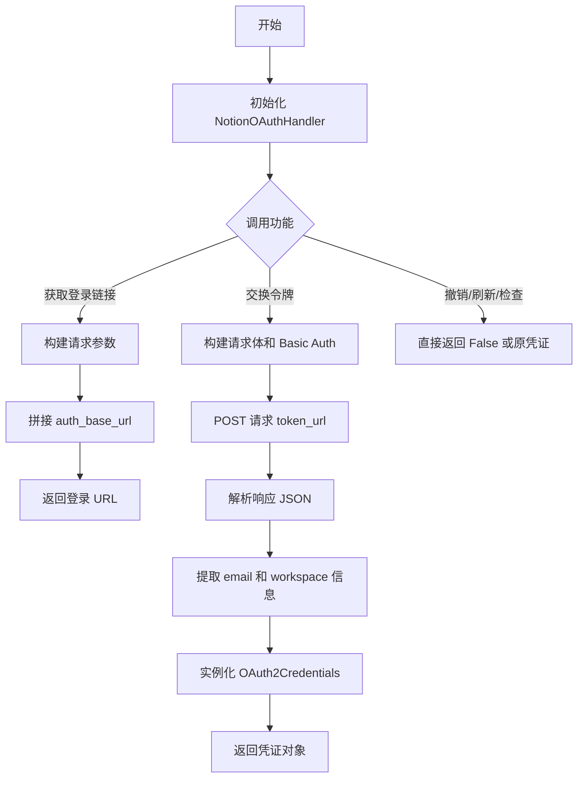
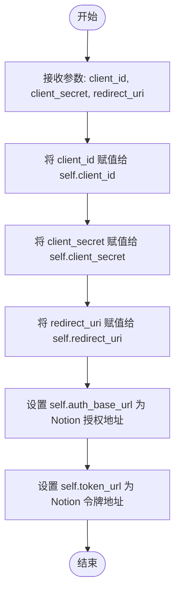
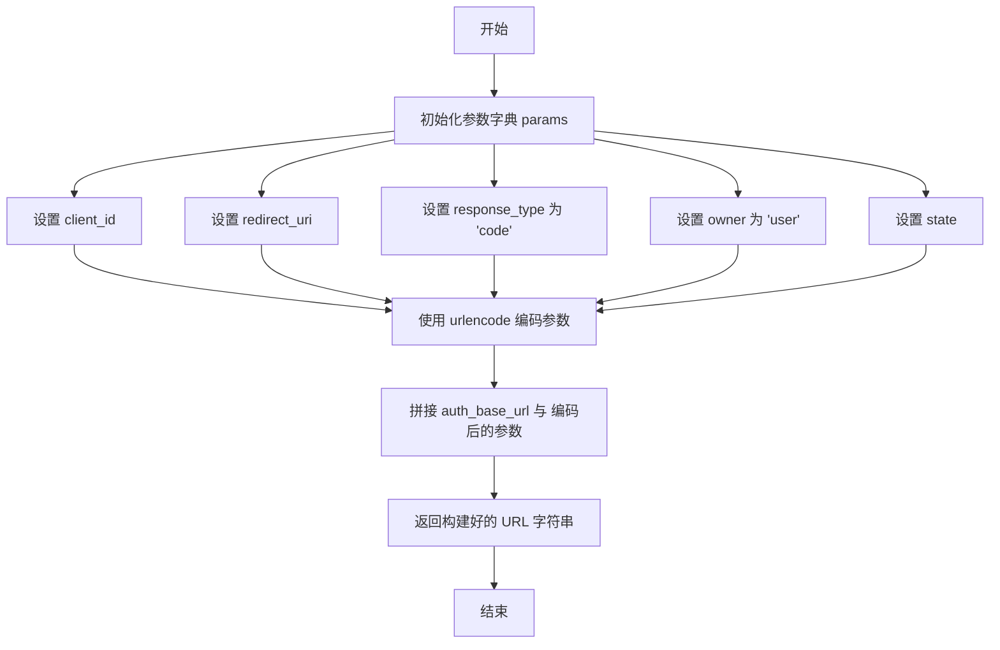
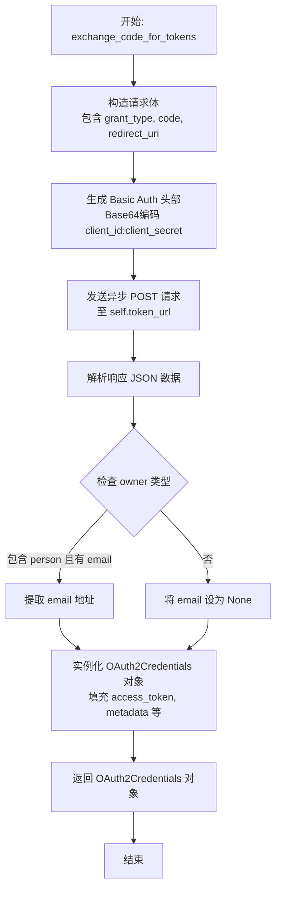
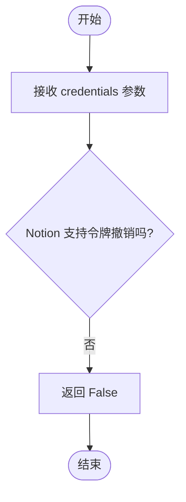
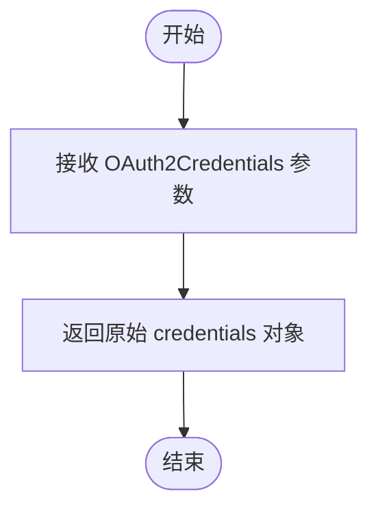
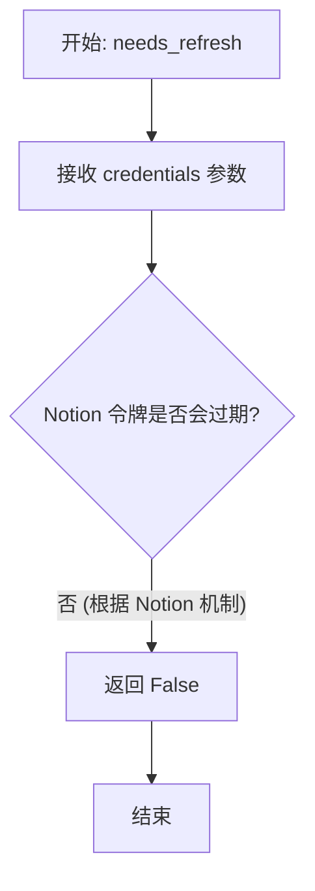

# `.\AutoGPT\autogpt_platform\backend\backend\integrations\oauth\notion.py` 详细设计文档

该代码实现了 Notion 服务商的 OAuth2 认证处理器，继承自 BaseOAuthHandler，负责生成登录链接、交换授权码获取访问令牌，并针对 Notion 令牌不过期、不支持刷新和撤销的特性进行了适配。

## 整体流程



## 类结构

```
BaseOAuthHandler (基类)
└── NotionOAuthHandler
```

## 全局变量及字段


### `NotionOAuthHandler.PROVIDER_NAME`
    
OAuth提供商名称标识，此处指定为Notion

类型：`ProviderName`
    


### `NotionOAuthHandler.client_id`
    
OAuth应用程序的客户端ID，用于识别应用身份

类型：`str`
    


### `NotionOAuthHandler.client_secret`
    
OAuth应用程序的客户端密钥，用于验证应用身份

类型：`str`
    


### `NotionOAuthHandler.redirect_uri`
    
OAuth授权完成后的回调重定向地址

类型：`str`
    


### `NotionOAuthHandler.auth_base_url`
    
Notion OAuth授权流程的起始URL端点

类型：`str`
    


### `NotionOAuthHandler.token_url`
    
用于将授权码交换为访问令牌的URL端点

类型：`str`
    
    

## 全局函数及方法


### `NotionOAuthHandler.__init__`

该方法用于初始化 Notion OAuth 处理程序实例，配置必要的客户端凭证（ID 和密钥）以及重定向 URI，同时设定 Notion 特定的授权和令牌获取端点地址。

参数：

- `client_id`：`str`，Notion 应用的客户端标识符，用于识别请求来源。
- `client_secret`：`str`，Notion 应用的客户端密钥，用于服务端验证。
- `redirect_uri`：`str`，OAuth 授权完成后的回调地址。

返回值：`None`，构造函数不返回任何值。

#### 流程图



#### 带注释源码

```python
def __init__(self, client_id: str, client_secret: str, redirect_uri: str):
    # 保存传入的客户端 ID，用于后续构建授权链接和令牌请求
    self.client_id = client_id
    # 保存传入的客户端密钥，用于生成 Basic Auth 头信息
    self.client_secret = client_secret
    # 保存传入的重定向 URI，必须与 Notion 应用配置中的一致
    self.redirect_uri = redirect_uri
    # 定义 Notion OAuth 授权页面的基础 URL
    self.auth_base_url = "https://api.notion.com/v1/oauth/authorize"
    # 定义 Notion 获取访问令牌的 API 端点 URL
    self.token_url = "https://api.notion.com/v1/oauth/token"
```


### `NotionOAuthHandler.get_login_url`

构建用于 Notion OAuth 2.0 授权流程的登录 URL。该方法组装必要的查询参数，包括客户端 ID、重定向 URI 和状态令牌，并将其附加到 Notion 的授权基础 URL 上以生成完整的认证链接。

参数：

- `scopes`：`list[str]`，请求的权限范围列表（注：尽管接收此参数，但根据 Notion 的特性及当前代码实现，该参数未被使用）。
- `state`：`str`，用于维护请求和回调之间状态的不透明值，主要用于防止 CSRF 攻击。
- `code_challenge`：`Optional[str]`，PKCE (Proof Key for Code Exchange) 代码挑战（注：当前实现中未使用此参数）。

返回值：`str`，格式化后的 Notion OAuth 授权 URL 字符串。

#### 流程图



#### 带注释源码

```python
def get_login_url(
    self, scopes: list[str], state: str, code_challenge: Optional[str]
) -> str:
    # 构建 OAuth 授权请求所需的参数字典
    # 注意：scopes 和 code_challenge 参数在当前实现中未被实际使用
    params = {
        "client_id": self.client_id,          # 应用程序客户端 ID
        "redirect_uri": self.redirect_uri,    # 授权后的回调地址
        "response_type": "code",              # 授权流程类型，固定为 code
        "owner": "user",                      # 所有者类型，固定为 user
        "state": state,                       # 状态参数，用于安全校验
    }
    # 将字典参数进行 URL 编码，并拼接到基础授权地址后
    return f"{self.auth_base_url}?{urlencode(params)}"
```


### `NotionOAuthHandler.exchange_code_for_tokens`

该方法负责完成 Notion OAuth2 认证流程的最后一环，利用从回调中获取的授权码，向 Notion 令牌端点发送请求以换取访问令牌，并将返回的用户信息及工作区元数据封装为标准的 `OAuth2Credentials` 对象。

参数：

- `code`：`str`，由 Notion 授权服务器重定向回应用时提供的授权码。
- `scopes`：`list[str]`，请求的权限范围列表（注：Notion 的实现中通常不使用 scopes，此参数在此方法体内未被实际传递）。
- `code_verifier`：`Optional[str]`，用于 PKCE (Proof Key for Code Exchange) 流程的代码验证器（注：Notion 的实现中此参数未被使用）。

返回值：`OAuth2Credentials`，包含访问令牌、工作区信息、用户邮箱（如有）及其他相关元数据的凭证对象。

#### 流程图



#### 带注释源码

```python
    async def exchange_code_for_tokens(
        self, code: str, scopes: list[str], code_verifier: Optional[str]
    ) -> OAuth2Credentials:
        # 1. 准备请求体数据，包含授权模式、授权码和重定向URI
        request_body = {
            "grant_type": "authorization_code",
            "code": code,
            "redirect_uri": self.redirect_uri,
        }
        # 2. 生成 HTTP Basic Authentication 头部，对 Client ID 和 Client Secret 进行 Base64 编码
        auth_str = b64encode(f"{self.client_id}:{self.client_secret}".encode()).decode()
        headers = {
            "Authorization": f"Basic {auth_str}",
            "Accept": "application/json",
        }
        # 3. 发送 POST 请求到 Notion 的令牌端点
        response = await Requests().post(
            self.token_url, json=request_body, headers=headers
        )
        # 4. 解析返回的 JSON 数据
        token_data = response.json()
        
        # 5. 尝试从响应中提取邮箱信息（仅对非机器人用户可用）
        # 使用安全的字典访问方式，防止因字段缺失而报错
        email = (
            token_data["owner"]["person"]["email"]
            if "person" in token_data["owner"]
            and "email" in token_data["owner"]["person"]
            else None
        )

        # 6. 构造并返回标准的 OAuth2Credentials 对象
        # 映射 Notion 特有的字段如 bot_id, workspace_id 到 metadata 中
        return OAuth2Credentials(
            provider=self.PROVIDER_NAME,
            title=token_data.get("workspace_name"),
            username=email,
            access_token=token_data["access_token"],
            refresh_token=None,                  # Notion token 不过期，无需 refresh token
            access_token_expires_at=None,        # Notion token 不过期
            refresh_token_expires_at=None,
            scopes=[],                           # Notion 不使用 scopes
            metadata={
                "owner": token_data["owner"],
                "bot_id": token_data["bot_id"],
                "workspace_id": token_data["workspace_id"],
                "workspace_name": token_data.get("workspace_name"),
                "workspace_icon": token_data.get("workspace_icon"),
            },
        )
```


### `NotionOAuthHandler.revoke_tokens`

该方法是 Notion OAuth 处理程序中用于撤销访问令牌的接口。由于 Notion API 官方不支持令牌撤销操作，该方法的具体实现为直接返回 `False`，表明操作未执行或不支持。

参数：

- `credentials`：`OAuth2Credentials`，包含待撤销的访问令牌及其相关元数据的凭证对象。

返回值：`bool`，表示令牌撤销操作的结果。由于 Notion 不支持此功能，始终返回 `False`。

#### 流程图



#### 带注释源码

```python
    async def revoke_tokens(self, credentials: OAuth2Credentials) -> bool:
        # Notion doesn't support token revocation
        # Notion 的 API 不支持令牌撤销功能，因此无法在服务器端使令牌失效
        return False
        # 返回 False 表示该操作未执行或平台不支持
```


### `NotionOAuthHandler._refresh_tokens`

用于刷新 Notion OAuth 访问令牌的内部方法。根据 Notion 的官方文档，其访问令牌不会过期且不支持刷新机制，因此该方法仅作为接口实现的占位符，直接返回传入的凭证对象而不执行任何实际操作。

参数：

-  `credentials`：`OAuth2Credentials`，包含当前访问令牌及相关元数据的 OAuth 凭证对象。

返回值：`OAuth2Credentials`，原始传入的凭证对象，表示无需刷新。

#### 流程图



#### 带注释源码

```python
async def _refresh_tokens(
    self, credentials: OAuth2Credentials
) -> OAuth2Credentials:
    # 注释：Notion 不支持令牌刷新（令牌是永久的）
    # 直接返回传入的凭证对象，不做任何处理
    return credentials
```


### `NotionOAuthHandler.needs_refresh`

该方法用于判断给定的 Notion OAuth 凭证是否需要刷新。根据 Notion 的授权机制，其访问令牌不会过期，因此该方法始终返回 False。

参数：

- `credentials`：`OAuth2Credentials`，待检查的 OAuth 凭证对象，包含访问令牌及其元数据。

返回值：`bool`，始终返回 `False`，表示 Notion 的访问令牌不需要刷新。

#### 流程图



#### 带注释源码

```python
    def needs_refresh(self, credentials: OAuth2Credentials) -> bool:
        # Notion access tokens don't expire
        # Notion 的访问令牌不会过期，因此永远不需要刷新
        return False
```


## 关键组件


### NotionOAuthHandler
负责处理 Notion 服务商 OAuth 2.0 认证流程的核心类，封装了授权链接生成、令牌交换逻辑以及适配 Notion 特有的非过期令牌策略。

### get_login_url
根据客户端配置和状态参数构建 Notion 授权页面的完整 URL，处理参数编码并忽略 Notion 不使用的权限范围。

### exchange_code_for_tokens
异步执行令牌交换逻辑，通过 HTTP Basic 认证向 Notion 发送授权码，解析响应并构建包含工作区元数据的标准化凭证对象。

### Token Lifecycle Stubs
针对令牌刷新和撤销功能的存根实现，明确反映了 Notion 访问令牌永不过期且不支持远程撤销的技术约束。


## 问题及建议


### 已知问题

-   `exchange_code_for_tokens` 方法中缺少对 HTTP 状态码的校验，直接解析 JSON 可能导致 `KeyError` 异常（例如当 API 返回错误响应 `{"error": "invalid_grant"}` 时，访问 `token_data["owner"]` 会报错）。
-   `get_login_url` 和 `exchange_code_for_tokens` 方法签名中包含了 `scopes` 和 `code_challenge`/`code_verifier` 参数，但实现中完全忽略了这些参数，这虽然符合 Notion 的特性，但会误导调用者认为这些参数生效了，违反了接口最小化原则。
-   `revoke_tokens` 方法仅返回 `False`，未抛出异常或记录日志，调用方无法明确区分是不支持该操作、操作失败还是凭证无效。

### 优化建议

-   将 `auth_base_url` 和 `token_url` 硬编码的字符串提取为类常量或配置项，以提高代码的可测试性和可维护性（例如方便在单元测试中进行 Mock）。
-   在 `exchange_code_for_tokens` 中增加异常处理逻辑，先检查 `response.status_code` 是否为 200，再进行解析，若失败则根据 API 返回的错误信息抛出特定的业务异常。
-   在关键流程（如交换 Token、获取登录 URL）中添加日志记录，记录入参和关键结果，便于追踪认证流程和排查线上问题。
-   使用 `dict.get` 方法链式调用或辅助函数来安全地提取嵌套字段（例如获取 `email` 的部分），以防止因 API 响应结构变化导致的潜在运行时异常。


## 其它


### 设计目标与约束

设计目标是实现一个符合 Notion OAuth 2.0 规范的处理器，用于处理用户认证、授权码换取令牌以及凭据管理。该类旨在继承自 `BaseOAuthHandler` 并提供 Notion 特定的实现细节。主要约束包括：

1.  **无刷新机制**：Notion 的访问令牌永不过期，因此不支持令牌刷新逻辑，`needs_refresh` 始终返回 `False`，`_refresh_tokens` 直接返回原凭据。
2.  **无作用域支持**：Notion 的授权流程不使用 Scopes 参数，生成登录 URL 时忽略传入的 `scopes` 列表。
3.  **无撤销支持**：Notion API 不提供令牌撤销端点，`revoke_tokens` 方法恒定返回 `False`。
4.  **API 依赖**：严格遵循 Notion 官方文档定义的端点地址和请求参数结构。

### 错误处理与异常设计

当前代码主要依赖于外部依赖库和底层框架的异常处理机制，其设计特点如下：

1.  **网络请求异常**：`Requests().post()` 可能会抛出网络超时或连接异常。当前实现未在方法内部显式捕获这些异常，而是将异常向上抛出，由调用方处理。
2.  **数据解析异常**：在 `exchange_code_for_tokens` 方法中，假设 `response.json()` 总是返回包含特定键（如 `access_token`, `bot_id`）的字典。如果 API 返回错误（如 4xx/5xx 响应体）或缺少必需字段，代码将抛出 `KeyError` 或 `JSONDecodeError`。
3.  **防御性编程**：对于可选字段 `email`，使用了条件判断和 `.get()` 方法来避免 `KeyError`，表明了对非机器人用户与机器人用户数据结构差异的考虑。

### 数据流与状态机

该类本身是无状态的，主要处理认证流程中的数据转换。整体数据流如下：

1.  **初始化阶段**：接收 `client_id`, `client_secret`, `redirect_uri` 配置，构建处理器实例。
2.  **发起授权**：调用 `get_login_url`，将配置参数编码为 URL 字符串，引导用户至 Notion 授权页面。
3.  **令牌交换**：
    *   用户授权后获得 `code`。
    *   调用 `exchange_code_for_tokens`，构建 Basic Auth 头部和请求体。
    *   发送 POST 请求至 Notion Token 端点。
    *   解析响应 JSON，提取 `access_token`, `owner`, `workspace_id` 等信息。
    *   封装为 `OAuth2Credentials` 对象返回。
4.  **维护阶段**：由于令牌永不过期，`needs_refresh` 始终阻断刷新流程，凭据状态保持稳定直至失效。

### 外部依赖与接口契约

该组件依赖于以下外部服务和内部模块，需遵守相应的接口契约：

1.  **Notion OAuth API**：
    *   **Authorization Endpoint**: `https://api.notion.com/v1/oauth/authorize`
    *   **Token Endpoint**: `https://api.notion.com/v1/oauth/token`
    *   **契约**：Token 端点要求使用 `Basic Auth`（Client ID:Client Secret）进行认证，请求体需包含 `grant_type`, `code`, `redirect_uri`。响应需包含 `access_token`, `bot_id`, `workspace_id`, `workspace_name`, `owner` 等字段。
2.  **内部依赖**：
    *   `backend.data.model.OAuth2Credentials`: 数据模型类，用于标准化返回的认证凭据结构。
    *   `backend.util.request.Requests`: HTTP 客户端工具类，用于执行异步 POST 请求，需支持 `json` 参数和 `headers` 设置。
    *   `backend.integrations.providers.ProviderName`: 枚举类，提供 `NOTION` 标识符。

    