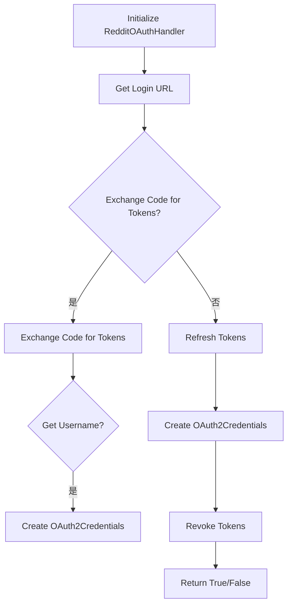
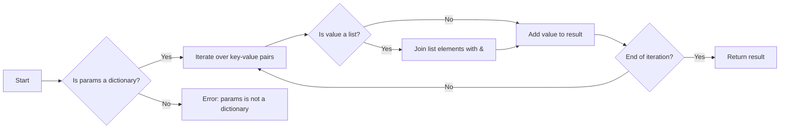
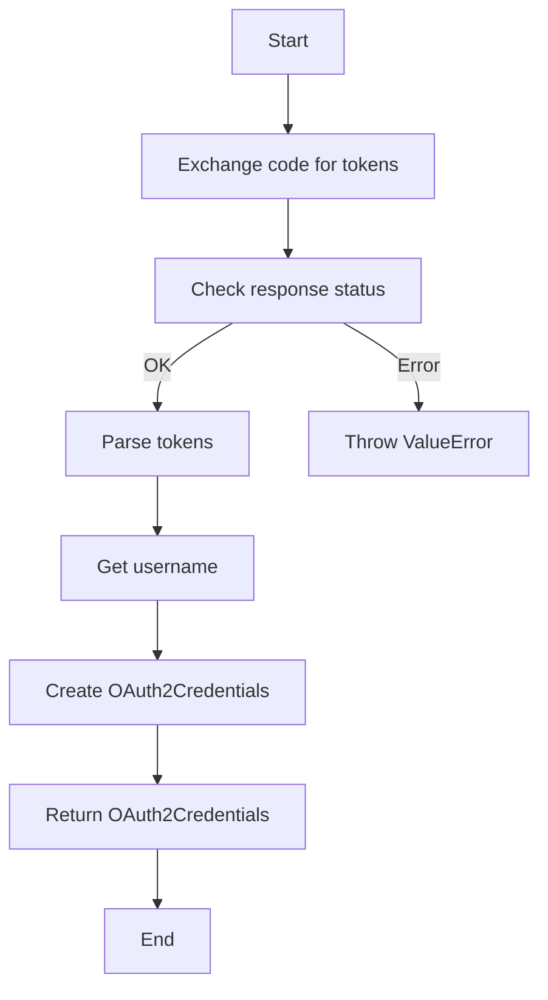
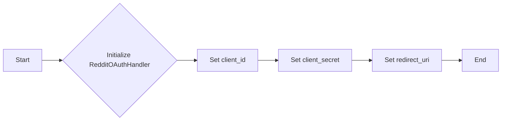
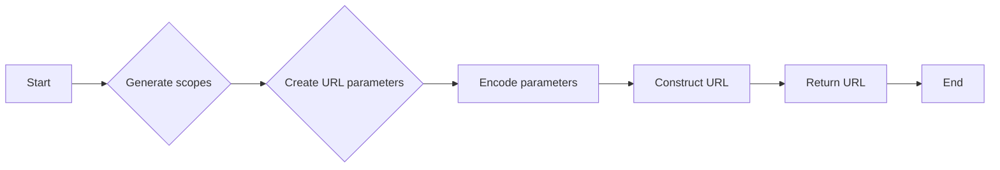
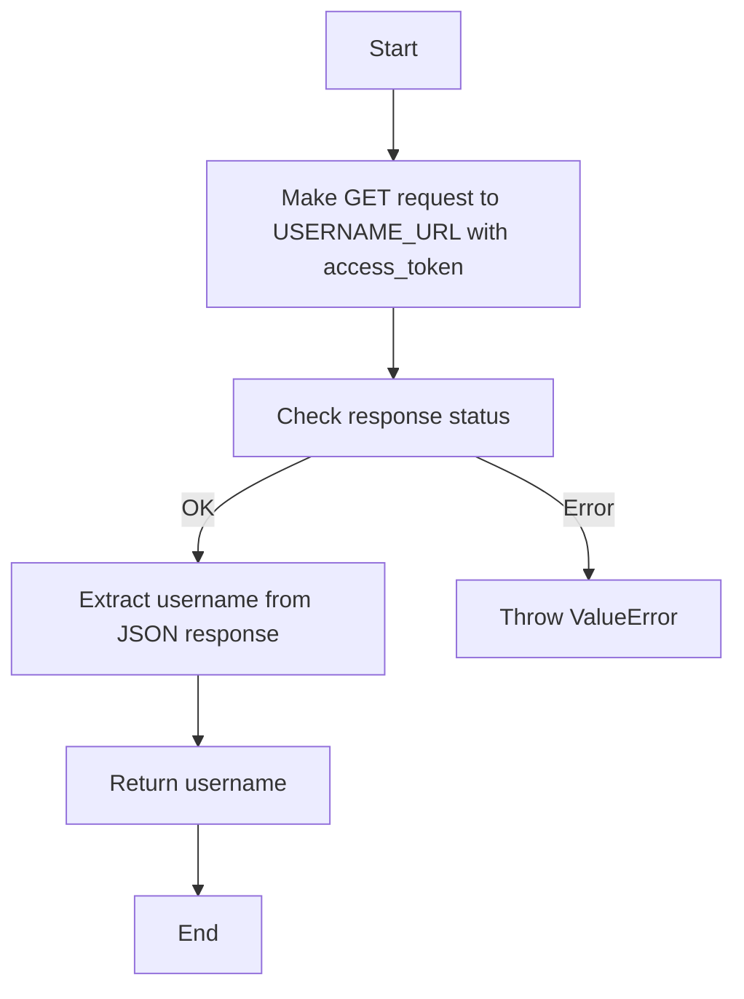
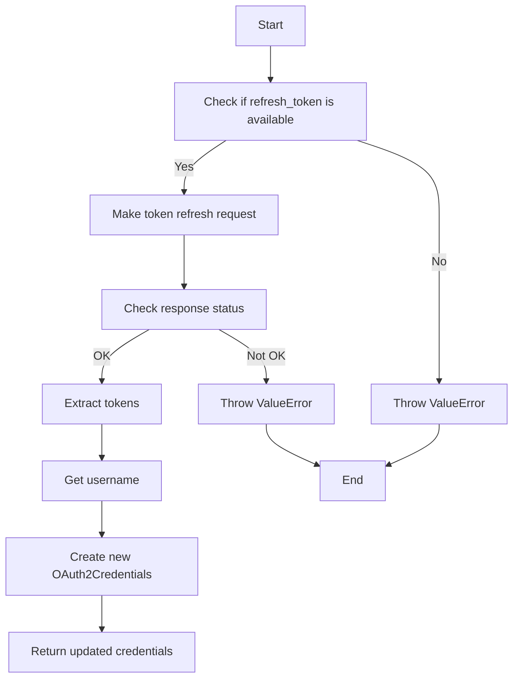
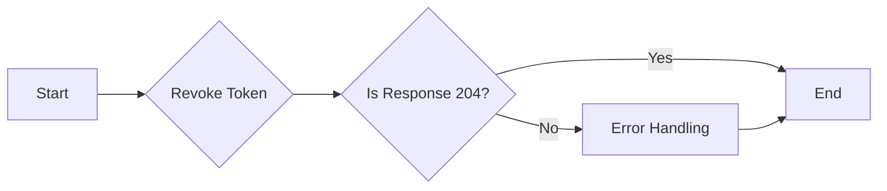

# `.\AutoGPT\autogpt_platform\backend\backend\integrations\oauth\reddit.py` 详细设计文档

The code provides an OAuth 2.0 handler for Reddit, handling authorization, token exchange, refresh, and revocation processes.

## 整体流程



## 类结构

```
RedditOAuthHandler (具体类)
├── BaseOAuthHandler (抽象基类)
```

## 全局变量及字段


### `settings`
    
Settings object containing configuration for Reddit OAuth handler.

类型：`Settings`
    


### `ProviderName`
    
Enum representing different OAuth providers.

类型：`ProviderName`
    


### `SecretStr`
    
Pydantic model for secret strings.

类型：`SecretStr`
    


### `OAuth2Credentials`
    
Pydantic model for OAuth 2.0 credentials.

类型：`OAuth2Credentials`
    


### `Requests`
    
Utility class for making HTTP requests.

类型：`Requests`
    


### `Settings`
    
Utility class for managing settings and configurations.

类型：`Settings`
    


### `RedditOAuthHandler.client_id`
    
Client ID for Reddit OAuth 2.0.

类型：`str`
    


### `RedditOAuthHandler.client_secret`
    
Client secret for Reddit OAuth 2.0.

类型：`str`
    


### `RedditOAuthHandler.redirect_uri`
    
Redirect URI for Reddit OAuth 2.0.

类型：`str`
    


### `RedditOAuthHandler.PROVIDER_NAME`
    
Class variable representing the provider name for Reddit OAuth 2.0.

类型：`ProviderName`
    


### `RedditOAuthHandler.DEFAULT_SCOPES`
    
Class variable representing the default scopes for Reddit OAuth 2.0.

类型：`list[str]`
    


### `RedditOAuthHandler.AUTHORIZE_URL`
    
Class variable representing the authorization URL for Reddit OAuth 2.0.

类型：`str`
    


### `RedditOAuthHandler.TOKEN_URL`
    
Class variable representing the token URL for Reddit OAuth 2.0.

类型：`str`
    


### `RedditOAuthHandler.USERNAME_URL`
    
Class variable representing the username URL for Reddit OAuth 2.0.

类型：`str`
    


### `RedditOAuthHandler.REVOKE_URL`
    
Class variable representing the revoke URL for Reddit OAuth 2.0.

类型：`str`
    
    

## 全局函数及方法


### urllib.parse.urlencode

This function is used to encode a dictionary of query parameters into a URL-encoded string.

参数：

- `params`：`dict[str, str | list[str]]`，A dictionary containing the query parameters to be encoded. The values can be either a single string or a list of strings.
- ...

返回值：`str`，A URL-encoded string representing the query parameters.

#### 流程图



#### 带注释源码

```python
import urllib.parse

def urlencode(params):
    # Check if params is a dictionary
    if not isinstance(params, dict):
        raise ValueError("params must be a dictionary")

    # Initialize an empty result string
    result = ""

    # Iterate over key-value pairs in the dictionary
    for key, value in params.items():
        # Check if the value is a list
        if isinstance(value, list):
            # Join list elements with &
            value = "&".join(value)
        else:
            # Add value to result
            value = str(value)

        # Append key-value pair to result
        result += f"{key}={value}&"

    # Remove the last & character
    return result[:-1]
```


### time.time()

获取当前时间的时间戳。

参数：

- 无

返回值：`float`，表示自1970年1月1日以来的秒数。

#### 流程图

```mermaid
graph TD
    A[Start] --> B{Is time.time() called?}
    B -- Yes --> C[Get current timestamp]
    B -- No --> D[End]
    C --> E[End]
```

#### 带注释源码

```python
import time

def time_time():
    """
    Get the current time as a timestamp.
    """
    return time.time()
```


### `RedditOAuthHandler.exchange_code_for_tokens`

This method exchanges an authorization code for access tokens.

参数：

- `code`：`str`，The authorization code received from Reddit.
- `scopes`：`list[str]`，The list of scopes to request.
- `code_verifier`：`Optional[str]`，The code verifier used for state verification (optional).

返回值：`OAuth2Credentials`，An instance of OAuth2Credentials containing the access and refresh tokens.

#### 流程图



#### 带注释源码

```python
async def exchange_code_for_tokens(
    self, code: str, scopes: list[str], code_verifier: Optional[str]
) -> OAuth2Credentials:
    """Exchange authorization code for access tokens"""
    scopes = self.handle_default_scopes(scopes)

    headers = {
        "Content-Type": "application/x-www-form-urlencoded",
        "User-Agent": settings.config.reddit_user_agent,
    }

    data = {
        "grant_type": "authorization_code",
        "code": code,
        "redirect_uri": self.redirect_uri,
    }

    # Reddit requires HTTP Basic Auth for token requests
    auth = (self.client_id, self.client_secret)

    response = await Requests().post(
        self.TOKEN_URL, headers=headers, data=data, auth=auth
    )

    if not response.ok:
        error_text = response.text()
        raise ValueError(
            f"Reddit token exchange failed: {response.status} - {error_text}"
        )

    tokens = response.json()

    if "error" in tokens:
        raise ValueError(f"Reddit OAuth error: {tokens.get('error')}")

    username = await self._get_username(tokens["access_token"])

    return OAuth2Credentials(
        provider=self.PROVIDER_NAME,
        title=None,
        username=username,
        access_token=tokens["access_token"],
        refresh_token=tokens.get("refresh_token"),
        access_token_expires_at=int(time.time()) + tokens.get("expires_in", 3600),
        refresh_token_expires_at=None,  # Reddit refresh tokens don't expire
        scopes=scopes,
    )
```


### RedditOAuthHandler.__init__

This method initializes a RedditOAuthHandler instance with the necessary credentials and redirect URI for OAuth 2.0 authentication with Reddit.

参数：

- `client_id`：`str`，The client ID provided by Reddit for OAuth 2.0 authentication.
- `client_secret`：`str`，The client secret provided by Reddit for OAuth 2.0 authentication.
- `redirect_uri`：`str`，The redirect URI where Reddit will send the authorization code after the user authorizes the application.

返回值：`None`，This method does not return any value.

#### 流程图



#### 带注释源码

```
def __init__(self, client_id: str, client_secret: str, redirect_uri: str):
    # Set the client ID
    self.client_id = client_id
    # Set the client secret
    self.client_secret = client_secret
    # Set the redirect URI
    self.redirect_uri = redirect_uri
```


### RedditOAuthHandler.get_login_url

Generate Reddit OAuth 2.0 authorization URL.

参数：

- `scopes`：`list[str]`，List of scopes to request from Reddit. Defaults to the class-defined DEFAULT_SCOPES.
- `state`：`str`，State parameter to prevent CSRF attacks.
- `code_challenge`：`Optional[str]`，Optional code challenge for PKCE flow.

返回值：`str`，Reddit OAuth 2.0 authorization URL.

#### 流程图



#### 带注释源码

```python
def get_login_url(
    self, scopes: list[str], state: str, code_challenge: Optional[str]
) -> str:
    """Generate Reddit OAuth 2.0 authorization URL"""
    scopes = self.handle_default_scopes(scopes)

    params = {
        "response_type": "code",
        "client_id": self.client_id,
        "redirect_uri": self.redirect_uri,
        "scope": " ".join(scopes),
        "state": state,
        "duration": "permanent",  # Required for refresh tokens
    }

    return f"{self.AUTHORIZE_URL}?{urllib.parse.urlencode(params)}"
```


### `RedditOAuthHandler.exchange_code_for_tokens`

This method exchanges an authorization code received from Reddit for access and refresh tokens.

参数：

- `code`：`str`，The authorization code received from Reddit.
- `scopes`：`list[str]`，The list of scopes to request from Reddit.
- `code_verifier`：`Optional[str]`，The code verifier used during the authorization process (optional).

返回值：`OAuth2Credentials`，An object containing the access and refresh tokens, along with other relevant information.

#### 流程图


#### 带注释源码

```python
async def exchange_code_for_tokens(
    self, code: str, scopes: list[str], code_verifier: Optional[str]
) -> OAuth2Credentials:
    """Exchange authorization code for access tokens"""
    scopes = self.handle_default_scopes(scopes)

    headers = {
        "Content-Type": "application/x-www-form-urlencoded",
        "User-Agent": settings.config.reddit_user_agent,
    }

    data = {
        "grant_type": "authorization_code",
        "code": code,
        "redirect_uri": self.redirect_uri,
    }

    # Reddit requires HTTP Basic Auth for token requests
    auth = (self.client_id, self.client_secret)

    response = await Requests().post(
        self.TOKEN_URL, headers=headers, data=data, auth=auth
    )

    if not response.ok:
        error_text = response.text()
        raise ValueError(
            f"Reddit token exchange failed: {response.status} - {error_text}"
        )

    tokens = response.json()

    if "error" in tokens:
        raise ValueError(f"Reddit OAuth error: {tokens.get('error')}")

    username = await self._get_username(tokens["access_token"])

    return OAuth2Credentials(
        provider=self.PROVIDER_NAME,
        title=None,
        username=username,
        access_token=tokens["access_token"],
        refresh_token=tokens.get("refresh_token"),
        access_token_expires_at=int(time.time()) + tokens.get("expires_in", 3600),
        refresh_token_expires_at=None,  # Reddit refresh tokens don't expire
        scopes=scopes,
    )
```


### RedditOAuthHandler._get_username

Get the username from the access token.

参数：

- `access_token`：`str`，The access token used to authenticate the request to the Reddit API.

返回值：`str`，The username associated with the access token.

#### 流程图



#### 带注释源码

```python
async def _get_username(self, access_token: str) -> str:
    """Get the username from the access token"""
    headers = {
        "Authorization": f"Bearer {access_token}",
        "User-Agent": settings.config.reddit_user_agent,
    }

    response = await Requests().get(self.USERNAME_URL, headers=headers)

    if not response.ok:
        raise ValueError(f"Failed to get Reddit username: {response.status}")

    data = response.json()
    return data.get("name", "unknown")
```


### RedditOAuthHandler._refresh_tokens

Refreshes access tokens using a refresh token.

参数：

- `credentials`：`OAuth2Credentials`，The OAuth2 credentials containing the refresh token to be used for refreshing the access token.

返回值：`OAuth2Credentials`，The updated OAuth2 credentials with the new access token.

#### 流程图



#### 带注释源码

```python
async def _refresh_tokens(self, credentials: OAuth2Credentials) -> OAuth2Credentials:
    """Refresh access tokens using refresh token"""
    if not credentials.refresh_token:
        raise ValueError("No refresh token available")

    headers = {
        "Content-Type": "application/x-www-form-urlencoded",
        "User-Agent": settings.config.reddit_user_agent,
    }

    data = {
        "grant_type": "refresh_token",
        "refresh_token": credentials.refresh_token.get_secret_value(),
    }

    auth = (self.client_id, self.client_secret)

    response = await Requests().post(
        self.TOKEN_URL, headers=headers, data=data, auth=auth
    )

    if not response.ok:
        error_text = response.text()
        raise ValueError(
            f"Reddit token refresh failed: {response.status} - {error_text}"
        )

    tokens = response.json()

    if "error" in tokens:
        raise ValueError(f"Reddit OAuth error: {tokens.get('error')}")

    username = await self._get_username(tokens["access_token"])

    # Reddit may or may not return a new refresh token
    new_refresh_token = tokens.get("refresh_token")
    if new_refresh_token:
        refresh_token: SecretStr | None = SecretStr(new_refresh_token)
    elif credentials.refresh_token:
        # Keep the existing refresh token
        refresh_token = credentials.refresh_token
    else:
        refresh_token = None

    return OAuth2Credentials(
        id=credentials.id,
        provider=self.PROVIDER_NAME,
        title=credentials.title,
        username=username,
        access_token=tokens["access_token"],
        refresh_token=refresh_token,
        access_token_expires_at=int(time.time()) + tokens.get("expires_in", 3600),
        refresh_token_expires_at=None,
        scopes=credentials.scopes,
    )
```


### `RedditOAuthHandler.revoke_tokens`

Revoke the access token for a given OAuth2Credentials object.

参数：

- `credentials`：`OAuth2Credentials`，The OAuth2Credentials object containing the access token to be revoked.

返回值：`bool`，Indicates whether the token revocation was successful.

#### 流程图



#### 带注释源码

```python
async def revoke_tokens(self, credentials: OAuth2Credentials) -> bool:
    """Revoke the access token"""
    headers = {
        "Content-Type": "application/x-www-form-urlencoded",
        "User-Agent": settings.config.reddit_user_agent,
    }

    data = {
        "token": credentials.access_token.get_secret_value(),
        "token_type_hint": "access_token",
    }

    auth = (self.client_id, self.client_secret)

    response = await Requests().post(
        self.REVOKE_URL, headers=headers, data=data, auth=auth
    )

    # Reddit returns 204 No Content on successful revocation
    return response.ok
```


## 关键组件


### RedditOAuthHandler

Reddit OAuth 2.0 handler.

### PROVIDER_NAME

Provider name constant for Reddit.

### DEFAULT_SCOPES

Default scopes for Reddit OAuth 2.0.

### AUTHORIZE_URL

URL for Reddit OAuth 2.0 authorization.

### TOKEN_URL

URL for Reddit OAuth 2.0 token exchange.

### USERNAME_URL

URL to get the username from the access token.

### REVOKE_URL

URL to revoke Reddit OAuth 2.0 tokens.

### client_id

Client ID for Reddit OAuth 2.0.

### client_secret

Client secret for Reddit OAuth 2.0.

### redirect_uri

Redirect URI for Reddit OAuth 2.0.

### get_login_url

Generate Reddit OAuth 2.0 authorization URL.

### exchange_code_for_tokens

Exchange authorization code for access tokens.

### _get_username

Get the username from the access token.

### _refresh_tokens

Refresh access tokens using refresh token.

### revoke_tokens

Revoke the access token.


## 问题及建议


### 已知问题

-   **异步请求处理**: 代码中使用了 `asyncio` 库进行异步请求处理，但未在类中声明 `__aenter__` 和 `__aexit__` 方法，这可能导致资源管理问题。
-   **错误处理**: 代码中在请求失败时抛出了 `ValueError`，但没有提供更详细的错误信息，这可能会影响调试和错误追踪。
-   **代码重复**: 在 `exchange_code_for_tokens` 和 `_refresh_tokens` 方法中，有重复的代码用于构建请求头和数据，可以考虑提取为公共方法以减少重复。
-   **全局变量**: 使用 `settings` 作为全局变量，这可能导致配置管理问题，特别是在多线程环境中。

### 优化建议

-   **资源管理**: 在类中实现 `__aenter__` 和 `__aexit__` 方法，确保异步资源被正确管理。
-   **错误信息**: 在抛出异常时提供更详细的错误信息，包括请求状态码和响应内容。
-   **代码重构**: 将重复的代码提取为公共方法，以减少代码重复并提高可维护性。
-   **配置管理**: 考虑使用依赖注入或配置对象来管理配置，以避免使用全局变量。
-   **单元测试**: 为异步方法编写单元测试，确保异步逻辑的正确性。
-   **文档**: 为类和方法添加更详细的文档，包括参数和返回值的描述。


## 其它


### 设计目标与约束

- 设计目标：
  - 实现Reddit OAuth 2.0认证流程。
  - 提供获取登录URL、交换授权码、刷新令牌、获取用户名、撤销令牌的功能。
  - 确保安全性，如使用HTTP Basic Auth和User-Agent头部。
  - 支持刷新令牌，以延长访问令牌的有效期。

- 约束：
  - 必须遵循Reddit OAuth 2.0规范。
  - 使用永久令牌以获取刷新令牌。
  - 令牌过期后需要刷新。
  - 必须处理Reddit返回的错误。

### 错误处理与异常设计

- 错误处理：
  - 使用`ValueError`来处理Reddit API返回的错误。
  - 在网络请求失败时抛出异常。
  - 在令牌交换或刷新失败时抛出异常。

- 异常设计：
  - 定义自定义异常类，如`RedditOAuthError`，以提供更具体的错误信息。

### 数据流与状态机

- 数据流：
  - 用户请求登录URL。
  - 用户在Reddit授权页面授权。
  - Reddit返回授权码。
  - 应用程序交换授权码以获取访问令牌和刷新令牌。
  - 使用访问令牌进行API调用。
  - 使用刷新令牌刷新访问令牌。

- 状态机：
  - 状态包括：未授权、已授权、令牌交换成功、令牌交换失败、令牌刷新成功、令牌刷新失败。

### 外部依赖与接口契约

- 外部依赖：
  - `pydantic`用于数据验证。
  - `aiohttp`用于异步HTTP请求。
  - `backend.util.request.Requests`用于发送HTTP请求。

- 接口契约：
  - `BaseOAuthHandler`基类定义了OAuth处理器的接口。
  - `OAuth2Credentials`类定义了OAuth令牌的接口。
  - `Settings`类提供配置设置。


    