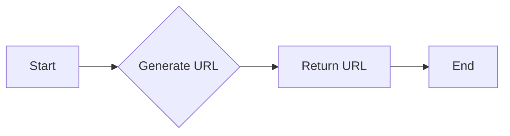
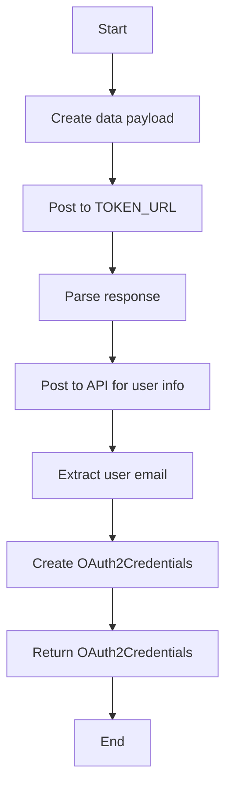
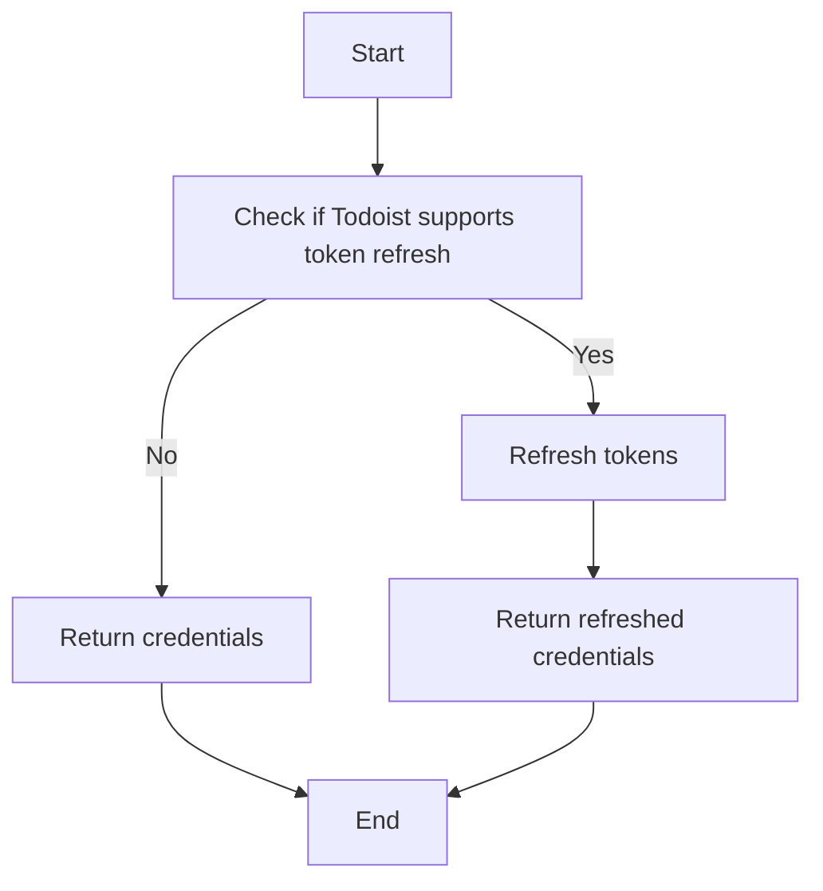
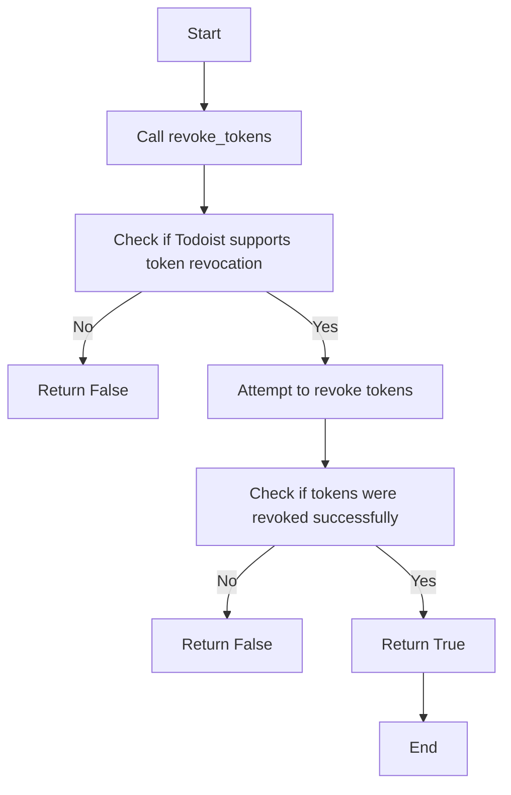

# `.\AutoGPT\autogpt_platform\backend\backend\integrations\oauth\todoist.py` 详细设计文档

The code provides an OAuth2 handler for Todoist, handling authorization, token exchange, and token revocation processes.

## 整体流程

```mermaid
graph TD
    A[初始化 TodoistOAuthHandler] --> B[获取登录 URL]
    B --> C{用户授权并获取 code?}
    C -- 是 --> D[交换 code 获取 tokens]
    D --> E{获取用户信息?}
    E -- 是 --> F[返回 OAuth2Credentials]
    E -- 否 --> G[记录错误]
    F --> H[刷新 tokens (不支持)]
    H --> I[撤销 tokens (不支持)]
    I --> J[返回 False]
```

## 类结构

```
TodoistOAuthHandler (类)
├── OAuth2Credentials (类)
├── ProviderName (枚举)
└── Requests (类)
```

## 全局变量及字段


### `PROVIDER_NAME`
    
The provider name for Todoist OAuth2 integration.

类型：`ProviderName.TODOIST`
    


### `DEFAULT_SCOPES`
    
The default scopes for the Todoist OAuth2 integration.

类型：`list[str]`
    


### `AUTHORIZE_URL`
    
The URL to authorize the user with Todoist.

类型：`str`
    


### `TOKEN_URL`
    
The URL to exchange the authorization code for access tokens with Todoist.

类型：`str`
    


### `client_id`
    
The client ID for the Todoist OAuth2 application.

类型：`str`
    


### `client_secret`
    
The client secret for the Todoist OAuth2 application.

类型：`str`
    


### `redirect_uri`
    
The redirect URI for the Todoist OAuth2 application.

类型：`str`
    


### `provider`
    
The provider of the OAuth2 credentials.

类型：`ProviderName`
    


### `title`
    
The title of the OAuth2 credentials.

类型：`Optional[str]`
    


### `username`
    
The username associated with the OAuth2 credentials.

类型：`str`
    


### `access_token`
    
The access token for the OAuth2 credentials.

类型：`str`
    


### `refresh_token`
    
The refresh token for the OAuth2 credentials.

类型：`Optional[str]`
    


### `access_token_expires_at`
    
The timestamp when the access token expires.

类型：`Optional[int]`
    


### `refresh_token_expires_at`
    
The timestamp when the refresh token expires.

类型：`Optional[int]`
    


### `scopes`
    
The scopes of the OAuth2 credentials.

类型：`list[str]`
    


### `TodoistOAuthHandler.client_id`
    
The client ID for the Todoist OAuth2 application.

类型：`str`
    


### `TodoistOAuthHandler.client_secret`
    
The client secret for the Todoist OAuth2 application.

类型：`str`
    


### `TodoistOAuthHandler.redirect_uri`
    
The redirect URI for the Todoist OAuth2 application.

类型：`str`
    


### `OAuth2Credentials.provider`
    
The provider of the OAuth2 credentials.

类型：`ProviderName`
    


### `OAuth2Credentials.title`
    
The title of the OAuth2 credentials.

类型：`Optional[str]`
    


### `OAuth2Credentials.username`
    
The username associated with the OAuth2 credentials.

类型：`str`
    


### `OAuth2Credentials.access_token`
    
The access token for the OAuth2 credentials.

类型：`str`
    


### `OAuth2Credentials.refresh_token`
    
The refresh token for the OAuth2 credentials.

类型：`Optional[str]`
    


### `OAuth2Credentials.access_token_expires_at`
    
The timestamp when the access token expires.

类型：`Optional[int]`
    


### `OAuth2Credentials.refresh_token_expires_at`
    
The timestamp when the refresh token expires.

类型：`Optional[int]`
    


### `OAuth2Credentials.scopes`
    
The scopes of the OAuth2 credentials.

类型：`list[str]`
    
    

## 全局函数及方法


### `TodoistOAuthHandler.__init__`

初始化TodoistOAuthHandler类实例，设置客户端ID、客户端密钥和重定向URI。

参数：

- `client_id`：`str`，Todoist OAuth客户端的ID。
- `client_secret`：`str`，Todoist OAuth客户端的密钥。
- `redirect_uri`：`str`，Todoist OAuth授权流程中使用的重定向URI。

返回值：无

#### 流程图

```mermaid
classDiagram
    TodoistOAuthHandler <|-- BaseOAuthHandler
    TodoistOAuthHandler {
        client_id : str
        client_secret : str
        redirect_uri : str
        PROVIDER_NAME : ProviderName
        DEFAULT_SCOPES : list[str]
        AUTHORIZE_URL : str
        TOKEN_URL : str
    }
    TodoistOAuthHandler +--init(client_id: str, client_secret: str, redirect_uri: str)
```

#### 带注释源码

```python
def __init__(self, client_id: str, client_secret: str, redirect_uri: str):
    # 设置客户端ID
    self.client_id = client_id
    # 设置客户端密钥
    self.client_secret = client_secret
    # 设置重定向URI
    self.redirect_uri = redirect_uri
```


### TodoistOAuthHandler.get_login_url

This method generates the login URL for the Todoist OAuth2 authentication process.

参数：

- `scopes`：`list[str]`，A list of scopes to request from the Todoist API.
- `state`：`str`，A state parameter used to prevent CSRF attacks.
- `code_challenge`：`Optional[str]`，An optional code challenge for additional security.

返回值：`str`，The generated login URL for the Todoist OAuth2 authentication.

#### 流程图



#### 带注释源码

```python
def get_login_url(self, scopes: list[str], state: str, code_challenge: Optional[str] = None) -> str:
    params = {
        "client_id": self.client_id,
        "scope": ",".join(self.DEFAULT_SCOPES),
        "state": state,
    }

    return f"{self.AUTHORIZE_URL}?{urllib.parse.urlencode(params)}"
```


### `TodoistOAuthHandler.exchange_code_for_tokens`

该函数用于将授权码交换为访问令牌。

参数：

- `code`：`str`，授权码，用于从Todoist获取访问令牌。
- `scopes`：`list[str]`，授权范围，指定应用程序请求的权限。
- `code_verifier`：`Optional[str]`，可选参数，用于保护授权码。

返回值：`OAuth2Credentials`，包含访问令牌、刷新令牌和其他相关信息的对象。

#### 流程图



#### 带注释源码

```python
async def exchange_code_for_tokens(
    self, code: str, scopes: list[str], code_verifier: Optional[str]
) -> OAuth2Credentials:
    """Exchange authorization code for access tokens"""

    data = {
        "client_id": self.client_id,
        "client_secret": self.client_secret,
        "code": code,
        "redirect_uri": self.redirect_uri,
    }

    response = await Requests().post(self.TOKEN_URL, data=data)
    tokens = response.json()

    response = await Requests().post(
        "https://api.todoist.com/sync/v9/sync",
        headers={"Authorization": f"Bearer {tokens['access_token']}"},
        data={"sync_token": "*", "resource_types": '["user"]'},
    )
    user_info = response.json()
    user_email = user_info["user"].get("email")

    return OAuth2Credentials(
        provider=self.PROVIDER_NAME,
        title=None,
        username=user_email,
        access_token=tokens["access_token"],
        refresh_token=None,
        access_token_expires_at=None,
        refresh_token_expires_at=None,
        scopes=scopes,
    )
```


### `_refresh_tokens`

This method is intended to refresh the access tokens for the Todoist OAuth handler. However, it currently returns the same credentials without refreshing the tokens, as Todoist does not support token refresh.

参数：

- `credentials`：`OAuth2Credentials`，The OAuth2 credentials object containing the current access and refresh tokens.

返回值：`OAuth2Credentials`，The same OAuth2 credentials object, as no refresh is performed.

#### 流程图



#### 带注释源码

```
async def _refresh_tokens(self, credentials: OAuth2Credentials) -> OAuth2Credentials:
    # Todoist does not support token refresh
    return credentials
```


### `TodoistOAuthHandler.revoke_tokens`

Revoke the access tokens associated with a given OAuth2Credentials object.

参数：

- `credentials`：`OAuth2Credentials`，The OAuth2Credentials object containing the access and refresh tokens to be revoked.

返回值：`bool`，Indicates whether the tokens were successfully revoked. Returns `False` as Todoist does not support token revocation.

#### 流程图



#### 带注释源码

```python
async def revoke_tokens(self, credentials: OAuth2Credentials) -> bool:
    # Todoist does not support token revocation, so we return False
    return False
```


## 关键组件


### TodoistOAuthHandler

TodoistOAuthHandler is a class that handles OAuth2 authentication for the Todoist service, providing methods to get login URLs, exchange authorization codes for access tokens, refresh tokens (not supported by Todoist), and revoke tokens.

### PROVIDER_NAME

ProviderName.TODOIST

Represents the provider name for Todoist OAuth2 authentication.

### DEFAULT_SCOPES

ClassVar[list[str]]

A list of default scopes for the Todoist OAuth2 authentication.

### AUTHORIZE_URL

str

The URL for initiating the OAuth2 authorization process with Todoist.

### TOKEN_URL

str

The URL for exchanging the authorization code for access tokens with Todoist.

### client_id

str

The client ID provided by Todoist for OAuth2 authentication.

### client_secret

str

The client secret provided by Todoist for OAuth2 authentication.

### redirect_uri

str

The redirect URI where Todoist will send the authorization code after the user authorizes the application.

### get_login_url

str

Generates the login URL for initiating the OAuth2 authorization process with Todoist.

- **scopes**: list[str]
  The list of scopes to request during the authorization process.
- **state**: str
  A state parameter used to prevent CSRF attacks.
- **code_challenge**: Optional[str]
  A code challenge used for code exchange.

### exchange_code_for_tokens

OAuth2Credentials

Exchanges the authorization code for access tokens and user information.

- **code**: str
  The authorization code received from Todoist.
- **scopes**: list[str]
  The list of scopes to request during the authorization process.
- **code_verifier**: Optional[str]
  A code verifier used for code exchange.

### _refresh_tokens

OAuth2Credentials

Refreshes the access tokens (Todoist does not support token refresh).

- **credentials**: OAuth2Credentials
  The OAuth2 credentials to refresh.

### revoke_tokens

bool

Revokes the access and refresh tokens (Todoist does not support token revocation).

- **credentials**: OAuth2Credentials
  The OAuth2 credentials to revoke.


## 问题及建议


### 已知问题

-   {问题1}：代码中存在一个注释为 "Todoist does not support token refresh" 的方法 `_refresh_tokens`，但该方法直接返回了传入的 `credentials` 对象。这表明虽然方法存在，但实际上并没有实现刷新令牌的功能，这可能导致令牌过期后无法自动续期。
-   {问题2}：`exchange_code_for_tokens` 方法中，虽然使用了 `await Requests().post` 来发送请求，但没有处理可能的异常。如果网络请求失败或服务器响应错误，代码将抛出异常，而没有提供任何错误处理机制。
-   {问题3}：`revoke_tokens` 方法返回 `False`，表明它没有实现撤销令牌的功能。如果需要撤销令牌，这个方法应该提供相应的逻辑。

### 优化建议

-   {建议1}：实现 `_refresh_tokens` 方法，以便在令牌过期时能够刷新访问令牌。如果Todoist API支持刷新令牌，应该根据API文档实现相应的逻辑。
-   {建议2}：在 `exchange_code_for_tokens` 方法中添加异常处理，确保在请求失败时能够捕获异常并返回适当的错误信息。
-   {建议3}：实现 `revoke_tokens` 方法，以便能够撤销令牌。这可能需要向Todoist API发送特定的请求，并处理响应。
-   {建议4}：考虑将 `Requests` 类的使用替换为异步请求库，如 `aiohttp`，以提供更好的异步支持，并简化代码。
-   {建议5}：在类和方法中添加适当的日志记录，以便于调试和监控。


## 其它


### 设计目标与约束

- 设计目标：
  - 实现一个用于Todoist OAuth认证的处理器。
  - 提供获取登录URL、交换授权码获取令牌、刷新令牌和撤销令牌的功能。
  - 确保处理器的安全性，防止未经授权的访问。
- 约束：
  - 必须遵循Todoist的OAuth认证流程。
  - 代码应易于维护和扩展。
  - 应处理可能的异常和错误情况。

### 错误处理与异常设计

- 错误处理：
  - 对于网络请求失败，应捕获异常并返回适当的错误信息。
  - 对于不正确的参数或响应，应返回相应的错误代码和消息。
- 异常设计：
  - 使用try-except块捕获可能的异常，如网络异常、JSON解析异常等。
  - 定义自定义异常类，以便更清晰地表示和处理特定错误情况。

### 数据流与状态机

- 数据流：
  - 用户请求登录URL，系统返回包含授权码的URL。
  - 用户在Todoist授权页面授权，返回授权码。
  - 系统使用授权码交换令牌，获取访问和刷新令牌。
  - 系统使用访问令牌获取用户信息。
- 状态机：
  - 状态包括：未认证、认证中、已认证、认证失败。
  - 状态转换由用户操作和系统响应触发。

### 外部依赖与接口契约

- 外部依赖：
  - `urllib.parse`：用于URL编码和解码。
  - `typing`：用于类型注解。
  - `backend.data.model`：用于OAuth2Credentials和ProviderName。
  - `backend.integrations.oauth.base`：用于BaseOAuthHandler。
  - `backend.util.request`：用于Requests。
- 接口契约：
  - `BaseOAuthHandler`：定义了OAuth处理器的基类接口。
  - `OAuth2Credentials`：定义了OAuth2令牌的属性和接口。
  - `ProviderName`：定义了OAuth提供者的名称枚举。
  - `Requests`：定义了网络请求的接口。


    