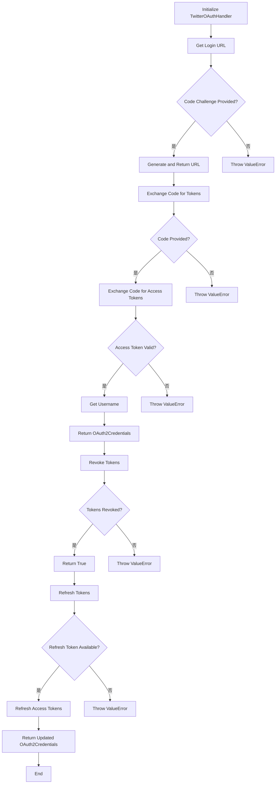
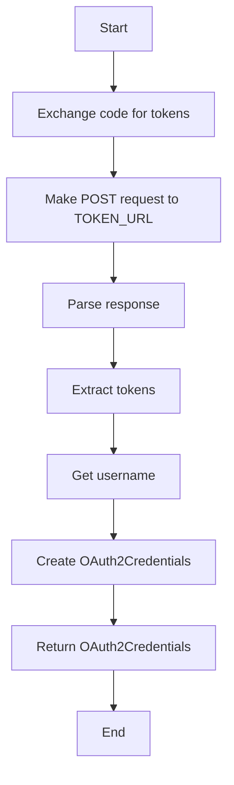
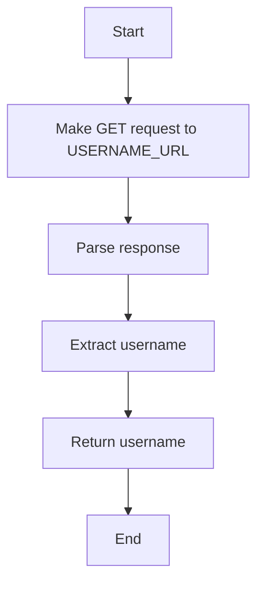
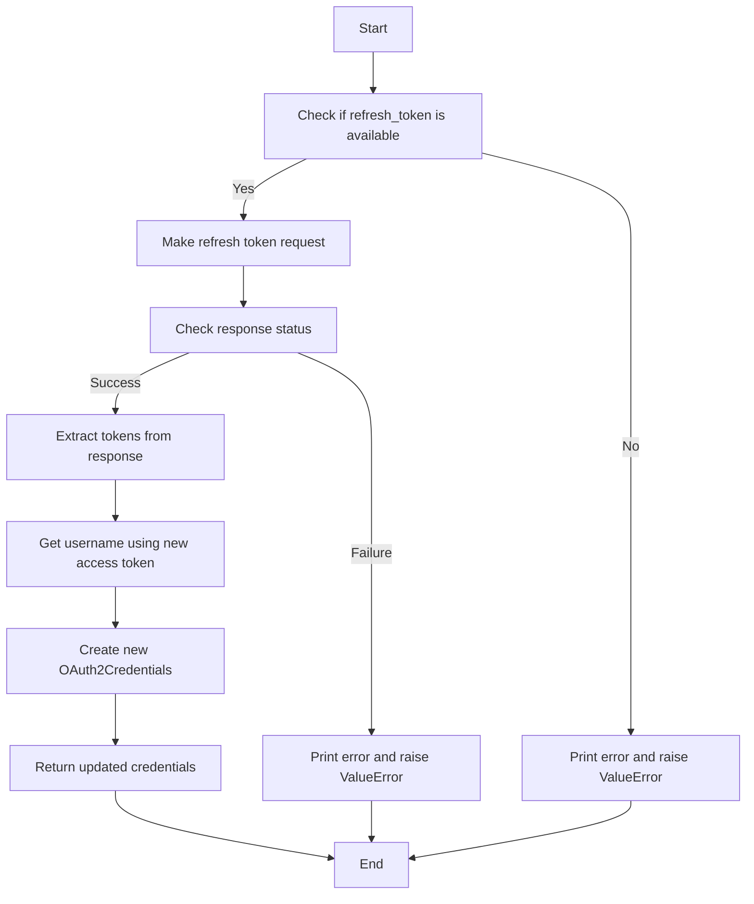
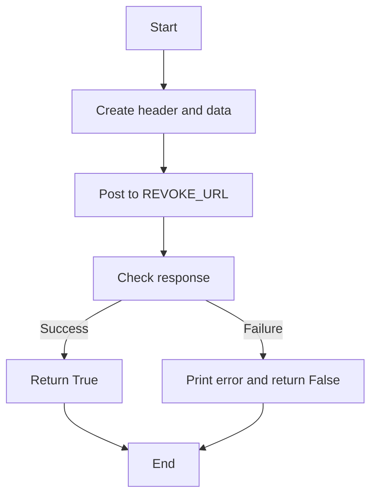

# `.\AutoGPT\autogpt_platform\backend\backend\integrations\oauth\twitter.py` 详细设计文档

The code provides an OAuth 2.0 handler for Twitter, handling authorization, token exchange, username retrieval, token refresh, and token revocation.

## 整体流程



## 类结构

```
TwitterOAuthHandler (类)
├── OAuth2Credentials (类)
├── ProviderName (枚举)
├── Requests (类)
└── BaseOAuthHandler (类)
```

## 全局变量及字段


### `PROVIDER_NAME`
    
The provider name for Twitter OAuth.

类型：`ProviderName`
    


### `DEFAULT_SCOPES`
    
The default scopes for Twitter OAuth.

类型：`list[str]`
    


### `AUTHORIZE_URL`
    
The URL for authorizing the user with Twitter.

类型：`str`
    


### `TOKEN_URL`
    
The URL for obtaining access tokens from Twitter.

类型：`str`
    


### `USERNAME_URL`
    
The URL for retrieving the username from Twitter using the access token.

类型：`str`
    


### `REVOKE_URL`
    
The URL for revoking access tokens from Twitter.

类型：`str`
    


### `TwitterOAuthHandler.client_id`
    
The client ID for the Twitter OAuth application.

类型：`str`
    


### `TwitterOAuthHandler.client_secret`
    
The client secret for the Twitter OAuth application.

类型：`str`
    


### `TwitterOAuthHandler.redirect_uri`
    
The redirect URI for the Twitter OAuth application.

类型：`str`
    


### `OAuth2Credentials.provider`
    
The provider name of the OAuth2 credentials.

类型：`ProviderName`
    


### `OAuth2Credentials.title`
    
The title of the OAuth2 credentials, if available.

类型：`Optional[str]`
    


### `OAuth2Credentials.username`
    
The username associated with the OAuth2 credentials.

类型：`str`
    


### `OAuth2Credentials.access_token`
    
The access token for the OAuth2 credentials.

类型：`str`
    


### `OAuth2Credentials.refresh_token`
    
The refresh token for the OAuth2 credentials, if available.

类型：`Optional[str]`
    


### `OAuth2Credentials.access_token_expires_at`
    
The timestamp when the access token expires.

类型：`int`
    


### `OAuth2Credentials.refresh_token_expires_at`
    
The timestamp when the refresh token expires, if available.

类型：`Optional[int]`
    


### `OAuth2Credentials.scopes`
    
The scopes of the OAuth2 credentials.

类型：`list[str]`
    
    

## 全局函数及方法


### `TwitterOAuthHandler.__init__`

Initialize a TwitterOAuthHandler instance.

参数：

- `client_id`：`str`，Twitter application client ID.
- `client_secret`：`str`，Twitter application client secret.
- `redirect_uri`：`str`，Redirect URI for the Twitter OAuth flow.

返回值：无

#### 流程图

```mermaid
classDiagram
    TwitterOAuthHandler <|-- BaseOAuthHandler
    TwitterOAuthHandler {
        +client_id: str
        +client_secret: str
        +redirect_uri: str
        +PROVIDER_NAME: ProviderName
        +DEFAULT_SCOPES: list[str]
        +AUTHORIZE_URL: str
        +TOKEN_URL: str
        +USERNAME_URL: str
        +REVOKE_URL: str
        +__init__(client_id: str, client_secret: str, redirect_uri: str)
        +get_login_url(scopes: list[str], state: str, code_challenge: Optional[str]): str
        +exchange_code_for_tokens(code: str, scopes: list[str], code_verifier: Optional[str]): OAuth2Credentials
        +_get_username(access_token: str): str
        +_refresh_tokens(credentials: OAuth2Credentials): OAuth2Credentials
        +revoke_tokens(credentials: OAuth2Credentials): bool
    }
```

#### 带注释源码

```python
def __init__(self, client_id: str, client_secret: str, redirect_uri: str):
    self.client_id = client_id  # Twitter application client ID
    self.client_secret = client_secret  # Twitter application client secret
    self.redirect_uri = redirect_uri  # Redirect URI for the Twitter OAuth flow
```


### TwitterOAuthHandler.get_login_url

Generate Twitter OAuth 2.0 authorization URL

参数：

- `scopes`：`list[str]`，A list of scopes to request from Twitter
- `state`：`str`，A state parameter used to prevent CSRF attacks
- `code_challenge`：`Optional[str]`，A code challenge used for PKCE (Proof Key for Code Exchange)

返回值：`str`，The authorization URL for Twitter OAuth 2.0

#### 流程图

```mermaid
graph TD
    A[Start] --> B[Check code_challenge]
    B -- Yes --> C[Create params]
    B -- No --> D[Throw ValueError]
    C --> E[Join DEFAULT_SCOPES with scopes]
    E --> F[Encode params]
    F --> G[Return f"{AUTHORIZE_URL}?{params}"]
    G --> H[End]
```

#### 带注释源码

```python
def get_login_url(self, scopes: list[str], state: str, code_challenge: Optional[str]) -> str:
    """Generate Twitter OAuth 2.0 authorization URL"""
    if code_challenge is None:
        raise ValueError("code_challenge is required for Twitter OAuth")

    params = {
        "response_type": "code",
        "client_id": self.client_id,
        "redirect_uri": self.redirect_uri,
        "scope": " ".join(self.DEFAULT_SCOPES),
        "state": state,
        "code_challenge": code_challenge,
        "code_challenge_method": "S256",
    }

    return f"{self.AUTHORIZE_URL}?{urllib.parse.urlencode(params)}"
```


### `TwitterOAuthHandler.exchange_code_for_tokens`

This method exchanges an authorization code obtained from Twitter for access and refresh tokens.

参数：

- `code`：`str`，The authorization code received from Twitter after the user authorizes the application.
- `scopes`：`list[str]`，The list of scopes for which the access token is requested.
- `code_verifier`：`Optional[str]`，The code verifier used during the authorization process (required for security reasons).

返回值：`OAuth2Credentials`，An instance of `OAuth2Credentials` containing the access and refresh tokens, along with other relevant information.

#### 流程图



#### 带注释源码

```python
async def exchange_code_for_tokens(
    self, code: str, scopes: list[str], code_verifier: Optional[str]
) -> OAuth2Credentials:
    """Exchange authorization code for access tokens"""

    headers = {"Content-Type": "application/x-www-form-urlencoded"}

    data = {
        "code": code,
        "grant_type": "authorization_code",
        "redirect_uri": self.redirect_uri,
        "code_verifier": code_verifier,
    }

    auth = (self.client_id, self.client_secret)

    response = await Requests().post(
        self.TOKEN_URL, headers=headers, data=data, auth=auth
    )
    tokens = response.json()

    username = await self._get_username(tokens["access_token"])

    return OAuth2Credentials(
        provider=self.PROVIDER_NAME,
        title=None,
        username=username,
        access_token=tokens["access_token"],
        refresh_token=tokens.get("refresh_token"),
        access_token_expires_at=int(time.time()) + tokens["expires_in"],
        refresh_token_expires_at=None,
        scopes=scopes,
    )
```


### `_get_username`

Get the username from the access token.

参数：

- `access_token`：`str`，The access token used to authenticate the request to the Twitter API.

返回值：`str`，The username associated with the access token.

#### 流程图



#### 带注释源码

```python
async def _get_username(self, access_token: str) -> str:
    """Get the username from the access token"""
    headers = {"Authorization": f"Bearer {access_token}"}

    params = {"user.fields": "username"}

    response = await Requests().get(
        f"{self.USERNAME_URL}?{urllib.parse.urlencode(params)}", headers=headers
    )

    return response.json()["data"]["username"]
```


### `_refresh_tokens`

Refresh access tokens using refresh token

参数：

- `credentials`：`OAuth2Credentials`，The OAuth2Credentials object containing the refresh token to be used for refreshing the access token.

返回值：`OAuth2Credentials`，The updated OAuth2Credentials object with the new access and refresh tokens.

#### 流程图



#### 带注释源码

```python
async def _refresh_tokens(self, credentials: OAuth2Credentials) -> OAuth2Credentials:
    """Refresh access tokens using refresh token"""
    if not credentials.refresh_token:
        raise ValueError("No refresh token available")

    header = {"Content-Type": "application/x-www-form-urlencoded"}
    data = {
        "grant_type": "refresh_token",
        "refresh_token": credentials.refresh_token.get_secret_value(),
    }

    auth = (self.client_id, self.client_secret)

    response = await Requests().post(
        self.TOKEN_URL, headers=header, data=data, auth=auth
    )

    if not response.ok:
        error_text = response.text
        print("HTTP Error:", response.status)
        print("Response Content:", error_text)
        raise ValueError(f"HTTP Error: {response.status} - {error_text}")

    tokens = response.json()

    username = await self._get_username(tokens["access_token"])

    return OAuth2Credentials(
        id=credentials.id,
        provider=self.PROVIDER_NAME,
        title=None,
        username=username,
        access_token=tokens["access_token"],
        refresh_token=tokens["refresh_token"],
        access_token_expires_at=int(time.time()) + tokens["expires_in"],
        scopes=credentials.scopes,
        refresh_token_expires_at=None,
    )
```


### `TwitterOAuthHandler.revoke_tokens`

Revoke the access token for a given OAuth2Credentials object.

参数：

- `credentials`：`OAuth2Credentials`，The OAuth2Credentials object containing the access token to be revoked.

返回值：`bool`，Indicates whether the token revocation was successful.

#### 流程图



#### 带注释源码

```python
async def revoke_tokens(self, credentials: OAuth2Credentials) -> bool:
    """Revoke the access token"""

    header = {"Content-Type": "application/x-www-form-urlencoded"}

    data = {
        "token": credentials.access_token.get_secret_value(),
        "token_type_hint": "access_token",
    }

    auth = (self.client_id, self.client_secret)

    response = await Requests().post(
        self.REVOKE_URL, headers=header, data=data, auth=auth
    )

    if not response.ok:
        error_text = response.text
        print("HTTP Error:", response.status)
        print("Response Content:", error_text)
        raise ValueError(f"HTTP Error: {response.status} - {error_text}")

    return response.ok
```


## 关键组件


### 张量索引与惰性加载

张量索引与惰性加载是代码中处理数据结构的核心组件，它允许在处理大规模数据时，只加载和处理必要的数据部分，从而提高效率。

### 反量化支持

反量化支持是代码中用于处理量化数据的核心组件，它能够将量化数据转换回原始数据，以便进行进一步的处理和分析。

### 量化策略

量化策略是代码中用于处理数据量化的核心组件，它定义了如何将数据转换为量化形式，以便在有限的资源上进行高效处理。


## 问题及建议


### 已知问题

-   **代码重复**：`_get_username` 方法在 `exchange_code_for_tokens` 和 `_refresh_tokens` 方法中被重复调用，可以考虑将其提取为类方法或静态方法以减少代码重复。
-   **异常处理**：在 `exchange_code_for_tokens` 和 `_refresh_tokens` 方法中，异常处理仅打印错误信息并抛出异常，但没有提供更详细的错误处理逻辑，例如重试机制或错误日志记录。
-   **全局变量**：`Requests` 类作为全局变量使用，这可能导致依赖性问题，建议将其作为参数传递给需要它的方法。
-   **代码风格**：代码中存在一些不一致的缩进和命名规范，建议进行代码格式化以提高可读性。

### 优化建议

-   **提取 _get_username 方法**：将 `_get_username` 方法提取为类方法或静态方法，以减少代码重复并提高代码的可维护性。
-   **改进异常处理**：在 `exchange_code_for_tokens` 和 `_refresh_tokens` 方法中实现更详细的异常处理逻辑，例如重试机制或错误日志记录。
-   **避免全局变量**：将 `Requests` 类作为参数传递给需要它的方法，以避免依赖性问题。
-   **代码格式化**：使用代码格式化工具（如 black 或 autopep8）来统一代码风格，提高代码的可读性。


## 其它


### 设计目标与约束

- 设计目标：
  - 实现Twitter OAuth 2.0认证流程。
  - 提供获取登录URL、交换授权码、刷新令牌、获取用户名、撤销令牌等功能。
  - 确保认证流程的安全性，保护用户数据。
- 约束：
  - 遵循OAuth 2.0规范。
  - 使用HTTPS协议进行通信。
  - 处理异常情况，如网络错误、认证失败等。

### 错误处理与异常设计

- 错误处理：
  - 使用try-except语句捕获异常。
  - 对于HTTP错误，打印错误信息并抛出ValueError异常。
  - 对于其他异常，如参数错误等，直接抛出异常。
- 异常设计：
  - ValueError：用于处理参数错误、认证失败等情况。
  - 其他自定义异常：根据需要定义其他异常类。

### 数据流与状态机

- 数据流：
  - 用户请求登录URL。
  - 用户在Twitter授权页面授权。
  - 后端服务器接收授权码。
  - 后端服务器交换授权码获取令牌。
  - 后端服务器使用令牌获取用户名。
- 状态机：
  - 初始状态：未认证。
  - 认证中状态：正在处理认证请求。
  - 认证成功状态：用户已认证。
  - 认证失败状态：认证失败。

### 外部依赖与接口契约

- 外部依赖：
  - `urllib.parse`：用于URL编码和解码。
  - `time`：用于获取当前时间。
  - `typing`：用于类型注解。
  - `backend.data.model`：用于OAuth2Credentials和ProviderName。
  - `backend.integrations.oauth.base`：用于BaseOAuthHandler。
  - `backend.util.request`：用于Requests。
- 接口契约：
  - `BaseOAuthHandler`：定义了OAuth认证的基本方法。
  - `OAuth2Credentials`：定义了OAuth2令牌的属性。
  - `ProviderName`：定义了OAuth提供者的名称。
  - `Requests`：用于发送HTTP请求。


    