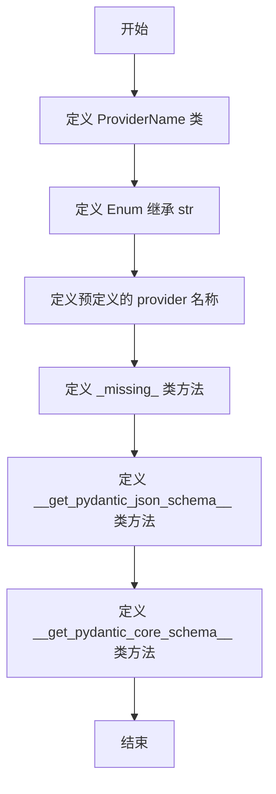
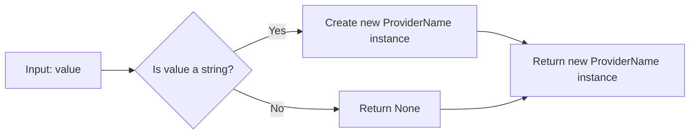
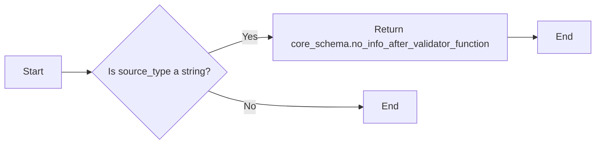

# `.\AutoGPT\autogpt_platform\backend\backend\integrations\providers.py` 详细设计文档

This code defines an Enum class for provider names used in integrations, allowing backward compatibility and custom provider definitions.

## 整体流程



## 类结构

```
ProviderName (Enum)
├── AIML_API
│   ├── ANTHROPIC
│   ├── APOLLO
│   ├── COMPASS
│   ├── DISCORD
│   ├── D_ID
│   ├── E2B
│   ├── ELEVENLABS
│   ├── FAL
│   ├── GITHUB
│   ├── GOOGLE
│   ├── GOOGLE_MAPS
│   ├── GROQ
│   ├── HTTP
│   ├── HUBSPOT
│   ├── ENRICHLAYER
│   ├── IDEOGRAM
│   ├── JINA
│   ├── LLAMA_API
│   ├── MEDIUM
│   ├── MEM0
│   ├── NOTION
│   ├── NVIDIA
│   ├── OLLAMA
│   ├── OPENAI
│   ├── OPENWEATHERMAP
│   ├── OPEN_ROUTER
│   ├── PINECONE
│   ├── REDDIT
│   ├── REPLICATE
│   ├── REVID
│   ├── SCREENSHOTONE
│   ├── SLANT3D
│   ├── SMARTLEAD
│   ├── SMTP
│   ├── TWITTER
│   ├── TODOIST
│   ├── UNREAL_SPEECH
│   ├── V0
│   ├── WEBSHARE_PROXY
│   └── ZEROBOUNCE
```

## 全局变量及字段


### `ProviderName.ProviderName`
    
Provider names for integrations. This enum extends str to accept any string value while maintaining backward compatibility with existing provider constants.

类型：`Enum[str]`
    
    

## 全局函数及方法


### ProviderName._missing_

This method is a class method of the `ProviderName` class, which is an enumeration that represents provider names for integrations.

参数：

- `value`：`Any`，The value that does not match any predefined enum member.

返回值：`ProviderName` 或 `None`，If the value is a string, it returns a new `ProviderName` instance with the value as its name and value. If the value is not a string, it returns `None`.

#### 流程图



#### 带注释源码

```
@classmethod
    def _missing_(cls, value: Any) -> "ProviderName":
        """
        Allow any string value to be used as a ProviderName.
        This enables SDK users to define custom providers without
        modifying the enum.
        """
        if isinstance(value, str):
            # Create a pseudo-member that behaves like an enum member
            pseudo_member = str.__new__(cls, value)
            pseudo_member._name_ = value.upper()
            pseudo_member._value_ = value
            return pseudo_member
        return None  # type: ignore
```


### ProviderName.__get_pydantic_json_schema__

This method is a class method of the `ProviderName` class and is used to customize the JSON schema generation for Pydantic models that use the `ProviderName` enum. It allows any string value to be used as a `ProviderName`, not just the predefined enum values.

参数：

- `schema`：`Any`，The schema object provided by Pydantic.
- `handler`：`Any`，The handler function used to generate the JSON schema.

返回值：`Any`，The modified JSON schema with the enum constraint removed and the type set to string.

#### 流程图

```mermaid
graph LR
A[Start] --> B{Is "enum" in schema?}
B -- Yes --> C[Remove "enum"]
B -- No --> D[Set type to string]
C --> E[Update description]
D --> E
E --> F[Return modified schema]
F --> G[End]
```

#### 带注释源码

```python
@classmethod
def __get_pydantic_json_schema__(cls, schema, handler):
    """
    Custom JSON schema generation that allows any string value,
    not just the predefined enum values.
    """
    # Get the default schema
    json_schema = handler(schema)

    # Remove the enum constraint to allow any string
    if "enum" in json_schema:
        del json_schema["enum"]

    # Keep the type as string
    json_schema["type"] = "string"

    # Update description to indicate custom providers are allowed
    json_schema["description"] = (
        "Provider name for integrations. "
        "Can be any string value, including custom provider names."
    )

    return json_schema
```


### ProviderName.__get_pydantic_core_schema__

This method is a class method of the `ProviderName` class and is used to generate a Pydantic core schema that allows any string value for the `ProviderName` field.

参数：

- `source_type`：`Any`，This parameter is used internally by Pydantic and is not intended to be used directly by the user.

返回值：`core_schema.no_info_after_validator_function`，This returns a Pydantic core schema that validates any string value.

#### 流程图



#### 带注释源码

```
@classmethod
def __get_pydantic_core_schema__(cls, source_type, handler):
    """
    Pydantic v2 core schema that allows any string value.
    """
    from pydantic_core import core_schema

    # Create a string schema that validates any string
    return core_schema.no_info_after_validator_function(
        cls,
        core_schema.str_schema(),
    )
```


## 关键组件


### ProviderName

Provider names for integrations.

### _missing_

Allow any string value to be used as a ProviderName.

### __get_pydantic_json_schema__

Custom JSON schema generation that allows any string value, not just the predefined enum values.

### __get_pydantic_core_schema__

Pydantic v2 core schema that allows any string value.


## 问题及建议


### 已知问题

-   **性能问题**：`ProviderName` 枚举中包含大量的成员，这可能导致内存使用增加，尤其是在包含大量预定义值的枚举中。
-   **可维护性问题**：随着枚举成员的增加，维护和理解枚举成员变得更加困难，尤其是在大型项目中。
-   **冗余代码**：`_missing_` 方法中创建的伪成员可能导致冗余代码，因为它们与实际的枚举成员具有相同的值。

### 优化建议

-   **限制枚举成员数量**：考虑将一些常用的枚举成员保留在枚举中，而将不常用的成员移至单独的配置文件或数据库中，以减少内存使用并提高可维护性。
-   **使用配置文件**：对于自定义提供者，可以使用配置文件来管理，而不是直接修改枚举，这样可以减少枚举成员的数量，并提高灵活性。
-   **代码重构**：考虑重构 `_missing_` 方法，以减少冗余代码，并确保伪成员的创建更加高效。
-   **文档更新**：更新文档，以反映枚举成员的变更和优化措施，确保所有开发者都了解这些更改。


## 其它


### 设计目标与约束

- 设计目标：
  - 提供一个灵活的枚举类，允许用户使用任何字符串值作为提供者名称，同时保持向后兼容性。
  - 支持自定义提供者，无需修改枚举本身。
  - 为Pydantic JSON schema生成提供自定义支持，允许任何字符串值。

- 约束：
  - 枚举值必须是字符串类型。
  - 枚举类应易于扩展，以适应未来可能添加的新提供者。
  - 与Pydantic集成，确保JSON schema生成符合自定义要求。

### 错误处理与异常设计

- 错误处理：
  - 当尝试使用未定义的字符串值作为提供者名称时，应抛出异常。
  - 异常应提供清晰的错误信息，以便用户了解问题所在。

- 异常设计：
  - 定义自定义异常类，用于处理与提供者名称相关的错误。
  - 异常类应包含足够的信息，以便开发者能够快速定位和解决问题。

### 数据流与状态机

- 数据流：
  - 用户通过枚举类选择提供者名称。
  - 枚举类将用户输入转换为相应的枚举值。

- 状态机：
  - 无需状态机，因为枚举类仅用于存储和验证提供者名称。

### 外部依赖与接口契约

- 外部依赖：
  - Pydantic库用于生成JSON schema。
  - 无需其他外部依赖。

- 接口契约：
  - 枚举类应提供清晰的文档，说明如何使用它以及如何处理自定义提供者。
  - 与Pydantic的集成应遵循Pydantic的规范和最佳实践。

    