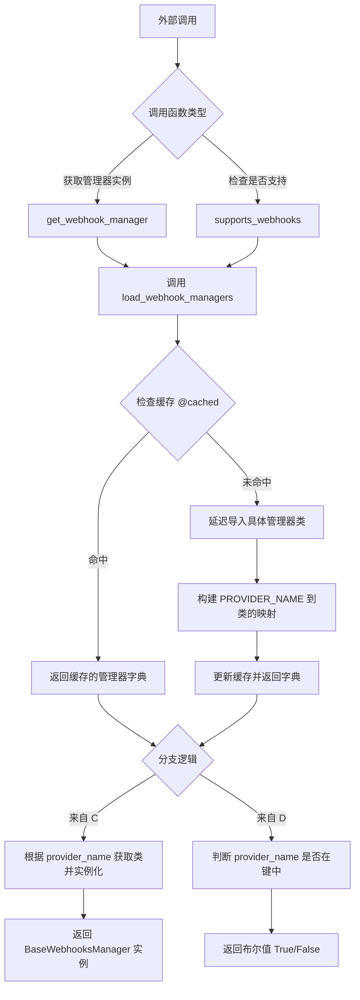
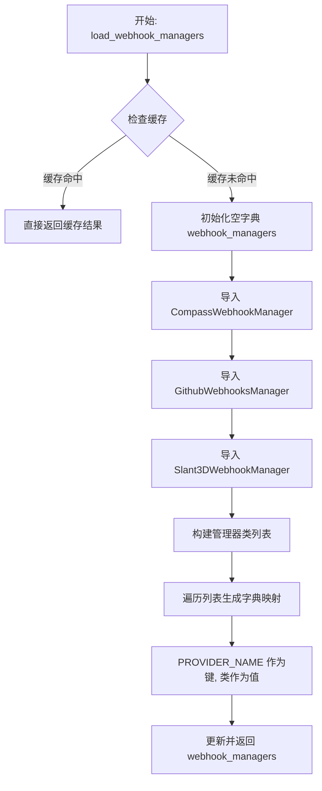
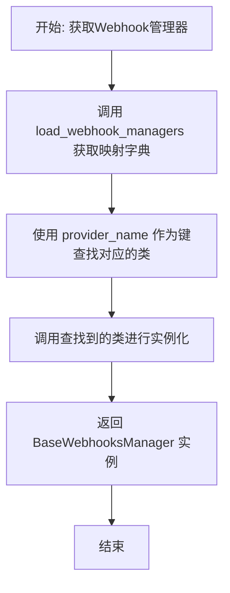
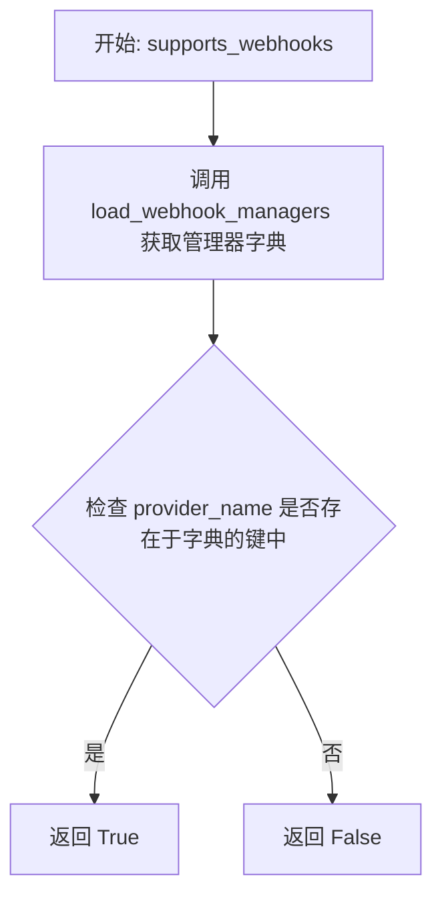

# `.\AutoGPT\autogpt_platform\backend\backend\integrations\webhooks\__init__.py` 详细设计文档

该代码模块作为 Webhook 管理器的注册中心与工厂，负责集中加载、缓存和分发不同服务提供商（如 Compass、Github、Slant3D）的 Webhook 处理器，对外提供实例化获取及支持性查询的统一接口。

## 整体流程



## 类结构

```
Webhooks Registry Module
├── load_webhook_managers (Function)
├── get_webhook_manager (Function)
├── supports_webhooks (Function)
└── __all__ (Global Variable)
```

## 全局变量及字段


### `__all__`
    
定义当前模块公共接口的符号列表，用于指定当执行 'from module import *' 时应当导出的函数名称。

类型：`list[str]`
    


    

## 全局函数及方法


### `load_webhook_managers`

该函数负责加载并缓存所有已注册的 Webhook 管理器类，将特定的提供者名称（Provider Name）映射到对应的 Webhook 处理类。

参数：

-  无参数

返回值：`dict["ProviderName", type["BaseWebhooksManager"]]`，一个字典，其中键是提供者名称，值是对应的 Webhook 管理器类。

#### 流程图



#### 带注释源码

```python
# 使用缓存装饰器，设置缓存有效期为 3600 秒（1小时）
# 这意味着在一小时内重复调用该函数将直接返回缓存结果，而不需要重新执行加载逻辑
@cached(ttl_seconds=3600)
def load_webhook_managers() -> dict["ProviderName", type["BaseWebhooksManager"]]:
    # 初始化一个空字典，用于存储提供者名称与管理器类的映射关系
    webhook_managers = {}

    # 动态导入各个提供者的 Webhook 管理器实现类
    # 这种延迟导入（Lazy Import）方式有助于避免循环依赖
    from .compass import CompassWebhookManager
    from .github import GithubWebhooksManager
    from .slant3d import Slant3DWebhookManager

    # 使用字典推导式构建映射关系
    # handler.PROVIDER_NAME: 键，代表提供者的标识符
    # handler: 值，代表具体的 Webhook 管理器类
    webhook_managers.update(
        {
            handler.PROVIDER_NAME: handler
            for handler in [
                CompassWebhookManager,
                GithubWebhooksManager,
                Slant3DWebhookManager,
            ]
        }
    )
    # 返回构建好的映射字典
    return webhook_managers
```


### `get_webhook_manager`

根据提供的提供程序名称，加载对应的 Webhook 管理器类并实例化。

参数：

- `provider_name`：`"ProviderName"`，指定要获取的 Webhook 管理器所属的提供程序名称。

返回值：`"BaseWebhooksManager"`，指定提供程序对应的 Webhook 管理器实例。

#### 流程图



#### 带注释源码

```python
def get_webhook_manager(provider_name: "ProviderName") -> "BaseWebhooksManager":
    # 通过 load_webhook_managers 函数获取所有管理器的映射字典
    # 使用 provider_name 作为键获取对应的 Webhook 管理器类
    # 并调用该类（类名后加括号）进行实例化，最后返回实例对象
    return load_webhook_managers()[provider_name]()
```


### `supports_webhooks`

该函数用于判断指定的服务提供商是否支持 Webhooks 功能。它通过调用 `load_webhook_managers` 获取所有支持 Webhooks 的提供商映射，并检查给定的提供商名称是否存在于该映射中。

参数：

-  `provider_name`：`"ProviderName"`，待检查的服务提供商名称或标识符。

返回值：`bool`，如果该提供商支持 Webhooks 功能则返回 `True`，否则返回 `False`。

#### 流程图



#### 带注释源码

```python
def supports_webhooks(provider_name: "ProviderName") -> bool:
    # 检查传入的 provider_name 是否在 load_webhook_managers() 返回的字典键中
    # 如果存在，说明该 Provider 支持 Webhooks，返回 True；否则返回 False
    return provider_name in load_webhook_managers()
```


## 关键组件


### Webhook 管理器缓存加载器
一个带有 1 小时 TTL 缓存机制的函数，负责动态导入并维护 Provider 名称与对应 Webhook 管理器类之间的映射关系。

### Webhook 管理器工厂
一种通过 Provider 名称从注册表中检索对应的 Webhook 管理器类并实例化的机制，用于获取具体的管理器对象。

### Webhook 支持检查器
用于快速判断特定 Provider 是否已实现并注册 Webhook 管理器的实用工具函数。


## 问题及建议


### 已知问题

-   **扩展性受限（硬编码依赖）**：`load_webhook_managers` 函数内部硬编码了对具体 Webhook 管理器（如 `CompassWebhookManager`, `GithubWebhooksManager` 等）的导入和注册。每次新增一个 Provider 都需要修改此函数的源码，违背了开闭原则（对扩展开放，对修改封闭），增加了维护成本。
-   **缺乏键冲突检测**：在构建字典时，使用了字典推导式，如果两个不同的 Handler 类定义了相同的 `PROVIDER_NAME`，后者会静默覆盖前者，导致难以排查的逻辑错误。
-   **异常处理缺失**：`get_webhook_manager` 函数直接通过 `load_webhook_managers()[provider_name]` 访问字典。当传入的 `provider_name` 不存在时，会抛出原生的 `KeyError`，调用方难以区分是配置错误还是代码逻辑错误，缺乏语义化的异常提示。
-   **缓存一致性问题**：虽然使用了 1 小时（3600秒）的缓存来提高性能，但在该时间段内，如果通过动态加载或配置更新增加了新的 Provider，或者禁用了某个 Provider，系统无法感知到变化，直到缓存过期或服务重启。

### 优化建议

-   **引入注册表模式**：建议利用 Python 的元类或装饰器机制，让各个 `BaseWebhooksManager` 的子类在定义时自动注册到全局字典中，或者通过扫描特定包下的模块来自动发现并加载管理器。这样可以消除显式的导入语句，实现真正的插件化架构。
-   **增加唯一性校验**：在构建管理器字典的过程中，增加逻辑检查 `PROVIDER_NAME` 是否重复，如果发现重复则抛出明确的运行时错误，防止意外的覆盖行为。
-   **优化异常处理**：在 `get_webhook_manager` 中捕获 `KeyError`，并将其封装为更具业务含义的自定义异常（例如 `ProviderNotFoundError`），提供详细的错误信息（如当前支持的 Provider 列表），提升系统的可调试性。
-   **配置化的缓存控制**：将缓存的 TTL（生存时间）提取为配置项，或者提供主动刷新缓存的接口（如 `invalidate_webhook_cache`），以便在需要动态更新 Provider 列表时能立即生效。
-   **类型提示优化**：尽管使用了 `TYPE_CHECKING`，但在 Python 3.7+ 环境下，可以考虑使用 `from __future__ import annotations` 来消除字符串形式的类型注解，使代码更整洁。


## 其它


### 设计目标与约束

**设计目标：**
核心目标是通过工厂模式和注册机制，实现不同 Provider（如 Github, Compass 等）的 Webhook 管理器的解耦与动态加载。调用方无需感知具体 Manager 类的导入细节，仅通过 Provider 名称即可获取对应的 Manager 实例。

**约束：**
1. **缓存时效性**：使用 `@cached(ttl_seconds=3600)` 装饰器，导致 Provider 列表在运行时被缓存 1 小时。在此期间，若代码新增了 Webhook Manager，必须等待缓存过期或重启服务才能生效。
2. **显式注册**：当前实现需要在 `load_webhook_managers` 函数内部显式导入并注册新的 Manager 类，不符合自动发现机制，扩展性受限。

### 数据流与状态机

**数据流：**
1. **输入**：外部模块调用 `get_webhook_manager(provider_name)` 或 `supports_webhooks(provider_name)`，传入 Provider 标识。
2. **检索/加载**：
   - 调用 `load_webhook_managers()`。
   - 检查缓存是否存在。若不存在，执行函数体：导入 `CompassWebhookManager`、`GithubWebhooksManager` 等具体类，构建 `{PROVIDER_NAME: Class}` 的字典。
   - 返回字典（后续调用直接从缓存读取）。
3. **处理**：
   - `get_webhook_manager`：从字典中获取对应的 Class，调用 `()` 实例化并返回。
   - `supports_webhooks`：使用 `in` 操作符检查字典键是否存在，返回布尔值。
4. **输出**：返回 `BaseWebhooksManager` 实例或 `bool` 结果。

**状态机：**
系统主要存在两种状态，由缓存机制控制：
1. **未初始化状态**：服务启动后，`load_webhook_managers` 尚未被调用或缓存已过期。
2. **已加载状态**：`load_webhook_managers` 被调用过一次，Provider 映射关系已驻留在内存缓存中，后续请求直接读取。

### 外部依赖与接口契约

**外部依赖：**
1. **内部模块依赖**：
   - `backend.util.cache`：依赖 `cached` 装饰器提供内存缓存功能。
   - `._base.BaseWebhooksManager`：依赖基类作为类型注解和返回基类。
   - `..providers`：依赖 `ProviderName` 类型定义。
2. **具体实现依赖**：
   - `.compass.CompassWebhookManager`
   - `.github.GithubWebhooksManager`
   - `.slant3d.Slant3DWebhookManager`

**接口契约：**
1. **Provider 契约**：所有被注册的 Webhook Manager 类必须定义类级别的 `PROVIDER_NAME` 属性，作为字典的键。
2. **继承契约**：所有被注册的 Webhook Manager 必须继承自 `BaseWebhooksManager`，确保接口一致性。
3. **类型契约**：`get_webhook_manager` 返回的对象必须符合 `BaseWebhooksManager` 的接口规范。

### 错误处理与异常设计

**错误场景：**
1. **Provider 不存在**：当调用 `get_webhook_manager` 传入一个未注册的 `provider_name` 时。
2. **导入失败**：当显式导入的具体 Manager 模块（如 `compass`, `github`）不存在或发生语法错误时。

**处理策略：**
1. **KeyError 抛出**：`get_webhook_manager` 函数内部直接使用字典索引 `load_webhook_managers()[provider_name]`。如果键不存在，Python 将自动抛出 `KeyError`。该设计将错误处理的责任交给了调用方。
2. **安全检查**：提供了 `supports_webhooks` 函数作为安全的前置检查入口，调用方在不确定 Provider 是否支持时，应先调用此函数以避免捕获 `KeyError`。
3. **ImportError 传播**：由于使用了显式导入，如果子模块缺失，`load_webhook_managers` 在首次调用时会抛出 `ImportError` 或 `ModuleNotFoundError`，导致服务启动或首次请求失败（需配合全局异常处理）。

    