# `.\AutoGPT\autogpt_platform\backend\backend\integrations\webhooks\_base.py` 详细设计文档

The code defines an abstract base class for managing webhooks, providing methods for creating, retrieving, and managing webhooks for different providers.

## 整体流程

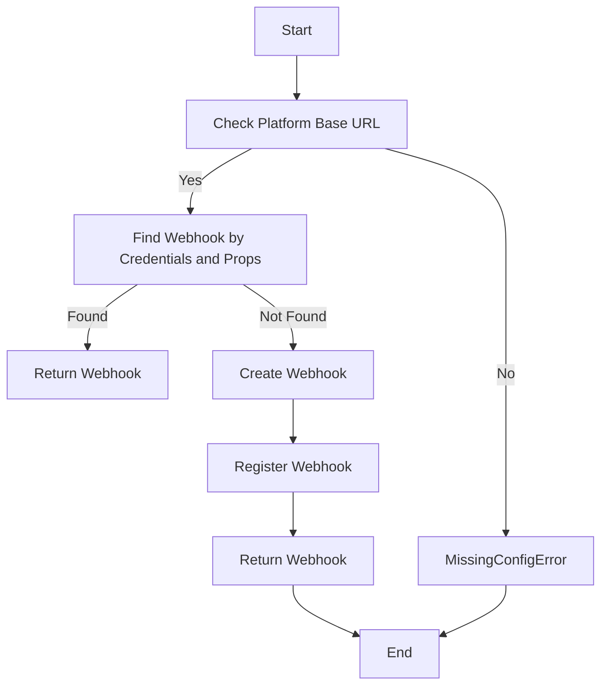
```mermaid
graph TD
    A[Start] --> B[Check Platform Base URL]
    B -- Yes --> C[Find Webhook by Credentials and Props]
    C -- Found --> D[Return Webhook]
    C -- Not Found --> E[Create Webhook]
    E --> F[Register Webhook]
    F --> G[Return Webhook]
    B -- No --> H[MissingConfigError]
    G --> I[End]
    H --> I[End]
```

## 类结构

```
BaseWebhooksManager (抽象基类)
├── get_suitable_auto_webhook
│   ├── get_manual_webhook
│   └── prune_webhook_if_dangling
├── validate_payload
├── trigger_ping
├── _register_webhook
└── _deregister_webhook
```

## 全局变量及字段


### `logger`
    
Logger instance for the module.

类型：`logging.Logger`
    


### `app_config`
    
Configuration object for the application.

类型：`backend.util.settings.Config`
    


### `WT`
    
Type variable for generic type constraints.

类型：`TypeVar`
    


### `BaseWebhooksManager.BaseWebhooksManager.PROVIDER_NAME`
    
Class variable representing the provider name for the webhooks.

类型：`ProviderName`
    


### `BaseWebhooksManager.BaseWebhooksManager.WebhookType`
    
Class variable representing the type of webhook to be managed.

类型：`WT`
    
    

## 全局函数及方法


### secrets.token_hex

生成一个随机的32字符十六进制字符串作为秘密。

参数：

- 无

返回值：`str`，一个32字符的十六进制字符串，用于验证webhook的有效性。

#### 流程图

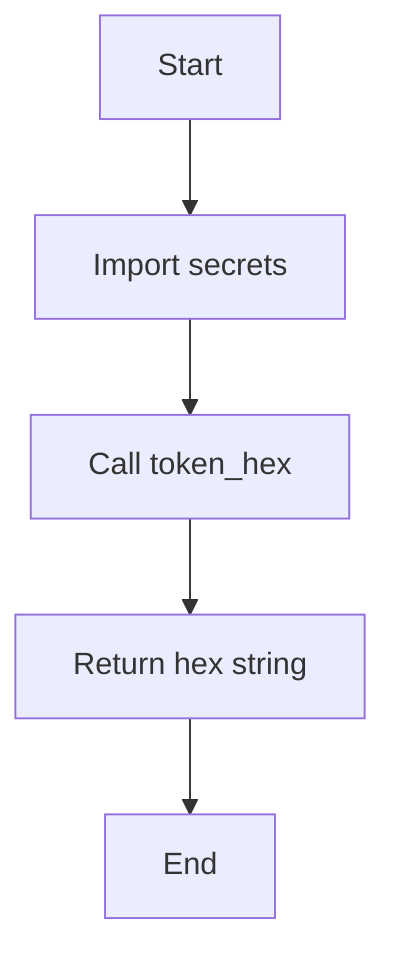
```mermaid
graph TD
    A[Start] --> B[Import secrets]
    B --> C[Call token_hex]
    C --> D[Return hex string]
    D --> E[End]
```

#### 带注释源码

```python
import secrets

def generate_secret():
    secret = secrets.token_hex(32)
    return secret
```


### `uuid4`

生成一个唯一的UUID。

参数：

- 无

返回值：`str`，一个唯一的UUID字符串。

#### 流程图

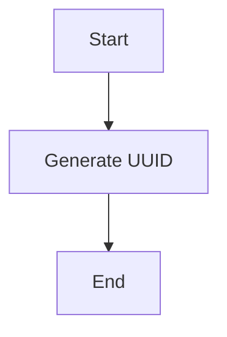
```mermaid
graph TD
    A[Start] --> B[Generate UUID]
    B --> C[End]
```

#### 带注释源码

```python
from uuid import uuid4

def uuid4():
    """
    Generate a unique UUID.

    Returns:
        str: A unique UUID string.
    """
    return str(uuid4())
```


### webhook_ingress_url

Generates an ingress URL for a webhook based on the provider name and webhook ID.

参数：

- `provider_name`：`ProviderName`，The provider name for the webhook
- `webhook_id`：`str`，The ID of the webhook

返回值：`str`，The generated ingress URL for the webhook

#### 流程图

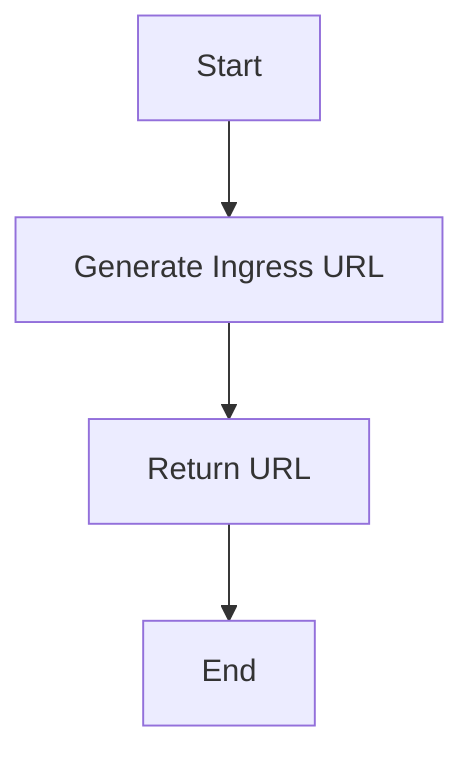
```mermaid
graph TD
    A[Start] --> B[Generate Ingress URL]
    B --> C[Return URL]
    C --> D[End]
```

#### 带注释源码

```python
def webhook_ingress_url(provider_name: ProviderName, webhook_id: str) -> str:
    """
    Generates an ingress URL for a webhook based on the provider name and webhook ID.

    Args:
        provider_name: The provider name for the webhook
        webhook_id: The ID of the webhook

    Returns:
        str: The generated ingress URL for the webhook
    """
    return f"{app_config.platform_base_url}/webhooks/{provider_name.value}/{webhook_id}"
```


### integrations.find_webhook_by_credentials_and_props

查找与给定凭据和属性匹配的webhook。

参数：

- `user_id`：`str`，用户ID
- `credentials_id`：`str`，凭据ID
- `webhook_type`：`WT`，webhook类型
- `resource`：`str`，资源
- `events`：`list[str]`，事件列表

返回值：`integrations.Webhook`，匹配的webhook对象

#### 流程图

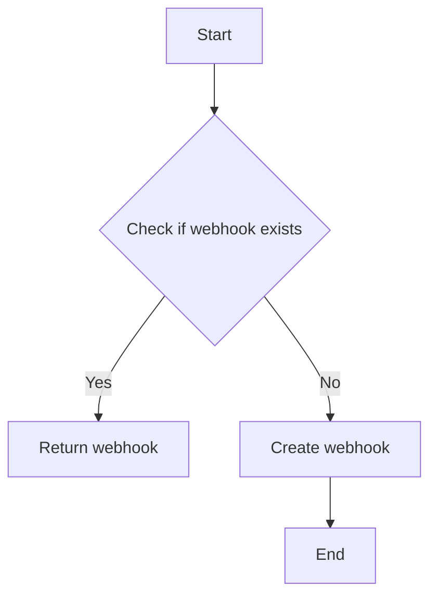
```mermaid
graph TD
    A[Start] --> B{Check if webhook exists}
    B -->|Yes| C[Return webhook]
    B -->|No| D[Create webhook]
    D --> E[End]
```

#### 带注释源码

```python
async def find_webhook_by_credentials_and_props(
    user_id: str,
    credentials_id: str,
    webhook_type: WT,
    resource: str,
    events: list[str],
) -> Optional[integrations.Webhook]:
    # --8<-- [start:find_webhook_by_credentials_and_props]
    webhook = await integrations.get_webhook_by_credentials_and_props(
        user_id=user_id,
        credentials_id=credentials_id,
        webhook_type=webhook_type,
        resource=resource,
        events=events,
    )
    return webhook
    # --8<-- [end:find_webhook_by_credentials_and_props]
``` 


### integrations.find_webhook_by_graph_and_props

查找与给定用户ID、提供者名称、webhook类型、图ID和预设ID关联的webhook。

参数：

- `user_id`：`str`，用户ID
- `provider`：`str`，提供者名称
- `webhook_type`：`WT`，webhook类型
- `graph_id`：`Optional[str]`，图ID
- `preset_id`：`Optional[str]`，预设ID

返回值：`Optional[integrations.Webhook]`，找到的webhook对象，如果没有找到则返回`None`

#### 流程图

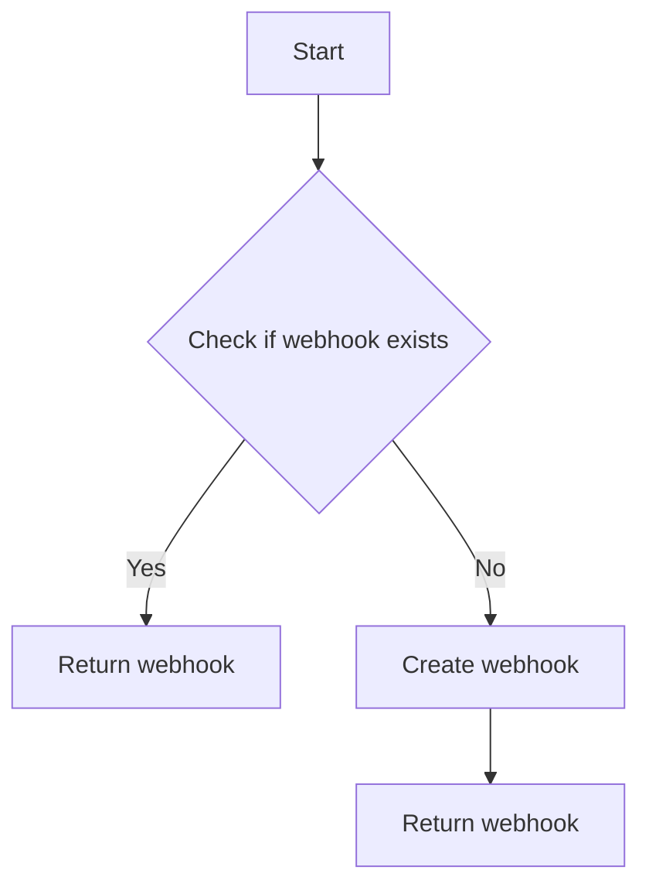
```mermaid
graph TD
    A[Start] --> B{Check if webhook exists}
    B -->|Yes| C[Return webhook]
    B -->|No| D[Create webhook]
    D --> E[Return webhook]
```

#### 带注释源码

```python
async def find_webhook_by_graph_and_props(
    user_id: str,
    provider: str,
    webhook_type: WT,
    graph_id: Optional[str] = None,
    preset_id: Optional[str] = None,
) -> Optional[integrations.Webhook]:
    # --8<-- [start:find_webhook_by_graph_and_props]
    webhook = await self._find_webhook_by_graph_and_props(
        user_id=user_id,
        provider=provider,
        webhook_type=webhook_type,
        graph_id=graph_id,
        preset_id=preset_id,
    )
    return webhook
    # --8<-- [end:find_webhook_by_graph_and_props]
```


### integrations.update_webhook

This function updates the events associated with an existing webhook.

参数：

- `webhook_id`：`str`，The ID of the webhook to update.
- `events`：`list[str]`，The list of events to associate with the webhook.

返回值：`integrations.Webhook`，The updated webhook object.

#### 流程图

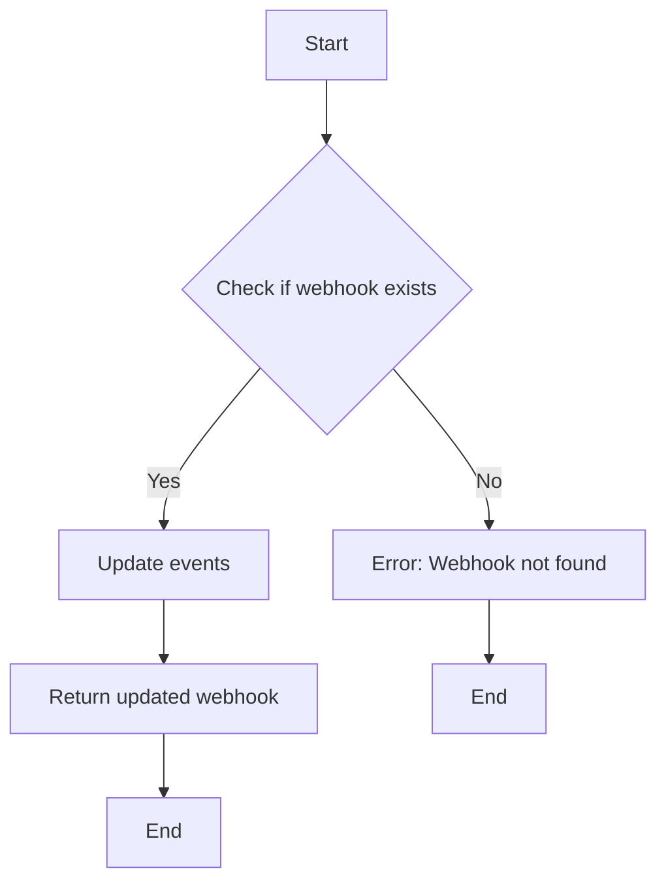
```mermaid
graph TD
    A[Start] --> B{Check if webhook exists}
    B -- Yes --> C[Update events]
    B -- No --> D[Error: Webhook not found]
    C --> E[Return updated webhook]
    D --> F[End]
    E --> G[End]
```

#### 带注释源码

```python
from backend.data.model import Webhook

async def update_webhook(webhook_id: str, events: list[str]) -> Webhook:
    webhook = await get_webhook(webhook_id)
    if not webhook:
        raise ValueError("Webhook not found")

    webhook.events = events
    await save_webhook(webhook)
    return webhook
```


### integrations.get_webhook

Retrieves a webhook object from the integrations module based on the webhook ID.

参数：

- `webhook_id`：`str`，The ID of the webhook to retrieve.
- `include_relations`：`bool`，Optional; if set to True, includes related objects in the response.

返回值：`integrations.Webhook`，The webhook object associated with the provided ID.

#### 流程图

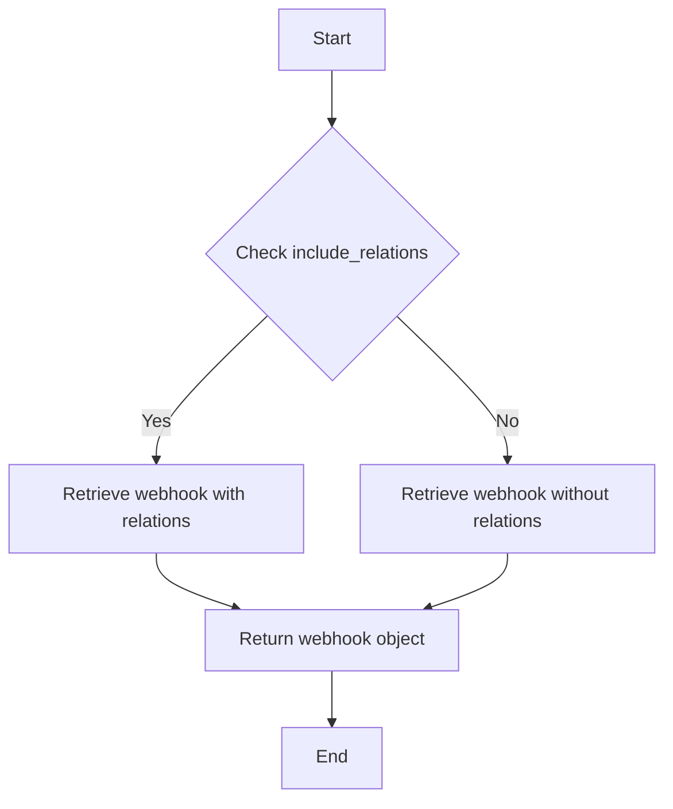
```mermaid
graph TD
    A[Start] --> B{Check include_relations}
    B -- Yes --> C[Retrieve webhook with relations]
    B -- No --> D[Retrieve webhook without relations]
    C --> E[Return webhook object]
    D --> E
    E --> F[End]
```

#### 带注释源码

```python
# --8<-- [start:prune_webhook_if_dangling]
async def prune_webhook_if_dangling(
    self, user_id: str, webhook_id: str, credentials: Optional[Credentials]
) -> bool:
    webhook = await integrations.get_webhook(webhook_id, include_relations=True)
    # --8<-- [end:prune_webhook_if_dangling]
```


### integrations.delete_webhook

删除与指定用户ID和webhook ID关联的webhook。

参数：

- `user_id`：`str`，用户ID，用于标识要删除的webhook所属的用户。
- `webhook_id`：`str`，webhook ID，用于标识要删除的webhook。

返回值：`None`，没有返回值。

#### 流程图

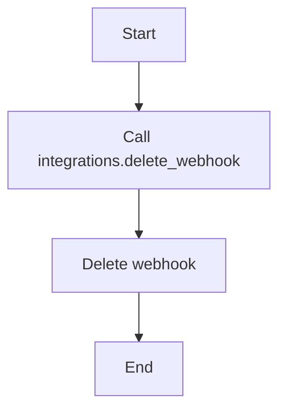
```mermaid
graph TD
    A[Start] --> B[Call integrations.delete_webhook]
    B --> C[Delete webhook]
    C --> D[End]
```

#### 带注释源码

```python
# --8<-- [start:delete_webhook]
async def delete_webhook(user_id: str, webhook_id: str) -> None:
    await integrations.delete_webhook(user_id, webhook_id)
# --8<-- [end:delete_webhook]
```


### integrations.create_webhook

This function creates a new webhook in the system.

参数：

- `webhook`: `integrations.Webhook`，The webhook object to be created.
- ...

返回值：`integrations.Webhook`，The created webhook object.

#### 流程图

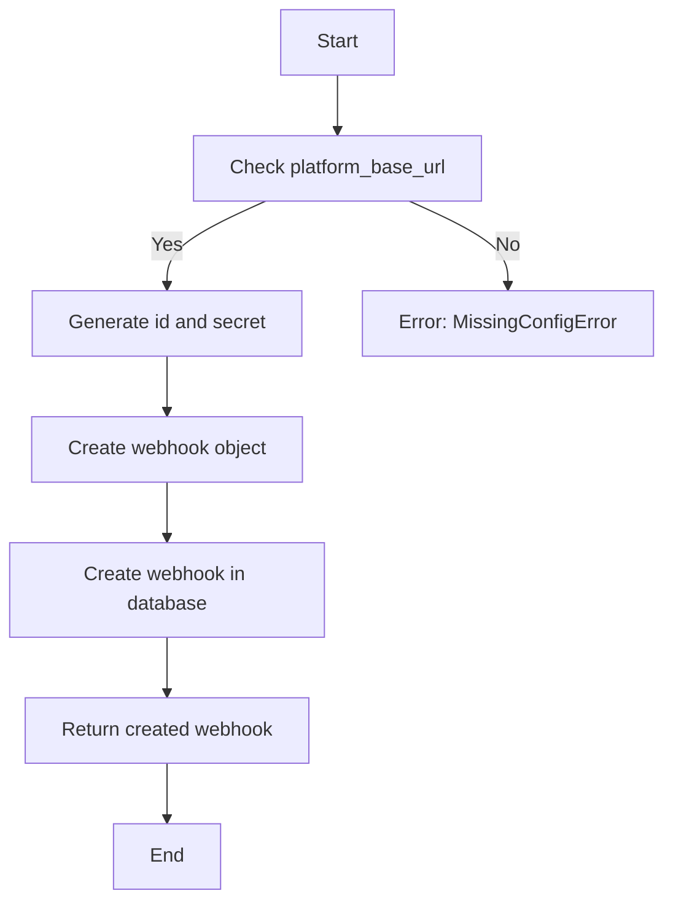
```mermaid
graph TD
    A[Start] --> B[Check platform_base_url]
    B -->|Yes| C[Generate id and secret]
    B -->|No| D[Error: MissingConfigError]
    C --> E[Create webhook object]
    E --> F[Create webhook in database]
    F --> G[Return created webhook]
    G --> H[End]
```

#### 带注释源码

```python
async def create_webhook(webhook: integrations.Webhook) -> integrations.Webhook:
    if not app_config.platform_base_url:
        raise MissingConfigError(
            "PLATFORM_BASE_URL must be set to use Webhook functionality"
        )

    id = str(uuid4())
    secret = secrets.token_hex(32)
    provider_name: ProviderName = webhook.provider
    ingress_url = webhook_ingress_url(provider_name=provider_name, webhook_id=id)

    webhook_object = integrations.Webhook(
        id=id,
        user_id=webhook.user_id,
        provider=provider_name,
        credentials_id=webhook.credentials_id,
        webhook_type=webhook.webhook_type,
        resource=webhook.resource,
        events=webhook.events,
        provider_webhook_id=webhook.provider_webhook_id,
        config=webhook.config,
        secret=secret,
    )

    created_webhook = await integrations.create_webhook(webhook_object)
    return created_webhook
``` 


### integrations.Webhook

This function is not explicitly defined in the provided code snippet, but it is referenced as a type in the `create_webhook` method. It seems to be a part of the `integrations` module, which suggests it is a class or a type alias representing a webhook object.

#### 参数

- 无

#### 返回值

- `integrations.Webhook`，A webhook object representing the webhook configuration and properties.

#### 流程图

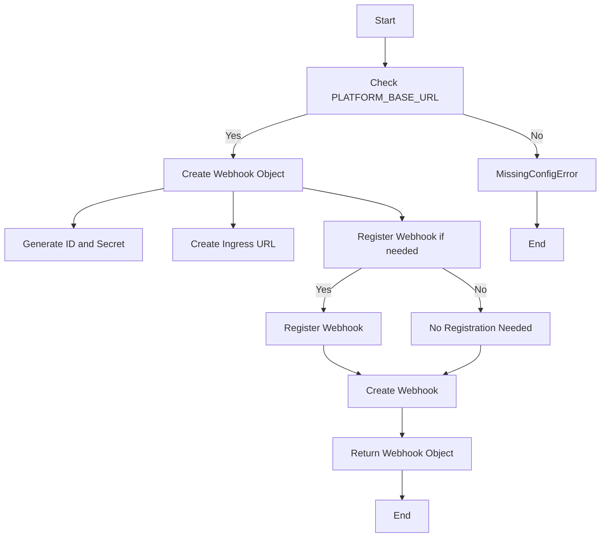
```mermaid
graph TD
    A[Start] --> B[Check PLATFORM_BASE_URL]
    B -->|Yes| C[Create Webhook Object]
    B -->|No| D[MissingConfigError]
    C --> E[Generate ID and Secret]
    C --> F[Create Ingress URL]
    C --> G[Register Webhook if needed]
    G -->|Yes| H[Register Webhook]
    G -->|No| I[No Registration Needed]
    H --> J[Create Webhook]
    I --> J
    J --> K[Return Webhook Object]
    K --> L[End]
    D --> M[End]
```

#### 带注释源码

```python
# --8<-- [start:BaseWebhooksManager2]
async def _create_webhook(
    self,
    user_id: str,
    webhook_type: WT,
    events: list[str],
    resource: str = "",
    credentials: Optional[Credentials] = None,
    register: bool = True,
) -> integrations.Webhook:
    if not app_config.platform_base_url:
        raise MissingConfigError(
            "PLATFORM_BASE_URL must be set to use Webhook functionality"
        )

    id = str(uuid4())
    secret = secrets.token_hex(32)
    provider_name: ProviderName = self.PROVIDER_NAME
    ingress_url = webhook_ingress_url(provider_name=provider_name, webhook_id=id)
    if register:
        if not credentials:
            raise TypeError("credentials are required if register = True")
        provider_webhook_id, config = await self._register_webhook(
            credentials, webhook_type, resource, events, ingress_url, secret
        )
    else:
        provider_webhook_id, config = "", {}

    return await integrations.create_webhook(
        integrations.Webhook(
            id=id,
            user_id=user_id,
            provider=provider_name,
            credentials_id=credentials.id if credentials else "",
            webhook_type=webhook_type,
            resource=resource,
            events=events,
            provider_webhook_id=provider_webhook_id,
            config=config,
            secret=secret,
        )
    )
# --8<-- [end:BaseWebhooksManager2]
```


### BaseWebhooksManager.get_suitable_auto_webhook

This method attempts to find an existing webhook associated with the given credentials and properties. If no existing webhook is found, it creates a new one.

参数：

- `user_id`：`str`，The unique identifier for the user.
- `credentials`：`Credentials`，The credentials object containing the necessary information to create a webhook.
- `webhook_type`：`WT`，The type of webhook to create.
- `resource`：`str`，The resource to receive events for.
- `events`：`list[str]`，The events to subscribe to.

返回值：`integrations.Webhook`，The webhook object that was found or created.

#### 流程图

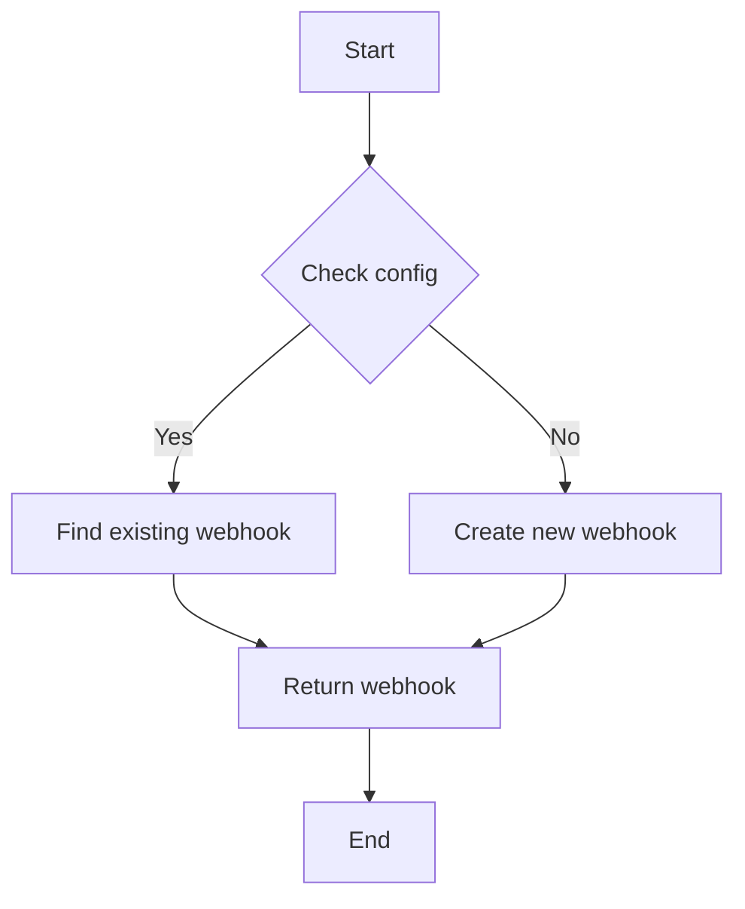
```mermaid
graph TD
    A[Start] --> B{Check config}
    B -->|Yes| C[Find existing webhook]
    B -->|No| D[Create new webhook]
    C --> E[Return webhook]
    D --> E
    E --> F[End]
```

#### 带注释源码

```python
async def get_suitable_auto_webhook(
    self,
    user_id: str,
    credentials: Credentials,
    webhook_type: WT,
    resource: str,
    events: list[str],
) -> integrations.Webhook:
    if not app_config.platform_base_url:
        raise MissingConfigError(
            "PLATFORM_BASE_URL must be set to use Webhook functionality"
        )

    if webhook := await integrations.find_webhook_by_credentials_and_props(
        user_id=user_id,
        credentials_id=credentials.id,
        webhook_type=webhook_type,
        resource=resource,
        events=events,
    ):
        return webhook

    return await self._create_webhook(
        user_id=user_id,
        webhook_type=webhook_type,
        events=events,
        resource=resource,
        credentials=credentials,
    )
``` 


### BaseWebhooksManager.get_manual_webhook

This method attempts to find an existing webhook tied to a `graph_id` or `preset_id`, or creates a new webhook if none exists. It matches existing webhooks by `user_id`, `webhook_type`, and `graph_id`/`preset_id`. If an existing webhook is found, it checks if the events match and updates them if necessary to avoid changing the webhook URL for existing manual webhooks.

参数：

- `user_id`：`str`，The user ID associated with the webhook.
- `webhook_type`：`WT`，The type of webhook to create or find.
- `events`：`list[str]`，The events to subscribe to the webhook.
- `graph_id`：`Optional[str]`，The graph ID associated with the webhook (optional).
- `preset_id`：`Optional[str]`，The preset ID associated with the webhook (optional).

返回值：`integrations.Webhook`，The webhook object that was found or created.

#### 流程图

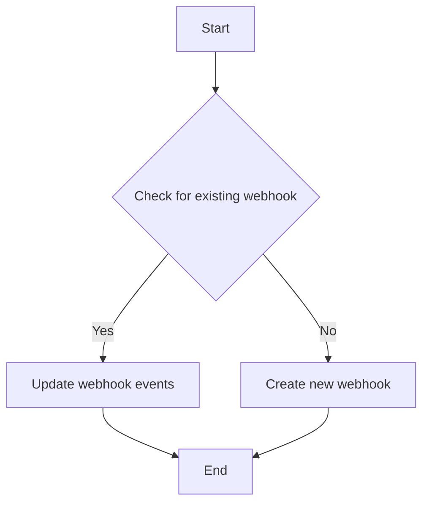
```mermaid
graph TD
    A[Start] --> B{Check for existing webhook}
    B -->|Yes| C[Update webhook events]
    B -->|No| D[Create new webhook]
    C --> E[End]
    D --> E
```

#### 带注释源码

```python
async def get_manual_webhook(
    self,
    user_id: str,
    webhook_type: WT,
    events: list[str],
    graph_id: Optional[str] = None,
    preset_id: Optional[str] = None,
) -> integrations.Webhook:
    """
    Tries to find an existing webhook tied to `graph_id`/`preset_id`,
    or creates a new webhook if none exists.

    Existing webhooks are matched by `user_id`, `webhook_type`,
    and `graph_id`/`preset_id`.

    If an existing webhook is found, we check if the events match and update them
    if necessary. We do this rather than creating a new webhook
    to avoid changing the webhook URL for existing manual webhooks.
    """
    if (graph_id or preset_id) and (
        current_webhook := await integrations.find_webhook_by_graph_and_props(
            user_id=user_id,
            provider=self.PROVIDER_NAME.value,
            webhook_type=webhook_type,
            graph_id=graph_id,
            preset_id=preset_id,
        )
    ):
        if set(current_webhook.events) != set(events):
            current_webhook = await integrations.update_webhook(
                current_webhook.id, events=events
            )
        return current_webhook

    return await self._create_webhook(
        user_id=user_id,
        webhook_type=webhook_type,
        events=events,
        register=False,
    )
``` 


### BaseWebhooksManager.prune_webhook_if_dangling

This method checks if a webhook is dangling (not in use by any other graphs) and deletes it if it is.

参数：

- `user_id`：`str`，The user ID associated with the webhook.
- `webhook_id`：`str`，The ID of the webhook to be checked and potentially deleted.
- `credentials`：`Optional[Credentials]`，The credentials object associated with the webhook, used for deregistration if necessary.

返回值：`bool`，Returns `True` if the webhook was deleted, `False` otherwise.

#### 流程图

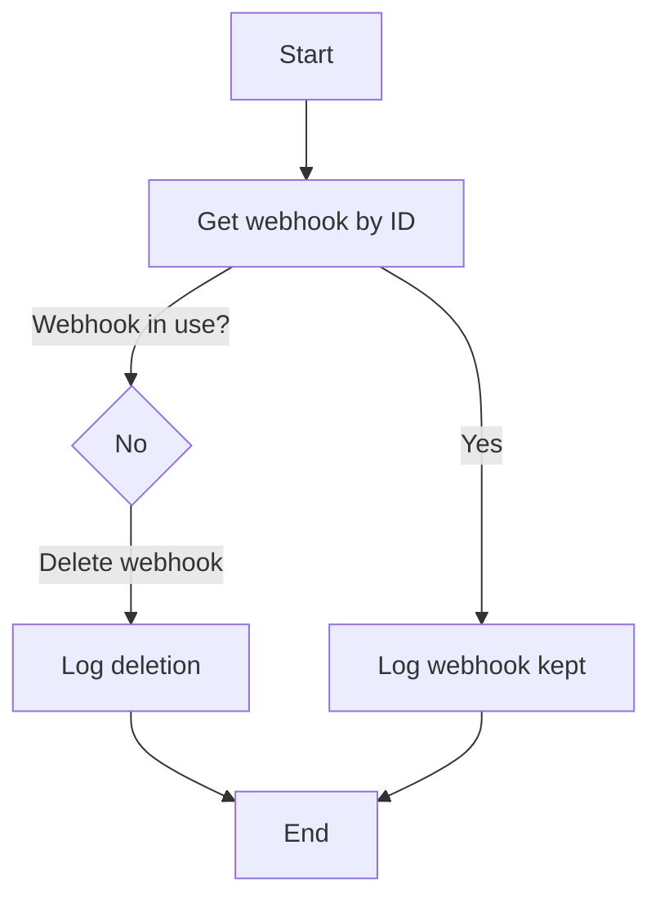
```mermaid
graph TD
    A[Start] --> B[Get webhook by ID]
    B -->|Webhook in use?| C{No}
    C -->|Delete webhook| D[Log deletion]
    D --> E[End]
    B -->|Yes| F[Log webhook kept]
    F --> E
```

#### 带注释源码

```python
async def prune_webhook_if_dangling(self, user_id: str, webhook_id: str, credentials: Optional[Credentials] = None) -> bool:
    webhook = await integrations.get_webhook(webhook_id, include_relations=True)
    if webhook.triggered_nodes or webhook.triggered_presets:
        # Don't prune webhook if in use
        logger.info(f"Webhook #{webhook_id} kept as it has triggers in other graphs")
        return False

    if credentials:
        await self._deregister_webhook(webhook, credentials)
    await integrations.delete_webhook(user_id, webhook.id)
    logger.info(f"Webhook #{webhook_id} deleted as it had no remaining triggers")
    return True
```


### BaseWebhooksManager.validate_payload

Validates an incoming webhook request and returns its payload and type.

参数：

- `webhook`：`integrations.Webhook`，The object representing the configured webhook and its properties in our system.
- `request`：`Request`，The incoming FastAPI `Request`
- `credentials`：`Credentials | None`，Optional credentials used to verify the webhook payload.

返回值：`tuple[dict, str]`，A tuple containing the validated payload as a dictionary and the event type associated with the payload.

#### 流程图

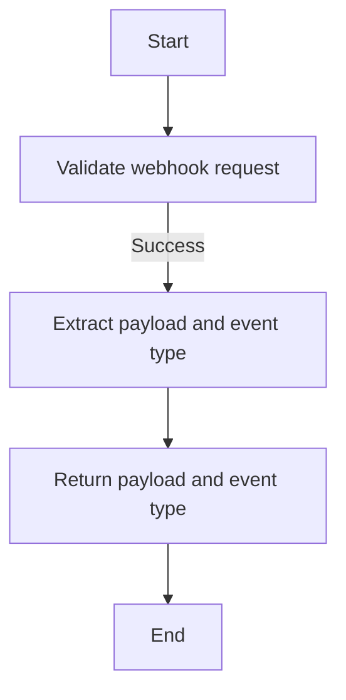
```mermaid
graph TD
    A[Start] --> B[Validate webhook request]
    B -->|Success| C[Extract payload and event type]
    C --> D[Return payload and event type]
    D --> E[End]
```

#### 带注释源码

```python
@abstractmethod
async def validate_payload(
    cls,
    webhook: integrations.Webhook,
    request: Request,
    credentials: Credentials | None,
) -> tuple[dict, str]:
    """
    Validates an incoming webhook request and returns its payload and type.

    Params:
        webhook: Object representing the configured webhook and its properties in our system.
        request: Incoming FastAPI `Request`

    Returns:
        dict: The validated payload
        str: The event type associated with the payload
    """
    # Implementation will be provided by subclasses
    ...
```


### BaseWebhooksManager.trigger_ping

Triggers a ping to the given webhook.

参数：

- `webhook`：`integrations.Webhook`，The webhook to trigger the ping for.
- `credentials`：`Credentials | None`，Optional credentials to use for the ping.

返回值：`None`，No return value, the method is asynchronous and triggers a ping.

#### 流程图

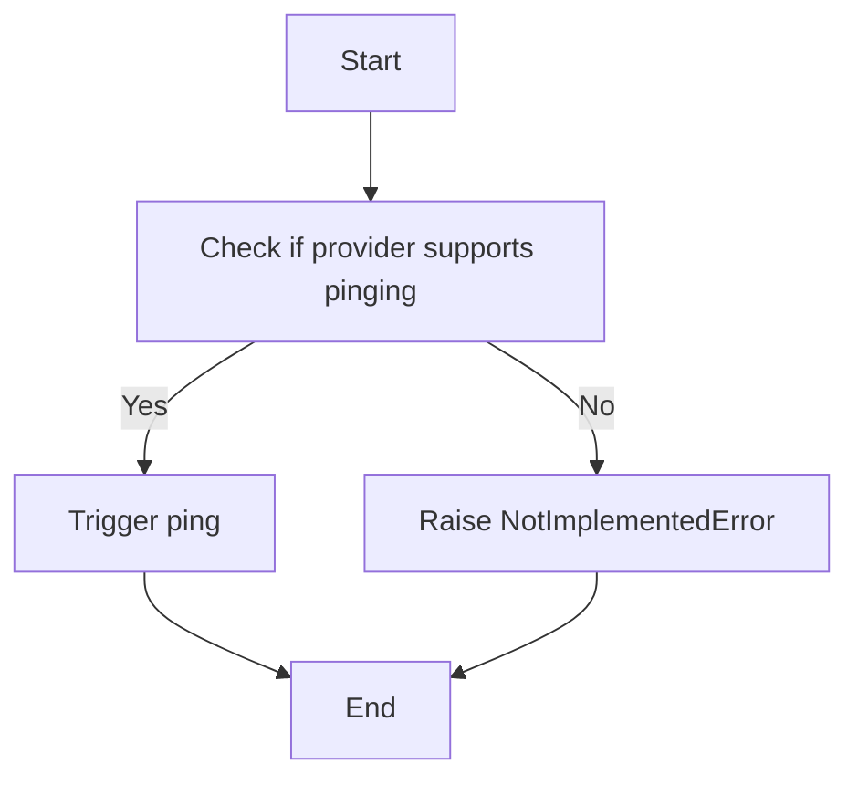
```mermaid
graph TD
    A[Start] --> B[Check if provider supports pinging]
    B -- Yes --> C[Trigger ping]
    B -- No --> D[Raise NotImplementedError]
    C --> E[End]
    D --> E
```

#### 带注释源码

```python
async def trigger_ping(self, webhook: integrations.Webhook, credentials: Credentials | None):
    """
    Triggers a ping to the given webhook.

    Raises:
        NotImplementedError: if the provider doesn't support pinging
    """
    # --8<-- [end:BaseWebhooksManager5]
    raise NotImplementedError(f"{self.__class__.__name__} doesn't support pinging")
```


### BaseWebhooksManager._register_webhook

Registers a new webhook with the provider.

参数：

- `credentials`：`Credentials`，The credentials with which to create the webhook
- `webhook_type`：`WT`，The provider-specific webhook type to create
- `resource`：`str`，The resource to receive events for
- `events`：`list[str]`，The events to subscribe to
- `ingress_url`：`str`，The ingress URL for webhook payloads
- `secret`：`str`，Secret used to verify webhook payloads

返回值：`tuple[str, dict]`，A tuple containing the Webhook ID assigned by the provider and provider-specific configuration for the webhook

#### 流程图

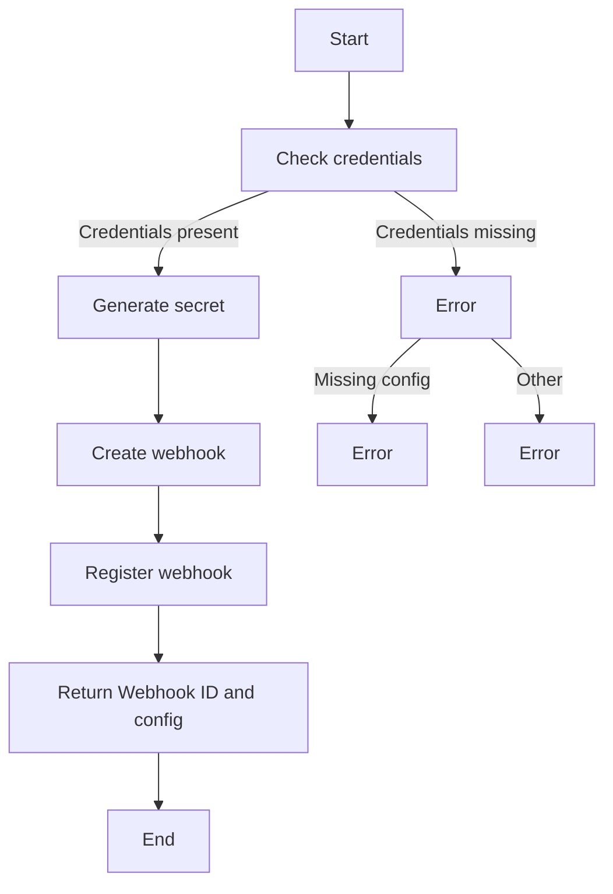
```mermaid
graph TD
    A[Start] --> B[Check credentials]
    B -->|Credentials present| C[Generate secret]
    B -->|Credentials missing| D[Error]
    C --> E[Create webhook]
    E --> F[Register webhook]
    F --> G[Return Webhook ID and config]
    G --> H[End]
    D -->|Missing config| I[Error]
    D -->|Other| J[Error]
```

#### 带注释源码

```python
async def _register_webhook(
    self,
    credentials: Credentials,
    webhook_type: WT,
    resource: str,
    events: list[str],
    ingress_url: str,
    secret: str,
) -> tuple[str, dict]:
    """
    Registers a new webhook with the provider.

    Params:
        credentials: The credentials with which to create the webhook
        webhook_type: The provider-specific webhook type to create
        resource: The resource to receive events for
        events: The events to subscribe to
        ingress_url: The ingress URL for webhook payloads
        secret: Secret used to verify webhook payloads

    Returns:
        str: Webhook ID assigned by the provider
        config: Provider-specific configuration for the webhook
    """
    ...
```


### BaseWebhooksManager._deregister_webhook

This method deregisters a webhook from the provider.

参数：

- `webhook`：`integrations.Webhook`，The webhook object to deregister.
- `credentials`：`Credentials`，The credentials used to create the webhook.

返回值：`None`，No return value.

#### 流程图

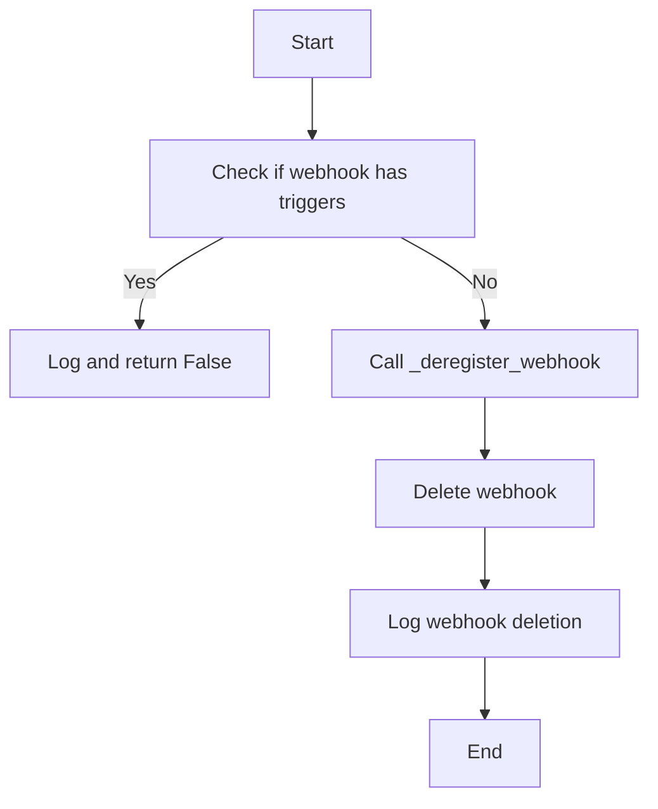
```mermaid
graph TD
    A[Start] --> B[Check if webhook has triggers]
    B -->|Yes| C[Log and return False]
    B -->|No| D[Call _deregister_webhook]
    D --> E[Delete webhook]
    E --> F[Log webhook deletion]
    F --> G[End]
```

#### 带注释源码

```python
async def _deregister_webhook(self, webhook: integrations.Webhook, credentials: Credentials):
    # Check if webhook has triggers
    if webhook.triggered_nodes or webhook.triggered_presets:
        # Don't prune webhook if in use
        logger.info(f"Webhook #{webhook.id} kept as it has triggers in other graphs")
        return False

    # Call _deregister_webhook
    if credentials:
        await self._deregister_webhook(webhook, credentials)

    # Delete webhook
    await integrations.delete_webhook(webhook.user_id, webhook.id)

    # Log webhook deletion
    logger.info(f"Webhook #{webhook.id} deleted as it had no remaining triggers")
``` 


### BaseWebhooksManager._create_webhook

This method creates a new webhook for a user, registering it with the provider if required.

参数：

- `user_id`：`str`，The unique identifier for the user.
- `webhook_type`：`WT`，The type of webhook to create.
- `events`：`list[str]`，The events to subscribe to for the webhook.
- `resource`：`str`，The resource to receive events for (default is an empty string).
- `credentials`：`Optional[Credentials]`，The credentials to use for creating the webhook (required if `register` is `True`).
- `register`：`bool`，Whether to register the webhook with the provider (default is `True`).

返回值：`integrations.Webhook`，The created webhook object.

#### 流程图

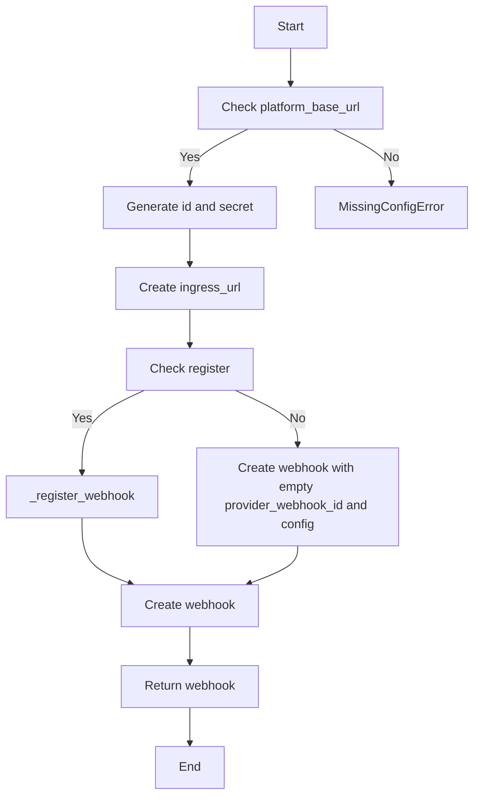
```mermaid
graph TD
    A[Start] --> B[Check platform_base_url]
    B -->|Yes| C[Generate id and secret]
    B -->|No| D[MissingConfigError]
    C --> E[Create ingress_url]
    E --> F[Check register]
    F -->|Yes| G[_register_webhook]
    F -->|No| H[Create webhook with empty provider_webhook_id and config]
    G --> I[Create webhook]
    H --> I
    I --> J[Return webhook]
    J --> K[End]
```

#### 带注释源码

```python
async def _create_webhook(
    self,
    user_id: str,
    webhook_type: WT,
    events: list[str],
    resource: str = "",
    credentials: Optional[Credentials] = None,
    register: bool = True,
) -> integrations.Webhook:
    if not app_config.platform_base_url:
        raise MissingConfigError(
            "PLATFORM_BASE_URL must be set to use Webhook functionality"
        )

    id = str(uuid4())
    secret = secrets.token_hex(32)
    provider_name: ProviderName = self.PROVIDER_NAME
    ingress_url = webhook_ingress_url(provider_name=provider_name, webhook_id=id)
    if register:
        if not credentials:
            raise TypeError("credentials are required if register = True")
        provider_webhook_id, config = await self._register_webhook(
            credentials, webhook_type, resource, events, ingress_url, secret
        )
    else:
        provider_webhook_id, config = "", {}

    return await integrations.create_webhook(
        integrations.Webhook(
            id=id,
            user_id=user_id,
            provider=provider_name,
            credentials_id=credentials.id if credentials else "",
            webhook_type=webhook_type,
            resource=resource,
            events=events,
            provider_webhook_id=provider_webhook_id,
            config=config,
            secret=secret,
        )
    )
```


## 关键组件


### 张量索引与惰性加载

用于高效地索引和访问张量数据，同时延迟加载数据以优化性能。

### 反量化支持

提供对反量化操作的支持，允许在量化过程中进行逆量化以恢复原始精度。

### 量化策略

定义了不同的量化策略，用于在模型训练和推理过程中调整模型参数的精度。 


## 问题及建议


### 已知问题

-   **代码重复**：`_create_webhook` 方法中，对于 `register` 为 `True` 的情况，存在重复的代码来注册 webhook。可以考虑将注册 webhook 的逻辑提取到一个单独的方法中，以减少代码重复。
-   **异常处理**：`_create_webhook` 方法中，如果 `credentials` 为 `None` 且 `register` 为 `True`，会抛出 `TypeError`。然而，在 `get_manual_webhook` 方法中，没有对 `credentials` 进行检查，这可能导致潜在的错误。
-   **配置错误**：`_create_webhook` 和 `get_suitable_auto_webhook` 方法中，如果 `app_config.platform_base_url` 为空，会抛出 `MissingConfigError`。然而，没有检查 `credentials` 对象是否存在，这可能导致在调用 `_register_webhook` 方法时出现异常。
-   **类型提示**：`_register_webhook` 和 `_deregister_webhook` 方法使用了 `...` 来表示方法体，这表明方法体尚未实现。需要确保这些方法有正确的实现，并且类型提示是准确的。

### 优化建议

-   **提取注册 webhook 的逻辑**：将 `_create_webhook` 方法中注册 webhook 的逻辑提取到一个单独的方法中，例如 `register_webhook`，以减少代码重复并提高可维护性。
-   **增强异常处理**：在所有可能抛出异常的地方添加适当的异常处理逻辑，确保应用程序能够优雅地处理错误情况。
-   **检查配置和凭证**：在调用可能抛出异常的方法之前，检查必要的配置和凭证是否存在，以避免潜在的错误。
-   **实现抽象方法**：确保所有抽象方法（例如 `_register_webhook` 和 `_deregister_webhook`）都有正确的实现，并且类型提示是准确的。
-   **代码审查**：进行代码审查，以发现潜在的问题并确保代码质量。
-   **单元测试**：编写单元测试来覆盖关键功能，确保代码的稳定性和可靠性。


## 其它


### 设计目标与约束

- 设计目标：
  - 提供一个通用的Webhooks管理器，支持自动和手动创建、更新、删除Webhooks。
  - 确保Webhook的安全性和可靠性，包括验证请求和配置。
  - 提供灵活的扩展性，允许不同类型的Webhook处理。
- 约束：
  - 必须使用配置的`PLATFORM_BASE_URL`。
  - 必须提供有效的`credentials`以创建Webhook。
  - Webhook的创建、更新和删除操作必须通过抽象方法实现。

### 错误处理与异常设计

- 错误处理：
  - 使用`MissingConfigError`异常处理配置错误。
  - 使用`TypeError`异常处理类型错误。
  - 使用`NotImplementedError`异常处理不支持的操作。
- 异常设计：
  - 定义自定义异常类，如`MissingConfigError`，以提供清晰的错误信息。
  - 异常应提供足够的信息，以便调用者能够了解错误的原因和可能的解决方案。

### 数据流与状态机

- 数据流：
  - 用户请求创建、更新或删除Webhook。
  - 系统验证请求和配置。
  - 系统与外部集成（如数据库、服务提供商）交互以执行操作。
  - 系统返回操作结果或错误信息。
- 状态机：
  - Webhook可能处于以下状态：未注册、已注册、已删除。
  - 状态转换由操作（如创建、更新、删除）触发。

### 外部依赖与接口契约

- 外部依赖：
  - `fastapi`：用于构建API。
  - `strenum`：用于枚举类型。
  - `uuid`：用于生成唯一标识符。
  - `secrets`：用于生成安全密钥。
  - `logging`：用于日志记录。
  - `backend.data.integrations`：用于集成外部服务。
  - `backend.data.model`：用于数据模型。
  - `backend.integrations.providers`：用于提供者名称。
  - `backend.util.exceptions`：用于自定义异常。
  - `backend.util.settings`：用于配置。
- 接口契约：
  - `BaseWebhooksManager`类定义了Webhooks管理器的基本接口。
  - 抽象方法`_register_webhook`、`_deregister_webhook`和`validate_payload`需要由子类实现。
  - `integrations`模块提供了与外部集成服务交互的接口。


    