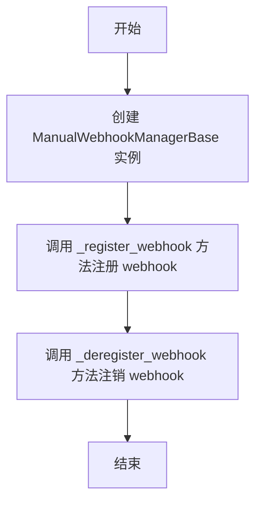
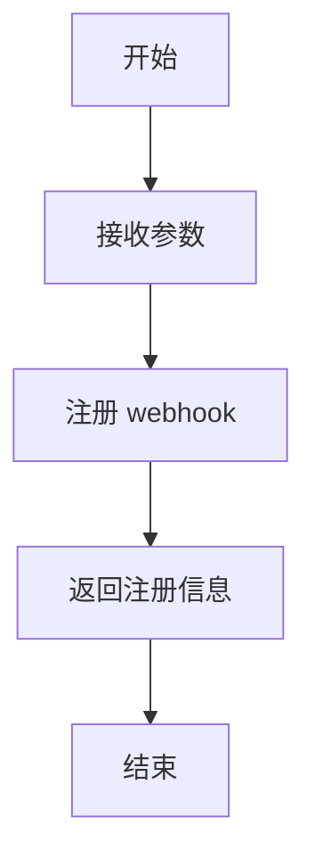
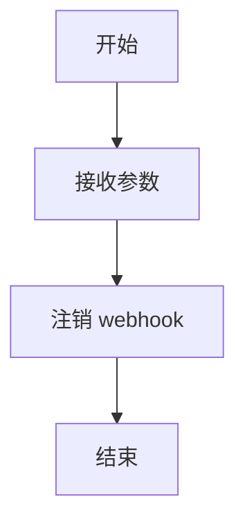

# `.\AutoGPT\autogpt_platform\backend\backend\integrations\webhooks\_manual_base.py` 详细设计文档

The code defines a base class for managing manual webhooks, providing methods for registering and deregistering webhooks.

## 整体流程



## 类结构

```
ManualWebhookManagerBase (继承自 BaseWebhooksManager[WT])
```

## 全局变量及字段


### `logger`
    
Logger instance used for logging messages within the class.

类型：`logging.getLogger`
    


    

## 全局函数及方法


### `_register_webhook`

Registers a manual webhook with the given credentials and configuration.

参数：

- `credentials`：`Credentials`，The credentials required to register the webhook.
- `webhook_type`：`WT`，The type of webhook to register.
- `resource`：`str`，The resource for which the webhook is registered.
- `events`：`list[str]`，The events that trigger the webhook.
- `ingress_url`：`str`，The URL where the webhook will receive requests.
- `secret`：`str`，The secret used to authenticate requests to the webhook.

返回值：`tuple[str, dict]`，An empty string and an empty dictionary, indicating the registration was successful.

#### 流程图



#### 带注释源码

```
async def _register_webhook(
    self,
    credentials: Credentials,
    webhook_type: WT,
    resource: str,
    events: list[str],
    ingress_url: str,
    secret: str,
) -> tuple[str, dict]:
    # TODO: pass ingress_url to user in frontend
    # See: https://github.com/Significant-Gravitas/AutoGPT/issues/8537
    logger.debug(f"Manual webhook registered with ingress URL: {ingress_url}")

    return "", {}
```


### `_deregister_webhook`

Deregisters a manual webhook with the given webhook and credentials.

参数：

- `webhook`：`integrations.Webhook`，The webhook object to be deregistered.
- `credentials`：`Credentials`，The credentials required for deregistration.

返回值：`None`，No value is returned as the method is void.

#### 流程图



#### 带注释源码

```
async def _deregister_webhook(self,
                                webhook: integrations.Webhook,
                                credentials: Credentials):
    pass
```


## 关键组件


### 张量索引与惰性加载

用于在数据加载时延迟计算，直到实际需要时才进行，以优化性能和资源使用。

### 反量化支持

提供对反量化操作的支持，允许在量化过程中进行逆量化操作。

### 量化策略

定义了量化策略，用于在模型训练和推理过程中对模型参数进行量化。


## 问题及建议


### 已知问题

-   {问题1}：代码中存在一个 TODO 注释，指出需要将 `ingress_url` 传递给前端用户，但尚未实现。这可能导致前端无法正确配置 webhook。
-   {问题2}：`_deregister_webhook` 方法没有实现任何逻辑，只是简单地返回 `None`。这表明 webhook 注销功能可能未完全实现或未测试。
-   {问题3}：`ManualWebhookManagerBase` 类继承自 `BaseWebhooksManager`，但没有在文档中说明为什么需要继承，以及继承的具体实现细节。

### 优化建议

-   {建议1}：实现 TODO 注释中提到的功能，将 `ingress_url` 传递给前端用户，以便前端可以正确配置 webhook。
-   {建议2}：实现 `_deregister_webhook` 方法，确保 webhook 注销功能正常工作，并进行适当的测试。
-   {建议3}：在文档中详细说明 `ManualWebhookManagerBase` 类继承 `BaseWebhooksManager` 的原因和具体实现细节，以便于理解和管理代码。
-   {建议4}：考虑添加错误处理和异常设计，以确保在注册或注销 webhook 时能够处理可能出现的错误情况。
-   {建议5}：优化日志记录，确保记录足够的信息来帮助调试和监控 webhook 的注册和注销过程。


## 其它


### 设计目标与约束

- 设计目标：实现一个可扩展的Webhook管理器，支持手动注册和注销Webhook。
- 约束：确保Webhook注册和注销过程安全可靠，符合API规范。

### 错误处理与异常设计

- 错误处理：在注册和注销Webhook时，捕获可能的异常，并记录错误日志。
- 异常设计：定义自定义异常类，用于处理特定错误情况。

### 数据流与状态机

- 数据流：从前端接收Webhook注册和注销请求，通过API与后端服务交互，返回处理结果。
- 状态机：定义Webhook的生命周期状态，如注册中、已注册、注销中等。

### 外部依赖与接口契约

- 外部依赖：依赖后端数据模块和集成模块。
- 接口契约：定义与后端服务交互的API接口规范。

### 安全性与认证

- 安全性：确保Webhook注册和注销过程中的数据传输安全。
- 认证：验证用户身份，确保只有授权用户可以注册和注销Webhook。

### 性能优化

- 性能优化：优化Webhook注册和注销的响应时间，提高系统吞吐量。

### 可维护性与可扩展性

- 可维护性：代码结构清晰，易于理解和维护。
- 可扩展性：设计允许未来添加新的Webhook类型和处理逻辑。

### 测试与质量保证

- 测试：编写单元测试和集成测试，确保代码质量和功能正确性。
- 质量保证：持续集成和部署，确保代码质量。

### 文档与用户指南

- 文档：提供详细的设计文档和用户指南，帮助开发者理解和使用该模块。
- 用户指南：提供操作步骤和常见问题解答。


    