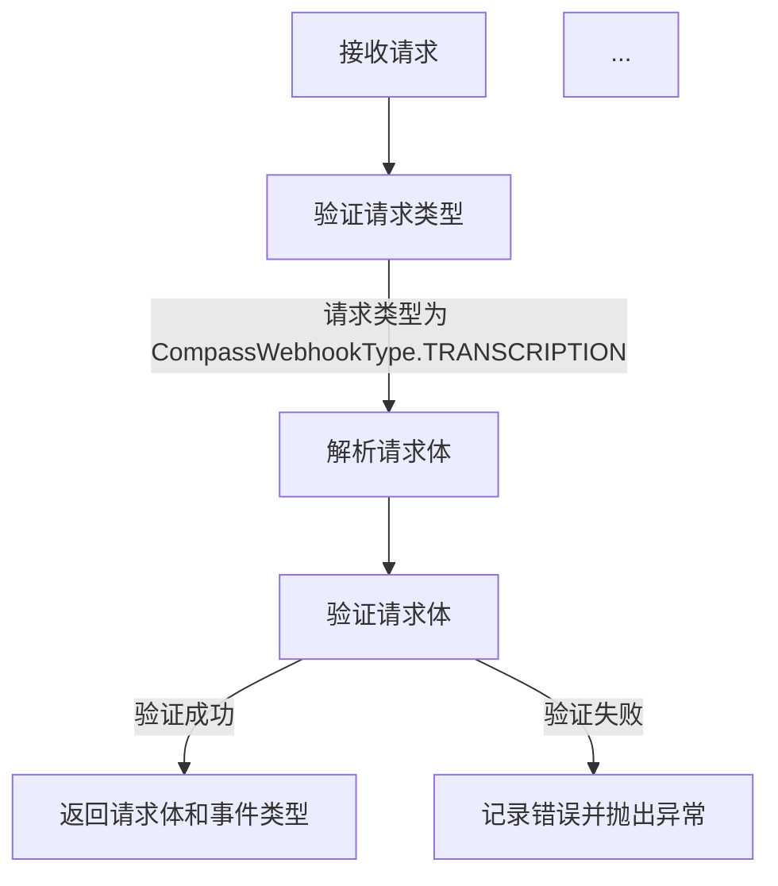

# `.\AutoGPT\autogpt_platform\backend\backend\integrations\webhooks\compass.py` 详细设计文档

The code defines a CompassWebhookManager class that manages webhooks for the Compass service, validating payloads and handling requests asynchronously.

## 整体流程



## 类结构

```
ManualWebhookManagerBase (抽象基类)
├── CompassWebhookManager
```

## 全局变量及字段


### `logger`
    
Logger instance for the module.

类型：`logging.Logger`
    


### `CompassWebhookManager.PROVIDER_NAME`
    
The provider name constant for Compass integration.

类型：`ProviderName`
    


### `CompassWebhookManager.WebhookType`
    
The webhook type enum for Compass integration.

类型：`CompassWebhookType`
    
    

## 全局函数及方法


### CompassWebhookManager.validate_payload

This function validates the payload of a webhook request from the Compass provider.

参数：

- `webhook`：`integrations.Webhook`，The webhook object containing the necessary information about the webhook.
- `request`：`Request`，The FastAPI request object that contains the incoming webhook payload.
- `credentials`：`Credentials | None`，Optional credentials object for additional authentication or configuration.

返回值：`tuple[dict, str]`，A tuple containing the validated payload as a dictionary and the event type as a string.

#### 流程图

```mermaid
graph TD
    A[Start] --> B[Extract payload from request]
    B --> C[Set event type to "transcription"]
    C --> D[Return payload and event type]
    D --> E[End]
```

#### 带注释源码

```
import logging
from fastapi import Request
from strenum import StrEnum

from backend.data import integrations
from backend.integrations.providers import ProviderName
from backend.sdk import Credentials
from ._manual_base import ManualWebhookManagerBase

logger = logging.getLogger(__name__)

class CompassWebhookType(StrEnum):
    TRANSCRIPTION = "transcription"
    TASK = "task"

class CompassWebhookManager(ManualWebhookManagerBase):
    PROVIDER_NAME = ProviderName.COMPASS
    WebhookType = CompassWebhookType

    @classmethod
    async def validate_payload(
        cls,
        webhook: integrations.Webhook,
        request: Request,
        credentials: Credentials | None,
    ) -> tuple[dict, str]:
        payload = await request.json()
        event_type = CompassWebhookType.TRANSCRIPTION  # currently the only type
        return payload, event_type
```


## 关键组件


### 张量索引与惰性加载

用于高效地处理和索引大型数据集，通过延迟加载数据来减少内存消耗。

### 反量化支持

提供对反量化操作的支持，允许在量化过程中进行逆量化处理。

### 量化策略

定义了量化策略，用于在模型训练和推理过程中对权重和激活进行量化。


## 问题及建议


### 已知问题

-   {问题1}：代码中`CompassWebhookType.TRANSCRIPTION`被设置为当前唯一的类型，但未来可能需要支持更多类型，这种硬编码的方式可能需要修改多个地方。
-   {问题2}：`validate_payload`方法中，`event_type`被硬编码为`CompassWebhookType.TRANSCRIPTION`，如果需要支持其他类型，需要修改该方法。
-   {问题3}：`validate_payload`方法中，没有对`credentials`参数进行使用，如果未来需要使用凭证进行验证，需要添加相应的逻辑。

### 优化建议

-   {建议1}：将`CompassWebhookType`的值存储在一个配置文件或环境变量中，以便于管理和更新。
-   {建议2}：在`validate_payload`方法中，增加对`event_type`的动态获取逻辑，以便支持多种类型。
-   {建议3}：在`validate_payload`方法中，添加对`credentials`参数的使用，以便进行身份验证。
-   {建议4}：考虑增加单元测试，以确保`validate_payload`方法在不同情况下的正确性。
-   {建议5}：考虑增加日志记录，以便于调试和监控。


## 其它


### 设计目标与约束

- 设计目标：
  - 实现一个可扩展的Webhook管理器，用于处理Compass集成的事件。
  - 提供一个统一的接口来验证和处理Webhook事件。
  - 确保Webhook事件的安全性和可靠性。

- 约束：
  - 必须使用FastAPI框架进行Web服务开发。
  - 需要遵守Compass集成提供的规范和协议。
  - 应确保所有敏感数据（如凭证）的安全存储和处理。

### 错误处理与异常设计

- 错误处理：
  - 使用FastAPI的异常处理机制来捕获和处理可能发生的错误。
  - 定义自定义异常类，以便于更好地管理和记录错误。

- 异常设计：
  - `ValueError`：当Webhook事件类型不符合预期时抛出。
  - `IntegrationError`：当与Compass集成通信失败时抛出。

### 数据流与状态机

- 数据流：
  - Webhook事件通过HTTP请求接收。
  - 请求被解析并验证。
  - 验证后的数据被处理。

- 状态机：
  - Webhook事件处理流程包括接收、验证、处理和响应。

### 外部依赖与接口契约

- 外部依赖：
  - FastAPI框架。
  - `strenum`库用于枚举类型。
  - `logging`库用于日志记录。
  - `backend.data`模块中的`integrations`。
  - `backend.integrations.providers`模块中的`ProviderName`。
  - `backend.sdk`模块中的`Credentials`。

- 接口契约：
  - Webhook请求必须包含有效的JSON负载。
  - 必须提供有效的Compass集成凭证。
  - Webhook事件类型必须是预定义的类型之一。


    