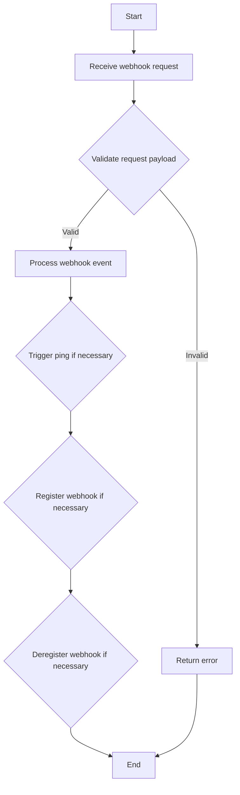
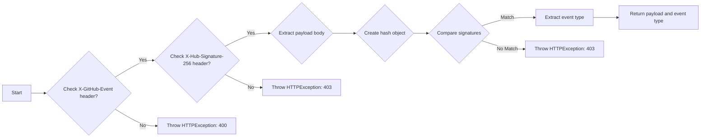
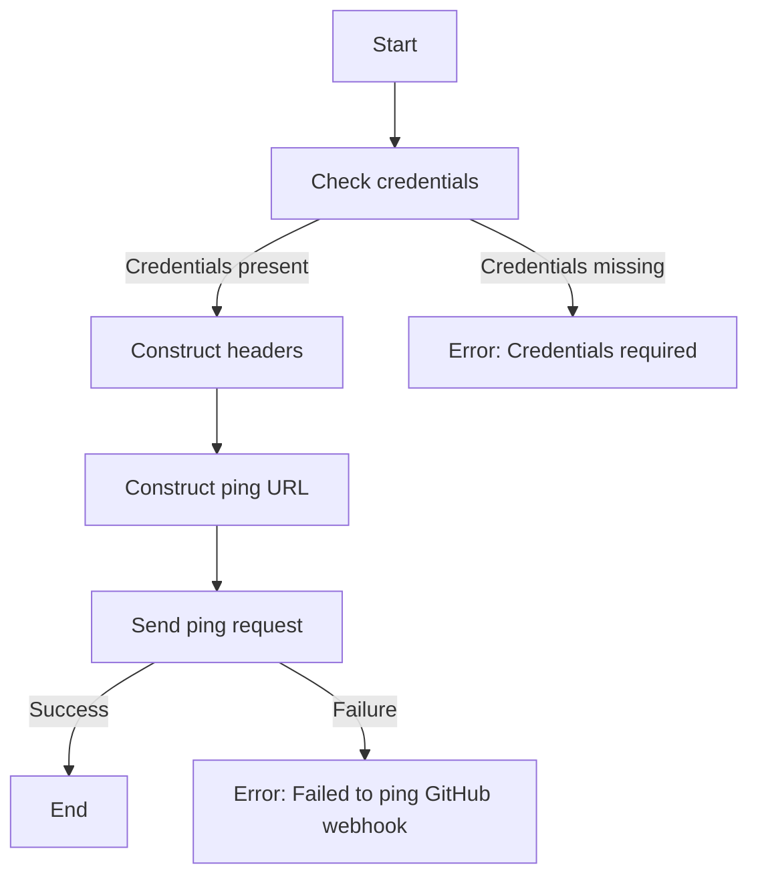
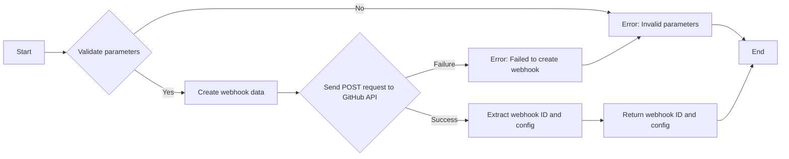
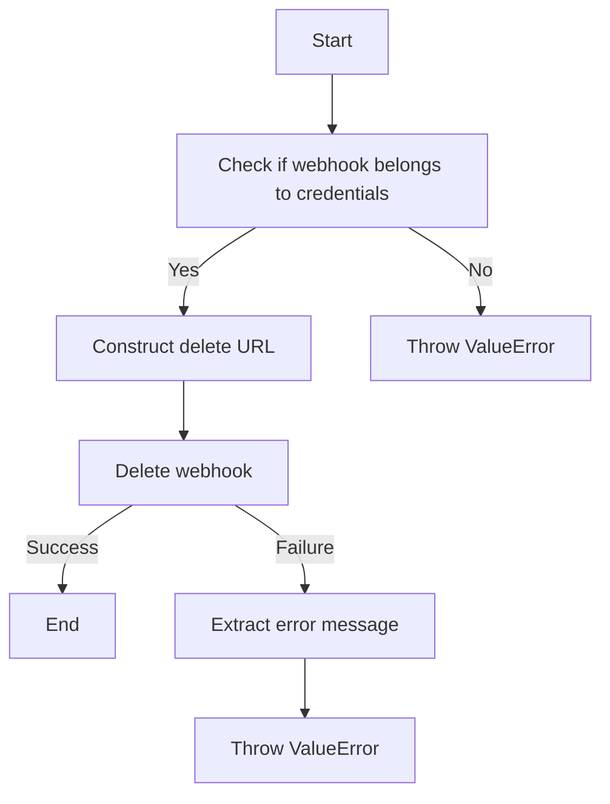

# `.\AutoGPT\autogpt_platform\backend\backend\integrations\webhooks\github.py` 详细设计文档

The code manages GitHub webhooks, handling validation, registration, and deregistration of webhooks, and sending pings to ensure they are active.

## 整体流程



## 类结构

```
GithubWebhooksManager (Concrete class)
├── BaseWebhooksManager (Abstract base class)
```

## 全局变量及字段


### `logger`
    
Logger instance for logging purposes.

类型：`logging.Logger`
    


### `GithubWebhooksManager.PROVIDER_NAME`
    
Provider name for GitHub integration.

类型：`backend.integrations.providers.ProviderName`
    


### `GithubWebhooksManager.WebhookType`
    
Enum for GitHub webhook types.

类型：`strenum.StrEnum`
    


### `GithubWebhooksManager.GITHUB_API_URL`
    
Base URL for GitHub API.

类型：`str`
    


### `GithubWebhooksManager.GITHUB_API_DEFAULT_HEADERS`
    
Default headers for GitHub API requests.

类型：`dict`
    


### `GithubWebhooksManager.PROVIDER_NAME`
    
Provider name for GitHub integration.

类型：`backend.integrations.providers.ProviderName`
    


### `GithubWebhooksManager.WebhookType`
    
Enum for GitHub webhook types.

类型：`strenum.StrEnum`
    


### `GithubWebhooksManager.GITHUB_API_URL`
    
Base URL for GitHub API.

类型：`str`
    


### `GithubWebhooksManager.GITHUB_API_DEFAULT_HEADERS`
    
Default headers for GitHub API requests.

类型：`dict`
    
    

## 全局函数及方法


### extract_github_error_msg

Extracts and formats error messages from a GitHub API response.

参数：

- `response`：`Response`，The response object from the GitHub API.

返回值：`str`，A string containing the formatted error messages.

#### 流程图

```mermaid
graph LR
A[Start] --> B{Check "message"}
B -->|Yes| C[Add to error_msgs]
B -->|No| D{Check "errors"}
D -->|Yes| E[Iterate over errors]
D -->|No| F{Check "error"}
F -->|Yes| G[Add to error_msgs]
F -->|No| H[End]
E -->|Each error| E
C --> I[End]
G --> I
```

#### 带注释源码

```python
def extract_github_error_msg(response: Response) -> str:
    error_msgs = []
    resp = response.json()
    if resp.get("message"):
        error_msgs.append(resp["message"])
    if resp.get("errors"):
        error_msgs.extend(f"* {err.get('message', err)}" for err in resp["errors"])
    if resp.get("error"):
        if isinstance(resp["error"], dict):
            error_msgs.append(resp["error"].get("message", resp["error"]))
        else:
            error_msgs.append(resp["error"])
    return "\n".join(error_msgs)
``` 


### `GithubWebhooksManager.validate_payload`

This method validates the payload of a GitHub webhook request by checking the event type and signature.

参数：

- `webhook`：`integrations.Webhook`，The webhook object containing the necessary information for validation.
- `request`：`Request`，The FastAPI request object containing the incoming webhook payload.
- `credentials`：`Credentials | None`，The credentials object for the GitHub account, which may be `None` if not required.

返回值：`tuple[dict, str]`，A tuple containing the validated payload as a dictionary and the event type as a string.

#### 流程图



#### 带注释源码

```python
@classmethod
async def validate_payload(
    cls,
    webhook: integrations.Webhook,
    request: Request,
    credentials: Credentials | None,
) -> tuple[dict, str]:
    if not (event_type := request.headers.get("X-GitHub-Event")):
        raise HTTPException(
            status_code=400, detail="X-GitHub-Event header is missing!"
        )

    if not (signature_header := request.headers.get("X-Hub-Signature-256")):
        raise HTTPException(
            status_code=403, detail="X-Hub-Signature-256 header is missing!"
        )

    payload_body = await request.body()
    hash_object = hmac.new(
        webhook.secret.encode("utf-8"), msg=payload_body, digestmod=hashlib.sha256
    )
    expected_signature = "sha256=" + hash_object.hexdigest()

    if not hmac.compare_digest(expected_signature, signature_header):
        raise HTTPException(
            status_code=403, detail="Request signatures didn't match!"
        )

    payload = await request.json()
    if action := payload.get("action"):
        event_type += f".{action}"

    return payload, event_type
```


### `GithubWebhooksManager.trigger_ping`

This method triggers a ping to a GitHub webhook to ensure it is active and functioning correctly.

参数：

- `webhook`：`integrations.Webhook`，The webhook object containing the necessary information to trigger the ping.
- `credentials`：`Credentials | None`，The credentials object required to authenticate the request to GitHub.

返回值：`None`，This method does not return any value.

#### 流程图



#### 带注释源码

```python
async def trigger_ping(
    self, webhook: integrations.Webhook, credentials: Credentials | None
) -> None:
    if not credentials:
        raise ValueError("Credentials are required but were not passed")

    headers = {
        **self.GITHUB_API_DEFAULT_HEADERS,
        "Authorization": credentials.auth_header(),
    }

    repo, github_hook_id = webhook.resource, webhook.provider_webhook_id
    ping_url = f"{self.GITHUB_API_URL}/repos/{repo}/hooks/{github_hook_id}/pings"

    response = await Requests().post(ping_url, headers=headers)

    if response.status != 204:
        error_msg = extract_github_error_msg(response)
        raise ValueError(f"Failed to ping GitHub webhook: {error_msg}")
```


### `_register_webhook`

This method registers a new GitHub webhook for a given resource.

参数：

- `credentials`：`Credentials`，The credentials object containing the necessary authentication information.
- `webhook_type`：`GithubWebhookType`，The type of webhook to register (e.g., `REPO`).
- `resource`：`str`，The resource for which the webhook is being registered (e.g., 'owner/repo').
- `events`：`list[str]`，The list of events that the webhook should listen for.
- `ingress_url`：`str`，The URL to which the webhook notifications will be sent.
- `secret`：`str`，The secret used to sign the webhook payloads.

返回值：`tuple[str, dict]`，A tuple containing the webhook ID as a string and the webhook configuration as a dictionary.

#### 流程图



#### 带注释源码

```python
async def _register_webhook(
    self,
    credentials: Credentials,
    webhook_type: GithubWebhookType,
    resource: str,
    events: list[str],
    ingress_url: str,
    secret: str,
) -> tuple[str, dict]:
    if webhook_type == self.WebhookType.REPO and resource.count("/") > 1:
        raise ValueError("Invalid repo format: expected 'owner/repo'")

    # Extract main event, e.g. `pull_request.opened` -> `pull_request`
    github_events = list({event.split(".")[0] for event in events})

    headers = {
        **self.GITHUB_API_DEFAULT_HEADERS,
        "Authorization": credentials.auth_header(),
    }
    webhook_data = {
        "name": "web",
        "active": True,
        "events": github_events,
        "config": {
            "url": ingress_url,
            "content_type": "json",
            "insecure_ssl": "0",
            "secret": secret,
        },
    }

    response = await Requests().post(
        f"{self.GITHUB_API_URL}/repos/{resource}/hooks",
        headers=headers,
        json=webhook_data,
    )

    if response.status != 201:
        error_msg = extract_github_error_msg(response)
        if "not found" in error_msg.lower():
            error_msg = (
                f"{error_msg} "
                "(Make sure the GitHub account or API key has 'repo' or "
                f"webhook create permissions to '{resource}')"
            )
        raise ValueError(f"Failed to create GitHub webhook: {error_msg}")

    resp = response.json()
    webhook_id = resp["id"]
    config = resp["config"]

    return str(webhook_id), config
```


### `_deregister_webhook`

This method is responsible for deregistering a GitHub webhook by deleting it from the GitHub API.

参数：

- `webhook`：`integrations.Webhook`，The webhook object that contains information about the webhook to be deregistered.
- `credentials`：`Credentials`，The credentials object that contains the authentication information required to delete the webhook.

返回值：`None`，This method does not return any value.

#### 流程图



#### 带注释源码

```python
async def _deregister_webhook(self, webhook: integrations.Webhook, credentials: Credentials) -> None:
    webhook_type = self.WebhookType(webhook.webhook_type)
    if webhook.credentials_id != credentials.id:
        raise ValueError(
            f"Webhook #{webhook.id} does not belong to credentials {credentials.id}"
        )

    headers = {
        **self.GITHUB_API_DEFAULT_HEADERS,
        "Authorization": credentials.auth_header(),
    }

    if webhook_type == self.WebhookType.REPO:
        repo = webhook.resource
        delete_url = f"{self.GITHUB_API_URL}/repos/{repo}/hooks/{webhook.provider_webhook_id}"
    else:
        raise NotImplementedError(
            f"Unsupported webhook type '{webhook.webhook_type}'"
        )

    response = await Requests().delete(delete_url, headers=headers)

    if response.status not in [204, 404]:
        # 204 means successful deletion, 404 means the webhook was already deleted
        error_msg = extract_github_error_msg(response)
        raise ValueError(f"Failed to delete GitHub webhook: {error_msg}")

    # If we reach here, the webhook was successfully deleted or didn't exist
```


## 关键组件


### 张量索引与惰性加载

张量索引与惰性加载是代码中处理数据结构的核心组件，它允许对大型数据集进行高效访问，同时延迟计算以节省资源。

### 反量化支持

反量化支持是代码中用于处理量化数据的核心组件，它允许在量化过程中进行逆量化操作，以便在需要时恢复原始数据。

### 量化策略

量化策略是代码中用于优化数据表示和计算的核心组件，它通过减少数据精度来减少内存使用和计算时间。


## 问题及建议


### 已知问题

-   **全局变量和函数依赖性**：`extract_github_error_msg` 函数被多个地方调用，但它是全局定义的，这可能导致代码难以维护和测试。
-   **异常处理**：异常处理主要集中在 HTTPException 和 ValueError，但没有对其他可能的异常（如网络请求失败）进行详细的处理。
-   **代码重复**：`trigger_ping` 和 `_register_webhook` 方法中都有类似的错误处理逻辑，这可以通过提取公共函数来减少代码重复。
-   **类型注解**：代码中缺少类型注解，这可能会在大型项目中导致类型检查困难。
-   **日志记录**：日志记录主要集中在错误处理，但可能需要更多的日志记录来帮助调试和监控。

### 优化建议

-   **重构全局函数**：将 `extract_github_error_msg` 函数移动到单独的模块中，并确保所有调用该函数的地方都使用相同的引用。
-   **增强异常处理**：添加对网络请求失败的异常处理，并记录更详细的错误信息。
-   **减少代码重复**：提取公共的错误处理逻辑到一个单独的函数中，并在需要的地方调用它。
-   **添加类型注解**：为所有函数和变量添加类型注解，以提高代码的可读性和可维护性。
-   **改进日志记录**：增加日志记录的粒度，记录关键步骤和潜在的问题，以便于调试和监控。
-   **单元测试**：编写单元测试来覆盖关键功能，确保代码的稳定性和可靠性。
-   **代码风格**：遵循一致的代码风格指南，以提高代码的可读性和可维护性。
-   **文档**：为代码添加详细的文档注释，包括函数和类的用途、参数和返回值等。


## 其它


### 设计目标与约束

- 设计目标：
  - 提供一个用于管理GitHub webhook的生命周期的方法。
  - 确保webhook的安全性和可靠性。
  - 提供清晰的API接口，方便其他服务调用。
- 约束：
  - 必须使用GitHub API进行操作。
  - 必须处理认证和授权。
  - 必须处理错误和异常情况。

### 错误处理与异常设计

- 错误处理：
  - 使用HTTPException来处理HTTP错误。
  - 使用ValueError来处理业务逻辑错误。
  - 使用NotImplementedError来处理未实现的功能。
- 异常设计：
  - 异常应该提供足够的信息，以便调用者能够了解错误的原因。
  - 异常应该遵循PEP 8标准。

### 数据流与状态机

- 数据流：
  - 数据从请求中获取，经过验证和处理，然后发送到GitHub API。
  - 数据从GitHub API返回，经过解析和处理，然后返回给调用者。
- 状态机：
  - Webhook的生命周期包括注册、激活、触发ping、注销等状态。

### 外部依赖与接口契约

- 外部依赖：
  - fastapi：用于构建API。
  - strenum：用于枚举类型。
  - hashlib：用于哈希处理。
  - hmac：用于HMAC验证。
  - logging：用于日志记录。
  - backend.data：用于数据存储。
  - backend.integrations.providers：用于提供者名称。
  - backend.util.request：用于HTTP请求。
- 接口契约：
  - API接口应该遵循RESTful设计原则。
  - API接口应该提供清晰的文档。


    