# `.\AutoGPT\autogpt_platform\backend\backend\integrations\webhooks\graph_lifecycle_hooks.py` 详细设计文档

The code manages the lifecycle of webhooks associated with nodes in a graph, including activation, deactivation, and deletion.

## 整体流程

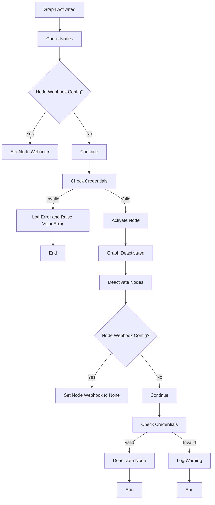

## 类结构

```
BaseWebhooksManager (抽象类)
├── WebhookManager (具体实现)
│   ├── prune_webhook_if_dangling (方法)
│   └── ... 
```

## 全局变量及字段


### `logger`
    
Logger instance for the module.

类型：`logging.Logger`
    


### `credentials_manager`
    
Manager for integration credentials.

类型：`backend.integrations.creds_manager.IntegrationCredentialsManager`
    


### `get_webhook_manager`
    
Function to get webhook manager for a provider.

类型：`function`
    


### `supports_webhooks`
    
Function to check if a provider supports webhooks.

类型：`function`
    


### `GraphModel.sub_graphs`
    
List of sub_graphs in the GraphModel.

类型：`list`
    


### `GraphModel.nodes`
    
List of nodes in the GraphModel.

类型：`list`
    


### `NodeModel.block`
    
Block schema associated with the NodeModel.

类型：`backend.data.block.BlockSchema`
    


### `NodeModel.input_default`
    
Default input values for the NodeModel.

类型：`dict`
    


### `NodeModel.webhook_id`
    
Webhook ID associated with the NodeModel.

类型：`str`
    


### `NodeModel.webhook`
    
Webhook object associated with the NodeModel.

类型：`backend.data.graph.Webhook`
    


### `BlockSchema.input_schema`
    
Input schema for the BlockSchema.

类型：`dict`
    


### `Credentials.id`
    
ID of the Credentials object.

类型：`str`
    


### `GraphModel.GraphModel`
    
Model representing a graph.

类型：`GraphModel`
    


### `NodeModel.NodeModel`
    
Model representing a node in a graph.

类型：`NodeModel`
    


### `BlockSchema.BlockSchema`
    
Schema for a block.

类型：`BlockSchema`
    


### `Credentials.Credentials`
    
Model representing credentials.

类型：`Credentials`
    
    

## 全局函数及方法


### on_graph_activate

This function is a hook that is called when a graph is activated or created. It ensures that all nodes within the graph are activated and that any sub-graphs are also activated.

参数：

- `graph`：`GraphModel`，The graph that is being activated.
- `user_id`：`str`，The ID of the user who is activating the graph.

返回值：`GraphModel`，The activated graph.

#### 流程图

```mermaid
graph TD
    A[Start] --> B[Call _on_graph_activate(graph, user_id)]
    B --> C[Wait for _on_graph_activate to complete]
    C --> D[Set graph.sub_graphs to the result of _on_graph_activate for each sub_graph]
    D --> E[Return the activated graph]
    E --> F[End]
```

#### 带注释源码

```python
async def on_graph_activate(graph: "GraphModel", user_id: str) -> "GraphModel":
    """
    Hook to be called when a graph is activated/created.

    ⚠️ Assuming node entities are not re-used between graph versions, ⚠️
    this hook calls `on_node_activate` on all nodes in this graph.
    """
    graph = await _on_graph_activate(graph, user_id)
    graph.sub_graphs = await asyncio.gather(
        *(_on_graph_activate(sub_graph, user_id) for sub_graph in graph.sub_graphs)
    )
    return graph
```


### `_on_graph_activate`

This function is an asynchronous method that activates a graph by ensuring all nodes within the graph are activated. It also checks for the existence of credentials associated with the nodes and raises a `ValueError` if any non-existent credentials are found.

参数：

- `graph`：`BaseGraph | GraphModel`，The graph object to be activated.
- `user_id`：`str`，The identifier of the user associated with the graph.

返回值：`BaseGraph | GraphModel`，The activated graph object.

#### 流程图

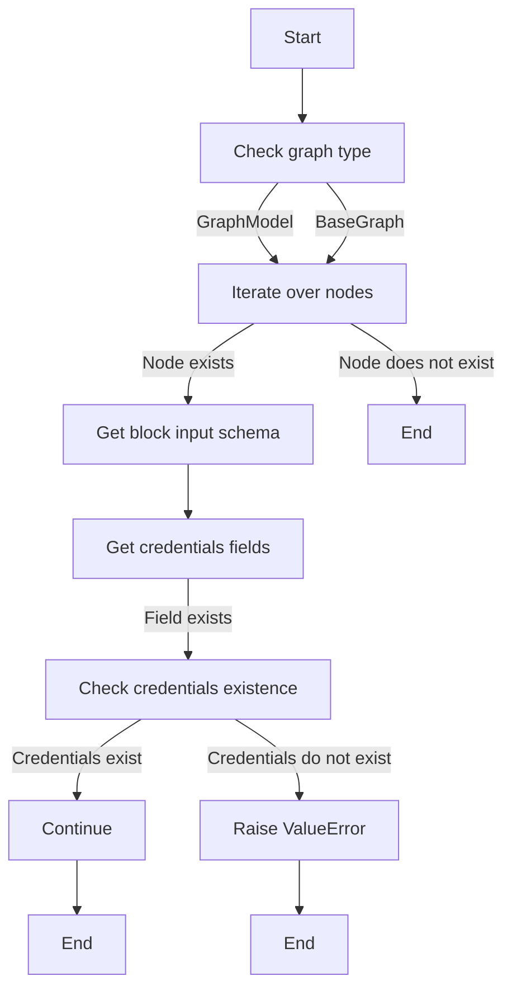

#### 带注释源码

```python
async def _on_graph_activate(graph: "BaseGraph | GraphModel", user_id: str):
    get_credentials = credentials_manager.cached_getter(user_id)
    for new_node in graph.nodes:
        block_input_schema = cast(BlockSchema, new_node.block.input_schema)

        for creds_field_name in block_input_schema.get_credentials_fields().keys():
            # Prevent saving graph with non-existent credentials
            if (
                creds_meta := new_node.input_default.get(creds_field_name)
            ) and not await get_credentials(creds_meta["id"]):
                raise ValueError(
                    f"Node #{new_node.id} input '{creds_field_name}' updated with "
                    f"non-existent credentials #{creds_meta['id']}"
                )
    return graph
```


### on_graph_deactivate

This function is called when a graph is deactivated or deleted. It iterates through all nodes in the graph and calls `on_node_deactivate` on each node, updating the graph's nodes list with the returned updated nodes.

参数：

- `graph`：`GraphModel`，The graph object that is being deactivated.
- `user_id`：`str`，The user ID associated with the graph.

返回值：`GraphModel`，The updated graph object after deactivating the nodes.

#### 流程图

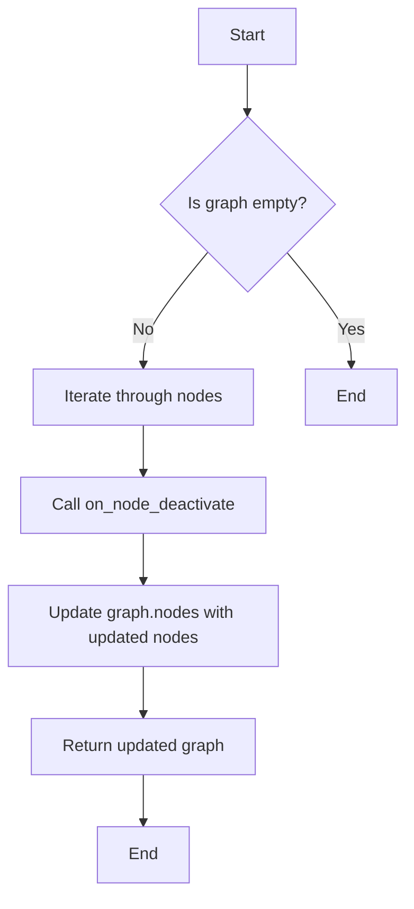

#### 带注释源码

```python
async def on_graph_deactivate(graph: "GraphModel", user_id: str):
    """
    Hook to be called when a graph is deactivated/deleted.

    ⚠️ Assuming node entities are not re-used between graph versions, ⚠️
    this hook calls `on_node_deactivate` on all nodes in `graph`.
    """
    get_credentials = credentials_manager.cached_getter(user_id)
    updated_nodes = []
    for node in graph.nodes:
        # ... (rest of the function)
```


### on_node_deactivate

Hook to be called when node is deactivated/deleted.

参数：

- `user_id`：`str`，The identifier of the user associated with the node.
- `node`：`NodeModel`，The node that is being deactivated/deleted.
- `credentials`：`Optional[Credentials]`，Optional credentials associated with the node.
- `webhooks_manager`：`Optional[BaseWebhooksManager]`，Optional webhooks manager associated with the node.

返回值：`NodeModel`，The updated node after deactivation/deletion.

#### 流程图

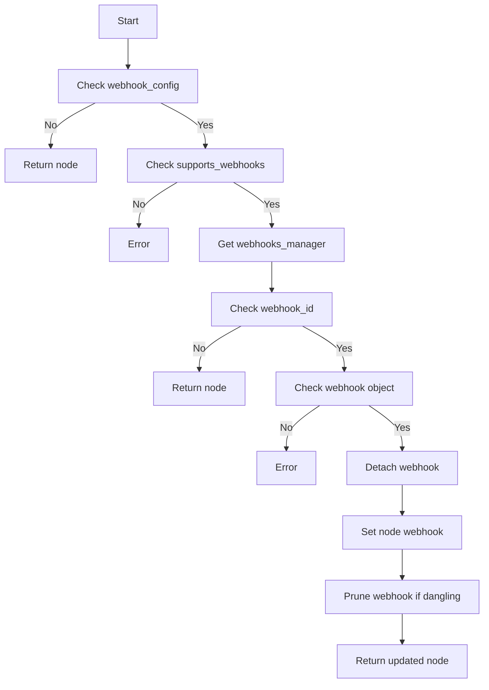

#### 带注释源码

```python
async def on_node_deactivate(
    user_id: str,
    node: "NodeModel",
    *,
    credentials: Optional["Credentials"] = None,
    webhooks_manager: Optional["BaseWebhooksManager"] = None,
) -> "NodeModel":
    """Hook to be called when node is deactivated/deleted"""

    logger.debug(f"Deactivating node #{node.id}")
    block = node.block

    if not block.webhook_config:
        return node

    provider = block.webhook_config.provider
    if not supports_webhooks(provider):
        raise ValueError(
            f"Block #{block.id} has webhook_config for provider {provider} "
            "which does not support webhooks"
        )

    webhooks_manager = get_webhook_manager(provider)

    if node.webhook_id:
        logger.debug(f"Node #{node.id} has webhook_id {node.webhook_id}")
        if not node.webhook:
            logger.error(f"Node #{node.id} has webhook_id but no webhook object")
            raise ValueError("node.webhook not included")

        # Detach webhook from node
        logger.debug(f"Detaching webhook from node #{node.id}")
        updated_node = await set_node_webhook(node.id, None)

        # Prune and deregister the webhook if it is no longer used anywhere
        webhook = node.webhook
        logger.debug(
            f"Pruning{' and deregistering' if credentials else ''} "
            f"webhook #{webhook.id}"
        )
        await webhooks_manager.prune_webhook_if_dangling(
            user_id, webhook.id, credentials
        )
        if (
            cast(BlockSchema, block.input_schema).get_credentials_fields()
            and not credentials
        ):
            logger.warning(
                f"Cannot deregister webhook #{webhook.id}: credentials "
                f"#{webhook.credentials_id} not available "
                f"({webhook.provider.value} webhook ID: {webhook.provider_webhook_id})"
            )
        return updated_node

    logger.debug(f"Node #{node.id} has no webhook_id, returning")
    return node
```


### BaseWebhooksManager.prune_webhook_if_dangling

This function is responsible for pruning and deregistering a webhook if it is no longer used anywhere in the system.

参数：

- `user_id`：`str`，The identifier of the user associated with the webhook.
- `webhook_id`：`str`，The identifier of the webhook to be pruned.
- `credentials`：`Optional[Credentials]`，The credentials associated with the webhook. This is optional and is used to deregister the webhook if credentials are available.

返回值：`None`，This function does not return any value.

#### 流程图

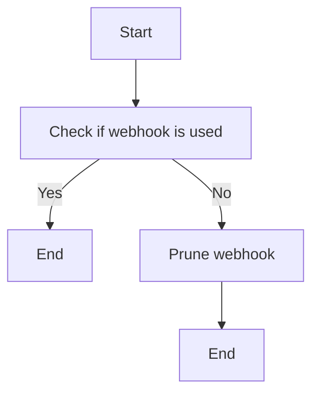

#### 带注释源码

```python
async def prune_webhook_if_dangling(user_id: str, webhook_id: str, credentials: Optional["Credentials"] = None):
    # Check if the webhook is used anywhere in the system
    if await is_webhook_used(webhook_id):
        return  # If the webhook is used, do nothing

    # Prune the webhook
    await prune_webhook(webhook_id)

    # Deregister the webhook if credentials are available
    if credentials:
        await deregister_webhook(user_id, webhook_id, credentials)
```

[Note: The actual implementation of `is_webhook_used`, `prune_webhook`, and `deregister_webhook` functions is not provided in the given code snippet, so the above source code is a placeholder to represent the intended logic.]


### on_node_deactivate

Hook to be called when node is deactivated/deleted.

参数：

- `user_id`：`str`，The identifier of the user.
- `node`：`NodeModel`，The node that is being deactivated/deleted.
- `credentials`：`Optional[Credentials]`，Optional credentials associated with the node.
- `webhooks_manager`：`Optional[BaseWebhooksManager]`，Optional webhooks manager associated with the node.

返回值：`NodeModel`，The updated node after deactivation/deletion.

#### 流程图


#### 带注释源码

```python
async def on_node_deactivate(
    user_id: str,
    node: "NodeModel",
    *,
    credentials: Optional["Credentials"] = None,
    webhooks_manager: Optional["BaseWebhooksManager"] = None,
) -> "NodeModel":
    """Hook to be called when node is deactivated/deleted"""

    logger.debug(f"Deactivating node #{node.id}")
    block = node.block

    if not block.webhook_config:
        return node

    provider = block.webhook_config.provider
    if not supports_webhooks(provider):
        raise ValueError(
            f"Block #{block.id} has webhook_config for provider {provider} "
            "which does not support webhooks"
        )

    webhooks_manager = get_webhook_manager(provider)

    if node.webhook_id:
        logger.debug(f"Node #{node.id} has webhook_id {node.webhook_id}")
        if not node.webhook:
            logger.error(f"Node #{node.id} has webhook_id but no webhook object")
            raise ValueError("node.webhook not included")

        # Detach webhook from node
        logger.debug(f"Detaching webhook from node #{node.id}")
        updated_node = await set_node_webhook(node.id, None)

        # Prune and deregister the webhook if it is no longer used anywhere
        webhook = node.webhook
        logger.debug(
            f"Pruning{' and deregistering' if credentials else ''} "
            f"webhook #{webhook.id}"
        )
        await webhooks_manager.prune_webhook_if_dangling(
            user_id, webhook.id, credentials
        )
        if (
            cast(BlockSchema, block.input_schema).get_credentials_fields()
            and not credentials
        ):
            logger.warning(
                f"Cannot deregister webhook #{webhook.id}: credentials "
                f"#{webhook.credentials_id} not available "
                f"({webhook.provider.value} webhook ID: {webhook.provider_webhook_id})"
            )
        return updated_node

    logger.debug(f"Node #{node.id} has no webhook_id, returning")
    return node
``` 


### WebhookManager.prune_webhook_if_dangling

This function is responsible for pruning and deregistering a webhook if it is no longer used anywhere in the system.

参数：

- `user_id`：`str`，The identifier of the user who owns the webhook.
- `webhook_id`：`str`，The identifier of the webhook to be pruned.
- `credentials`：`Optional[Credentials]`，The credentials associated with the webhook. This is optional and is used to deregister the webhook if credentials are available.

返回值：`None`，This function does not return any value.

#### 流程图


#### 带注释源码

```python
async def prune_webhook_if_dangling(user_id: str, webhook_id: str, credentials: Optional["Credentials"] = None):
    # Check if the webhook is used anywhere in the system
    if await is_webhook_used(webhook_id):
        # If the webhook is used, do nothing
        return

    # If the webhook is not used, prune and deregister the webhook
    if credentials:
        # Deregister the webhook using the credentials
        await deregister_webhook(user_id, webhook_id, credentials)
    else:
        # If credentials are not available, log a warning
        logger.warning(f"Cannot deregister webhook #{webhook_id}: credentials not available")
```


### on_node_deactivate

Hook to be called when node is deactivated/deleted.

参数：

- `user_id`：`str`，The identifier of the user.
- `node`：`NodeModel`，The node that is being deactivated/deleted.
- `credentials`：`Optional[Credentials]`，Optional credentials object associated with the webhook.
- `webhooks_manager`：`Optional[BaseWebhooksManager]`，Optional webhooks manager instance.

返回值：`NodeModel`，The updated node after deactivation/deletion.

#### 流程图


#### 带注释源码

```python
async def on_node_deactivate(
    user_id: str,
    node: "NodeModel",
    *,
    credentials: Optional["Credentials"] = None,
    webhooks_manager: Optional["BaseWebhooksManager"] = None,
) -> "NodeModel":
    """Hook to be called when node is deactivated/deleted"""

    logger.debug(f"Deactivating node #{node.id}")
    block = node.block

    if not block.webhook_config:
        return node

    provider = block.webhook_config.provider
    if not supports_webhooks(provider):
        raise ValueError(
            f"Block #{block.id} has webhook_config for provider {provider} "
            "which does not support webhooks"
        )

    webhooks_manager = get_webhook_manager(provider)

    if node.webhook_id:
        logger.debug(f"Node #{node.id} has webhook_id {node.webhook_id}")
        if not node.webhook:
            logger.error(f"Node #{node.id} has webhook_id but no webhook object")
            raise ValueError("node.webhook not included")

        # Detach webhook from node
        logger.debug(f"Detaching webhook from node #{node.id}")
        updated_node = await set_node_webhook(node.id, None)

        # Prune and deregister the webhook if it is no longer used anywhere
        webhook = node.webhook
        logger.debug(
            f"Pruning{' and deregistering' if credentials else ''} "
            f"webhook #{webhook.id}"
        )
        await webhooks_manager.prune_webhook_if_dangling(
            user_id, webhook.id, credentials
        )
        if (
            cast(BlockSchema, block.input_schema).get_credentials_fields()
            and not credentials
        ):
            logger.warning(
                f"Cannot deregister webhook #{webhook.id}: credentials "
                f"#{webhook.credentials_id} not available "
                f"({webhook.provider.value} webhook ID: {webhook.provider_webhook_id})"
            )
        return updated_node

    logger.debug(f"Node #{node.id} has no webhook_id, returning")
    return node
```


### `IntegrationCredentialsManager.cached_getter`

This method is a coroutine that returns a cached getter function for credentials associated with a given user ID.

参数：

- `user_id`：`str`，The unique identifier for the user whose credentials are to be retrieved.

返回值：`Callable[[str], Optional[Credentials]]`，A cached getter function that takes a credential ID and returns the corresponding `Credentials` object if it exists, otherwise `None`.

#### 流程图

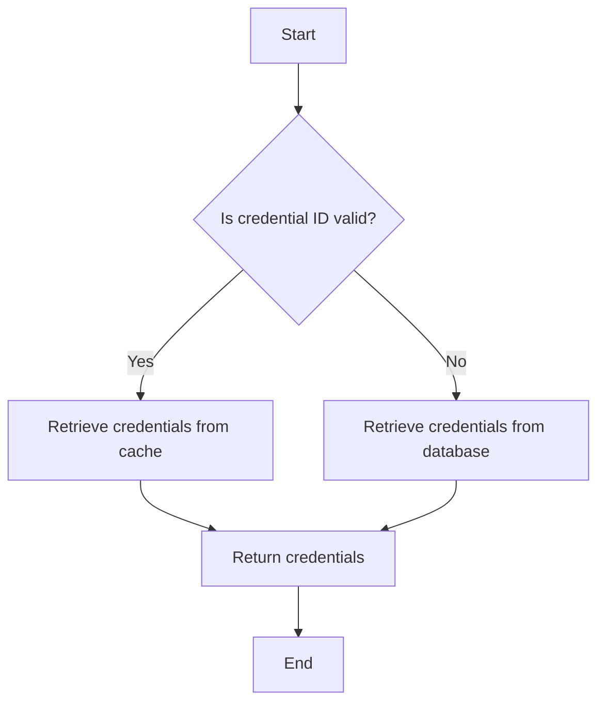

#### 带注释源码

```python
async def cached_getter(self, user_id: str) -> Callable[[str], Optional[Credentials]]:
    """
    Returns a cached getter function for credentials associated with a given user ID.
    """
    def getter(creds_id: str) -> Optional[Credentials]:
        # Retrieve the credentials from the cache
        cached_credentials = self._cache.get(user_id, {}).get(creds_id)
        if cached_credentials:
            return cached_credentials

        # If not in cache, retrieve from the database
        credentials = await self._db.get_credentials(user_id, creds_id)
        if credentials:
            # Update the cache
            self._cache.setdefault(user_id, {}).update({creds_id: credentials})
        return credentials

    return getter
```


### on_graph_activate

This function is a hook called when a graph is activated or created. It ensures that all nodes within the graph are activated and that their credentials are validated.

参数：

- `graph`：`GraphModel`，The graph that is being activated.
- `user_id`：`str`，The user ID associated with the graph.

返回值：`GraphModel`，The activated graph.

#### 流程图

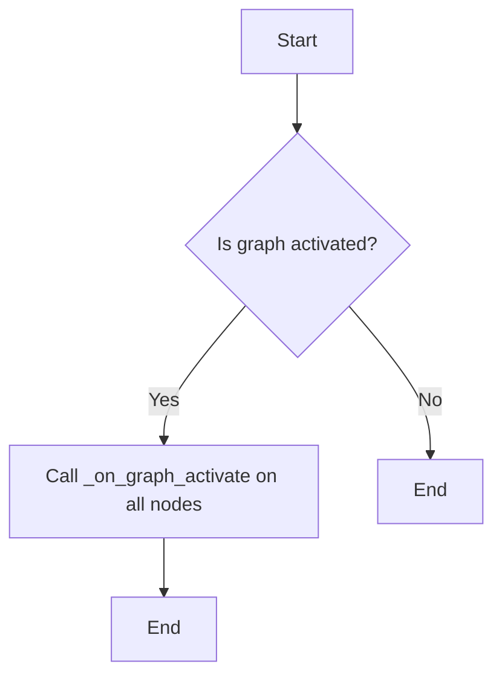

#### 带注释源码

```python
async def on_graph_activate(graph: "GraphModel", user_id: str) -> "GraphModel":
    """
    Hook to be called when a graph is activated/created.

    ⚠️ Assuming node entities are not re-used between graph versions, ⚠️
    this hook calls `on_node_activate` on all nodes in this graph.
    """
    graph = await _on_graph_activate(graph, user_id)
    graph.sub_graphs = await asyncio.gather(
        *(_on_graph_activate(sub_graph, user_id) for sub_graph in graph.sub_graphs)
    )
    return graph
```

### _on_graph_activate

This function is a helper function that activates a graph and its subgraphs. It validates the credentials for each node in the graph.

参数：

- `graph`：`BaseGraph | GraphModel`，The graph to be activated.
- `user_id`：`str`，The user ID associated with the graph.

返回值：`BaseGraph | GraphModel`，The activated graph.

#### 流程图

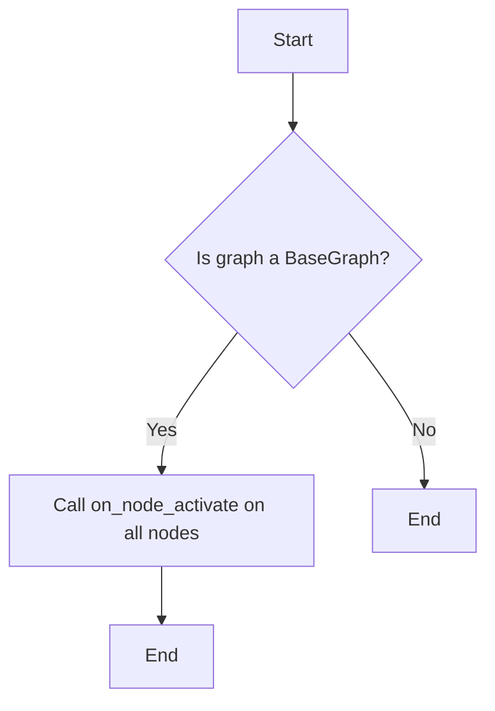

#### 带注释源码

```python
@overload
async def _on_graph_activate(graph: "GraphModel", user_id: str) -> "GraphModel": ...

@overload
async def _on_graph_activate(graph: "BaseGraph", user_id: str) -> "BaseGraph": ...

async def _on_graph_activate(graph: "BaseGraph | GraphModel", user_id: str):
    get_credentials = credentials_manager.cached_getter(user_id)
    for new_node in graph.nodes:
        block_input_schema = cast(BlockSchema, new_node.block.input_schema)

        for creds_field_name in block_input_schema.get_credentials_fields().keys():
            # Prevent saving graph with non-existent credentials
            if (
                creds_meta := new_node.input_default.get(creds_field_name)
            ) and not await get_credentials(creds_meta["id"]):
                raise ValueError(
                    f"Node #{new_node.id} input '{creds_field_name}' updated with "
                    f"non-existent credentials #{creds_meta['id']}"
                )

    return graph
```

### on_graph_deactivate

This function is a hook called when a graph is deactivated or deleted. It ensures that all nodes within the graph are deactivated and their credentials are handled appropriately.

参数：

- `graph`：`GraphModel`，The graph that is being deactivated.
- `user_id`：`str`，The user ID associated with the graph.

返回值：`GraphModel`，The deactivated graph.

#### 流程图

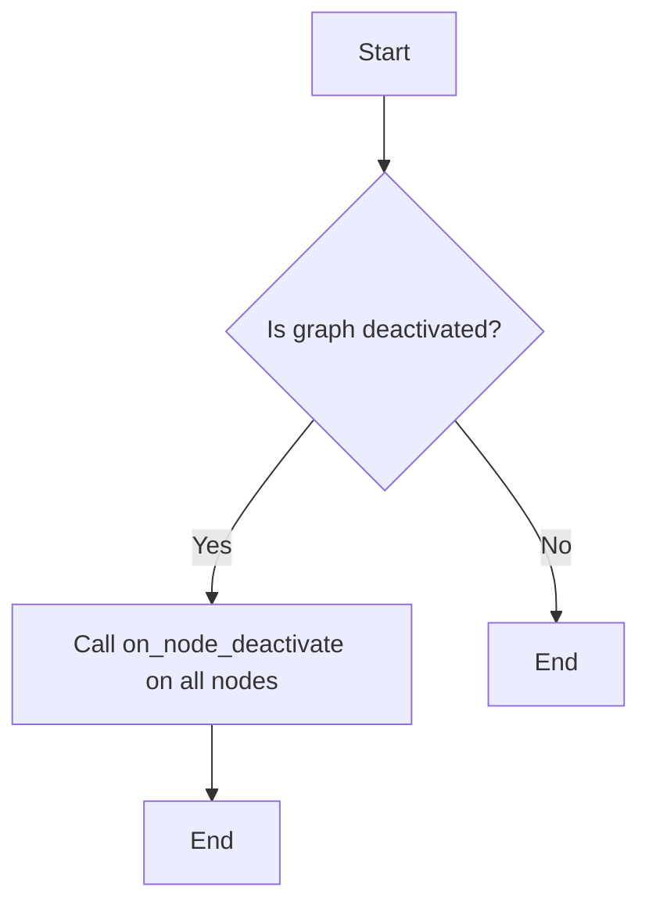

#### 带注释源码

```python
async def on_graph_deactivate(graph: "GraphModel", user_id: str):
    """
    Hook to be called when a graph is deactivated/deleted.

    ⚠️ Assuming node entities are not re-used between graph versions, ⚠️
    this hook calls `on_node_deactivate` on all nodes in `graph`.
    """
    get_credentials = credentials_manager.cached_getter(user_id)
    updated_nodes = []
    for node in graph.nodes:
        block_input_schema = cast(BlockSchema, node.block.input_schema)

        node_credentials = None
        for creds_field_name in block_input_schema.get_credentials_fields().keys():
            if (creds_meta := node.input_default.get(creds_field_name)) and not (
                node_credentials := await get_credentials(creds_meta["id"])
            ):
                logger.warning(
                    f"Node #{node.id} input '{creds_field_name}' referenced "
                    f"non-existent credentials #{creds_meta['id']}"
                )

        updated_node = await on_node_deactivate(
            user_id, node, credentials=node_credentials
        )
        updated_nodes.append(updated_node)

    graph.nodes = updated_nodes
    return graph
```

### on_node_deactivate

This function is a hook called when a node is deactivated or deleted. It handles the deactivation of the node, including detaching any associated webhooks.

参数：

- `user_id`：`str`，The user ID associated with the node.
- `node`：`NodeModel`，The node that is being deactivated.
- `credentials`：`Optional[Credentials]`，The credentials associated with the node (optional).
- `webhooks_manager`：`Optional[BaseWebhooksManager]`，The webhooks manager associated with the node (optional).

返回值：`NodeModel`，The deactivated node.

#### 流程图

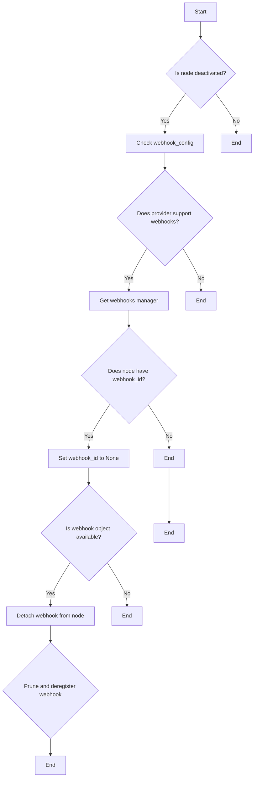

#### 带注释源码

```python
async def on_node_deactivate(
    user_id: str,
    node: "NodeModel",
    *,
    credentials: Optional["Credentials"] = None,
    webhooks_manager: Optional["BaseWebhooksManager"] = None,
) -> "NodeModel":
    """Hook to be called when node is deactivated/deleted"""

    logger.debug(f"Deactivating node #{node.id}")
    block = node.block

    if not block.webhook_config:
        return node

    provider = block.webhook_config.provider
    if not supports_webhooks(provider):
        raise ValueError(
            f"Block #{block.id} has webhook_config for provider {provider} "
            "which does not support webhooks"
        )

    webhooks_manager = get_webhook_manager(provider)

    if node.webhook_id:
        logger.debug(f"Node #{node.id} has webhook_id {node.webhook_id}")
        if not node.webhook:
            logger.error(f"Node #{node.id} has webhook_id but no webhook object")
            raise ValueError("node.webhook not included")

        # Detach webhook from node
        logger.debug(f"Detaching webhook from node #{node.id}")
        updated_node = await set_node_webhook(node.id, None)

        # Prune and deregister the webhook if it is no longer used anywhere
        webhook = node.webhook
        logger.debug(
            f"Pruning{' and deregistering' if credentials else ''} "
            f"webhook #{webhook.id}"
        )
        await webhooks_manager.prune_webhook_if_dangling(
            user_id, webhook.id, credentials
        )
        if (
            cast(BlockSchema, block.input_schema).get_credentials_fields()
            and not credentials
        ):
            logger.warning(
                f"Cannot deregister webhook #{webhook.id}: credentials "
                f"#{webhook.credentials_id} not available "
                f"({webhook.provider.value} webhook ID: {webhook.provider_webhook_id})"
            )
        return updated_node

    logger.debug(f"Node #{node.id} has no webhook_id, returning")
    return node
```


### GraphModel.__init__

GraphModel 的初始化方法，用于设置图模型的基本属性和配置。

参数：

- `self`：`GraphModel` 实例本身，用于访问实例属性和方法。
- `nodes`：`list`，包含图中的所有节点。
- `sub_graphs`：`list`，包含图中的所有子图。

返回值：无

#### 流程图

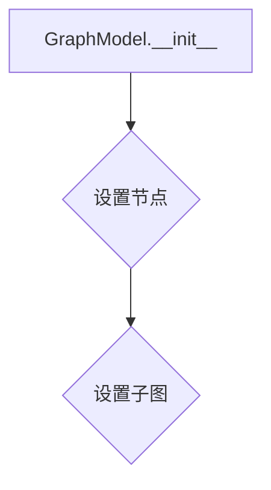

#### 带注释源码

```python
def __init__(self, nodes: list, sub_graphs: list):
    self.nodes = nodes
    self.sub_graphs = sub_graphs
```


### on_graph_activate

This function is a hook that is called when a graph is activated or created. It ensures that all nodes within the graph are activated and that their sub-graphs are also activated.

参数：

- `graph`：`GraphModel`，The graph that is being activated.
- `user_id`：`str`，The ID of the user who is activating the graph.

返回值：`GraphModel`，The activated graph.

#### 流程图

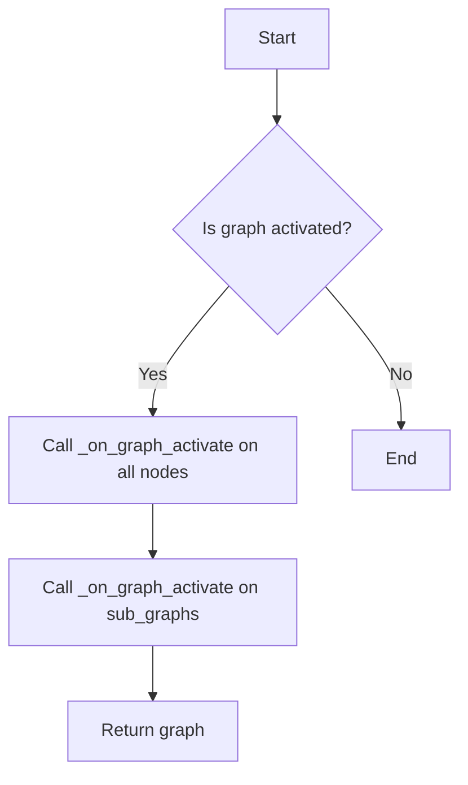

#### 带注释源码

```python
async def on_graph_activate(graph: "GraphModel", user_id: str) -> "GraphModel":
    """
    Hook to be called when a graph is activated/created.

    ⚠️ Assuming node entities are not re-used between graph versions, ⚠️
    this hook calls `on_node_activate` on all nodes in this graph.
    """
    graph = await _on_graph_activate(graph, user_id)
    graph.sub_graphs = await asyncio.gather(
        *(_on_graph_activate(sub_graph, user_id) for sub_graph in graph.sub_graphs)
    )
    return graph
```

### _on_graph_activate

This function is a helper function that is called by `on_graph_activate` to activate a graph. It checks for the existence of credentials for each node's input fields and raises a `ValueError` if any non-existent credentials are found.

参数：

- `graph`：`BaseGraph | GraphModel`，The graph to be activated.
- `user_id`：`str`，The ID of the user who is activating the graph.

返回值：`BaseGraph | GraphModel`，The activated graph.

#### 流程图

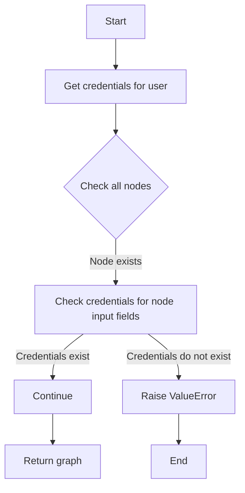

#### 带注释源码

```python
async def _on_graph_activate(graph: "BaseGraph | GraphModel", user_id: str):
    get_credentials = credentials_manager.cached_getter(user_id)
    for new_node in graph.nodes:
        block_input_schema = cast(BlockSchema, new_node.block.input_schema)

        for creds_field_name in block_input_schema.get_credentials_fields().keys():
            # Prevent saving graph with non-existent credentials
            if (
                creds_meta := new_node.input_default.get(creds_field_name)
            ) and not await get_credentials(creds_meta["id"]):
                raise ValueError(
                    f"Node #{new_node.id} input '{creds_field_name}' updated with "
                    f"non-existent credentials #{creds_meta['id']}"
                )

    return graph
```

### on_graph_deactivate

This function is a hook that is called when a graph is deactivated or deleted. It ensures that all nodes within the graph are deactivated.

参数：

- `graph`：`GraphModel`，The graph that is being deactivated.
- `user_id`：`str`，The ID of the user who is deactivating the graph.

返回值：`GraphModel`，The deactivated graph.

#### 流程图

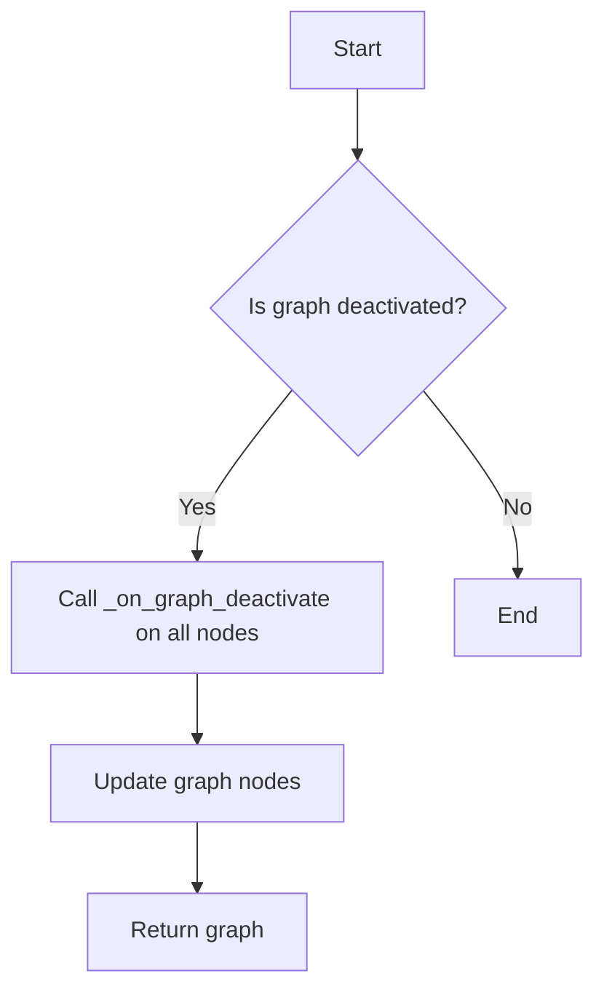

#### 带注释源码

```python
async def on_graph_deactivate(graph: "GraphModel", user_id: str):
    """
    Hook to be called when a graph is deactivated/deleted.

    ⚠️ Assuming node entities are not re-used between graph versions, ⚠️
    this hook calls `on_node_deactivate` on all nodes in `graph`.
    """
    get_credentials = credentials_manager.cached_getter(user_id)
    updated_nodes = []
    for node in graph.nodes:
        block_input_schema = cast(BlockSchema, node.block.input_schema)

        node_credentials = None
        for creds_field_name in block_input_schema.get_credentials_fields().keys():
            if (creds_meta := node.input_default.get(creds_field_name)) and not (
                node_credentials := await get_credentials(creds_meta["id"])
            ):
                logger.warning(
                    f"Node #{node.id} input '{creds_field_name}' referenced "
                    f"non-existent credentials #{creds_meta['id']}"
                )

        updated_node = await on_node_deactivate(
            user_id, node, credentials=node_credentials
        )
        updated_nodes.append(updated_node)

    graph.nodes = updated_nodes
    return graph
```

### on_node_deactivate

This function is a hook that is called when a node is deactivated or deleted. It handles the deactivation of the node, including detaching any associated webhooks.

参数：

- `user_id`：`str`，The ID of the user who is deactivating the node.
- `node`：`NodeModel`，The node that is being deactivated.
- `credentials`：`Optional[Credentials]`，The credentials associated with the node.
- `webhooks_manager`：`Optional[BaseWebhooksManager]`，The webhooks manager for the node.

返回值：`NodeModel`，The deactivated node.

#### 流程图

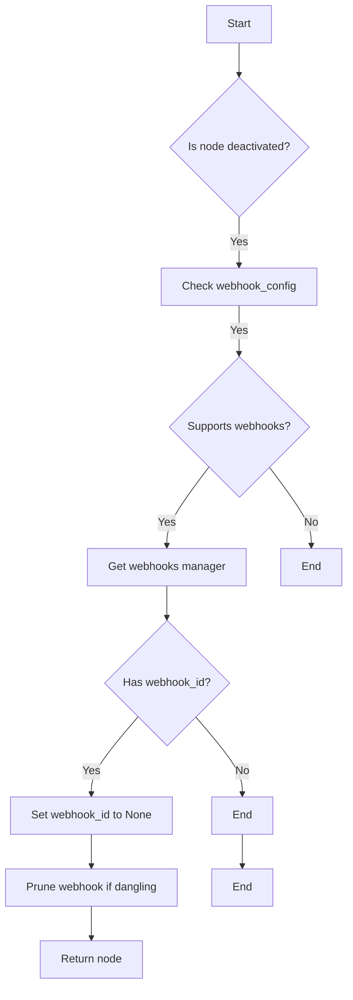

#### 带注释源码

```python
async def on_node_deactivate(
    user_id: str,
    node: "NodeModel",
    *,
    credentials: Optional["Credentials"] = None,
    webhooks_manager: Optional["BaseWebhooksManager"] = None,
) -> "NodeModel":
    """Hook to be called when node is deactivated/deleted"""

    logger.debug(f"Deactivating node #{node.id}")
    block = node.block

    if not block.webhook_config:
        return node

    provider = block.webhook_config.provider
    if not supports_webhooks(provider):
        raise ValueError(
            f"Block #{block.id} has webhook_config for provider {provider} "
            "which does not support webhooks"
        )

    webhooks_manager = get_webhook_manager(provider)

    if node.webhook_id:
        logger.debug(f"Node #{node.id} has webhook_id {node.webhook_id}")
        if not node.webhook:
            logger.error(f"Node #{node.id} has webhook_id but no webhook object")
            raise ValueError("node.webhook not included")

        # Detach webhook from node
        logger.debug(f"Detaching webhook from node #{node.id}")
        updated_node = await set_node_webhook(node.id, None)

        # Prune and deregister the webhook if it is no longer used anywhere
        webhook = node.webhook
        logger.debug(
            f"Pruning{' and deregistering' if credentials else ''} "
            f"webhook #{webhook.id}"
        )
        await webhooks_manager.prune_webhook_if_dangling(
            user_id, webhook.id, credentials
        )
        if (
            cast(BlockSchema, block.input_schema).get_credentials_fields()
            and not credentials
        ):
            logger.warning(
                f"Cannot deregister webhook #{webhook.id}: credentials "
                f"#{webhook.credentials_id} not available "
                f"({webhook.provider.value} webhook ID: {webhook.provider_webhook_id})"
            )
        return updated_node

    logger.debug(f"Node #{node.id} has no webhook_id, returning")
    return node
```


### NodeModel.__init__

初始化NodeModel实例。

参数：

- `self`：`NodeModel`，当前实例
- `block`：`BlockSchema`，节点关联的块
- `input_default`：`dict`，节点的默认输入值

返回值：无

#### 流程图

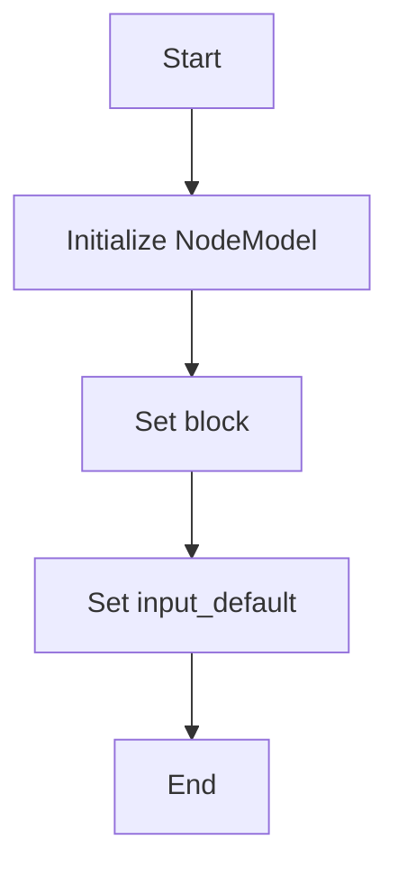

#### 带注释源码

```python
class NodeModel:
    def __init__(self, block: BlockSchema, input_default: dict):
        # Initialize NodeModel instance
        self.block = block
        self.input_default = input_default
```


### on_node_deactivate

Hook to be called when node is deactivated/deleted.

参数：

- `user_id`：`str`，The identifier of the user.
- `node`：`NodeModel`，The node that is being deactivated/deleted.
- `credentials`：`Optional[Credentials]`，Optional credentials associated with the node.
- `webhooks_manager`：`Optional[BaseWebhooksManager]`，Optional webhooks manager associated with the node.

返回值：`NodeModel`，The updated node after deactivation/deletion.

#### 流程图

```mermaid
graph TD
    A[Start] --> B[Check webhook_config]
    B -->|No| C[Return node]
    B -->|Yes| D[Check supports_webhooks]
    D -->|No| E[Error]
    D -->|Yes| F[Get webhooks_manager]
    F --> G[Check webhook_id]
    G -->|No| H[Return node]
    G -->|Yes| I[Check webhook object]
    I -->|No| J[Error]
    I -->|Yes| K[Detach webhook]
    K --> L[Set node webhook]
    L --> M[Prune webhook if dangling]
    M --> N[Return updated node]
```

#### 带注释源码

```python
async def on_node_deactivate(
    user_id: str,
    node: "NodeModel",
    *,
    credentials: Optional["Credentials"] = None,
    webhooks_manager: Optional["BaseWebhooksManager"] = None,
) -> "NodeModel":
    """Hook to be called when node is deactivated/deleted"""

    logger.debug(f"Deactivating node #{node.id}")
    block = node.block

    if not block.webhook_config:
        return node

    provider = block.webhook_config.provider
    if not supports_webhooks(provider):
        raise ValueError(
            f"Block #{block.id} has webhook_config for provider {provider} "
            "which does not support webhooks"
        )

    webhooks_manager = get_webhook_manager(provider)

    if node.webhook_id:
        logger.debug(f"Node #{node.id} has webhook_id {node.webhook_id}")
        if not node.webhook:
            logger.error(f"Node #{node.id} has webhook_id but no webhook object")
            raise ValueError("node.webhook not included")

        # Detach webhook from node
        logger.debug(f"Detaching webhook from node #{node.id}")
        updated_node = await set_node_webhook(node.id, None)

        # Prune and deregister the webhook if it is no longer used anywhere
        webhook = node.webhook
        logger.debug(
            f"Pruning{' and deregistering' if credentials else ''} "
            f"webhook #{webhook.id}"
        )
        await webhooks_manager.prune_webhook_if_dangling(
            user_id, webhook.id, credentials
        )
        if (
            cast(BlockSchema, block.input_schema).get_credentials_fields()
            and not credentials
        ):
            logger.warning(
                f"Cannot deregister webhook #{webhook.id}: credentials "
                f"#{webhook.credentials_id} not available "
                f"({webhook.provider.value} webhook ID: {webhook.provider_webhook_id})"
            )
        return updated_node

    logger.debug(f"Node #{node.id} has no webhook_id, returning")
    return node
```


### BlockSchema.get_credentials_fields

获取与块输入相关的凭据字段。

参数：

- 无

返回值：`dict`，包含凭据字段名称和其描述的字典。

#### 流程图

```mermaid
graph TD
    A[Start] --> B{Is there a block input schema?}
    B -- Yes --> C[Get credentials fields]
    B -- No --> D[End]
    C --> E[End]
```

#### 带注释源码

```python
class BlockSchema:
    # ... (其他类字段和方法)

    def get_credentials_fields(self) -> dict:
        """
        获取与块输入相关的凭据字段。

        Returns:
            dict: 包含凭据字段名称和其描述的字典。
        """
        # ... (实现细节)
```


### on_graph_activate

This function is a hook called when a graph is activated or created. It ensures that all nodes within the graph are activated and their sub-graphs are also activated.

参数：

- `graph`：`GraphModel`，The graph that is being activated.
- `user_id`：`str`，The user ID associated with the graph.

返回值：`GraphModel`，The activated graph.

#### 流程图

```mermaid
graph TD
    A[Start] --> B{Is graph activated?}
    B -- Yes --> C[Call _on_graph_activate on all nodes]
    B -- No --> D[End]
    C --> E[Call _on_graph_activate on sub_graphs]
    E --> F[Return graph]
```

#### 带注释源码

```python
async def on_graph_activate(graph: "GraphModel", user_id: str) -> "GraphModel":
    """
    Hook to be called when a graph is activated/created.

    ⚠️ Assuming node entities are not re-used between graph versions, ⚠️
    this hook calls `on_node_activate` on all nodes in this graph.
    """
    graph = await _on_graph_activate(graph, user_id)
    graph.sub_graphs = await asyncio.gather(
        *(_on_graph_activate(sub_graph, user_id) for sub_graph in graph.sub_graphs)
    )
    return graph
```

### _on_graph_activate

This function is a helper function that activates a graph or a base graph. It checks for the existence of credentials for each node's input schema and raises a ValueError if any non-existent credentials are found.

参数：

- `graph`：`BaseGraph | GraphModel`，The graph or base graph to be activated.
- `user_id`：`str`，The user ID associated with the graph.

返回值：`BaseGraph | GraphModel`，The activated graph or base graph.

#### 流程图

```mermaid
graph TD
    A[Start] --> B{Is graph a BaseGraph?}
    B -- Yes --> C[Call _on_graph_activate on all nodes]
    B -- No --> D[Call _on_graph_activate on all nodes]
    C --> E[Check for non-existent credentials]
    D --> E
    E -- Yes --> F[Raise ValueError]
    E -- No --> G[End]
```

#### 带注释源码

```python
@overload
async def _on_graph_activate(graph: "GraphModel", user_id: str) -> "GraphModel": ...

@overload
async def _on_graph_activate(graph: "BaseGraph", user_id: str) -> "BaseGraph": ...

async def _on_graph_activate(graph: "BaseGraph | GraphModel", user_id: str):
    get_credentials = credentials_manager.cached_getter(user_id)
    for new_node in graph.nodes:
        block_input_schema = cast(BlockSchema, new_node.block.input_schema)

        for creds_field_name in block_input_schema.get_credentials_fields().keys():
            # Prevent saving graph with non-existent credentials
            if (
                creds_meta := new_node.input_default.get(creds_field_name)
            ) and not await get_credentials(creds_meta["id"]):
                raise ValueError(
                    f"Node #{new_node.id} input '{creds_field_name}' updated with "
                    f"non-existent credentials #{creds_meta['id']}"
                )

    return graph
```

### on_graph_deactivate

This function is a hook called when a graph is deactivated or deleted. It ensures that all nodes within the graph are deactivated.

参数：

- `graph`：`GraphModel`，The graph that is being deactivated.
- `user_id`：`str`，The user ID associated with the graph.

返回值：`GraphModel`，The deactivated graph.

#### 流程图

```mermaid
graph TD
    A[Start] --> B{Is graph deactivated?}
    B -- Yes --> C[Call _on_graph_deactivate on all nodes]
    B -- No --> D[End]
    C --> E[Update graph nodes]
    E --> F[Return graph]
```

#### 带注释源码

```python
async def on_graph_deactivate(graph: "GraphModel", user_id: str):
    """
    Hook to be called when a graph is deactivated/deleted.

    ⚠️ Assuming node entities are not re-used between graph versions, ⚠️
    this hook calls `on_node_deactivate` on all nodes in `graph`.
    """
    get_credentials = credentials_manager.cached_getter(user_id)
    updated_nodes = []
    for node in graph.nodes:
        block_input_schema = cast(BlockSchema, node.block.input_schema)

        node_credentials = None
        for creds_field_name in block_input_schema.get_credentials_fields().keys():
            if (creds_meta := node.input_default.get(creds_field_name)) and not (
                node_credentials := await get_credentials(creds_meta["id"])
            ):
                logger.warning(
                    f"Node #{node.id} input '{creds_field_name}' referenced "
                    f"non-existent credentials #{creds_meta['id']}"
                )

        updated_node = await on_node_deactivate(
            user_id, node, credentials=node_credentials
        )
        updated_nodes.append(updated_node)

    graph.nodes = updated_nodes
    return graph
```

### on_node_deactivate

This function is a hook called when a node is deactivated or deleted. It handles the deactivation of the node, including detaching webhooks and deregistering them if necessary.

参数：

- `user_id`：`str`，The user ID associated with the node.
- `node`：`NodeModel`，The node that is being deactivated.
- `credentials`：`Optional[Credentials]`，The credentials associated with the node (optional).
- `webhooks_manager`：`Optional[BaseWebhooksManager]`，The webhooks manager associated with the node (optional).

返回值：`NodeModel`，The deactivated node.

#### 流程图

```mermaid
graph TD
    A[Start] --> B{Is node deactivated?}
    B -- Yes --> C[Check webhook_config]
    B -- No --> D[End]
    C -- Yes --> E{Supports webhooks?}
    C -- No --> F[End]
    E -- Yes --> G[Get webhooks manager]
    E -- No --> H[End]
    G --> I{Has webhook_id?}
    I -- Yes --> J[Set webhook to None]
    I -- No --> K[End]
    J --> L{Is webhook object available?}
    L -- Yes --> M[Detach webhook]
    L -- No --> N[End]
    M --> O{Prune webhook if dangling}
    N --> O
    O --> P{Deregister webhook if credentials available}
    P --> Q[End]
    K --> Q
```

#### 带注释源码

```python
async def on_node_deactivate(
    user_id: str,
    node: "NodeModel",
    *,
    credentials: Optional["Credentials"] = None,
    webhooks_manager: Optional["BaseWebhooksManager"] = None,
) -> "NodeModel":
    """Hook to be called when node is deactivated/deleted"""

    logger.debug(f"Deactivating node #{node.id}")
    block = node.block

    if not block.webhook_config:
        return node

    provider = block.webhook_config.provider
    if not supports_webhooks(provider):
        raise ValueError(
            f"Block #{block.id} has webhook_config for provider {provider} "
            "which does not support webhooks"
        )

    webhooks_manager = get_webhook_manager(provider)

    if node.webhook_id:
        logger.debug(f"Node #{node.id} has webhook_id {node.webhook_id}")
        if not node.webhook:
            logger.error(f"Node #{node.id} has webhook_id but no webhook object")
            raise ValueError("node.webhook not included")

        # Detach webhook from node
        logger.debug(f"Detaching webhook from node #{node.id}")
        updated_node = await set_node_webhook(node.id, None)

        # Prune and deregister the webhook if it is no longer used anywhere
        webhook = node.webhook
        logger.debug(
            f"Pruning{' and deregistering' if credentials else ''} "
            f"webhook #{webhook.id}"
        )
        await webhooks_manager.prune_webhook_if_dangling(
            user_id, webhook.id, credentials
        )
        if (
            cast(BlockSchema, block.input_schema).get_credentials_fields()
            and not credentials
        ):
            logger.warning(
                f"Cannot deregister webhook #{webhook.id}: credentials "
                f"#{webhook.credentials_id} not available "
                f"({webhook.provider.value} webhook ID: {webhook.provider_webhook_id})"
            )
        return updated_node

    logger.debug(f"Node #{node.id} has no webhook_id, returning")
    return node
```


### Credentials.__init__

The `__init__` method initializes a Credentials object with the necessary attributes to manage credentials for a node.

参数：

- `self`：`Credentials`，The instance of the Credentials class itself.
- `user_id`：`str`，The unique identifier for the user associated with the credentials.
- `node_id`：`str`，The unique identifier for the node that the credentials are associated with.
- `credentials_data`：`dict`，A dictionary containing the credentials data.

返回值：无

#### 流程图

```mermaid
graph TD
    A[Start] --> B[Initialize Credentials with user_id]
    B --> C[Initialize Credentials with node_id]
    C --> D[Initialize Credentials with credentials_data]
    D --> E[End]
```

#### 带注释源码

```python
class Credentials:
    def __init__(self, user_id: str, node_id: str, credentials_data: dict):
        """
        Initialize a Credentials object with the necessary attributes to manage credentials for a node.

        :param user_id: The unique identifier for the user associated with the credentials.
        :param node_id: The unique identifier for the node that the credentials are associated with.
        :param credentials_data: A dictionary containing the credentials data.
        """
        self.user_id = user_id
        self.node_id = node_id
        self.credentials_data = credentials_data
```


### on_graph_activate

This function is a hook called when a graph is activated or created. It ensures that all nodes within the graph have valid credentials and updates sub-graphs accordingly.

参数：

- `graph`：`GraphModel`，The graph that is being activated.
- `user_id`：`str`，The user ID associated with the graph.

返回值：`GraphModel`，The updated graph after activation.

#### 流程图

```mermaid
graph TD
    A[Start] --> B{Is graph activated?}
    B -- Yes --> C[Call _on_graph_activate on all nodes]
    B -- No --> D[End]
    C --> E[Update sub_graphs]
    E --> F[Return graph]
```

#### 带注释源码

```python
async def on_graph_activate(graph: "GraphModel", user_id: str) -> "GraphModel":
    """
    Hook to be called when a graph is activated/created.

    ⚠️ Assuming node entities are not re-used between graph versions, ⚠️
    this hook calls `on_node_activate` on all nodes in this graph.
    """
    graph = await _on_graph_activate(graph, user_id)
    graph.sub_graphs = await asyncio.gather(
        *(_on_graph_activate(sub_graph, user_id) for sub_graph in graph.sub_graphs)
    )
    return graph
```

### _on_graph_activate

This function is a helper function called by `on_graph_activate` to activate a single graph. It checks for valid credentials for each node in the graph.

参数：

- `graph`：`BaseGraph | GraphModel`，The graph to be activated.
- `user_id`：`str`，The user ID associated with the graph.

返回值：`BaseGraph | GraphModel`，The activated graph.

#### 流程图

```mermaid
graph TD
    A[Start] --> B{Is graph a BaseGraph?}
    B -- Yes --> C[Call on_node_activate on all nodes]
    B -- No --> D[End]
    C --> E[Check credentials for each node]
    E --> F[Return graph]
```

#### 带注释源码

```python
@overload
async def _on_graph_activate(graph: "GraphModel", user_id: str) -> "GraphModel": ...

@overload
async def _on_graph_activate(graph: "BaseGraph", user_id: str) -> "BaseGraph": ...

async def _on_graph_activate(graph: "BaseGraph | GraphModel", user_id: str):
    get_credentials = credentials_manager.cached_getter(user_id)
    for new_node in graph.nodes:
        block_input_schema = cast(BlockSchema, new_node.block.input_schema)

        for creds_field_name in block_input_schema.get_credentials_fields().keys():
            # Prevent saving graph with non-existent credentials
            if (
                creds_meta := new_node.input_default.get(creds_field_name)
            ) and not await get_credentials(creds_meta["id"]):
                raise ValueError(
                    f"Node #{new_node.id} input '{creds_field_name}' updated with "
                    f"non-existent credentials #{creds_meta['id']}"
                )

    return graph
```

### on_graph_deactivate

This function is a hook called when a graph is deactivated or deleted. It ensures that all nodes within the graph are deactivated and updates the graph accordingly.

参数：

- `graph`：`GraphModel`，The graph that is being deactivated.
- `user_id`：`str`，The user ID associated with the graph.

返回值：`GraphModel`，The updated graph after deactivation.

#### 流程图

```mermaid
graph TD
    A[Start] --> B{Is graph deactivated?}
    B -- Yes --> C[Call on_node_deactivate on all nodes]
    B -- No --> D[End]
    C --> E[Update graph.nodes]
    E --> F[Return graph]
```

#### 带注释源码

```python
async def on_graph_deactivate(graph: "GraphModel", user_id: str):
    """
    Hook to be called when a graph is deactivated/deleted.

    ⚠️ Assuming node entities are not re-used between graph versions, ⚠️
    this hook calls `on_node_deactivate` on all nodes in `graph`.
    """
    get_credentials = credentials_manager.cached_getter(user_id)
    updated_nodes = []
    for node in graph.nodes:
        block_input_schema = cast(BlockSchema, node.block.input_schema)

        node_credentials = None
        for creds_field_name in block_input_schema.get_credentials_fields().keys():
            if (creds_meta := node.input_default.get(creds_field_name)) and not (
                node_credentials := await get_credentials(creds_meta["id"])
            ):
                logger.warning(
                    f"Node #{node.id} input '{creds_field_name}' referenced "
                    f"non-existent credentials #{creds_meta['id']}"
                )

        updated_node = await on_node_deactivate(
            user_id, node, credentials=node_credentials
        )
        updated_nodes.append(updated_node)

    graph.nodes = updated_nodes
    return graph
```

### on_node_deactivate

This function is a hook called when a node is deactivated or deleted. It handles webhook deactivation and pruning if necessary.

参数：

- `user_id`：`str`，The user ID associated with the node.
- `node`：`NodeModel`，The node that is being deactivated.
- `credentials`：`Optional[Credentials]`，The credentials associated with the node (optional).
- `webhooks_manager`：`Optional[BaseWebhooksManager]`，The webhooks manager associated with the node (optional).

返回值：`NodeModel`，The deactivated node.

#### 流程图

```mermaid
graph TD
    A[Start] --> B{Is node deactivated?}
    B -- Yes --> C[Check webhook_config]
    C -- Yes --> D{Does provider support webhooks?}
    D -- Yes --> E[Get webhooks manager]
    D -- No --> F[End]
    E --> G{Does node have webhook_id?}
    G -- Yes --> H[Set webhook_id to None]
    G -- No --> I[End]
    H --> J[Prune webhook if dangling]
    I --> K[End]
    J --> L{Does credentials exist?}
    L -- Yes --> M[Return updated node]
    L -- No --> N[Log warning]
    N --> O[Return updated node]
```

#### 带注释源码

```python
async def on_node_deactivate(
    user_id: str,
    node: "NodeModel",
    *,
    credentials: Optional["Credentials"] = None,
    webhooks_manager: Optional["BaseWebhooksManager"] = None,
) -> "NodeModel":
    """Hook to be called when node is deactivated/deleted"""

    logger.debug(f"Deactivating node #{node.id}")
    block = node.block

    if not block.webhook_config:
        return node

    provider = block.webhook_config.provider
    if not supports_webhooks(provider):
        raise ValueError(
            f"Block #{block.id} has webhook_config for provider {provider} "
            "which does not support webhooks"
        )

    webhooks_manager = get_webhook_manager(provider)

    if node.webhook_id:
        logger.debug(f"Node #{node.id} has webhook_id {node.webhook_id}")
        if not node.webhook:
            logger.error(f"Node #{node.id} has webhook_id but no webhook object")
            raise ValueError("node.webhook not included")

        # Detach webhook from node
        logger.debug(f"Detaching webhook from node #{node.id}")
        updated_node = await set_node_webhook(node.id, None)

        # Prune and deregister the webhook if it is no longer used anywhere
        webhook = node.webhook
        logger.debug(
            f"Pruning{' and deregistering' if credentials else ''} "
            f"webhook #{webhook.id}"
        )
        await webhooks_manager.prune_webhook_if_dangling(
            user_id, webhook.id, credentials
        )
        if (
            cast(BlockSchema, block.input_schema).get_credentials_fields()
            and not credentials
        ):
            logger.warning(
                f"Cannot deregister webhook #{webhook.id}: credentials "
                f"#{webhook.credentials_id} not available "
                f"({webhook.provider.value} webhook ID: {webhook.provider_webhook_id})"
            )
        return updated_node

    logger.debug(f"Node #{node.id} has no webhook_id, returning")
    return node
```


## 关键组件


### 张量索引与惰性加载

张量索引与惰性加载是代码中用于高效处理大型数据集的关键组件，它允许在需要时才加载数据，从而减少内存消耗和提高性能。

### 反量化支持

反量化支持是代码中用于处理量化数据的关键组件，它允许在量化过程中进行反向操作，以便在需要时恢复原始数据。

### 量化策略

量化策略是代码中用于优化模型性能的关键组件，它通过减少模型中使用的数值精度来减少模型大小和计算需求。


## 问题及建议


### 已知问题

-   **类型检查依赖**: 代码中使用了 `TYPE_CHECKING` 来进行类型检查，这可能导致在非类型检查模式下运行时出现不必要的性能开销。
-   **异常处理**: 代码中存在一些潜在的异常点，例如在 `on_node_deactivate` 函数中，如果 `node.webhook` 为空，将抛出 `ValueError`。这可能需要更详细的异常处理逻辑。
-   **日志记录**: 代码中的日志记录可能不够详细，尤其是在异常情况下，这可能导致调试困难。
-   **代码重复**: 在 `on_graph_activate` 和 `on_graph_deactivate` 函数中，存在相似的逻辑处理子图和节点，这可能导致代码重复和维护困难。

### 优化建议

-   **移除类型检查**: 如果代码在非类型检查模式下运行，可以考虑移除 `TYPE_CHECKING` 相关的代码，以减少性能开销。
-   **增强异常处理**: 在可能抛出异常的地方添加更详细的异常处理逻辑，确保程序的健壮性。
-   **改进日志记录**: 增强日志记录的详细程度，特别是在异常情况下，以便于调试和问题追踪。
-   **减少代码重复**: 将处理子图和节点的逻辑提取到单独的函数中，以减少代码重复并提高可维护性。
-   **资源清理**: 在 `on_node_deactivate` 函数中，考虑添加资源清理逻辑，确保所有资源在使用完毕后都被正确释放。
-   **性能优化**: 对于 `asyncio.gather` 的使用，可以考虑使用更细粒度的控制，例如使用 `async for` 循环，以避免不必要的等待。


## 其它


### 设计目标与约束

- 设计目标：
  - 实现一个模块，用于管理图形和节点在激活和去激活时的操作。
  - 确保在图形和节点激活时，所有节点都正确配置了凭证。
  - 在图形和节点去激活时，正确处理和清理与节点相关的 webhook。

- 约束：
  - 不允许保存包含不存在凭证的图形。
  - 不支持不支持 webhooks 的提供者。
  - 在去激活节点时，如果 webhook 无处可用，则无法注销 webhook。

### 错误处理与异常设计

- 错误处理：
  - 使用 `ValueError` 抛出与配置相关的错误，如凭证不存在或提供者不支持 webhooks。
  - 使用 `logger.warning` 记录警告信息，如无法注销 webhook。
  - 使用 `logger.error` 记录错误信息，如 webhook 对象缺失。

- 异常设计：
  - 异常设计应确保在发生错误时，系统可以优雅地处理并给出清晰的错误信息。

### 数据流与状态机

- 数据流：
  - 当图形激活时，对每个节点调用 `on_node_activate`。
  - 当图形去激活时，对每个节点调用 `on_node_deactivate`。

- 状态机：
  - 每个节点在激活和去激活过程中可能经历不同的状态，如激活中、去激活中、已激活、已去激活等。

### 外部依赖与接口契约

- 外部依赖：
  - `backend.data.block.BlockSchema`：用于获取节点的输入方案。
  - `backend.data.graph`：用于处理图形和节点。
  - `backend.integrations.creds_manager.IntegrationCredentialsManager`：用于管理凭证。
  - `backend.integrations.creds_manager.IntegrationCredentialsManager.cached_getter`：用于获取凭证。
  - `backend.data.model.Credentials`：用于表示凭证。
  - `._base.BaseWebhooksManager`：用于管理 webhook。

- 接口契约：
  - `on_graph_activate` 和 `on_graph_deactivate` 应符合图形激活和去激活的接口契约。
  - `on_node_activate` 和 `on_node_deactivate` 应符合节点激活和去激活的接口契约。
  - `set_node_webhook` 应符合设置节点 webhook 的接口契约。
  - `prune_webhook_if_dangling` 应符合修剪和注销 webhook 的接口契约。


    