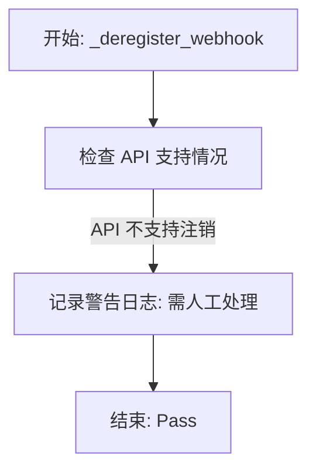

# `.\AutoGPT\autogpt_platform\backend\backend\integrations\webhooks\slant3d.py` 详细设计文档

该代码定义了 Slant3D 服务提供商的 Webhook 管理器，负责处理 Webhook 的注册、入站请求的载荷验证以及注销逻辑。

## 整体流程

```mermaid
graph TD
    A[开始: Slant3DWebhooksManager 调用] --> B{操作类型?}

    B -- 注册 Webhook --> C[_register_webhook]
    C --> D{凭据是否为 APIKeyCredentials?}
    D -- 否 --> E[抛出 ValueError]
    D -- 是 --> F[构建请求头和 Payload]
    F --> G[POST 请求至 Slant3D API]
    G --> H{响应状态 OK?}
    H -- 否 --> I[解析错误信息并抛出 RuntimeError]
    H -- 是 --> J[返回配置信息]

    B -- 验证载荷 --> K[validate_payload]
    K --> L[解析请求 JSON]
    L --> M{检查必需字段?}
    M -- 缺失 --> N[抛出 ValueError]
    M -- 完整 --> O[标准化载荷结构]
    O --> P[生成小写事件类型]
    P --> Q[返回标准化载荷和事件类型]

    B -- 注销 Webhook --> R[_deregister_webhook]
    R --> S[记录警告日志 (API不支持自动注销)]
    S --> T[结束]
```

## 类结构

```
BaseWebhooksManager (基类)
└── Slant3DWebhooksManager
```

## 全局变量及字段


### `logger`
    
用于记录模块运行日志、警告及错误信息的日志记录器实例。

类型：`logging.Logger`
    


### `Slant3DWebhooksManager.PROVIDER_NAME`
    
集成服务提供商的标识名称，此处指定为 Slant3D。

类型：`ProviderName`
    


### `Slant3DWebhooksManager.BASE_URL`
    
Slant3D API 的基础 URL 地址，用于构建 webhook 注册等请求的完整路径。

类型：`str`
    
    

## 全局函数及方法


### `Slant3DWebhooksManager._register_webhook`

该方法用于向 Slant3D 服务注册一个新的 Webhook。它验证提供的 API Key 凭据，构建并发送包含回调 URL 的订阅请求到 Slant3D API，成功后返回相应的 Webhook 配置信息。

参数：

-  `credentials`：`Credentials`，用于认证的凭据对象，必须是 APIKeyCredentials 类型。
-  `webhook_type`：`str`，Webhook 的类型标识（用于返回配置中）。
-  `resource`：`str`，资源标识符（未在 API 调用中使用）。
-  `events`：`list[str]`，需要订阅的事件列表（未在 API 调用中使用，Slant3D 默认订阅所有更新）。
-  `ingress_url`：`str`，用于接收 Webhook 回调的内部入口 URL。
-  `secret`：`str`，用于验证 Webhook 签名的密钥（未在 API 调用中使用）。

返回值：`tuple[str, dict]`，返回一个元组，第一个元素为空字符串（表示未返回 Webhook ID），第二个元素是包含 Webhook 详细配置的字典。

#### 流程图

```mermaid
flowchart TD
    A[开始: _register_webhook] --> B{credentials 是否为 APIKeyCredentials?}
    B -- 否 --> C[抛出 ValueError 异常]
    B -- 是 --> D[构建 Headers: api-key 和 Content-Type]
    D --> E[构建 Payload: endPoint 为 ingress_url]
    E --> F[发起 POST 请求至 Slant3D API]
    F --> G{响应状态是否成功?}
    G -- 否 --> H[解析响应中的 error 信息]
    H --> I[抛出 RuntimeError 异常]
    G -- 是 --> J[构建 webhook_config 字典]
    J --> K[返回元组: ('', webhook_config)]
    K --> L[结束]
```

#### 带注释源码

```python
    async def _register_webhook(
        self,
        credentials: Credentials,
        webhook_type: str,
        resource: str,
        events: list[str],
        ingress_url: str,
        secret: str,
    ) -> tuple[str, dict]:
        """Register a new webhook with Slant3D"""

        # 步骤 1: 校验凭据类型，确保是 APIKeyCredentials
        if not isinstance(credentials, APIKeyCredentials):
            raise ValueError("API key is required to register a webhook")

        # 步骤 2: 设置请求头，包含从凭据中获取的 API Key
        headers = {
            "api-key": credentials.api_key.get_secret_value(),
            "Content-Type": "application/json",
        }

        # 步骤 3: 准备请求体
        # 注意：Slant3D 的 API 不使用事件列表，这里只需要设置回调端点即可注册所有订单更新
        payload = {"endPoint": ingress_url}

        # 步骤 4: 发送异步 POST 请求到 Slant3D 的 Webhook 订阅接口
        response = await Requests().post(
            f"{self.BASE_URL}/customer/webhookSubscribe", headers=headers, json=payload
        )

        # 步骤 5: 检查响应是否成功
        if not response.ok:
            # 如果失败，尝试从响应体中获取错误信息
            error = response.json().get("error", "Unknown error")
            raise RuntimeError(f"Failed to register webhook: {error}")

        # 步骤 6: 构建返回的 Webhook 配置字典
        webhook_config = {
            "endpoint": ingress_url,
            "provider": self.PROVIDER_NAME,
            "events": ["order.shipped"],  # 当前唯一支持的事件类型
            "type": webhook_type,
        }

        # 步骤 7: 返回结果，第一个元素为空字符串（API未返回ID），第二个元素为配置信息
        return "", webhook_config
```


### `Slant3DWebhooksManager.validate_payload`

验证来自 Slant3D 的传入 Webhook 载荷，检查必需字段的存在性，对数据结构进行规范化，并将原始状态转换为标准事件类型格式。

参数：

-   `webhook`：`integrations.Webhook`，与当前请求关联的 Webhook 配置对象，包含元数据。
-   `request`：`Request`，FastAPI 的请求对象，用于获取传入的 HTTP 请求体。
-   `credentials`：`Credentials | None`，集成凭据对象（当前实现中未用于验证，保留供未来使用）。

返回值：`tuple[dict, str]`，包含规范化后的载荷字典（包含 orderId, status, trackingNumber, carrierCode）和派生的事件类型字符串（格式为 "order.{status}"）。

#### 流程图

```mermaid
flowchart TD
    A[开始: validate_payload] --> B[从 Request 解析 JSON 载荷]
    B --> C[定义必需字段列表<br/>orderId, status, trackingNumber, carrierCode]
    C --> D{检查是否有缺失字段}
    D -- 是 --> E[抛出 ValueError 异常]
    D -- 否 --> F[构建规范化载荷字典]
    F --> G[生成事件类型字符串<br/>格式: order.{status}.lower]
    G --> H[返回规范化载荷和事件类型]
```

#### 带注释源码

```python
@classmethod
async def validate_payload(
    cls,
    webhook: integrations.Webhook,
    request: Request,
    credentials: Credentials | None,
) -> tuple[dict, str]:
    """Validate incoming webhook payload from Slant3D"""

    # 1. 从 FastAPI 请求对象中异步读取 JSON 数据
    payload = await request.json()

    # 2. 根据 Slant3D API 规范定义必须存在的字段列表
    required_fields = ["orderId", "status", "trackingNumber", "carrierCode"]
    
    # 3. 遍历检查载荷中是否包含所有必需字段，找出缺失的字段
    missing_fields = [field for field in required_fields if field not in payload]

    # 4. 如果存在缺失字段，抛出 ValueError 中断处理
    if missing_fields:
        raise ValueError(f"Missing required fields: {', '.join(missing_fields)}")

    # 5. 构建并返回规范化后的载荷结构，仅包含特定字段以确保数据一致性
    normalized_payload = {
        "orderId": payload["orderId"],
        "status": payload["status"],
        "trackingNumber": payload["trackingNumber"],
        "carrierCode": payload["carrierCode"],
    }

    # 6. 目前 Slant3D 仅发送发货通知
    # 将状态转换为小写以兼容事件格式 (例如 "order.shipped")
    event_type = f"order.{payload['status'].lower()}"

    # 7. 返回规范化的载荷和计算得到的事件类型
    return normalized_payload, event_type
```


### `Slant3DWebhooksManager._deregister_webhook`

尝试注销 Slant3D 的 Webhook。由于 Slant3D API 当前未提供注销端点，该方法无法执行实际的注销操作，而是记录一条警告日志，提示需要人工介入处理。

参数：

-  `webhook`：`integrations.Webhook`，待注销的 Webhook 对象
-  `credentials`：`Credentials`，认证凭据对象（当前未使用）

返回值：`None`，无返回值

#### 流程图



#### 带注释源码

```python
    async def _deregister_webhook(
        self, webhook: integrations.Webhook, credentials: Credentials
    ) -> None:
        """
        Note: Slant3D API currently doesn't provide a deregistration endpoint.
        This would need to be handled through support.
        """
        # Log warning since we can't properly deregister
        # 因为无法正确执行注销操作，记录警告日志
        logger.warning(
            f"Warning: Manual deregistration required for webhook {webhook.id}"
        )
        pass
```


## 关键组件


### Slant3D Webhook 注册机制

负责处理与 Slant3D API 的交互以注册新的 Webhook，包括验证凭证类型、构造包含 API 密钥和端点的 HTTP 请求头与载荷，发送 POST 请求并处理响应或错误。

### Webhook 载荷验证与规范化

负责验证来自 Slant3D 的传入 Webhook 数据完整性，检查必填字段（如 orderId, status 等），将原始载荷转换为标准化的内部数据结构，并根据状态字段派生对应的事件类型。

### Webhook 注销机制

负责处理 Webhook 的移除逻辑，鉴于 Slant3D API 当前未提供注销端点，该组件目前仅记录警告日志，提示需人工介入处理。


## 问题及建议


### 已知问题

-   **无法通过 API 取消注册 Webhook**：`_deregister_webhook` 方法目前为空实现，因为 Slant3D API 未提供取消注册端点。这会导致系统中存在无效或废弃的 Webhook 记录，且无法自动清理。
-   **注册 Webhook 时返回空 ID**：`_register_webhook` 方法返回的第一个元素（通常为 Webhook ID）为空字符串 `""`。这可能导致上层逻辑在尝试引用或更新特定 Webhook 时出错，或违反了父类 `BaseWebhooksManager` 的隐式契约。
-   **Payload 验证逻辑过于僵化**：`validate_payload` 方法强制要求 `trackingNumber` 和 `carrierCode` 字段存在。如果 Slant3D 发送非发货状态（如订单取消、处理中）的通知，这些字段可能缺失，导致验证失败从而丢失数据。
-   **事件配置与实际处理不一致**：注册时 `webhook_config` 硬编码 `events` 为 `["order.shipped"]`，但 `validate_payload` 实际上会将任何 `status` 转换为对应的事件类型（如 `order.canceled`）。这种不一致会导致系统记录的订阅事件与实际接收处理的事件不匹配。

### 优化建议

-   **增强 Payload 验证的灵活性**：在 `validate_payload` 中将非关键字段（如 `trackingNumber`）设为可选，使用 `payload.get()` 获取，仅在字段存在时才进行归一化，以兼容订单生命周期的不同阶段。
-   **完善取消注册的用户提示**：由于无法自动取消注册，建议在 `_deregister_webhook` 中抛出特定的异常（如 `UnsupportedOperationError`）或在日志中提供更详细的指引，提醒运维人员需手动联系服务商删除，并可能在前端 UI 上展示相应提示。
-   **生成本地唯一标识符**：若 API 不返回 Webhook ID，建议在 `_register_webhook` 中基于 `ingress_url` 或 `secret` 生成一个哈希值或 UUID 作为本地 ID 返回，以确保系统内部有唯一标识符用于索引和管理。
-   **统一事件订阅配置**：根据 API 实际行为（"register for all order updates"），将 `webhook_config` 中的 `events` 更改为通配符（如 `["*"]` 或 `["order.*"]`）或列出所有可能的状态，以反映真实的订阅范围，避免监控或审计时的混淆。


## 其它


### 设计目标与约束

**设计目标：**
*   **集成封装**：为 Slant3D 3D 打印服务提供 Webhook 生命周期的管理实现，继承并符合 `BaseWebhooksManager` 规范。
*   **数据标准化**：将 Slant3D 原始 Webhook Payload 转换为系统内部统一的标准化格式。

**设计约束：**
*   **API 功能限制**：
    *   Slant3D API 不支持细粒度的事件过滤机制。注册 Webhook 时无法指定特定事件（仅支持订阅全部），系统在逻辑上将其视为仅处理 `order.shipped` 事件。
    *   Slant3D API 未提供注销 Webhook 的接口，导致程序无法自动执行注销操作，只能记录日志。
*   **数据结构依赖**：Slant3D 发送的数据必须包含特定的四个字段（`orderId`, `status`, `trackingNumber`, `carrierCode`），否则验证将失败。

### 错误处理与异常设计

**异常类型与触发场景：**
*   `ValueError`：
    *   在 `_register_webhook` 中，当传入的 `credentials` 不是 `APIKeyCredentials` 类型时抛出。
    *   在 `validate_payload` 中，当请求 Payload 缺少必填字段时抛出。
*   `RuntimeError`：
    *   在 `_register_webhook` 中，当 Slant3D API 返回非 2xx 状态码时抛出，包含 API 返回的具体错误信息。

**处理策略：**
*   **严格校验**：在注册和验证阶段进行严格的类型和结构检查，确保数据完整性。
*   **优雅降级**：在 `_deregister_webhook` 中，由于外部 API 不支持该操作，不抛出异常中断流程，而是记录 `warning` 级别日志，提示需人工介入。
*   **信息透传**：捕获外部 API 错误并透传至系统上层，便于运维人员定位第三方服务问题。

### 数据流与状态机

**数据流：**
1.  **注册流**：
    *   输入：`Credentials` (API Key) + `ingress_url`。
    *   处理：提取 API Key -> 构建 HTTP Header -> 构造 JSON Body (`{"endPoint": "..."}`) -> 异步 POST 请求。
    *   输出：空字符串 (Webhook ID) + 内部配置字典 (`webhook_config`)。
2.  **验证流**：
    *   输入：FastAPI `Request` 对象。
    *   处理：解析 JSON -> 字段白名单校验 -> 字段提取与重映射 -> 事件类型转换 (`order.{status}`)。
    *   输出：标准化后的 Payload 字典 + 事件类型字符串。

**状态机：**
*   本模块主要作为适配器处理外部 HTTP 交互，内部不维护复杂的状态机。
*   Webhook 对象的状态（如是否激活）由基类或数据库层维护，`Slant3DWebhooksManager` 仅负责执行转换逻辑。

### 外部依赖与接口契约

**外部依赖：**
*   **Slant3D API**：基础地址 `https://www.slant3dapi.com/api`。
*   **通信库**：内部封装的异步 HTTP 客户端 `backend.util.request.Requests`。

**接口契约：**
*   **注册端点 (`POST /customer/webhookSubscribe`)**
    *   **请求头**：
        *   `api-key`: {string} (用户凭证)
        *   `Content-Type`: application/json
    *   **请求体**：
        *   `endPoint`: {string} (接收 Webhook 的回调 URL)
    *   **响应**：
        *   成功：HTTP 200 OK (具体内容未使用，仅判断状态码)。
        *   失败：非 200 状态码，Body 包含 JSON 格式的 `error` 字段。
*   **接收 Webhook (被动回调)**
    *   **方法**：POST
    *   **Body (JSON)**：
        *   `orderId`: {string} (必填)
        *   `status`: {string} (必填，用于生成事件类型)
        *   `trackingNumber`: {string} (必填)
        *   `carrierCode`: {string} (必填)

### 安全性设计

*   **敏感信息保护**：使用 `credentials.api_key.get_secret_value()` 安全地获取密钥字符串，防止敏感信息在日志或堆栈跟踪中意外泄露。
*   **传输加密**：强制使用 HTTPS (`https://www.slant3dapi.com`) 与外部服务通信，确保中间人攻击防护。
*   **输入验证**：虽然当前实现了关键字段的非空校验，但代码中未包含对 Webhook 签名或 HMAC 的验证逻辑。这意味着系统当前依赖于回调 URL 的保密性或假设 Slant3D 的网络环境是可信的。
*   **防注入**：使用构建好的 JSON Body 和 HTTP Headers 进行请求，而非字符串拼接，有效降低了注入风险。


    