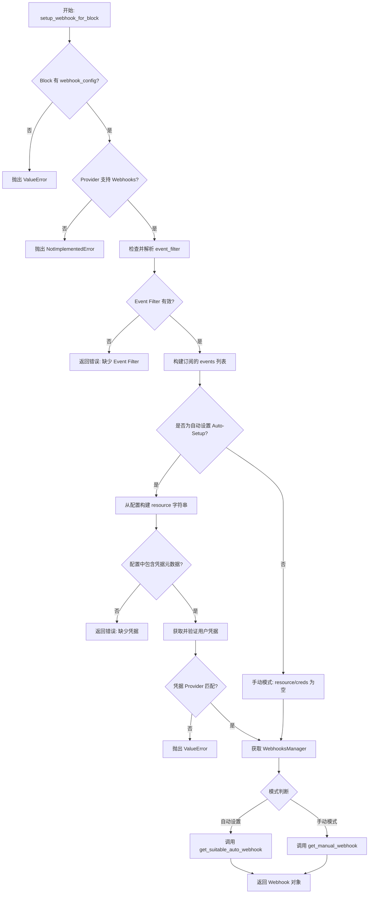
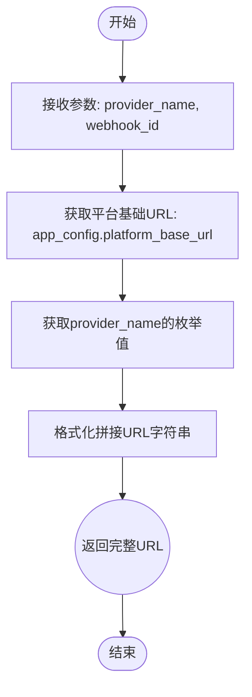
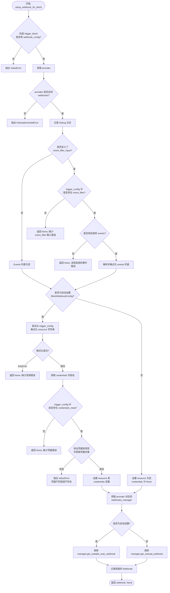
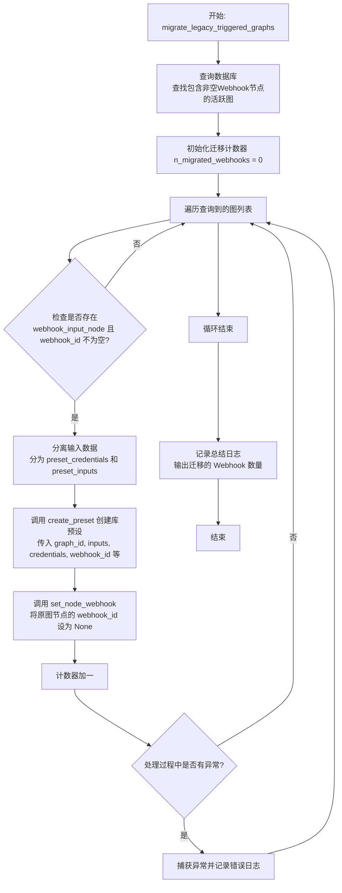

# `.\AutoGPT\autogpt_platform\backend\backend\integrations\webhooks\utils.py` 详细设计文档

该代码模块主要负责处理第三方集成中的 Webhook 管理逻辑，包括根据提供者和 ID 生成 Webhook 接收 URL，为核心触发块自动或手动创建并配置 Webhook，以及将旧版基于节点的触发图迁移到新的基于 Preset 的系统架构中。

## 整体流程



## 类结构

```
Module: webhook_utils
├── (No User Defined Classes)
```

## 全局变量及字段


### `logger`
    
用于记录模块调试信息和运行状态的日志记录器实例。

类型：`logging.Logger`
    


### `app_config`
    
应用程序全局配置对象，用于获取如平台基础URL等环境设置。

类型：`Config`
    


### `credentials_manager`
    
集成凭证管理器实例，负责用户集成凭证的存储、检索及管理。

类型：`IntegrationCredentialsManager`
    


    

## 全局函数及方法


### `webhook_ingress_url`

该函数用于根据指定的集成提供商名称和Webhook ID，构建并返回用于接收外部Webhook事件的完整API入口URL。

参数：

- `provider_name`：`"ProviderName"`，集成提供商的名称，用于确定URL路径中的提供商标识部分。
- `webhook_id`：`str`，特定Webhook的唯一标识符，用于定位具体的Webhook资源。

返回值：`str`，生成的完整Webhook入口URL字符串。

#### 流程图



#### 带注释源码

```python
# TODO: add test to assert this matches the actual API route
def webhook_ingress_url(provider_name: "ProviderName", webhook_id: str) -> str:
    # 使用 f-string 构造 URL
    # 1. app_config.platform_base_url: 平台的基础域名
    # 2. provider_name.value: 提供商的具体名称值
    # 3. webhook_id: 具体的 webhook ID
    # 拼接格式为: {base_url}/api/integrations/{provider}/webhooks/{id}/ingress
    return (
        f"{app_config.platform_base_url}/api/integrations/{provider_name.value}"
        f"/webhooks/{webhook_id}/ingress"
    )
```


### `setup_webhook_for_block`

Utility function to create (and auto-setup if possible) a webhook for a given provider based on a trigger block's configuration and user inputs.

参数：

- `user_id`：`str`，发起 webhook 设置的用户 ID。
- `trigger_block`：`AnyBlockSchema`，定义触发器的 Block Schema 对象。
- `trigger_config`：`dict[str, JsonValue]`，触发器 Block 的输入配置值。
- `for_graph_id`：`Optional[str]`，与此 webhook 关联的图 ID（如果适用）。
- `for_preset_id`：`Optional[str]`，与此 webhook 关联的预设 ID（如果适用）。
- `credentials`：`Optional["Credentials"]`，用于身份验证的可选凭据对象；如果未提供，将尝试获取。

返回值：`tuple["Webhook", None] | tuple[None, str]`，成功时返回 webhook 对象和 None，失败时返回 None 和错误消息字符串（例如，缺少必需的输入）。

#### 流程图



#### 带注释源码

```python
async def setup_webhook_for_block(
    user_id: str,
    trigger_block: "AnyBlockSchema",
    trigger_config: dict[str, JsonValue],  # = Trigger block inputs
    for_graph_id: Optional[str] = None,
    for_preset_id: Optional[str] = None,
    credentials: Optional["Credentials"] = None,
) -> tuple["Webhook", None] | tuple[None, str]:
    """
    Utility function to create (and auto-setup if possible) a webhook for a given provider.

    Returns:
        Webhook: The created or found webhook object, if successful.
        str: A feedback message, if any required inputs are missing.
    """
    from backend.data.block import BlockWebhookConfig

    # 验证 Block 是否定义了 Webhook 配置
    if not (trigger_base_config := trigger_block.webhook_config):
        raise ValueError(f"Block #{trigger_block.id} does not have a webhook_config")

    provider = trigger_base_config.provider
    # 验证 Provider 是否支持 Webhooks
    if not supports_webhooks(provider):
        raise NotImplementedError(
            f"Block #{trigger_block.id} has webhook_config for provider {provider} "
            "for which we do not have a WebhooksManager"
        )

    logger.debug(
        f"Setting up webhook for block #{trigger_block.id} with config {trigger_config}"
    )

    # 检查并解析事件过滤器输入（如果有）
    events: list[str] = []
    if event_filter_input_name := trigger_base_config.event_filter_input:
        # 检查是否提供了 event_filter 输入
        if not (event_filter := trigger_config.get(event_filter_input_name)):
            return None, (
                f"Cannot set up {provider.value} webhook without event filter input: "
                f"missing input for '{event_filter_input_name}'"
            )
        # 检查是否至少启用了一个事件
        elif not (
            # Shape of the event filter is enforced in Block.__init__
            any((event_filter := cast(dict[str, bool], event_filter)).values())
        ):
            return None, (
                f"Cannot set up {provider.value} webhook without any enabled events "
                f"in event filter input '{event_filter_input_name}'"
            )

        # 提取并格式化启用的事件列表
        events = [
            trigger_base_config.event_format.format(event=event)
            for event, enabled in event_filter.items()
            if enabled is True
        ]
        logger.debug(f"Webhook events to subscribe to: {', '.join(events)}")

    # 检查并处理自动设置 Webhooks 的前提条件（资源字符串和凭据）
    if auto_setup_webhook := isinstance(trigger_base_config, BlockWebhookConfig):
        try:
            # 根据输入配置构建资源标识符
            resource = trigger_base_config.resource_format.format(**trigger_config)
        except KeyError as missing_key:
            return None, (
                f"Cannot auto-setup {provider.value} webhook without resource: "
                f"missing input for '{missing_key}'"
            )
        logger.debug(
            f"Constructed resource string {resource} from input {trigger_config}"
        )

        # 获取凭据字段的名称
        creds_field_name = next(
            # presence of this field is enforced in Block.__init__
            iter(trigger_block.input_schema.get_credentials_fields())
        )

        # 检查并获取凭据元数据及凭据对象
        if not (
            credentials_meta := cast(dict, trigger_config.get(creds_field_name, None))
        ):
            return None, f"Cannot set up {provider.value} webhook without credentials"
        elif not (
            # 优先使用传入的 credentials，否则通过 manager 获取
            credentials := credentials
            or await credentials_manager.get(user_id, credentials_meta["id"])
        ):
            raise ValueError(
                f"Cannot set up {provider.value} webhook without credentials: "
                f"credentials #{credentials_meta['id']} not found for user #{user_id}"
            )
        elif credentials.provider != provider:
            raise ValueError(
                f"Credentials #{credentials.id} do not match provider {provider.value}"
            )
    else:
        # 对于手动 Webhook，资源和凭据不相关
        resource = ""
        credentials = None

    # 获取特定 Provider 的 Webhook 管理器
    webhooks_manager = get_webhook_manager(provider)

    # 查找/创建合适的 Webhook 并附加到节点
    if auto_setup_webhook:
        assert credentials is not None
        # 自动设置流程：需要凭据、资源等
        webhook = await webhooks_manager.get_suitable_auto_webhook(
            user_id=user_id,
            credentials=credentials,
            webhook_type=trigger_base_config.webhook_type,
            resource=resource,
            events=events,
        )
    else:
        # 手动 Webhook 流程：无需凭据，直接创建
        webhook = await webhooks_manager.get_manual_webhook(
            user_id=user_id,
            webhook_type=trigger_base_config.webhook_type,
            events=events,
            graph_id=for_graph_id,
            preset_id=for_preset_id,
        )
    logger.debug(f"Acquired webhook: {webhook}")
    return webhook, None
```


### `migrate_legacy_triggered_graphs`

该函数用于将遗留的基于图节点的触发配置迁移到新的基于预设的触发系统中。它会查询数据库中所有包含活跃 Webhook 的触发图，提取触发节点的配置（输入和凭据）来创建对应的库预设，然后将 Webhook 从原图节点中分离并移除，从而实现架构升级。

参数：

无

返回值：`None`，无返回值，函数主要执行数据库写入操作并记录迁移结果。

#### 流程图



#### 带注释源码

```python
async def migrate_legacy_triggered_graphs():
    # 导入必要的模型和工具函数
    from prisma.models import AgentGraph

    from backend.api.features.library.db import create_preset
    from backend.api.features.library.model import LibraryAgentPresetCreatable
    from backend.data.graph import AGENT_GRAPH_INCLUDE, GraphModel, set_node_webhook
    from backend.data.model import is_credentials_field_name

    # 1. 查询数据库：查找所有处于活跃状态(isActive=True)且包含至少一个非空Webhook节点(Nodes.webhookId != None)的图
    triggered_graphs = [
        GraphModel.from_db(_graph)
        for _graph in await AgentGraph.prisma().find_many(
            where={
                "isActive": True,
                "Nodes": {"some": {"NOT": [{"webhookId": None}]}},
            },
            include=AGENT_GRAPH_INCLUDE,
        )
    ]

    n_migrated_webhooks = 0

    # 2. 遍历每一个查到的图，执行迁移逻辑
    for graph in triggered_graphs:
        try:
            # 检查图是否有 webhook_input_node 以及该节点是否有关联的 webhook_id
            if not (
                (trigger_node := graph.webhook_input_node) and trigger_node.webhook_id
            ):
                continue

            # 3. 准备数据：将触发节点的默认输入分离为凭据和普通输入
            # 提取凭据字段
            preset_credentials = {
                field_name: creds_meta
                for field_name, creds_meta in trigger_node.input_default.items()
                if is_credentials_field_name(field_name)
            }
            # 提取普通输入字段
            preset_inputs = {
                field_name: value
                for field_name, value in trigger_node.input_default.items()
                if not is_credentials_field_name(field_name)
            }

            # 4. 创建 Preset：基于原图的配置创建一个新的库预设，并将 webhook 关联到这个预设上
            await create_preset(
                graph.user_id,
                LibraryAgentPresetCreatable(
                    graph_id=graph.id,
                    graph_version=graph.version,
                    inputs=preset_inputs,
                    credentials=preset_credentials,
                    name=graph.name,
                    description=graph.description,
                    webhook_id=trigger_node.webhook_id, # 将 Webhook 转移到 Preset
                    is_active=True,
                ),
            )

            # 5. 清理旧数据：将原图节点的 webhook_id 设置为 None，完成解绑
            await set_node_webhook(trigger_node.id, None)

            n_migrated_webhooks += 1
        except Exception as e:
            # 异常处理：如果单个图迁移失败，记录错误并继续处理下一个
            logger.error(f"Failed to migrate graph #{graph.id} trigger to preset: {e}")
            continue

    # 6. 记录最终迁移数量的日志
    logger.info(f"Migrated {n_migrated_webhooks} node triggers to triggered presets")
```


## 关键组件


### Webhook 入口 URL 生成

根据平台配置、提供者名称和 webhook ID 动态构建标准化的 API 回调地址。

### Webhook 自动化设置与配置

核心业务逻辑组件，负责解析触发块的配置（如事件过滤器、资源字符串），验证输入参数，并根据配置模式（自动或手动）协调特定的 Webhook 管理器创建或获取适用的 Webhook 实例。

### 集成凭证管理

在 Webhook 设置过程中负责检索和验证用户的集成凭证，确保凭证存在、有效且与指定的提供者匹配，以支持需要认证的 Webhook 自动配置。

### 遗留触发图迁移

数据迁移逻辑组件，负责将旧版本中直接绑定在图节点上的触发器转换为新的预设模型，包括提取触发配置、创建预设库条目以及清理原图节点的 webhook 关联。


## 问题及建议


### 已知问题

-   **内存溢出风险**：`migrate_legacy_triggered_graphs` 函数使用 `find_many` 一次性获取所有活跃的图数据到内存中，如果系统中存在大量触发图，极易导致内存溢出（OOM）。
-   **错误处理机制不统一**：`setup_webhook_for_block` 函数对于部分错误（如缺少输入、资源缺失）返回 `(None, str)` 元组，而对于部分错误（如凭证不匹配、未找到凭证）直接抛出 `ValueError`。这种不一致的错误处理方式增加了调用方逻辑的复杂度和出错概率。
-   **数据一致性与原子性风险**：`migrate_legacy_triggered_graphs` 在执行“创建预设”和“清除节点 Webhook ID”两个步骤之间没有数据库事务保护。如果中间某一步骤失败（例如创建成功但更新失败），会导致数据处于不一致状态。此外，脚本缺乏幂等性检查，重复运行可能导致为同一个图重复创建预设。
-   **硬编码的路由配置**：`webhook_ingress_url` 函数中硬编码了 API 路由路径字符串（`/api/integrations/...`），且代码中的 TODO 注释明确指出其可能与实际路由不匹配。这种硬编码降低了代码的可维护性，且容易因路由重构而导致集成功能失效。

### 优化建议

-   **引入分页或流式处理**：在 `migrate_legacy_triggered_graphs` 中使用游标或分页查询来分批处理图数据，避免一次性加载全量数据，从而降低内存消耗。
-   **统一异常处理策略**：建议重构 `setup_webhook_for_block`，定义明确的业务异常类（如 `WebhookSetupError`），统一通过抛出异常来处理所有错误情况，而非混合使用元组返回和异常抛出，使控制流更清晰。
-   **函数职责拆分**：`setup_webhook_for_block` 函数承担了输入解析、凭证获取、资源构建、Webhook 创建等多个职责，代码行数较长。建议将其拆分为更小的私有辅助函数（如 `_validate_event_filter`, `_prepare_auto_setup_inputs` 等），以提高代码的可读性和可测试性。
-   **增强迁移脚本的事务性**：在迁移逻辑中引入数据库事务，确保“预设创建”与“节点 Webhook 清除”操作的原子性。同时，应增加幂等性校验逻辑（如检查预设是否已存在），防止脚本重复执行导致数据冗余。
-   **配置集中管理**：将 `webhook_ingress_url` 中的路由路径定义提取到全局配置类（如 `Config`）或常量模块中，确保前后端路由定义的一致性，消除硬编码依赖。
-   **减少类型强制转换**：代码中多处使用 `cast` 进行类型强制转换（如 `cast(dict, ...)`），这掩盖了潜在的类型安全问题。建议改用 Pydantic 模型对 `trigger_config` 等数据进行严格解析和验证，以提高代码的健壮性。


## 其它


### 设计目标与约束

该模块旨在为不同的外部提供商提供统一的 Webhook 创建与管理接口，封装了“自动设置”与“手动设置”的复杂逻辑。设计上依赖于块定义中的配置元数据（如 `webhook_config`）来动态生成必要的资源路径和事件过滤器。主要约束包括：必须依赖 `IntegrationCredentialsManager` 获取有效的用户凭证；不支持 Webhook 的提供商将直接抛出异常；所有 Webhook 入口 URL 的生成必须遵循 `platform_base_url` 的配置规范；`setup_webhook_for_block` 必须能够处理输入数据缺失的情况并以消息形式返回，而非抛出异常，以便前端展示。

### 错误处理与异常设计

代码采用了混合的错误处理策略以区分开发错误和用户输入错误：
1. **异常抛出**：对于不可恢复的配置错误、系统逻辑错误或严重的数据不一致（如块缺少 Webhook 配置、Provider 不支持 Webhook、凭证不匹配或凭证 ID 无效），代码直接抛出 `ValueError` 或 `NotImplementedError`。
2. **软错误反馈**：对于用户未填写必填字段或输入格式不正确（如未选择事件过滤器、缺少资源输入参数），`setup_webhook_for_block` 函数返回 `tuple[None, str]`，字符串包含具体的错误反馈信息。这种设计允许调用者捕获并展示错误给用户，而无需依赖 try-catch 块处理业务流。
3. **批量任务容错**：在 `migrate_legacy_triggered_graphs` 函数中，使用了宽泛的 `try-except` 块捕获所有异常并记录日志，确保单个图的迁移失败不会中断整个批量迁移任务的执行。

### 数据流与状态机

**主要数据流 (`setup_webhook_for_block`)**：
1. **输入验证阶段**：接收块配置和触发配置，验证 Provider 是否支持 Webhook 以及块配置的有效性。
2. **参数解析阶段**：解析 `trigger_config` 中的事件过滤器，构建订阅事件列表。
3. **模式分支处理**：
   - **自动模式**：从配置中提取资源占位符并结合输入值格式化资源字符串；通过 `credentials_manager` 获取用户凭证，并严格校验凭证与 Provider 的匹配性。
   - **手动模式**：跳过凭证获取和资源格式化步骤。
4. **执行阶段**：调用对应 Provider 的 `WebhooksManager` 接口（`get_suitable_auto_webhook` 或 `get_manual_webhook`）获取或创建 Webhook 对象。
5. **输出阶段**：返回 `Webhook` 对象或错误消息。

**迁移数据流 (`migrate_legacy_triggered_graphs`)**：
1. **读取状态**：从数据库查询所有带有活跃 Webhook ID 的图。
2. **数据转换**：提取触发节点的默认输入，将其分离为凭证元数据和普通输入数据。
3. **状态迁移**：调用 `create_preset` 创建新的预设模型，将触发逻辑绑定到预设上。
4. **清理状态**：调用 `set_node_webhook` 将原图节点的 `webhook_id` 置空，完成从“图节点触发”到“预设触发”的状态转换。

### 外部依赖与接口契约

1. **内部模块依赖**：
   - `backend.data.block`: 依赖 `AnyBlockSchema` 提供的 `webhook_config`、`input_schema` 以及 `BlockWebhookConfig` 类型定义。
   - `backend.data.graph`: 依赖 `GraphModel` 进行数据库模型的转换，依赖 `set_node_webhook` 持久化节点的 Webhook 状态变更。
   - `backend.integrations.providers`: 依赖 `get_webhook_manager` 工厂函数获取特定 Provider 的 `WebhooksManager` 实例。
   - `backend.api.features.library.db`: 依赖 `create_preset` 接口执行迁移时的预设创建逻辑。

2. **系统组件依赖**：
   - `IntegrationCredentialsManager`: 核心依赖，用于根据元数据 ID 检索完整的 `Credentials` 对象，支持异步获取。
   - `Config`: 用于提供 `platform_base_url`，是构建 Webhook 回调地址的基础。
   - `prisma.models.AgentGraph`: 直接数据库交互层，用于读取旧的图结构数据。

3. **接口契约**：
   - `trigger_config` 字典必须严格匹配 `trigger_block.input_schema` 的定义，包含特定字段（如 `event_filter_input` 指定的字段）。
   - 凭证元数据必须包含 `id` 字段，且关联的 `Credentials` 对象其 `provider` 属性必须与当前 Webhook 请求的 `provider` 参数完全一致。
   - `WebhooksManager` 实现类必须提供 `get_suitable_auto_webhook` 和 `get_manual_webhook` 方法，并遵循指定的签名。

### 安全与隐私

该模块处理敏感的用户凭证信息，安全设计如下：
1. **凭证隔离与验证**：在自动设置 Webhook 时，强制检查获取到的 `Credentials` 对象的 `provider` 属性是否与当前请求的 Provider 一致，防止跨 Provider 的凭证误用，降低凭证泄露风险。
2. **最小化日志输出**：虽然在调试日志中输出了部分配置信息，但在处理凭证对象时并未直接记录敏感的 Token 或密钥，仅记录了 ID 和 Provider 信息。
3. **数据分类处理**：在迁移逻辑中，明确将节点输入分离为 `preset_credentials` 和 `preset_inputs`，区分敏感数据和非敏感数据，确保在创建新实体时数据流转的清晰与安全。
4. **URL 安全**：Webhook 入口 URL (`webhook_ingress_url`) 的构建基于后端配置的域名，确保回调地址受控，防止开放重定向。


    