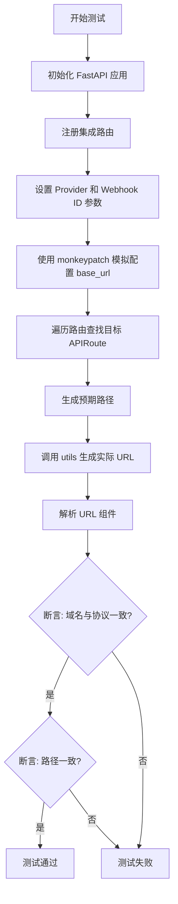
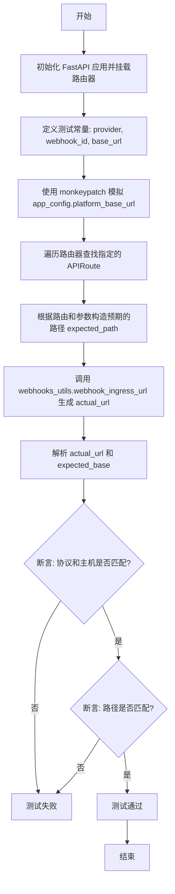

# `.\AutoGPT\autogpt_platform\backend\backend\integrations\webhooks\utils_test.py` 详细设计文档

该测试文件验证了Webhook入站URL生成逻辑的正确性，确保通过工具函数生成的URL与FastAPI应用的路由配置及平台基础URL设置完全匹配。

## 整体流程



## 类结构

```
N/A (本文件为测试脚本，不包含自定义类定义)
```

## 全局变量及字段


    

## 全局函数及方法


### `test_webhook_ingress_url_matches_route`

该函数是一个单元测试，用于验证由 `webhooks_utils` 生成的 Webhook 入口 URL 是否与预期的集成路由结构相匹配，确保在给定基础平台 URL 配置的情况下，生成的 URL 拥有正确的协议、主机名和路径。

参数：

-   `monkeypatch`：`Any`，Pytest 提供的夹具，用于在运行时动态修改对象或配置（此处用于模拟配置项）。

返回值：`None`，该函数不返回值，主要通过断言来验证逻辑的正确性。

#### 流程图



#### 带注释源码

```python
from urllib.parse import urlparse

import fastapi
from fastapi.routing import APIRoute

from backend.api.features.integrations.router import router as integrations_router
from backend.integrations.providers import ProviderName
from backend.integrations.webhooks import utils as webhooks_utils


def test_webhook_ingress_url_matches_route(monkeypatch) -> None:
    # 创建一个 FastAPI 应用实例
    app = fastapi.FastAPI()
    # 将集成路由器包含到应用中，并指定前缀
    app.include_router(integrations_router, prefix="/api/integrations")

    # 定义测试用的提供者、Webhook ID 和基础 URL
    provider = ProviderName.GITHUB
    webhook_id = "webhook_123"
    base_url = "https://example.com"

    # 使用 monkeypatch 修改配置对象中的 platform_base_url 属性，模拟基础 URL 配置
    monkeypatch.setattr(webhooks_utils.app_config, "platform_base_url", base_url)

    # 在集成路由器的所有路由中查找特定的目标路由
    # 目标路径为 "/{provider}/webhooks/{webhook_id}/ingress" 且方法包含 "POST"
    route = next(
        route
        for route in integrations_router.routes
        if isinstance(route, APIRoute)
        and route.path == "/{provider}/webhooks/{webhook_id}/ingress"
        and "POST" in route.methods
    )
    
    # 构造预期的完整路径字符串，将路由路径模板与测试参数结合
    expected_path = f"/api/integrations{route.path}".format(
        provider=provider.value,
        webhook_id=webhook_id,
    )
    
    # 调用待测试的工具函数生成实际的 URL，并解析其各个组成部分
    actual_url = urlparse(webhooks_utils.webhook_ingress_url(provider, webhook_id))
    # 解析预期的基础 URL
    expected_base = urlparse(base_url)

    # 断言：验证生成 URL 的协议和主机名与预期配置一致
    assert (actual_url.scheme, actual_url.netloc) == (
        expected_base.scheme,
        expected_base.netloc,
    )
    # 断言：验证生成 URL 的具体路径与路由结构及参数一致
    assert actual_url.path == expected_path
```


## 关键组件


### FastAPI 路由集成

将 FastAPI 应用实例与特定的集成路由器（`integrations_router`）结合，并配置前缀（`/api/integrations`）以暴露 webhook endpoints 的机制。

### Webhook URL 生成器

`webhooks_utils.webhook_ingress_url` 函数的核心逻辑，负责根据提供的提供商名称和 webhook ID 构造完整的目标 URL。

### 动态路由发现

遍历路由器中的路由列表，通过匹配路径模式（`/{provider}/webhooks/{webhook_id}/ingress`）和 HTTP 方法（POST）来定位特定 webhook 处理程序的过程。

### 配置模拟与注入

利用 `monkeypatch` 技术在测试运行时动态覆盖 `webhooks_utils.app_config.platform_base_url` 属性，以控制和标准化测试环境的基础 URL。

### URL 组件验证

使用 `urllib.parse.urlparse` 将生成的 URL 分解为 scheme、netloc 和 path 等组件，并分别断言这些组件是否与预期值匹配的验证逻辑。


## 问题及建议


### 已知问题

-   测试代码中硬编码了路由路径字符串 `"/{provider}/webhooks/{webhook_id}/ingress"` 用于查找路由。如果实际的路由定义发生变化，测试代码中的这个硬编码字符串如果未同步更新，会导致 `StopIteration` 异常或测试逻辑错误，存在代码重复维护的风险。
-   测试通过 `monkeypatch` 修改了全局配置对象 (`webhooks_utils.app_config`) 的属性。这种对全局可变状态的依赖降低了测试的隔离性，若配置管理不当，可能在测试并发执行时产生副作用。

### 优化建议

-   **参数化测试**：当前仅测试了 `ProviderName.GITHUB`，建议使用 `pytest.mark.parametrize` 遍历所有支持的 `ProviderName`，以验证 URL 生成逻辑对不同提供商的通用性。
-   **消除硬编码**：建议将路由路径字符串提取为常量（例如在路由模块中定义），或者直接从 `integrations_router` 的路由对象中获取 `path` 属性进行对比，确保“单一事实来源”。
-   **引入 Pytest Fixture**：将 `fastapi.FastAPI()` 的实例化和 `app.include_router` 注册逻辑提取到 `conftest.py` 的 fixture 中，以提高代码复用率并保持测试用例的简洁。
-   **增强断言信息**：在使用生成器表达式查找路由时，建议预判可能找不到路由的情况，增加异常捕获或断言描述，以便在路由配置变更时能更快定位问题。


## 其它


### 设计目标与约束

本代码的主要设计目标是确保 `webhooks_utils.webhook_ingress_url` 函数生成的 URL 与 `integrations_router` 中定义的 FastAPI 路由严格一致。核心约束包括：
1. **路径格式约束**：生成的 URL 路径必须遵循 `/{provider}/webhooks/{webhook_id}/ingress` 的格式。
2. **枚举约束**：`provider` 参数必须源自 `ProviderName` 枚举类型，确保其值为有效的提供商标识。
3. **配置依赖**：URL 生成逻辑强依赖于 `app_config.platform_base_url`，测试中通过 `monkeypatch` 模拟该配置以验证其正确性。

### 数据流与状态机

1. **输入数据流**：测试接收 `ProviderName.GITHUB` 和 `webhook_123` 作为输入参数，并通过 `monkeypatch` 注入 `base_url` 配置。
2. **处理流程**：
   - **路由发现**：遍历 `integrations_router.routes`，基于路径和方法（`POST`）查找目标路由对象。
   - **URL 构建**：调用 `webhooks_utils.webhook_ingress_url` 结合 Provider、ID 和 Base URL 生成实际 URL。
   - **解析与比对**：使用 `urlparse` 将生成的 URL 和 Base URL 解析为组件，分别比对协议、域名和路径部分。
3. **状态机**：本测试为无状态测试，不涉及复杂的状态转换，仅在单个函数调用周期内完成输入到输出的验证。

### 外部依赖与接口契约

1. **FastAPI**：
   - 依赖：`fastapi.FastAPI`，`fastapi.routing.APIRoute`。
   - 契约：假设 `integrations_router` 已被正确注册，且包含特定路径和 HTTP 方法的路由定义。
2. **Python 标准库**：
   - 依赖：`urllib.parse.urlparse`。
   - 契约：用于将 URL 字符串解析为 `ParseResult` 对象，以便进行组件级别的比较。
3. **内部模块**：
   - `backend.api.features.integrations.router`：提供路由注册表。
   - `backend.integrations.providers`：提供 `ProviderName` 枚举，约束参数类型。
   - `backend.integrations.webhooks.utils`：提供 `webhook_ingress_url` 函数，接收 `provider` 和 `webhook_id` 返回字符串 URL。

### 错误处理与异常设计

1. **测试验证逻辑**：
   - 如果 `webhooks_utils.webhook_ingress_url` 返回的 URL 协议或域名与配置的 `base_url` 不一致，`assert` 将触发 `AssertionError`。
   - 如果生成的 URL 路径与路由定义的格式化路径不匹配，`assert` 将触发 `AssertionError`。
2. **潜在异常**：
   - 代码中使用 `next()` 结合生成器表达式查找路由。如果在 `integrations_router` 中找不到匹配的路由（路径为 `/{provider}/webhooks/{webhook_id}/ingress` 且方法为 `POST`），将抛出 `StopIteration` 异常，导致测试失败。

    