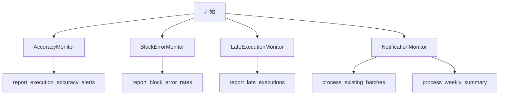
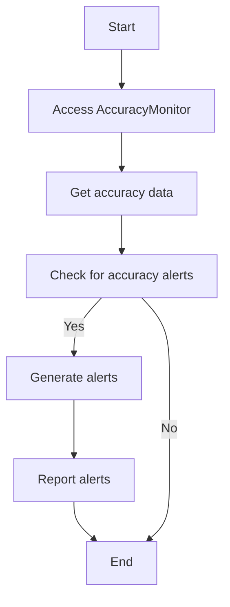
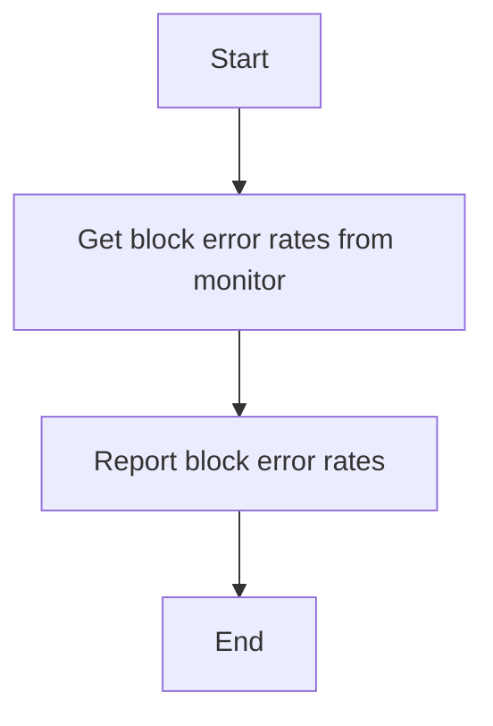
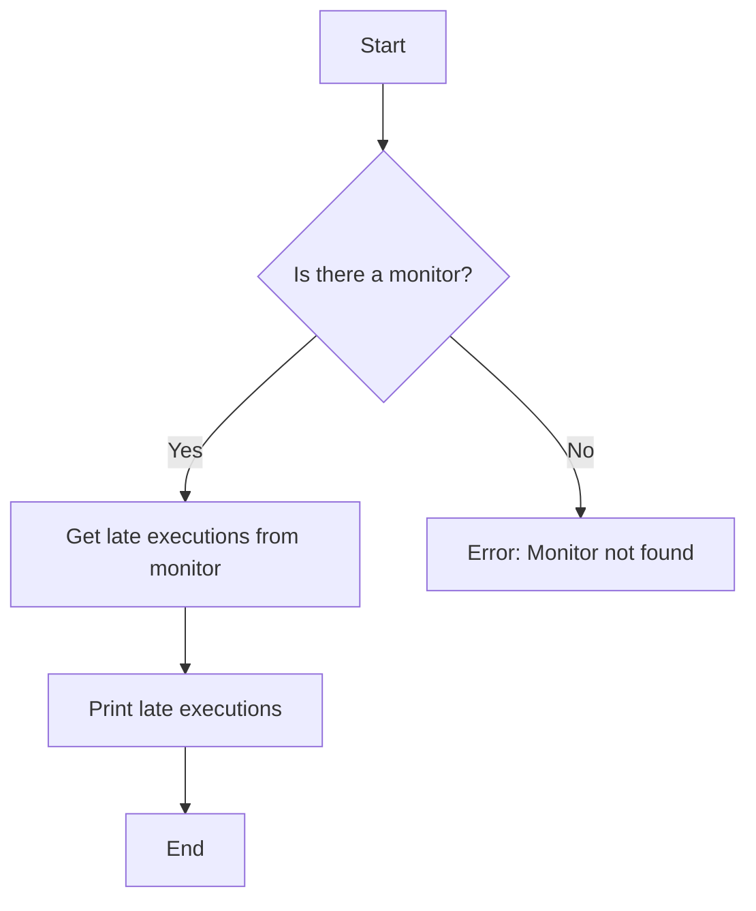
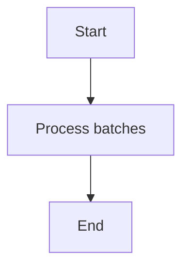
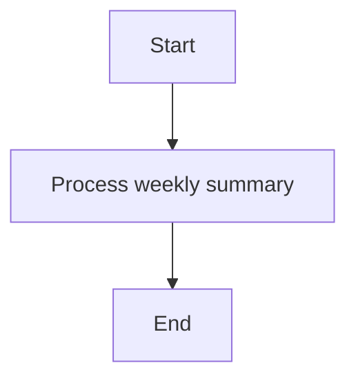
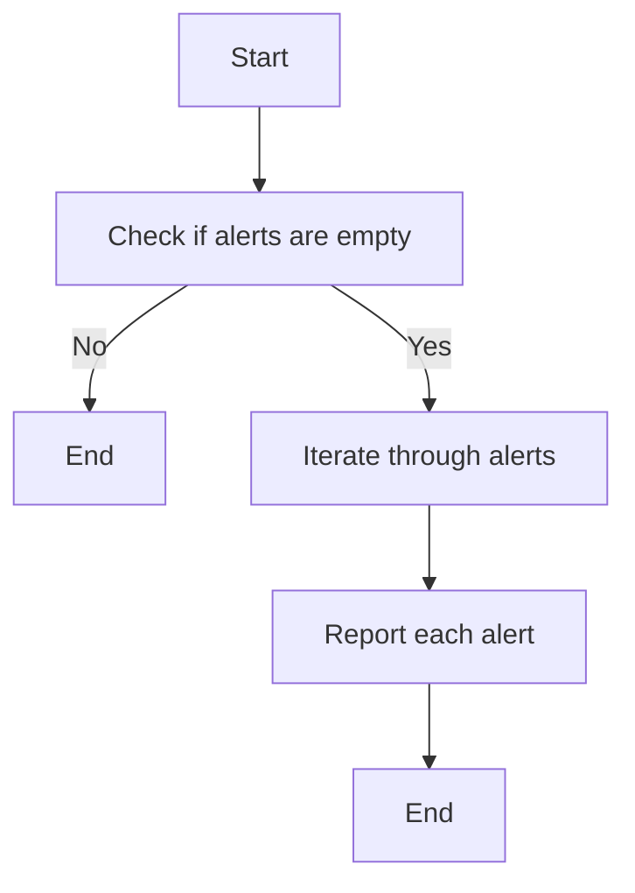
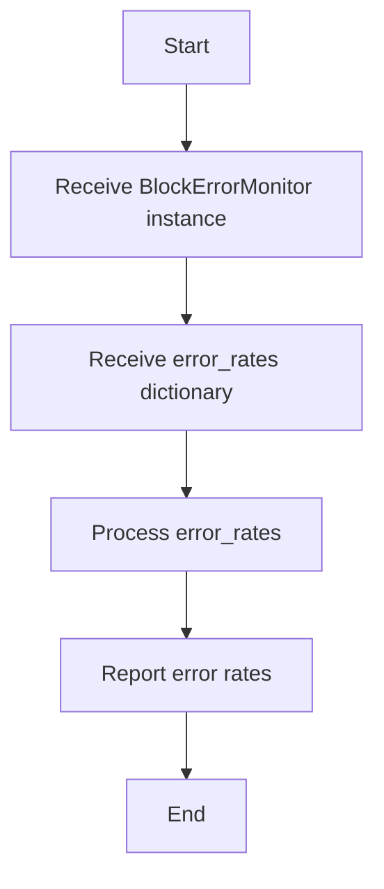
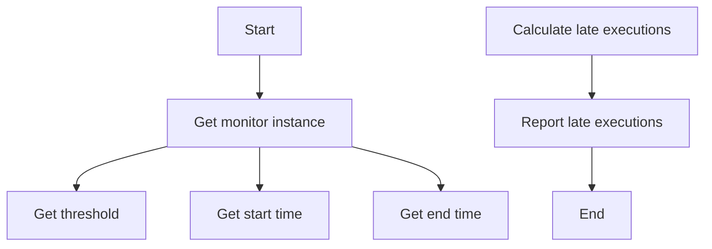
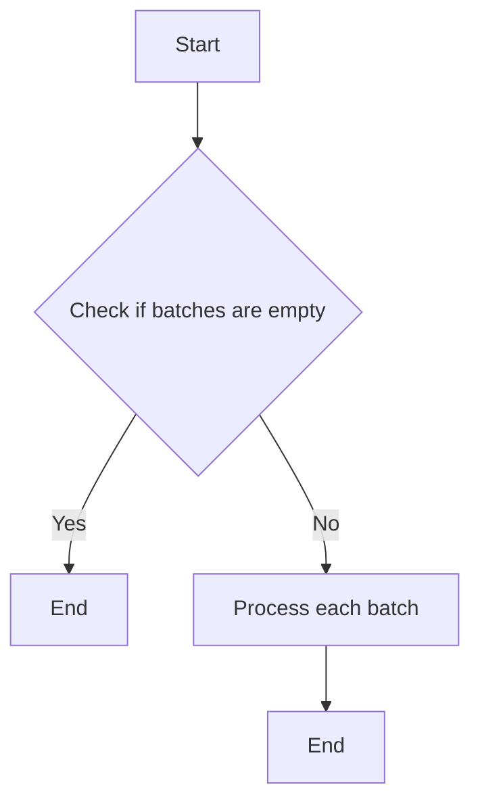

# `.\AutoGPT\autogpt_platform\backend\backend\monitoring\__init__.py` 详细设计文档

The code defines a monitoring module for platform health and alerting, providing classes and functions to monitor accuracy, block errors, late executions, and notifications.

## 整体流程



## 类结构

```
MonitoringModule (模块)
├── AccuracyMonitor (类)
│   ├── report_execution_accuracy_alerts (函数)
├── BlockErrorMonitor (类)
│   ├── report_block_error_rates (函数)
├── LateExecutionMonitor (类)
│   ├── report_late_executions (函数)
└── NotificationMonitor (类)
    ├── process_existing_batches (函数)
    └── process_weekly_summary (函数)
```

## 全局变量及字段


### `AccuracyMonitor.AccuracyMonitor`
    
Monitors the accuracy of platform executions.

类型：`class`
    


### `BlockErrorMonitor.BlockErrorMonitor`
    
Monitors block errors in platform operations.

类型：`class`
    


### `LateExecutionMonitor.LateExecutionMonitor`
    
Monitors late executions in platform operations.

类型：`class`
    


### `LateExecutionException.LateExecutionException`
    
Exception raised when an execution is late.

类型：`class`
    


### `NotificationJobArgs.NotificationJobArgs`
    
Arguments for notification jobs.

类型：`class`
    


### `function.report_execution_accuracy_alerts`
    
Reports alerts for execution accuracy.

类型：`function`
    


### `function.report_block_error_rates`
    
Reports block error rates.

类型：`function`
    


### `function.report_late_executions`
    
Reports late executions.

类型：`function`
    


### `function.process_existing_batches`
    
Processes existing batches for notifications.

类型：`function`
    


### `function.process_weekly_summary`
    
Processes weekly summary for notifications.

类型：`function`
    
    

## 全局函数及方法


### report_execution_accuracy_alerts

This function is responsible for reporting execution accuracy alerts based on the monitoring data.

参数：

- 无

返回值：`None`，This function does not return any value but performs the action of reporting alerts.

#### 流程图



#### 带注释源码

```
# from .accuracy_monitor import AccuracyMonitor, report_execution_accuracy_alerts

def report_execution_accuracy_alerts():
    # Access the AccuracyMonitor instance
    accuracy_monitor = AccuracyMonitor()
    
    # Get accuracy data
    accuracy_data = accuracy_monitor.get_accuracy_data()
    
    # Check for accuracy alerts
    if accuracy_monitor.check_for_accuracy_alerts(accuracy_data):
        # Generate alerts
        alerts = accuracy_monitor.generate_alerts(accuracy_data)
        
        # Report alerts
        accuracy_monitor.report_alerts(alerts)
    
    # No return value
    pass
```

Please note that the actual implementation of `AccuracyMonitor` and its methods (`get_accuracy_data`, `check_for_accuracy_alerts`, `generate_alerts`, `report_alerts`) are not provided in the given code snippet, so the above source code is a conceptual representation based on the expected functionality.


### report_block_error_rates

This function reports the block error rates for the platform.

参数：

-  `monitor`：`BlockErrorMonitor`，The monitor instance that tracks block errors.

返回值：`None`，This function does not return a value, it only reports the error rates.

#### 流程图



#### 带注释源码

```python
def report_block_error_rates(monitor):
    # Retrieve block error rates from the monitor
    error_rates = monitor.get_block_error_rates()
    
    # Report the block error rates
    # This is a placeholder for the actual reporting logic
    print("Block error rates:", error_rates)
```


### report_late_executions

This function reports late executions, which are instances where tasks have not been completed within the expected time frame.

参数：

-  `monitor`：`LateExecutionMonitor`，The monitor instance that tracks late executions.
-  `threshold`：`int`，The time threshold in seconds after which an execution is considered late.

返回值：`None`，This function does not return a value but prints the late executions.

#### 流程图



#### 带注释源码

```
def report_late_executions(monitor, threshold):
    """
    Reports late executions based on the provided monitor and threshold.

    :param monitor: LateExecutionMonitor instance that tracks late executions.
    :param threshold: Time threshold in seconds after which an execution is considered late.
    """
    try:
        late_executions = monitor.get_late_executions(threshold)
        for execution in late_executions:
            print(f"Late execution: {execution}")
    except AttributeError:
        print("Error: Monitor does not have the get_late_executions method.")
```


### process_existing_batches

该函数处理现有的批次，可能是为了更新监控数据或执行某些与批次相关的操作。

参数：

- 无

返回值：`None`，无返回值，但函数执行可能影响外部状态或数据。

#### 流程图



#### 带注释源码

```
# process_existing_batches.py

def process_existing_batches():
    """
    Process existing batches, possibly updating monitoring data or performing
    operations related to batches.
    """
    # 假设这里是处理批次的逻辑
    # 例如，更新监控数据或执行某些操作
    pass
```


### process_weekly_summary

This function processes the weekly summary for monitoring purposes.

参数：

- 无

返回值：`None`，This function does not return a value but processes the weekly summary internally.

#### 流程图



#### 带注释源码

```
def process_weekly_summary():
    # This function is a placeholder for processing the weekly summary.
    # It would typically involve collecting data, performing calculations,
    # and generating reports or alerts based on the collected data.
    pass
```


### report_execution_accuracy_alerts

This function is responsible for reporting execution accuracy alerts.

参数：

-  `self`：`AccuracyMonitor`，The instance of AccuracyMonitor that is calling the method.
-  `alerts`：`list`，A list of alerts that need to be reported.

返回值：`None`，This function does not return any value.

#### 流程图



#### 带注释源码

```
def report_execution_accuracy_alerts(self, alerts):
    # Check if the list of alerts is empty
    if not alerts:
        return
    
    # Iterate through the list of alerts
    for alert in alerts:
        # Report each alert
        self._report_alert(alert)
```


### `BlockErrorMonitor.report_block_error_rates`

This function reports the block error rates for the platform, which is used to monitor the health and performance of the system.

参数：

- `self`：`BlockErrorMonitor`，The instance of the BlockErrorMonitor class.
- `error_rates`：`dict`，A dictionary containing the error rates for different blocks.

返回值：`None`，This function does not return any value.

#### 流程图



#### 带注释源码

```
def report_block_error_rates(self, error_rates):
    # Process the error rates and report them
    # This is a placeholder for the actual implementation
    pass
```


### `report_late_executions`

This function reports late executions, which are instances where tasks have not been completed within the expected time frame.

参数：

- `monitor`: `LateExecutionMonitor`，The monitor instance that keeps track of late executions.
- `threshold`: `int`，The time threshold in seconds after which an execution is considered late.
- `start_time`: `datetime.datetime`，The start time of the execution period to be monitored.
- `end_time`: `datetime.datetime`，The end time of the execution period to be monitored.

返回值：`None`，This function does not return a value.

#### 流程图



#### 带注释源码

```
def report_late_executions(monitor, threshold, start_time, end_time):
    """
    Reports late executions within the given time period.

    :param monitor: The monitor instance that keeps track of late executions.
    :param threshold: The time threshold in seconds after which an execution is considered late.
    :param start_time: The start time of the execution period to be monitored.
    :param end_time: The end time of the execution period to be monitored.
    """
    # Calculate late executions
    late_executions = monitor.calculate_late_executions(start_time, end_time, threshold)
    
    # Report late executions
    for execution in late_executions:
        monitor.report_late_execution(execution)
```


### process_existing_batches

该函数处理已存在的批次，可能是为了更新状态或执行某些操作。

参数：

- `batches`: `list`，包含已存在的批次信息的列表。

返回值：`None`，该函数不返回任何值。

#### 流程图



#### 带注释源码

```python
def process_existing_batches(batches):
    # 检查批次列表是否为空
    if not batches:
        return  # 如果为空，则直接返回

    # 遍历每个批次并处理
    for batch in batches:
        # 这里可以添加处理批次的逻辑
        pass  # 示例中为空，实际应用中应有具体实现
```


### process_weekly_summary

This function processes the weekly summary for notifications.

参数：

- `args`：`NotificationJobArgs`，Contains the arguments for the notification job.

返回值：`None`，Indicates that the function performs its task without returning a value.

#### 流程图


#### 带注释源码

```python
def process_weekly_summary(args: NotificationJobArgs) -> None:
    # Process the weekly summary based on the provided arguments
    # This function is expected to interact with various monitors to gather data
    # and then process that data to generate a weekly summary report.
    # The actual implementation details are not provided in the given code snippet.
    pass
```


## 关键组件


### 张量索引与惰性加载

用于高效地访问和操作大型数据结构，同时延迟计算以节省资源。

### 反量化支持

提供对量化操作的优化，以减少计算资源消耗并提高性能。

### 量化策略

定义了量化过程中的规则和算法，以实现模型压缩和加速。

...


## 问题及建议


### 已知问题

-   **代码模块依赖性**：代码中存在多个模块之间的依赖性，这可能导致维护和更新时的复杂性增加。
-   **全局变量和函数**：代码中使用了全局变量和函数，这可能会增加代码的耦合性和难以追踪性。
-   **异常处理**：代码中没有显示异常处理机制，这可能导致在运行时遇到错误时系统崩溃。

### 优化建议

-   **模块解耦**：考虑将功能模块进一步解耦，以减少模块间的依赖性，提高代码的可维护性。
-   **使用配置文件**：对于全局变量和函数，可以考虑使用配置文件来管理，这样可以在不修改代码的情况下调整配置。
-   **异常处理**：在关键操作中添加异常处理机制，确保在出现错误时能够优雅地处理，并提供有用的错误信息。
-   **代码注释和文档**：增加代码注释和文档，以便其他开发者更好地理解代码的功能和结构。
-   **单元测试**：编写单元测试来验证每个模块的功能，确保代码的质量和稳定性。
-   **代码审查**：定期进行代码审查，以发现潜在的问题和改进空间。


## 其它


### 设计目标与约束

- 设计目标：
  - 实现对平台健康状态的监控。
  - 提供实时和周期性的健康报告。
  - 确保监控系统的稳定性和可靠性。
  - 支持多种监控指标，如准确性、错误率、执行延迟等。

- 约束条件：
  - 监控模块应与现有系统兼容。
  - 监控数据应易于访问和查询。
  - 监控报告应格式统一，便于用户理解。

### 错误处理与异常设计

- 错误处理：
  - 监控模块应能够捕获和处理运行时异常。
  - 异常信息应记录在日志中，便于问题追踪和调试。

- 异常设计：
  - 定义自定义异常类，如`LateExecutionException`，以处理特定的监控错误情况。
  - 异常类应提供足够的信息，以便调用者能够了解错误原因。

### 数据流与状态机

- 数据流：
  - 监控数据通过各个监控器收集，并存储在中央数据库中。
  - 数据流从数据源到监控器，再到报告生成器的过程是连续的。

- 状态机：
  - 监控模块可能包含状态机，以处理周期性任务，如每周总结报告的生成。

### 外部依赖与接口契约

- 外部依赖：
  - 监控模块可能依赖于外部服务，如数据库、消息队列等。

- 接口契约：
  - 监控模块的接口应清晰定义，确保与其他系统组件的交互顺畅。
  - 接口契约应包括参数类型、返回值类型和异常处理。


    