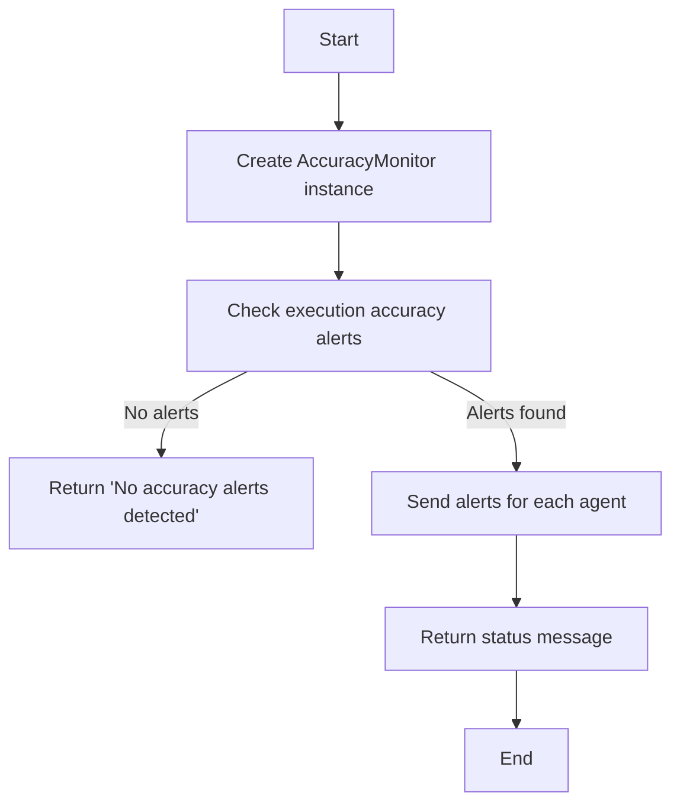
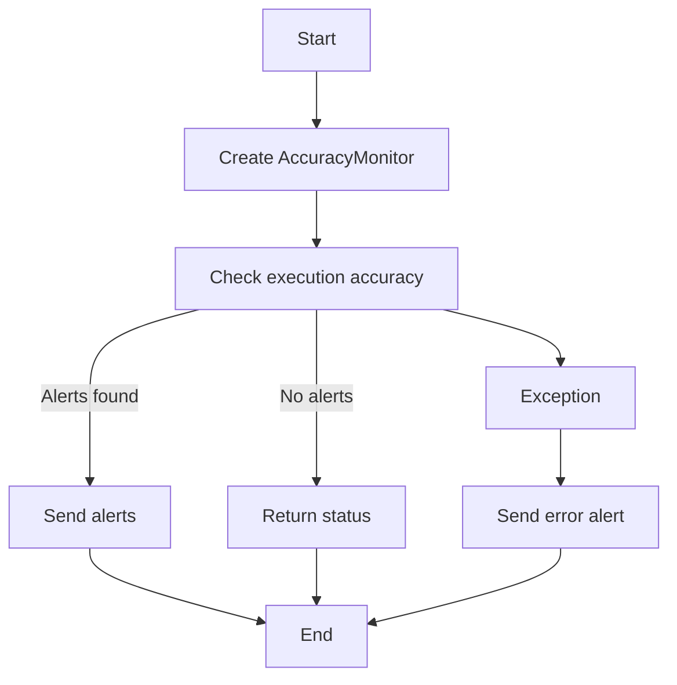
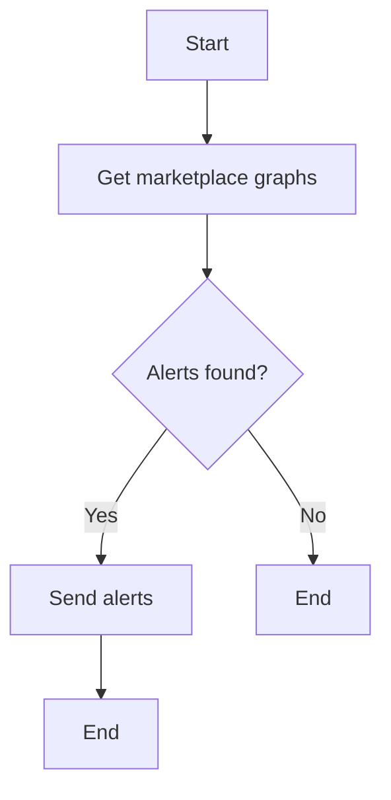

# `.\AutoGPT\autogpt_platform\backend\backend\monitoring\accuracy_monitor.py` 详细设计文档

This module monitors execution accuracy trends for marketplace agents and sends alerts when accuracy drops below a specified threshold.

## 整体流程



## 类结构

```
AccuracyMonitor (Class)
├── Config (Global variable)
├── logger (Global variable)
└── report_execution_accuracy_alerts (Global function)
```

## 全局变量及字段


### `config`
    
Configuration settings for the module.

类型：`Config`
    


### `logger`
    
Logger instance for logging messages.

类型：`logging.Logger`
    


### `drop_threshold`
    
Threshold for accuracy drop to trigger alerts (default 10.0%)

类型：`float`
    


### `AccuracyMonitor.config`
    
Configuration settings for the module.

类型：`Config`
    


### `AccuracyMonitor.notification_client`
    
Client for sending notifications.

类型：`NotificationManagerClient`
    


### `AccuracyMonitor.database_client`
    
Client for accessing the database.

类型：`DatabaseManagerClient`
    


### `AccuracyMonitor.drop_threshold`
    
Threshold for accuracy drop to trigger alerts (default 10.0%)

类型：`float`
    
    

## 全局函数及方法


### report_execution_accuracy_alerts

Check execution accuracy and send alerts if drops are detected.

参数：

- drop_threshold：`float`，Percentage drop threshold to trigger alerts (default 10.0%)

返回值：`str`，Status message indicating results of the check

#### 流程图



#### 带注释源码

```python
def report_execution_accuracy_alerts(drop_threshold: float = 10.0) -> str:
    """
    Check execution accuracy and send alerts if drops are detected.

    Args:
        drop_threshold: Percentage drop threshold to trigger alerts (default 10.0%)

    Returns:
        Status message indicating results of the check
    """
    monitor = AccuracyMonitor(drop_threshold=drop_threshold)
    return monitor.check_execution_accuracy_alerts()
```


### AccuracyMonitor.__init__

This method initializes the `AccuracyMonitor` class by setting up the necessary clients and configuration for monitoring execution accuracy.

参数：

- `drop_threshold`：`float`，The threshold percentage drop in accuracy that triggers alerts (default 10.0%)

返回值：无

#### 流程图

```mermaid
classDiagram
    AccuracyMonitor <|-- Config
    AccuracyMonitor o-- NotificationManagerClient
    AccuracyMonitor o-- DatabaseManagerClient
    AccuracyMonitor {
        drop_threshold
        config
        notification_client
        database_client
    }
    Config {
        # Configuration details
    }
    NotificationManagerClient {
        # Notification client methods
    }
    DatabaseManagerClient {
        # Database client methods
    }
```

#### 带注释源码

```python
def __init__(self, drop_threshold: float = 10.0):
    self.config = config  # Configuration object
    self.notification_client = get_notification_manager_client()  # Notification client
    self.database_client = get_database_manager_client()  # Database client
    self.drop_threshold = drop_threshold  # Accuracy drop threshold
```


### AccuracyMonitor.check_execution_accuracy_alerts

Check marketplace agents for accuracy drops and send alerts.

参数：

- `drop_threshold`：`float`，The threshold percentage drop to trigger alerts (default 10.0%)

返回值：`str`，Status message indicating results of the check

#### 流程图



#### 带注释源码

```python
def check_execution_accuracy_alerts(self) -> str:
    """Check marketplace agents for accuracy drops and send alerts."""
    try:
        logger.info("Checking execution accuracy for marketplace agents")

        # Get marketplace graphs using database client
        graphs = self.database_client.get_marketplace_graphs_for_monitoring(
            days_back=30, min_executions=10
        )

        alerts_found = 0

        for graph_data in graphs:
            result = self.database_client.get_accuracy_trends_and_alerts(
                graph_id=graph_data.graph_id,
                user_id=graph_data.user_id,
                days_back=21,  # 3 weeks
                drop_threshold=self.drop_threshold,
            )

            if result.alert:
                alert = result.alert

                # Get graph details for better alert info
                try:
                    graph_info = self.database_client.get_graph_metadata(
                        graph_id=alert.graph_id
                    )
                    graph_name = graph_info.name if graph_info else "Unknown Agent"
                except Exception:
                    graph_name = "Unknown Agent"

                # Create detailed alert message
                alert_msg = (
                    f"🚨 **AGENT ACCURACY DROP DETECTED**\n\n"
                    f"**Agent:** {graph_name}\n"
                    f"**Graph ID:** `{alert.graph_id}`\n"
                    f"**Accuracy Drop:** {alert.drop_percent:.1f}%\n"
                    f"**Recent Performance:**\n"
                    f"  • 3-day average: {alert.three_day_avg:.1f}%\n"
                    f"  • 7-day average: {alert.seven_day_avg:.1f}%\n"
                )

                if alert.user_id:
                    alert_msg += f"**Owner:** {alert.user_id}\n"

                # Send individual alert for each agent (not batched)
                self.notification_client.discord_system_alert(
                    alert_msg, DiscordChannel.PRODUCT
                )
                alerts_found += 1
                logger.warning(
                    f"Sent accuracy alert for agent: {graph_name} ({alert.graph_id})"
                )

        if alerts_found > 0:
            return f"Alert sent for {alerts_found} agents with accuracy drops"

        logger.info("No execution accuracy alerts detected")
        return "No accuracy alerts detected"

    except Exception as e:
        logger.exception(f"Error checking execution accuracy alerts: {e}")

        error = Exception(f"Error checking execution accuracy alerts: {e}")
        msg = str(error)
        sentry_capture_error(error)
        self.notification_client.discord_system_alert(msg, DiscordChannel.PRODUCT)
        return msg
```


## 关键组件


### 张量索引与惰性加载

用于高效地访问和操作大型数据集，通过延迟加载减少内存消耗。

### 反量化支持

提供对量化策略的支持，以优化模型性能和资源使用。

### 量化策略

实现量化策略，将浮点数转换为低精度表示，以减少模型大小和加速推理。


## 问题及建议


### 已知问题

-   **全局变量和函数依赖性**：代码中使用了全局变量 `logger` 和 `config`，以及全局函数 `get_database_manager_client` 和 `get_notification_manager_client`。这种依赖性可能导致代码难以维护和测试，因为全局状态难以控制。
-   **异常处理**：在 `check_execution_accuracy_alerts` 方法中，异常处理较为简单，仅记录错误并发送通知。可能需要更详细的错误处理逻辑，以便更好地诊断问题。
-   **代码重复**：在 `check_execution_accuracy_alerts` 方法中，对于每个检测到的警报，都创建了一个详细的警报消息。这可能是一个重复的代码块，可以考虑将其提取为一个单独的函数以减少重复。
-   **日志记录**：日志记录主要集中在错误和警告级别。可能需要更多的日志记录来帮助跟踪正常流程和调试。

### 优化建议

-   **减少全局依赖**：考虑将 `logger` 和 `config` 作为参数传递给类方法，或者使用依赖注入来减少全局变量的使用。
-   **改进异常处理**：在捕获异常后，可以添加更多的逻辑来处理不同类型的错误，例如重试机制或更详细的错误信息。
-   **提取重复代码**：将创建警报消息的代码提取为一个单独的函数，以减少重复并提高代码的可读性。
-   **增加日志级别**：根据需要增加更多的日志记录，以便更好地了解系统的运行情况。
-   **性能优化**：如果 `get_marketplace_graphs_for_monitoring` 和 `get_accuracy_trends_and_alerts` 方法返回大量数据，可能需要考虑性能优化，例如分页或缓存结果。
-   **代码测试**：编写单元测试来覆盖关键功能，确保代码的稳定性和可靠性。


## 其它


### 设计目标与约束

- 设计目标：确保系统能够准确监测执行精度，并在精度下降时及时发送警报。
- 约束：系统需高效运行，减少对市场代理的影响，同时保证警报的准确性和及时性。

### 错误处理与异常设计

- 错误处理：通过try-except块捕获异常，记录错误日志，并通过Sentry发送错误警报。
- 异常设计：定义了自定义异常`Exception`，用于处理检查执行精度时可能发生的错误。

### 数据流与状态机

- 数据流：从数据库获取市场代理的精度趋势，分析数据，生成警报，并通过通知客户端发送警报。
- 状态机：无状态机，但存在一系列步骤，包括获取数据、分析数据、发送警报。

### 外部依赖与接口契约

- 外部依赖：依赖数据库管理客户端、通知管理客户端、配置管理。
- 接口契约：定义了数据库客户端的`get_marketplace_graphs_for_monitoring`、`get_accuracy_trends_and_alerts`、`get_graph_metadata`方法，以及通知客户端的`discord_system_alert`方法。


    