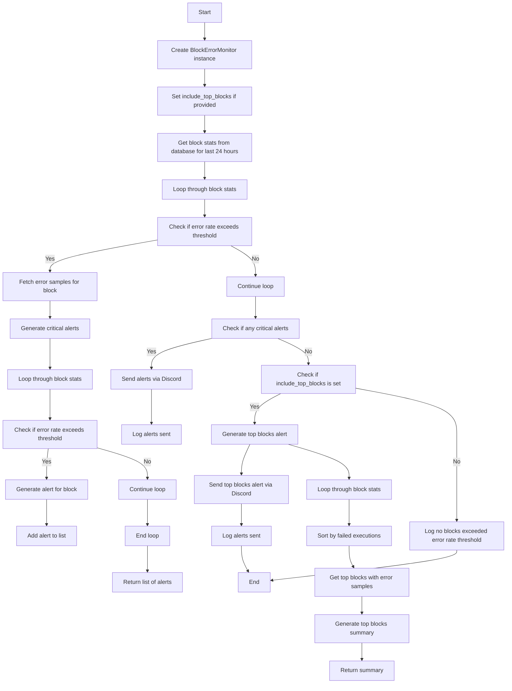
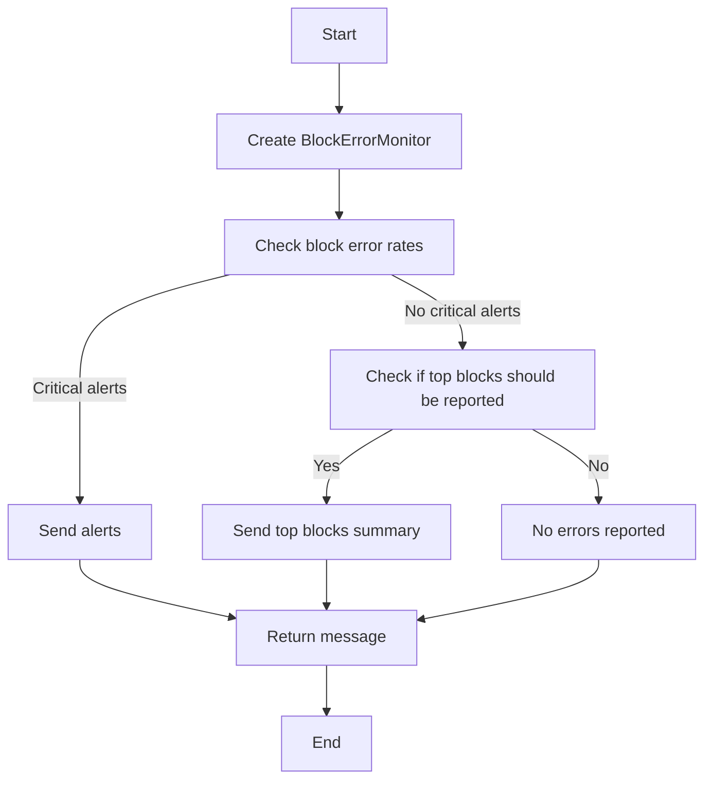
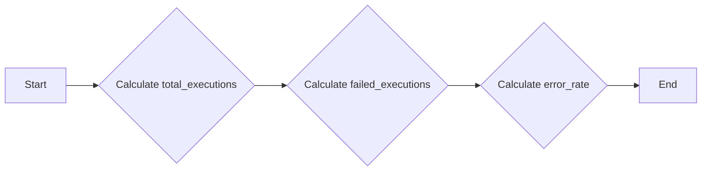
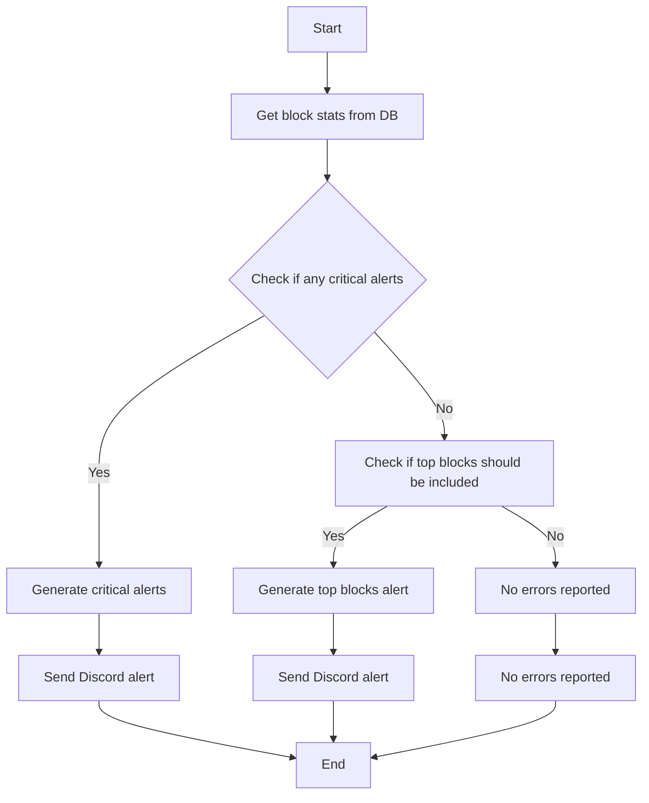
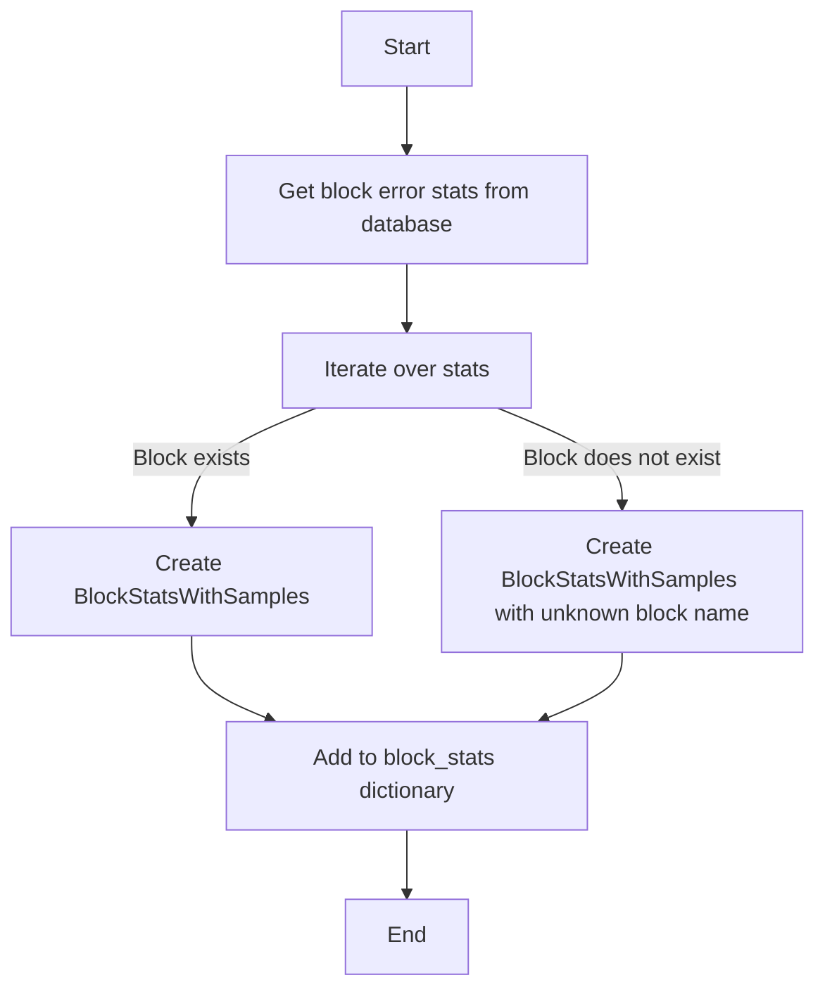
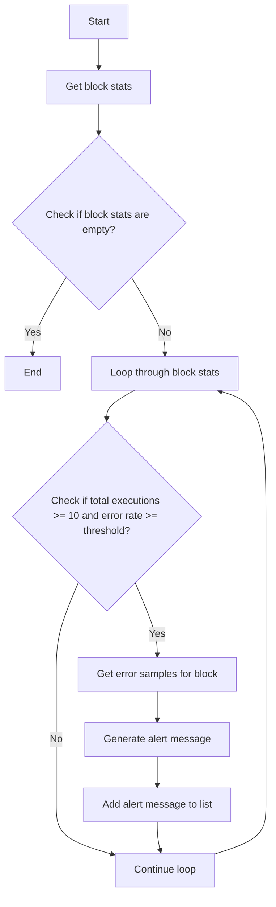
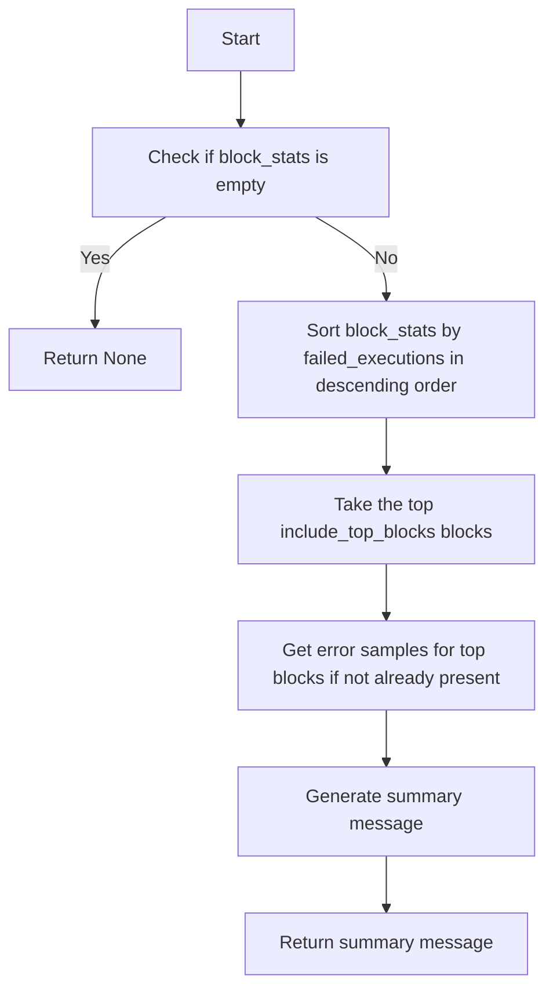
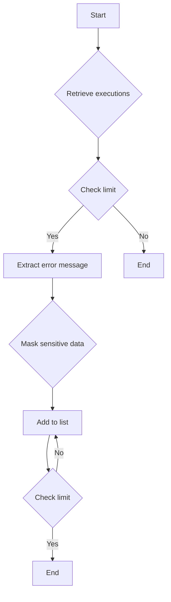
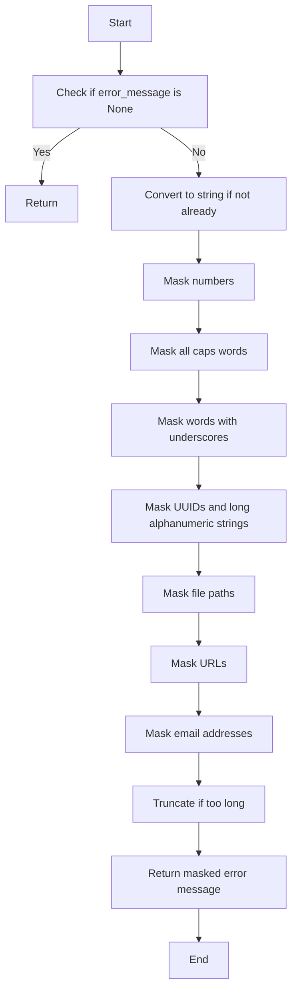
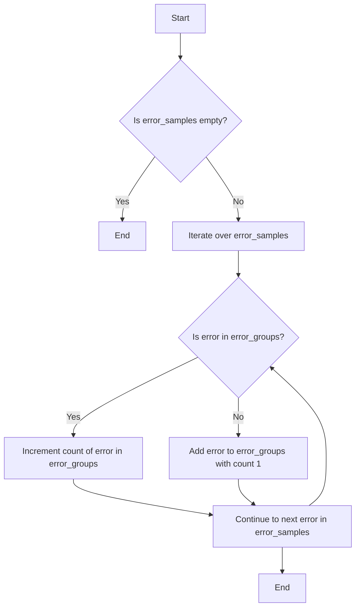

# `.\AutoGPT\autogpt_platform\backend\backend\monitoring\block_error_monitor.py` 详细设计文档

This module monitors block error rates and sends alerts via Discord when error rates exceed predefined thresholds.

## 整体流程



## 类结构

```
BlockErrorMonitor (类)
├── BlockStatsWithSamples (类)
│   ├── block_id (字段)
│   ├── block_name (字段)
│   ├── total_executions (字段)
│   ├── failed_executions (字段)
│   └── error_samples (字段)
│       └── error_rate (属性)
└── Config (类)
```

## 全局变量及字段


### `logger`
    
Logger instance for logging messages.

类型：`logging.Logger`
    


### `config`
    
Configuration object for the module.

类型：`backend.util.settings.Config`
    


### `BlockStatsWithSamples.block_id`
    
Unique identifier for the block.

类型：`str`
    


### `BlockStatsWithSamples.block_name`
    
Name of the block.

类型：`str`
    


### `BlockStatsWithSamples.total_executions`
    
Total number of executions for the block.

类型：`int`
    


### `BlockStatsWithSamples.failed_executions`
    
Number of failed executions for the block.

类型：`int`
    


### `BlockStatsWithSamples.error_samples`
    
List of error samples associated with the block.

类型：`list[str]`
    


### `BlockErrorMonitor.config`
    
Configuration object for the monitor.

类型：`backend.util.settings.Config`
    


### `BlockErrorMonitor.notification_client`
    
Client for sending notifications.

类型：`backend.util.clients.NotificationManagerClient`
    


### `BlockErrorMonitor.include_top_blocks`
    
Number of top blocks to include in the alert summary, if any.

类型：`int | None`
    


### `BlockStatsWithSamples.block_id`
    
Unique identifier for the block.

类型：`str`
    


### `BlockStatsWithSamples.block_name`
    
Name of the block.

类型：`str`
    


### `BlockStatsWithSamples.total_executions`
    
Total number of executions for the block.

类型：`int`
    


### `BlockStatsWithSamples.failed_executions`
    
Number of failed executions for the block.

类型：`int`
    


### `BlockStatsWithSamples.error_samples`
    
List of error samples associated with the block.

类型：`list[str]`
    


### `BlockErrorMonitor.config`
    
Configuration object for the monitor.

类型：`backend.util.settings.Config`
    


### `BlockErrorMonitor.notification_client`
    
Client for sending notifications.

类型：`backend.util.clients.NotificationManagerClient`
    


### `BlockErrorMonitor.include_top_blocks`
    
Number of top blocks to include in the alert summary, if any.

类型：`int | None`
    
    

## 全局函数及方法


### report_block_error_rates

This function checks block error rates and sends Discord alerts if thresholds are exceeded.

参数：

- `include_top_blocks`：`int | None`，Optional. The number of top blocks to include in the summary. Defaults to None, which uses the default value from the configuration.

返回值：`str`，A message indicating whether an alert was sent or if no errors were reported.

#### 流程图



#### 带注释源码

```python
def report_block_error_rates(include_top_blocks: int | None = None):
    """Check block error rates and send Discord alerts if thresholds are exceeded."""
    monitor = BlockErrorMonitor(include_top_blocks=include_top_blocks)
    return monitor.check_block_error_rates()
```


### BlockStatsWithSamples.error_rate

Calculate error rate as a percentage.

参数：

- `self`：`BlockStatsWithSamples`，The instance of the BlockStatsWithSamples class.

返回值：`float`，The error rate as a percentage.

#### 流程图



#### 带注释源码

```python
class BlockStatsWithSamples(BaseModel):
    # ... (other fields and methods)

    @property
    def error_rate(self) -> float:
        """Calculate error rate as a percentage."""
        if self.total_executions == 0:
            return 0.0
        return (self.failed_executions / self.total_executions) * 100
```


### BlockErrorMonitor.check_block_error_rates

This method checks block error rates and sends Discord alerts if thresholds are exceeded.

参数：

- `include_top_blocks`：`int | None`，Optional. The number of top blocks to include in the summary. Defaults to the value specified in the configuration.

返回值：`str`，A message indicating whether an alert was sent, a summary was sent, or no errors were reported.

#### 流程图



#### 带注释源码

```python
def check_block_error_rates(self) -> str:
    """Check block error rates and send Discord alerts if thresholds are exceeded."""
    try:
        logger.info("Checking block error rates")

        # Get executions from the last 24 hours
        end_time = datetime.now(timezone.utc)
        start_time = end_time - timedelta(hours=24)

        # Use SQL aggregation to efficiently count totals and failures by block
        block_stats = self._get_block_stats_from_db(start_time, end_time)

        # For blocks with high error rates, fetch error samples
        threshold = self.config.block_error_rate_threshold
        for block_name, stats in block_stats.items():
            if stats.total_executions >= 10 and stats.error_rate >= threshold * 100:
                # Only fetch error samples for blocks that exceed threshold
                error_samples = self._get_error_samples_for_block(
                    stats.block_id, start_time, end_time, limit=3
                )
                stats.error_samples = error_samples

        # Check thresholds and send alerts
        critical_alerts = self._generate_critical_alerts(block_stats, threshold)

        if critical_alerts:
            msg = "Block Error Rate Alert:\n\n" + "\n\n".join(critical_alerts)
            self.notification_client.discord_system_alert(msg)
            logger.info(
                f"Sent block error rate alert for {len(critical_alerts)} blocks"
            )
            return f"Alert sent for {len(critical_alerts)} blocks with high error rates"

        # If no critical alerts, check if we should show top blocks
        if self.include_top_blocks > 0:
            top_blocks_msg = self._generate_top_blocks_alert(
                block_stats, start_time, end_time
            )
            if top_blocks_msg:
                self.notification_client.discord_system_alert(top_blocks_msg)
                logger.info("Sent top blocks summary")
                return "Sent top blocks summary"

        logger.info("No blocks exceeded error rate threshold")
        return "No errors reported for today"

    except Exception as e:
        logger.exception(f"Error checking block error rates: {e}")

        error = Exception(f"Error checking block error rates: {e}")
        msg = str(error)
        sentry_capture_error(error)
        self.notification_client.discord_system_alert(msg)
        return msg
```


### `_get_block_stats_from_db`

This method retrieves block execution statistics from the database using efficient SQL aggregation.

参数：

- `start_time`：`datetime`，The start time for the statistics period.
- `end_time`：`datetime`，The end time for the statistics period.

返回值：`dict[str, BlockStatsWithSamples]`，A dictionary mapping block names to `BlockStatsWithSamples` objects containing the statistics.

#### 流程图



#### 带注释源码

```python
def _get_block_stats_from_db(self, start_time: datetime, end_time: datetime) -> dict[str, BlockStatsWithSamples]:
    """Get block execution stats using efficient SQL aggregation."""

    result = get_database_manager_client().get_block_error_stats(
        start_time, end_time
    )

    block_stats = {}
    for stats in result:
        block_name = b.name if (b := get_block(stats.block_id)) else "Unknown"

        block_stats[block_name] = BlockStatsWithSamples(
            block_id=stats.block_id,
            block_name=block_name,
            total_executions=stats.total_executions,
            failed_executions=stats.failed_executions,
            error_samples=[],
        )

    return block_stats
```


### BlockErrorMonitor._generate_critical_alerts

Generate alerts for blocks that exceed the error rate threshold.

参数：

- `block_stats`：`dict[str, BlockStatsWithSamples]`，Block statistics with error samples.
- `threshold`：`float`，Error rate threshold.

返回值：`list[str]`，List of critical alerts.

#### 流程图



#### 带注释源码

```python
def _generate_critical_alerts(self, block_stats: dict[str, BlockStatsWithSamples], threshold: float) -> list[str]:
    """Generate alerts for blocks that exceed the error rate threshold."""
    alerts = []

    for block_name, stats in block_stats.items():
        if stats.total_executions >= 10 and stats.error_rate >= threshold * 100:
            error_groups = self._group_similar_errors(stats.error_samples)

            alert_msg = (
                f"🚨 Block '{block_name}' has {stats.error_rate:.1f}% error rate "
                f"({stats.failed_executions}/{stats.total_executions}) in the last 24 hours"
            )

            if error_groups:
                alert_msg += "\n\n📊 Error Types:"
                for error_pattern, count in error_groups.items():
                    alert_msg += f"\n• {error_pattern} ({count}x)"

            alerts.append(alert_msg)

    return alerts
```


### `_generate_top_blocks_alert`

Generate a summary of the top blocks with the most errors when no critical alerts exist.

参数：

- `block_stats`：`dict[str, BlockStatsWithSamples]`，Block statistics with error samples.
- `start_time`：`datetime`，The start time for the error rate calculation.
- `end_time`：`datetime`，The end time for the error rate calculation.

返回值：`str | None`，A summary message of the top blocks with the most errors or `None` if there are no errors.

#### 流程图



#### 带注释源码

```python
def _generate_top_blocks_alert(
    self,
    block_stats: dict[str, BlockStatsWithSamples],
    start_time: datetime,
    end_time: datetime,
) -> str | None:
    """Generate top blocks summary when no critical alerts exist."""
    top_error_blocks = sorted(
        [
            (name, stats)
            for name, stats in block_stats.items()
            if stats.total_executions >= 10 and stats.failed_executions > 0
        ],
        key=lambda x: x[1].failed_executions,
        reverse=True,
    )[: self.include_top_blocks]

    if not top_error_blocks:
        return "✅ No errors reported for today - all blocks are running smoothly!"

    # Get error samples for top blocks
    for block_name, stats in top_error_blocks:
        if not stats.error_samples:
            stats.error_samples = self._get_error_samples_for_block(
                stats.block_id, start_time, end_time, limit=2
            )

    count_text = (
        f"top {self.include_top_blocks}" if self.include_top_blocks > 1 else "top"
    )
    alert_msg = f"📊 Daily Error Summary - {count_text} blocks with most errors:"
    for block_name, stats in top_error_blocks:
        alert_msg += f"\n• {block_name}: {stats.failed_executions} errors ({stats.error_rate:.1f}% of {stats.total_executions})"

        if stats.error_samples:
            error_groups = self._group_similar_errors(stats.error_samples)
            if error_groups:
                # Show most common error
                most_common_error = next(iter(error_groups.items()))
                alert_msg += f"\n  └ Most common: {most_common_error[0]}"

    return alert_msg
``` 


### BlockErrorMonitor._get_error_samples_for_block

This method retrieves error samples for a specific block from the database, focusing on recent failed executions.

参数：

- `block_id`：`str`，The unique identifier for the block.
- `start_time`：`datetime`，The start time for the time range to fetch error samples.
- `end_time`：`datetime`，The end time for the time range to fetch error samples.
- `limit`：`int`，The maximum number of error samples to retrieve. Default is 3.

返回值：`list[str]`，A list of masked error messages for the specified block.

#### 流程图



#### 带注释源码

```python
def _get_error_samples_for_block(
    self, block_id: str, start_time: datetime, end_time: datetime, limit: int = 3
) -> list[str]:
    """Get error samples for a specific block - just a few recent ones."""
    # Only fetch a small number of recent failed executions for this specific block
    executions = get_database_manager_client().get_node_executions(
        block_ids=[block_id],
        statuses=[ExecutionStatus.FAILED],
        created_time_gte=start_time,
        created_time_lte=end_time,
        limit=limit,  # Just get the limit we need
    )

    error_samples = []
    for execution in executions:
        if error_message := self._extract_error_message(execution):
            masked_error = self._mask_sensitive_data(error_message)
            error_samples.append(masked_error)

        if len(error_samples) >= limit:  # Stop once we have enough samples
            break

    return error_samples
```


### `_extract_error_message`

Extract error message from execution output.

参数：

- `execution`：`NodeExecutionResult`，The execution result object containing the output data.

返回值：`str`，The extracted error message from the execution output. If no error message is found, returns `None`.

#### 流程图

```mermaid
graph TD
    A[Start] --> B[Check if execution.output_data exists]
    B -->|Yes| C[Check if execution.output_data.get("error") exists]
    C -->|Yes| D[Return str(error_msg[0])]
    C -->|No| E[Return None]
    D --> F[End]
    E --> F
```

#### 带注释源码

```python
def _extract_error_message(self, execution: NodeExecutionResult) -> str | None:
    """Extract error message from execution output."""
    try:
        if execution.output_data and (error_msg := execution.output_data.get("error")):
            return str(error_msg[0])
        return None
    except Exception:
        return None
```


### `_mask_sensitive_data`

Mask sensitive data in error messages to enable grouping.

参数：

- `error_message`：`str`，The error message to mask sensitive data from.

返回值：`str`，The error message with sensitive data masked.

#### 流程图



#### 带注释源码

```python
def _mask_sensitive_data(self, error_message):
    """Mask sensitive data in error messages to enable grouping."""
    if not error_message:
        return ""

    # Convert to string if not already
    error_str = str(error_message)

    # Mask numbers (replace with X)
    error_str = re.sub(r"\d+", "X", error_str)

    # Mask all caps words (likely constants/IDs)
    error_str = re.sub(r"\b[A-Z_]{3,}\b", "MASKED", error_str)

    # Mask words with underscores (likely internal variables)
    error_str = re.sub(r"\b\w*_\w*\b", "MASKED", error_str)

    # Mask UUIDs and long alphanumeric strings
    error_str = re.sub(
        r"\b[a-f0-9]{8}-[a-f0-9]{4}-[a-f0-9]{4}-[a-f0-9]{4}-[a-f0-9]{12}\b",
        "UUID",
        error_str,
    )
    error_str = re.sub(r"\b[a-f0-9]{20,}\b", "HASH", error_str)

    # Mask file paths
    error_str = re.sub(r"(/[^/\s]+)+", "/MASKED/path", error_str)

    # Mask URLs
    error_str = re.sub(r"https?://[^\s]+", "URL", error_str)

    # Mask email addresses
    error_str = re.sub(
        r"\b[A-Za-z0-9._%+-]+@[A-Za-z0-9.-]+\.[A-Z|a-z]{2,}\b", "EMAIL", error_str
    )

    # Truncate if too long
    if len(error_str) > 100:
        error_str = error_str[:97] + "..."

    return error_str.strip()
```


### `_group_similar_errors`

This method groups similar error messages from a list of error samples and returns a dictionary with the error message as the key and the count of occurrences as the value.

参数：

- `error_samples`：`list[str]`，A list of error messages to be grouped.

返回值：`dict[str, int]`，A dictionary where the keys are the error messages and the values are the counts of occurrences.

#### 流程图



#### 带注释源码

```python
def _group_similar_errors(self, error_samples):
    """Group similar error messages and return counts."""
    if not error_samples:
        return {}

    error_groups = {}
    for error in error_samples:
        if error in error_groups:
            error_groups[error] += 1
        else:
            error_groups[error] = 1

    # Sort by frequency, most common first
    return dict(sorted(error_groups.items(), key=lambda x: x[1], reverse=True))
```


## 关键组件


### 张量索引与惰性加载

用于高效地从数据库中检索和聚合块执行统计信息，避免一次性加载大量数据。

### 反量化支持

通过掩码敏感数据，如数字、常量、变量、UUID、哈希、文件路径和URL，以支持错误消息的反量化。

### 量化策略

通过将错误消息中的敏感数据替换为占位符，如"X"、"MASKED"、"UUID"、"HASH"、"MASKED/path"和"URL"，实现错误消息的量化。

## 问题及建议


### 已知问题

-   **全局变量和函数依赖性**：代码中使用了全局变量 `logger` 和 `config`，这可能导致代码难以维护和测试。建议将它们作为参数传递给类方法或函数。
-   **异常处理**：代码中的异常处理较为简单，仅记录日志和发送通知。建议增加更详细的异常处理逻辑，以便更好地诊断问题。
-   **代码重复**：在 `_get_error_samples_for_block` 方法中，存在重复的代码用于提取错误消息和掩码敏感数据。建议将这部分逻辑提取到一个单独的函数中。
-   **正则表达式效率**：代码中使用了多个正则表达式来掩码敏感数据，这可能会影响性能。建议优化正则表达式或使用更高效的方法。

### 优化建议

-   **重构全局变量和函数**：将 `logger` 和 `config` 作为参数传递给类方法或函数，以提高代码的可测试性和可维护性。
-   **改进异常处理**：增加更详细的异常处理逻辑，例如捕获特定类型的异常并采取相应的措施。
-   **减少代码重复**：将提取错误消息和掩码敏感数据的逻辑提取到一个单独的函数中，以减少代码重复并提高可读性。
-   **优化正则表达式**：优化正则表达式以提高效率，或考虑使用其他方法来掩码敏感数据。
-   **代码结构**：考虑将代码分解为更小的函数和类，以提高代码的可读性和可维护性。
-   **性能优化**：对于数据库查询和数据处理，考虑使用更高效的方法，例如使用索引或批处理操作。
-   **配置管理**：考虑使用配置文件或环境变量来管理配置，以提高灵活性和可移植性。
-   **单元测试**：编写单元测试以验证代码的正确性和稳定性。
-   **文档**：编写详细的文档，包括代码的用途、功能、配置选项和操作指南。


## 其它


### 设计目标与约束

- 设计目标：
  - 监控块错误率，并在错误率超过阈值时发送警报。
  - 提供块错误率的详细统计信息，包括错误样本。
  - 确保敏感数据在错误样本中不被泄露。
- 约束：
  - 必须使用现有的数据库和通知管理客户端。
  - 必须遵守敏感数据处理政策。

### 错误处理与异常设计

- 错误处理：
  - 使用日志记录所有异常和错误。
  - 使用Sentry捕获异常并记录错误信息。
  - 在发生异常时，通过Discord发送系统警报。
- 异常设计：
  - 异常被捕获并记录，不会导致程序崩溃。
  - 异常信息被发送到Discord，以便进行进一步的分析和修复。

### 数据流与状态机

- 数据流：
  - 从数据库获取块执行统计信息。
  - 分析统计信息以确定错误率。
  - 如果错误率超过阈值，则生成警报并发送通知。
- 状态机：
  - 无状态机，因为该模块是按需运行的，没有特定的状态转换。

### 外部依赖与接口契约

- 外部依赖：
  - 数据库管理客户端。
  - 通知管理客户端。
  - 配置管理。
- 接口契约：
  - 数据库管理客户端提供获取块错误统计信息的方法。
  - 通知管理客户端提供发送系统警报的方法。
  - 配置管理提供错误率阈值和块错误率阈值配置。


    