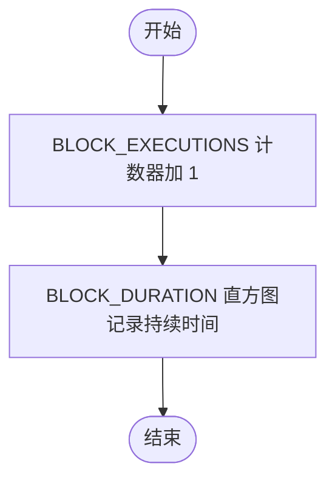

# `.\AutoGPT\autogpt_platform\backend\backend\monitoring\instrumentation.py` 详细设计文档

该模块为AutoGPT平台的FastAPI服务提供Prometheus监控集成，定义了包含图执行、块执行、数据库查询等在内的自定义业务指标，并提供了自动配置FastAPI应用指标、延迟及端点暴露的功能，同时注意控制指标基数以防止性能问题。

## 整体流程


## 类结构

```
Module (prometheus_instrumentation)
├── Global Variables (Prometheus Metrics)
│   ├── Counters (e.g., GRAPH_EXECUTIONS, BLOCK_EXECUTIONS)
│   ├── Histograms (e.g., BLOCK_DURATION, DATABASE_QUERIES)
│   ├── Gauges (e.g., WEBSOCKET_CONNECTIONS, SCHEDULER_JOBS)
│   └── Info (SERVICE_INFO)
└── Global Functions
    ├── instrument_fastapi (Main setup function)
    └── record_* functions (Metrics recording helpers)
```

## 全局变量及字段


### `logger`
    
Standard logger instance for module-level logging.

类型：`logging.Logger`
    


### `GRAPH_EXECUTIONS`
    
Counter metric tracking the total number of graph executions, labeled by status.

类型：`prometheus_client.Counter`
    


### `GRAPH_EXECUTIONS_BY_USER`
    
Counter metric tracking the total number of graph executions by user (sampled), labeled by status.

类型：`prometheus_client.Counter`
    


### `BLOCK_EXECUTIONS`
    
Counter metric tracking the total number of block executions, labeled by block type and status.

类型：`prometheus_client.Counter`
    


### `BLOCK_DURATION`
    
Histogram metric tracking the duration of block executions in seconds, labeled by block type.

类型：`prometheus_client.Histogram`
    


### `WEBSOCKET_CONNECTIONS`
    
Gauge metric tracking the total number of active WebSocket connections.

类型：`prometheus_client.Gauge`
    


### `SCHEDULER_JOBS`
    
Gauge metric tracking the current number of scheduled jobs, labeled by job type and status.

类型：`prometheus_client.Gauge`
    


### `DATABASE_QUERIES`
    
Histogram metric tracking the duration of database queries in seconds, labeled by operation and table.

类型：`prometheus_client.Histogram`
    


### `RABBITMQ_MESSAGES`
    
Counter metric tracking the total number of RabbitMQ messages, labeled by queue and status.

类型：`prometheus_client.Counter`
    


### `AUTHENTICATION_ATTEMPTS`
    
Counter metric tracking the total number of authentication attempts, labeled by method and status.

类型：`prometheus_client.Counter`
    


### `API_KEY_USAGE`
    
Counter metric tracking API key usage, labeled by provider, block type, and status.

类型：`prometheus_client.Counter`
    


### `GRAPH_OPERATIONS`
    
Counter metric tracking graph operations by type, labeled by operation and status.

类型：`prometheus_client.Counter`
    


### `USER_OPERATIONS`
    
Counter metric tracking user operations by type, labeled by operation and status.

类型：`prometheus_client.Counter`
    


### `RATE_LIMIT_HITS`
    
Counter metric tracking the number of rate limit hits, labeled by endpoint.

类型：`prometheus_client.Counter`
    


### `SERVICE_INFO`
    
Info metric providing static service information such as name and version.

类型：`prometheus_client.Info`
    


    

## 全局函数及方法


### `instrument_fastapi`

使用 Prometheus 指标对 FastAPI 应用程序进行检测，配置默认 HTTP 指标（如请求大小、响应大小、延迟）、服务信息，并暴露指标端点。

参数：

-  `app`：`FastAPI`，FastAPI 应用程序实例
-  `service_name`：`str`，用于指标标记的服务名称
-  `expose_endpoint`：`bool`，是否暴露 /metrics 端点，默认为 True
-  `endpoint`：`str`，指标端点的路径，默认为 "/metrics"
-  `include_in_schema`：`bool`，是否在 OpenAPI schema 中包含指标端点，默认为 False
-  `excluded_handlers`：`Optional[list]`，要从指标收集中排除的路径列表

返回值：`Instrumentator`，配置好的 Instrumentator 实例

#### 流程图


#### 带注释源码

```python
def instrument_fastapi(
    app: FastAPI,
    service_name: str,
    expose_endpoint: bool = True,
    endpoint: str = "/metrics",
    include_in_schema: bool = False,
    excluded_handlers: Optional[list] = None,
) -> Instrumentator:
    """
    Instrument a FastAPI application with Prometheus metrics.

    Args:
        app: FastAPI application instance
        service_name: Name of the service for metrics labeling
        expose_endpoint: Whether to expose /metrics endpoint
        endpoint: Path for metrics endpoint
        include_in_schema: Whether to include metrics endpoint in OpenAPI schema
        excluded_handlers: List of paths to exclude from metrics

    Returns:
        Configured Instrumentator instance
    """

    # Set service info
    try:
        from importlib.metadata import version

        # 尝试获取 'autogpt-platform-backend' 的版本号
        service_version = version("autogpt-platform-backend")
    except Exception:
        # 如果获取失败，版本号设为 "unknown"
        service_version = "unknown"

    # 设置服务静态信息指标
    SERVICE_INFO.info(
        {
            "service": service_name,
            "version": service_version,
        }
    )

    # Create instrumentator with default metrics
    # 处理服务名称，将短横线替换为下划线，以符合 Prometheus 命名规范
    service_subsystem = service_name.replace("-", "_")
    instrumentator = Instrumentator(
        should_group_status_codes=True, # 分组状态码 (如 2xx, 4xx)
        should_ignore_untemplated=True, # 忽略无模板的路径
        should_respect_env_var=True,    # 尊重环境变量设置
        should_instrument_requests_inprogress=True, # 检测进行中的请求
        excluded_handlers=excluded_handlers or ["/health", "/readiness"], # 默认排除健康检查端点
        env_var_name="ENABLE_METRICS",  # 控制开关的环境变量名
        inprogress_name=f"autogpt_{service_subsystem}_http_requests_inprogress", # 防止多应用重复注册的进行中指标名
        inprogress_labels=True,
    )

    # Add default HTTP metrics
    # 添加默认的 HTTP 指标 (请求数等)
    instrumentator.add(
        metrics.default(
            metric_namespace="autogpt",
            metric_subsystem=service_name.replace("-", "_"),
        )
    )

    # Add request size metrics
    # 添加请求大小指标
    instrumentator.add(
        metrics.request_size(
            metric_namespace="autogpt",
            metric_subsystem=service_name.replace("-", "_"),
        )
    )

    # Add response size metrics
    # 添加响应大小指标
    instrumentator.add(
        metrics.response_size(
            metric_namespace="autogpt",
            metric_subsystem=service_name.replace("-", "_"),
        )
    )

    # Add latency metrics with custom buckets for better granularity
    # 添加自定义桶的延迟指标，以获得更好的粒度
    instrumentator.add(
        metrics.latency(
            metric_namespace="autogpt",
            metric_subsystem=service_name.replace("-", "_"),
            buckets=[0.01, 0.025, 0.05, 0.1, 0.25, 0.5, 1, 2.5, 5, 10, 30, 60],
        )
    )

    # Add combined metrics (requests by method and status)
    # 添加组合指标 (按方法和状态的请求)
    instrumentator.add(
        metrics.combined_size(
            metric_namespace="autogpt",
            metric_subsystem=service_name.replace("-", "_"),
        )
    )

    # Instrument the app
    # 对 FastAPI 应用执行实际检测
    instrumentator.instrument(app)

    # Expose metrics endpoint if requested
    # 如果需要，暴露指标端点
    if expose_endpoint:
        instrumentator.expose(
            app,
            endpoint=endpoint,
            include_in_schema=include_in_schema,
            tags=["monitoring"] if include_in_schema else None,
        )
        # 记录日志
        logger.info(f"Metrics endpoint exposed at {endpoint} for {service_name}")

    return instrumentator
```


### `record_graph_execution`

记录图执行事件的函数。该函数用于在图执行发生时更新相关的Prometheus计数器，它主要跟踪总执行次数和按用户（实际实现中为防止基数爆炸，当前仅跟踪状态）的执行次数，同时保留了graph_id和user_id参数供未来采样或调试使用。

参数：

-   `graph_id`：`str`，图标识符（保留用于未来的采样或调试，当前未直接用作标签）
-   `status`：`str`，执行状态（例如 success, error, validation_error），用作Prometheus的标签
-   `user_id`：`str`，用户标识符（保留用于未来的采样或调试，当前未直接用作标签）

返回值：`None`，无返回值。

#### 流程图


#### 带注释源码

```python
def record_graph_execution(graph_id: str, status: str, user_id: str):
    """Record a graph execution event.

    Args:
        graph_id: Graph identifier (kept for future sampling/debugging)
        status: Execution status (success/error/validation_error)
        user_id: User identifier (kept for future sampling/debugging)
    """
    # 在不包含高基数标签的情况下跟踪整体执行情况
    GRAPH_EXECUTIONS.labels(status=status).inc()

    # 可选地跟踪每个用户的执行情况（如需要可实现采样逻辑）
    # 目前为了防止基数爆炸，仅跟踪 status
    GRAPH_EXECUTIONS_BY_USER.labels(status=status).inc()
```


### `record_block_execution`

记录一个带有持续时间的 Block 执行事件。

参数：

-  `block_type`：`str`，Block 的类型（作为 Prometheus 的 label）
-  `status`：`str`，执行状态（例如：success, error，作为 Prometheus 的 label）
-  `duration`：`float`，执行持续时间（单位：秒）

返回值：`None`，无返回值

#### 流程图



#### 带注释源码

```python
def record_block_execution(block_type: str, status: str, duration: float):
    """Record a block execution event with duration."""
    # 增加指定 block_type 和 status 的 Block 执行总数计数
    BLOCK_EXECUTIONS.labels(block_type=block_type, status=status).inc()
    # 记录指定 block_type 的 Block 执行持续时间到直方图
    BLOCK_DURATION.labels(block_type=block_type).observe(duration)
```


### `update_websocket_connections`

该函数用于更新活跃 WebSocket 连接数的 Prometheus Gauge 指标。它根据连接的建立或断开（通过 `delta` 参数的正负指示）来增加或减少全局计数器，同时通过不将用户 ID 作为标签传递来避免基数爆炸问题。

参数：

-  `user_id`：`str`，用户标识符（保留用于未来的采样或调试，当前逻辑中未直接使用）
-  `delta`：`int`，连接数量的变化量（连接为 +1，断开为 -1）

返回值：`None`，无返回值（副作用是修改全局 Prometheus 指标状态）

#### 流程图


#### 带注释源码

```python
def update_websocket_connections(user_id: str, delta: int):
    """Update the number of active WebSocket connections.

    Args:
        user_id: User identifier (kept for future sampling/debugging)
        delta: Change in connection count (+1 for connect, -1 for disconnect)
    """
    # 跟踪总连接数，不使用 user_id 作为标签以防止基数爆炸
    if delta > 0:
        # 如果 delta 为正，表示有新连接，增加 Gauge 指标
        WEBSOCKET_CONNECTIONS.inc(delta)
    else:
        # 如果 delta 为负，表示连接断开，减少 Gauge 指标（使用绝对值确保减少正确的数量）
        WEBSOCKET_CONNECTIONS.dec(abs(delta))
```


### `record_database_query`

该函数用于记录数据库查询的执行时长和元数据，通过 Prometheus 的直方图（Histogram）指标来监控数据库性能。

参数：

- `operation`：`str`，数据库操作类型（例如 select, insert, update, delete）。
- `table`：`str`，被查询的数据库表的名称。
- `duration`：`float`，查询操作所持续的秒数。

返回值：`None`，无返回值。

#### 流程图


#### 带注释源码

```python
def record_database_query(operation: str, table: str, duration: float):
    """Record a database query with duration."""
    # 使用预定义的 Prometheus Histogram 指标 DATABASE_QUERIES
    # 根据传入的操作类型 (operation) 和表名 (table) 设置标签
    # 并观测 (observe) 持续时间 (duration)，将该次查询耗时计入直方图分布中
    DATABASE_QUERIES.labels(operation=operation, table=table).observe(duration)
```


### `record_rabbitmq_message`

该函数用于记录 RabbitMQ 消息事件的 Prometheus 指标。它通过增加一个全局计数器来跟踪发送到特定队列并具有特定状态的消息总数，用于监控消息队列的吞吐量和处理情况。

参数：

- `queue`：`str`，消息所在的 RabbitMQ 队列名称
- `status`：`str`，消息处理的状态（例如：success, error, pending）

返回值：`None`，无返回值

#### 流程图


#### 带注释源码

```python
def record_rabbitmq_message(queue: str, status: str):
    """Record a RabbitMQ message event."""
    # 使用提供的队列名称和状态作为标签，
    # 增加全局计数器 RABBITMQ_MESSAGES 的值。
    # 这有助于监控不同队列的消息处理量及成功失败状态。
    RABBITMQ_MESSAGES.labels(queue=queue, status=status).inc()
```


### `record_authentication_attempt`

通过增加 Prometheus 计数器来记录一次认证尝试事件，用于追踪认证相关指标。

参数：

- `method`：`str`，认证尝试使用的方法（如 "basic", "jwt" 等）。
- `status`：`str`，认证尝试的状态（如 "success", "failure" 等）。

返回值：`None`，无返回值。

#### 流程图


#### 带注释源码

```python
def record_authentication_attempt(method: str, status: str):
    """Record an authentication attempt."""
    # 使用 method 和 status 作为标签，对 AUTHENTICATION_ATTEMPTS 计数器进行标记并增加计数值
    AUTHENTICATION_ATTEMPTS.labels(method=method, status=status).inc()
```


### `record_api_key_usage`

记录由提供商和执行块分类的 API 密钥使用情况。

参数：

- `provider`：`str`，API 提供商名称（例如 "openai"）
- `block_type`：`str`，发起 API 调用的块类型
- `status`：`str`，操作的状态（例如 "success", "error"）

返回值：`None`，无返回值

#### 流程图


#### 带注释源码

```python
def record_api_key_usage(provider: str, block_type: str, status: str):
    """Record API key usage by provider and block."""
    # 访问全局 Counter 指标 API_KEY_USAGE
    # 使用传入的参数作为标签（labels）来细分指标数据，并将计数器加 1
    API_KEY_USAGE.labels(provider=provider, block_type=block_type, status=status).inc()
```


### `record_rate_limit_hit`

该函数用于记录特定 API 端点发生速率限制（Rate Limit）的事件。它接收端点和用户ID作为参数，但为了防止指标基数爆炸，仅将端点作为标签增加 Prometheus 计数器的值。

参数：

- `endpoint`：`str`，被速率限制的 API 端点
- `user_id`：`str`，用户标识符（保留供未来采样/调试使用，当前未用于标签）

返回值：`None`，无返回值

#### 流程图


#### 带注释源码

```python
def record_rate_limit_hit(endpoint: str, user_id: str):
    """记录一次速率限制命中。

    Args:
        endpoint: 被速率限制的 API 端点
        user_id: 用户标识符（保留供未来采样/调试使用）
    """
    # 仅使用 endpoint 作为标签增加计数器的值
    # 注意：此处未使用 user_id 作为标签，是为了防止因用户数量过多导致 Prometheus 指标基数爆炸
    RATE_LIMIT_HITS.labels(endpoint=endpoint).inc()
```


### `record_graph_operation`

Record a graph operation (create, update, delete, execute, etc.).

参数：

-  `operation`：`str`，The type of graph operation being performed (e.g., create, update, delete, execute).
-  `status`：`str`，The status or outcome of the operation (e.g., success, failure).

返回值：`None`，该函数不返回任何值，仅更新 Prometheus 指标。

#### 流程图

```mermaid
flowchart TD
    Start([开始]) --> Input[接收参数: operation, status]
    Input --> LabelMetrics[使用 operation 和 status<br/>标记 GRAPH_OPERATIONS 指标]
    LabelMetrics --> Increment[调用 inc() 方法增加计数器]
    Increment --> End([结束])
```

#### 带注释源码

```python
def record_graph_operation(operation: str, status: str):
    """Record a graph operation (create, update, delete, execute, etc.)."""
    # 使用特定的操作类型和状态标记 Prometheus 计数器
    # 并将计数值加 1，用于记录图操作的发生次数
    GRAPH_OPERATIONS.labels(operation=operation, status=status).inc()
```


### `record_user_operation`

记录用户操作（如登录、注册等）的指标数据。该函数通过 Prometheus Counter 指标统计不同操作类型及其执行状态的次数，用于监控用户行为和系统健康状况。

参数：

-  `operation`：`str`，用户操作的具体类型，例如 "login"、"register" 等。
-  `status`：`str`，该操作的执行结果状态，例如 "success"、"failure" 等。

返回值：`None`，无返回值，仅执行 metrics 计数增加的副作用。

#### 流程图


#### 带注释源码

```python
def record_user_operation(operation: str, status: str):
    """Record a user operation (login, register, etc.)."""
    # 使用 operation 和 status 作为标签，定位到特定的 metric series
    # 然后将计数器加 1，用于记录该操作的发生次数
    USER_OPERATIONS.labels(operation=operation, status=status).inc()
```


## 关键组件


### Prometheus 业务指标定义

定义了一组针对 AutoGPT 平台特定操作（如图执行、块处理、数据库查询和 WebSocket 连接）的 Prometheus 指标，并实施了基数控制策略以防止监控系统的过载。

### FastAPI 应用检测配置

通过 `prometheus_fastapi_instrumentator` 自动收集 HTTP 层面的指标（如请求延迟、响应大小和请求进行中状态），并将其暴露于指定端点（如 `/metrics`）的机制。

### 业务逻辑事件记录封装

提供了一系列封装函数用于标准化记录平台内部事件（如认证尝试、RabbitMQ 消息投递、API 密钥使用等），确保指标标记的一致性并进一步优化标签基数。


## 问题及建议


### 已知问题

-   **变量命名与功能不一致**: 全局变量 `GRAPH_EXECUTIONS_BY_USER` 命名暗示按用户维度统计，但实际代码实现为了防止基数爆炸，并未使用传入的 `user_id` 参数，这与变量名称相悖，容易造成误解。
-   **硬编码的直方图分桶**: `BLOCK_DURATION` 和 `DATABASE_QUERIES` 等直方图指标的分桶配置是硬编码在代码中的。对于性能差异较大的服务，固定分桶可能导致无法准确捕捉大部分请求的延迟分布（例如若大部分查询在 1ms 内，但最小分桶是 0.01s）。
-   **缺乏错误隔离机制**: 所有的 `record_*` 辅助函数（如 `record_graph_execution`）直接与 Prometheus 客户端交互。如果业务逻辑传入了非法的标签值（如 None 或未定义的枚举值），将抛出异常，进而可能导致正常业务流程中断。

### 优化建议

-   **配置化分桶策略**: 将 Histogram 的 buckets 参数配置化（例如通过环境变量或配置文件注入），允许不同的微服务根据自身的 SLA 和性能特征自定义分桶范围，以获得更精确的监控数据。
-   **增强指标记录的容错性**: 在所有 `record_*` 函数内部添加 `try-except` 异常捕获块。确保即使指标记录失败（例如标签冲突），也不会影响核心业务逻辑的执行，并建议记录警告日志以便排查。
-   **支持显式传入版本号**: 优化 `instrument_fastapi` 函数，增加可选参数 `service_version`。当 `importlib.metadata` 无法获取版本（如在开发环境或非标准安装）时，允许调用者显式传入版本号，避免指标中版本信息全部显示为 "unknown"。
-   **引入枚举统一标签值**: 建议定义 Python 枚举类来约束 `status`、`operation` 等标签的取值。这不仅能避免因大小写不一致或拼写错误导致的基数膨胀，还能提高代码的可维护性和类型安全性。


## 其它


### 设计目标与约束

本模块旨在为 AutoGPT 平台的所有 FastAPI 服务提供统一、标准化的 Prometheus 指标收集方案。核心设计目标包括：
1.  **低侵入性**：通过中间件和全局函数提供监控能力，最小化对业务逻辑的代码侵入。
2.  **性能优先**：指标记录操作应具有极低的延迟，避免影响主业务链路的性能。
3.  **统一规范**：所有指标遵循统一的命名规范（如 `autogpt_` 前缀）和标签结构，便于全平台聚合监控。
4.  **基数控制**：严格限制 Prometheus 指标的基数，防止因高基数标签（如无界的 `user_id` 或 `graph_id`）导致内存溢出或性能下降。设计中明确移除了特定的高基数标签，仅保留状态或类型等低基数维度。

### 错误处理与异常设计

1.  **版本获取容错**：在 `instrument_fastapi` 函数中，服务版本号的获取通过 `try-except` 块包裹。如果 `importlib.metadata` 抛出异常（例如包未安装或元数据丢失），系统不会报错退出，而是将版本号默认设置为 `"unknown"`，确保监控初始化流程不中断。
2.  **指标标签校验**：依赖底层 `prometheus_client` 库的机制。如果在记录指标时传入了未在初始化时定义的标签，底层库会抛出 `ValueError`。业务代码需确保调用 `record_*` 系列函数时传入正确的参数。
3.  **非阻塞设计**：指标记录函数（如 `record_graph_execution`）不包含阻塞性 I/O 操作或复杂的异常捕获逻辑，旨在让异常（如有）快速暴露，避免掩盖业务逻辑中的真实错误。

### 数据流

1.  **初始化阶段**：
    *   服务启动时，业务代码调用 `instrument_fastapi(app, ...)`。
    *   函数配置并实例化 `Instrumentator`，将 HTTP 请求指标中间件挂载到 FastAPI 应用上。
    *   若 `expose_endpoint` 为真，则在应用路由中注册 `/metrics` 端点。
    *   `SERVICE_INFO` 指标被更新为当前的服务名称和版本。
2.  **运行时收集阶段**：
    *   **HTTP 层**：FastAPI 处理请求时，`Instrumentator` 中间件自动拦截并记录 HTTP 请求数、延迟、大小等指标。
    *   **业务层**：业务逻辑代码在特定事件发生时（如图执行、数据库查询），主动调用全局的 `record_*` 函数。
    *   这些函数更新内存中的全局 Counter、Gauge 或 Histogram 对象。
3.  **暴露阶段**：
    *   Prometheus 服务器定期（如每 15s）发起 HTTP GET 请求访问 FastAPI 服务的 `/metrics` 端点。
    *   `prometheus_client` 库将内存中累积的指标数据序列化为 Prometheus 文本格式并返回。

### 外部依赖与接口契约

1.  **FastAPI**：
    *   **接口契约**：`instrument_fastapi` 函数接受一个 `fastapi.FastAPI` 实例作为参数。该实例必须处于未启动状态（通常在 `app = FastAPI()` 之后，`uvicorn.run()` 之前调用）。
2.  **prometheus_client**：
    *   **依赖**：用于底层的指标定义和注册。
    *   **契约**：全局变量（如 `GRAPH_EXECUTIONS`）是标准的 `prometheus_client` metric 实例，支持 `.labels(...).inc()` 或 `.observe()` 等标准方法。
3.  **prometheus_fastapi_instrumentator**：
    *   **依赖**：提供 FastAPI 集成器。
    *   **契约**：`Instrumentator` 对象需要调用 `instrument(app)` 进行挂载，调用 `expose(app)` 注册端点。
4.  **importlib.metadata (Python 标准库)**：
    *   **依赖**：用于动态获取 `autogpt-platform-backend` 的版本号。
    *   **契约**：需在包安装环境（非源码直接运行）中才能正确获取版本，否则回退到 "unknown"。

    