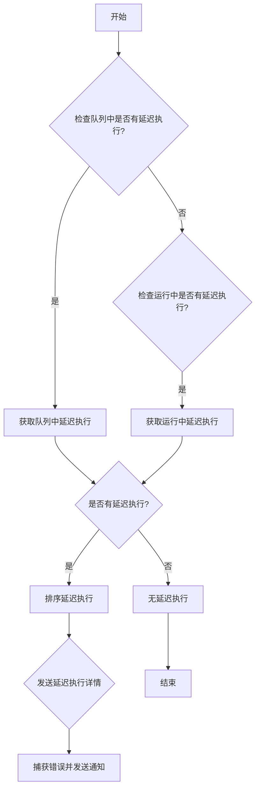
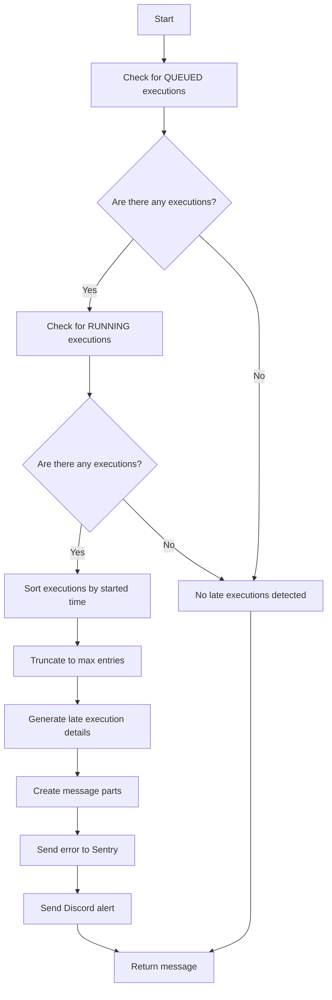

# `.\AutoGPT\autogpt_platform\backend\backend\monitoring\late_execution_monitor.py` 详细设计文档

This module monitors for late executions in a system, checking for queued and running executions that exceed predefined thresholds and sends alerts via Discord if any are found.

## 整体流程



## 类结构

```
LateExecutionException (异常类)
├── LateExecutionMonitor (监控类)
│   ├── check_late_executions (方法)
│   └── __init__ (构造函数)
└── report_late_executions (全局函数)
```

## 全局变量及字段


### `logger`
    
Logger instance for logging messages.

类型：`logging.Logger`
    


### `config`
    
Configuration object for the module.

类型：`backend.util.settings.Config`
    


### `LateExecutionMonitor.config`
    
Configuration object for the LateExecutionMonitor class.

类型：`backend.util.settings.Config`
    


### `LateExecutionMonitor.notification_client`
    
Client for sending notifications.

类型：`backend.util.clients.NotificationManagerClient`
    


### `LateExecutionMonitor.config`
    
Configuration object for the monitor.

类型：`backend.util.settings.Config`
    


### `LateExecutionMonitor.notification_client`
    
Client for sending notifications to the monitor.

类型：`backend.util.clients.NotificationManagerClient`
    
    

## 全局函数及方法


### report_late_executions()

Check for late executions and send Discord alerts if found.

参数：

- 无

返回值：`str`，A message indicating whether late executions were detected and the details of the late executions.

#### 流程图

```mermaid
graph TD
    A[Start] --> B[Create LateExecutionMonitor instance]
    B --> C[Check for late executions]
    C -->|Late executions found| D[Send Discord alerts]
    C -->|No late executions| E[Return "No late executions detected."]
    D --> F[Return message]
    E --> F
    F --> G[End]
```

#### 带注释源码

```python
def report_late_executions() -> str:
    """Check for late executions and send Discord alerts if found."""
    monitor = LateExecutionMonitor()  # Create LateExecutionMonitor instance
    return monitor.check_late_executions()  # Check for late executions
```

### LateExecutionMonitor.check_late_executions()

Check for late executions and send alerts if found.

参数：

- 无

返回值：`str`，A message indicating whether late executions were detected and the details of the late executions.

#### 流程图

```mermaid
graph TD
    A[Start] --> B[Get queued executions]
    B --> C[Get running executions]
    C -->|Late executions found| D[Sort executions]
    D --> E[Truncate to max entries]
    E --> F[Create late execution details]
    F --> G[Create message parts]
    G --> H[Check if truncated]
    H -->|Yes| I[Add truncated message]
    H -->|No| J[Add details message]
    I --> K[Create error message]
    J --> K
    K --> L[Create error]
    L --> M[Capture error]
    M --> N[Send Discord alert]
    N --> O[Return message]
    O --> P[End]
    H --> Q[Return "No late executions detected."]
    Q --> P
```

#### 带注释源码

```python
def check_late_executions(self) -> str:
    """Check for late executions and send alerts if found."""

    # Check for QUEUED executions
    queued_late_executions = get_database_manager_client().get_graph_executions(
        statuses=[ExecutionStatus.QUEUED],
        created_time_gte=datetime.now(timezone.utc)
        - timedelta(
            seconds=self.config.execution_late_notification_checkrange_secs
        ),
        created_time_lte=datetime.now(timezone.utc)
        - timedelta(seconds=self.config.execution_late_notification_threshold_secs),
        limit=1000,
    )

    # Check for RUNNING executions stuck for more than 24 hours
    running_late_executions = get_database_manager_client().get_graph_executions(
        statuses=[ExecutionStatus.RUNNING],
        created_time_gte=datetime.now(timezone.utc)
        - timedelta(hours=24)
        - timedelta(
            seconds=self.config.execution_late_notification_checkrange_secs
        ),
        created_time_lte=datetime.now(timezone.utc) - timedelta(hours=24),
        limit=1000,
    )

    # ... rest of the method ...
```

### Key Components

- `LateExecutionMonitor`: Monitors late executions and sends alerts.
- `check_late_executions`: Checks for late executions and sends alerts if found.
- `report_late_executions`: Reports late executions by using the `LateExecutionMonitor`.

### Potential Technical Debt or Optimization Space

- The method `check_late_executions` could be optimized by reducing the number of database queries or by caching results.
- The alerting mechanism could be improved by providing more detailed information or by integrating with other alerting systems.

### Other Projects

- **Design Goals and Constraints**: The system should be able to detect and alert on late executions efficiently.
- **Error Handling and Exception Design**: The system uses `sentry_capture_error` to capture and report errors.
- **Data Flow and State Machine**: The data flow is linear, starting from checking executions and ending with sending alerts.
- **External Dependencies and Interface Contracts**: The system depends on external services like the database manager and notification manager.
```


### `LateExecutionMonitor.check_late_executions`

This method checks for late executions and sends alerts if any are found.

参数：

- `self`：`LateExecutionMonitor`，The instance of the LateExecutionMonitor class.
- `None`：`None`，No parameters are passed to this method.

返回值：`str`，A message indicating whether late executions were detected and the details of the late executions.

#### 流程图



#### 带注释源码

```python
def check_late_executions(self) -> str:
    """Check for late executions and send alerts if found."""

    # Check for QUEUED executions
    queued_late_executions = get_database_manager_client().get_graph_executions(
        statuses=[ExecutionStatus.QUEUED],
        created_time_gte=datetime.now(timezone.utc) - timedelta(
            seconds=self.config.execution_late_notification_checkrange_secs
        ),
        created_time_lte=datetime.now(timezone.utc) - timedelta(
            seconds=self.config.execution_late_notification_threshold_secs
        ),
        limit=1000,
    )

    # Check for RUNNING executions stuck for more than 24 hours
    running_late_executions = get_database_manager_client().get_graph_executions(
        statuses=[ExecutionStatus.RUNNING],
        created_time_gte=datetime.now(timezone.utc) - timedelta(hours=24) - timedelta(
            seconds=self.config.execution_late_notification_checkrange_secs
        ),
        created_time_lte=datetime.now(timezone.utc) - timedelta(hours=24),
        limit=1000,
    )

    all_late_executions = queued_late_executions + running_late_executions

    if not all_late_executions:
        return "No late executions detected."

    # Sort by started time (oldest first), with None values (unstarted) first
    all_late_executions.sort(
        key=lambda x: x.started_at or datetime.min.replace(tzinfo=timezone.utc)
    )

    num_total_late = len(all_late_executions)
    num_queued = len(queued_late_executions)
    num_running = len(running_late_executions)
    num_users = len(set([r.user_id for r in all_late_executions]))

    # Truncate to max entries
    truncate_size = 5
    truncated_executions = all_late_executions[:truncate_size]
    was_truncated = num_total_late > truncate_size

    late_execution_details = [
        f"* `Execution ID: {exec.id}, Graph ID: {exec.graph_id}v{exec.graph_version}, User ID: {exec.user_id}, Status: {exec.status}, Started At: {exec.started_at.isoformat() if exec.started_at else 'Not started'}`"
        for exec in truncated_executions
    ]

    message_parts = [
        f"Late executions detected: {num_total_late} total late executions ({num_queued} QUEUED, {num_running} RUNNING) from {num_users} users.",
        f"QUEUED executions have been waiting for more than {self.config.execution_late_notification_threshold_secs} seconds.",
        "RUNNING executions have been running for more than 24 hours.",
        "Please check the executor status.",
    ]

    if was_truncated:
        message_parts.append(
            f"\nShowing first {truncate_size} of {num_total_late} late executions:"
        )
    else:
        message_parts.append("\nDetails:")

    error_message = (
        "\n".join(message_parts) + "\n" + "\n".join(late_execution_details)
    )

    error = LateExecutionException(error_message)
    msg = str(error)

    sentry_capture_error(error)
    self.notification_client.discord_system_alert(msg)
    return msg
```


### `LateExecutionMonitor.__init__`

This method initializes the `LateExecutionMonitor` class by setting up the configuration and notification client.

参数：

- `self`：`None`，The instance of the class itself.

返回值：`None`，No return value, it initializes the object.

#### 流程图

```mermaid
classDiagram
    LateExecutionMonitor <|-- Config: config
    LateExecutionMonitor <|-- NotificationClient: notification_client
    LateExecutionMonitor {
        +__init__()
        +check_late_executions(): str
    }
```

#### 带注释源码

```python
class LateExecutionMonitor:
    """Monitor late executions and send alerts when thresholds are exceeded."""

    def __init__(self):
        # Initialize the configuration object from the settings module
        self.config = config
        # Get the notification manager client to send alerts
        self.notification_client = get_notification_manager_client()
```


## 关键组件


### 张量索引与惰性加载

用于延迟执行查询，直到实际需要时才从数据库中检索数据。

### 反量化支持

允许在执行过程中动态调整量化参数。

### 量化策略

定义了如何量化执行状态和执行时间，以便于监控和警报。


## 问题及建议


### 已知问题

-   **全局变量和函数依赖性**：代码中使用了全局变量 `logger` 和 `config`，这可能导致代码的可测试性和可维护性降低。全局变量和函数的使用应该尽量避免，除非有充分的理由。
-   **异常处理**：`sentry_capture_error` 函数被调用来捕获异常，但没有对可能发生的异常进行显式的异常处理。这可能导致异常没有被正确记录或处理。
-   **代码重复**：`check_late_executions` 方法中存在重复的代码，用于获取不同状态的执行记录。这可以通过提取公共逻辑到一个单独的方法中或使用循环来简化。
-   **性能问题**：代码中使用了大量的数据库查询，并且没有对查询结果进行缓存。这可能导致性能问题，尤其是在高负载情况下。

### 优化建议

-   **减少全局变量和函数的使用**：将全局变量 `logger` 和 `config` 移动到类中，并在需要的地方通过实例访问它们。
-   **增加异常处理**：在调用 `sentry_capture_error` 之前，添加 try-except 块来捕获可能发生的异常。
-   **减少代码重复**：提取公共逻辑到一个单独的方法中，或者使用循环来简化获取不同状态执行记录的代码。
-   **实现缓存机制**：对于频繁执行的数据库查询，实现缓存机制以减少数据库访问次数，提高性能。
-   **日志记录**：增加更详细的日志记录，以便于问题追踪和调试。
-   **单元测试**：编写单元测试来确保代码的正确性和稳定性。
-   **代码风格**：遵循一致的代码风格指南，以提高代码的可读性和可维护性。


## 其它


### 设计目标与约束

- 设计目标：
  - 监控执行任务是否延迟。
  - 当延迟超过阈值时，发送警报。
  - 确保警报信息清晰、详细。
- 约束：
  - 限制检查范围和阈值。
  - 限制发送警报的数量。

### 错误处理与异常设计

- 错误处理：
  - 使用 `logging` 模块记录错误信息。
  - 使用 `sentry_capture_error` 函数捕获并报告错误。
- 异常设计：
  - 定义 `LateExecutionException` 异常，用于处理延迟执行检测相关的错误。

### 数据流与状态机

- 数据流：
  - 从数据库获取执行状态。
  - 分析执行状态，确定是否延迟。
  - 如果延迟，发送警报。
- 状态机：
  - 执行状态：QUEUED, RUNNING, COMPLETED, FAILED。
  - 延迟状态：未延迟，延迟。

### 外部依赖与接口契约

- 外部依赖：
  - 数据库管理器客户端。
  - 通知管理器客户端。
  - 配置管理器。
- 接口契约：
  - `get_database_manager_client`：获取数据库管理器客户端。
  - `get_notification_manager_client`：获取通知管理器客户端。
  - `Config`：配置管理器。
  - `ExecutionStatus`：执行状态枚举。

    