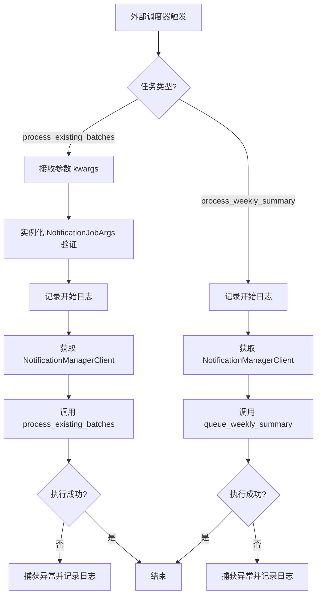
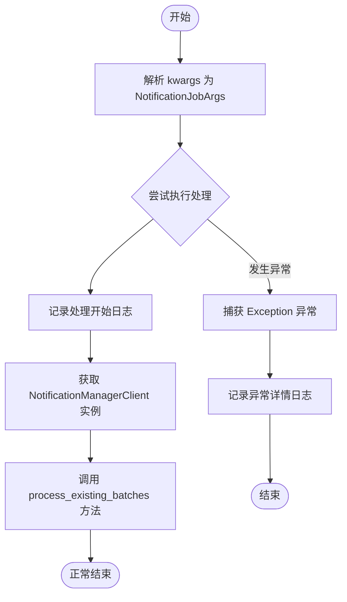
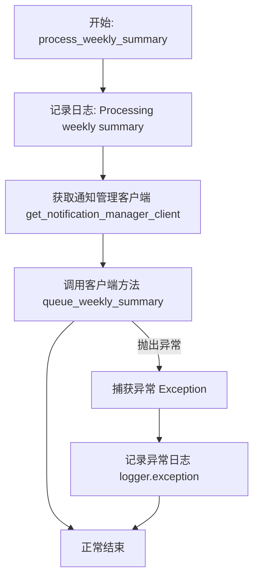

# `.\AutoGPT\autogpt_platform\backend\backend\monitoring\notification_monitor.py` 详细设计文档

该代码实现了一个通知处理监控模块，主要用于定义后台任务的参数模型以及具体的执行逻辑，包括处理特定类型通知的现有批次和生成周总结，通过通知管理客户端进行交互并包含基础的异常处理与日志记录。

## 整体流程



## 类结构

```
pydantic.BaseModel
└── NotificationJobArgs
```

## 全局变量及字段


### `logger`
    
用于记录通知处理模块运行状态和错误信息的全局日志记录器。

类型：`logging.Logger`
    


### `NotificationJobArgs.notification_types`
    
指定需要处理的通知类型的枚举列表。

类型：`list[NotificationType]`
    


### `NotificationJobArgs.cron`
    
定义定时任务调度规则的 cron 表达式字符串。

类型：`str`
    
    

## 全局函数及方法


### `process_existing_batches`

解析传入的关键字参数以验证通知作业配置，并调用通知管理器客户端处理指定类型的现有通知批次，同时包含错误捕获与日志记录机制。

参数：

- `kwargs`：`dict`，包含通知作业参数的关键字字典，预期字段包括 `notification_types` (list[NotificationType]) 和 `cron` (str)。

返回值：`None`，该函数不返回任何值，仅执行处理流程和日志记录。

#### 流程图



#### 带注释源码

```python
def process_existing_batches(**kwargs):
    """Process existing notification batches."""
    # 将传入的关键字参数解析并验证为 Pydantic 模型 NotificationJobArgs
    args = NotificationJobArgs(**kwargs)
    try:
        # 记录信息日志，标识开始处理特定类型的现有批次
        logging.info(
            f"Processing existing batches for notification type {args.notification_types}"
        )
        # 获取通知管理器客户端实例，并委托其执行实际的批次处理逻辑
        get_notification_manager_client().process_existing_batches(
            args.notification_types
        )
    except Exception as e:
        # 捕获所有异常，防止任务崩溃，并记录详细的错误堆栈信息
        logger.exception(f"Error processing existing batches: {e}")
```


### `process_weekly_summary`

该函数负责触发每周汇总通知的处理流程，通过调用通知管理客户端将周报任务加入队列，并在过程中进行日志记录与异常捕获。

参数：

- `kwargs`：`dict`，接收关键字参数（当前实现中未直接使用，通常用于兼容任务调度框架的参数传递机制）

返回值：`None`，无显式返回值

#### 流程图



#### 带注释源码

```python
def process_weekly_summary(**kwargs):
    """Process weekly summary notifications."""  # 定义函数文档字符串，说明其用途是处理每周汇总通知
    try:
        logging.info("Processing weekly summary")  # 记录 INFO 级别日志，标识开始处理每周汇总
        # 获取通知管理客户端实例，并调用其队列周报的方法，将任务放入执行队列
        get_notification_manager_client().queue_weekly_summary()
    except Exception as e:  # 捕获代码执行过程中可能抛出的任何异常
        # 记录 ERROR 级别日志及异常堆栈信息，包含具体的错误消息 e
        logger.exception(f"Error processing weekly summary: {e}")
```


## 关键组件


### NotificationJobArgs

基于 Pydantic 的数据模型，用于定义和验证调度通知任务所需的输入参数，包含通知类型列表和 cron 表达式。

### 批处理任务执行器

负责解析输入参数并调用通知管理客户端处理现有通知批次的业务逻辑函数，包含异常捕获与日志记录。

### 周报任务执行器

负责触发通知管理客户端生成并排队周报摘要的业务逻辑函数，包含异常捕获与日志记录。

### 通知管理器客户端

外部依赖组件，通过工厂函数获取，负责实际执行通知批次处理和周报排队的核心逻辑。


## 问题及建议


### 已知问题

-   **字段未使用**: `NotificationJobArgs` 类中定义了 `cron` 字段，但在 `process_existing_batches` 函数中并未被实际使用，这可能属于遗留代码或设计未完善。
-   **日志实例使用不一致**: 代码顶部定义了模块级的 `logger` 实例，但在函数内部（`process_existing_batches` 和 `process_weekly_summary`）却直接使用了 `logging` 模块级函数（如 `logging.info`），这会导致无法利用模块级 logger 可能配置的特定上下文或过滤器。
-   **异常捕获过于宽泛**: 函数使用了 `except Exception`，这会捕获包括 `KeyboardInterrupt` 或 `SystemExit` 在内的所有异常，且在捕获后仅记录日志便结束，导致上层调用者无法感知任务失败或进行重试策略处理。
-   **函数签名缺乏明确性**: 使用 `**kwargs` 作为参数隐藏了函数真实的输入需求，降低了代码的可读性，并使得 IDE 无法提供有效的自动补全和类型检查。

### 优化建议

-   **移除或实现未使用字段**: 若 `cron` 字段暂无用途，建议从 `NotificationJobArgs` 中移除以保持模型整洁；若是未来规划，应补充相应的逻辑处理。
-   **统一使用 Logger 实例**: 修改函数内部调用，使用模块顶部定义的 `logger`（即 `logger.info`）替代直接调用 `logging.info`，以确保日志行为的一致性和可配置性。
-   **引入依赖注入**: 将 `get_notification_manager_client()` 的调用改为通过参数传入 Client 实例，而非在函数内部直接获取。这样可以解耦依赖，极大地提升单元测试时的 Mock 便利性。
-   **细化异常处理策略**: 捕获具体的业务异常（如网络错误、验证错误），允许系统级异常向上冒泡；或者根据异常类型决定是否记录日志后重抛，以便任务调度器能根据执行状态进行重试或报警。
-   **明确参数类型**: 废弃 `**kwargs`，改用明确的参数列表或直接使用 Pydantic 模型作为参数类型，提升代码的健壮性和可维护性。


## 其它


### 设计目标与约束

该模块旨在作为任务调度器（如Celery或APScheduler）与底层通知系统之间的适配层。主要设计目标包括：
1.  **解耦性**：将调度参数的标准化与具体的通知处理逻辑分离。
2.  **健壮性**：确保即使底层通知处理失败，调度任务本身也不会抛出未捕获的异常导致进程崩溃。
3.  **数据完整性**：使用Pydantic进行输入数据的严格类型验证。

约束条件：
1.  **执行环境**：该模块被设计为由异步任务队列或定时任务框架调用，因此函数签名使用了 `**kwargs` 以兼容不同的调度器传参方式。
2.  **依赖限制**：强依赖于 `backend.util.clients` 提供的客户端单例或工厂方法，必须确保该依赖在运行时可用。

### 错误处理与异常设计

该模块采用了“吞没并记录”的错误处理策略，适用于后台任务处理场景：
1.  **捕获范围**：所有的业务逻辑代码块均被 `try...except Exception` 包裹。
2.  **处理方式**：
    *   不向上层调用者（任务调度器）抛出异常，确保任务状态在调度器层面始终显示为“成功”或“完成”，避免触发调度器的重试风暴（除非由调度器配置强制重试）。
    *   使用 `logger.exception` 记录完整的堆栈跟踪信息，将错误详情输出到标准日志流，便于后续通过日志监控系统（如ELK、Sentry）进行问题排查。
3.  **验证异常**：`NotificationJobArgs(**kwargs)` 可能会抛出 `ValidationError`（Pydantic异常），当前实现中该异常会被外层的通用 `Exception` 捕获。

### 外部依赖与接口契约

该模块不直接处理数据持久化或消息发送，而是依赖外部组件完成实际工作：

1.  **依赖组件**：`backend.util.clients.get_notification_manager_client()`
    *   **类型**：外部客户端实例（推测为 gRPC 或 HTTP 客户端）。
    *   **接口契约**：该客户端对象必须实现以下方法：
        *   `process_existing_batches(notification_types: list[NotificationType])`：接收通知类型列表，执行历史批次处理。
        *   `queue_weekly_summary()`：无参调用，触发生成周报汇总任务。
    *   **可用性**：假设该客户端方法内部处理了自身的超时、重试及网络错误。

2.  **数据契约**：`prisma.enums.NotificationType`
    *   用于限定通知类型的枚举值，确保传入的通知类型在系统预定义范围内。

### 数据流与转换

1.  **`process_existing_batches` 流程**：
    *   **输入**：原始字典 (`**kwargs`)。
    *   **转换**：通过 `NotificationJobArgs` 进行结构化验证，提取 `notification_types` 字段。
    *   **输出**：将 `list[NotificationType]` 传递给 Notification Manager Client。
    *   *注意：`NotificationJobArgs` 中定义了 `cron` 字段，但在当前流程中未被使用，属于预留或冗余字段。*

2.  **`process_weekly_summary` 流程**：
    *   **输入**：原始字典 (`**kwargs`)，虽然函数接收了参数，但实际并未使用。
    *   **转换**：无数据转换。
    *   **输出**：调用客户端方法，无显式返回值处理。

### 可观测性与日志策略

模块使用 Python 标准库 `logging` 进行可观测性管理：
1.  **日志级别**：
    *   `INFO`：用于记录任务开始处理的关键节点（如 "Processing existing batches..."），表明任务已被调度器拾取。
    *   `ERROR`：通过 `logger.exception` 记录捕获到的异常，包含具体的错误信息和堆栈轨迹。
2.  **上下文信息**：
    *   在处理批次时，日志中包含了具体的 `notification_types`，便于追踪特定类型通知的处理情况。
3.  **监控建议**：
    *   建议在生产环境中配置日志告警，当出现 "Error processing..." 的错误日志时触发通知。
    *   虽然代码层未包含 Metrics（如 Prometheus 计数器），但建议在 `get_notification_manager_client` 内部或通过 APM 工具采集调用成功率和耗时。

    