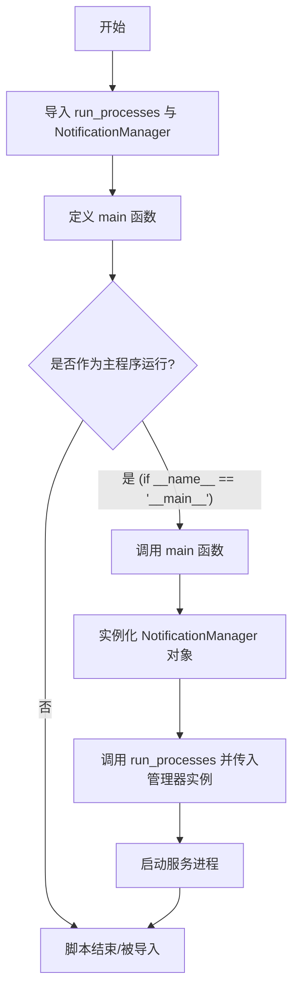
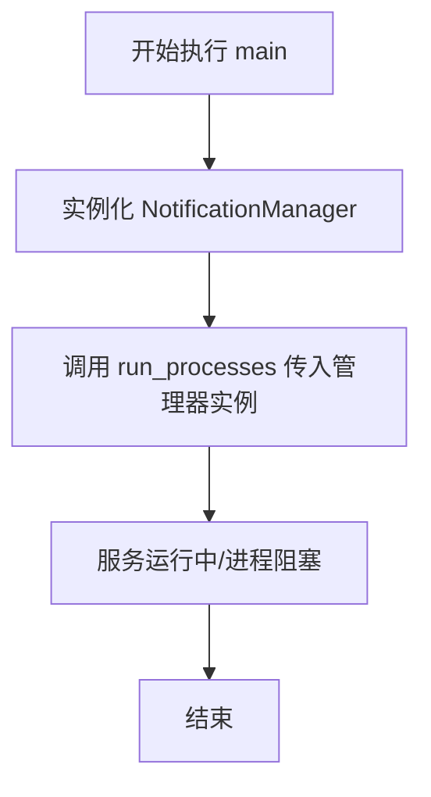

# `AutoGPT\autogpt_platform\backend\backend\notification.py` 详细设计文档

该代码作为 AutoGPT-server 通知服务的入口脚本，主要负责导入必要的依赖模块，通过 main 函数实例化 NotificationManager，并调用 run_processes 函数启动服务的主进程。

## 整体流程



## 类结构

```

```

## 全局变量及字段


    

## 全局函数及方法


### `main`

作为 AutoGPT-server 通知服务的主入口点，负责初始化 NotificationManager 并启动进程运行。

参数：
- 无

返回值：`None`，无返回值。

#### 流程图



#### 带注释源码

```python
def main():
    """
    Run the AutoGPT-server Notification Service.
    """
    # 实例化通知管理器，用于处理通知相关的逻辑
    manager = NotificationManager()
    
    # 调用 run_processes 函数，传入管理器实例以启动服务进程
    run_processes(
        manager,
    )
```


## 关键组件


### NotificationManager

负责通知服务的核心管理类，封装了处理通知的相关逻辑，作为服务实体被注入到运行流程中。

### run_processes

来自 backend.app 的核心运行函数，负责接收服务管理器并启动应用程序的主进程。

### Main Entry Point

应用程序的主入口点，负责实例化 NotificationManager 并通过 run_processes 启动 AutoGPT-server Notification Service。


## 问题及建议


### 已知问题

-   缺乏异常处理机制：`main` 函数未对 `run_processes` 的调用进行 `try-except` 包裹，当服务启动失败或运行时抛出未捕获异常时，进程将直接崩溃，无法进行优雅的错误记录或资源清理。
-   缺乏配置与参数管理：代码硬编码实例化了 `NotificationManager`，无法通过命令行参数或环境变量灵活配置服务行为（如切换组件、设置日志级别等）。
-   缺乏日志初始化：作为服务的入口点，未在初始化阶段配置日志系统，可能导致服务启动早期的关键信息丢失，或依赖子模块的不一致日志配置。

### 优化建议

-   引入类型注解：为 `main` 函数添加返回类型注解（`-> None`），提高代码的可读性并便于静态类型检查工具进行分析。
-   增加命令行参数解析：建议使用 `argparse` 或 `click` 等库解析命令行参数，允许在不修改代码的情况下调整运行参数。
-   完善错误处理与优雅退出：在 `main` 函数中增加全局异常捕获逻辑，并结合信号处理（如 `atexit` 或 `signal`）确保在服务退出时能正确释放资源。
-   初始化全局日志配置：在程序启动之初显式配置日志的级别、格式和输出路径，确保日志行为的标准化和可控性。


## 其它


### 设计目标与约束

该模块作为 AutoGPT-server 通知服务的唯一启动入口。其核心设计目标是解耦服务启动逻辑与业务逻辑的实现细节。主要约束包括：必须在运行 `backend.app.run_processes` 之前成功初始化 `NotificationManager`；脚本的执行环境必须能够正确解析 `backend` 包的依赖路径；该服务被设计为一个长期运行的进程，直到被外部信号终止或发生未捕获的异常。

### 错误处理与异常设计

当前代码段采用了委托式的异常处理策略，没有在 `main` 函数内部显式捕获异常。
1. **初始化阶段**：如果 `NotificationManager()` 实例化失败（例如缺少配置或依赖），异常将直接向上传播，导致程序启动失败并在控制台打印 Traceback。
2. **运行阶段**：`run_processes` 函数负责具体的执行逻辑。如果该函数内部抛出未捕获的异常，它将穿透 `main` 函数，导致 Python 进程退出。
3. **退出状态**：程序依赖 Python 默认机制，正常退出返回状态码 0，异常退出返回状态码 1（非零），这符合标准 Unix 进程管理约定，便于容器编排工具或系统服务管理器（如 systemd）检测服务状态并进行重启。

### 数据流与状态机

**数据流**：
1. 程序启动，控制权进入 `main` 函数。
2. 实例化 `NotificationManager` 对象，此时初始化通知相关的内部状态。
3. `NotificationManager` 实例引用被传递给 `backend.app.run_processes` 函数。
4. `run_processes` 接管控制权，进入主事件循环或进程管理逻辑。

**状态机**：
该入口脚本对应系统的初始化与运行状态流转：
*   **Init (初始化)**: 执行 `main` 函数，导入模块，实例化 `NotificationManager`。
*   **Running (运行中)**: 调用 `run_processes` 后，系统进入稳定运行状态，处理通知任务。
*   **Terminated (终止)**: `run_processes` 返回或抛出异常导致进程结束，系统进入终止状态。

### 外部依赖与接口契约

**外部依赖**：
1. `backend.app`: 必须存在且包含 `run_processes` 函数，该函数通常负责进程生命周期管理。
2. `backend.notifications.notifications`: 必须存在 `NotificationManager` 类，作为核心业务组件。

**接口契约**：
*   `run_processes(manager)`: 接受一个对象作为参数。虽然代码中未显式定义接口类型，但存在隐式契约：传入的对象（此处为 `NotificationManager` 实例）必须具备 `run_processes` 内部逻辑所期望的方法或属性（通常期望该对象是一个实现了特定协议的服务管理器或工作器）。
*   `NotificationManager`: 无参构造函数 `__init__` 必须能够成功执行，不应抛出阻塞性错误。

    