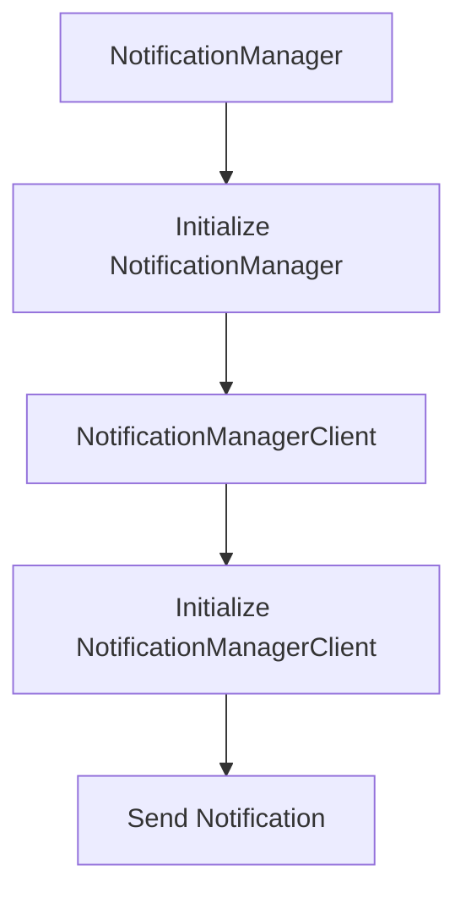

# `.\AutoGPT\autogpt_platform\backend\backend\notifications\__init__.py` 详细设计文档

This code defines two classes, NotificationManager and NotificationManagerClient, which are used for managing and sending notifications.

## 整体流程



## 类结构

```
NotificationManager (类)
├── NotificationManagerClient (类)
```

## 全局变量及字段


### `NotificationManager.NotificationManager`
    
A class responsible for managing notifications.

类型：`class`
    


### `NotificationManagerClient.NotificationManagerClient`
    
A client class for interacting with the NotificationManager.

类型：`class`
    
    

## 全局函数及方法


## 关键组件


### NotificationManager

通知管理器，用于处理和发送通知。

### NotificationManagerClient

通知管理器客户端，用于与通知管理器交互。


## 问题及建议


### 已知问题

-   **代码复用性不足**：代码中直接导入了`NotificationManager`和`NotificationManagerClient`，但没有提供任何封装或抽象，这可能导致在其他模块中重复使用相同的类。
-   **缺乏文档说明**：代码中没有提供任何关于`NotificationManager`和`NotificationManagerClient`的详细说明，这会使得其他开发者难以理解和使用这些类。
-   **全局变量和函数缺失**：代码中没有定义任何全局变量或函数，这可能意味着存在一些逻辑或配置信息没有被适当地封装或管理。

### 优化建议

-   **封装和抽象**：考虑将`NotificationManager`和`NotificationManagerClient`封装在一个模块中，并提供一个统一的接口，以便在其他模块中复用。
-   **添加文档**：为`NotificationManager`和`NotificationManagerClient`添加详细的文档说明，包括类的用途、方法和参数的详细描述。
-   **引入配置管理**：如果存在配置信息，应该考虑使用配置文件或环境变量来管理这些信息，而不是直接在代码中硬编码。
-   **模块化设计**：如果`NotificationManager`和`NotificationManagerClient`有复杂的逻辑，考虑将其拆分为更小的模块，以提高代码的可维护性和可测试性。
-   **错误处理**：在类方法和全局函数中添加适当的错误处理逻辑，确保在出现异常情况时能够优雅地处理错误。
-   **代码风格一致性**：确保代码风格的一致性，使用代码格式化工具来检查和修复代码风格问题。


## 其它


### 设计目标与约束

- 设计目标：确保通知系统的稳定性和高效性，同时提供灵活的接口以支持不同类型的通知。
- 约束条件：遵守Python编程规范，确保代码的可读性和可维护性。

### 错误处理与异常设计

- 异常处理：定义自定义异常类，用于处理特定错误情况，如通知发送失败。
- 错误日志：记录错误信息，便于问题追踪和调试。

### 数据流与状态机

- 数据流：从用户请求到通知发送的过程，包括数据验证、通知生成和发送。
- 状态机：定义通知的状态转换，如“待发送”、“发送中”、“发送成功”、“发送失败”。

### 外部依赖与接口契约

- 外部依赖：依赖`notifications`模块中的`NotificationManager`和`NotificationManagerClient`。
- 接口契约：确保`NotificationManager`和`NotificationManagerClient`接口的一致性和稳定性。

### 安全性与权限控制

- 安全性：确保通知系统的访问权限，防止未授权访问。
- 权限控制：实现用户权限验证，确保只有授权用户可以发送或接收通知。

### 性能优化与监控

- 性能优化：对关键路径进行性能分析，优化代码以提高效率。
- 监控：实现监控系统，实时监控通知系统的性能和状态。

### 可测试性与自动化测试

- 可测试性：编写单元测试和集成测试，确保代码质量。
- 自动化测试：实现自动化测试流程，提高测试效率。

### 文档与代码注释

- 文档：提供详细的设计文档和用户手册。
- 代码注释：编写清晰的代码注释，提高代码可读性。

### 版本控制与代码审查

- 版本控制：使用版本控制系统管理代码变更。
- 代码审查：实施代码审查流程，确保代码质量。

### 部署与维护

- 部署：提供部署指南，确保通知系统可以顺利部署到生产环境。
- 维护：定期进行系统维护，修复潜在问题。


    