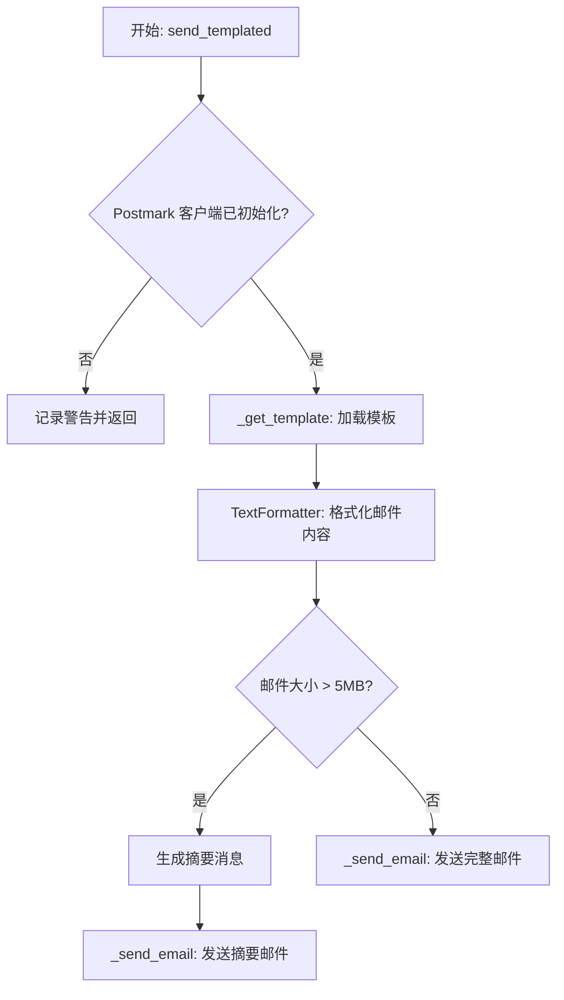
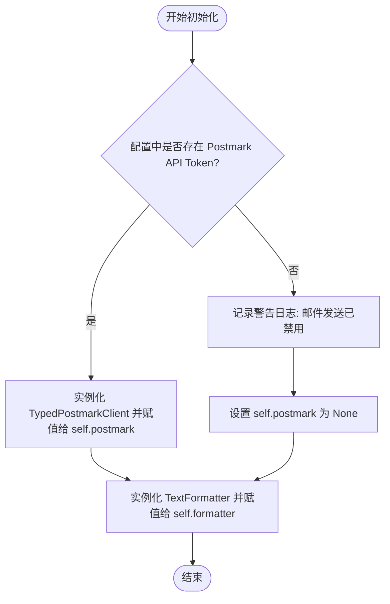
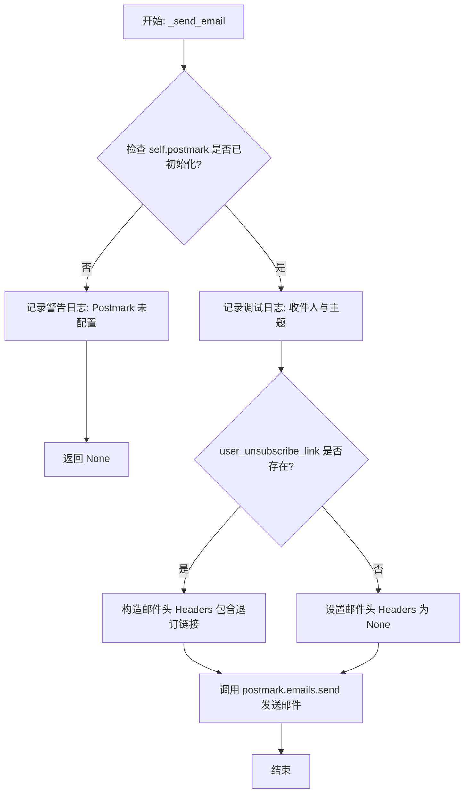

# `.\AutoGPT\autogpt_platform\backend\backend\notifications\email.py` 详细设计文档

该代码实现了一个基于 Postmark 的邮件发送服务，负责加载 Jinja2 模板，格式化通知邮件内容，处理邮件大小限制（自动截断超大内容并发送摘要），并通过 Postmark 客户端向用户发送邮件。

## 整体流程



## 类结构

```
TypedPostmarkClient (继承自 PostmarkClient)
├── emails: EmailManager
Template (继承自 BaseModel)
├── subject_template: str
├── body_template: str
└── base_template: str
EmailSender
├── postmark: TypedPostmarkClient | None
├── formatter: TextFormatter
├── MAX_EMAIL_CHARS: int
├── __init__
├── send_templated
├── _get_template
└── _send_email
```

## 全局变量及字段


### `logger`
    
用于记录模块运行时日志和错误信息的标准日志记录器实例

类型：`logging.Logger`
    


### `settings`
    
用于加载和管理应用程序配置及敏感信息的全局设置实例

类型：`Settings`
    


### `TypedPostmarkClient.emails`
    
Postmark 客户端中专门用于处理邮件发送操作的管理器对象

类型：`EmailManager`
    


### `Template.subject_template`
    
用于渲染电子邮件主题行的模板字符串

类型：`str`
    


### `Template.body_template`
    
用于渲染电子邮件具体正文内容的模板字符串

类型：`str`
    


### `Template.base_template`
    
用于定义电子邮件整体布局和结构的基础模板字符串

类型：`str`
    


### `EmailSender.postmark`
    
用于与 Postmark 邮件服务进行交互的客户端实例，未配置时为 None

类型：`TypedPostmarkClient | None`
    


### `EmailSender.formatter`
    
用于根据模板和数据格式化生成最终邮件文本的工具实例

类型：`TextFormatter`
    


### `EmailSender.MAX_EMAIL_CHARS`
    
定义允许发送的单封邮件最大字符数的常量，用于防止缓冲区溢出或超出限制

类型：`int`
    
    

## 全局函数及方法


### `EmailSender.__init__`

这是 `EmailSender` 类的构造函数，负责初始化邮件发送服务的核心组件。它会检查全局配置中是否存在 Postmark 服务器的 API 令牌，以此决定是否实例化功能完备的邮件客户端，或者将客户端设置为 `None` 以禁用邮件发送功能。同时，它还会初始化一个 `TextFormatter` 实例用于后续的邮件内容格式化。

参数：

- `self`：`EmailSender`，类实例本身（构造函数不接受外部显式参数）。

返回值：`None`，构造函数无返回值。

#### 流程图



#### 带注释源码

```python
def __init__(self):
    # 检查全局配置 settings 中是否配置了 Postmark 的 API Token
    if settings.secrets.postmark_server_api_token:
        # 如果 Token 存在，则使用该 Token 初始化 Postmark 客户端
        # TypedPostmarkClient 是为了解决类型注解问题而封装的子类
        self.postmark = TypedPostmarkClient(
            server_token=settings.secrets.postmark_server_api_token
        )
    else:
        # 如果 Token 不存在，记录警告日志，表明邮件发送功能将被禁用
        logger.warning(
            "Postmark server API token not found, email sending disabled"
        )
        # 将客户端实例设为 None，后续发送操作会据此跳过
        self.postmark = None
    
    # 初始化文本格式化工具，用于处理邮件模板和内容生成
    self.formatter = TextFormatter()
```


### `EmailSender.send_templated`

Send an email to a user using a template pulled from the notification type, or fallback.

参数：

-  `notification`：`NotificationType`，指定用于获取模板和主题的通知类型。
-  `user_email`：`str`，目标收件人的电子邮件地址。
-  `data`：`NotificationEventModel[NotificationDataType_co] | list[NotificationEventModel[NotificationDataType_co]]`，用于填充模板的通知事件数据，可以是单个模型或列表。
-  `user_unsub_link`：`str | None`，可选的用户退订链接，默认为 None。

返回值：`None`，该方法没有返回值。

#### 流程图

```mermaid
flowchart TD
    A[开始] --> B{检查Postmark客户端是否初始化?}
    B -- 否 --> C[记录警告日志并返回]
    B -- 是 --> D[调用_get_template获取邮件模板]
    D --> E[获取基础URL frontend或platform]
    E --> F{检查data是否为列表?}
    F -- 是 --> G[将data包装为 {notifications: data}]
    F -- 否 --> H[直接使用data作为template_data]
    G --> I[调用formatter.format_email格式化邮件]
    H --> I
    I -- 抛出异常 --> J[记录错误日志并重新抛出异常]
    I -- 成功 --> K{检查邮件长度 > MAX_EMAIL_CHARS?}
    K -- 是 (过大) --> L[记录警告日志]
    L --> M[生成简略的summary_message内容]
    M --> N[调用_send_email发送摘要邮件]
    N --> O[返回]
    K -- 否 (正常) --> P[记录调试日志]
    P --> Q[调用_send_email发送完整邮件]
    Q --> O
```

#### 带注释源码

```python
def send_templated(
    self,
    notification: NotificationType,
    user_email: str,
    data: (
        NotificationEventModel[NotificationDataType_co]
        | list[NotificationEventModel[NotificationDataType_co]]
    ),
    user_unsub_link: str | None = None,
):
    """Send an email to a user using a template pulled from the notification type, or fallback"""
    # 检查 Postmark 客户端是否已成功初始化，如果未初始化则无法发送邮件
    if not self.postmark:
        logger.warning("Postmark client not initialized, email not sent")
        return

    # 根据通知类型获取对应的模板内容（包含主题、正文模板和基础模板）
    template = self._get_template(notification)

    # 确定邮件中链接的基础 URL，优先使用前端地址，回退到平台地址
    base_url = (
        settings.config.frontend_base_url or settings.config.platform_base_url
    )

    # 标准化数据格式：如果传入的是列表，则包装在字典中，否则直接使用
    template_data = {"notifications": data} if isinstance(data, list) else data

    try:
        # 使用格式化工具生成邮件的主题和完整 HTML 正文
        subject, full_message = self.formatter.format_email(
            base_template=template.base_template,
            subject_template=template.subject_template,
            content_template=template.body_template,
            data=template_data,
            unsubscribe_link=f"{base_url}/profile/settings",
        )
    except Exception as e:
        # 如果格式化过程中出现错误，记录日志并向上抛出异常
        logger.error(f"Error formatting full message: {e}")
        raise e

    # 检查生成的邮件内容大小
    email_size = len(full_message)
    if email_size > self.MAX_EMAIL_CHARS:
        # 如果邮件超过最大限制（约5MB），记录警告并发送摘要版本
        logger.warning(
            f"Email size ({email_size} chars) exceeds safe limit. "
            "Sending summary email instead."
        )

        # 构建一个轻量级的摘要消息，包含关键信息和查看结果的链接
        summary_message = (
            f"⚠️ Your agent '{getattr(data, 'agent_name', 'Unknown')}' "
            f"generated a very large output ({email_size / 1_000_000:.2f} MB).\n\n"
            f"Execution time: {getattr(data, 'execution_time', 'N/A')}\n"
            f"Credits used: {getattr(data, 'credits_used', 'N/A')}\n"
            f"View full results: {base_url}/executions/{getattr(data, 'id', 'N/A')}"
        )

        # 发送包含摘要的邮件
        self._send_email(
            user_email=user_email,
            subject=f"{subject} (Output Too Large)",
            body=summary_message,
            user_unsubscribe_link=user_unsub_link,
        )
        return  # 跳过发送完整邮件

    # 如果邮件大小正常，记录调试信息并发送完整邮件
    logger.debug(f"Sending email with size: {email_size} characters")
    self._send_email(
        user_email=user_email,
        subject=subject,
        body=full_message,
        user_unsubscribe_link=user_unsub_link,
    )
```


### `EmailSender._get_template`

该方法根据传入的通知类型枚举，将其转换为 `NotificationTypeOverride` 对象以获取模板文件名，随后从文件系统读取对应的特定邮件模板和基础HTML布局模板，最终将这些内容封装成一个 `Template` 对象返回。

参数：

- `notification`：`NotificationType`，指定通知类型的枚举值，用于确定加载哪个具体的邮件模板。

返回值：`Template`，包含邮件主题模板、邮件正文模板和基础HTML模板内容的对象。

#### 流程图

```mermaid
flowchart TD
    A[开始] --> B[接收 notification 参数]
    B --> C[转换为 NotificationTypeOverride 对象]
    C --> D[构建特定模板路径 templates/{name}.jinja2]
    D --> E[读取基础模板文件 templates/base.html.jinja2]
    E --> F[读取特定模板文件]
    F --> G[实例化 Template 对象<br>包含 subject, body, base]
    G --> H[返回 Template 对象]
    H --> I[结束]
```

#### 带注释源码

```python
    def _get_template(self, notification: NotificationType):
        # 将原始的通知类型枚举转换为 NotificationTypeOverride 对象
        # 该对象提供了 .template (文件名) 和 .subject (主题) 等属性
        notification_type_override = NotificationTypeOverride(notification)
        
        # 构建特定通知类型的模板文件路径
        # .template 属性返回文件名，这里补充扩展名和目录
        template_path = f"templates/{notification_type_override.template}.jinja2"
        logger.debug(
            f"Template full path: {pathlib.Path(__file__).parent / template_path}"
        )
        
        # 定义基础模板（通用布局）的路径
        base_template_path = "templates/base.html.jinja2"
        
        # 读取基础模板文件内容
        with open(pathlib.Path(__file__).parent / base_template_path, "r") as file:
            base_template = file.read()
            
        # 读取特定通知类型的模板文件内容
        with open(pathlib.Path(__file__).parent / template_path, "r") as file:
            template = file.read()
            
        # 返回包含所有必要模板数据的 Template 对象
        return Template(
            subject_template=notification_type_override.subject,
            body_template=template,
            base_template=base_template,
        )
```


### `EmailSender._send_email`

通过 Postmark 服务向指定用户发送电子邮件的内部方法。该方法负责验证 Postmark 客户端的初始化状态，记录调试日志，并根据传入的参数构建邮件请求（包括收件人、主题、HTML 正文以及可选的取消订阅头），最终调用外部 API 完成发送。

参数：

- `user_email`：`str`，接收邮件的目标用户邮箱地址。
- `subject`：`str`，邮件的主题标题。
- `body`：`str`，邮件内容的 HTML 格式正文。
- `user_unsubscribe_link`：`str | None`，用于用户取消订阅的可选链接，默认为 None。

返回值：`None`，该方法不返回任何值，仅执行发送操作或日志记录。

#### 流程图



#### 带注释源码

```python
def _send_email(
    self,
    user_email: str,
    subject: str,
    body: str,
    user_unsubscribe_link: str | None = None,
):
    # 检查 Postmark 客户端实例是否存在，若不存在则无法发送邮件
    if not self.postmark:
        # 记录警告日志，提示 Postmark 未配置
        logger.warning("Email tried to send without postmark configured")
        return  # 直接返回，终止后续操作

    # 记录调试日志，输出目标邮箱和邮件主题，便于追踪
    logger.debug(f"Sending email to {user_email} with subject {subject}")

    # 调用 Postmark 客户端的 send 方法发送邮件
    self.postmark.emails.send(
        From=settings.config.postmark_sender_email,  # 发件人地址，从全局配置中读取
        To=user_email,  # 收件人地址
        Subject=subject,  # 邮件主题
        HtmlBody=body,  # 邮件 HTML 正文内容
        Headers=(
            # 如果提供了退订链接，则构建符合 RFC 标准的 List-Unsubscribe 邮件头
            {
                "List-Unsubscribe-Post": "List-Unsubscribe=One-Click",
                "List-Unsubscribe": f"<{user_unsubscribe_link}>",
            }
            if user_unsubscribe_link
            else None  # 若未提供退订链接，则不添加自定义邮件头
        ),
    )
```


## 关键组件


### EmailSender
核心邮件发送服务类，负责通过 Postmark 服务发送基于模板的通知邮件，处理模板渲染、邮件大小限制及取消订阅链接逻辑。

### TypedPostmarkClient
Postmark 客户端的类型安全包装器，继承自 PostmarkClient 以提供类型注解支持，辅助静态类型检查。

### Template
定义邮件内容结构的数据模型，包含邮件主题模板、正文模板和基础布局模板的字段。


## 问题及建议


### 已知问题

-   **TypedPostmarkClient 绕过方案**：代码显式定义了 `TypedPostmarkClient` 类作为类型检查的临时解决方案。注释指出这是一个技术债务，且依赖于外部库（Postmark）未来的更新。
-   **数据汇总逻辑缺陷**：当邮件内容过大触发发送汇总逻辑时，代码直接使用 `getattr(data, ...)` 提取信息。如果输入 `data` 是列表（这是类型注解允许的情况），该逻辑无法正确获取 `agent_name` 或 `execution_time`，导致汇总信息缺失（显示为 Unknown 或 N/A）。
-   **文件读取缺乏异常处理**：`_get_template` 方法使用同步 I/O 读取模板文件，且没有显式捕获 `FileNotFoundError` 或 `IOError`。如果模板文件缺失或路径错误，会导致运行时未处理异常。

### 优化建议

-   **实现模板缓存机制**：当前的实现在每次发送邮件时都会从磁盘读取模板文件，I/O 开销较大。建议在类初始化时或首次访问时加载并缓存模板内容，以提升性能。
-   **引入 Jinja2 Environment**：摒弃手动拼接路径和读取文件的方式，使用 `jinja2.Environment` 管理模板加载器。这能自动处理路径解析、模板继承和安全机制，提高代码的健壮性和可维护性。
-   **改进依赖注入与可测试性**：目前直接在模块或类内部引用全局的 `Settings`，导致单元测试难以 Mock 配置。建议将 `Settings` 或必要的配置项通过 `__init__` 构造函数注入。
-   **优化同步阻塞操作**：文件读取和邮件发送（取决于 Postmark 库的实现）是同步阻塞操作。如果该服务运行在异步框架（如 FastAPI）中，建议将耗时操作移至后台线程池或改用异步库以避免阻塞事件循环。
-   **增强大邮件场景的处理逻辑**：针对 `data` 为列表的情况，改进大邮件的汇总生成逻辑，确保能够聚合展示关键信息，而不是简单地返回 "Unknown"。


## 其它


### 设计目标与约束

**设计目标：**
1. **通知解耦**：将通知发送逻辑与业务逻辑解耦，通过模板化的方式支持多种通知类型。
2. **高可用性与降级**：在外部依赖（如 Postmark API Token）缺失时，服务应自动降级而非崩溃，确保主业务流程不受影响。
3. **内容可扩展性**：利用文件系统加载 Jinja2 模板，允许在不修改代码的情况下调整邮件格式和布局。

**设计约束：**
1. **邮件大小限制**：受限于邮件传输协议和 API 限制，强制规定单个邮件内容不得超过 500 万字符（约 5MB）。超过该限制必须触发降级策略（发送摘要邮件）。
2. **外部服务依赖**：高度依赖 Postmark 服务进行邮件发送，且依赖本地文件系统读取模板文件。
3. **配置驱动**：必须依赖正确的环境配置（`Settings`）才能正常工作，特别是 API Token 和基础 URL 配置。

### 错误处理与异常设计

1. **外部依赖缺失处理**：
   - 在 `__init__` 和 `send_templated` 中，检测 `postmark_server_api_token` 是否存在。
   - **处理策略**：如果 Token 缺失或客户端未初始化，记录 `warning` 级别日志，并直接返回 `None`，静默失败，不抛出异常，防止阻塞调用方。

2. **模板渲染异常处理**：
   - 在 `send_templated` 调用 `formatter.format_email` 时捕获通用异常。
   - **处理策略**：捕获异常后记录 `error` 级别日志，并将异常重新抛出（`raise e`），交由上层业务逻辑处理（通常意味着任务失败需重试或记录死信）。

3. **内容超限处理**：
   - 在计算 `email_size` 后与 `MAX_EMAIL_CHARS` 进行比较。
   - **处理策略**：不抛出异常，而是触发逻辑切换。截取关键元数据（Agent 名称、执行时间、消耗 Credits、查看链接）生成轻量级 `summary_message`，并将邮件标题标记为 "(Output Too Large)" 后发送。

4. **文件 I/O 异常**：
   - `_get_template` 中涉及文件读取操作。
   - **处理策略**：当前代码未显式捕获 `FileNotFoundError` 或 `IOError`。这意味如果模板文件缺失，程序会抛出异常并中断。这属于“快速失败”策略，确保配置错误的即时发现。

### 数据流与状态机

**数据流：**
1. **输入阶段**：接收通知类型枚举、目标用户邮箱、通知数据模型（或列表）及可选的退订链接。
2. **模板加载阶段**：根据通知类型映射到具体的文件路径，从文件系统读取 `base.html.jinja2` 和特定功能的模板文件。
3. **数据标准化阶段**：判断输入数据是单条还是列表，封装为字典格式 `template_data`，准备注入模板。
4. **渲染与计算阶段**：调用 `TextFormatter` 将模板与数据合并，生成 HTML 字符串，并计算字符长度。
5. **决策阶段（分支）**：
   - **分支 A (正常)**：长度 < 5MB，直接构造邮件参数并发送。
   - **分支 B (降级)**：长度 ≥ 5MB，提取数据中的元数据构造摘要文本，替换原有 Body，修改 Subject 后发送。
6. **输出阶段**：调用 Postmark API 完成实际发送。

**状态机：**
本模块主要为无状态服务。`EmailSender` 实例在初始化后处于两种状态之一：
- **Enabled State**：`postmark` 客户端已实例化，可执行发送操作。
- **Disabled State**：`postmark` 客户端为 `None`，所有发送操作立即中止。

### 外部依赖与接口契约

1. **Postmark Email Service (API)**
   - **契约内容**：通过 `postmarker` 库交互。需要有效的 Server Token。
   - **接口依赖**：`postmark.emails.send(From, To, Subject, HtmlBody, Headers)`。
   - **配置要求**：`settings.secrets.postmark_server_api_token`, `settings.config.postmark_sender_email`。

2. **文件系统**
   - **契约内容**：需要读取特定目录下的 Jinja2 模板文件。
   - **路径依赖**：
     - 基础模板：`templates/base.html.jinja2` (相对于当前文件目录)。
     - 业务模板：`templates/{NotificationTypeOverride.template}.jinja2`。

3. **TextFormatter (内部组件)**
   - **契约内容**：负责字符串的格式化与渲染。
   - **接口依赖**：`format_email(base_template, subject_template, content_template, data, unsubscribe_link) -> (subject, body)`。

4. **Settings (配置中心)**
   - **契约内容**：提供应用级别的配置信息。
   - **接口依赖**：`settings.config.frontend_base_url`, `settings.config.platform_base_url`。

### 并发性与线程安全

- **PostmarkClient 线程安全性**：代码中使用了 `postmarker.core.PostmarkClient`。该第三方库的 `EmailManager` 通常是基于 `requests` 的会话封装。在标准的 `requests` 用法中，只要 Session 不被跨线程共享修改，通常是安全的。但在高并发场景下，需要确认 `postmarker` 是否内部实现了连接池复用及锁机制。
- **EmailSender 实例**：类本身是无状态的（除了初始化后的客户端实例）。建议 `EmailSender` 在应用生命周期内作为单例使用（例如依赖注入容器中的单例），以避免重复初始化开销。
- **文件读取**：`_get_template` 方法在每次发送邮件时都会重新读取磁盘文件。这在低频场景下没问题，但在高频场景下会导致大量磁盘 I/O。**优化建议**：应在初始化时或通过缓存机制（如 LRU Cache）加载模板，避免重复 I/O，同时也解决并发读取时的潜在资源竞争。
    