# `.\AutoGPT\autogpt_platform\backend\backend\notifications\notifications.py` 详细设计文档

该代码实现了一个基于 RabbitMQ 的异步通知管理服务，支持即时、批量、汇总和管理员等多种通知策略。它通过消费者监听不同队列，根据用户偏好和数据聚合逻辑生成邮件通知，并提供了手动触发周报汇总和处理现有批次的管理接口。

## 整体流程

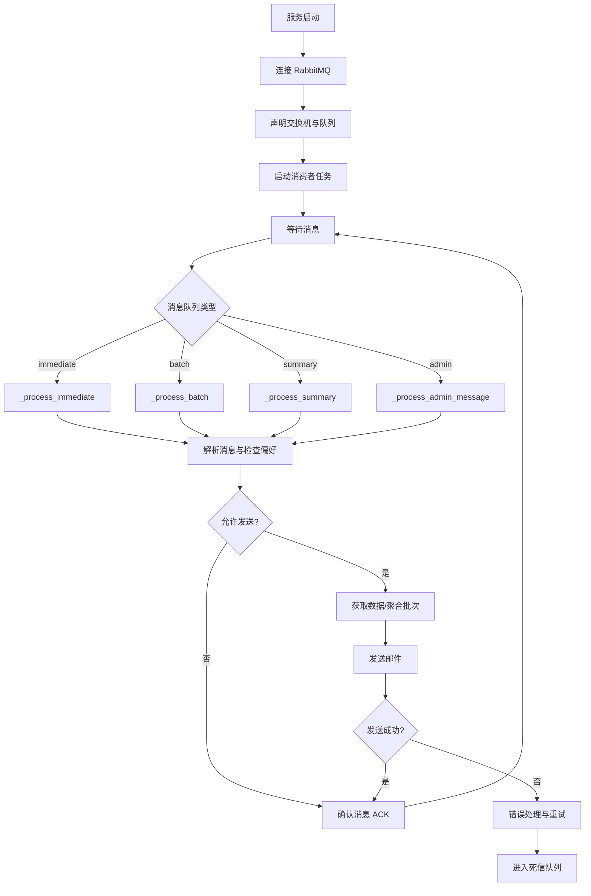

## 类结构

```
AppService
└── NotificationManager
AppServiceClient
└── NotificationManagerClient
```

## 全局变量及字段


### `logger`
    
Logger instance used to record service events and debug information.

类型：`TruncatedLogger`
    


### `settings`
    
Application settings instance providing access to environment-specific configuration.

类型：`Settings`
    


### `NOTIFICATION_EXCHANGE`
    
RabbitMQ exchange definition for routing primary notification messages.

类型：`Exchange`
    


### `DEAD_LETTER_EXCHANGE`
    
RabbitMQ exchange definition for handling failed or dead-lettered messages.

类型：`Exchange`
    


### `EXCHANGES`
    
List containing all RabbitMQ exchanges configured for the notification service.

类型：`list[Exchange]`
    


### `NotificationManager.rabbitmq_config`
    
Configuration object defining the RabbitMQ topology including exchanges and queues.

类型：`RabbitMQConfig`
    


### `NotificationManager.running`
    
Flag indicating whether the service is currently active and processing messages.

类型：`bool`
    


### `NotificationManager.email_sender`
    
Service component responsible for rendering and sending templated emails to users.

类型：`EmailSender`
    
    

## 全局函数及方法


### `create_notification_config`

创建并返回用于通知服务的 RabbitMQ 配置对象，该对象定义了消息交换器、不同优先级的通知队列（即时、管理、摘要、批处理）以及用于处理失败消息的死信队列机制。

参数：

-   无参数

返回值：`RabbitMQConfig`，包含 RabbitMQ 连接所需的交换器定义和队列列表的配置对象。

#### 流程图

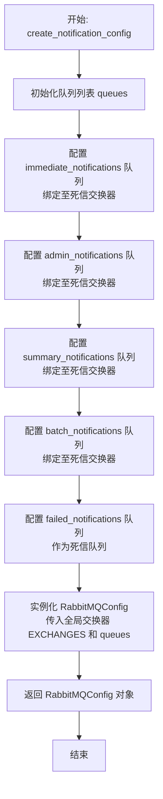

#### 带注释源码

```python
def create_notification_config() -> RabbitMQConfig:
    """Create RabbitMQ configuration for notifications"""

    # 定义服务所需的队列列表
    queues = [
        # 主通知队列：立即通知
        Queue(
            name="immediate_notifications",
            exchange=NOTIFICATION_EXCHANGE,
            routing_key="notification.immediate.#", # 使用通配符路由键匹配立即消息
            arguments={
                "x-dead-letter-exchange": DEAD_LETTER_EXCHANGE.name, # 配置死信交换器
                "x-dead-letter-routing-key": "failed.immediate",    # 失败后的路由键
            },
        ),
        # 主通知队列：管理员通知
        Queue(
            name="admin_notifications",
            exchange=NOTIFICATION_EXCHANGE,
            routing_key="notification.admin.#",
            arguments={
                "x-dead-letter-exchange": DEAD_LETTER_EXCHANGE.name,
                "x-dead-letter-routing-key": "failed.admin",
            },
        ),
        # 摘要通知队列：用于汇总日报或周报
        Queue(
            name="summary_notifications",
            exchange=NOTIFICATION_EXCHANGE,
            routing_key="notification.summary.#",
            arguments={
                "x-dead-letter-exchange": DEAD_LETTER_EXCHANGE.name,
                "x-dead-letter-routing-key": "failed.summary",
            },
        ),
        # 批处理队列：用于非实时、聚合发送的通知
        Queue(
            name="batch_notifications",
            exchange=NOTIFICATION_EXCHANGE,
            routing_key="notification.batch.#",
            arguments={
                "x-dead-letter-exchange": DEAD_LETTER_EXCHANGE.name,
                "x-dead-letter-routing-key": "failed.batch",
            },
        ),
        # 失败通知队列：死信队列，接收所有处理失败的消息
        Queue(
            name="failed_notifications",
            exchange=DEAD_LETTER_EXCHANGE,
            routing_key="failed.#", # 匹配所有失败的路由键
        ),
    ]

    # 构建并返回最终的 RabbitMQ 配置
    return RabbitMQConfig(
        exchanges=EXCHANGES, # 传入预定义的通知交换器和死信交换器
        queues=queues,
    )
```


### `get_routing_key`

根据事件类型获取对应的 RabbitMQ 路由键。

参数：

-   `event_type`：`NotificationType`，通知事件的类型枚举。

返回值：`str`，格式化后的 RabbitMQ 路由键字符串。

#### 流程图

```mermaid
flowchart TD
    Start((开始)) --> GetStrategy[获取队列策略<br/>NotificationTypeOverride<br/>strategy]
    GetStrategy --> CheckStrategy{策略判断?}
    CheckStrategy -->|IMMEDIATE| ReturnImmediate[返回<br/>notification.immediate.{value}]
    CheckStrategy -->|BACKOFF| ReturnBackoff[返回<br/>notification.backoff.{value}]
    CheckStrategy -->|ADMIN| ReturnAdmin[返回<br/>notification.admin.{value}]
    CheckStrategy -->|BATCH| ReturnBatch[返回<br/>notification.batch.{value}]
    CheckStrategy -->|SUMMARY| ReturnSummary[返回<br/>notification.summary.{value}]
    CheckStrategy -->|默认/其他| ReturnDefault[返回<br/>notification.{value}]
    ReturnImmediate --> End((结束))
    ReturnBackoff --> End
    ReturnAdmin --> End
    ReturnBatch --> End
    ReturnSummary --> End
    ReturnDefault --> End
```

#### 带注释源码

```python
def get_routing_key(event_type: NotificationType) -> str:
    # 根据传入的事件类型，通过 NotificationTypeOverride 获取该类型对应的队列处理策略
    strategy = NotificationTypeOverride(event_type).strategy
    """Get the appropriate routing key for an event"""
    
    # 如果策略是立即发送 (IMMEDIATE)，则路由键格式为 notification.immediate.{事件类型值}
    if strategy == QueueType.IMMEDIATE:
        return f"notification.immediate.{event_type.value}"
    
    # 如果策略是退避重试 (BACKOFF)，则路由键格式为 notification.backoff.{事件类型值}
    elif strategy == QueueType.BACKOFF:
        return f"notification.backoff.{event_type.value}"
    
    # 如果策略是管理员通知 (ADMIN)，则路由键格式为 notification.admin.{事件类型值}
    elif strategy == QueueType.ADMIN:
        return f"notification.admin.{event_type.value}"
    
    # 如果策略是批处理 (BATCH)，则路由键格式为 notification.batch.{事件类型值}
    elif strategy == QueueType.BATCH:
        return f"notification.batch.{event_type.value}"
    
    # 如果策略是汇总摘要 (SUMMARY)，则路由键格式为 notification.summary.{事件类型值}
    elif strategy == QueueType.SUMMARY:
        return f"notification.summary.{event_type.value}"
    
    # 如果以上策略都不匹配，默认返回通用格式 notification.{事件类型值}
    return f"notification.{event_type.value}"
```


### `queue_notification`

该函数用于将通知事件发布到 RabbitMQ 消息队列中。它根据事件类型确定适当的路由键，并将事件序列化为 JSON 消息发送到指定的交换机。需要注意的是，该功能在生产环境中被禁用。

参数：

-  `event`：`NotificationEventModel`，包含通知类型、用户ID及负载数据的通知事件对象。

返回值：`NotificationResult`，包含操作状态（成功或失败）以及描述信息的对象，例如使用的路由键或错误详情。

#### 流程图

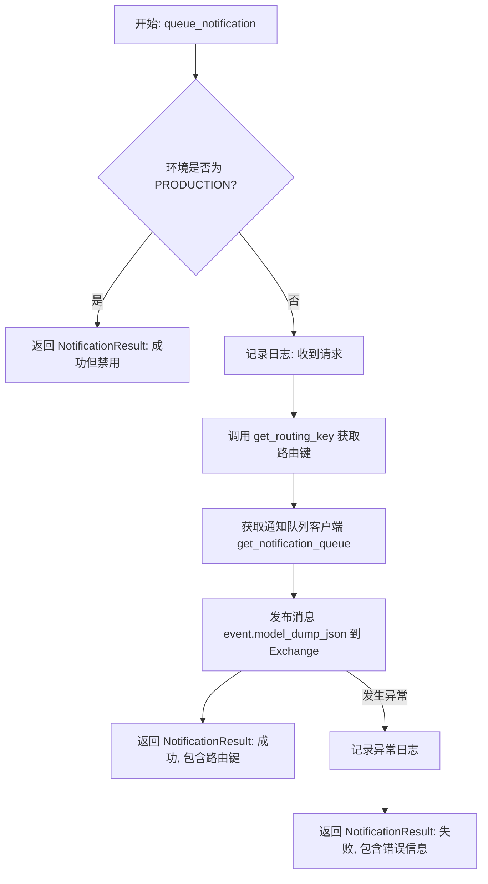

#### 带注释源码

```python
def queue_notification(event: NotificationEventModel) -> NotificationResult:
    """Queue a notification - exposed method for other services to call"""
    # 检查当前环境配置，如果是生产环境，则直接返回成功，实际不执行队列操作
    if settings.config.app_env == AppEnvironment.PRODUCTION:
        return NotificationResult(
            success=True,
            message="Queueing notifications is disabled in production",
        )
    try:
        # 记录调试日志，输出接收到的事件对象
        logger.debug(f"Received Request to queue {event=}")

        # 指定目标交换机名称
        exchange = "notifications"
        # 根据事件类型计算对应的 RabbitMQ 路由键
        routing_key = get_routing_key(event.type)

        from backend.util.clients import get_notification_queue

        # 获取同步的 RabbitMQ 队列客户端实例
        queue = get_notification_queue()
        # 将事件对象序列化为 JSON 并发布到指定的交换机和路由键
        queue.publish_message(
            routing_key=routing_key,
            message=event.model_dump_json(),
            exchange=next(ex for ex in EXCHANGES if ex.name == exchange),
        )

        # 返回成功结果，包含实际使用的路由键信息
        return NotificationResult(
            success=True,
            message=f"Notification queued with routing key: {routing_key}",
        )

    except Exception as e:
        # 捕获并记录处理过程中的异常
        logger.exception(f"Error queueing notification: {e}")
        # 返回失败结果，包含错误信息
        return NotificationResult(success=False, message=str(e))
```


### `queue_notification_async`

用于异步将通知事件排队到 RabbitMQ 的方法，作为供其他服务调用的公开接口。

参数：

-  `event`：`NotificationEventModel`，包含通知类型、用户ID及相关数据的通知事件模型。

返回值：`NotificationResult`，包含操作成功状态（success）及相关描述信息（message）的结果对象。

#### 流程图

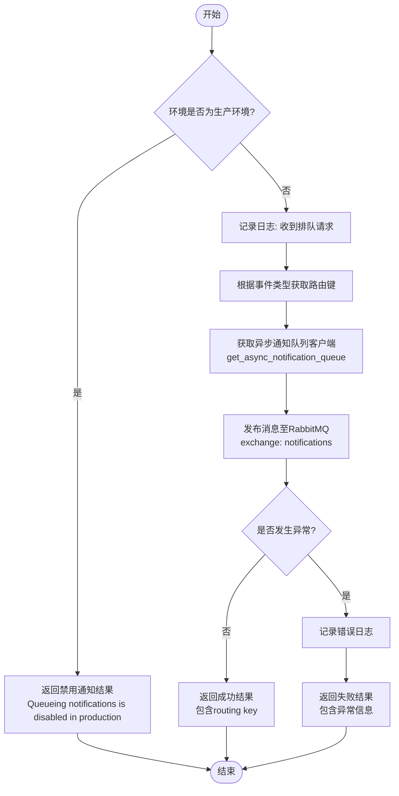

#### 带注释源码

```python
async def queue_notification_async(event: NotificationEventModel) -> NotificationResult:
    """Queue a notification - exposed method for other services to call"""
    # 1. 环境检查：如果是生产环境，则禁用此功能并直接返回成功
    if settings.config.app_env == AppEnvironment.PRODUCTION:
        return NotificationResult(
            success=True,
            message="Queueing notifications is disabled in production",
        )
    try:
        # 2. 记录调试日志，表示收到了排队请求
        logger.debug(f"Received Request to queue {event=}")

        # 3. 指定交换机名称
        exchange = "notifications"
        # 4. 根据通知事件类型获取对应的 RabbitMQ 路由键
        routing_key = get_routing_key(event.type)

        # 5. 动态导入并获取异步通知队列客户端
        from backend.util.clients import get_async_notification_queue

        queue = await get_async_notification_queue()
        # 6. 将事件模型序列化为 JSON 字符串，并发布到指定的交换机和路由键
        await queue.publish_message(
            routing_key=routing_key,
            message=event.model_dump_json(),
            exchange=next(ex for ex in EXCHANGES if ex.name == exchange),
        )

        # 7. 返回成功结果，包含使用的路由键信息
        return NotificationResult(
            success=True,
            message=f"Notification queued with routing key: {routing_key}",
        )

    except Exception as e:
        # 8. 异常处理：捕获所有异常，记录错误日志，并返回失败结果
        logger.exception(f"Error queueing notification: {e}")
        return NotificationResult(success=False, message=str(e))
```


### `NotificationManager.__init__`

初始化 NotificationManager 服务实例，负责设置 RabbitMQ 配置、初始化运行状态标志以及实例化邮件发送器。

参数：

-  `self`：`NotificationManager`，类的实例对象本身。

返回值：`None`，构造函数不返回任何值。

#### 流程图

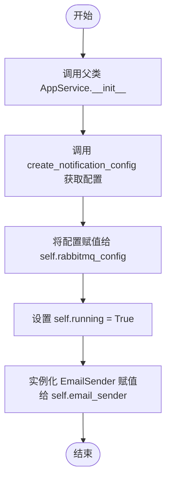

#### 带注释源码

```python
    def __init__(self):
        # 调用父类 AppService 的初始化方法
        super().__init__()
        # 创建通知相关的 RabbitMQ 配置并赋值给实例变量
        self.rabbitmq_config = create_notification_config()
        # 初始化服务运行状态标志为 True
        self.running = True
        # 实例化邮件发送器 EmailSender 并赋值给实例变量
        self.email_sender = EmailSender()
```


### `NotificationManager.rabbit`

访问 RabbitMQ 服务的属性。如果 RabbitMQ 服务未配置，则会引发 `UnhealthyServiceError` 异常。

参数：

*   无

返回值：`rabbitmq.AsyncRabbitMQ`，已初始化并配置的 RabbitMQ 异步服务实例，用于与消息代理交互。

#### 流程图

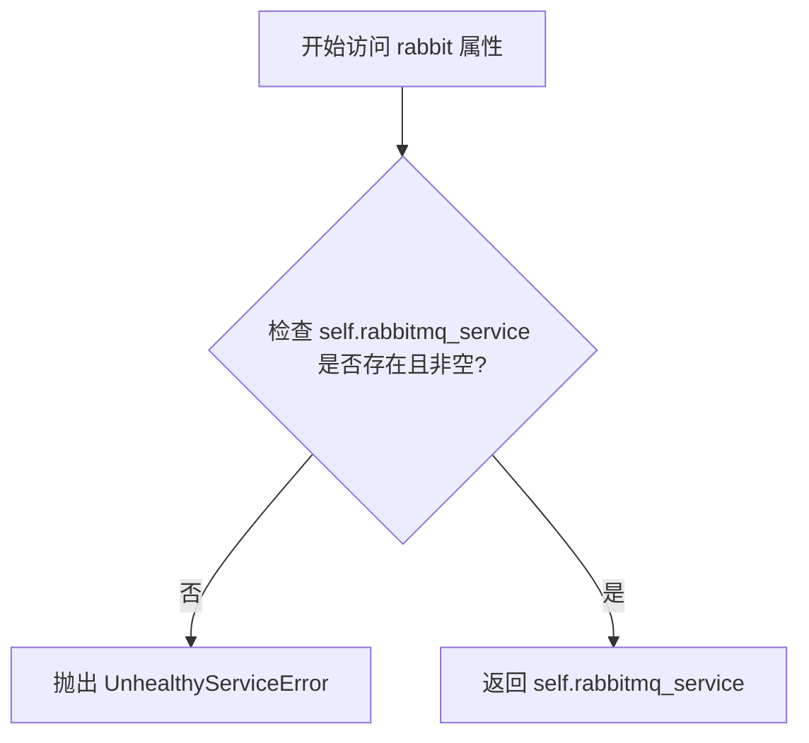

#### 带注释源码

```python
@property
def rabbit(self) -> rabbitmq.AsyncRabbitMQ:
    """Access the RabbitMQ service. Will raise if not configured."""
    # 检查实例变量 rabbitmq_service 是否存在以及是否已初始化（非空）
    if not hasattr(self, "rabbitmq_service") or not self.rabbitmq_service:
        # 如果未配置或未初始化，抛出 UnhealthyServiceError 异常，防止后续调用出错
        raise UnhealthyServiceError("RabbitMQ not configured for this service")
    # 返回内部的 RabbitMQ 服务实例
    return self.rabbitmq_service
```


### `NotificationManager.rabbit_config`

属性访问器，用于获取 RabbitMQ 的配置对象。该属性在访问时会检查服务是否已正确初始化 RabbitMQ 配置，如果没有则抛出异常以确保服务状态健康。

参数：

-   `无`

返回值：`rabbitmq.RabbitMQConfig`，包含交换器（Exchanges）和队列（Queues）定义的 RabbitMQ 配置对象。

#### 流程图

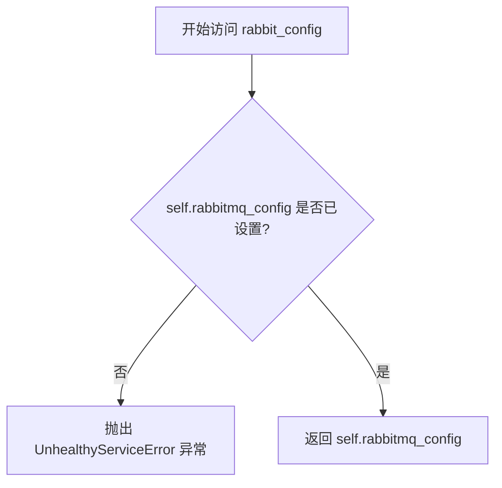

#### 带注释源码

```python
@property
def rabbit_config(self) -> rabbitmq.RabbitMQConfig:
    """Access the RabbitMQ config. Will raise if not configured."""
    # 检查实例变量 self.rabbitmq_config 是否存在且非空
    if not self.rabbitmq_config:
        # 如果配置未初始化，抛出 UnhealthyServiceError，表明服务处于不健康状态
        raise UnhealthyServiceError("RabbitMQ not configured for this service")
    # 如果配置已初始化，返回该配置对象
    return self.rabbitmq_config
```


### `NotificationManager.health_check`

该方法用于检查 `NotificationManager` 服务的健康状态，核心是验证 RabbitMQ 服务是否已正确配置且连接通道准备就绪。如果依赖的 RabbitMQ 服务不可用，将抛出异常标记服务不健康；否则，调用父类的健康检查方法返回状态。

参数：

- `self`：`NotificationManager`，NotificationManager 类的实例。

返回值：`str`，服务健康检查结果字符串（通常来自父类返回的 "OK" 或类似状态）。

#### 流程图

```mermaid
flowchart TD
    A([开始执行 health_check]) --> B{检查 RabbitMQ 服务配置<br/>hasattr(self, rabbitmq_service)<br/>and self.rabbitmq_service?}
    B -- 否 (配置缺失) --> C[抛出 UnhealthyServiceError:<br/>RabbitMQ not configured]
    B -- 是 (配置存在) --> D{检查 RabbitMQ 通道状态<br/>self.rabbitmq_service.is_ready?}
    D -- 否 (未就绪) --> E[抛出 UnhealthyServiceError:<br/>RabbitMQ channel is not ready]
    D -- 是 (已就绪) --> F[调用 super().health_check]
    F --> G([返回父类健康检查结果])
```

#### 带注释源码

```python
    async def health_check(self) -> str:
        # 如果 RabbitMQ 服务未配置，服务被视为不健康
        if not hasattr(self, "rabbitmq_service") or not self.rabbitmq_service:
            raise UnhealthyServiceError("RabbitMQ not configured for this service")
        # 如果 RabbitMQ 通道未准备就绪，服务被视为不健康
        if not self.rabbitmq_service.is_ready:
            raise UnhealthyServiceError("RabbitMQ channel is not ready")
        # 如果以上检查均通过，调用父类的健康检查方法并返回其结果
        return await super().health_check()
```


### `NotificationManager.get_port`

该方法是一个类方法，用于从全局配置中检索当前通知服务所需监听的端口号。

参数：

-  `cls`：`type`，指向 NotificationManager 类本身，作为类方法的隐式参数。

返回值：`int`，配置文件中指定的通知服务端口号。

#### 流程图

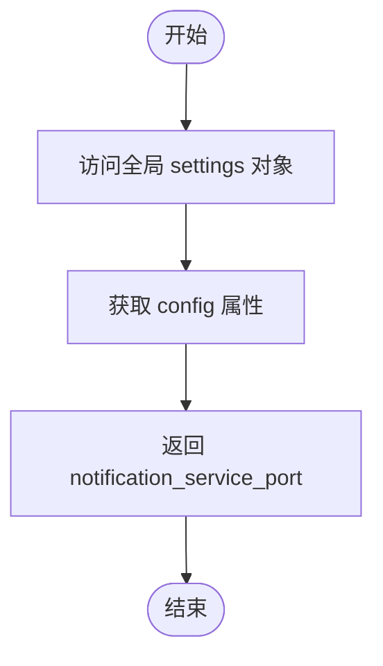

#### 带注释源码

```python
    @classmethod
    def get_port(cls) -> int:
        # 从全局配置 settings 中读取并返回通知服务的端口号
        return settings.config.notification_service_port
```


### `NotificationManager.queue_weekly_summary`

触发异步后台任务，用于处理并排队发送每周摘要通知。

参数：

-   无

返回值：`None`，无返回值。

#### 流程图

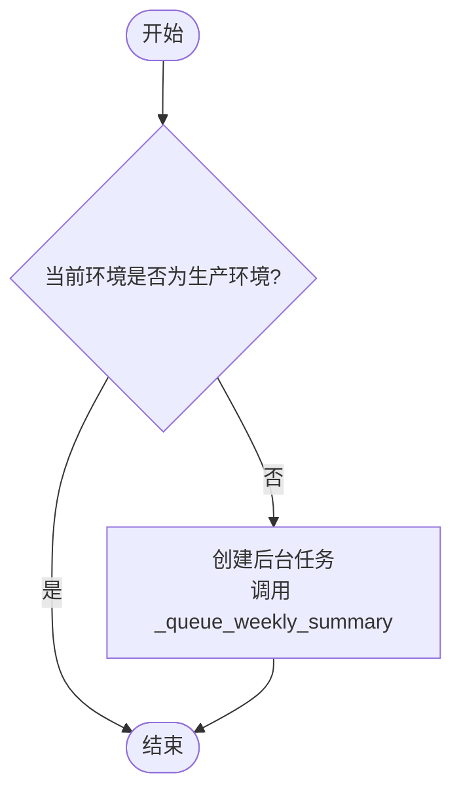

#### 带注释源码

```python
    @expose
    async def queue_weekly_summary(self):
        # 环境检查：如果当前是生产环境，则直接返回，不执行任何操作
        # disable in prod
        if settings.config.app_env == AppEnvironment.PRODUCTION:
            return
        
        # 使用现有的事件循环创建后台任务，而不是阻塞式地运行 asyncio.run()
        # 这样可以立即返回，让 _queue_weekly_summary 在后台异步执行
        # Use the existing event loop instead of creating a new one with asyncio.run()
        asyncio.create_task(self._queue_weekly_summary())
```


### `NotificationManager._queue_weekly_summary`

该方法用于处理每周摘要通知的排队操作。它会查询过去7天内有活动的活跃用户，并为这些用户生成包含时间范围参数的每周摘要事件，随后将其发送到消息队列中以便后续处理。

参数：

- `self`：`NotificationManager`，类的实例引用。

返回值：`None`，该方法不返回任何值，主要副作用是将生成的摘要通知事件发布到消息队列中。

#### 流程图

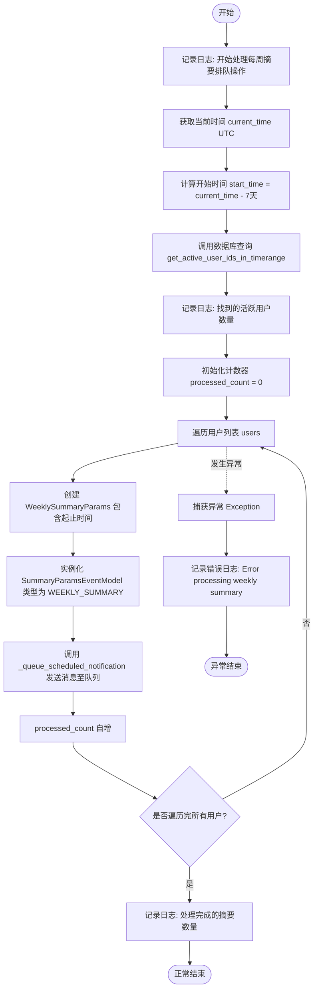

#### 带注释源码

```python
    async def _queue_weekly_summary(self):
        """Process weekly summary for specified notification types"""
        try:
            # 记录开始处理的日志
            logger.info("Processing weekly summary queuing operation")
            processed_count = 0
            
            # 获取当前UTC时间
            current_time = datetime.now(tz=timezone.utc)
            # 计算过去7天的时间点作为起始时间
            start_time = current_time - timedelta(days=7)
            
            logger.info(
                f"Querying for active users between {start_time} and {current_time}"
            )
            
            # 从数据库查询指定时间范围内的活跃用户ID
            users = await get_database_manager_async_client(
                should_retry=False
            ).get_active_user_ids_in_timerange(
                end_time=current_time.isoformat(),
                start_time=start_time.isoformat(),
            )
            
            logger.info(f"Found {len(users)} active users in the last 7 days")
            
            # 遍历所有活跃用户
            for user in users:
                # 为每个用户构建并发送每周摘要通知事件
                await self._queue_scheduled_notification(
                    SummaryParamsEventModel(
                        user_id=user,
                        type=NotificationType.WEEKLY_SUMMARY,
                        data=WeeklySummaryParams(
                            start_date=start_time,
                            end_date=current_time,
                        ),
                    ),
                )
                processed_count += 1

            # 记录处理完成的数量
            logger.info(f"Processed {processed_count} weekly summaries into queue")

        except Exception as e:
            # 捕获并记录处理过程中发生的异常
            logger.exception(f"Error processing weekly summary: {e}")
```


### `NotificationManager.process_existing_batches`

该方法是 `NotificationManager` 类中对外暴露的异步接口，用于触发对现有批次通知的处理。它会首先检查当前的应用环境，如果处于生产环境（PRODUCTION），则直接返回以禁用此功能。若在非生产环境，它会在当前事件循环中创建一个后台任务，调用内部方法 `_process_existing_batches` 来执行具体的批次扫描、过期检查和邮件发送逻辑。该方法设计为“即发即弃”（Fire-and-Forget），不等待处理完成。

参数：

- `notification_types`：`list[NotificationType]`，指定需要处理的通知类型列表，系统将处理这些类型的所有现存批次。

返回值：`None`，该方法仅负责启动后台任务，不返回任务执行结果或状态。

#### 流程图

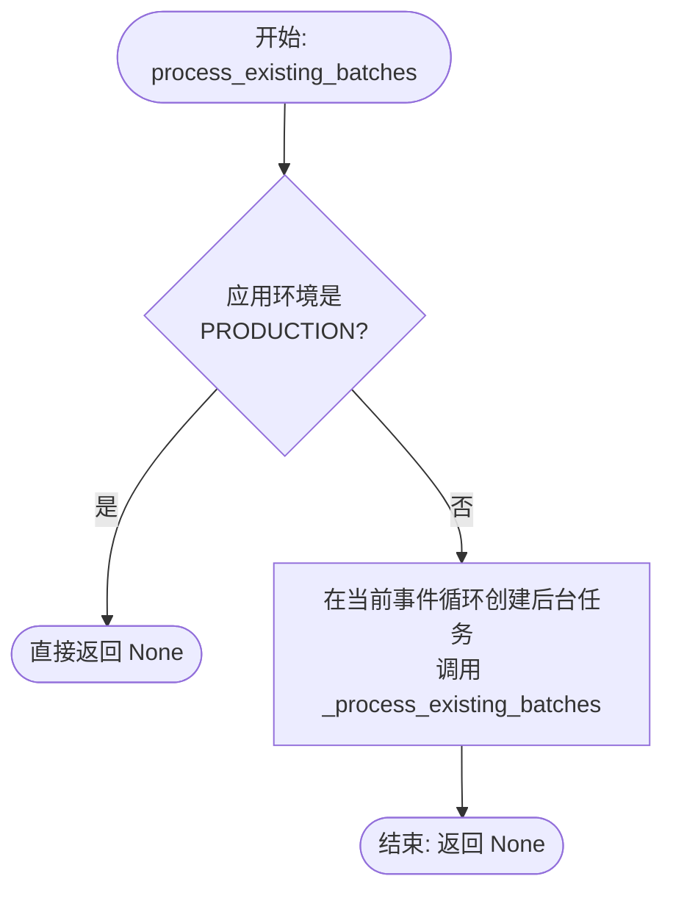

#### 带注释源码

```python
    @expose
    async def process_existing_batches(
        self, notification_types: list[NotificationType]
    ):
        # 环境检查：在生产环境中禁用此功能
        if settings.config.app_env == AppEnvironment.PRODUCTION:
            return
        
        # 使用现有的事件循环而不是创建新进程
        # 创建一个后台任务来异步执行具体的处理逻辑，不阻塞当前请求
        asyncio.create_task(self._process_existing_batches(notification_types))
```


### `NotificationManager._process_existing_batches`

处理指定类型的现有通知批次。该方法检查每个批次中最早的消息是否已超过允许的延迟时间。如果批次已过期，它会验证用户的邮件偏好，检索批量通知数据，发送汇总邮件，并清空数据库中的批次。

参数：

- `notification_types`：`list[NotificationType]`，需要处理的通知类型列表。

返回值：`dict`，包含处理结果的字典，包括成功状态（success）、处理的批次数量（processed_count）、涉及的通知类型列表以及处理时间戳（timestamp）。

#### 流程图

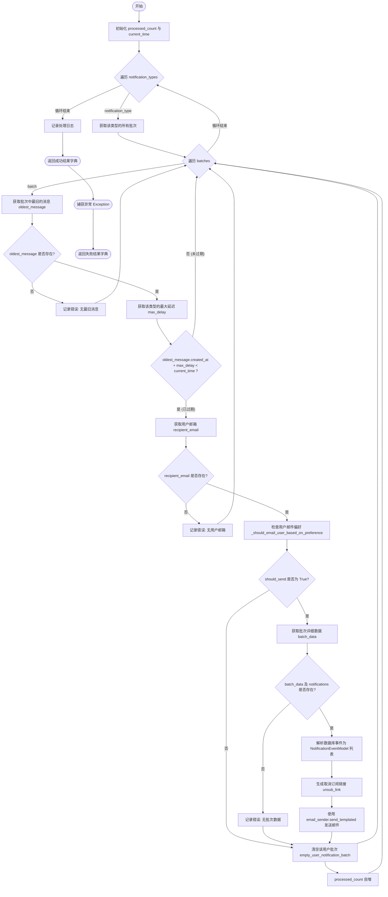

#### 带注释源码

```python
async def _process_existing_batches(
    self, notification_types: list[NotificationType]
):
    """Process existing batches for specified notification types"""
    try:
        processed_count = 0
        current_time = datetime.now(tz=timezone.utc)

        for notification_type in notification_types:
            # 获取指定通知类型的所有批次
            batches = await get_database_manager_async_client(
                should_retry=False
            ).get_all_batches_by_type(notification_type)

            for batch in batches:
                # 获取该批次中最早的消息，用于判断是否超时
                oldest_message = await get_database_manager_async_client(
                    should_retry=False
                ).get_user_notification_oldest_message_in_batch(
                    batch.user_id, notification_type
                )

                if not oldest_message:
                    # 异常情况处理：批次理应有最旧消息
                    logger.error(
                        f"Batch for user {batch.user_id} and type {notification_type} has no oldest message whichshould never happen!!!!!!!!!!!!!!!!"
                    )
                    continue

                max_delay = get_batch_delay(notification_type)

                # 如果最旧消息的时间 + 最大延迟 < 当前时间，说明批次已老化，需要发送
                if oldest_message.created_at + max_delay < current_time:
                    recipient_email = await get_database_manager_async_client(
                        should_retry=False
                    ).get_user_email_by_id(batch.user_id)

                    if not recipient_email:
                        logger.error(
                            f"User email not found for user {batch.user_id}"
                        )
                        continue

                    # 检查用户是否希望接收此类通知
                    should_send = await self._should_email_user_based_on_preference(
                        batch.user_id, notification_type
                    )

                    if not should_send:
                        logger.debug(
                            f"User {batch.user_id} does not want to receive {notification_type} notifications"
                        )
                        # 用户不想接收，清空批次后跳过
                        await get_database_manager_async_client(
                            should_retry=False
                        ).empty_user_notification_batch(
                            batch.user_id, notification_type
                        )
                        continue

                    # 获取批次中的详细数据
                    batch_data = await get_database_manager_async_client(
                        should_retry=False
                    ).get_user_notification_batch(batch.user_id, notification_type)

                    if not batch_data or not batch_data.notifications:
                        logger.error(
                            f"Batch data not found for user {batch.user_id}"
                        )
                        # 数据获取失败，清空批次后跳过
                        await get_database_manager_async_client(
                            should_retry=False
                        ).empty_user_notification_batch(
                            batch.user_id, notification_type
                        )
                        continue

                    # 生成退订链接
                    unsub_link = generate_unsubscribe_link(batch.user_id)
                    events = []
                    # 将数据库中的原始事件转换为模型对象
                    for db_event in batch_data.notifications:
                        try:
                            events.append(
                                NotificationEventModel[
                                    get_notif_data_type(db_event.type)
                                ].model_validate(
                                    {
                                        "user_id": batch.user_id,
                                        "type": db_event.type,
                                        "data": db_event.data,
                                        "created_at": db_event.created_at,
                                    }
                                )
                            )
                        except Exception as e:
                            logger.error(
                                f"Error parsing notification event: {e=}, {db_event=}"
                            )
                            continue
                    logger.info(f"{events=}")

                    # 发送模板邮件
                    self.email_sender.send_templated(
                        notification=notification_type,
                        user_email=recipient_email,
                        data=events,
                        user_unsub_link=unsub_link,
                    )

                    # 发送成功后，清空该批次
                    await get_database_manager_async_client(
                        should_retry=False
                    ).empty_user_notification_batch(
                        batch.user_id, notification_type
                    )

                    processed_count += 1

        logger.info(f"Processed {processed_count} aged batches")
        return {
            "success": True,
            "processed_count": processed_count,
            "notification_types": [nt.value for nt in notification_types],
            "timestamp": current_time.isoformat(),
        }

    except Exception as e:
        logger.exception(f"Error processing batches: {e}")
        return {
            "success": False,
            "error": str(e),
            "notification_types": [nt.value for nt in notification_types],
            "timestamp": datetime.now(tz=timezone.utc).isoformat(),
        }
```


### `NotificationManager.discord_system_alert`

向指定的 Discord 频道发送系统警报消息。

参数：

-  `content`：`str`，警报消息的具体内容。
-  `channel`：`DiscordChannel`，发送的目标 Discord 频道，默认为 `PLATFORM`。

返回值：`None`，无显式返回值。

#### 流程图

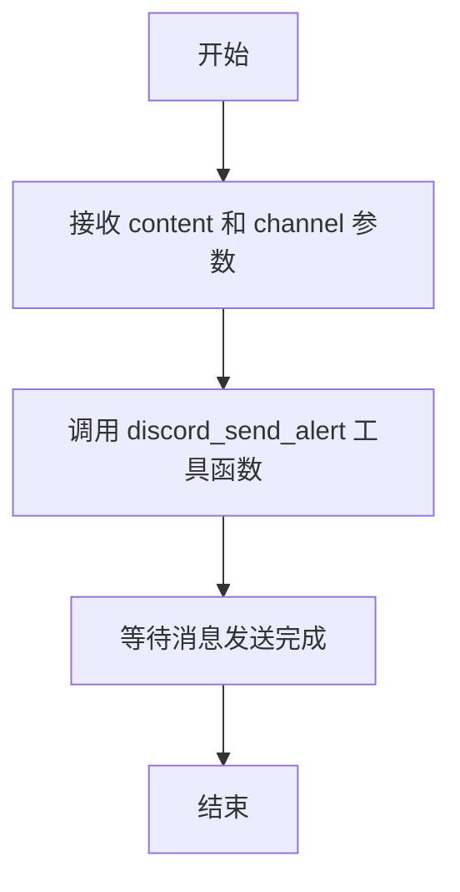

#### 带注释源码

```python
    @expose
    async def discord_system_alert(
        self, content: str, channel: DiscordChannel = DiscordChannel.PLATFORM
    ):
        # 调用底层工具函数，将内容发送到指定的 Discord 频道
        await discord_send_alert(content, channel)
```


### `NotificationManager._queue_scheduled_notification`

该方法用于将计划好的通知（例如每日或每周汇总）通过 RabbitMQ 进行排队分发。它根据传入的事件类型确定路由键，并将事件数据序列化为 JSON 后发布到指定的消息交换机中。

参数：

-  `event`：`SummaryParamsEventModel`，包含计划通知详细信息的对象，包括用户ID、通知类型及特定的时间范围参数。
-  `self`：`NotificationManager`，类的实例引用。

返回值：`None`，该方法不返回任何值，主要执行副作用（发布消息）。

#### 流程图

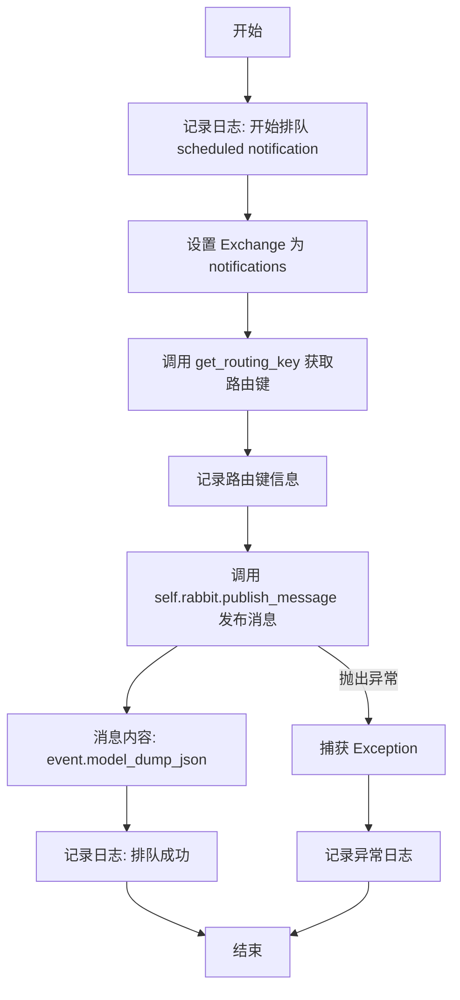

#### 带注释源码

```python
    async def _queue_scheduled_notification(self, event: SummaryParamsEventModel):
        """Queue a scheduled notification - exposed method for other services to call"""
        try:
            # 记录日志，标明正在为哪个用户和类型的通知进行排队操作
            logger.info(
                f"Queueing scheduled notification type={event.type} user_id={event.user_id}"
            )

            # 硬编码目标交换机名称
            exchange = "notifications"
            # 根据事件类型（如 DAILY_SUMMARY, WEEKLY_SUMMARY）获取对应的 RabbitMQ 路由键
            routing_key = get_routing_key(event.type)
            logger.info(f"Using routing key: {routing_key}")

            # Publish to RabbitMQ
            # 使用 self.rabbit 访问 RabbitMQ 服务，将消息发布到指定交换机和路由键
            await self.rabbit.publish_message(
                routing_key=routing_key,
                message=event.model_dump_json(),  # 将 Pydantic 模型转换为 JSON 字符串进行传输
                exchange=next(ex for ex in EXCHANGES if ex.name == exchange),  # 从全局 EXCHANGES 列表中查找对应的 Exchange 对象
            )
            logger.info(f"Successfully queued notification for user {event.user_id}")

        except Exception as e:
            # 捕获所有异常并记录堆栈信息，防止因网络或配置问题导致服务中断
            logger.exception(f"Error queueing notification: {e}")
```


### `NotificationManager._should_email_user_based_on_preference`

该私有方法用于判断系统是否应该向特定用户发送特定类型的通知邮件。它通过查询数据库，综合验证用户的电子邮件验证状态以及用户对该类型通知的具体偏好设置，只有在两者均满足条件时才返回 True。

参数：

-  `user_id`：`str`，需要检查的用户的唯一标识符。
-  `event_type`：`NotificationType`，待发送通知的类型枚举，用于匹配用户的偏好设置。

返回值：`bool`，如果用户邮箱已验证且允许接收该类型通知（默认允许），则返回 True；否则返回 False。

#### 流程图

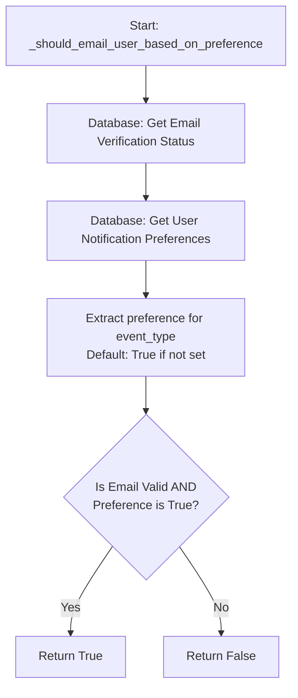

#### 带注释源码

```python
    async def _should_email_user_based_on_preference(
        self, user_id: str, event_type: NotificationType
    ) -> bool:
        """Check if a user wants to receive a notification based on their preferences and email verification status"""
        # 调用数据库客户端获取用户的邮箱验证状态
        validated_email = await get_database_manager_async_client(
            should_retry=False
        ).get_user_email_verification(user_id)
        
        # 获取用户的通知偏好设置，并提取特定 event_type 的偏好
        # 如果未找到特定类型的偏好设置，默认为 True (即允许发送)
        preference = (
            await get_database_manager_async_client(
                should_retry=False
            ).get_user_notification_preference(user_id)
        ).preferences.get(event_type, True)
        
        # 只有当邮箱已验证 (validated_email) 且 偏好设置为允许 (preference) 时，才返回 True
        return validated_email and preference
```


### `NotificationManager._gather_summary_data`

该方法用于从数据库中聚合用户的执行数据，根据通知类型（每日或每周）生成相应的摘要数据模型。如果查询失败，它将返回包含默认值的空数据，以确保系统稳定性。

参数：

- `user_id`：`str`，目标用户的唯一标识符。
- `event_type`：`NotificationType`，通知的类型，用于区分是每日摘要还是每周摘要。
- `params`：`BaseSummaryParams`，生成摘要所需的参数对象，包含时间范围等信息。

返回值：`BaseSummaryData`，返回具体的摘要数据对象（`DailySummaryData` 或 `WeeklySummaryData`），包含信用使用量、执行次数等统计信息。

#### 流程图

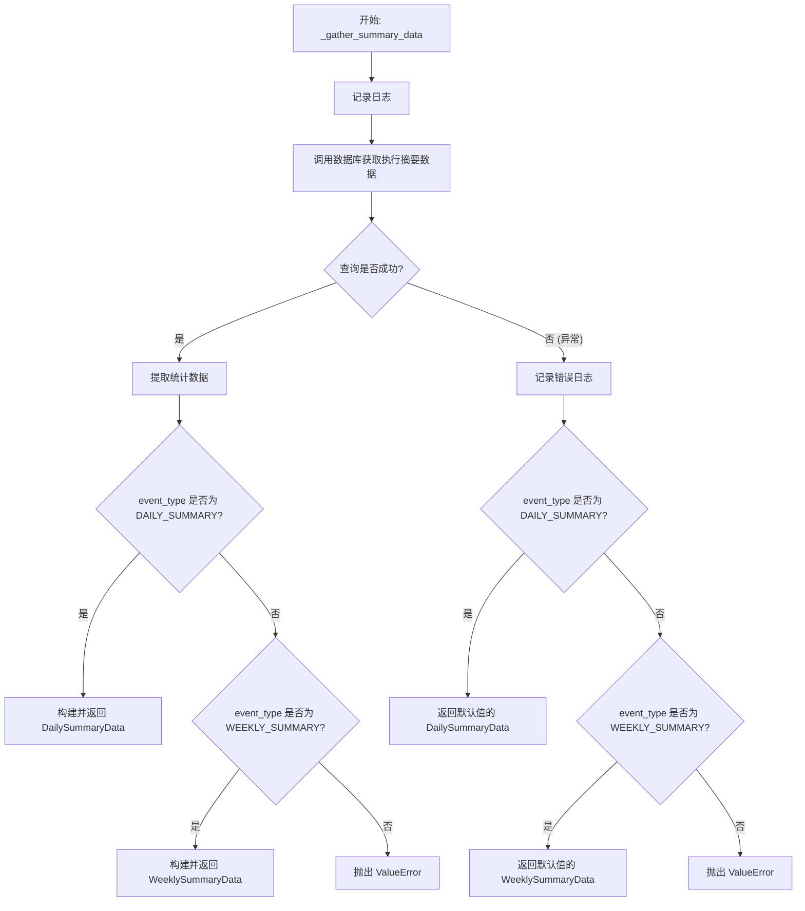

#### 带注释源码

```python
    async def _gather_summary_data(
        self, user_id: str, event_type: NotificationType, params: BaseSummaryParams
    ) -> BaseSummaryData:
        """Gathers the data to build a summary notification"""

        logger.info(
            f"Gathering summary data for {user_id} and {event_type} with {params=}"
        )

        try:
            # 步骤 1: 从数据库获取用户在指定时间范围内的执行摘要数据
            summary_data = await get_database_manager_async_client(
                should_retry=False
            ).get_user_execution_summary_data(
                user_id=user_id,
                start_time=params.start_date,
                end_time=params.end_date,
            )

            # 步骤 2: 解构获取到的统计数据
            total_credits_used = summary_data.total_credits_used
            total_executions = summary_data.total_executions
            most_used_agent = summary_data.most_used_agent
            successful_runs = summary_data.successful_runs
            failed_runs = summary_data.failed_runs
            total_execution_time = summary_data.total_execution_time
            average_execution_time = summary_data.average_execution_time
            cost_breakdown = summary_data.cost_breakdown

            # 步骤 3: 根据事件类型构建相应的数据模型
            if event_type == NotificationType.DAILY_SUMMARY and isinstance(
                params, DailySummaryParams
            ):
                # 返回每日摘要数据
                return DailySummaryData(
                    total_credits_used=total_credits_used,
                    total_executions=total_executions,
                    most_used_agent=most_used_agent,
                    total_execution_time=total_execution_time,
                    successful_runs=successful_runs,
                    failed_runs=failed_runs,
                    average_execution_time=average_execution_time,
                    cost_breakdown=cost_breakdown,
                    date=params.date,
                )
            elif event_type == NotificationType.WEEKLY_SUMMARY and isinstance(
                params, WeeklySummaryParams
            ):
                # 返回每周摘要数据
                return WeeklySummaryData(
                    total_credits_used=total_credits_used,
                    total_executions=total_executions,
                    most_used_agent=most_used_agent,
                    total_execution_time=total_execution_time,
                    successful_runs=successful_runs,
                    failed_runs=failed_runs,
                    average_execution_time=average_execution_time,
                    cost_breakdown=cost_breakdown,
                    start_date=params.start_date,
                    end_date=params.end_date,
                )
            else:
                # 类型不匹配抛出异常
                raise ValueError("Invalid event type or params")

        except Exception as e:
            # 步骤 4: 异常处理，记录错误并返回默认值，防止流程中断
            logger.error(f"Failed to gather summary data: {e}")
            # Return sensible defaults in case of error
            if event_type == NotificationType.DAILY_SUMMARY and isinstance(
                params, DailySummaryParams
            ):
                return DailySummaryData(
                    total_credits_used=0.0,
                    total_executions=0,
                    most_used_agent="No data available",
                    total_execution_time=0.0,
                    successful_runs=0,
                    failed_runs=0,
                    average_execution_time=0.0,
                    cost_breakdown={},
                    date=params.date,
                )
            elif event_type == NotificationType.WEEKLY_SUMMARY and isinstance(
                params, WeeklySummaryParams
            ):
                return WeeklySummaryData(
                    total_credits_used=0.0,
                    total_executions=0,
                    most_used_agent="No data available",
                    total_execution_time=0.0,
                    successful_runs=0,
                    failed_runs=0,
                    average_execution_time=0.0,
                    cost_breakdown={},
                    start_date=params.start_date,
                    end_date=params.end_date,
                )
            else:
                raise ValueError("Invalid event type or params") from e
```


### `NotificationManager._should_batch`

该方法是 `NotificationManager` 类的一个私有异步方法，用于判断特定用户和事件类型的通知批次是否已经达到了设定的最大延迟时间，从而决定是否应该立即发送该批次的通知。该方法会首先将新事件存入数据库批次中，然后检查批次中最旧事件的时间戳是否满足发送条件。

参数：

- `user_id`：`str`，目标用户的唯一标识符。
- `event_type`：`NotificationType`，通知的类型枚举，用于确定批次的延迟策略。
- `event`：`NotificationEventModel`，具体的通知事件数据模型，将被添加到批次中。

返回值：`bool`，如果批次已超时需要发送则返回 `True`，否则返回 `False`。

#### 流程图

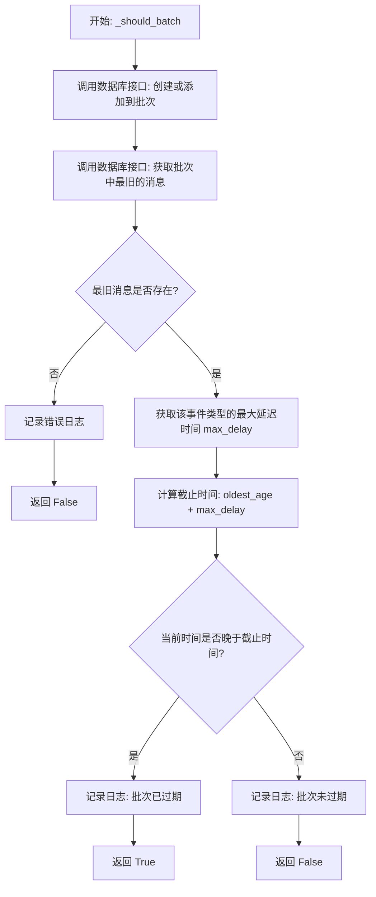

#### 带注释源码

```python
    async def _should_batch(
        self, user_id: str, event_type: NotificationType, event: NotificationEventModel
    ) -> bool:

        # 将新到达的事件添加到数据库中对应的用户/类型批次里
        await get_database_manager_async_client(
            should_retry=False
        ).create_or_add_to_user_notification_batch(user_id, event_type, event)

        # 获取当前批次中最早的一条消息记录，用于判断批次是否“老化”
        oldest_message = await get_database_manager_async_client(
            should_retry=False
        ).get_user_notification_oldest_message_in_batch(user_id, event_type)
        
        # 防御性编程：如果找不到最旧的消息，记录严重错误并返回 False，避免后续逻辑崩溃
        if not oldest_message:
            logger.error(
                f"Batch for user {user_id} and type {event_type} has no oldest message whichshould never happen!!!!!!!!!!!!!!!!"
            )
            return False
        
        # 记录最旧消息的时间戳
        oldest_age = oldest_message.created_at

        # 根据事件类型获取系统配置的最大批次延迟时间
        max_delay = get_batch_delay(event_type)

        # 核心逻辑：如果（最旧消息时间 + 最大延迟）早于当前时间，说明该批次已经等待了足够长的时间，应该被发送
        if oldest_age + max_delay < datetime.now(tz=timezone.utc):
            logger.info(f"Batch for user {user_id} and type {event_type} is old enough")
            return True
        
        # 批次尚未达到发送时间，返回 False 继续等待
        logger.info(
            f"Batch for user {user_id} and type {event_type} is not old enough: {oldest_age + max_delay} < {datetime.now(tz=timezone.utc)} max_delay={max_delay}"
        )
        return False
```


### `NotificationManager._parse_message`

该方法用于将 RabbitMQ 队列中接收到的 JSON 字符串消息反序列化为具体的 `NotificationEventModel` 对象。它首先通过基础模型提取消息中的事件类型，然后根据该类型获取对应的 Pydantic 模型进行二次解析，以支持多态的消息处理。

参数：

-   `message`：`str`，表示从消息队列中获取的原始 JSON 字符串。

返回值：`NotificationEventModel | None`，表示解析成功后返回对应的强类型通知事件模型；如果 JSON 格式错误或 Schema 不匹配，则返回 `None`。

#### 流程图

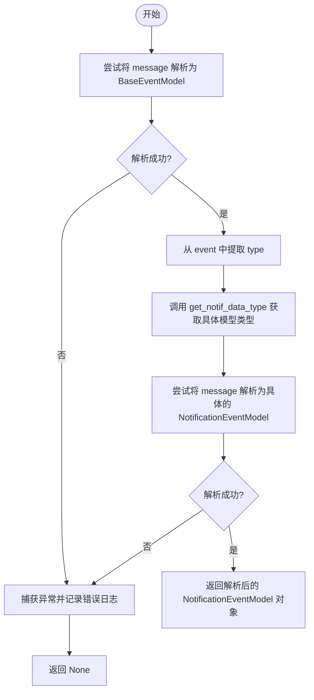

#### 带注释源码

```python
    def _parse_message(self, message: str) -> NotificationEventModel | None:
        try:
            # 第一步：将原始 JSON 字符串解析为 BaseEventModel
            # 这一步主要是为了提取消息中的 'type' 字段，以确定具体的子类类型
            event = BaseEventModel.model_validate_json(message)
            
            # 第二步：根据提取出的 type 获取对应的数据模型，并进行完整的模型验证
            # 这里利用泛型语法 NotificationEventModel[...] 获取具体的 Pydantic 模型
            return NotificationEventModel[
                get_notif_data_type(event.type)
            ].model_validate_json(message)
        except Exception as e:
            # 捕获所有解析过程中的异常（如 JSONDecodeError, ValidationError 等）
            logger.error(f"Error parsing message due to non matching schema {e}")
            # 解析失败返回 None，由调用方决定后续处理（如重试或丢弃）
            return None
```


### `NotificationManager._process_admin_message`

该方法用于处理来自 RabbitMQ 管理员通知队列的单条消息。它负责解析消息内容以生成通知事件模型，并通过邮件发送器将格式化后的通知邮件发送给预设的管理员邮箱。它返回一个布尔值来指示处理是否成功，从而决定是否将消息重新入队或发送到死信队列。

参数：

- `message`：`str`，从消息队列接收到的 JSON 字符串，包含通知事件的详细信息。

返回值：`bool`，如果消息成功解析并发送邮件则返回 `True`；如果解析失败或发送过程中发生异常则返回 `False`（这通常会导致消息被放入失败队列）。

#### 流程图

```mermaid
flowchart TD
    A([开始]) --> B[解析消息: _parse_message]
    B --> C{解析结果是否有效?}
    C -- 否 (None) --> D[返回 False]
    C -- 是 --> E[记录调试日志]
    E --> F[获取管理员收件人邮箱: settings.config.refund_notification_email]
    F --> G[发送模板化邮件: email_sender.send_templated]
    G --> H{发送过程是否抛出异常?}
    H -- 是 --> I[捕获异常并记录错误日志]
    I --> D
    H -- 否 --> J[返回 True]
    D --> K([结束])
    J --> K
```

#### 带注释源码

```python
    async def _process_admin_message(self, message: str) -> bool:
        """Process a single notification, sending to an admin, returning whether to put into the failed queue"""
        try:
            # 尝试解析传入的 JSON 消息字符串为通知事件模型
            event = self._parse_message(message)
            # 如果解析失败（返回 None），则返回 False，表示消息处理失败
            if not event:
                return False
            
            # 记录处理日志
            logger.debug(f"Processing notification for admin: {event}")
            
            # 从配置中获取管理员接收通知的邮箱地址
            recipient_email = settings.config.refund_notification_email
            
            # 使用邮件发送器发送模板化邮件，包含事件类型、收件人和事件数据
            self.email_sender.send_templated(event.type, recipient_email, event)
            
            # 处理成功，返回 True
            return True
        except Exception as e:
            # 捕获处理过程中的任何异常，记录错误日志
            logger.exception(f"Error processing notification for admin queue: {e}")
            # 处理失败，返回 False，消息可能会进入死信队列
            return False
```


### `NotificationManager._process_immediate`

该方法用于处理来自“立即通知”队列的单条消息。它负责解析消息内容，验证用户邮箱地址，检查用户的通知偏好和邮箱验证状态，生成退订链接，并通过邮件发送器发送模板化邮件。该方法返回一个布尔值以指示处理是否成功，从而决定消息是否应被重新入队或发送至死信队列。

参数：

-  `message`：`str`，从 RabbitMQ 队列中获取的 JSON 字符串消息体，包含通知事件的数据。

返回值：`bool`，返回 `True` 表示消息处理成功（包括因用户偏好而选择不发送的情况），消息将被确认（ACK）；返回 `False` 表示处理过程中发生错误（如解析失败、找不到用户邮箱等），消息将被拒绝并可能进入死信队列。

#### 流程图

```mermaid
flowchart TD
    A([开始: _process_immediate]) --> B[解析消息内容 _parse_message]
    B --> C{解析成功?}
    C -- 否 --> D[返回 False]
    C -- 是 --> E[获取用户邮箱 get_user_email_by_id]
    E --> F{找到邮箱?}
    F -- 否 --> G[记录错误: User email not found]
    G --> D
    F -- 是 --> H[检查发送偏好 _should_email_user_based_on_preference]
    H --> I{用户允许发送?}
    I -- 否 --> J[记录调试日志: 用户不想接收]
    J --> K[返回 True]
    I -- 是 --> L[生成退订链接 generate_unsubscribe_link]
    L --> M[发送模板化邮件 send_templated]
    M --> N[返回 True]
    B & E & H & M --> X[捕获异常 Exception]
    X --> Y[记录异常信息]
    Y --> D
    K & N --> Z([结束])
```

#### 带注释源码

```python
    async def _process_immediate(self, message: str) -> bool:
        """Process a single notification immediately, returning whether to put into the failed queue"""
        try:
            # 1. 解析消息体为事件对象
            event = self._parse_message(message)
            if not event:
                return False
            logger.debug(f"Processing immediate notification: {event}")

            # 2. 获取接收者的邮箱地址
            recipient_email = await get_database_manager_async_client(
                should_retry=False
            ).get_user_email_by_id(event.user_id)
            if not recipient_email:
                logger.error(f"User email not found for user {event.user_id}")
                return False

            # 3. 检查用户偏好（邮箱是否验证及是否订阅该类型通知）
            should_send = await self._should_email_user_based_on_preference(
                event.user_id, event.type
            )
            if not should_send:
                logger.debug(
                    f"User {event.user_id} does not want to receive {event.type} notifications"
                )
                # 即使不发送，也视为处理成功（True），避免消息反复进入死信队列
                return True

            # 4. 生成退订链接
            unsub_link = generate_unsubscribe_link(event.user_id)

            # 5. 发送模板化邮件
            self.email_sender.send_templated(
                notification=event.type,
                user_email=recipient_email,
                data=event,
                user_unsub_link=unsub_link,
            )
            return True
        except Exception as e:
            # 捕获所有异常，记录日志并返回 False，以便进行重试或移入死信队列
            logger.exception(f"Error processing notification for immediate queue: {e}")
            return False
```


### `NotificationManager._process_batch`

处理批量通知消息的核心方法。该方法负责解析消息、验证用户偏好、检查批次是否达到发送时间窗口（老化）、获取批量数据、分块处理邮件发送以规避大小限制，并针对邮件服务提供商（如Postmark）的错误进行特殊处理（如禁用无效用户或移除格式错误的数据）。

参数：

-  `message`：`str`，从RabbitMQ队列接收到的JSON格式通知消息字符串。

返回值：`bool`，表示处理是否成功。返回`True`表示消息已成功处理或成功处理（无论发送成功与否，只要确认了消息状态）；返回`False`表示处理失败或批次未准备好（需要重新入队稍后重试）。

#### 流程图

```mermaid
graph TD
    A([开始: _process_batch]) --> B[解析消息 message]
    B --> C{解析成功?}
    C -- 否 --> D[记录错误并返回 False]
    C -- 是 --> E[获取用户邮箱 recipient_email]
    E --> F{邮箱存在?}
    F -- 否 --> G[记录错误并返回 False]
    F -- 是 --> H[检查用户偏好 _should_email_user_based_on_preference]
    H --> I{用户允许接收?}
    I -- 否 --> J[返回 True 成功]
    I -- 是 --> K[检查批次状态 _should_batch]
    K --> L{批次已过期/足够老?}
    L -- 否 --> M[记录日志并返回 False 等待重试]
    L -- 是 --> N[从数据库获取批次数据 batch]
    N --> O{批次数据存在?}
    O -- 否 --> P[记录错误并返回 False]
    O -- 是 --> Q[生成退订链接 unsub_link]
    Q --> R[初始化发送循环 i=0, chunk_size=100]
    R --> S{i < len(batch_messages)?}
    S -- 否 --> T[检查剩余批次数量并记录日志]
    T --> U([返回 True])
    S -- 是 --> V[尝试分块发送 尝试大小: 100, 50, 25...]
    V --> W{发送成功?}
    W -- 是 --> X[从数据库移除已发送的通知ID]
    X --> Y[更新索引 i += len chunk]
    Y --> Z{调整 chunk_size?]
    Z -- 邮件大小 < 70% --> AA[增加 chunk_size]
    Z -- 邮件大小 > 90% --> AB[减小 chunk_size]
    Z --> S
    W -- 否/异常 --> AC{错误类型判断}
    AC -- 单条消息过大 --> AD[从数据库永久移除该条消息]
    AD --> AE[i += 1] --> S
    AC -- HTTP 406 Inactive --> AF[禁用用户邮箱及通知偏好]
    AF --> AG[清空用户所有批次]
    AG --> U
    AC -- HTTP 422 Unprocessable --> AH[从数据库永久移除该条消息]
    AH --> AE
    AC -- 其他错误 --> AI[记录错误索引]
    AI --> AE
```

#### 带注释源码

```python
    async def _process_batch(self, message: str) -> bool:
        """Process a single notification with a batching strategy, returning whether to put into the failed queue"""
        try:
            # 1. 解析消息
            event = self._parse_message(message)
            if not event:
                return False
            logger.info(f"Processing batch notification: {event}")

            # 2. 获取接收者邮箱
            recipient_email = await get_database_manager_async_client(
                should_retry=False
            ).get_user_email_by_id(event.user_id)
            if not recipient_email:
                logger.error(f"User email not found for user {event.user_id}")
                return False

            # 3. 检查用户偏好（是否允许发送该类型邮件）
            should_send = await self._should_email_user_based_on_preference(
                event.user_id, event.type
            )
            if not should_send:
                logger.info(
                    f"User {event.user_id} does not want to receive {event.type} notifications"
                )
                return True

            # 4. 检查批次是否满足发送条件（老化检查），并将当前消息加入数据库批次
            should_send = await self._should_batch(event.user_id, event.type, event)

            if not should_send:
                # 如果未达到发送时间窗口，返回 False 让消息重新入队
                logger.info("Batch not old enough to send")
                return False
            
            # 5. 获取数据库中的所有批次消息
            batch = await get_database_manager_async_client(
                should_retry=False
            ).get_user_notification_batch(event.user_id, event.type)
            if not batch or not batch.notifications:
                logger.error(f"Batch not found for user {event.user_id}")
                return False
            
            # 6. 准备发送元数据（退订链接）
            unsub_link = generate_unsubscribe_link(event.user_id)

            # 7. 构建批次消息列表（包含ID用于后续清理）
            batch_messages = [
                NotificationEventModel[
                    get_notif_data_type(db_event.type)
                ].model_validate(
                    {
                        "id": db_event.id,  # Include ID from database
                        "user_id": event.user_id,
                        "type": db_event.type,
                        "data": db_event.data,
                        "created_at": db_event.created_at,
                    }
                )
                for db_event in batch.notifications
            ]

            # 8. 分块发送逻辑，防止邮件大小超过限制
            MAX_EMAIL_SIZE = 4_500_000  # 4.5MB limit
            chunk_size = 100  # Initial chunk size
            successfully_sent_count = 0
            failed_indices = []

            i = 0
            while i < len(batch_messages):
                # 尝试不同的分块大小发送
                chunk_sent = False
                for attempt_size in [chunk_size, 50, 25, 10, 5, 1]:
                    chunk = batch_messages[i : i + attempt_size]
                    chunk_ids = [
                        msg.id for msg in chunk if msg.id
                    ]  # Extract IDs for removal

                    try:
                        # 预渲染邮件以检测大小
                        template = self.email_sender._get_template(event.type)
                        _, test_message = self.email_sender.formatter.format_email(
                            base_template=template.base_template,
                            subject_template=template.subject_template,
                            content_template=template.body_template,
                            data={"notifications": chunk},
                            unsubscribe_link=f"{self.email_sender.formatter.env.globals.get('base_url', '')}/profile/settings",
                        )

                        if len(test_message) < MAX_EMAIL_SIZE:
                            # 大小合法，发送邮件
                            logger.info(
                                f"Sending email with {len(chunk)} notifications "
                                f"(size: {len(test_message):,} chars)"
                            )

                            self.email_sender.send_templated(
                                notification=event.type,
                                user_email=recipient_email,
                                data=chunk,
                                user_unsub_link=unsub_link,
                            )

                            # 成功后立即从数据库移除已发送的消息，防止重发
                            if chunk_ids:
                                try:
                                    await get_database_manager_async_client(
                                        should_retry=False
                                    ).remove_notifications_from_batch(
                                        event.user_id, event.type, chunk_ids
                                    )
                                    logger.info(
                                        f"Removed {len(chunk_ids)} sent notifications from batch"
                                    )
                                except Exception as e:
                                    logger.error(
                                        f"Failed to remove sent notifications: {e}"
                                    )

                            successfully_sent_count += len(chunk)

                            # 动态调整下一次的分块大小
                            if (
                                attempt_size == chunk_size
                                and len(test_message) < MAX_EMAIL_SIZE * 0.7
                            ):
                                chunk_size = min(chunk_size + 10, 100)
                            elif len(test_message) > MAX_EMAIL_SIZE * 0.9:
                                chunk_size = max(attempt_size - 10, 1)

                            i += len(chunk)
                            chunk_sent = True
                            break
                        else:
                            # 消息过大，继续减小分块尝试
                            if attempt_size == 1:
                                # 即使单条消息也过大，永久丢弃该条消息
                                logger.error(
                                    f"Failed to send notification at index {i}: "
                                    f"Single notification exceeds email size limit "
                                    f"({len(test_message):,} chars > {MAX_EMAIL_SIZE:,} chars). "
                                    f"Removing permanently from batch - will not retry."
                                )
                                if chunk_ids:
                                    try:
                                        await get_database_manager_async_client(
                                            should_retry=False
                                        ).remove_notifications_from_batch(
                                            event.user_id, event.type, chunk_ids
                                        )
                                        logger.info(
                                            f"Removed oversized notification {chunk_ids[0]} from batch permanently"
                                        )
                                    except Exception as e:
                                        logger.error(
                                            f"Failed to remove oversized notification: {e}"
                                        )
                                failed_indices.append(i)
                                i += 1
                                chunk_sent = True
                                break
                            continue
                    except Exception as e:
                        # 处理特定的 API 错误
                        if attempt_size == 1:
                            error_message = str(e).lower()
                            error_type = type(e).__name__

                            # Postmark 406: 用户邮箱无效/不活跃 -> 停用用户所有通知
                            if "406" in error_message or "inactive" in error_message:
                                logger.warning(
                                    f"Failed to send notification at index {i}: "
                                    f"Recipient marked as inactive by Postmark. "
                                    f"Error: {e}. Disabling ALL notifications for this user."
                                )
                                try:
                                    await set_user_email_verification(
                                        event.user_id, False
                                    )
                                except Exception as deactivation_error:
                                    logger.error(f"Failed to deactivate email: {deactivation_error}")

                                try:
                                    await disable_all_user_notifications(event.user_id)
                                except Exception as disable_error:
                                    logger.error(f"Failed to disable notification preferences: {disable_error}")

                                try:
                                    await get_database_manager_async_client(
                                        should_retry=False
                                    ).clear_all_user_notification_batches(event.user_id)
                                except Exception as remove_error:
                                    logger.error(f"Failed to clear batches: {remove_error}")

                                return True # 处理完成，停止该批次处理
                            
                            # Postmark 422: 数据格式错误 -> 丢弃该条数据
                            elif (
                                "422" in error_message
                                or "unprocessable" in error_message
                            ):
                                logger.error(
                                    f"Failed to send notification at index {i}: "
                                    f"Malformed notification data rejected by Postmark. "
                                    f"Error: {e}. Removing from batch permanently."
                                )
                                if chunk_ids:
                                    try:
                                        await get_database_manager_async_client(
                                            should_retry=False
                                        ).remove_notifications_from_batch(
                                            event.user_id, event.type, chunk_ids
                                        )
                                    except Exception as remove_error:
                                        logger.error(f"Failed to remove malformed notification: {remove_error}")
                            # 其他错误
                            else:
                                logger.error(
                                    f"Failed to send notification at index {i}: "
                                    f"Email API error ({error_type}): {e}. "
                                    f"Skipping this notification."
                                )

                            failed_indices.append(i)
                            i += 1
                            chunk_sent = True
                            break
                        continue

                if not chunk_sent:
                    logger.error(f"Failed to send notifications starting at index {i}")
                    failed_indices.append(i)
                    i += 1

            # 9. 检查剩余批次状态
            remaining_batch = await get_database_manager_async_client(
                should_retry=False
            ).get_user_notification_batch(event.user_id, event.type)

            if not remaining_batch or not remaining_batch.notifications:
                logger.info(
                    f"All {successfully_sent_count} notifications sent and removed from batch"
                )
            else:
                remaining_count = len(remaining_batch.notifications)
                logger.warning(
                    f"Sent {successfully_sent_count} notifications. "
                    f"{remaining_count} remain in batch for retry due to errors."
                )
            return True
        except Exception as e:
            logger.exception(f"Error processing notification for batch queue: {e}")
            return False
```


### `NotificationManager._process_summary`

该方法用于处理带有摘要策略的通知消息（如每日或每周汇总）。它负责解析消息、验证用户信息、检查发送偏好、聚合汇总数据，并通过邮件服务发送模板化通知。如果处理失败（如数据缺失或异常），则返回False以便重试或进入死信队列。

参数：

-  `self`：`NotificationManager`，类的实例。
-  `message`：`str`，从队列中接收到的 JSON 字符串格式的通知消息。

返回值：`bool`，返回 `True` 表示消息处理成功（无论是否发送邮件，只要逻辑正常结束即视为成功）；返回 `False` 表示处理过程中发生错误或缺少关键数据（如用户邮箱），需要将消息放回失败队列。

#### 流程图

```mermaid
flowchart TD
    A([开始: 接收 message]) --> B[解析 JSON 至 BaseEventModel]
    B --> C[验证并转换为 SummaryParamsEventModel]
    C --> D[从数据库获取用户邮箱]
    D --> E{邮箱存在?}
    E -- 否 --> F[记录错误日志: 用户邮箱未找到]
    F --> G([返回 False])
    E -- 是 --> H[检查用户邮箱发送偏好]
    H --> I{允许发送?}
    I -- 否 --> J[记录日志: 用户拒收]
    J --> K([返回 True])
    I -- 是 --> L[调用 _gather_summary_data 聚合数据]
    L --> M[生成退订链接]
    M --> N[构建 NotificationEventModel 数据对象]
    N --> O[调用 email_sender.send_templated 发送邮件]
    O --> P([返回 True])

    %% 异常处理流程
    B -.-> Ex[捕获异常 Exception]
    C -.-> Ex
    D -.-> Ex
    H -.-> Ex
    L -.-> Ex
    N -.-> Ex
    O -.-> Ex
    Ex --> LogEx[记录异常日志]
    LogEx --> G
```

#### 带注释源码

```python
    async def _process_summary(self, message: str) -> bool:
        """Process a single notification with a summary strategy, returning whether to put into the failed queue"""
        try:
            # 记录接收到的消息
            logger.info(f"Processing summary notification: {message}")
            
            # 第一步：基础解析，验证消息结构并获取事件类型
            event = BaseEventModel.model_validate_json(message)
            
            # 第二步：根据具体事件类型，转换为具体的参数模型
            model = SummaryParamsEventModel[
                get_summary_params_type(event.type)
            ].model_validate_json(message)

            logger.info(f"Processing summary notification: {model}")

            # 第三步：获取接收者邮箱地址
            recipient_email = await get_database_manager_async_client(
                should_retry=False
            ).get_user_email_by_id(event.user_id)
            
            # 如果找不到邮箱，说明数据有问题，返回 False 以进入失败队列
            if not recipient_email:
                logger.error(f"User email not found for user {event.user_id}")
                return False
            
            # 第四步：检查用户是否希望接收此类通知（基于偏好设置和邮箱验证状态）
            should_send = await self._should_email_user_based_on_preference(
                event.user_id, event.type
            )
            
            # 如果用户不希望接收，视为处理成功（无需发送），返回 True 确认消息
            if not should_send:
                logger.info(
                    f"User {event.user_id} does not want to receive {event.type} notifications"
                )
                return True

            # 第五步：从数据库聚合汇总所需的数据（如执行次数、耗时等）
            summary_data = await self._gather_summary_data(
                event.user_id, event.type, model.data
            )

            # 生成退订链接
            unsub_link = generate_unsubscribe_link(event.user_id)

            # 第六步：构建最终的事件数据模型，包含聚合后的汇总数据
            data = NotificationEventModel(
                user_id=event.user_id,
                type=event.type,
                data=summary_data,
            )

            # 第七步：通过邮件发送器发送模板化邮件
            self.email_sender.send_templated(
                notification=event.type,
                user_email=recipient_email,
                data=data,
                user_unsub_link=unsub_link,
            )
            # 发送成功，返回 True 确认消息
            return True
        except Exception as e:
            # 捕获所有异常，记录堆栈信息，并返回 False 表示处理失败
            logger.exception(f"Error processing notification for summary queue: {e}")
            return False
```


### `NotificationManager._consume_queue`

该方法是一个持续运行的异步消费者，负责从指定的 RabbitMQ 队列中迭代获取消息，调用传入的处理函数对消息体进行处理，并根据处理结果自动确认或拒绝消息（拒绝通常会触发重试或进入死信队列）。

参数：

-   `queue`：`aio_pika.abc.AbstractQueue`，要消费消息的 RabbitMQ 队列实例。
-   `process_func`：`Callable[[str], Awaitable[bool]]`，异步处理函数，接收消息体字符串，返回布尔值。返回 `True` 表示处理成功，`False` 表示处理失败。
-   `queue_name`：`str`，队列名称，主要用于日志记录以便追踪问题。

返回值：`None`，该方法旨在作为后台任务无限期运行，直到被取消或发生未捕获的异常，不直接返回值。

#### 流程图

```mermaid
flowchart TD
    A([开始]) --> B[记录日志: Starting consumer]
    B --> C[尝试: Try块]
    C --> D[获取队列迭代器 queue.iterator]
    D --> E{遍历下一条消息}
    E --> F{服务是否停止运行?}
    F -- 是 --> G[跳出循环]
    F -- 否 --> H[进入消息处理上下文 message.process]
    H --> I[解码消息体 message.body.decode]
    I --> J[调用处理函数 process_func]
    J --> K{处理结果是否为 True?}
    K -- 否 --> L[抛出异常 MessageProcessError]
    K -- 是 --> M[正常结束处理上下文]
    L --> N{捕获 MessageProcessError}
    N --> M
    M --> E
    C --> O{捕获 CancelledError}
    O --> P[记录日志: Consumer cancelled]
    P --> Q([抛出 CancelledError])
    C --> R{捕获其它异常}
    R --> S[记录日志: Fatal error]
    S --> T([抛出异常])
    G --> U([结束])
```

#### 带注释源码

```python
    async def _consume_queue(
        self,
        queue: aio_pika.abc.AbstractQueue,
        process_func: Callable[[str], Awaitable[bool]],
        queue_name: str,
    ):
        """Continuously consume messages from a queue using async iteration"""
        # 记录启动日志，标识是哪个队列开始消费
        logger.info(f"Starting consumer for queue: {queue_name}")

        try:
            # 使用异步迭代器持续从队列获取消息
            async with queue.iterator() as queue_iter:
                async for message in queue_iter:
                    # 检查服务运行状态，如果服务停止则退出循环
                    if not self.running:
                        break

                    try:
                        # 进入消息处理上下文管理器。
                        # 如果代码块内没有抛出异常，消息会被自动确认（ACK）。
                        # 如果抛出异常，消息会被拒绝（NACK/Reject）并重新入队或进入死信队列，取决于队列配置。
                        async with message.process():
                            # 解码消息体并调用传入的处理函数
                            result = await process_func(message.body.decode())
                            
                            # 如果处理函数返回 False，视为处理失败
                            if not result:
                                # 抛出特定异常以触发上下文管理器的拒绝逻辑
                                # Message will be rejected when exiting context without exception
                                raise aio_pika.exceptions.MessageProcessError(
                                    "Processing failed"
                                )
                    except aio_pika.exceptions.MessageProcessError:
                        # 捕获处理失败异常，让上下文管理器处理消息拒绝
                        pass
                    except Exception as e:
                        # 捕获处理过程中的其他意外错误
                        logger.error(f"Error processing message in {queue_name}: {e}")
                        # 重新抛出异常，确保消息被拒绝
                        raise
        except asyncio.CancelledError:
            # 捕获任务取消信号（通常发生在服务关闭时）
            logger.info(f"Consumer for {queue_name} cancelled")
            raise
        except Exception as e:
            # 捕获消费者本身的致命错误（如连接断开）
            logger.exception(f"Fatal error in consumer for {queue_name}: {e}")
            raise
```


### `NotificationManager.run_service`

启动通知管理服务的主入口。该方法负责将异步的初始化及消费任务调度到共享的事件循环中，随后调用父类的服务运行方法以阻塞并维持服务的生命周期。

参数：

- `self`：`NotificationManager`，类的实例引用。

返回值：`None`，无返回值。

#### 流程图

```mermaid
flowchart TD
    Start([开始: run_service]) --> ScheduleTask[调用 asyncio.run_coroutine_threadsafe<br/>将 _run_service 协程调度至 shared_event_loop]
    ScheduleTask --> RunParent[调用 super().run_service<br/>启动主服务循环及阻塞]
    RunParent --> ServiceRunning([服务持续运行直到关闭])
```

#### 带注释源码

```python
    def run_service(self):
        # Queue the main _run_service task
        # 将异步的 _run_service 方法提交到共享的事件循环中运行。
        # 这允许在主服务循环运行之前或期间，在后台启动 RabbitMQ 连接和消费者任务。
        asyncio.run_coroutine_threadsafe(self._run_service(), self.shared_event_loop)

        # Start the main event loop
        # 调用父类的 run_service 方法。
        # 这通常会启动事件循环（如果尚未运行）并保持服务活跃，处理信号和生命周期管理，直到服务停止。
        super().run_service()
```


### `NotificationManager._run_service`

该方法是 `NotificationManager` 服务的核心运行逻辑，负责初始化 RabbitMQ 连接，配置通道质量服务（QoS），并启动针对不同类型通知队列（即时、管理员、批量、摘要）的异步消费者任务。它管理这些消费者的生命周期，确保它们并发运行，并在收到服务关闭信号时执行优雅的取消和清理操作。

参数：

无参数

返回值：`Awaitable[None]`，该方法是一个异步无限循环运行的服务，正常情况下不返回值，仅在服务关闭或发生异常时结束执行。

#### 流程图

```mermaid
flowchart TD
    A([开始]) --> B[记录日志: 配置RabbitMQ]
    B --> C[初始化 AsyncRabbitMQ 服务实例]
    C --> D[建立 RabbitMQ 连接]
    D --> E[获取 Channel 并设置 QoS prefetch_count=10]
    E --> F[获取队列对象<br/>immediate, batch, admin, summary]
    F --> G[创建消费者任务列表<br/>create_task _consume_queue]
    G --> H[并发运行所有消费者任务<br/>asyncio.gather]
    H --> I{收到关闭信号或异常?}
    I -- 否 --> H
    I -- 是/CancelledError --> J[记录日志: 服务关闭请求]
    J --> K[遍历取消所有消费者任务]
    K --> L[等待所有任务完成取消操作<br/>gather return_exceptions=True]
    L --> M[抛出 CancelledError]
```

#### 带注释源码

```python
    @continuous_retry()
    async def _run_service(self):
        # 记录服务开始配置的消息
        logger.info(f"[{self.service_name}] ⏳ Configuring RabbitMQ...")
        # 使用预设配置初始化 RabbitMQ 服务实例
        self.rabbitmq_service = rabbitmq.AsyncRabbitMQ(self.rabbitmq_config)
        # 建立 RabbitMQ 的连接
        await self.rabbitmq_service.connect()

        logger.info(f"[{self.service_name}] Started notification service")

        # 设置队列消费者的 QoS (Quality of Service) 设置
        channel = await self.rabbit.get_channel()

        # 设置预取计数为 10，防止服务一次处理过多消息导致过载
        await channel.set_qos(prefetch_count=10)

        # 从通道中获取各个具体的消息队列对象
        immediate_queue = await channel.get_queue("immediate_notifications")
        batch_queue = await channel.get_queue("batch_notifications")
        admin_queue = await channel.get_queue("admin_notifications")
        summary_queue = await channel.get_queue("summary_notifications")

        # 为每个队列创建异步消费者任务，它们将并行运行
        # 每个任务绑定特定的队列和处理函数（如 _process_immediate）
        consumer_tasks = [
            asyncio.create_task(
                self._consume_queue(
                    queue=immediate_queue,
                    process_func=self._process_immediate,
                    queue_name="immediate_notifications",
                )
            ),
            asyncio.create_task(
                self._consume_queue(
                    queue=admin_queue,
                    process_func=self._process_admin_message,
                    queue_name="admin_notifications",
                )
            ),
            asyncio.create_task(
                self._consume_queue(
                    queue=batch_queue,
                    process_func=self._process_batch,
                    queue_name="batch_notifications",
                )
            ),
            asyncio.create_task(
                self._consume_queue(
                    queue=summary_queue,
                    process_func=self._process_summary,
                    queue_name="summary_notifications",
                )
            ),
        ]

        try:
            # 使用 gather 并发运行所有消费者任务，主线程将在此阻塞
            await asyncio.gather(*consumer_tasks)
        except asyncio.CancelledError:
            # 捕获取消异常，通常发生在服务停止时
            logger.info("Service shutdown requested")
            # 遍历所有正在运行的任务并发送取消信号
            for task in consumer_tasks:
                task.cancel()
            # 等待所有任务完成取消操作，return_exceptions=True 确保不会因个别任务取消失败而中断
            await asyncio.gather(*consumer_tasks, return_exceptions=True)
            # 重新抛出取消异常，以便上层调用者知道服务已停止
            raise
```


### `NotificationManager.cleanup`

清理服务资源，通过设置运行标志位停止消费者循环，同步断开 RabbitMQ 连接，并调用父类的清理方法以完成服务的优雅关闭。

参数：

- (无)

返回值：`None`，无返回值。

#### 流程图

```mermaid
graph TD
    Start([开始]) --> SetFlag[设置 self.running 为 False]
    SetFlag --> Log[记录日志: 正在断开 RabbitMQ 连接]
    Log --> Disconnect[调用 run_and_wait 同步执行 RabbitMQ 断开连接]
    Disconnect --> SuperCleanup[调用父类 AppService 的 cleanup 方法]
    SuperCleanup --> End([结束])
```

#### 带注释源码

```python
def cleanup(self):
    """Cleanup service resources"""
    # 设置运行标志为 False，通知正在运行的消费者循环退出
    self.running = False
    # 记录日志，指示开始断开连接操作
    logger.info("⏳ Disconnecting RabbitMQ...")
    # 同步等待 RabbitMQ 服务断开连接（run_and_wait 是 AppService 提供的辅助方法，用于在同步上下文中运行异步方法）
    self.run_and_wait(self.rabbitmq_service.disconnect())
    # 调用父类 AppService 的 cleanup 方法，执行通用资源清理逻辑
    super().cleanup()
```


### `NotificationManagerClient.get_service_type`

这是一个类方法，用于定义该客户端类所对应的实际服务类类型。它允许客户端框架或应用程序在需要远程调用服务时，知道应该连接到哪个具体的服务实现（即 `NotificationManager`）。

参数：

- `cls`：`type`，类方法的隐式参数，代表 `NotificationManagerClient` 类本身。

返回值：`type[NotificationManager]`，返回 `NotificationManager` 类的引用，表明该客户端的目标服务是 `NotificationManager`。

#### 流程图

```mermaid
graph TD
    A[Start] --> B[Return NotificationManager Class]
    B --> C[End]
```

#### 带注释源码

```python
    @classmethod
    def get_service_type(cls):
        # 返回与此客户端关联的服务类（NotificationManager）
        # 用于服务发现和建立连接
        return NotificationManager
```


### `NotificationManagerClient.process_existing_batches`

触发对指定类型的现有批次通知进行异步处理。该方法会检查当前环境是否允许操作（生产环境下禁用），并在非生产环境下启动后台任务，遍历检查数据库中的批次，根据时间延迟策略发送聚合的电子邮件通知。

参数：

- `notification_types`：`list[NotificationType]`，需要处理的批次通知类型列表。

返回值：`None`，该方法通过 `asyncio.create_task` 异步触发处理任务，不返回处理结果。

#### 流程图

```mermaid
flowchart TD
    A[开始: process_existing_batches] --> B{环境是否为生产环境?}
    B -- 是 --> C[直接返回, 操作禁用]
    B -- 否 --> D[创建异步任务: _process_existing_batches]
    D --> E[任务开始: 遍历 notification_types]
    E --> F[获取指定类型的所有批次]
    F --> G{是否有批次?}
    G -- 否 --> E
    G -- 是 --> H[遍历批次]
    H --> I[获取批次中最早的消息]
    I --> J{最早消息存在?}
    J -- 否 --> K[记录错误, 跳过] --> H
    J -- 是 --> L[计算批次是否过期<br>(最早创建时间 + 最大延迟 < 当前时间)]
    L -- 未过期 --> H
    L -- 已过期 --> M[获取用户邮箱]
    M --> N{用户邮箱存在?}
    N -- 否 --> O[记录错误, 跳过] --> H
    N -- 是 --> P[检查用户邮件偏好设置]
    P -- 拒收 --> Q[清空该批次] --> H
    P -- 接收 --> R[获取批次详细数据]
    R --> S{批次数据存在?}
    S -- 否 --> T[记录错误, 清空批次] --> H
    S -- 是 --> U[生成退订链接]
    U --> V[解析并构建通知事件列表]
    V --> W[调用 EmailSender 发送模板邮件]
    W --> X[清空已发送的批次]
    X --> Y[增加处理计数] --> H
    E --> Z[结束任务]
```

#### 带注释源码

```python
    @expose
    async def process_existing_batches(
        self, notification_types: list[NotificationType]
    ):
        # 检查当前应用环境，若为生产环境则直接返回，禁用此手动触发功能
        if settings.config.app_env == AppEnvironment.PRODUCTION:
            return
        # 使用现有事件循环创建后台任务，避免阻塞主流程
        # 实际处理逻辑在 _process_existing_batches 方法中执行
        asyncio.create_task(self._process_existing_batches(notification_types))

    async def _process_existing_batches(
        self, notification_types: list[NotificationType]
    ):
        """Process existing batches for specified notification types"""
        try:
            processed_count = 0
            current_time = datetime.now(tz=timezone.utc)

            # 遍历传入的每种通知类型
            for notification_type in notification_types:
                # 从数据库获取该类型的所有批次记录
                batches = await get_database_manager_async_client(
                    should_retry=False
                ).get_all_batches_by_type(notification_type)

                for batch in batches:
                    # 获取该批次中最早的一条消息，用于判断是否达到发送时间
                    oldest_message = await get_database_manager_async_client(
                        should_retry=False
                    ).get_user_notification_oldest_message_in_batch(
                        batch.user_id, notification_type
                    )

                    # 异常情况保护：如果批次没有最早消息，记录错误并跳过
                    if not oldest_message:
                        # this should never happen
                        logger.error(
                            f"Batch for user {batch.user_id} and type {notification_type} has no oldest message whichshould never happen!!!!!!!!!!!!!!!!"
                        )
                        continue

                    # 获取该通知类型允许的最大延迟时间
                    max_delay = get_batch_delay(notification_type)

                    # 判断批次是否已过期（最早消息时间 + 延迟 < 当前时间）
                    if oldest_message.created_at + max_delay < current_time:
                        # 获取接收者邮箱
                        recipient_email = await get_database_manager_async_client(
                            should_retry=False
                        ).get_user_email_by_id(batch.user_id)

                        if not recipient_email:
                            logger.error(
                                f"User email not found for user {batch.user_id}"
                            )
                            continue

                        # 检查用户是否愿意接收此类邮件（偏好设置及邮箱验证状态）
                        should_send = await self._should_email_user_based_on_preference(
                            batch.user_id, notification_type
                        )

                        if not should_send:
                            logger.debug(
                                f"User {batch.user_id} does not want to receive {notification_type} notifications"
                            )
                            # 若用户拒收，直接清空该批次，不再尝试发送
                            await get_database_manager_async_client(
                                should_retry=False
                            ).empty_user_notification_batch(
                                batch.user_id, notification_type
                            )
                            continue

                        # 获取批次中的所有通知数据
                        batch_data = await get_database_manager_async_client(
                            should_retry=False
                        ).get_user_notification_batch(batch.user_id, notification_type)

                        if not batch_data or not batch_data.notifications:
                            logger.error(
                                f"Batch data not found for user {batch.user_id}"
                            )
                            # 若数据缺失，清空批次以防死循环
                            await get_database_manager_async_client(
                                should_retry=False
                            ).empty_user_notification_batch(
                                batch.user_id, notification_type
                            )
                            continue

                        # 生成用户的退订链接
                        unsub_link = generate_unsubscribe_link(batch.user_id)
                        events = []
                        # 将数据库中的原始事件数据反序列化为强类型模型
                        for db_event in batch_data.notifications:
                            try:
                                events.append(
                                    NotificationEventModel[
                                        get_notif_data_type(db_event.type)
                                    ].model_validate(
                                        {
                                            "user_id": batch.user_id,
                                            "type": db_event.type,
                                            "data": db_event.data,
                                            "created_at": db_event.created_at,
                                        }
                                    )
                                )
                            except Exception as e:
                                logger.error(
                                    f"Error parsing notification event: {e=}, {db_event=}"
                                )
                                continue
                        logger.info(f"{events=}")

                        # 发送模板邮件，包含所有聚合的事件
                        self.email_sender.send_templated(
                            notification=notification_type,
                            user_email=recipient_email,
                            data=events,
                            user_unsub_link=unsub_link,
                        )

                        # 发送成功后，清空该批次
                        await get_database_manager_async_client(
                            should_retry=False
                        ).empty_user_notification_batch(
                            batch.user_id, notification_type
                        )

                        processed_count += 1

            logger.info(f"Processed {processed_count} aged batches")
            return {
                "success": True,
                "processed_count": processed_count,
                "notification_types": [nt.value for nt in notification_types],
                "timestamp": current_time.isoformat(),
            }

        except Exception as e:
            logger.exception(f"Error processing batches: {e}")
            return {
                "success": False,
                "error": str(e),
                "notification_types": [nt.value for nt in notification_types],
                "timestamp": datetime.now(tz=timezone.utc).isoformat(),
            }
```


### `NotificationManagerClient.queue_weekly_summary`

该方法是 `NotificationManagerClient` 类的一个公开接口，用于触发服务端将周报通知加入消息队列的操作。它会调用远程服务，查找过去 7 天内的活跃用户，并为每个用户生成包含时间范围参数的周报通知事件，将其发送至 RabbitMQ 的 `summary_notifications` 队列中等待后续处理。

参数：

-   无

返回值：`None`，无返回值。

#### 流程图

```mermaid
flowchart TD
    A[开始: 调用 queue_weekly_summary] --> B{检查运行环境};
    B -- 是生产环境 (PRODUCTION) --> C[直接返回, 不执行];
    B -- 非生产环境 --> D[创建后台任务 _queue_weekly_summary];
    D --> E[计算时间范围: 当前时间 - 7天];
    E --> F[查询数据库获取活跃用户列表];
    F --> G[遍历每个活跃用户];
    G --> H[构建 WeeklySummaryParams 对象];
    H --> I[创建 SummaryParamsEventModel 事件];
    I --> J[调用 _queue_scheduled_notification];
    J --> K[发送消息到 RabbitMQ summary_notifications 队列];
    K --> G;
    G -- 遍历结束 --> L[记录处理日志];
    L --> M[结束];
```

#### 带注释源码

```python
    # NotificationManagerClient 类中的定义
    # 使用 endpoint_to_sync 装饰器将异步服务方法转换为同步客户端调用
    queue_weekly_summary = endpoint_to_sync(NotificationManager.queue_weekly_summary)

    # ---------------------------------------------------------
    # 以下是 NotificationManager 类中实际执行的逻辑实现
    # ---------------------------------------------------------

    @expose
    async def queue_weekly_summary(self):
        # 禁用在生产环境运行
        if settings.config.app_env == AppEnvironment.PRODUCTION:
            return
        # 使用现有事件循环创建后台任务，而不是使用 asyncio.run() 阻塞
        asyncio.create_task(self._queue_weekly_summary())

    async def _queue_weekly_summary(self):
        """Process weekly summary for specified notification types"""
        try:
            logger.info("Processing weekly summary queuing operation")
            processed_count = 0
            # 获取当前 UTC 时间
            current_time = datetime.now(tz=timezone.utc)
            # 计算 7 天前的时间
            start_time = current_time - timedelta(days=7)
            logger.info(
                f"Querying for active users between {start_time} and {current_time}"
            )
            # 从数据库获取时间范围内的活跃用户 ID
            users = await get_database_manager_async_client(
                should_retry=False
            ).get_active_user_ids_in_timerange(
                end_time=current_time.isoformat(),
                start_time=start_time.isoformat(),
            )
            logger.info(f"Found {len(users)} active users in the last 7 days")
            
            # 遍历所有活跃用户，为其生成周报通知任务
            for user in users:
                await self._queue_scheduled_notification(
                    SummaryParamsEventModel(
                        user_id=user,
                        type=NotificationType.WEEKLY_SUMMARY,
                        data=WeeklySummaryParams(
                            start_date=start_time,
                            end_date=current_time,
                        ),
                    ),
                )
                processed_count += 1

            logger.info(f"Processed {processed_count} weekly summaries into queue")

        except Exception as e:
            logger.exception(f"Error processing weekly summary: {e}")
```


### `NotificationManagerClient.discord_system_alert`

这是一个同步客户端方法，用于向指定的 Discord 频道发送系统警报。它通过服务间通信机制委托给 `NotificationManager` 服务执行实际的异步发送操作。

参数：

-  `content`：`str`，要发送到 Discord 的警报消息内容。
-  `channel`：`DiscordChannel`，目标 Discord 频道，默认为 `DiscordChannel.PLATFORM`。

返回值：`None`，该方法没有返回值。

#### 流程图

```mermaid
flowchart TD
    Start[调用 discord_system_alert] --> Client[NotificationManagerClient<br/>endpoint_to_sync 包装器]
    Client -->|同步调用| Service[NotificationManager<br/>discord_system_alert 异步方法]
    Service -->|await| Util[backend.util.metrics<br/>discord_send_alert]
    Util -->|HTTP/Webhook| Discord[Discord 服务端]
```

#### 带注释源码

```python
# 定义在 NotificationManagerClient 类中
# 这一行代码将 NotificationManager 的异步方法 discord_system_alert 
# 转换为同步方法，供外部服务或客户端直接调用。
# endpoint_to_sync 通常处理底层的 RPC 通信或异步转同步的适配。
discord_system_alert = endpoint_to_sync(NotificationManager.discord_system_alert)

# -----------------------------------------------------------
# 以下是 NotificationManager 类中被包装的实际实现代码

@expose
async def discord_system_alert(
    self, content: str, channel: DiscordChannel = DiscordChannel.PLATFORM
):
    """
    向 Discord 发送系统警报
    
    参数:
        content: 警报文本内容
        channel: 发送的目标频道枚举
    """
    # 调用工具函数执行具体的发送逻辑
    await discord_send_alert(content, channel)
```


## 关键组件


### RabbitMQ Configuration and Routing Strategy

Manages RabbitMQ connections, exchanges (topic type), queue declarations (immediate, batch, summary, admin, and dead-letter queues), and determines the appropriate routing key based on notification type.

### Notification Batch Processing and Chunking

Implements the logic to accumulate notifications over time, checks if the batch has aged out for sending, and dynamically splits large batches into smaller chunks to respect email provider size limits.

### Email Delivery and Error Recovery

Handles email transmission via the EmailSender service, with specific robust error handling for API responses (e.g., disabling notifications for inactive recipients, removing malformed data) to prevent infinite retry loops.

### User Preference and Verification Filtering

Queries the database to filter outgoing messages, ensuring that the recipient's email is verified and that they have opted in for the specific notification type before delivery.

### Summary Data Aggregation

Gathers user activity metrics (such as credits used, execution counts, and top agents) from the database within specified time ranges to construct daily or weekly summary notifications.


## 问题及建议


### 已知问题

-   **脆弱的异常处理与厂商耦合**：代码在 `_process_batch` 方法中通过字符串匹配（如检查 "406"、"inactive"、"422"）来识别 Postmark 邮件服务的特定错误。这种做法与特定供应商强耦合，一旦供应商更改错误消息格式或更换邮件服务提供商，该逻辑将失效，导致错误处理不可靠。
-   **潜在的同步阻塞风险**：`self.email_sender.send_templated` 调用在异步消费者循环 `asyncio.gather(*consumer_tasks)` 中运行。如果该方法内部执行同步的 HTTP 请求或 SMTP 通信，将阻塞事件循环，严重影响 RabbitMQ 消息的消费吞吐量。
-   **低效的邮件大小检查与分块逻辑**：`_process_batch` 中采用了“试错法”处理邮件大小限制（先尝试渲染 100 条，太大则尝试 50，依此类推）。这种方法涉及重复的模板渲染和字符串长度计算，计算开销大且逻辑复杂，增加了单条消息的处理延迟。
-   **内存占用过高风险**：在处理批处理消息时，代码通过 `batch_messages = [...]` 将数据库中获取的所有批次消息一次性加载到内存中进行分块计算。如果单批次积压的消息量巨大，可能导致服务内存溢出（OOM）。
-   **违反单一职责原则（SRP）**：`NotificationManager` 类不仅负责消息队列的消费和路由，还包含了复杂的业务逻辑（如用户禁用、分块策略、错误重试、邮件大小适配），导致类过于庞大，难以维护和测试。

### 优化建议

-   **封装邮件发送策略与适配器模式**：将邮件大小限制检查、分块逻辑以及特定厂商的错误码解析逻辑（如处理 406 Inactive Recipient）下沉到 `EmailSender` 或独立的 `EmailStrategy` 类中。`NotificationManager` 应只关注业务流程，不应处理邮件发送的技术细节。
-   **引入线程池或全异步邮件客户端**：确保 `EmailSender` 的操作是非阻塞的。如果底层库是同步的，应使用 `asyncio.to_thread()` 或 `loop.run_in_executor()` 将邮件发送任务卸载到线程池中，防止阻塞主事件循环。
-   **优化数据库批量操作**：在 `_process_batch` 中，不应每发送一个 chunk 就调用一次 `remove_notifications_from_batch`。建议收集所有成功发送的 ID，在方法结束时执行一次批量删除操作（Batch Delete），以减少数据库 I/O 次数。
-   **外置配置化常量**：将硬编码的魔法数字（如 `MAX_EMAIL_SIZE = 4_500_000`、`prefetch_count = 10`、初始 `chunk_size = 100`）移动到配置文件（`Settings`）中，以便在不同环境或遇到性能瓶颈时能动态调整，无需修改代码重新部署。
-   **建立标准化的错误异常体系**：定义一套业务异常类（如 `InactiveRecipientError`, `PayloadTooLargeError`, `EmailProviderError`），替换现有的基于字符串的错误判断逻辑，提高代码的可读性和健壮性。


## 其它


### 设计目标与约束

**设计目标：**
1.  **高可靠性与解耦：** 利用 RabbitMQ 作为消息代理，实现通知生成与消费的解耦，确保通知发送不阻塞主业务流程。
2.  **灵活的投递策略：** 支持多种通知队列策略（Immediate/即时、Admin/管理员、Summary/摘要、Batch/批量），满足不同业务场景对时效性和聚合的需求。
3.  **可恢复性与容错：** 通过死信队列（DLX）机制处理消费失败的消息，结合指数退避或重试逻辑，最大化通知投递成功率。

**约束：**
1.  **环境限制：** 手动触发队列任务（如 `queue_weekly_summary`、`process_existing_batches`）在生产环境（`PRODUCTION`）中被禁用。
2.  **邮件大小限制：** 遵循邮件服务商（如 Postmark）的 5MB 附件大小限制。系统内部设置了 4.5MB 的阈值，并强制对批次进行分块处理。
3.  **资源消耗控制：** 设置 RabbitMQ QoS 预取计数为 10，防止消费者过载；同时限制批次处理时的单批次数量（动态调整 1-100）以平衡内存和 API 调用开销。

### 错误处理与异常设计

**全局异常策略：**
1.  **死信队列（DLX）：** 所有队列配置了 `x-dead-letter-exchange`，处理失败的消息会被路由至 `dead_letter` 交换机及其绑定的 `failed_notifications` 队列，以便后续人工干预或重试。
2.  **服务级重试：** `_run_service` 方法使用了 `@continuous_retry` 装饰器，确保服务在 RabbitMQ 连接断开等非致命错误下能够自动重启和重连。

**特定错误处理：**
1.  **用户非活跃：**
    *   **触发条件：** 邮件 API 返回 HTTP 406 状态码或包含 "Inactive" 关键字。
    *   **处理逻辑：** 系统自动将用户邮箱标记为未验证（`set_user_email_verification`），禁用该用户的所有通知偏好（`disable_all_user_notifications`），并清空其待发送批次，防止继续向无效邮箱投递。
2.  **数据格式错误：**
    *   **触发条件：** 邮件 API 返回 HTTP 422 状态码。
    *   **处理逻辑：** 视为永久性错误，直接从数据库批次中移除该条通知，不再重试。
3.  **消息过大：**
    *   **触发条件：** 渲染后的邮件长度超过 `MAX_EMAIL_SIZE` (4.5MB)。
    *   **处理逻辑：** 动态减小批次分块大小；若单条消息仍超限，则永久移除该条通知并记录错误。
4.  **数据库异常：** 数据库操作（如查询用户信息、更新批次）默认不重试（`should_retry=False`），如果失败则记录日志并根据上下文决定是否 ACK 消息（通常返回 False 触发 DLX）。

### 数据流与状态机

**数据流：**
1.  **入站：** 外部服务调用 `queue_notification` 或内部定时任务触发 -> RabbitMQ Exchange (`notifications`) -> 根据 Routing Key 路由至特定队列。
2.  **处理：** `NotificationManager` 消费者从队列拉取消息 -> 解析 `NotificationEventModel` -> 查询 DB 获取用户偏好/数据 -> 渲染邮件模板 -> 通过 `EmailSender` 发送。
3.  **出站：** 邮件发送成功 -> 更新 DB（清除批次/移除单条） -> ACK 消息。

**批量通知状态机：**
状态定义了通知在 `batch_notifications` 处理逻辑中的生命周期：

1.  **[New] (初始状态):**
    *   触发：新消息到达 Batch 队列。
    *   动作：消息被解析并存入数据库的 User Notification Batch 中。
    *   转换条件：进入 [Accumulating]。
2.  **[Accumulating] (积压状态):**
    *   触发：检查批次中最早消息的时间戳。
    *   判断：`CurrentTime < OldestMessageTime + MaxDelay`。
    *   动作：NACK 消息（稍后重试）或仅更新 DB，保留消息在批次中。
3.  **[ReadyToSend] (就绪状态):**
    *   触发：检查批次中最早消息的时间戳。
    *   判断：`CurrentTime >= OldestMessageTime + MaxDelay`。
    *   动作：从 DB 读取该用户所有该类型的积压消息。
    *   转换条件：进入 [Sending]。
4.  **[Sending] (发送状态):**
    *   动作：执行分块逻辑，调用 Email API。
    *   结果分支 A (成功)：从 DB 移除已发送的消息 ID -> ACK 消息 -> [Done]。
    *   结果分支 B (部分失败)：移除成功的，保留失败的重试 -> ACK 消息 -> [Done]。
    *   结果分支 C (API 错误/用户禁用)：清空批次 -> ACK 消息 -> [Done]。

### 外部依赖与接口契约

**1. RabbitMQ (`aio_pika`)**
*   **类型：** 消息队列中间件。
*   **连接配置：** 使用 `RabbitMQConfig` 初始化，包含 Exchange 和 Queue 定义。
*   **接口契约：**
    *   **Exchange:** `notifications` (Topic 类型)。
    *   **Routing Keys:** `notification.immediate.*`, `notification.batch.*`, `notification.summary.*`, `notification.admin.*`。
    *   **消费模型:** 异步迭代 (`async for message in queue.iterator()`)，需手动处理 ACK/NACK 或 DLX。

**2. Database (`get_database_manager_async_client`)**
*   **类型：** 持久化存储。
*   **接口契约：**
    *   `get_user_email_by_id(user_id)`: 返回 `str | None`。
    *   `get_user_notification_preference(user_id)`: 返回包含偏好设置的字典对象。
    *   `create_or_add_to_user_notification_batch(...)`: 无返回值，用于聚合数据。
    *   `get_user_notification_batch(...)`: 返回包含 `notifications` 列表的对象。
    *   `remove_notifications_from_batch(...)`: 接收 ID 列表，执行删除。

**3. Email Service (`EmailSender`)**
*   **类型：** 邮件发送服务（封装了 Postmark 或类似提供商）。
*   **接口契约：**
    *   `send_templated(notification, user_email, data, user_unsub_link)`: 发送模板化邮件。
    *   `_get_template(type)`: 获取模板定义。
    *   `formatter.format_email(...)`: 渲染邮件内容，用于大小检查。
    *   **异常抛出：** 抛出包含 HTTP 状态码（如 406, 422）的异常，由调用方捕获并处理。

**4. Clock / Time Service**
*   **类型：** 系统时间。
*   **依赖：** `datetime.now(timezone.utc)`。
*   **约束：** 所有时间计算必须基于 UTC 时区，以保证分布式环境下的一致性。

    