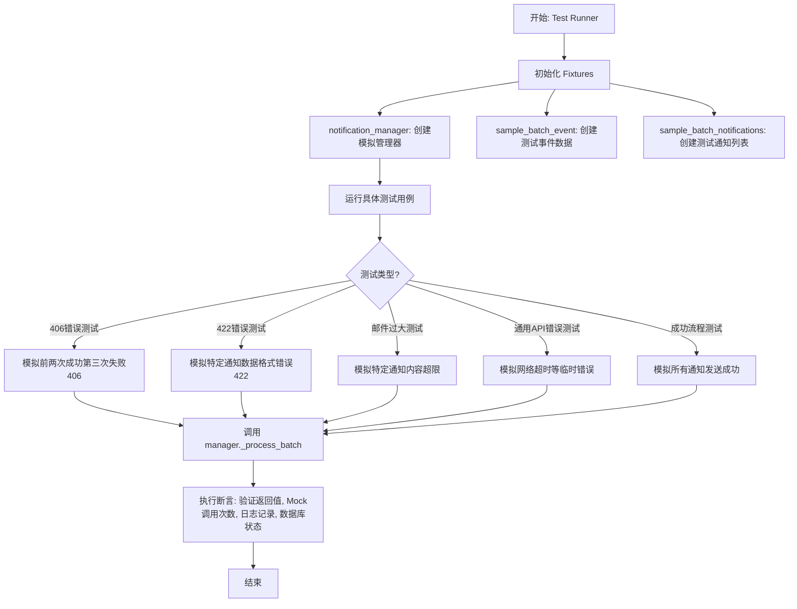
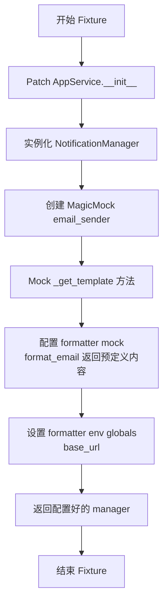
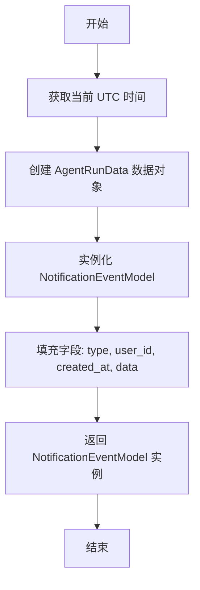
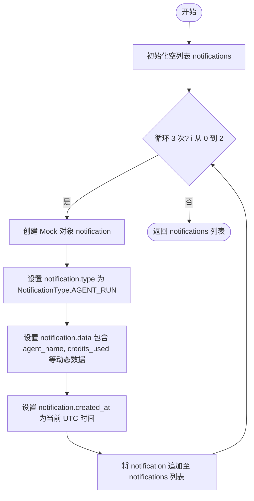
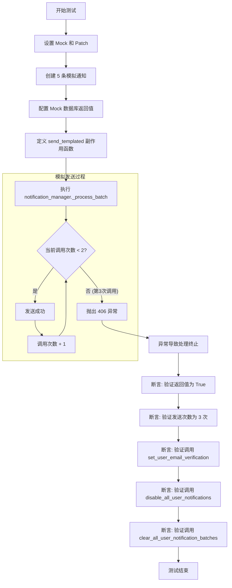
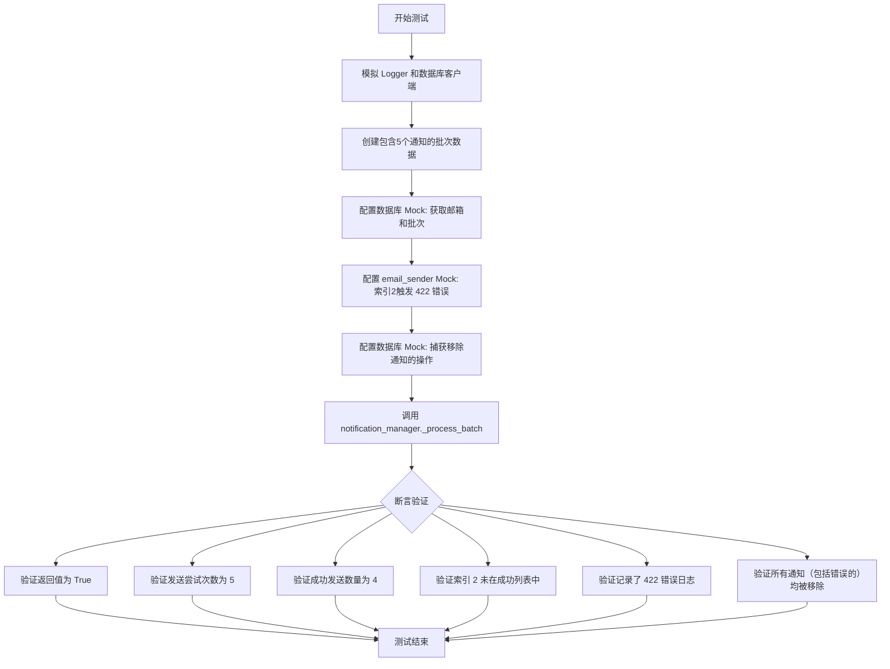
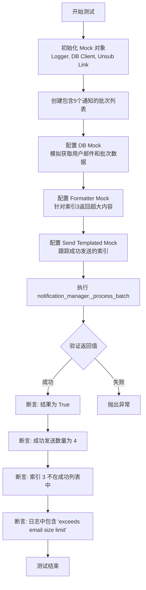
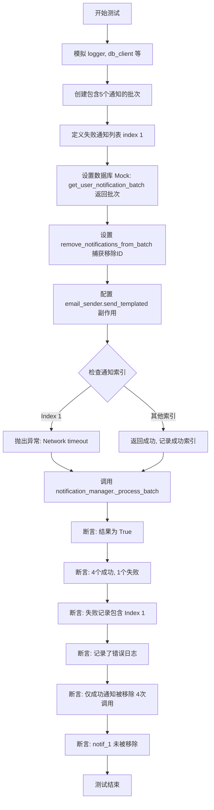
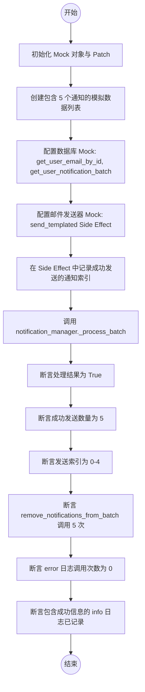

# `.\AutoGPT\autogpt_platform\backend\backend\notifications\test_notifications.py` 详细设计文档

该代码文件包含针对 NotificationManager 的单元测试套件，专门用于验证批量通知处理过程中的错误处理逻辑。它涵盖了用户不可接收(406)、数据格式错误(422)、邮件过大及通用API错误等多种场景，确保系统在遇到特定错误时能正确处理数据库状态、清理或重试通知，并验证了成功发送时的完整流程。

## 整体流程



## 类结构

```
TestNotificationErrorHandling (测试类)
├── notification_manager (Fixture方法)
├── sample_batch_event (Fixture方法)
├── sample_batch_notifications (Fixture方法)
├── test_406_stops_all_processing_for_user (测试方法)
├── test_422_permanently_removes_malformed_notification (测试方法)
├── test_oversized_notification_permanently_removed (测试方法)
├── test_generic_api_error_keeps_notification_for_retry (测试方法)
└── test_batch_all_notifications_sent_successfully (测试方法)
```

## 全局变量及字段


    

## 全局函数及方法


### `TestNotificationErrorHandling.notification_manager`

创建用于测试的 `NotificationManager` 实例的 pytest fixture，通过 Mock 其内部邮件发送器、模板和格式化组件来隔离测试逻辑。

参数：

- `self`：`TestNotificationErrorHandling`，测试类的实例，由 pytest 隐式提供。

返回值：`NotificationManager`，配置好的 `NotificationManager` 实例，其依赖项已被 Mock 替换。

#### 流程图



#### 带注释源码

```python
@pytest.fixture
def notification_manager(self):
    """Create a NotificationManager instance for testing."""
    # Patch AppService 的初始化方法，避免执行真实的初始化逻辑
    with patch("backend.notifications.notifications.AppService.__init__"):
        # 实例化 NotificationManager
        manager = NotificationManager()
        
        # 将 email_sender 替换为 MagicMock，以隔离真实的邮件发送逻辑
        manager.email_sender = MagicMock()
        
        # Mock _process_batch 中使用的 _get_template 方法
        template_mock = Mock()
        template_mock.base_template = "base"
        template_mock.subject_template = "subject"
        template_mock.body_template = "body"
        manager.email_sender._get_template = Mock(return_value=template_mock)
        
        # Mock formatter (格式化器)
        manager.email_sender.formatter = Mock()
        # Mock format_email 方法，使其返回预定义的主题和正文内容
        manager.email_sender.formatter.format_email = Mock(
            return_value=("subject", "body content")
        )
        manager.email_sender.formatter.env = Mock()
        # 设置 formatter 环境的全局变量，例如 base_url
        manager.email_sender.formatter.env.globals = {
            "base_url": "http://example.com"
        }
        return manager
```


### `TestNotificationErrorHandling.sample_batch_event`

该方法是类 `TestNotificationErrorHandling` 下的一个 Pytest 测试夹具（Fixture），用于创建并返回一个配置好的 `NotificationEventModel` 实例。该实例包含模拟的代理运行数据，旨在为测试通知管理器的批处理逻辑提供标准化的输入数据。

参数：

-   `self`：`TestNotificationErrorHandling`，表示类的实例。

返回值：`NotificationEventModel`，包含预设代理运行信息的通知事件模型实例。

#### 流程图



#### 带注释源码

```python
    @pytest.fixture
    def sample_batch_event(self):
        """Create a sample batch event for testing."""
        # 返回一个初始化好的 NotificationEventModel 对象
        return NotificationEventModel(
            # 设置通知类型为 AGENT_RUN
            type=NotificationType.AGENT_RUN,
            # 设置测试用户 ID
            user_id="user_1",
            # 设置创建时间为当前 UTC 时间
            created_at=datetime.now(timezone.utc),
            # 构造具体的代理运行数据负载
            data=AgentRunData(
                agent_name="Test Agent",    # 代理名称
                credits_used=10.0,          # 使用的积分
                execution_time=5.0,         # 执行时间
                node_count=3,               # 节点数量
                graph_id="graph_1",         # 图 ID
                outputs=[],                 # 输出列表
            ),
        )
```


### `TestNotificationErrorHandling.sample_batch_notifications`

这是一个 Pytest 测试夹具，用于创建一组模拟的批量通知数据。它生成包含 3 个模拟通知对象的列表，每个通知对象都代表一个代理运行事件，并包含不同的动态数据（如代理名称、消耗积分、执行时间等），以便在测试中使用。

参数：

- `self`：`TestNotificationErrorHandling`，测试类的实例。

返回值：`List[Mock]`，包含 3 个模拟通知对象的列表，这些对象配置了特定的类型、数据和创建时间。

#### 流程图



#### 带注释源码

```python
    @pytest.fixture
    def sample_batch_notifications(self):
        """Create sample batch notifications for testing."""
        # 初始化一个空列表，用于存放生成的模拟通知
        notifications = []
        # 循环 3 次，生成 3 个不同的通知对象
        for i in range(3):
            # 创建一个 Mock 对象来模拟通知实例
            notification = Mock()
            # 设置通知类型为 AGENT_RUN（代理运行）
            notification.type = NotificationType.AGENT_RUN
            # 设置通知的详细数据，使用索引 i 来区分不同的代理运行记录
            notification.data = {
                "agent_name": f"Test Agent {i}",
                "credits_used": 10.0 * (i + 1),
                "execution_time": 5.0 * (i + 1),
                "node_count": 3 + i,
                "graph_id": f"graph_{i}",
                "outputs": [],
            }
            # 设置通知的创建时间为当前的 UTC 时间
            notification.created_at = datetime.now(timezone.utc)
            # 将配置好的通知对象添加到列表中
            notifications.append(notification)
        # 返回包含 3 个模拟通知的列表
        return notifications
```


### `TestNotificationErrorHandling.test_406_stops_all_processing_for_user`

这是一个单元测试方法，用于验证 `NotificationManager` 在处理批量通知时，如果遇到特定的 406（接收者不活跃）错误，能否立即停止该用户的所有后续通知处理，并执行禁用该用户通知相关的清理操作。

参数：

- `self`：`TestNotificationErrorHandling`，测试类的实例引用。
- `notification_manager`：`NotificationManager`，通过 pytest fixture 创建的通知管理器实例，用于执行测试。
- `sample_batch_event`：`NotificationEventModel`，通过 pytest fixture 创建的示例批量事件数据，用于模拟输入。

返回值：`None`，该方法为测试函数，不返回具体值，主要通过断言验证行为。

#### 流程图



#### 带注释源码

```python
@pytest.mark.asyncio
async def test_406_stops_all_processing_for_user(
    self, notification_manager, sample_batch_event
):
    """Test that 406 inactive recipient error stops ALL processing for that user."""
    # Patch 外部依赖：日志、验证状态设置、禁用通知、数据库客户端、退订链接生成
    with patch("backend.notifications.notifications.logger"), patch(
        "backend.notifications.notifications.set_user_email_verification",
        new_callable=AsyncMock,
    ) as mock_set_verification, patch(
        "backend.notifications.notifications.disable_all_user_notifications",
        new_callable=AsyncMock,
    ) as mock_disable_all, patch(
        "backend.notifications.notifications.get_database_manager_async_client"
    ) as mock_db_client, patch(
        "backend.notifications.notifications.generate_unsubscribe_link"
    ) as mock_unsub_link:

        # 创建包含 5 条通知的批次
        notifications = []
        for i in range(5):
            notification = Mock()
            notification.id = f"notif_{i}"
            notification.type = NotificationType.AGENT_RUN
            notification.data = {
                "agent_name": f"Test Agent {i}",
                "credits_used": 10.0 * (i + 1),
                "execution_time": 5.0 * (i + 1),
                "node_count": 3 + i,
                "graph_id": f"graph_{i}",
                "outputs": [],
            }
            notification.created_at = datetime.now(timezone.utc)
            notifications.append(notification)

        # 设置 Mock 数据库的行为
        mock_db = mock_db_client.return_value
        mock_db.get_user_email_by_id = AsyncMock(return_value="test@example.com")
        mock_db.get_user_notification_batch = AsyncMock(
            return_value=Mock(notifications=notifications)
        )
        mock_db.clear_all_user_notification_batches = AsyncMock()
        mock_db.remove_notifications_from_batch = AsyncMock()
        mock_unsub_link.return_value = "http://example.com/unsub"

        # Mock 管理器的内部辅助方法，确保流程走到发送逻辑
        notification_manager._should_email_user_based_on_preference = AsyncMock(
            return_value=True
        )
        notification_manager._should_batch = AsyncMock(return_value=True)
        notification_manager._parse_message = Mock(return_value=sample_batch_event)

        # 追踪发送调用次数
        call_count = [0]

        # 定义 email_sender.send_templated 的副作用函数，模拟前两次成功，第三次抛出 406 错误
        def send_side_effect(*args, **kwargs):
            data = kwargs.get("data", [])
            if isinstance(data, list) and len(data) == 1:
                current_call = call_count[0]
                call_count[0] += 1

                # 前两次调用成功
                if current_call < 2:
                    return None
                else:
                    # 第三次调用抛出 406 不活跃错误
                    raise Exception("Recipient marked as inactive (406)")
            # 如果不是单条处理（非预期路径），强制报错
            raise Exception("Force single processing")

        notification_manager.email_sender.send_templated.side_effect = (
            send_side_effect
        )

        # Act: 执行批量处理
        result = await notification_manager._process_batch(
            sample_batch_event.model_dump_json()
        )

        # Assert: 验证处理结果
        assert result is True

        # 验证仅进行了 3 次尝试（2 次成功，第 3 次失败并停止）
        assert call_count[0] == 3

        # 验证用户被标记为未验证（禁用）
        mock_set_verification.assert_called_once_with("user_1", False)
        
        # 验证禁用了所有用户通知
        mock_disable_all.assert_called_once_with("user_1")
        
        # 验证清空了用户的通知批次队列
        mock_db.clear_all_user_notification_batches.assert_called_once_with(
            "user_1"
        )

        # 后续处理（剩余的通知）不应发生，由上述断言覆盖
```


### `TestNotificationErrorHandling.test_422_permanently_removes_malformed_notification`

测试当通知发送过程中出现 422（不可处理实体）错误时，格式错误的通知是否会被永久从批次中移除，并继续处理其余通知的功能。

参数：

-  `self`：`TestNotificationErrorHandling`，测试类实例本身。
-  `notification_manager`：`NotificationManager`，用于测试的通知管理器实例，由 fixture 提供。
-  `sample_batch_event`：`NotificationEventModel`，用于触发批次处理的示例事件数据，由 fixture 提供。

返回值：`None`，该方法为测试用例，无返回值。

#### 流程图



#### 带注释源码

```python
    @pytest.mark.asyncio
    async def test_422_permanently_removes_malformed_notification(
        self, notification_manager, sample_batch_event
    ):
        """Test that 422 error permanently removes the malformed notification from batch and continues with others."""
        # 模拟日志记录器和数据库客户端，以隔离测试环境
        with patch("backend.notifications.notifications.logger") as mock_logger, patch(
            "backend.notifications.notifications.get_database_manager_async_client"
        ) as mock_db_client, patch(
            "backend.notifications.notifications.generate_unsubscribe_link"
        ) as mock_unsub_link:

            # 创建一个包含 5 个通知的批次
            notifications = []
            for i in range(5):
                notification = Mock()
                notification.id = f"notif_{i}"
                notification.type = NotificationType.AGENT_RUN
                notification.data = {
                    "agent_name": f"Test Agent {i}",
                    "credits_used": 10.0 * (i + 1),
                    "execution_time": 5.0 * (i + 1),
                    "node_count": 3 + i,
                    "graph_id": f"graph_{i}",
                    "outputs": [],
                }
                notification.created_at = datetime.now(timezone.utc)
                notifications.append(notification)

            # 设置数据库相关的 Mock
            mock_db = mock_db_client.return_value
            mock_db.get_user_email_by_id = AsyncMock(return_value="test@example.com")
            # 第一次调用返回 5 个通知，第二次返回空列表（模拟处理完毕）
            mock_db.get_user_notification_batch = AsyncMock(
                side_effect=[
                    Mock(notifications=notifications),
                    Mock(notifications=[]),  # Empty after processing
                ]
            )
            mock_db.remove_notifications_from_batch = AsyncMock()
            mock_unsub_link.return_value = "http://example.com/unsub"

            # 模拟内部方法逻辑
            notification_manager._should_email_user_based_on_preference = AsyncMock(
                return_value=True
            )
            notification_manager._should_batch = AsyncMock(return_value=True)
            notification_manager._parse_message = Mock(return_value=sample_batch_event)

            # 初始化跟踪变量
            call_count = [0]
            successful_indices = []
            removed_notification_ids = []

            # 捕获从数据库中移除的通知 ID
            def remove_side_effect(user_id, notif_type, notif_ids):
                removed_notification_ids.extend(notif_ids)
                return None

            mock_db.remove_notifications_from_batch.side_effect = remove_side_effect

            # 定义发送邮件的副作用，用于模拟 422 错误
            def send_side_effect(*args, **kwargs):
                data = kwargs.get("data", [])
                if isinstance(data, list) and len(data) == 1:
                    current_call = call_count[0]
                    call_count[0] += 1

                    # 索引 2（第3次调用）将模拟产生 422 错误
                    if current_call == 2:
                        raise Exception(
                            "Unprocessable entity (422): Malformed email data"
                        )
                    else:
                        successful_indices.append(current_call)
                        return None
                # 强制单条处理路径（异常分支）
                raise Exception("Force single processing")

            notification_manager.email_sender.send_templated.side_effect = (
                send_side_effect
            )

            # 执行操作：处理批次
            result = await notification_manager._process_batch(
                sample_batch_event.model_dump_json()
            )

            # --- 断言验证部分 ---
            
            # 验证整体处理成功
            assert result is True
            # 验证尝试了所有 5 个通知
            assert call_count[0] == 5  # All 5 attempted
            # 验证有 4 个成功（索引 0, 1, 3, 4）
            assert len(successful_indices) == 4  # 4 succeeded (all except index 2)
            assert 2 not in successful_indices  # Index 2 failed

            # 验证记录了包含 "422" 或 "malformed" 的错误日志
            error_calls = [call[0][0] for call in mock_logger.error.call_args_list]
            assert any(
                "422" in call or "malformed" in call.lower() for call in error_calls
            )

            # 验证所有通知（包括 422 错误的那个）都被调用了移除方法
            # 这意味着即使出错，系统也正确处理了清理逻辑
            assert mock_db.remove_notifications_from_batch.call_count == 5
            # 关键断言：验证那个格式错误的通知 (notif_2) 确实被永久移除了
            assert (
                "notif_2" in removed_notification_ids
            )  # Malformed one was removed permanently
```


### `TestNotificationErrorHandling.test_oversized_notification_permanently_removed`

测试在处理通知批次时，如果遇到因内容过大导致超过邮件大小限制的通知，该通知是否会被永久移除，而批次中的其他通知能否继续成功发送。

参数：

- `self`：`TestNotificationErrorHandling`，测试类实例，用于访问测试方法和 fixtures。
- `notification_manager`：`NotificationManager`，通过 fixture 创建的通知管理器实例，已模拟其依赖项（如邮件发送器、数据库客户端）。
- `sample_batch_event`：`NotificationEventModel`，示例批次事件数据，用于模拟消息内容。

返回值：`None`，测试方法通常不返回值，主要依赖断言验证逻辑。

#### 流程图



#### 带注释源码

```python
@pytest.mark.asyncio
async def test_oversized_notification_permanently_removed(
    self, notification_manager, sample_batch_event
):
    """Test that oversized notifications are permanently removed from batch but others continue."""
    # Mock 日志和数据库客户端
    with patch("backend.notifications.notifications.logger") as mock_logger, patch(
        "backend.notifications.notifications.get_database_manager_async_client"
    ) as mock_db_client, patch(
        "backend.notifications.notifications.generate_unsubscribe_link"
    ) as mock_unsub_link:

        # 创建包含5个模拟通知的批次
        notifications = []
        for i in range(5):
            notification = Mock()
            notification.id = f"notif_{i}"
            notification.type = NotificationType.AGENT_RUN
            notification.data = {
                "agent_name": f"Test Agent {i}",
                "credits_used": 10.0 * (i + 1),
                "execution_time": 5.0 * (i + 1),
                "node_count": 3 + i,
                "graph_id": f"graph_{i}",
                "outputs": [],
            }
            notification.created_at = datetime.now(timezone.utc)
            notifications.append(notification)

        # 设置数据库 Mock 行为
        mock_db = mock_db_client.return_value
        mock_db.get_user_email_by_id = AsyncMock(return_value="test@example.com")
        # 第一次调用返回5个通知，第二次调用返回空（模拟处理结束）
        mock_db.get_user_notification_batch = AsyncMock(
            side_effect=[
                Mock(notifications=notifications),
                Mock(notifications=[]),  # Empty after processing
            ]
        )
        mock_db.remove_notifications_from_batch = AsyncMock()
        mock_unsub_link.return_value = "http://example.com/unsub"

        # Mock 内部方法，允许邮件发送和批处理
        notification_manager._should_email_user_based_on_preference = AsyncMock(
            return_value=True
        )
        notification_manager._should_batch = AsyncMock(return_value=True)
        notification_manager._parse_message = Mock(return_value=sample_batch_event)

        # 覆盖 formatter 的 format_email 方法以模拟特定索引下的超大邮件
        def format_side_effect(*args, **kwargs):
            data = kwargs.get("data", {}).get("notifications", [])
            if data and len(data) == 1:
                # 检查是否为索引 3 (Test Agent 3)
                if any(
                    "Test Agent 3" in str(n.data)
                    for n in data
                    if hasattr(n, "data")
                ):
                    # 返回超过 4.5MB 限制的内容，模拟超大错误
                    return ("subject", "x" * 5_000_000)
            return ("subject", "normal sized content")

        notification_manager.email_sender.formatter.format_email = Mock(
            side_effect=format_side_effect
        )

        # 用于跟踪成功发送的索引列表
        successful_indices = []

        # 定义邮件发送的 Mock 逻辑，记录成功发送的索引
        def send_side_effect(*args, **kwargs):
            data = kwargs.get("data", [])
            if isinstance(data, list) and len(data) == 1:
                # 根据内容匹配通知索引
                for i, notif in enumerate(notifications):
                    if any(
                        f"Test Agent {i}" in str(n.data)
                        for n in data
                        if hasattr(n, "data")
                    ):
                        successful_indices.append(i)
                        return None
                return None
            # 如果不是单条处理，强制抛出异常（确保走单条逻辑）
            raise Exception("Force single processing")

        notification_manager.email_sender.send_templated.side_effect = (
            send_side_effect
        )

        # 执行被测方法
        result = await notification_manager._process_batch(
            sample_batch_event.model_dump_json()
        )

        # 断言处理结果为 True
        assert result is True
        # 断言只有 4 条发送成功（索引 3 因过大被跳过）
        assert (
            len(successful_indices) == 4
        )  # Only 4 sent (index 3 skipped due to size)
        # 断言索引 3 不在成功列表中
        assert 3 not in successful_indices  # Index 3 was not sent

        # 验证日志中记录了超大尺寸相关的错误信息
        error_calls = [call[0][0] for call in mock_logger.error.call_args_list]
        assert any(
            "exceeds email size limit" in call or "oversized" in call.lower()
            for call in error_calls
        )
```


### `TestNotificationErrorHandling.test_generic_api_error_keeps_notification_for_retry`

测试当通知处理过程中发生通用API错误（如网络超时）时，受影响的通知会保留在批次中以便稍后重试，而其他成功的通知则被正常处理和移除。

参数：

- `self`：`TestNotificationErrorHandling`，测试类的实例。
- `notification_manager`：`NotificationManager`，用于测试的 NotificationManager 实例 fixture，已包含模拟依赖。
- `sample_batch_event`：`NotificationEventModel`，用于测试的样本批次事件 fixture。

返回值：`None`，该方法为测试用例，通过断言验证行为而不返回值。

#### 流程图



#### 带注释源码

```python
@pytest.mark.asyncio
async def test_generic_api_error_keeps_notification_for_retry(
    self, notification_manager, sample_batch_event
):
    """Test that generic API errors keep notifications in batch for retry while others continue."""
    with patch("backend.notifications.notifications.logger") as mock_logger, patch(
        "backend.notifications.notifications.get_database_manager_async_client"
    ) as mock_db_client, patch(
        "backend.notifications.notifications.generate_unsubscribe_link"
    ) as mock_unsub_link:

        # 创建包含5个通知的测试批次
        notifications = []
        for i in range(5):
            notification = Mock()
            notification.id = f"notif_{i}"
            notification.type = NotificationType.AGENT_RUN
            notification.data = {
                "agent_name": f"Test Agent {i}",
                "credits_used": 10.0 * (i + 1),
                "execution_time": 5.0 * (i + 1),
                "node_count": 3 + i,
                "graph_id": f"graph_{i}",
                "outputs": [],
            }
            notification.created_at = datetime.now(timezone.utc)
            notifications.append(notification)

        # 定义预期失败的通知列表 (仅 index 1)
        failed_notifications = [notifications[1]]

        # Setup mocks
        mock_db = mock_db_client.return_value
        mock_db.get_user_email_by_id = AsyncMock(return_value="test@example.com")
        # 模拟数据库返回批次：第一次返回全部，第二次返回失败的（模拟重试时的状态检查逻辑）
        mock_db.get_user_notification_batch = AsyncMock(
            side_effect=[
                Mock(notifications=notifications),
                Mock(
                    notifications=failed_notifications
                ),  # Failed ones remain for retry
            ]
        )
        mock_db.remove_notifications_from_batch = AsyncMock()
        mock_unsub_link.return_value = "http://example.com/unsub"

        # Mock internal methods
        notification_manager._should_email_user_based_on_preference = AsyncMock(
            return_value=True
        )
        notification_manager._should_batch = AsyncMock(return_value=True)
        notification_manager._parse_message = Mock(return_value=sample_batch_event)

        # 初始化追踪变量
        successful_indices = []
        failed_indices = []
        removed_notification_ids = []

        # 捕获被移除的通知ID
        def remove_side_effect(user_id, notif_type, notif_ids):
            removed_notification_ids.extend(notif_ids)
            return None

        mock_db.remove_notifications_from_batch.side_effect = remove_side_effect

        # 定义发送邮件的副作用逻辑
        def send_side_effect(*args, **kwargs):
            data = kwargs.get("data", [])
            if isinstance(data, list) and len(data) == 1:
                # 根据内容识别通知索引
                for i, notif in enumerate(notifications):
                    if any(
                        f"Test Agent {i}" in str(n.data)
                        for n in data
                        if hasattr(n, "data")
                    ):
                        # Index 1 模拟通用 API 错误
                        if i == 1:
                            failed_indices.append(i)
                            raise Exception("Network timeout - temporary failure")
                        else:
                            # 其他索引成功
                            successful_indices.append(i)
                            return None
                return None
            # 强制单处理逻辑
            raise Exception("Force single processing")

        notification_manager.email_sender.send_templated.side_effect = (
            send_side_effect
        )

        # Act: 执行批处理
        result = await notification_manager._process_batch(
            sample_batch_event.model_dump_json()
        )

        # Assert: 验证结果
        assert result is True
        assert len(successful_indices) == 4  # 4个成功 (0, 2, 3, 4)
        assert len(failed_indices) == 1  # 1个失败
        assert 1 in failed_indices  # Index 1 失败

        # 验证记录了错误日志
        error_calls = [call[0][0] for call in mock_logger.error.call_args_list]
        assert any(
            "api error" in call.lower() or "skipping" in call.lower()
            for call in error_calls
        )

        # 关键断言：只有成功的通知从批次中移除（失败的保留用于重试）
        assert mock_db.remove_notifications_from_batch.call_count == 4
        assert (
            "notif_1" not in removed_notification_ids
        )  # 失败的未被移除
        assert "notif_0" in removed_notification_ids  # 成功的被移除
        assert "notif_2" in removed_notification_ids  # 成功的被移除
        assert "notif_3" in removed_notification_ids  # 成功的被移除
        assert "notif_4" in removed_notification_ids  # 成功的被移除
```


### `TestNotificationErrorHandling.test_batch_all_notifications_sent_successfully`

测试 NotificationManager 在批量处理场景下的成功执行路径，验证当批量中的所有通知均无错误地成功发送时，系统是否能正确更新状态、清理数据库批次记录并记录相应的日志。

参数：

-   `self`：`TestNotificationErrorHandling`，测试类实例。
-   `notification_manager`：`NotificationManager`，用于测试的 NotificationManager 实例（通过 Pytest fixture 注入）。
-   `sample_batch_event`：`NotificationEventModel`，示例批量事件数据模型（通过 Pytest fixture 注入）。

返回值：`None`，该方法为单元测试函数，通过断言验证系统行为，本身不返回数值。

#### 流程图



#### 带注释源码

```python
    @pytest.mark.asyncio
    async def test_batch_all_notifications_sent_successfully(
        self, notification_manager, sample_batch_event
    ):
        """Test successful batch processing where all notifications are sent without errors."""
        # 打补丁模拟外部依赖：日志、数据库客户端、取消链接生成器
        with patch("backend.notifications.notifications.logger") as mock_logger, patch(
            "backend.notifications.notifications.get_database_manager_async_client"
        ) as mock_db_client, patch(
            "backend.notifications.notifications.generate_unsubscribe_link"
        ) as mock_unsub_link:

            # 创建包含 5 个模拟通知的批次
            notifications = []
            for i in range(5):
                notification = Mock()
                notification.id = f"notif_{i}"
                notification.type = NotificationType.AGENT_RUN
                notification.data = {
                    "agent_name": f"Test Agent {i}",
                    "credits_used": 10.0 * (i + 1),
                    "execution_time": 5.0 * (i + 1),
                    "node_count": 3 + i,
                    "graph_id": f"graph_{i}",
                    "outputs": [],
                }
                notification.created_at = datetime.now(timezone.utc)
                notifications.append(notification)

            # 设置数据库 Mock 对象
            mock_db = mock_db_client.return_value
            mock_db.get_user_email_by_id = AsyncMock(return_value="test@example.com")
            # 首次调用返回通知列表，后续返回空列表（模拟处理完成）
            mock_db.get_user_notification_batch = AsyncMock(
                side_effect=[
                    Mock(notifications=notifications),
                    Mock(notifications=[]),  # Empty after all sent successfully
                ]
            )
            mock_db.remove_notifications_from_batch = AsyncMock()
            mock_unsub_link.return_value = "http://example.com/unsub"

            # Mock NotificationManager 内部方法
            notification_manager._should_email_user_based_on_preference = AsyncMock(
                return_value=True
            )
            notification_manager._should_batch = AsyncMock(return_value=True)
            notification_manager._parse_message = Mock(return_value=sample_batch_event)

            # 初始化追踪变量：成功发送的索引和已移除的通知ID
            successful_indices = []
            removed_notification_ids = []

            # 定义 remove_notifications_from_batch 的副作用函数，用于记录被移除的通知ID
            def remove_side_effect(user_id, notif_type, notif_ids):
                removed_notification_ids.extend(notif_ids)
                return None

            mock_db.remove_notifications_from_batch.side_effect = remove_side_effect

            # 定义邮件发送的副作用函数，用于模拟发送成功并追踪发送了哪些通知
            def send_side_effect(*args, **kwargs):
                data = kwargs.get("data", [])
                if isinstance(data, list) and len(data) == 1:
                    # 遍历通知列表以识别当前处理的是哪一个（通过匹配数据内容）
                    for i, notif in enumerate(notifications):
                        if any(
                            f"Test Agent {i}" in str(n.data)
                            for n in data
                            if hasattr(n, "data")
                        ):
                            successful_indices.append(i)
                            return None
                    return None  # Success
                # 如果不是预期的单个处理模式，抛出异常强制进入单个处理逻辑（但在本测试中不应触发）
                raise Exception("Force single processing")

            notification_manager.email_sender.send_templated.side_effect = (
                send_side_effect
            )

            # Act: 调用被测方法 _process_batch
            result = await notification_manager._process_batch(
                sample_batch_event.model_dump_json()
            )

            # Assert: 验证处理结果
            assert result is True

            # 验证所有 5 个通知都已发送
            assert len(successful_indices) == 5
            assert successful_indices == [0, 1, 2, 3, 4]

            # 验证所有通知都已从批次中移除
            assert mock_db.remove_notifications_from_batch.call_count == 5
            assert len(removed_notification_ids) == 5
            for i in range(5):
                assert f"notif_{i}" in removed_notification_ids

            # 验证没有错误日志被记录
            assert mock_logger.error.call_count == 0

            # 验证记录了发送成功的信息日志
            info_calls = [call[0][0] for call in mock_logger.info.call_args_list]
            assert any("sent and removed" in call.lower() for call in info_calls)
```


## 关键组件


### NotificationManager
核心协调器类，负责管理通知的完整生命周期，包括批处理逻辑、用户偏好检查、错误分类及与外部服务的交互。

### 批处理执行引擎
处理通知分批检索、迭代发送和状态更新的逻辑组件，确保在处理成功或特定失败时正确维护队列状态。

### 错误分类与恢复策略
健壮的错误处理子系统，用于区分致命错误（如 406 用户停用）、数据格式错误（如 422）、邮件尺寸限制及临时 API 故障，并执行相应的隔离或重试逻辑。

### 邮件发送与模板服务
负责渲染邮件内容（主题、正文）和执行外部 API 交付请求的组件，其行为被模拟以测试 NotificationManager 的响应机制。

### 通知数据模型
定义通知事件结构和业务负载的数据容器，例如 `NotificationEventModel` 和 `AgentRunData`，用于在系统各层级间传递信息。


## 问题及建议


### 已知问题

-   基于字符串匹配的错误处理逻辑脆弱性
    测试代码中通过 mock 抛出包含特定字符串（如 "406", "422"）的通用 Exception 来模拟错误。这暗示生产环境的 `_process_batch` 方法极有可能是通过解析异常消息的字符串内容来区分错误类型（如用户未激活、数据格式错误等）。这种实现方式非常脆弱，一旦上游依赖（如邮件服务提供商）修改了错误消息文本，系统的错误处理逻辑将立即失效。

-   `_process_batch` 方法职责过重
    从测试用例可以看出，该方法承担了过多的职责，包括：获取批次数据、发送邮件、解析特定的错误消息、管理数据库状态（删除/保留通知）、管理用户状态（禁用用户通知）以及记录日志。这违反了单一职责原则，导致该方法逻辑复杂，难以维护和测试，且增加了单元测试的 mock 难度。

-   硬编码的业务规则与魔法值
    测试中模拟了邮件大小限制（超过 4.5MB），且对特定 HTTP 状态码（406, 422）有硬编码的处理逻辑。这些业务规则和阈值（如邮件大小限制、特定的错误码）可能散落在代码中，缺乏统一的配置管理，不利于未来的灵活调整。

### 优化建议

-   引入结构化的异常体系替代字符串匹配
    定义明确的异常类（如 `InactiveRecipientError`, `MalformedDataError`, `OversizedEmailError`）或使用枚举类型定义错误码。在邮件发送接口层捕获底层 API 错误并将其转换为具体的业务异常，从而避免在处理逻辑中进行脆弱的字符串匹配，提高代码的健壮性。

-   采用策略模式重构错误处理逻辑
    将针对不同错误类型的处理逻辑（如：406 停止并禁用用户、422 删除当前通知、通用错误保留重试）抽象为独立的策略类或处理器。`NotificationManager` 仅负责调度，具体的错误恢复和状态管理由对应的策略执行，从而降低主流程的复杂度。

-   配置外部化
    将邮件大小限制、重试次数、各种状态码对应的处理策略等参数提取到配置文件或环境变量中。这样可以在不修改代码的情况下调整业务阈值，适应不同环境或上游服务商的变化。

-   增强重试机制的灵活性
    当前对于通用错误的处理似乎是简单的“保留在批次中等待下次重试”。建议引入更完善的重试机制，例如指数退避策略，并区分“可重试错误”与“不可重试错误”，避免无效的重试消耗系统资源。


## 其它


### 设计目标与约束

1.  **容错性与健壮性**：系统设计需能够在批次处理过程中区分不同类型的错误，并针对致命错误（如用户失效）和非致命错误（如格式错误、网络超时）采取不同的隔离策略，防止单点故障导致整个系统停滞。
2.  **资源约束**：严格遵守外部邮件服务商的载荷限制，确保单个通知邮件的大小不超过特定阈值（如代码中模拟的 4.5MB/5MB 限制），超大邮件必须被识别并剔除。
3.  **数据一致性**：在处理批次通知时，必须确保数据库状态与发送结果一致。成功的通知应移除，可重试的错误应保留，不可重试的格式错误应永久删除。
4.  **用户体验控制**：当检测到接收端永久不可达（如 406 错误）时，系统必须具备立即停止向该用户发送更多消息的能力，以维护发送者信誉并避免骚扰。

### 错误处理与异常设计

系统在 `_process_batch` 流程中实现了精细化的异常处理策略，具体如下：

1.  **406 Not Acceptable (用户失效/不可达)**：
    *   **行为**：这是最高优先级的阻断错误。一旦在批次处理中捕获到此异常，系统应立即停止该用户的所有后续处理。
    *   **后续操作**：调用 `disable_all_user_notifications` 禁用用户通知设置，调用 `clear_all_user_notification_batches` 清空该用户所有待发送队列，并调用 `set_user_email_verification` 设置邮箱验证状态为 False。
2.  **422 Unprocessable Entity (数据格式错误)**：
    *   **行为**：视为单条数据的永久性失败，不应影响同批次其他数据的处理。
    *   **后续操作**：记录错误日志，将该特定的“畸形”通知 ID 从批次中永久移除，继续处理下一条。
3.  **超大通知错误**：
    *   **行为**：当生成的内容超过邮件服务商限制（如大小限制）时触发。
    *   **后续操作**：记录错误日志，将该超大的通知 ID 从批次中永久移除，继续处理下一条。
4.  **通用 API 错误 (如网络超时、500错误)**：
    *   **行为**：视为暂时性故障。
    *   **后续操作**：记录错误日志，但**保留**该通知在批次中（不调用移除操作），使其留在队列中等待下一次重试，同时继续处理当前批次中的其他通知。
5.  **成功处理**：
    *   **后续操作**：调用 `remove_notifications_from_batch` 将已成功发送的通知从数据库批次中移除。

### 数据流与状态机

通知数据在处理过程中的流转状态如下：

1.  **Pending (待处理)**：
    *   数据存储于数据库的批次队列中。
    *   触发：系统调度或事件触发 `_process_batch`。
2.  **Processing (处理中)**：
    *   系统从数据库拉取批次数据 (`get_user_notification_batch`)。
    *   遍历列表，构建邮件内容。
3.  **分支决策状态**：
    *   **Success -> Removed**：调用 `remove_notifications_from_batch`，数据生命周期结束（转为历史记录或删除）。
    *   **Malformed/Oversized (422/Size Error) -> Discarded**：调用 `remove_notifications_from_batch`，数据被永久丢弃，不再重试。
    *   **Transient Failure (Generic Error) -> Retry**：保留在数据库批次中，状态回滚至 Pending，等待下一轮处理。
    *   **User Inactive (406) -> User Disabled**：触发全局状态变更。
        *   用户状态：Active -> Disabled。
        *   批次状态：所有 Pending 数据 -> Cleared (清空)。

### 外部依赖与接口契约

1.  **数据库管理器 (`get_database_manager_async_client`)**：
    *   `get_user_email_by_id(user_id)`：根据用户ID获取邮箱地址，用于确定发送目标。
    *   `get_user_notification_batch(user_id, type)`：获取特定用户的待发送通知批次，返回包含通知对象的列表。
    *   `remove_notifications_from_batch(user_id, type, notification_ids)`：从批次中移除已成功发送或需丢弃的通知ID列表。
    *   `clear_all_user_notification_batches(user_id)`：清空指定用户的所有通知批次（用于406错误场景）。
2.  **邮件发送服务 (`email_sender`)**：
    *   `_get_template()`：获取邮件模板对象。
    *   `formatter.format_email()`：格式化邮件内容，生成 Subject 和 Body。
    *   `send_templated(subject, body, data)`：执行邮件发送操作。契约规定其在特定错误（如406, 422, 超限）下必须抛出相应的异常以供上层捕获。
3.  **用户服务与工具函数**：
    *   `set_user_email_verification(user_id, status)`：异步更新用户邮箱验证状态。
    *   `disable_all_user_notifications(user_id)`：异步禁用用户的所有通知偏好设置。
    *   `generate_unsubscribe_link()`：生成退订链接的辅助函数，用于邮件正文。

    