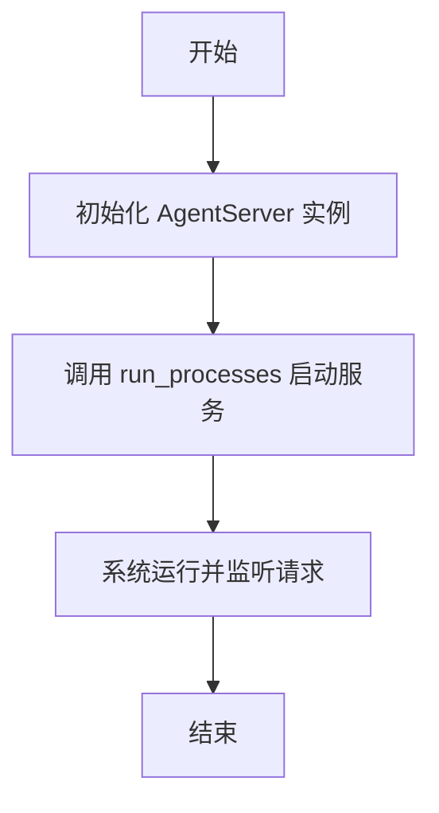
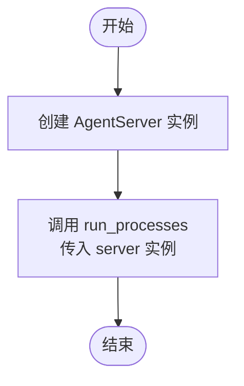

# `AutoGPT\autogpt_platform\backend\backend\rest.py` 详细设计文档

该文件作为AutoGPT-server REST API应用程序的入口点，主要负责初始化AgentServer实例，并通过run_processes函数启动服务器所需的所有进程。

## 整体流程



## 类结构

```
No classes defined in this file
```

## 全局变量及字段


    

## 全局函数及方法


### `main`

运行 AutoGPT-server REST API 所需的所有进程。

参数：

无。

返回值：`None`，无显式返回值。

#### 流程图



#### 带注释源码

```python
def main():
    """
    Run all the processes required for the AutoGPT-server REST API.
    """
    # 创建 AgentServer 类的实例
    # 这一步初始化 REST API 服务器所需的配置和资源
    server_instance = AgentServer()

    # 调用 run_processes 函数并传入 server 实例
    # 该函数负责启动服务器进程及相关处理流程
    run_processes(server_instance)
```


## 关键组件


### AgentServer

从 `backend.api.rest_api` 导入，用于处理 REST API 请求的核心服务器实例。

### run_processes

从 `backend.app` 导入，负责接收服务器实例并执行相关的主循环或进程管理逻辑。

### main

应用程序的入口函数，负责实例化 AgentServer 并调用 run_processes 以启动服务。


## 问题及建议


### 已知问题
-   缺乏错误处理机制：`main` 函数中没有 try-except 块来捕获 `AgentServer` 初始化或 `run_processes` 执行过程中的异常，导致程序直接崩溃且难以追踪错误原因。
-   模块导入路径依赖风险：直接从 `backend` 包导入假设了运行环境的 `PYTHONPATH` 已正确设置或当前工作目录特定，直接运行脚本可能导致 `ModuleNotFoundError`。
-   配置管理不透明：`AgentServer()` 在无参数的情况下实例化，意味着关键配置（如端口、日志级别、数据库连接）可能硬编码在类内部或隐式依赖环境变量，降低了部署的灵活性。

### 优化建议
-   引入参数解析库：建议使用 `argparse` 或 `click` 解析命令行参数，允许在启动时动态配置服务监听地址、端口或环境模式（如 dev/prod）。
-   完善日志系统初始化：在 `main` 函数入口处配置全局日志记录器（如 `logging.basicConfig`），以便在服务启动前就能正确记录启动信息和错误。
-   增加全局异常捕获与优雅退出：在 `run_processes` 调用外层增加异常捕获，确保在发生未捕获异常时能输出详细的堆栈信息并尝试执行清理操作。
-   依赖注入与配置对象：建议将配置封装为配置对象或使用 Pydantic 等库进行管理，并将该对象传递给 `AgentServer`，而非直接在内部处理配置加载。


## 其它


### 设计目标与约束

**设计目标：**
该脚本的主要设计目标是作为一个统一的入口点，简化AutoGPT-server REST API的启动流程。它负责初始化核心服务器实例（`AgentServer`）并将其传递给进程管理器，从而启动后端服务。

**约束条件：**
1. **运行环境约束**：必须安装Python 3.x环境，且所有依赖库（如`flask`或`fastapi`等相关依赖，具体取决于`AgentServer`实现）必须已通过`pip`安装。
2. **路径约束**：脚本执行位置必须在项目根目录，或者Python的`PYTHONPATH`环境变量已包含`backend`目录，以确保`from backend...`导入语句能正确解析。
3. **单例约束**：虽然脚本本身不强制，但在同一端口和配置下，通常不应同时运行多个该主进程实例，以免导致端口冲突或资源竞争。

### 错误处理与异常设计

**当前状态：**
当前的代码实现非常精简，缺乏显式的异常捕获机制。如果在导入模块、实例化`AgentServer`或执行`run_processes`过程中发生任何未捕获的异常，程序将直接崩溃并将堆栈信息输出到标准错误流（stderr），随后进程终止。

**改进建议与设计：**
1. **顶层异常捕获**：在`main`函数中应添加`try-except`块，捕获基类`Exception`，以确保在发生意外错误时能够记录日志而不是直接退出。
2. **键盘中断处理**：应专门捕获`KeyboardInterrupt`异常，以便在用户按下Ctrl+C时能够执行清理操作（如关闭数据库连接、释放端口）并优雅退出，而不是抛出堆栈跟踪。
3. **初始化失败处理**：如果`AgentServer()`初始化失败（例如配置文件缺失），应捕获特定异常，输出友好的错误提示（如“配置文件加载失败，请检查config.yaml”），然后以非零状态码退出。

### 外部依赖与接口契约

**内部模块依赖：**
1. **`backend.api.rest_api.AgentServer`**：
   *   **类型**：类
   -   **契约**：该类必须提供一个无参构造函数（或配置参数由内部处理），并且实例化后的对象必须兼容`run_processes`函数所期望的接口。通常，该对象需要具备`run()`方法或类似的生命周期管理方法，以便被进程管理器调用。
2. **`backend.app.run_processes`**：
   *   **类型**：函数
   -   **契约**：该函数接受一个`AgentServer`实例作为输入。其职责是阻塞当前线程并启动服务器，可能是直接运行，也可能是通过多进程/多线程方式启动。调用方（本脚本）预期该函数在服务器停止前不会返回。

**系统级依赖：**
*   **操作系统**：支持POSIX或Windows标准的进程管理接口。
*   **网络**：依赖操作系统的TCP/IP协议栈，因为`AgentServer`通常涉及网络监听。

### 数据流与状态机

**数据流：**
1. **启动阶段**：操作系统加载解释器 -> 执行脚本 -> 导入依赖模块（`AgentServer`, `run_processes`）。
2. **初始化阶段**：调用`AgentServer()`构造函数 -> 生成服务器对象实例（包含路由、配置等内部状态）。
3. **运行阶段**：将实例传递给`run_processes()` -> 进程管理器接管控制权 -> 开始监听网络请求。
4. **交互阶段**：外部HTTP请求 -> `AgentServer`处理 -> 返回响应（此部分在`run_processes`内部闭环）。

**状态机：**
*   **Idle (空闲)**：脚本被加载，模块导入完成。
*   **Initializing (初始化中)**：`AgentServer()`实例正在被构建。
*   **Running (运行中)**：`run_processes()`函数已接管，API服务正在处理请求。
*   **Stopped (已停止)**：进程结束（无论是正常退出还是崩溃）。
*   **状态转换**：`Idle` -> `Initializing` -> `Running` -> `Stopped`。

### 部署与运行指南

**运行方式：**
通过命令行直接执行该Python脚本。
```bash
python <path_to_script>/main.py
```

**环境准备：**
1. 确保项目依赖已安装（通常通过`pip install -r requirements.txt`）。
2. 确保配置文件（如`.env`或`config.yaml`）已正确设置，`AgentServer`可能会在初始化时读取这些配置。

**注意事项：**
在生产环境中，建议不要直接使用`python main.py`运行，而是使用进程管理工具（如`systemd`、`supervisore`或`gunicorn`/`uwsgi`，具体取决于`run_processes`的实现）来管理该脚本，以实现开机自启、自动重启和日志管理。

    