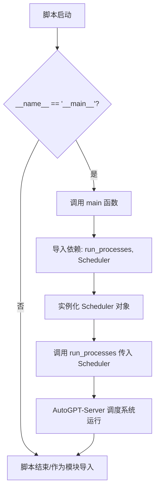
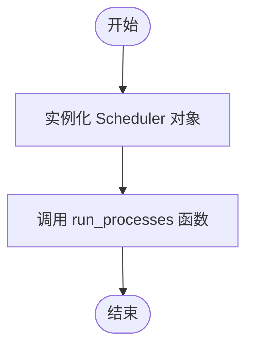

# `AutoGPT\autogpt_platform\backend\backend\scheduler.py` 详细设计文档

该代码作为AutoGPT-Server调度系统的应用程序入口点，负责初始化Scheduler调度器实例，并将其传递给run_processes函数以启动系统的所有后台处理流程。

## 整体流程



## 类结构

```
None (无内部类定义)
```

## 全局变量及字段


    

## 全局函数及方法


### `main`

运行 AutoGPT-server 调度系统所需的所有进程。

参数：

返回值：`None`，函数执行主要逻辑但不返回任何值。

#### 流程图



#### 带注释源码

```python
def main():
    """
    运行 AutoGPT-server 调度系统所需的所有进程。
    """
    # 实例化调度器 Scheduler
    # 调用 run_processes 函数并将调度器实例作为参数传入，启动系统处理流程
    run_processes(
        Scheduler(),
    )
```


## 关键组件


### main 函数
AutoGPT-server 调度系统的主入口点，负责初始化 Scheduler 并调用 run_processes 启动系统。

### run_processes 函数
从 backend.app 导入的执行函数，负责接收并运行系统调度器相关的所有进程。

### Scheduler 类
从 backend.executor.scheduler 导入的核心调度组件，封装了系统的调度逻辑，作为进程运行的主要参数。


## 问题及建议


### 已知问题

-   缺乏全局异常处理机制：`main` 函数直接调用 `run_processes`，若内部抛出未被捕获的异常，进程将直接崩溃退出，缺乏错误日志记录和资源回收机会。
-   缺乏信号处理与优雅停机：未对 `SIGINT` (Ctrl+C) 或 `SIGTERM` 信号进行监听处理，强制终止进程可能导致调度器中的任务状态不一致或资源（如数据库连接）未正确释放。
-   缺乏配置管理：`Scheduler()` 的初始化参数为空且硬编码，缺乏灵活性。若调度器需要配置（如并发线程数、重试策略等），当前代码难以扩展。
-   缺乏生命周期日志：入口点未记录服务启动、运行或退出的关键日志，降低了系统的可观测性和运维排障效率。

### 优化建议

-   增加异常捕获与日志记录：在 `main` 函数中包裹 `try-except` 块，捕获顶层异常并记录详细的堆栈信息，确保程序异常时能输出有意义的诊断信息。
-   实现优雅停机逻辑：引入信号处理机制（如 Python 的 `signal` 模块），在接收到终止信号时，通知 `Scheduler` 停止接收新任务并等待当前任务完成，安全释放资源后再退出程序。
-   引入依赖注入与配置中心：使用配置文件（如 `.env` 或 `yaml`）管理初始化参数，通过依赖注入的方式实例化 `Scheduler`，提高代码的可配置性和测试性。
-   完善日志初始化：在程序入口处统一配置日志级别、格式和输出目标（文件或标准输出），记录服务的生命周期事件，便于监控和审计。


## 其它


### 设计目标与约束

- **目标**：作为 AutoGPT-server 调度系统的单一入口点，负责初始化核心调度器并启动应用程序的主进程循环。
- **约束**：代码运行依赖于 Python 环境，且必须能够正确解析 `backend` 包路径；`Scheduler` 类必须提供无参构造函数（或当前调用方式支持的构造方式）；`run_processes` 函数必须接受实现了特定调度接口的对象。

### 错误处理与异常设计

- **显式处理**：当前 `main` 函数内部未包含显式的 `try-except` 异常捕获代码块。
- **异常传播策略**：采用“快速失败”策略。如果在 `Scheduler()` 实例化阶段或 `run_processes()` 执行阶段发生任何未捕获的异常，异常将沿着调用栈向上传播至 Python 解释器顶层，导致程序非零退出。
- **容错机制**：在容器化或受控的部署环境中，这种设计允许外部的进程监控器（如 Kubernetes、systemd 或 Docker）捕获进程退出事件并自动重启服务，从而实现系统的自愈。

### 外部依赖与接口契约

- **模块依赖**：
    - `backend.app`：应用程序核心逻辑模块，包含进程管理功能。
    - `backend.executor.scheduler`：执行器模块，包含具体的任务调度逻辑实现。
- **接口契约**：
    - `run_processes(scheduler)`：外部函数，契约定义为接受一个调度器对象。该对象隐含需具备被调度系统调用的属性或方法（尽管在当前文件中未显式定义接口，但在 `run_processes` 内部会调用其特定方法）。
    - `Scheduler`：类契约，要求实例化后即可参与调度流程，通常需实现 `start` 或类似生命周期接口。

### 数据流与状态机

- **数据流**：
    1. **初始化流**：Python 解释器加载 `main.py`，导入 `backend.app` 和 `backend.executor.scheduler`。
    2. **控制流**：脚本执行入口判断 `__name__ == "__main__"`，调用 `main()`。
    3. **实例流**：在内存中实例化 `Scheduler` 对象，初始化调度状态。
    4. **执行流**：将 `Scheduler` 实例的引用传递给 `run_processes`，控制权转移至 `backend.app` 模块，开始事件循环或进程守护。
- **状态机**：
    - **Idle (空闲)**：脚本加载但尚未执行 `main()`。
    - **Initializing (初始化中)**：执行 `main()`，正在实例化 `Scheduler`。
    - **Running (运行中)**：进入 `run_processes()`，系统处理调度任务。
    - **Exited (已退出)**：`run_processes` 返回或程序抛出未捕获异常导致进程结束。

### 部署与运行环境

- **运行环境**：该代码设计为作为应用程序的根入口点，通常在容器（如 Docker）内部作为 `CMD` 或 `ENTRYPOINT` 执行，或在虚拟机上直接通过 Python 解释器运行。
- **扩展性**：通过依赖注入（将 `Scheduler()` 传给 `run_processes`），该入口点支持在不修改 `main` 函数逻辑的情况下，通过替换传入的对象类型（例如传入 `TestScheduler` 或 `ProScheduler`）来适配不同的运行场景或环境。

    