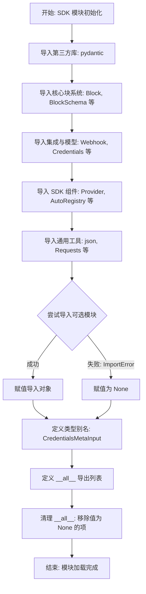
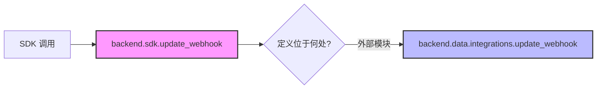
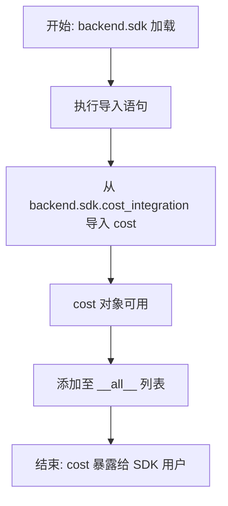
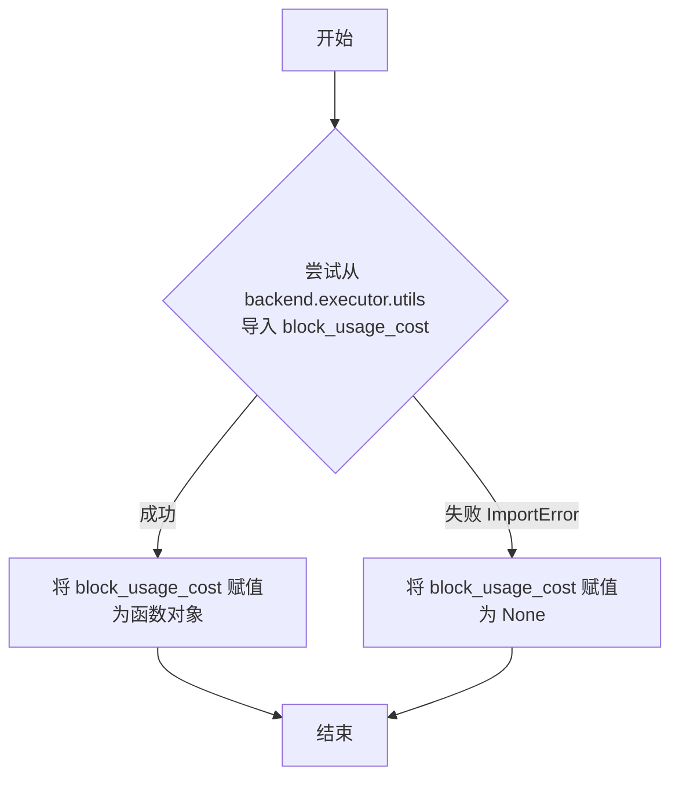
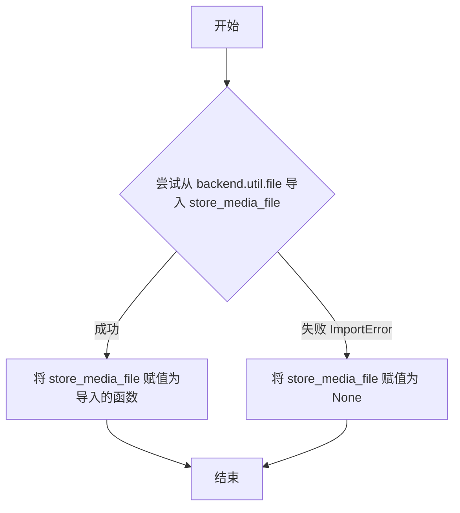
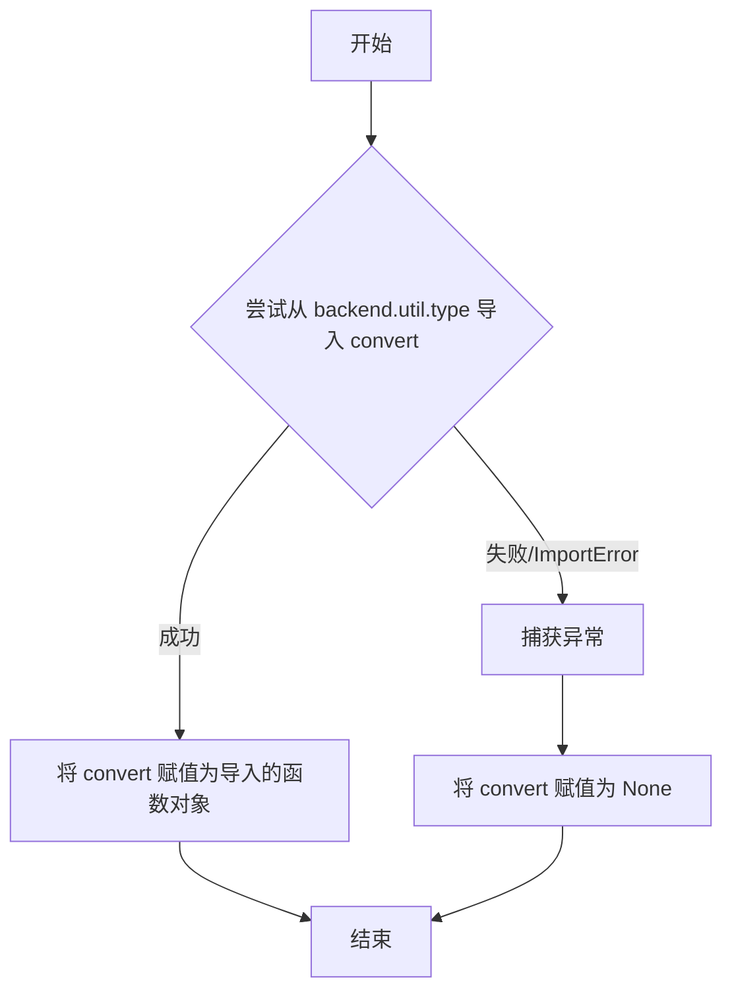

# `.\AutoGPT\autogpt_platform\backend\backend\sdk\__init__.py` 详细设计文档

该文件作为 AutoGPT Platform Block Development SDK 的核心入口点，负责聚合并重新导出所有开发所需的依赖项，包括基础块类、凭证认证组件、成本追踪组件、Webhook 组件及实用工具函数，以支持 `from backend.sdk import *` 的便捷导入方式。

## 整体流程



## 类结构

```
AutoGPT Platform SDK
├── Core Block System (核心块系统)
│   ├── Block (基础块类)
│   ├── BlockSchema (块架构)
│   ├── BlockOutput (块输出)
│   └── ... (BlockCategory, BlockType, etc.)
├── Models & Credentials (模型与凭证)
│   ├── BaseModel (Pydantic 基类)
│   ├── Credentials (凭证基类)
│   ├── APIKeyCredentials
│   ├── OAuth2Credentials
│   └── UserPasswordCredentials
├── Integrations (集成组件)
│   ├── Provider (提供商基类)
│   ├── ProviderBuilder (提供商构建器)
│   ├── Webhook (Webhook 类)
│   ├── BaseWebhooksManager
│   └── BaseOAuthHandler
├── Cost System (成本系统)
│   ├── BlockCost
│   ├── BlockCostType
│   └── UsageTransactionMetadata
└── Utilities (工具集)
    ├── Requests (请求工具)
    ├── json (JSON 工具)
    ├── store_media_file (文件存储)
    └── TextFormatter (文本格式化)
```

## 全局变量及字段


### `__all__`
    
Defines the public interface of the module, listing the names of all exported components (such as classes, functions, and utilities) after filtering out any names that failed to import or are None.

类型：`list[str]`
    


    

## 全局函数及方法


### `update_webhook`

该函数在提供的代码文件中并非直接定义，而是作为 SDK 的核心组件之一，从 `backend.data.integrations` 模块导入并重新导出。在当前文件（SDK 入口文件）的上下文中，它作为一个对外暴露的接口存在，用于处理 Webhook 的更新逻辑。具体的实现细节、参数签名和业务逻辑位于 `backend.data.integrations` 模块内部。

**参数：**

-   `N/A`：`未知`，当前文件仅包含导入语句，未包含该函数的具体定义。实际参数需参考 `backend.data.integrations` 模块的实现。

**返回值：** `未知`，当前文件未提供该函数的具体定义。实际返回值需参考 `backend.data.integrations` 模块的实现。

#### 流程图

由于该函数在当前代码片段中仅作为导入对象存在，未包含具体的实现逻辑，因此无法绘制具体的执行流程图。



#### 带注释源码

```python
"""
注意：以下代码展示了该函数在当前 SDK 文件中的引用方式，
而非函数的实际实现源码。实际源码位于 backend.data.integrations。
"""

# 第 25 行：从 backend.data.integrations 模块导入 Webhook 类和 update_webhook 函数
from backend.data.integrations import Webhook, update_webhook

# 第 82 行：在 __all__ 列表中注册该函数，使其在执行 from backend.sdk import * 时可用
__all__ = [
    # ... 其他导出项
    "update_webhook",
    # ...
]
```


### `cost`

该模块 (`backend.sdk`) 从 `backend.sdk.cost_integration` 导入并重新导出的成本跟踪组件。该代码文件本身是 SDK 的入口文件 (`__init__.py`)，仅负责组件的导入与导出，不包含 `cost` 函数的具体实现逻辑。

参数：

-  `*args` / `**kwargs`：`Any`，参数未在当前代码块中定义（具体参数需参考 `backend.sdk.cost_integration` 模块）

返回值：`Any`，返回值未在当前代码块中定义（具体返回值需参考 `backend.sdk.cost_integration` 模块）

#### 流程图



#### 带注释源码

```python
# 从 backend.sdk.cost_integration 模块导入 cost 组件
# 该组件用于处理块执行的成本追踪逻辑
from backend.sdk.cost_integration import cost
```


### `block_usage_cost`

该代码片段中的 `block_usage_cost` 是一个模块级变量，用于引用从 `backend.executor.utils` 导入的成本计算函数。代码通过 `try-except` 结构实现了可选导入机制：如果能够成功导入，则赋值为对应的函数对象；如果导入失败（例如模块不存在），则将其赋值为 `None`，从而保证当前模块的正常加载不受依赖缺失的影响。在实际使用中，该变量会在 `__all__` 列表中被过滤掉，如果它为 `None` 则不会对外导出。

参数：

- `N/A`：`N/A`，该变量在当前文件中仅为导入声明，具体的函数参数定义位于 `backend.executor.utils` 模块中，在此不可见。

返回值：`function | None`，如果导入成功，返回具体的成本计算函数引用；如果导入失败，返回 `None`。

#### 流程图



#### 带注释源码

```python
try:
    # 尝试从后端执行器工具模块中导入 block_usage_cost 函数
    # 该函数通常用于计算 Block 执行过程中的资源或使用成本
    from backend.executor.utils import block_usage_cost
except ImportError:
    # 如果导入失败（例如模块路径错误或依赖未安装），
    # 将变量设置为 None，避免程序崩溃
    block_usage_cost = None
```


### `store_media_file`

该代码段定义了 `store_media_file`，通过尝试从 `backend.util.file` 模块动态导入该函数来进行初始化。该导入过程包含错误处理机制，如果模块导入失败，则将其赋值为 `None`，以确保 SDK 的核心功能在缺少此特定工具时仍能正常加载。

参数：

*   `无`：`N/A`，该代码段为全局变量导入声明，非函数定义。

返回值：

*   `类型`：`function | None`
*   `描述`：如果 `backend.util.file` 模块存在且包含 `store_media_file`，则返回该函数对象；否则返回 `None`。

#### 流程图



#### 带注释源码

```python
# Utilities
try:
    # 尝试从后端工具模块导入 store_media_file 函数
    from backend.util.file import store_media_file
except ImportError:
    # 如果导入失败（例如模块不存在或路径错误），则将其设置为 None，防止程序崩溃
    store_media_file = None
```


### `convert`

该函数是一个从 `backend.util.type` 模块导入的实用工具函数。在当前 SDK 初始化代码中，它通过 `try-except` 块进行可选导入处理。虽然具体的函数实现细节（参数和返回值）定义在外部模块中，但在当前上下文中，它作为 SDK 的一部分被重新导出，可能用于类型转换或媒体文件处理（与同模块导入的 `MediaFileType` 相关）。如果导入失败，该变量将被置为 `None`。

参数：

-   `*args`：`unknown`，定义位于 `backend.util.type` 模块中，当前片段不可见。
-   `**kwargs`：`unknown`，定义位于 `backend.util.type` 模块中，当前片段不可见。

返回值：`unknown`，定义位于 `backend.util.type` 模块中，当前片段不可见。

#### 流程图



#### 带注释源码

```python
# === UTILITIES ===
# ... (其他代码)

try:
    # 尝试从 backend.util.type 导入 MediaFileType 和 convert 函数
    from backend.util.type import MediaFileType, convert
except ImportError:
    # 如果导入失败（例如依赖缺失或模块不存在），将 convert 设置为 None
    # 这是一种防御性编程，确保 SDK 在部分组件不可用时仍能加载
    MediaFileType = None
    convert = None

# ... (后续 __all__ 定义中包含了 convert，表示它是 SDK 公共 API 的一部分)
```

## 关键组件


### 核心块系统

定义Block的基础类、类型、Schema结构以及输出数据格式，是构建平台块功能的核心，包含Block、BlockCategory和BlockSchema等关键类。

### 认证与凭证管理

提供多种凭证类型（如API Key、OAuth2、用户密码）的模型定义及元数据输入处理，用于安全地管理和存储外部服务的访问凭证。

### 集成与提供者框架

包含ProviderBuilder和Provider类，用于构建和管理外部服务提供者的集成逻辑，简化与第三方服务的交互开发。

### SDK注册与配置

提供AutoRegistry和BlockConfiguration，支持Block的自动注册与配置管理，是模块化开发的关键机制。

### Webhook系统

包含自动和手动Webhook的配置及管理器接口（如BaseWebhooksManager），用于处理和响应外部Webhook事件。

### 成本与使用跟踪

提供BlockCost、UsageTransactionMetadata和block_usage_cost等组件，用于追踪Block执行产生的成本和信用额度使用情况。

### 实用工具集

包含HTTP请求（Requests）、JSON处理、媒体文件存储（store_media_file）、类型转换、文本格式化（TextFormatter）及日志记录（TruncatedLogger）等通用辅助功能。


## 问题及建议


### 已知问题

-   **依赖结构混乱与潜在的循环依赖**：代码中大量使用了 `try-except ImportError` 结构（例如导入 `BaseWebhooksManager`、`BlockCost` 等），这强烈暗示了模块之间存在循环依赖或者模块加载顺序敏感的问题。这种掩盖错误的处理方式增加了维护难度，使得依赖关系图变得脆弱且难以追踪。
-   **命名空间污染与接口边界不清晰**：该文件过度重新导出了第三方库（如 `pydantic` 的 `BaseModel`, `Field`, `SecretStr`）以及底层通用工具（如 `json`, `Requests`）。这种做法违背了模块化设计原则，容易造成命名冲突，并且将 SDK 的内部实现细节和第三方依赖的选择暴露给了使用者，增加了后续升级或替换底层库的难度。
-   **运行时类型不确定性**：对于可选依赖，代码将导入失败的模块变量设置为 `None`（如 `BaseWebhooksManager = None`），并在最后通过 `globals().get(name)` 过滤 `__all__`。这会导致静态类型检查工具（如 MyPy, PyRight）无法准确推断类型，影响 IDE 的自动补全和代码提示功能，同时也增加了运行时的开销。

### 优化建议

-   **重构模块依赖图**：从根本上解决导致 `ImportError` 的架构问题。通过拆分模块、提取公共逻辑或使用依赖注入等方式消除循环依赖，从而移除 `try-except` 导入块，确保模块依赖关系的单向和清晰。
-   **实施延迟导入**：对于 `webhooks`、`cost` 等非核心或功能性的重量级模块，建议将导入语句移至具体使用它们的函数或方法内部。这样可以显著减少 SDK 的初始化时间，并避免加载未使用的资源，同时解决部分循环导入问题。
-   **严格控制导出列表**：精简 `__all__` 列表，仅导出定义 SDK 核心行为的类和函数（如 `Block`, `Provider`, `ProviderBuilder` 等）。移除对通用工具库（如 `json`, `BaseModel`）的再导出，强制使用者显式导入他们需要的具体工具类，以保持 SDK 的轻量级和清晰边界。
-   **引入类型注解辅助机制**：对于仅在类型注解中需要引用、但在运行时可能导入失败或造成循环依赖的模块，使用 `from typing import TYPE_CHECKING` 配合条件导入块。这可以在不增加运行时负担的情况下，保证静态类型检查器的正常工作。


## 其它


### 设计目标与约束

本模块作为 AutoGPT Platform Block Development SDK 的统一入口点，旨在简化开发者的导入路径并提供一致的开发体验。

**设计目标：**
1.  **统一接口：** 通过 `__all__` 列表集中管理所有公共导出项，允许开发者使用 `from backend.sdk import *` 快速获取所有必要的类、类型和工具，无需记忆复杂的内部包结构。
2.  **模块化与解耦：** 将核心块系统、集成组件、工具函数和凭证管理等不同领域解耦，通过重新导出逻辑在顶层进行聚合。
3.  **向后兼容与可选特性：** 支持特定功能模块（如 Webhooks、Cost System、OAuth、特定工具）作为可选依赖。即使这些模块未安装或导入失败，核心 SDK 功能仍应可用。

**设计约束：**
1.  **环境依赖：** 严格依赖 `pydantic` 库进行数据模型定义（`BaseModel`, `Field`, `SecretStr`）。
2.  **命名空间管理：** 必须确保导出的名称不冲突，且类型别名（如 `CredentialsMetaInput`）正确定义。
3.  **导出完整性：** `__all__` 列表中的每一项在模块加载完毕后必须可被引用（非 `None`），代码逻辑要求在最后过滤掉所有因导入失败而为 `None` 的项。

### 错误处理与异常设计

本模块主要处理的是**模块加载阶段的依赖缺失**问题，采用“静默降级”策略而非抛出异常中断程序。

**处理机制：**
1.  **ImportError 捕获：** 对于非核心功能（如 `BaseWebhooksManager`, `BlockCost`, `store_media_file`, `TextFormatter` 等），代码使用 `try-except ImportError` 块包裹导入语句。
2.  **空值回退：** 当导入失败时，将目标变量赋值为 `None`，而不是让程序崩溃。这允许宿主应用在缺少特定扩展功能（例如不使用 Webhook 功能）时依然能正常加载 SDK 核心。
3.  **动态过滤：** 在定义 `__all__` 列表后，执行列表推导式 `[name for name in __all__ if globals().get(name) is not None]`。这一步确保了对外暴露的 API 契约严格有效，用户从 SDK 导入的任何对象一定是存在的，从而避免了运行时的 `AttributeError`。

### 数据流

本模块是 SDK 的初始化入口，其数据流主要是**符号引用的聚合与清洗**。

1.  **依赖加载阶段：**
    *   Python 解释器从上至下执行代码。
    *   首先加载第三方库 (`pydantic`)。
    *   随后加载核心系统 (`backend.data.block`, `backend.data.model`)。
    *   接着尝试加载可选模块（Webhooks, Cost, Utils 等），若失败则生成 `None` 占位。
    *   构建类型别名（如 `CredentialsMetaInput`）。
2.  **聚合声明阶段：**
    *   定义原始的 `__all__` 列表，包含所有期望导出的符号名称字符串。此时列表中可能包含指向 `None` 的名称。
3.  **清洗导出阶段：**
    *   遍历 `__all__` 列表，检查 `globals()` 字典中对应符号的实际值。
    *   过滤掉值为 `None` 的项，生成最终的 `__all__` 列表。
4.  **对外暴露阶段：**
    *   模块加载完成，外部代码通过 `import backend.sdk` 或 `from backend.sdk import ...` 访问清洗后的有效符号集合。

### 外部依赖与接口契约

**外部依赖：**
*   **Pydantic:** 强依赖。用于提供 `BaseModel`, `Field`, `SecretStr`，是 SDK 数据模型的基础。
*   **Python Standard Library (typing):** 用于类型提示和构造复杂的类型别名（`Literal`）。

**内部依赖（接口契约）：**
*   **Core Block System:** 依赖 `backend.data.block` 和 `backend.data.model` 提供核心抽象（如 `Block`, `BlockSchema`, `Credentials`）。这些是 SDK 必须存在的硬性依赖。
*   **Integration & Utility Modules:** 依赖 `backend.integrations` 和 `backend.util` 下的子模块。这些依赖通过接口契约被定义为“可选项”。SDK 承诺：如果宿主环境提供了这些模块，SDK 将导出对应的接口；否则，这些接口将从 SDK 的命名空间中隐去。

**对外契约：**
*   通过 `__all__` 变量显式定义公共 API。
*   任何在 `__all__` 中列出的名称，在模块加载后均可被直接导入使用，且必须指向有效的 Python 对象（类、函数或常量），绝不包括 `None`。

### 扩展性与维护性

*   **新增导出项：** 开发者只需在文件顶部的导入区添加 `from ... import ...`，并将名称字符串添加到 `__all__` 列表中即可。
*   **新增可选依赖：** 遵循既定的 `try-except ImportError` 模式，将目标变量设为 `None`，并包含在列表推导式的过滤逻辑中。这确保了未来添加新的可选组件时，不会破坏现有用户的安装环境。
*   **类型别名维护：** 对于涉及泛型或复杂的类型（如 `CredentialsMetaInput`），在模块顶层集中定义别名，降低了内部重构对外部 API 的影响。


    