# `.\AutoGPT\autogpt_platform\backend\backend\sdk\builder.py` 详细设计文档

The ProviderBuilder class provides a fluent API for creating and configuring provider configurations for various services.

## 整体流程

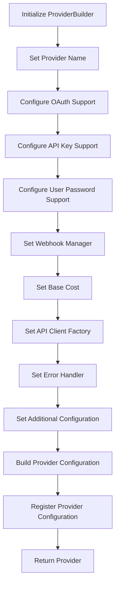

## 类结构

```
ProviderBuilder (Builder for provider configurations)
├── OAuthConfig (OAuth configuration)
├── BaseWebhooksManager (Base webhook manager)
├── Credentials (Credentials base class)
│   ├── APIKeyCredentials (API key credentials)
│   ├── UserPasswordCredentials (User password credentials)
├── BlockCost (Block cost)
├── BlockCostType (Block cost type)
└── Provider (Provider base class)
```

## 全局变量及字段


### `logger`
    
Logger instance for the module.

类型：`logging.Logger`
    


### `Settings`
    
Settings class for retrieving configuration settings.

类型：`backend.util.settings.Settings`
    


### `ProviderBuilder.name`
    
Name of the provider being built.

类型：`str`
    


### `ProviderBuilder._oauth_config`
    
OAuth configuration for the provider.

类型：`Optional[OAuthConfig]`
    


### `ProviderBuilder._webhook_manager`
    
Webhook manager class for the provider.

类型：`Optional[Type[BaseWebhooksManager]]`
    


### `ProviderBuilder._default_credentials`
    
Default credentials for the provider.

类型：`List[Credentials]`
    


### `ProviderBuilder._base_costs`
    
Base costs for all blocks using the provider.

类型：`List[BlockCost]`
    


### `ProviderBuilder._supported_auth_types`
    
Supported authentication types for the provider.

类型：`set[CredentialsType]`
    


### `ProviderBuilder._api_client_factory`
    
API client factory for the provider.

类型：`Optional[Callable]`
    


### `ProviderBuilder._error_handler`
    
Error handler for provider-specific errors.

类型：`Optional[Callable[[Exception], str]]`
    


### `ProviderBuilder._default_scopes`
    
Default scopes for the OAuth configuration.

类型：`Optional[List[str]]`
    


### `ProviderBuilder._client_id_env_var`
    
Environment variable name for the client ID.

类型：`Optional[str]`
    


### `ProviderBuilder._client_secret_env_var`
    
Environment variable name for the client secret.

类型：`Optional[str]`
    


### `ProviderBuilder._extra_config`
    
Additional configuration options for the provider.

类型：`dict`
    
    

## 全局函数及方法


### `ProviderBuilder.__init__`

This method initializes a new instance of the `ProviderBuilder` class, setting up the initial configuration for creating provider configurations.

参数：

- `name`：`str`，The name of the provider being built. This is used to generate environment variable names and other identifiers.

返回值：无

#### 流程图

```mermaid
classDiagram
    ProviderBuilder <|-- OAuthConfig
    ProviderBuilder <|-- BaseWebhooksManager
    ProviderBuilder <|-- AutoRegistry
    ProviderBuilder <|-- Provider

    ProviderBuilder {
        name
        _oauth_config
        _webhook_manager
        _default_credentials
        _base_costs
        _supported_auth_types
        _api_client_factory
        _error_handler
        _default_scopes
        _client_id_env_var
        _client_secret_env_var
        _extra_config
    }

    ProviderBuilder {
        +__init__(name: str)
        +with_oauth(handler_class: Type[BaseOAuthHandler], scopes: Optional[List[str]], client_id_env_var: Optional[str], client_secret_env_var: Optional[str])
        +with_api_key(env_var_name: str, title: str)
        +with_api_key_from_settings(settings_attr: str, title: str)
        +with_user_password(username_env_var: str, password_env_var: str, title: str)
        +with_webhook_manager(manager_class: Type[BaseWebhooksManager])
        +with_base_cost(amount: int, cost_type: BlockCostType)
        +with_api_client(factory: Callable)
        +with_error_handler(handler: Callable[[Exception], str])
        +with_config(**kwargs)
        +build(): Provider
    }
```

#### 带注释源码

```python
"""
Builder class for creating provider configurations with a fluent API.
"""

import logging
import os
from typing import Callable, List, Optional, Type

from pydantic import SecretStr

from backend.data.block import BlockCost, BlockCostType
from backend.data.model import (
    APIKeyCredentials,
    Credentials,
    CredentialsType,
    UserPasswordCredentials,
)
from backend.integrations.oauth.base import BaseOAuthHandler
from backend.integrations.webhooks._base import BaseWebhooksManager
from backend.sdk.provider import OAuthConfig, Provider
from backend.sdk.registry import AutoRegistry
from backend.util.settings import Settings

logger = logging.getLogger(__name__)

class ProviderBuilder:
    """Builder for creating provider configurations."""

    def __init__(self, name: str):
        self.name = name
        self._oauth_config: Optional[OAuthConfig] = None
        self._webhook_manager: Optional[Type[BaseWebhooksManager]] = None
        self._default_credentials: List[Credentials] = []
        self._base_costs: List[BlockCost] = []
        self._supported_auth_types: set[CredentialsType] = set()
        self._api_client_factory: Optional[Callable] = None
        self._error_handler: Optional[Callable[[Exception], str]] = None
        self._default_scopes: Optional[List[str]] = None
        self._client_id_env_var: Optional[str] = None
        self._client_secret_env_var: Optional[str] = None
        self._extra_config: dict = {}
```


### `ProviderBuilder.with_oauth`

Add OAuth support to the provider configuration.

参数：

- `handler_class`：`Type[BaseOAuthHandler]`，The OAuth handler class to use for the provider.
- `scopes`：`Optional[List[str]]`，Optional list of scopes to request from the OAuth provider.
- `client_id_env_var`：`Optional[str]`，Optional environment variable name for the client ID.
- `client_secret_env_var`：`Optional[str]`，Optional environment variable name for the client secret.

返回值：`ProviderBuilder`，The updated `ProviderBuilder` instance with OAuth support added.

#### 流程图

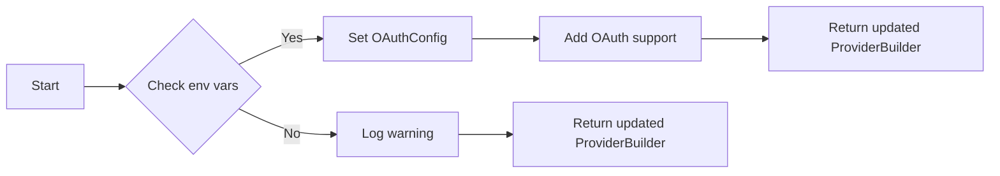

#### 带注释源码

```python
def with_oauth(
    self,
    handler_class: Type[BaseOAuthHandler],
    scopes: Optional[List[str]] = None,
    client_id_env_var: Optional[str] = None,
    client_secret_env_var: Optional[str] = None,
) -> "ProviderBuilder":
    """Add OAuth support."""
    if not client_id_env_var or not client_secret_env_var:
        client_id_env_var = f"{self.name}_client_id".upper()
        client_secret_env_var = f"{self.name}_client_secret".upper()

    if os.getenv(client_id_env_var) and os.getenv(client_secret_env_var):
        self._client_id_env_var = client_id_env_var
        self._client_secret_env_var = client_secret_env_var

        self._oauth_config = OAuthConfig(
            oauth_handler=handler_class,
            scopes=scopes,
            client_id_env_var=client_id_env_var,
            client_secret_env_var=client_secret_env_var,
        )
        self._supported_auth_types.add("oauth2")
    else:
        logger.warning(
            f"Provider {self.name.upper()} implements OAuth but the required env "
            f"vars {client_id_env_var} and {client_secret_env_var} are not both set"
        )
    return self
```


### `ProviderBuilder.with_api_key`

This method adds API key support to the provider configuration by using an environment variable to store the API key.

参数：

- `env_var_name`：`str`，The name of the environment variable that contains the API key.
- `title`：`str`，The title of the API key.

返回值：`ProviderBuilder`，The updated `ProviderBuilder` instance.

#### 流程图

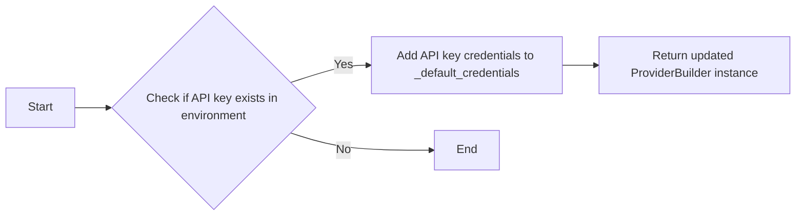

#### 带注释源码

```python
def with_api_key(self, env_var_name: str, title: str) -> "ProviderBuilder":
    """Add API key support with environment variable name."""
    self._supported_auth_types.add("api_key")

    # Register the API key mapping
    AutoRegistry.register_api_key(self.name, env_var_name)

    # Check if API key exists in environment
    api_key = os.getenv(env_var_name)
    if api_key:
        self._default_credentials.append(
            APIKeyCredentials(
                id=f"{self.name}-default",
                provider=self.name,
                api_key=SecretStr(api_key),
                title=title,
            )
        )
    return self
```


### `ProviderBuilder.with_api_key_from_settings`

This method is used to add API key support by retrieving the API key from the settings object.

参数：

- `settings_attr`：`str`，The attribute name within the settings object to retrieve the API key from.
- `title`：`str`，The title of the API key.

返回值：`ProviderBuilder`，The updated `ProviderBuilder` instance.

#### 流程图

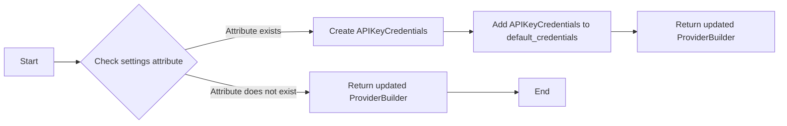

#### 带注释源码

```python
def with_api_key_from_settings(self, settings_attr: str, title: str) -> "ProviderBuilder":
    """Use existing API key from settings."""
    self._supported_auth_types.add("api_key")

    # Try to get the API key from settings
    settings = Settings()
    api_key = getattr(settings.secrets, settings_attr, None)
    if api_key:
        self._default_credentials.append(
            APIKeyCredentials(
                id=f"{self.name}-default",
                provider=self.name,
                api_key=api_key,
                title=title,
            )
        )
    return self
```


### `ProviderBuilder.with_user_password`

This method adds username/password support to the provider configuration using environment variable names.

参数：

- `username_env_var`：`str`，The environment variable name for the username.
- `password_env_var`：`str`，The environment variable name for the password.
- `title`：`str`，The title of the credentials.

返回值：`ProviderBuilder`，The updated `ProviderBuilder` instance.

#### 流程图

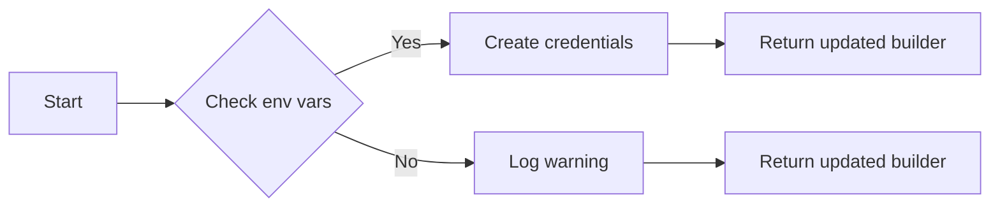

#### 带注释源码

```python
def with_user_password(
    self, username_env_var: str, password_env_var: str, title: str
) -> "ProviderBuilder":
    """Add username/password support with environment variable names."""
    self._supported_auth_types.add("user_password")

    # Check if credentials exist in environment
    username = os.getenv(username_env_var)
    password = os.getenv(password_env_var)
    if username and password:
        self._default_credentials.append(
            UserPasswordCredentials(
                id=f"{self.name}-default",
                provider=self.name,
                username=SecretStr(username),
                password=SecretStr(password),
                title=title,
            )
        )
    return self
```


### `ProviderBuilder.with_webhook_manager`

This method registers a webhook manager for the provider being configured.

参数：

- `manager_class`：`Type[BaseWebhooksManager]`，The class of the webhook manager to be registered for the provider.

返回值：`ProviderBuilder`，The instance of `ProviderBuilder` for chaining method calls.

#### 流程图

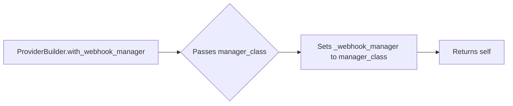

#### 带注释源码

```python
def with_webhook_manager(self, manager_class: Type[BaseWebhooksManager]) -> "ProviderBuilder":
    """Register webhook manager for this provider."""
    self._webhook_manager = manager_class
    return self
```


### `ProviderBuilder.with_base_cost`

Set base cost for all blocks using this provider.

参数：

- `amount`：`int`，The amount of the base cost.
- `cost_type`：`BlockCostType`，The type of the base cost.

返回值：`ProviderBuilder`，The instance of `ProviderBuilder` for further configuration.

#### 流程图

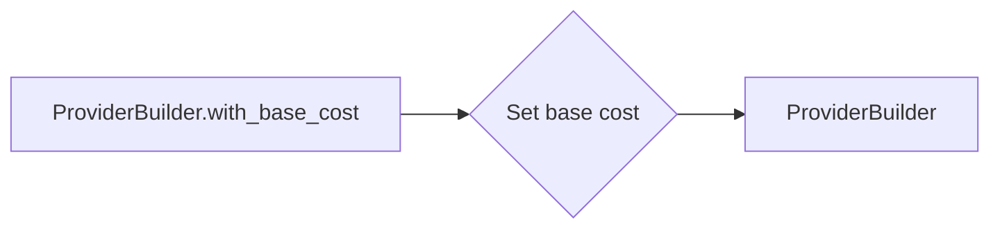

#### 带注释源码

```python
def with_base_cost(self, amount: int, cost_type: BlockCostType) -> "ProviderBuilder":
    """Set base cost for all blocks using this provider."""
    self._base_costs.append(BlockCost(cost_amount=amount, cost_type=cost_type))
    return self
```


### `ProviderBuilder.with_api_client`

This method registers an API client factory to be used when building the provider configuration.

参数：

- `factory`：`Callable`，A callable that returns an instance of the API client.

返回值：`ProviderBuilder`，The builder instance itself, allowing for further configuration.

#### 流程图

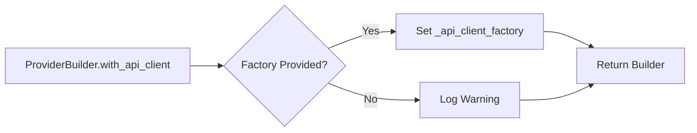

#### 带注释源码

```python
def with_api_client(self, factory: Callable) -> "ProviderBuilder":
    """Register API client factory."""
    self._api_client_factory = factory
    return self
```


### `ProviderBuilder.with_error_handler`

Register error handler for provider-specific errors.

参数：

- `handler`：`Callable[[Exception], str]`，A function that takes an exception and returns a string message.

返回值：`ProviderBuilder`，The updated `ProviderBuilder` instance.

#### 流程图

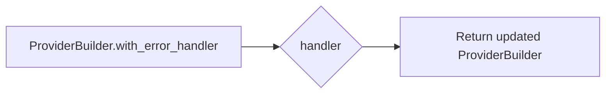

#### 带注释源码

```python
def with_error_handler(self, handler: Callable[[Exception], str]) -> "ProviderBuilder":
    """Register error handler for provider-specific errors."""
    self._error_handler = handler
    return self
```


### `ProviderBuilder.with_config`

This method allows adding additional configuration options to the provider configuration being built.

参数：

- `**kwargs`：`dict`，Additional configuration options to be added to the provider configuration.

返回值：`ProviderBuilder`，The `ProviderBuilder` instance with the additional configuration options applied.

#### 流程图

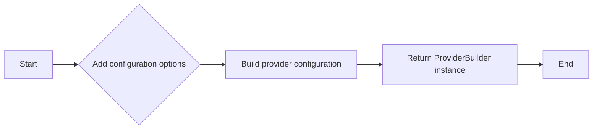

#### 带注释源码

```python
def with_config(self, **kwargs) -> "ProviderBuilder":
    """Add additional configuration options."""
    self._extra_config.update(kwargs)
    return self
```


### `ProviderBuilder.build`

Build and register the provider configuration.

参数：

- `self`：`ProviderBuilder`，The instance of the ProviderBuilder class.
- ...

返回值：`Provider`，A Provider object representing the built configuration.

#### 流程图

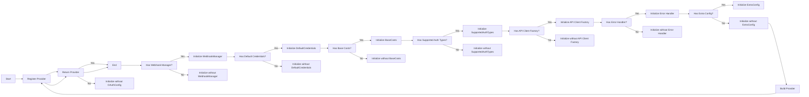

#### 带注释源码

```python
def build(self) -> Provider:
    """Build and register the provider configuration."""
    provider = Provider(
        name=self.name,
        oauth_config=self._oauth_config,
        webhook_manager=self._webhook_manager,
        default_credentials=self._default_credentials,
        base_costs=self._base_costs,
        supported_auth_types=self._supported_auth_types,
        api_client_factory=self._api_client_factory,
        error_handler=self._error_handler,
        **self._extra_config,
    )

    # Auto-registration happens here
    AutoRegistry.register_provider(provider)
    return provider
```


## 关键组件


### 张量索引与惰性加载

用于在构建提供者配置时，延迟加载张量索引，以优化内存使用和提高性能。

### 反量化支持

提供反量化功能，允许在构建过程中对量化策略进行优化，以适应不同的硬件和性能需求。

### 量化策略

实现量化策略，用于调整模型参数的精度，以优化模型大小和推理速度。


## 问题及建议


### 已知问题

-   **环境变量依赖**: 代码中大量使用环境变量来获取配置信息，这可能导致配置管理复杂且容易出错。如果环境变量未设置或设置错误，可能会导致服务启动失败或运行时错误。
-   **日志警告**: 当环境变量未设置时，代码会记录警告日志。这可能导致日志中包含大量无关信息，影响日志的可读性。
-   **硬编码**: 代码中存在硬编码的字符串，如环境变量名称的构造方式。这降低了代码的可维护性和可读性。
-   **类型注解**: 代码中缺少对一些方法的类型注解，这可能导致在使用类型检查工具时出现错误。

### 优化建议

-   **配置管理**: 引入配置管理工具或库，如`python-decouple`或`configparser`，来集中管理配置，减少对环境变量的依赖。
-   **日志记录**: 优化日志记录策略，避免记录无关信息，提高日志的可读性。
-   **减少硬编码**: 将硬编码的字符串移至配置文件或常量中，提高代码的可维护性和可读性。
-   **添加类型注解**: 为所有方法添加类型注解，确保代码的健壮性和可维护性。
-   **异常处理**: 增加异常处理逻辑，确保在配置信息缺失或错误时，程序能够优雅地处理异常情况。
-   **代码复用**: 考虑将一些重复的代码片段提取为独立的函数或类，提高代码的复用性和可维护性。
-   **单元测试**: 编写单元测试来验证代码的功能和配置的正确性，确保代码的质量。


## 其它


### 设计目标与约束

- 设计目标：
  - 提供一个灵活且可扩展的API，用于创建和管理不同类型的提供商配置。
  - 支持多种认证方式，包括OAuth2、API密钥和用户密码。
  - 允许配置额外的Webhook管理器和错误处理程序。
  - 确保配置的配置信息安全，特别是敏感信息如API密钥和密码。

- 约束：
  - 必须使用环境变量来存储敏感信息，如OAuth客户端ID和密钥。
  - 配置信息必须符合Pydantic模型的要求，以确保数据的有效性和一致性。
  - 提供商配置必须能够自动注册到注册表中，以便于管理和使用。

### 错误处理与异常设计

- 错误处理：
  - 使用Python的`logging`模块记录错误和警告信息。
  - 在配置过程中，如果环境变量未设置或配置信息不完整，将记录警告并继续执行。
  - 如果发生异常，将调用注册的错误处理程序，如果没有注册，则记录异常信息。

- 异常设计：
  - 定义自定义异常类，用于处理特定的配置错误或异常情况。
  - 异常类应提供清晰的错误信息和堆栈跟踪，以便于调试和问题解决。

### 数据流与状态机

- 数据流：
  - 用户通过调用`ProviderBuilder`的方法逐步构建提供商配置。
  - 配置信息通过方法参数传递，并在内部状态中累积。
  - 最终，通过`build`方法创建`Provider`对象，并将其注册到注册表中。

- 状态机：
  - `ProviderBuilder`类不包含显式的状态机，但其方法调用顺序定义了构建过程的流程。
  - 每个方法都可能导致内部状态的改变，最终在`build`方法中完成配置的创建和注册。

### 外部依赖与接口契约

- 外部依赖：
  - `pydantic`用于数据验证和模型定义。
  - `logging`用于错误和日志记录。
  - `os`用于访问环境变量。
  - `backend`模块包含数据模型、集成和工具类。

- 接口契约：
  - `BaseOAuthHandler`和`BaseWebhooksManager`是抽象基类，定义了集成和Webhook管理的接口。
  - `Provider`类定义了提供商配置的接口，包括认证、Webhook管理和错误处理。
  - `AutoRegistry`类负责自动注册和查找提供商配置。


    