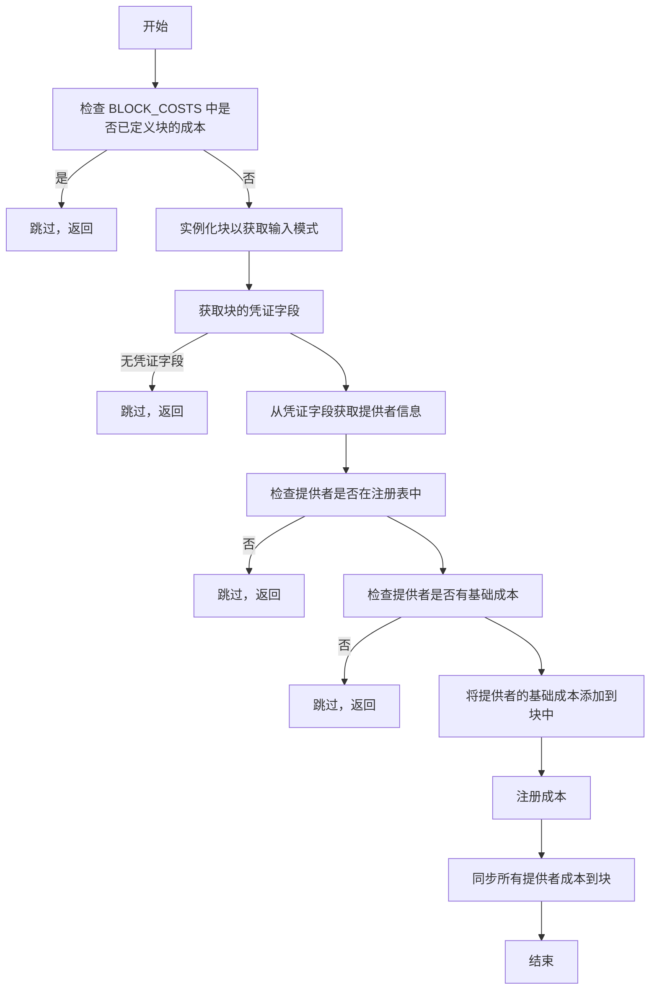
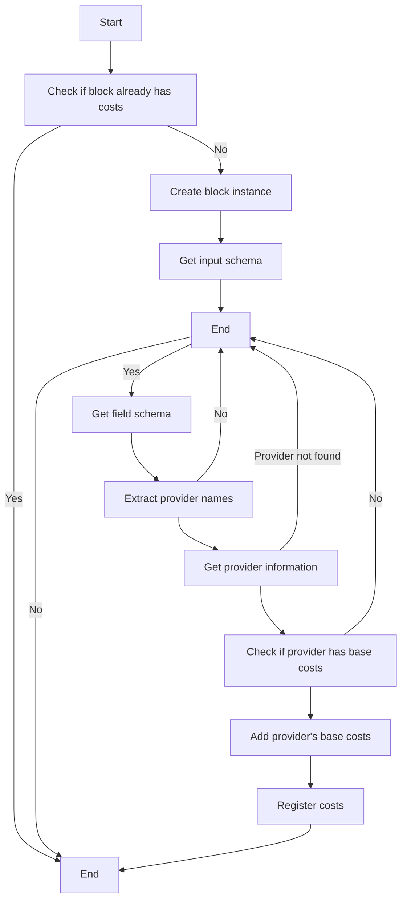
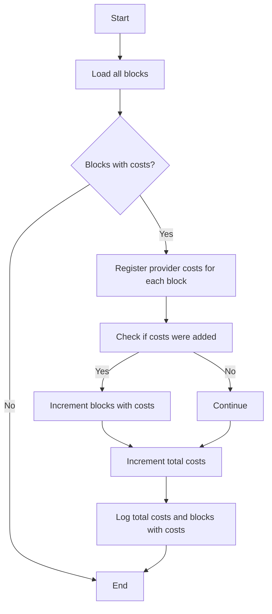
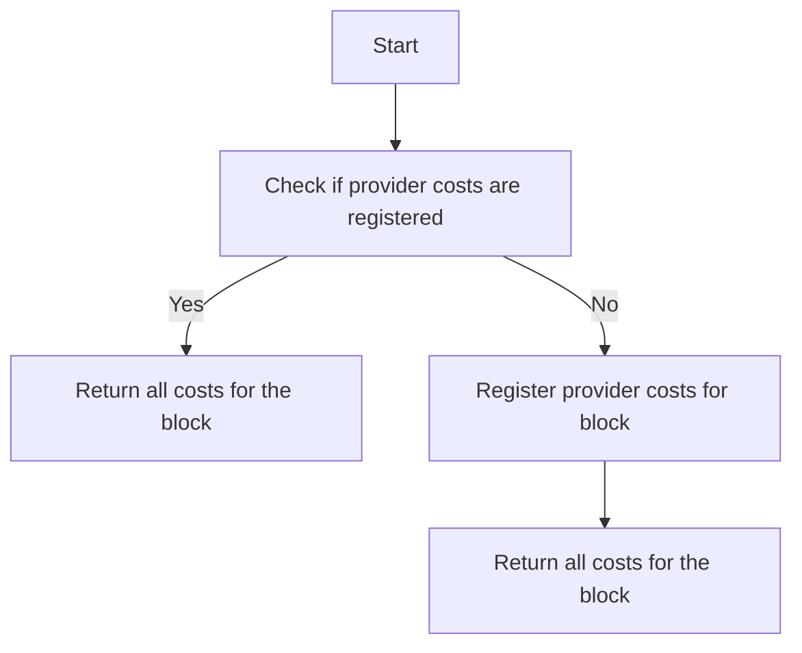
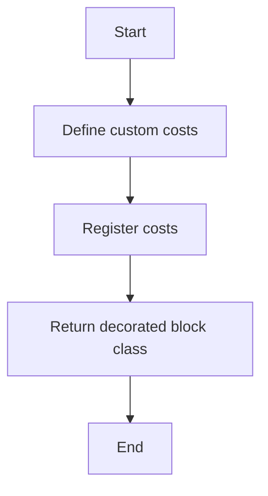
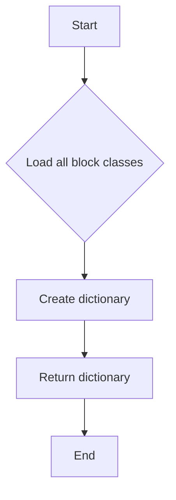
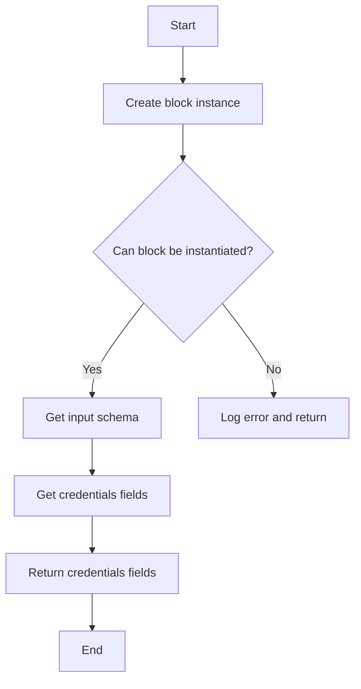
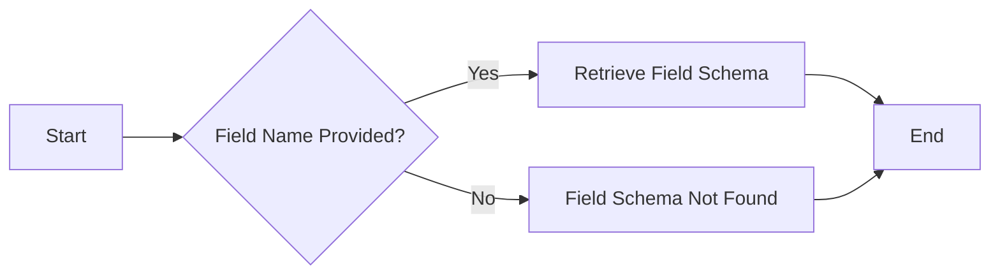
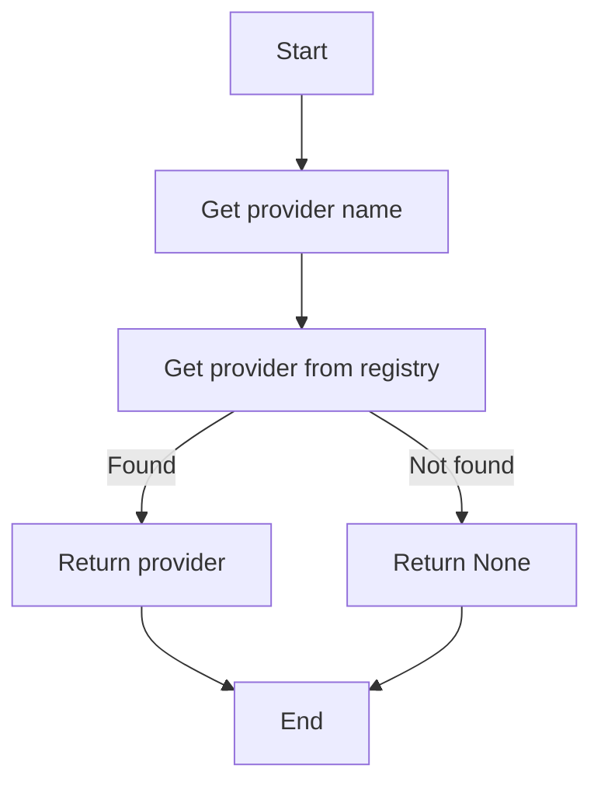

# `.\AutoGPT\autogpt_platform\backend\backend\sdk\cost_integration.py` 详细设计文档

This module integrates SDK provider costs with the execution cost system, allowing for the registration and synchronization of base costs for blocks.

## 整体流程



## 类结构

```
ProviderCostsIntegration (模块)
├── register_provider_costs_for_block (函数)
│   ├── block_class (参数)
│   ├── input_schema (变量)
│   ├── credentials_fields (变量)
│   ├── field_schema (变量)
│   ├── providers (变量)
│   ├── provider (变量)
│   ├── block_costs (变量)
│   └── BLOCK_COSTS (全局变量)
├── sync_all_provider_costs (函数)
│   ├── load_all_blocks (函数)
│   ├── block_id (变量)
│   ├── block_class (变量)
│   ├── initial_count (变量)
│   ├── final_count (变量)
│   └── BLOCK_COSTS (全局变量)
├── get_block_costs (函数)
│   ├── block_class (参数)
│   └── BLOCK_COSTS (全局变量)
└── cost (装饰器)
    ├── costs (参数)
    └── BLOCK_COSTS (全局变量)
```

## 全局变量及字段


### `logger`
    
Logger instance for logging messages.

类型：`logging.Logger`
    


### `BLOCK_COSTS`
    
Dictionary mapping block classes to their associated costs.

类型：`dict[Type[Block], List[BlockCost]]`
    


### `Block.input_schema`
    
Input schema for the block.

类型：`InputSchema`
    


### `BlockCost.cost_type`
    
Type of cost associated with the block.

类型：`BlockCostType`
    


### `BlockCost.cost_amount`
    
Amount of the cost associated with the block.

类型：`float`
    


### `BlockCost.cost_filter`
    
Filter criteria for the cost associated with the block.

类型：`dict`
    


### `Block.Block.input_schema`
    
Input schema for the block.

类型：`InputSchema`
    


### `BlockCost.BlockCost.cost_type`
    
Type of cost associated with the block.

类型：`BlockCostType`
    


### `BlockCost.BlockCost.cost_amount`
    
Amount of the cost associated with the block.

类型：`float`
    


### `BlockCost.BlockCost.cost_filter`
    
Filter criteria for the cost associated with the block.

类型：`dict`
    
    

## 全局函数及方法


### register_provider_costs_for_block

Register provider base costs for a specific block in BLOCK_COSTS.

参数：

- `block_class`：`Type[Block]`，The block class to register costs for

返回值：`None`，No return value, the function modifies the BLOCK_COSTS dictionary

#### 流程图



#### 带注释源码

```python
def register_provider_costs_for_block(block_class: Type[Block]) -> None:
    """
    Register provider base costs for a specific block in BLOCK_COSTS.

    Args:
        block_class: The block class to register costs for
    """
    # Skip if block already has custom costs defined
    if block_class in BLOCK_COSTS:
        logger.debug(
            f"Block {block_class.__name__} already has costs defined, skipping provider costs"
        )
        return

    # Get the block's input schema
    # We need to instantiate the block to get its input schema
    try:
        block_instance = block_class()
        input_schema = block_instance.input_schema
    except Exception as e:
        logger.debug(f"Block {block_class.__name__} cannot be instantiated: {e}")
        return

    # Look for credentials fields
    # The cost system works of filtering on credentials fields,
    # without credentials fields, we can not apply costs
    # TODO: Improve cost system to allow for costs witout a provider
    credentials_fields = input_schema.get_credentials_fields()
    if not credentials_fields:
        logger.debug(f"Block {block_class.__name__} has no credentials fields")
        return

    # Get provider information from credentials fields
    for field_name, field_info in credentials_fields.items():
        # Get the field schema to extract provider information
        field_schema = input_schema.get_field_schema(field_name)

        # Extract provider names from json_schema_extra
        providers = field_schema.get("credentials_provider", [])
        if not providers:
            continue

        # For each provider, check if it has base costs
        block_costs: List[BlockCost] = []
        for provider_name in providers:
            provider = AutoRegistry.get_provider(provider_name)
            if not provider:
                logger.debug(f"Provider {provider_name} not found in registry")
                continue

            # Add provider's base costs to the block
            if provider.base_costs:
                logger.debug(
                    f"Registering {len(provider.base_costs)} base costs from provider {provider_name} for block {block_class.__name__}"
                )
                block_costs.extend(provider.base_costs)

        # Register costs if any were found
        if block_costs:
            BLOCK_COSTS[block_class] = block_costs
            logger.debug(
                f"Registered {len(block_costs)} total costs for block {block_class.__name__}"
            )
```


### sync_all_provider_costs

Sync all provider base costs to blocks that use them.

参数：

- 无

返回值：`None`，No return value, this function is used to synchronize costs and does not return any value.

#### 流程图



#### 带注释源码

```python
def sync_all_provider_costs() -> None:
    """
    Sync all provider base costs to blocks that use them.

    This should be called after all providers and blocks are registered,
    typically during application startup.
    """
    from backend.blocks import load_all_blocks

    logger.info("Syncing provider costs to blocks...")

    blocks_with_costs = 0
    total_costs = 0

    for block_id, block_class in load_all_blocks().items():
        initial_count = len(BLOCK_COSTS.get(block_class, []))
        register_provider_costs_for_block(block_class)
        final_count = len(BLOCK_COSTS.get(block_class, []))

        if final_count > initial_count:
            blocks_with_costs += 1
            total_costs += final_count - initial_count

    logger.info(f"Synced {total_costs} costs to {blocks_with_costs} blocks")
```


### get_block_costs

Get all costs for a block, including both explicit and provider costs.

参数：

- `block_class`：`Type[Block]`，The block class to get costs for

返回值：`List[BlockCost]`，List of BlockCost objects for the block

#### 流程图



#### 带注释源码

```python
def get_block_costs(block_class: Type[Block]) -> List[BlockCost]:
    """
    Get all costs for a block, including both explicit and provider costs.

    Args:
        block_class: The block class to get costs for

    Returns:
        List of BlockCost objects for the block
    """
    # First ensure provider costs are registered
    register_provider_costs_for_block(block_class)

    # Return all costs for the block
    return BLOCK_COSTS.get(block_class, [])
```


### `cost(*costs: BlockCost)`

Decorator to set custom costs for a block.

参数：

- `*costs`：`BlockCost`，Variable number of BlockCost objects. This allows blocks to define their own costs, which will override any provider base costs. Multiple costs can be specified with different filters for different pricing tiers (e.g., different models).

返回值：`Type[Block]`，The decorated block class with custom costs registered.

#### 流程图



#### 带注释源码

```python
def cost(*costs: BlockCost):
    """
    Decorator to set custom costs for a block.

    Args:
        *costs: Variable number of BlockCost objects

    Returns:
        Type[Block]: The decorated block class with custom costs registered
    """

    def decorator(block_class: Type[Block]) -> Type[Block]:
        # Register the costs for this block
        if costs:
            BLOCK_COSTS[block_class] = list(costs)
            logger.info(
                f"Registered {len(costs)} custom costs for block {block_class.__name__}"
            )
        return block_class

    return decorator
```


### `load_all_blocks`

This function retrieves all block classes that are registered and returns a dictionary mapping block IDs to their corresponding block classes.

参数：

- `*block_classes`: Variable number of `Type[Block]` objects representing the block classes to load. This parameter is not explicitly defined in the code, but it is inferred from the context that `load_all_blocks` is called with `load_all_blocks().items()`.

返回值：`dict`，A dictionary mapping block IDs to their corresponding block classes.

#### 流程图



#### 带注释源码

```python
def load_all_blocks() -> dict:
    # This function is not defined in the provided code, but it is referenced in the sync_all_provider_costs function.
    # It is assumed to be part of the backend.blocks module and returns a dictionary mapping block IDs to their corresponding block classes.
    pass
```

由于 `load_all_blocks` 函数在提供的代码中未定义，以上流程图和源码是基于其预期功能的假设。


### `Block.get_credentials_fields`

This method retrieves the credentials fields from the input schema of a block.

参数：

- `block_class`：`Type[Block]`，The block class to get the credentials fields for. This parameter specifies the block class for which the credentials fields are to be retrieved.

返回值：`List[dict]`，A list of dictionaries representing the credentials fields of the block. Each dictionary contains the field name and its information.

#### 流程图



#### 带注释源码

```python
def get_credentials_fields(self) -> List[dict]:
    """
    Retrieve the credentials fields from the input schema of the block.

    Returns:
        List[dict]: A list of dictionaries representing the credentials fields of the block.
    """
    # Retrieve the input schema of the block
    input_schema = self.input_schema

    # Get the credentials fields from the input schema
    credentials_fields = input_schema.get_credentials_fields()

    # Return the credentials fields
    return credentials_fields
```


### `Block.get_field_schema`

This method retrieves the schema for a specific field within a block's input schema.

参数：

- `field_name`：`str`，The name of the field for which to retrieve the schema.
- ...

返回值：`dict`，The schema for the specified field, including information about the field's structure and constraints.

#### 流程图



#### 带注释源码

```python
def get_field_schema(self, field_name: str) -> dict:
    """
    Retrieve the schema for a specific field within the block's input schema.

    Args:
        field_name: The name of the field for which to retrieve the schema.

    Returns:
        dict: The schema for the specified field, including information about the field's structure and constraints.
    """
    # Retrieve the input schema for the block
    input_schema = self.input_schema

    # Get the field schema from the input schema
    field_schema = input_schema.get(field_name)

    # Return the field schema if it exists, otherwise return None
    return field_schema if field_schema is not None else None
```


### AutoRegistry.get_provider

This function retrieves the provider information from the registry based on the provider name.

参数：

- `provider_name`：`str`，The name of the provider to retrieve information for.

返回值：`Provider`，The provider object if found, otherwise `None`.

#### 流程图



#### 带注释源码

```python
def get_provider(provider_name: str) -> 'Provider':
    """
    Retrieve the provider information from the registry based on the provider name.

    Args:
        provider_name: The name of the provider to retrieve information for.

    Returns:
        The provider object if found, otherwise None.
    """
    # Retrieve provider from registry
    provider = registry.get(provider_name)

    # Return provider if found, otherwise return None
    return provider
```


## 关键组件


### 张量索引与惰性加载

张量索引与惰性加载是代码中用于处理数据块索引和延迟加载的关键组件。它允许在需要时才加载数据，从而提高性能和资源利用率。

### 反量化支持

反量化支持是代码中用于处理量化策略的关键组件。它允许在执行过程中动态调整量化参数，以适应不同的计算需求。

### 量化策略

量化策略是代码中用于优化计算性能的关键组件。它通过减少数据类型的大小来降低内存使用和计算成本，同时保持精度。


## 问题及建议


### 已知问题

-   **代码重复**：`register_provider_costs_for_block` 函数中多次检查 `block_class` 是否已存在于 `BLOCK_COSTS` 中，这可以合并为一个检查。
-   **异常处理**：在尝试实例化 `block_class` 时，如果发生异常，则直接返回，没有进一步的错误处理逻辑。
-   **日志记录**：日志记录可能过于详细，对于生产环境可能需要更精细的日志级别控制。
-   **性能问题**：`sync_all_provider_costs` 函数在启动时同步所有提供者的成本，这可能是一个性能瓶颈，特别是在有大量块和提供者的情况下。
-   **代码可读性**：代码中存在一些缩进不一致和注释不足的地方，这可能会影响代码的可读性。

### 优化建议

-   **合并检查**：将 `register_provider_costs_for_block` 函数中的重复检查合并为一个检查，以减少代码重复。
-   **增强异常处理**：在捕获异常后，可以添加额外的逻辑来处理错误，例如记录错误信息或尝试恢复。
-   **日志级别控制**：根据不同的环境（开发、测试、生产）调整日志级别，以避免在生产环境中输出过多不必要的日志。
-   **异步处理**：考虑使用异步处理来同步提供者的成本，以提高性能。
-   **代码格式化**：使用代码格式化工具来确保代码的一致性和可读性。
-   **文档化**：为代码添加更详细的文档注释，以提高代码的可维护性。
-   **单元测试**：编写单元测试来确保代码的正确性和稳定性。
-   **代码审查**：定期进行代码审查，以发现潜在的问题并提高代码质量。


## 其它


### 设计目标与约束

- **设计目标**:
  - 实现SDK提供者成本与执行成本系统之间的集成。
  - 自动注册具有基础成本的提供者成本。
  - 允许块定义自己的成本，以覆盖任何提供者基础成本。
  - 提供一个装饰器来设置块的成本。
- **约束**:
  - 块必须具有凭证字段才能应用成本。
  - 提供者必须在注册表中存在。
  - 成本配置必须在应用启动时同步。

### 错误处理与异常设计

- **错误处理**:
  - 如果块已定义自定义成本，则跳过提供者成本。
  - 如果无法实例化块，则记录调试信息并返回。
  - 如果块没有凭证字段，则记录调试信息并返回。
  - 如果提供者未在注册表中找到，则记录调试信息并继续处理其他提供者。
- **异常设计**:
  - 使用`try-except`块来捕获并处理可能发生的异常。
  - 使用`logger.debug`记录调试信息。

### 数据流与状态机

- **数据流**:
  - 从块类获取输入模式。
  - 从凭证字段中提取提供者信息。
  - 从提供者获取基础成本。
  - 将成本注册到`BLOCK_COSTS`字典中。
- **状态机**:
  - 无状态机，但流程包括检查、同步和注册步骤。

### 外部依赖与接口契约

- **外部依赖**:
  - `backend.data.block.Block`和`backend.data.block_cost_config.BLOCK_COSTS`。
  - `backend.sdk.registry.AutoRegistry`。
  - `backend.blocks.load_all_blocks`。
- **接口契约**:
  - `Block`类必须有一个`input_schema`属性，该属性包含一个`get_credentials_fields`方法。
  - `BlockCost`类定义了成本的结构。
  - `AutoRegistry`类用于获取提供者信息。


    