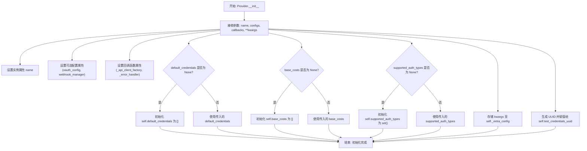
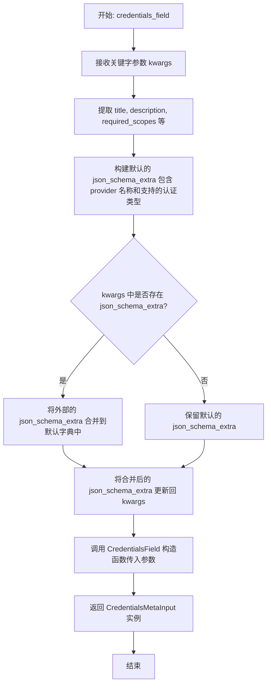
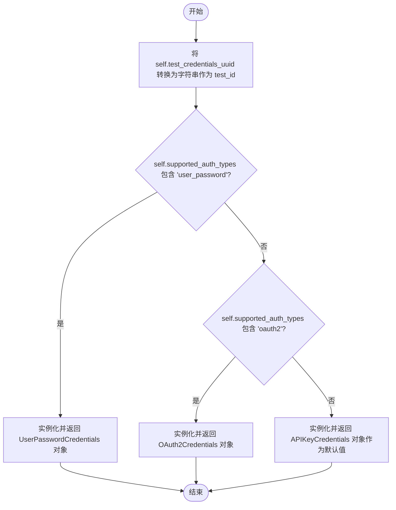
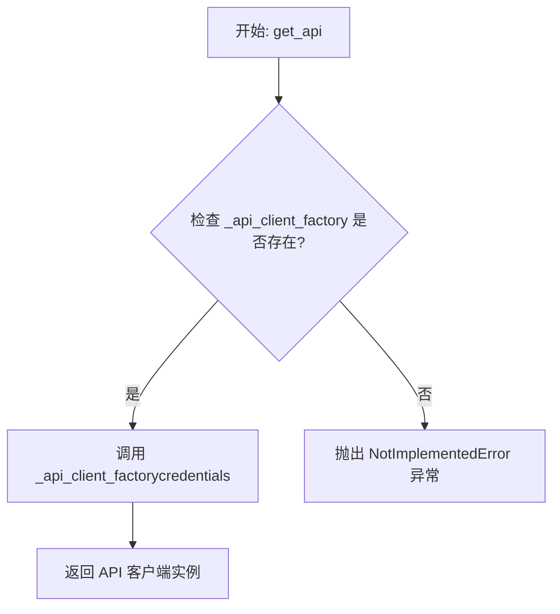
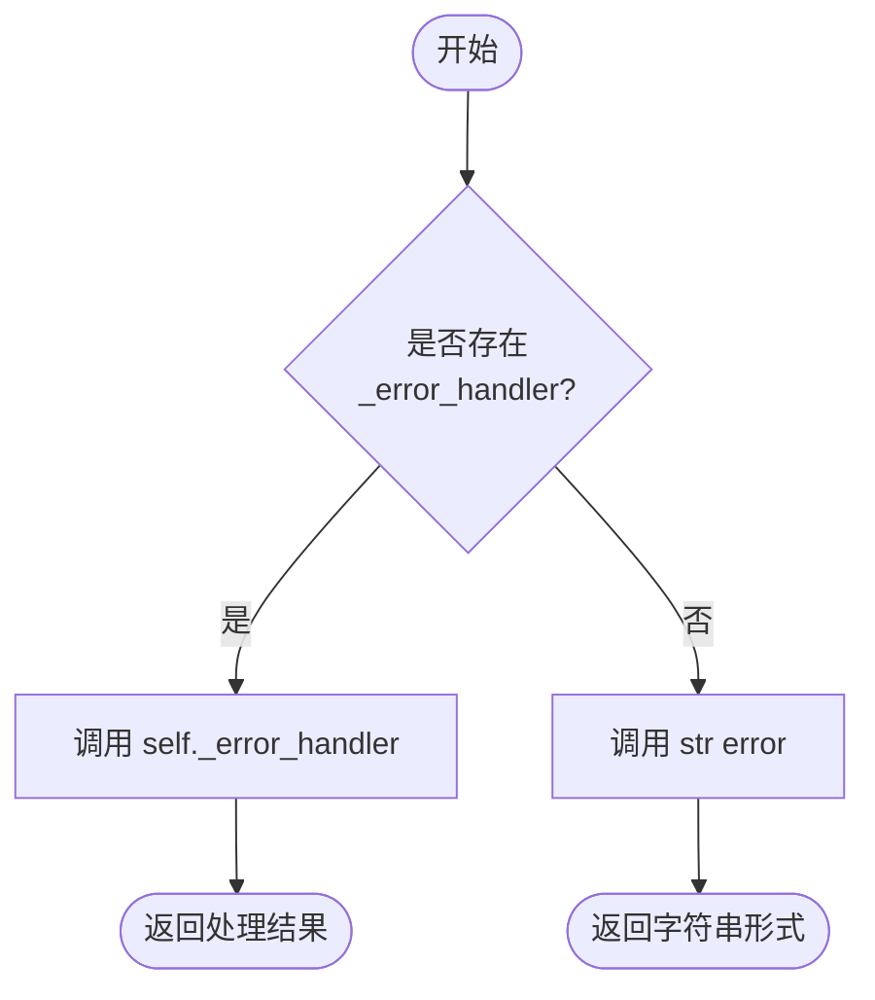
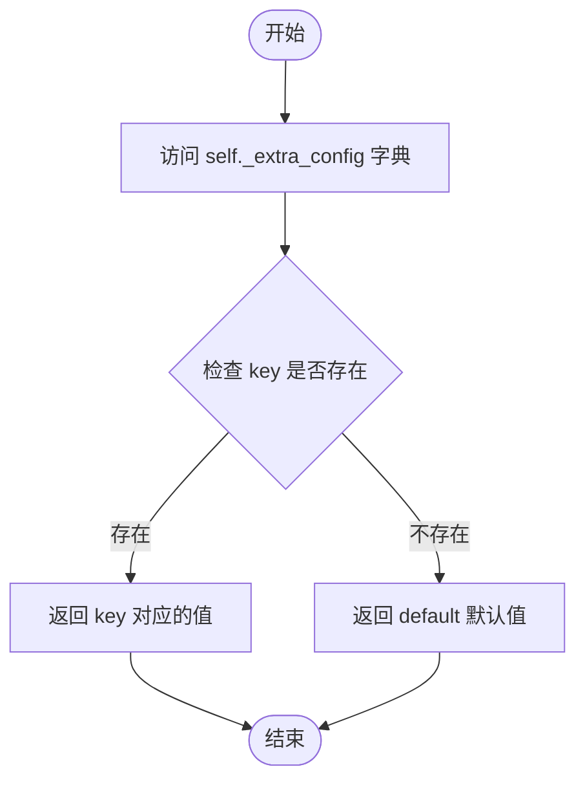

# `.\AutoGPT\autogpt_platform\backend\backend\sdk\provider.py` 详细设计文档

该代码定义了用于管理外部服务提供商集成的核心组件，包括OAuth配置类（OAuthConfig）和提供商管理类（Provider）。Provider类负责封装认证逻辑（支持OAuth2、API Key等）、生成测试凭证、管理Webhook处理、提供API客户端工厂以及处理特定于提供商的错误，为上层Block提供统一的集成接口。

## 整体流程

```mermaid
graph TD
    A[初始化 Provider] --> B[设置名称、OAuth配置、Webhook管理器等]
    B --> C[生成测试凭证 UUID]
    C --> D{调用方法}
    D -- credentials_field --> E[提取参数并构建 json_schema_extra]
    E --> F[实例化并返回 CredentialsField]
    D -- get_test_credentials --> G{检查支持的认证类型}
    G -- user_password --> H[返回 UserPasswordCredentials]
    G -- oauth2 --> I[返回 OAuth2Credentials]
    G -- 其他/默认 --> J[返回 APIKeyCredentials]
    D -- get_api --> K{工厂函数是否存在?}
    K -- 是 --> L[调用 _api_client_factory 返回客户端]
    K -- 否 --> M[抛出 NotImplementedError]
    D -- handle_error --> N{错误处理器是否存在?}
    N -- 是 --> O[调用 _error_handler 返回错误信息]
    N -- 否 --> P[返回 str(error)]
    D -- get_config --> Q[从 _extra_config 获取值]
```

## 类结构

```
OAuthConfig (Pydantic BaseModel)
└── Provider (核心管理类)
```

## 全局变量及字段


### `OAuthConfig.oauth_handler`
    
The handler class responsible for managing the OAuth authentication flow.

类型：`Type[BaseOAuthHandler]`
    


### `OAuthConfig.scopes`
    
A list of permission scopes requested during the OAuth authentication process.

类型：`Optional[List[str]]`
    


### `OAuthConfig.client_id_env_var`
    
The name of the environment variable that stores the OAuth client ID.

类型：`str`
    


### `OAuthConfig.client_secret_env_var`
    
The name of the environment variable that stores the OAuth client secret.

类型：`str`
    


### `Provider.name`
    
The unique name identifier for the provider (e.g., 'OpenAI', 'Linear').

类型：`str`
    


### `Provider.oauth_config`
    
Configuration object containing settings specific to OAuth authentication.

类型：`Optional[OAuthConfig]`
    


### `Provider.webhook_manager`
    
The manager class responsible for handling webhook events for this provider.

类型：`Optional[Type[BaseWebhooksManager]]`
    


### `Provider.default_credentials`
    
A list of default credential objects available for use with this provider.

类型：`Optional[List[Credentials]]`
    


### `Provider.base_costs`
    
A list of base costs associated with running blocks that utilize this provider.

类型：`Optional[List[BlockCost]]`
    


### `Provider.supported_auth_types`
    
A set of authentication types (e.g., 'oauth2', 'api_key') supported by the provider.

类型：`Optional[Set[CredentialsType]]`
    


### `Provider._api_client_factory`
    
A factory function used to instantiate an API client for given credentials.

类型：`Optional[Callable]`
    


### `Provider._error_handler`
    
An optional custom error handler function to process provider-specific exceptions.

类型：`Optional[Callable[[Exception], str]]`
    


### `Provider._extra_config`
    
A dictionary storing any additional configuration parameters passed to the provider.

类型：`dict`
    


### `Provider.test_credentials_uuid`
    
A unique identifier used to generate and track mock test credentials for the provider.

类型：`uuid.UUID`
    
    

## 全局函数及方法


### `Provider.__init__`

初始化Provider实例，配置提供者的名称、OAuth设置、Webhook管理器、默认凭据列表、基础成本结构、支持的认证类型以及API客户端工厂和错误处理器等回调函数。该方法还会处理额外的关键字参数配置，并为测试凭据生成唯一的UUID标识符，确保所有可变参数都有安全的默认值以防止引用共享问题。

参数：

-  `name`：`str`，提供者的名称标识符。
-  `oauth_config`：`Optional[OAuthConfig]`，OAuth认证的配置对象，包含处理器类、作用域和环境变量等。
-  `webhook_manager`：`Optional[Type[BaseWebhooksManager]]`，用于管理Webhook的类类型。
-  `default_credentials`：`Optional[List[Credentials]]`，提供者支持的默认凭据列表。
-  `base_costs`：`Optional[List[BlockCost]]`，使用该提供者产生的基础成本列表。
-  `supported_auth_types`：`Optional[Set[CredentialsType]]`，该提供者支持的认证类型集合。
-  `api_client_factory`：`Optional[Callable]`，用于创建API客户端实例的工厂函数。
-  `error_handler`：`Optional[Callable[[Exception], str]]`，用于处理特定提供者错误的函数，接收异常并返回字符串描述。
-  `**kwargs`：`dict`，任意额外的关键字参数，将被存储在内部配置字典中。

返回值：`None`，该方法为构造函数，不返回值。

#### 流程图



#### 带注释源码

```python
def __init__(
    self,
    name: str,
    oauth_config: Optional[OAuthConfig] = None,
    webhook_manager: Optional[Type[BaseWebhooksManager]] = None,
    default_credentials: Optional[List[Credentials]] = None,
    base_costs: Optional[List[BlockCost]] = None,
    supported_auth_types: Optional[Set[CredentialsType]] = None,
    api_client_factory: Optional[Callable] = None,
    error_handler: Optional[Callable[[Exception], str]] = None,
    **kwargs,
):
    # 设置提供者的核心名称
    self.name = name
    
    # 直接赋值配置对象和处理器类
    self.oauth_config = oauth_config
    self.webhook_manager = webhook_manager
    
    # 初始化列表和集合类型字段
    # 使用 'or []' 和 'or set()' 确保在未提供参数时使用新的空对象
    # 这避免了可变默认参数（Mutable Default Arguments）带来的潜在共享引用问题
    self.default_credentials = default_credentials or []
    self.base_costs = base_costs or []
    self.supported_auth_types = supported_auth_types or set()
    
    # 存储私有函数引用，用于后续API调用和错误处理
    self._api_client_factory = api_client_factory
    self._error_handler = error_handler

    # 将任何额外的关键字参数存储在内部字典中，以支持灵活的扩展配置
    self._extra_config = kwargs
    
    # 生成一个唯一的UUID，用于后续创建测试凭据
    self.test_credentials_uuid = uuid.uuid4()
```


### `Provider.credentials_field`

该方法用于生成并返回一个针对当前Provider配置的凭证字段对象。它会从传入的关键字参数中提取标准的凭证配置（如标题、描述、作用域等），并将Provider特定的元数据（如Provider名称和支持的认证类型）注入到JSON Schema的扩展信息中，最后实例化并返回一个`CredentialsMetaInput`对象。

参数：

- `**kwargs`：`dict`，用于配置凭证字段的额外关键字参数。支持`title`（标题）、`description`（描述）、`required_scopes`（必需权限范围）、`discriminator`（鉴别器）、`discriminator_mapping`（鉴别器映射）、`discriminator_values`（鉴别器值）以及`json_schema_extra`（额外JSON Schema信息）等键。

返回值：`CredentialsMetaInput`，配置好的`CredentialsField`实例，包含了Provider特定的凭证元数据。

#### 流程图



#### 带注释源码

```python
def credentials_field(self, **kwargs) -> CredentialsMetaInput:
    """Return a CredentialsField configured for this provider."""
    # 从 kwargs 中提取已知的 CredentialsField 参数
    # 如果未提供 title，则暂不处理，交由 CredentialsField 默认或后续逻辑
    title = kwargs.pop("title", None)
    # 如果未提供 description，则默认为 "{Provider名称} credentials"
    description = kwargs.pop("description", f"{self.name.title()} credentials")
    # 提取必需的权限范围，默认为空集合
    required_scopes = kwargs.pop("required_scopes", set())
    # 提取 Pydantic 多模型鉴别器相关参数
    discriminator = kwargs.pop("discriminator", None)
    discriminator_mapping = kwargs.pop("discriminator_mapping", None)
    discriminator_values = kwargs.pop("discriminator_values", None)

    # 创建 json_schema_extra 字典，注入 Provider 特定的元数据
    json_schema_extra = {
        # 关联当前 Provider 的名称
        "credentials_provider": [self.name],
        # 列出当前 Provider 支持的认证类型（如 oauth2, api_key 等）
        "credentials_types": (
            list(self.supported_auth_types) if self.supported_auth_types else []
        ),
    }

    # 如果调用方传入了自定义的 json_schema_extra，则将其合并
    if "json_schema_extra" in kwargs:
        json_schema_extra.update(kwargs.pop("json_schema_extra"))

    # 将处理好的 json_schema_extra 重新放回 kwargs
    kwargs["json_schema_extra"] = json_schema_extra

    # 实例化并返回 CredentialsField 对象
    return CredentialsField(
        required_scopes=required_scopes,
        discriminator=discriminator,
        discriminator_mapping=discriminator_mapping,
        discriminator_values=discriminator_values,
        title=title,
        description=description,
        **kwargs,
    )
```


### `Provider.get_test_credentials`

根据提供者支持的认证类型，获取用于测试的模拟凭据对象。

参数：

-  无

返回值：`Credentials`，返回一个包含模拟凭据数据的具体凭据实例（`UserPasswordCredentials`、`OAuth2Credentials` 或 `APIKeyCredentials`），其内容基于提供者名称和测试 UUID 生成。

#### 流程图



#### 带注释源码

```python
def get_test_credentials(self) -> Credentials:
    """Get test credentials for the provider based on supported auth types."""
    # 使用实例中预生成的 UUID 作为测试凭据的 ID
    test_id = str(self.test_credentials_uuid)

    # Return credentials based on the first supported auth type
    # 检查是否支持用户名密码认证
    if "user_password" in self.supported_auth_types:
        return UserPasswordCredentials(
            id=test_id,
            provider=self.name,  # 使用提供者的名称
            username=SecretStr(f"mock-{self.name}-username"),  # 生成模拟用户名
            password=SecretStr(f"mock-{self.name}-password"),  # 生成模拟密码
            title=f"Mock {self.name.title()} credentials",
        )
    # 检查是否支持 OAuth2 认证
    elif "oauth2" in self.supported_auth_types:
        return OAuth2Credentials(
            id=test_id,
            provider=self.name,
            username=f"mock-{self.name}-username",
            access_token=SecretStr(f"mock-{self.name}-access-token"), # 生成模拟访问令牌
            access_token_expires_at=None,
            refresh_token=SecretStr(f"mock-{self.name}-refresh-token"), # 生成模拟刷新令牌
            refresh_token_expires_at=None,
            scopes=[f"mock-{self.name}-scope"], # 生成模拟权限范围
            title=f"Mock {self.name.title()} OAuth credentials",
        )
    else:
        # 默认返回 API Key 认证凭据
        return APIKeyCredentials(
            id=test_id,
            provider=self.name,
            api_key=SecretStr(f"mock-{self.name}-api-key"), # 生成模拟 API Key
            title=f"Mock {self.name.title()} API key",
            expires_at=None,
        )
```


### `Provider.get_api`

根据提供的凭证获取 API 客户端实例。

参数：

- `credentials`：`Credentials`，用于认证和初始化 API 客户端的凭证对象。

返回值：`Any`，API 客户端实例，具体类型取决于注册的工厂函数实现。

#### 流程图



#### 带注释源码

```python
def get_api(self, credentials: Credentials) -> Any:
    """Get API client instance for the given credentials."""
    # 检查是否定义了 API 客户端工厂函数
    if self._api_client_factory:
        # 如果存在，调用工厂函数并传入凭证来创建 API 客户端实例
        return self._api_client_factory(credentials)
    # 如果未定义工厂函数，抛出未实现异常
    raise NotImplementedError(f"No API client factory registered for {self.name}")
```


### `Provider.handle_error`

Handle provider-specific errors.

参数：

- `error`：`Exception`，需要处理的异常对象。

返回值：`str`，处理后的错误信息，若未定义处理器则返回异常的默认字符串表示。

#### 流程图



#### 带注释源码

```python
def handle_error(self, error: Exception) -> str:
    """Handle provider-specific errors."""
    # 检查是否已注册自定义的错误处理器 _error_handler
    if self._error_handler:
        # 如果存在，调用该处理器并返回其结果
        return self._error_handler(error)
    # 否则，直接返回异常对象的字符串形式作为默认处理
    return str(error)
```


### `Provider.get_config`

该方法用于从提供商的额外配置字典（`_extra_config`）中检索指定键的值。如果键不存在，则返回默认值。

参数：

- `key`：`str`，要检索的配置值的键标识符。
- `default`：`Any`，如果在额外配置中未找到键时返回的值（默认为 None）。

返回值：`Any`，额外配置中与键关联的值，如果键不存在则返回默认值。

#### 流程图



#### 带注释源码

```python
    def get_config(self, key: str, default: Any = None) -> Any:
        """Get additional configuration value."""
        # 从内部存储的 _extra_config 字典中获取指定 key 的值。
        # 如果 key 不存在，则返回参数 default 提供的默认值。
        return self._extra_config.get(key, default)
```


## 关键组件


### OAuthConfig
用于封装OAuth2认证所需的处理器类、权限范围列表以及客户端ID和密钥的环境变量名的配置类。

### Provider
核心服务配置类，用于统一管理第三方服务的认证方式、默认凭据、成本、Webhook处理逻辑及API客户端工厂的创建。

### API Client Factory
一种策略模式组件，允许Provider通过注入的工厂函数根据提供的凭据动态生成特定服务的API客户端实例。

### Test Credentials Generator
一个内置工具组件，能够根据Provider支持的认证类型（如OAuth2、API Key或用户密码）自动生成对应的模拟测试凭据。

### Webhook Manager
可选的集成组件，由Provider持有其类型，用于处理特定服务的Webhook事件回调逻辑。


## 问题及建议


### 已知问题

-   `get_test_credentials` 方法中使用硬编码字符串（如 "user_password", "oauth2"）来匹配认证类型，容易产生拼写错误，且与 `CredentialsType` 枚举类型不对应，降低了类型安全性。
-   `get_api` 方法的返回类型注解为 `Any`，导致调用方无法获得 IDE 的代码提示和静态类型检查，增加了运行时调用不存在方法的风险。
-   `credentials_field` 方法中对 `kwargs` 进行了大量的 `pop` 操作和手动字典合并，这种隐式的参数处理方式代码可读性较差，且如果 `CredentialsField` 的构造函数签名变更，此处维护成本较高。
-   `get_test_credentials` 方法的逻辑依赖于 `supported_auth_types` 集合的隐式遍历顺序（`if...elif...else`），如果一个 Provider 支持多种认证类型，该方法只能生成基于第一个匹配类型的凭证，无法灵活指定生成特定类型的测试凭证。
-   类中的 `_extra_config` 使用未类型化的字典存储额外配置，缺乏对键值类型的约束，容易在获取配置时出现 KeyError 或类型不匹配。

### 优化建议

-   **使用枚举替代字符串**：在 `get_test_credentials` 中使用 `CredentialsType` 的枚举成员（如 `CredentialsType.USER_PASSWORD`）进行匹配，确保与类型定义的一致性。
-   **引入 Protocol 定义 API 客户端接口**：定义一个 `Protocol` 类来描述 API 客户端的公共方法，并将 `get_api` 的返回类型注解为该 `Protocol`，以增强类型提示和代码可维护性。
-   **解耦凭证生成逻辑**：将测试凭证的生成逻辑从 Provider 类中剥离，建议使用策略模式或注册表模式，允许为不同的 `CredentialsType` 注册特定的生成器函数，而不是硬编码在 `get_test_credentials` 中，从而提高扩展性。
-   **优化 `credentials_field` 的参数处理**：重构 `credentials_field` 方法，考虑使用 Pydantic 的 `model_copy` 或显式的数据类来构建参数，替代手动 `pop` 和 `update`，明确参数来源，提高代码的健壮性。
-   **增强配置验证**：针对 `_extra_config`，建议定义一个 Pydantic 模型来存储和验证 Provider 特定的额外配置项，确保配置的类型正确性和结构化。


## 其它


### 设计目标与约束

**设计目标**：
1.  **配置集中化**：提供一个统一的入口点来管理第三方服务提供商的所有配置（认证、成本、Webhook等），降低Block与底层服务集成的复杂度。
2.  **高扩展性与灵活性**：支持多种认证机制（OAuth2, API Key, 用户密码），允许通过依赖注入（`api_client_factory`, `error_handler`）自定义API客户端创建逻辑和错误处理逻辑，以适应不同服务商的差异性。
3.  **安全性保障**：确保敏感信息（如API密钥、密码、Token）在整个生命周期中得到保护，利用Pydantic的`SecretStr`防止日志泄露，并支持凭据的动态验证和Mock测试。

**约束**：
1.  **类型安全**：严格遵循Python类型提示，所有配置类需继承自`pydantic.BaseModel`，确保数据结构的静态检查和运行时验证。
2.  **无状态设计**：`Provider`实例本身应设计为无状态的配置容器，不应持有运行时的会话状态或连接池，以保证在并发环境下的线程安全和可复用性。
3.  **依赖接口契约**：依赖的`BaseOAuthHandler`和`BaseWebhooksManager`必须符合系统定义的基类接口规范，确保集成的一致性。

### 错误处理与异常设计

**异常处理策略**：
1.  **集中式错误处理**：通过`handle_error`方法提供统一的错误处理入口。支持注册自定义的`_error_handler`，允许将底层的第三方API异常转换为业务层统一的错误消息格式。
2.  **配置校验与快速失败**：在初始化阶段和调用关键方法时进行校验。例如，如果`get_api`被调用但未配置`_api_client_factory`，系统会抛出`NotImplementedError`，防止在运行时出现难以排查的配置缺失错误。

**异常类型与处理**：
*   **`NotImplementedError`**：当缺少必要的工厂函数（如API客户端工厂）时抛出，提示开发者配置不完整。
*   **`ValidationError` (Pydantic)**：在创建`Credentials`或`OAuthConfig`时，如果输入数据不符合模型定义（如缺失必要字段、类型错误），Pydantic将自动抛出验证错误。
*   **通用`Exception`捕获**：`handle_error`设计为接收通用的`Exception`对象，确保无论外部服务返回何种错误，系统都能捕获并转化为用户可读的字符串，避免程序崩溃。

**安全性设计**：
*   **敏感数据屏蔽**：所有涉及密码、Token的字段均使用`SecretStr`类型。即使发生异常被打印到标准输出或日志中，敏感信息也会显示为`**********`，有效防止信息泄露。

### 数据流与状态机

**数据流**：
1.  **配置加载阶段**：
    *   输入：服务商名称、OAuth配置、Webhook管理器类、成本配置等。
    *   处理：`Provider.__init__`接收参数并实例化，将额外配置存入`_extra_config`。
    *   输出：初始化完成的`Provider`实例。
2.  **Schema生成阶段**：
    *   触发：Block需要前端输入表单时。
    *   处理：调用`credentials_field()`，读取`supported_auth_types`和`name`，构建符合`CredentialsMetaInput`的JSON Schema。
    *   输出：包含认证元数据的配置字段对象。
3.  **认证与执行阶段**：
    *   输入：用户提交的凭据数据 -> 验证生成`Credentials`对象。
    *   处理：调用`get_api(credentials)`，将凭据传递给`_api_client_factory`。
    *   输出：可用的API客户端实例。
    *   异常流：API调用失败 -> 触发异常 -> `handle_error` -> 格式化错误信息返回。

**状态机**：
*   **Provider对象状态**：`Provider`本身是一个被动配置对象，不具备复杂的状态转换。它主要处于“已配置”状态。
*   **凭据生命周期**：虽然`Provider`不管理状态，但其依赖的`Credentials`对象遵循“未验证” -> “已验证” -> “过期/刷新”的状态流转（主要由OAuthHandler处理）。
*   **测试状态**：`test_credentials_uuid`在初始化时生成，用于标记唯一的测试上下文，但`Provider`不维护测试通过或失败的状态。

### 外部依赖与接口契约

**外部库依赖**：
*   **`pydantic`**：版本需支持`BaseModel`和`SecretStr`。
    *   **契约**：负责数据验证、序列化和敏感字段屏蔽。
*   **`uuid`**：Python标准库。
    *   **契约**：用于生成唯一标识符（测试凭据ID）。

**内部模块依赖与接口契约**：
1.  **`backend.data.model`**：
    *   **依赖项**：`Credentials`, `APIKeyCredentials`, `OAuth2Credentials`, `UserPasswordCredentials`, `CredentialsField`。
    *   **契约**：所有凭据类必须包含`id`, `provider`等通用字段，并支持Pydantic模型行为。`CredentialsField`必须能接受`json_schema_extra`参数。
2.  **`backend.integrations.oauth.base`**：
    *   **依赖项**：`BaseOAuthHandler`。
    *   **契约**：定义了OAuth2流程的标准接口（如获取token、刷新token），`OAuthConfig`中的`oauth_handler`必须是此类的子类。
3.  **`backend.integrations.webhooks._base`**：
    *   **依赖项**：`BaseWebhooksManager`。
    *   **契约**：定义了Webhook注册和管理的标准接口，`webhook_manager`参数需符合此接口规范。
4.  **`backend.data.block`**：
    *   **依赖项**：`BlockCost`。
    *   **契约**：定义了成本结构，用于Block执行时的成本计算。

**函数式接口契约**：
*   **`api_client_factory`**：
    *   类型：`Callable[[Credentials], Any]`
    *   契约：输入一个经过验证的`Credentials`对象，返回一个已初始化且可用的第三方服务API客户端（如OpenAI Client, Slack Client）。如果凭据无效或网络问题，应在函数内部抛出异常。
*   **`error_handler`**：
    *   类型：`Callable[[Exception], str]`
    *   契约：输入一个捕获的异常对象，返回一个适合展示给最终用户的字符串描述。

    