# `.\AutoGPT\autogpt_platform\backend\backend\sdk\registry.py` 详细设计文档

This code provides a central registry for managing block-related configurations, including providers, credentials, and webhook managers.

## 整体流程

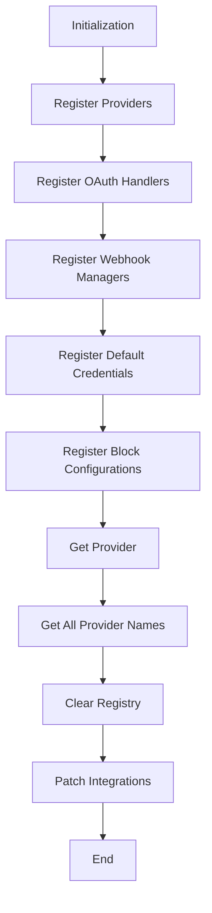

## 类结构

```
AutoRegistry (中央注册器)
├── SDKOAuthCredentials (OAuth凭据配置)
│   ├── use_secrets
│   ├── client_id_env_var
│   └── client_secret_env_var
├── BlockConfiguration (块配置)
│   ├── provider
│   ├── costs
│   ├── default_credentials
│   ├── webhook_manager
│   └── oauth_handler
└── Provider (提供者)
```

## 全局变量及字段


### `logger`
    
Logger instance for the module.

类型：`logging.Logger`
    


### `_lock`
    
Lock to ensure thread-safe access to the registry.

类型：`threading.Lock`
    


### `_providers`
    
Registry of providers.

类型：`Dict[str, Provider]`
    


### `_default_credentials`
    
List of default credentials.

类型：`List[Credentials]`
    


### `_oauth_handlers`
    
Registry of OAuth handlers.

类型：`Dict[str, Type[BaseOAuthHandler]]`
    


### `_oauth_credentials`
    
Registry of OAuth credentials configurations.

类型：`Dict[str, SDKOAuthCredentials]`
    


### `_webhook_managers`
    
Registry of webhook managers.

类型：`Dict[str, Type[BaseWebhooksManager]]`
    


### `_block_configurations`
    
Registry of block configurations.

类型：`Dict[Type[Block], BlockConfiguration]`
    


### `_api_key_mappings`
    
Mapping of providers to environment variable names for API keys.

类型：`Dict[str, str]`
    


### `SDKOAuthCredentials.use_secrets`
    
Indicates whether to use secrets for OAuth credentials.

类型：`bool`
    


### `SDKOAuthCredentials.client_id_env_var`
    
Environment variable name for the client ID.

类型：`Optional[str]`
    


### `SDKOAuthCredentials.client_secret_env_var`
    
Environment variable name for the client secret.

类型：`Optional[str]`
    


### `BlockConfiguration.provider`
    
Provider name associated with the block configuration.

类型：`str`
    


### `BlockConfiguration.costs`
    
Costs associated with the block.

类型：`List[Any]`
    


### `BlockConfiguration.default_credentials`
    
Default credentials for the block.

类型：`List[Credentials]`
    


### `BlockConfiguration.webhook_manager`
    
Webhook manager associated with the block configuration.

类型：`Optional[Type[BaseWebhooksManager]]`
    


### `BlockConfiguration.oauth_handler`
    
OAuth handler associated with the block configuration.

类型：`Optional[Type[BaseOAuthHandler]]`
    
    

## 全局函数及方法


### AutoRegistry.register_provider

This method is used to auto-register a provider and all its configurations.

参数：

- `provider`：`Provider`，The provider object to be registered.

返回值：`None`，No return value.

#### 流程图

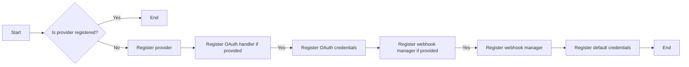

#### 带注释源码

```python
@classmethod
def register_provider(cls, provider: "Provider") -> None:
    """Auto-register provider and all its configurations."""
    with cls._lock:
        cls._providers[provider.name] = provider

        # Register OAuth handler if provided
        if provider.oauth_config:
            # Dynamically set PROVIDER_NAME if not already set
            if (
                not hasattr(provider.oauth_config.oauth_handler, "PROVIDER_NAME")
                or provider.oauth_config.oauth_handler.PROVIDER_NAME is None
            ):
                # This works because ProviderName has _missing_ method
                provider.oauth_config.oauth_handler.PROVIDER_NAME = ProviderName(
                    provider.name
                )
            cls._oauth_handlers[provider.name] = provider.oauth_config.oauth_handler

            oauth_creds = SDKOAuthCredentials(
                use_secrets=False,  # SDK providers use custom env vars
                client_id_env_var=provider.oauth_config.client_id_env_var,
                client_secret_env_var=provider.oauth_config.client_secret_env_var,
            )
            cls._oauth_credentials[provider.name] = oauth_creds

        # Register webhook manager if provided
        if provider.webhook_manager:
            # Dynamically set PROVIDER_NAME if not already set
            if (
                not hasattr(provider.webhook_manager, "PROVIDER_NAME")
                or provider.webhook_manager.PROVIDER_NAME is None
            ):
                # This works because ProviderName has _missing_ method
                provider.webhook_manager.PROVIDER_NAME = ProviderName(provider.name)
            cls._webhook_managers[provider.name] = provider.webhook_manager

        # Register default credentials
        cls._default_credentials.extend(provider.default_credentials)
```


### AutoRegistry.register_api_key

Register an environment variable as an API key for a provider.

参数：

- `provider`：`str`，The name of the provider for which to register the API key.
- `env_var_name`：`str`，The name of the environment variable that contains the API key.

返回值：`None`，No value is returned as the method is used for registration purposes.

#### 流程图

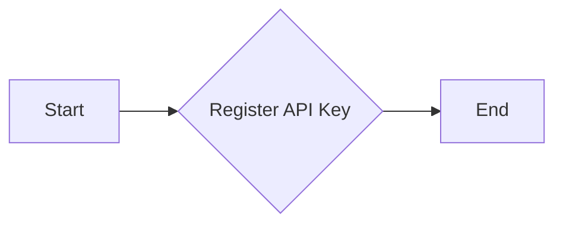

#### 带注释源码

```python
    @classmethod
    def register_api_key(cls, provider: str, env_var_name: str) -> None:
        """Register an environment variable as an API key for a provider."""
        with cls._lock:
            cls._api_key_mappings[provider] = env_var_name
            # Note: The credential itself is created by ProviderBuilder.with_api_key()
            # We only store the mapping here to avoid duplication
```


### `AutoRegistry.get_all_credentials`

This method retrieves all default credentials registered in the `AutoRegistry` class.

参数：

- 无

返回值：`List[Credentials]`，A list of all default credentials.

#### 流程图

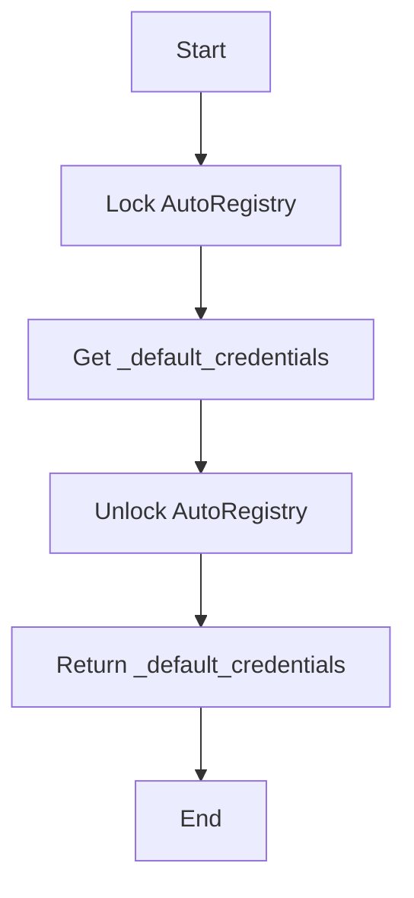

#### 带注释源码

```python
    @classmethod
    def get_all_credentials(cls) -> List[Credentials]:
        """Replace hardcoded get_all_creds() in credentials_store.py."""
        with cls._lock:
            return cls._default_credentials.copy()
```


### `AutoRegistry.get_oauth_handlers`

This method retrieves a copy of the OAuth handlers registered in the `AutoRegistry` class.

参数：

- 无

返回值：`Dict[str, Type[BaseOAuthHandler]]`，A dictionary containing the OAuth handlers mapped by provider name.

#### 流程图

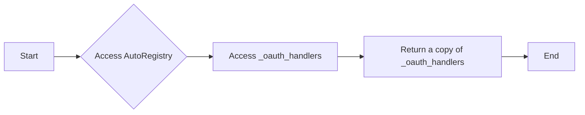

#### 带注释源码

```python
@classmethod
def get_oauth_handlers(cls) -> Dict[str, Type[BaseOAuthHandler]]:
    """Replace HANDLERS_BY_NAME in oauth/__init__.py."""
    with cls._lock:
        return cls._oauth_handlers.copy()
```


### `AutoRegistry.get_oauth_credentials`

Get OAuth credentials configuration for SDK providers.

参数：

- 无

返回值：`Dict[str, SDKOAuthCredentials]`，OAuth credentials configuration for SDK providers.

#### 流程图

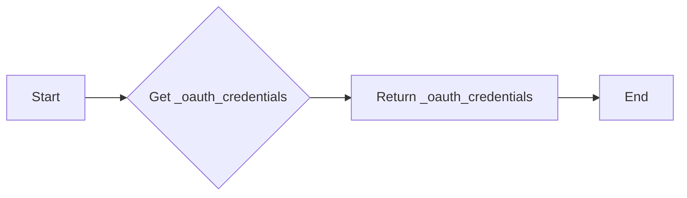

#### 带注释源码

```python
@classmethod
    def get_oauth_credentials(cls) -> Dict[str, SDKOAuthCredentials]:
        """Get OAuth credentials configuration for SDK providers."""
        with cls._lock:
            return cls._oauth_credentials.copy()
```


### `AutoRegistry.get_webhook_managers`

This method retrieves all registered webhook managers from the AutoRegistry.

参数：

- 无

返回值：`Dict[str, Type[BaseWebhooksManager]]`，A dictionary mapping provider names to their corresponding webhook manager classes.

#### 流程图

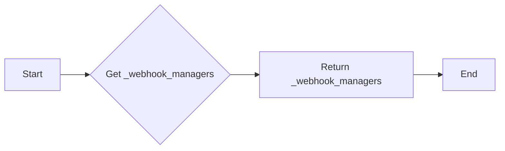

#### 带注释源码

```python
@classmethod
def get_webhook_managers(cls) -> Dict[str, Type[BaseWebhooksManager]]:
    """Replace load_webhook_managers() in webhooks/__init__.py."""
    with cls._lock:
        return cls._webhook_managers.copy()
```


### AutoRegistry.register_block_configuration

This method registers the configuration for a specific block class.

参数：

- `block_class`：`Type[Block]`，The block class for which to register the configuration.
- `config`：`BlockConfiguration`，The configuration associated with the block class.

返回值：`None`，No value is returned.

#### 流程图

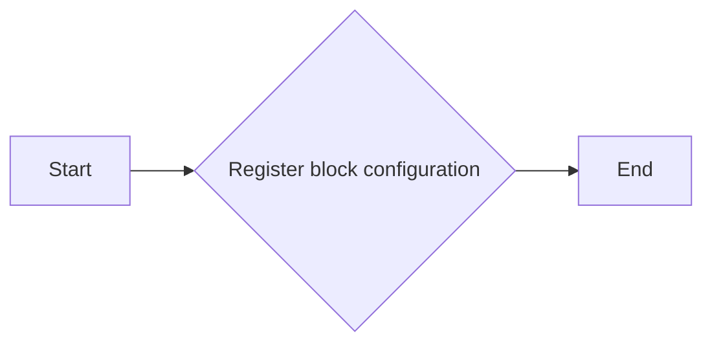

#### 带注释源码

```python
@classmethod
def register_block_configuration(cls, block_class: Type[Block], config: BlockConfiguration) -> None:
    """Register configuration for a specific block class."""
    with cls._lock:
        cls._block_configurations[block_class] = config
```


### `AutoRegistry.get_provider`

Get a registered provider by name.

参数：

- `name`：`str`，The name of the provider to retrieve.

返回值：`Optional[Provider]`，The provider object if found, otherwise `None`.

#### 流程图

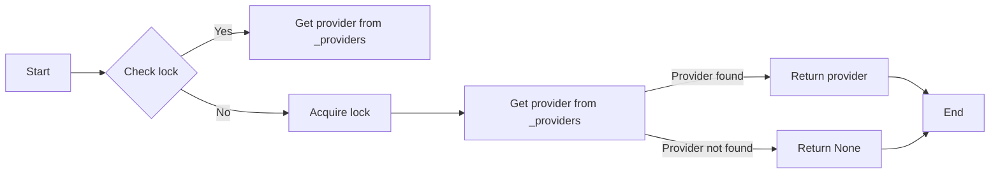

#### 带注释源码

```python
    @classmethod
    def get_provider(cls, name: str) -> Optional["Provider"]:
        """Get a registered provider by name."""
        with cls._lock:
            return cls._providers.get(name)
```


### `AutoRegistry.get_all_provider_names`

Get all registered provider names.

参数：

- 无

返回值：`List[str]`，A list of all registered provider names.

#### 流程图

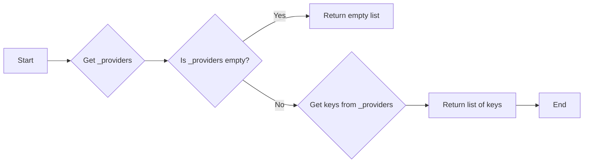

#### 带注释源码

```python
@classmethod
    def get_all_provider_names(cls) -> List[str]:
        """Get all registered provider names."""
        with cls._lock:
            return list(cls._providers.keys())
```


### AutoRegistry.clear()

清除所有注册信息（用于测试）。

参数：

- 无

返回值：`None`，无返回值

#### 流程图

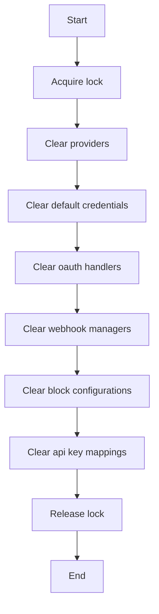

#### 带注释源码

```python
    @classmethod
    def clear(cls) -> None:
        """Clear all registrations (useful for testing)."""
        with cls._lock:
            cls._providers.clear()
            cls._default_credentials.clear()
            cls._oauth_handlers.clear()
            cls._webhook_managers.clear()
            cls._block_configurations.clear()
            cls._api_key_mappings.clear()
``` 


### patch_integrations

This method patches existing integration points to use the `AutoRegistry` for managing OAuth handlers, webhook managers, and credentials.

参数：

- 无

返回值：`None`，This method does not return any value.

#### 流程图


#### 带注释源码

```python
@classmethod
def patch_integrations(cls) -> None:
    """Patch existing integration points to use AutoRegistry."""
    # OAuth handlers are handled by SDKAwareHandlersDict in oauth/__init__.py
    # No patching needed for OAuth handlers

    # Patch webhook managers
    try:
        import sys
        from typing import Any

        # Get the module from sys.modules to respect mocking
        if "backend.integrations.webhooks" in sys.modules:
            webhooks: Any = sys.modules["backend.integrations.webhooks"]
        else:
            import backend.integrations.webhooks

            webhooks: Any = backend.integrations.webhooks

        if hasattr(webhooks, "load_webhook_managers"):
            original_load = webhooks.load_webhook_managers

            def patched_load():
                # Get original managers
                managers = original_load()
                # Add SDK-registered managers
                sdk_managers = cls.get_webhook_managers()
                if isinstance(sdk_managers, dict):
                    # Convert string keys to ProviderName for consistency
                    for provider_str, manager in sdk_managers.items():
                        provider_name = ProviderName(provider_str)
                        managers[provider_name] = manager
                return managers

            webhooks.load_webhook_managers = patched_load
    except Exception as e:
        logging.warning(f"Failed to patch webhook managers: {e}")

    # Patch credentials store to include SDK-registered credentials
    try:
        import sys
        from typing import Any

        # Get the module from sys.modules to respect mocking
        if "backend.integrations.credentials_store" in sys.modules:
            creds_store: Any = sys.modules["backend.integrations.credentials_store"]
        else:
            import backend.integrations.credentials_store

            creds_store: Any = backend.integrations.credentials_store

        if hasattr(creds_store, "IntegrationCredentialsStore"):
            store_class = creds_store.IntegrationCredentialsStore
            if hasattr(store_class, "get_all_creds"):
                original_get_all_creds = store_class.get_all_creds

                async def patched_get_all_creds(self, user_id: str):
                    # Get original credentials
                    original_creds = await original_get_all_creds(self, user_id)

                    # Add SDK-registered credentials
                    sdk_creds = cls.get_all_credentials()

                    # Combine credentials, avoiding duplicates by ID
                    existing_ids = {c.id for c in original_creds}
                    for cred in sdk_creds:
                        if cred.id not in existing_ids:
                            original_creds.append(cred)

                    return original_creds

                store_class.get_all_creds = patched_get_all_creds
                logger.info(
                    "Successfully patched IntegrationCredentialsStore.get_all_creds"
                )
    except Exception as e:
        logging.warning(f"Failed to patch credentials store: {e}")
``` 


### AutoRegistry.register_provider

This method is used to auto-register a provider and all its configurations.

参数：

- `provider`：`Provider`，The provider object to be registered.

返回值：`None`，No return value.

#### 流程图


#### 带注释源码

```python
@classmethod
def register_provider(cls, provider: "Provider") -> None:
    """Auto-register provider and all its configurations."""
    with cls._lock:
        cls._providers[provider.name] = provider

        # Register OAuth handler if provided
        if provider.oauth_config:
            # Dynamically set PROVIDER_NAME if not already set
            if (
                not hasattr(provider.oauth_config.oauth_handler, "PROVIDER_NAME")
                or provider.oauth_config.oauth_handler.PROVIDER_NAME is None
            ):
                # This works because ProviderName has _missing_ method
                provider.oauth_config.oauth_handler.PROVIDER_NAME = ProviderName(
                    provider.name
                )
            cls._oauth_handlers[provider.name] = provider.oauth_config.oauth_handler

            oauth_creds = SDKOAuthCredentials(
                use_secrets=False,  # SDK providers use custom env vars
                client_id_env_var=provider.oauth_config.client_id_env_var,
                client_secret_env_var=provider.oauth_config.client_secret_env_var,
            )
            cls._oauth_credentials[provider.name] = oauth_creds

        # Register webhook manager if provided
        if provider.webhook_manager:
            # Dynamically set PROVIDER_NAME if not already set
            if (
                not hasattr(provider.webhook_manager, "PROVIDER_NAME")
                or provider.webhook_manager.PROVIDER_NAME is None
            ):
                # This works because ProviderName has _missing_ method
                provider.webhook_manager.PROVIDER_NAME = ProviderName(provider.name)
            cls._webhook_managers[provider.name] = provider.webhook_manager

        # Register default credentials
        cls._default_credentials.extend(provider.default_credentials)
```


### AutoRegistry.register_api_key

This method registers an environment variable as an API key for a provider.

参数：

- `provider`：`str`，The name of the provider for which to register the API key.
- `env_var_name`：`str`，The name of the environment variable that contains the API key.

返回值：`None`，This method does not return a value.

#### 流程图


#### 带注释源码

```python
    @classmethod
    def register_api_key(cls, provider: str, env_var_name: str) -> None:
        """Register an environment variable as an API key for a provider."""
        with cls._lock:
            cls._api_key_mappings[provider] = env_var_name
            # Note: The credential itself is created by ProviderBuilder.with_api_key()
            # We only store the mapping here to avoid duplication
```


### AutoRegistry.get_all_credentials

This method retrieves all default credentials registered in the AutoRegistry system.

参数：

- 无

返回值：`List[Credentials]`，A list of all default credentials.

#### 流程图

```mermaid
graph LR
A[Start] --> B{Access _lock}
B -->|Yes| C[Access _default_credentials]
C --> D[Return _default_credentials.copy()]
D --> E[End]
```

#### 带注释源码

```python
@classmethod
def get_all_credentials(cls) -> List[Credentials]:
    """Replace hardcoded get_all_creds() in credentials_store.py."""
    with cls._lock:
        return cls._default_credentials.copy()
```


### AutoRegistry.get_oauth_handlers

This method retrieves a copy of the OAuth handlers registered in the AutoRegistry.

参数：

- 无

返回值：`Dict[str, Type[BaseOAuthHandler]]`，A dictionary containing the OAuth handlers mapped by provider name.

#### 流程图

```mermaid
graph LR
A[Start] --> B{Access _lock}
B -->|Yes| C[Access _oauth_handlers]
C -->|Copy| D[Return _oauth_handlers.copy()]
D --> E[End]
```

#### 带注释源码

```python
@classmethod
def get_oauth_handlers(cls) -> Dict[str, Type[BaseOAuthHandler]]:
    """Replace HANDLERS_BY_NAME in oauth/__init__.py."""
    with cls._lock:
        return cls._oauth_handlers.copy()
```


### AutoRegistry.get_oauth_credentials

Get OAuth credentials configuration for SDK providers.

参数：

- 无

返回值：`Dict[str, SDKOAuthCredentials]`，OAuth credentials configuration for SDK providers.

#### 流程图

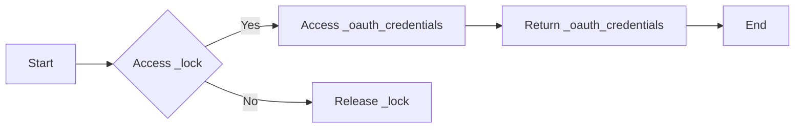

#### 带注释源码

```python
@classmethod
    def get_oauth_credentials(cls) -> Dict[str, SDKOAuthCredentials]:
        """Get OAuth credentials configuration for SDK providers."""
        with cls._lock:
            return cls._oauth_credentials.copy()
```


### AutoRegistry.get_webhook_managers

This method retrieves the webhook managers registered in the AutoRegistry system.

参数：

- 无

返回值：`Dict[str, Type[BaseWebhooksManager]]`，A dictionary mapping provider names to their corresponding webhook manager classes.

#### 流程图


#### 带注释源码

```python
@classmethod
def get_webhook_managers(cls) -> Dict[str, Type[BaseWebhooksManager]]:
    """Replace load_webhook_managers() in webhooks/__init__.py."""
    with cls._lock:
        return cls._webhook_managers.copy()
```


### AutoRegistry.register_block_configuration

This method registers the configuration for a specific block class.

参数：

- `block_class`：`Type[Block]`，The block class for which to register the configuration.
- `config`：`BlockConfiguration`，The configuration associated with the block class.

返回值：`None`，No value is returned.

#### 流程图


#### 带注释源码

```python
@classmethod
def register_block_configuration(cls, block_class: Type[Block], config: BlockConfiguration) -> None:
    """Register configuration for a specific block class."""
    with cls._lock:
        cls._block_configurations[block_class] = config
```


### AutoRegistry.get_provider

Get a registered provider by name.

参数：

- `name`：`str`，The name of the provider to retrieve.

返回值：`Optional[Provider]`，The provider object if found, otherwise `None`.

#### 流程图


#### 带注释源码

```python
    @classmethod
    def get_provider(cls, name: str) -> Optional["Provider"]:
        """Get a registered provider by name."""
        with cls._lock:
            return cls._providers.get(name)
```


### AutoRegistry.get_all_provider_names

Get all registered provider names.

参数：

- 无

返回值：`List[str]`，A list of all registered provider names.

#### 流程图

```mermaid
graph LR
A[Start] --> B{Get _providers}
B --> C[Return keys of _providers]
C --> D[End]
```

#### 带注释源码

```python
@classmethod
def get_all_provider_names(cls) -> List[str]:
    """Get all registered provider names."""
    with cls._lock:
        return list(cls._providers.keys())
```


### AutoRegistry.clear

This method clears all registrations from the AutoRegistry, which is useful for testing purposes.

参数：

- 无

返回值：`None`，无返回值

#### 流程图

```mermaid
graph LR
A[Start] --> B{Clear Providers}
B --> C[Clear Default Credentials]
C --> D[Clear OAuth Handlers]
D --> E[Clear OAuth Credentials]
E --> F[Clear Webhook Managers]
F --> G[Clear Block Configurations]
G --> H[Clear API Key Mappings]
H --> I[End]
```

#### 带注释源码

```python
@classmethod
def clear(cls) -> None:
    """Clear all registrations (useful for testing)."""
    with cls._lock:
        cls._providers.clear()
        cls._default_credentials.clear()
        cls._oauth_handlers.clear()
        cls._webhook_managers.clear()
        cls._block_configurations.clear()
        cls._api_key_mappings.clear()
``` 


### AutoRegistry.patch_integrations

This method patches existing integration points to use the AutoRegistry for managing OAuth handlers, webhook managers, and credentials.

参数：

- 无

返回值：`None`，This method does not return any value.

#### 流程图

```mermaid
graph LR
A[Start] --> B[Patch OAuth Handlers]
B --> C[Patch Webhook Managers]
C --> D[Patch Credentials Store]
D --> E[End]
```

#### 带注释源码

```python
@classmethod
def patch_integrations(cls) -> None:
    """Patch existing integration points to use AutoRegistry."""
    # OAuth handlers are handled by SDKAwareHandlersDict in oauth/__init__.py
    # No patching needed for OAuth handlers

    # Patch webhook managers
    try:
        import sys
        from typing import Any

        # Get the module from sys.modules to respect mocking
        if "backend.integrations.webhooks" in sys.modules:
            webhooks: Any = sys.modules["backend.integrations.webhooks"]
        else:
            import backend.integrations.webhooks

            webhooks: Any = backend.integrations.webhooks

        if hasattr(webhooks, "load_webhook_managers"):
            original_load = webhooks.load_webhook_managers

            def patched_load():
                # Get original managers
                managers = original_load()
                # Add SDK-registered managers
                sdk_managers = cls.get_webhook_managers()
                if isinstance(sdk_managers, dict):
                    # Convert string keys to ProviderName for consistency
                    for provider_str, manager in sdk_managers.items():
                        provider_name = ProviderName(provider_str)
                        managers[provider_name] = manager
                return managers

            webhooks.load_webhook_managers = patched_load
    except Exception as e:
        logging.warning(f"Failed to patch webhook managers: {e}")

    # Patch credentials store to include SDK-registered credentials
    try:
        import sys
        from typing import Any

        # Get the module from sys.modules to respect mocking
        if "backend.integrations.credentials_store" in sys.modules:
            creds_store: Any = sys.modules["backend.integrations.credentials_store"]
        else:
            import backend.integrations.credentials_store

            creds_store: Any = backend.integrations.credentials_store

        if hasattr(creds_store, "IntegrationCredentialsStore"):
            store_class = creds_store.IntegrationCredentialsStore
            if hasattr(store_class, "get_all_creds"):
                original_get_all_creds = store_class.get_all_creds

                async def patched_get_all_creds(self, user_id: str):
                    # Get original credentials
                    original_creds = await original_get_all_creds(self, user_id)

                    # Add SDK-registered credentials
                    sdk_creds = cls.get_all_credentials()

                    # Combine credentials, avoiding duplicates by ID
                    existing_ids = {c.id for c in original_creds}
                    for cred in sdk_creds:
                        if cred.id not in existing_ids:
                            original_creds.append(cred)

                    return original_creds

                store_class.get_all_creds = patched_get_all_creds
                logger.info(
                    "Successfully patched IntegrationCredentialsStore.get_all_creds"
                )
    except Exception as e:
        logging.warning(f"Failed to patch credentials store: {e}")
``` 


## 关键组件


### 张量索引与惰性加载

用于高效地索引和访问大型数据集，同时延迟加载数据以减少内存消耗。

### 反量化支持

提供对反量化操作的支持，允许在量化过程中进行逆量化以恢复原始精度。

### 量化策略

定义量化策略，用于在模型训练和推理过程中调整模型参数的精度。


## 问题及建议


### 已知问题

-   **全局状态管理**: `AutoRegistry` 类使用全局状态来存储配置信息，这可能导致代码难以测试和维护。全局状态可能会在多个地方被修改，增加了出错的可能性。
-   **线程安全**: 使用 `threading.Lock` 来保证线程安全，但代码中存在多个锁操作，这可能导致性能瓶颈。此外，锁的粒度可能不够细，可能存在死锁的风险。
-   **依赖注入**: 代码中存在硬编码依赖，例如 `sys.modules` 的使用，这可能导致代码难以测试和移植。
-   **异常处理**: 代码中存在异常处理，但可能需要更详细的异常处理逻辑，以确保在出现错误时能够提供更清晰的错误信息。
-   **代码重复**: 代码中存在重复的逻辑，例如在 `patch_integrations` 方法中，对 `load_webhook_managers` 和 `get_all_creds` 方法的修改是相似的。

### 优化建议

-   **使用依赖注入**: 将配置信息作为参数传递给类或方法，而不是使用全局状态，以提高代码的可测试性和可维护性。
-   **优化锁的使用**: 考虑使用更细粒度的锁或无锁编程技术，以减少锁的开销和死锁的风险。
-   **重构代码**: 将重复的逻辑提取到单独的函数或类中，以减少代码重复并提高代码的可读性。
-   **改进异常处理**: 添加更详细的异常处理逻辑，确保在出现错误时能够提供清晰的错误信息。
-   **使用工厂模式**: 对于创建对象的过程，可以使用工厂模式来封装创建逻辑，提高代码的灵活性和可扩展性。
-   **使用配置文件**: 将配置信息存储在配置文件中，而不是硬编码在代码中，以提高代码的可移植性和可维护性。


## 其它


### 设计目标与约束

- **设计目标**:
  - 实现一个自动注册系统，用于管理块、提供者和它们的配置。
  - 提供一个中心注册机制，以便在应用程序中轻松访问和配置各种块和提供者。
  - 确保注册过程线程安全，以避免并发访问问题。

- **约束**:
  - 必须使用线程锁来保护共享资源，以确保线程安全。
  - 必须遵循Pydantic的BaseModel规范来定义配置模型。
  - 必须支持动态注册提供者、块配置和OAuth处理程序。

### 错误处理与异常设计

- **错误处理**:
  - 使用Python的logging模块记录错误和警告信息。
  - 在注册过程中捕获并记录异常，以便于调试和问题追踪。

- **异常设计**:
  - 定义自定义异常类，以处理特定于注册系统的错误情况。
  - 在方法中抛出异常，并在调用者处捕获和处理这些异常。

### 数据流与状态机

- **数据流**:
  - 数据流从提供者实例开始，通过注册方法传递到注册中心。
  - 注册中心存储提供者、块配置、OAuth处理程序和Webhook管理器等信息。

- **状态机**:
  - 状态机不适用于此系统，因为它不涉及状态转换。

### 外部依赖与接口契约

- **外部依赖**:
  - 依赖于`pydantic`库来定义配置模型。
  - 依赖于`logging`库来记录日志。
  - 依赖于`threading`库来处理线程安全。

- **接口契约**:
  - 定义了`Provider`、`BaseOAuthHandler`和`BaseWebhooksManager`等接口，以确保提供者和处理程序符合特定的契约。
  - 定义了`BlockConfiguration`类，用于存储与块相关的配置信息。


    