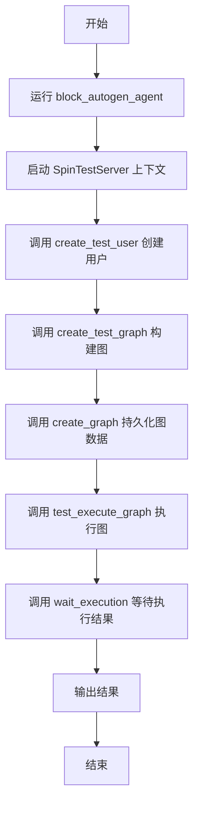
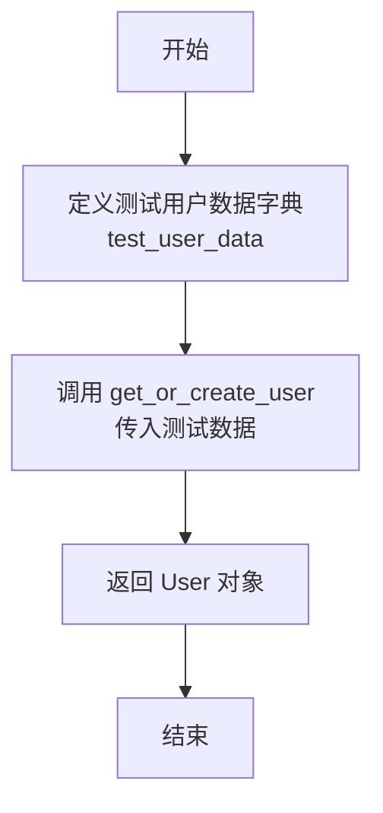
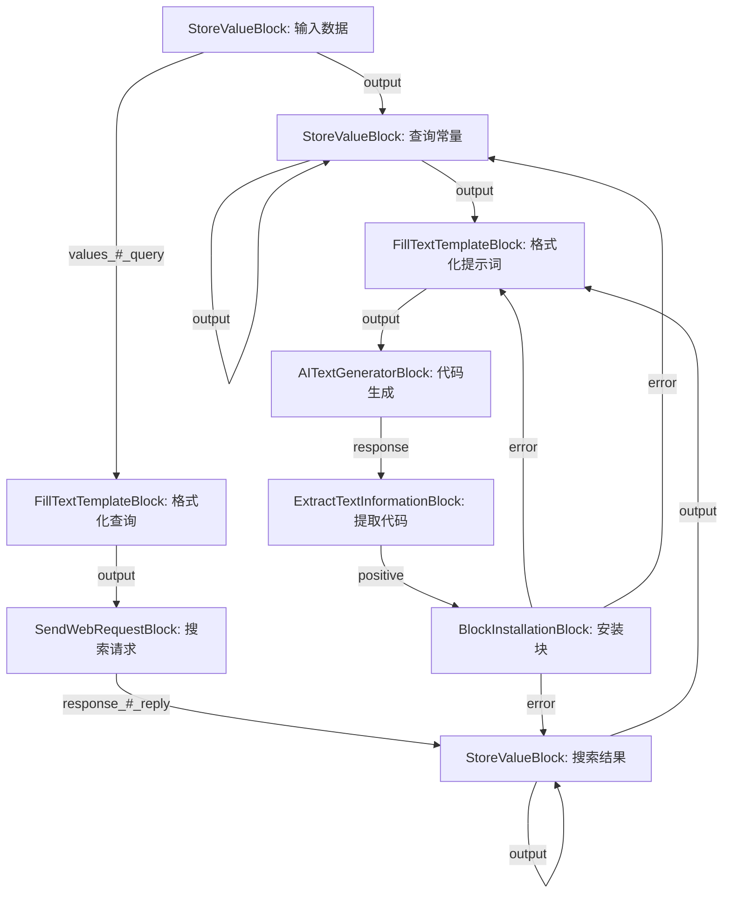
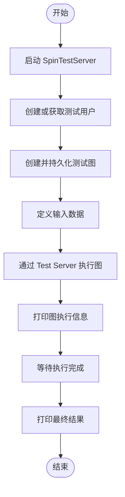
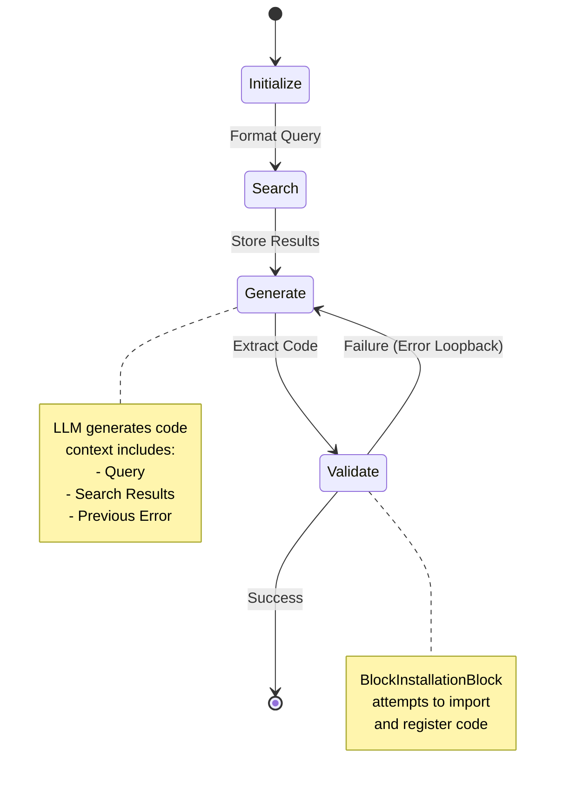

# `.\AutoGPT\autogpt_platform\backend\backend\usecases\block_autogen.py` 详细设计文档

该代码实现了一个基于LLM的自动化代码生成与测试智能体，通过构建包含搜索、文本生成、代码提取和安装验证的复杂执行图，能够根据自然语言输入动态生成Python代码块，并利用错误反馈循环迭代完善代码，直至成功安装。

## 整体流程



## 类结构

```
Module Scope
├── Global Variables
│   ├── sample_block_modules
│   └── sample_block_codes
└── Functions
    ├── create_test_user
    ├── create_test_graph
    └── block_autogen_agent
```

## 全局变量及字段


### `sample_block_modules`
    
存储示例模块名称及其对应描述的字典，用于标识和加载示例代码。

类型：`dict[str, str]`
    


### `sample_block_codes`
    
存储从文件读取并格式化后的示例模块代码字符串，用于提供给大语言模型作为参考。

类型：`dict[str, str]`
    


    

## 全局函数及方法


### `create_test_user`

这是一个用于创建或获取测试用户的异步辅助函数。它定义了一组固定的用户数据（sub, email, name），并通过调用 `get_or_create_user` 方法来确保返回一个有效的 User 对象，通常用于测试环境中模拟用户身份。

参数：

-  该函数无参数。

返回值：`User`，包含预设测试数据的用户对象。

#### 流程图



#### 带注释源码

```python
async def create_test_user() -> User:
    # 定义测试用户的固定数据，包括sub (唯一标识), email, 和 name
    test_user_data = {
        "sub": "ef3b97d7-1161-4eb4-92b2-10c24fb154c1",
        "email": "testuser@example.com",
        "name": "Test User",
    }
    # 调用 get_or_create_user 函数，根据提供的数据获取已存在的用户或创建新用户
    user = await get_or_create_user(test_user_data)
    # 返回获取到的 User 对象
    return user
```


### `create_test_graph`

该函数构造并返回一个 `Graph` 对象，定义了一个复杂的自动化工作流（“BlockAutoGen”代理）。此工作流通过节点和链接定义了数据流向，功能包括接收用户输入、执行网络搜索、使用模板构建提示词、调用大语言模型（LLM）生成 Python 代码块、提取代码并尝试安装。如果安装失败，它会利用错误信息循环回之前的步骤进行重试，形成一个闭环的自我优化代码生成流程。

参数：

无

返回值：`Graph`，代表“BlockAutoGen”工作流的图结构，包含定义了处理逻辑的节点列表和定义了数据流向的链接列表。

#### 流程图



#### 带注释源码

```python
def create_test_graph() -> Graph:
    """
            StoreValueBlock (input)
                 ||
                 v
        FillTextTemplateBlock (input query)
                 ||
                 v
         SendWebRequestBlock (browse)
                 ||
                 v
     ------> StoreValueBlock===============
    |           |  |                    ||
    |            --                     ||
    |                                   ||
    |                                   ||
    |                                    v
    |        AITextGeneratorBlock  <===== FillTextTemplateBlock (query)
    |            ||                      ^
    |            v                      ||
    |       ExtractTextInformationBlock             ||
    |            ||                     ||
    |            v                      ||
    ------ BlockInstallationBlock  ======
    """
    # ======= 节点定义 (Nodes) ========= #
    
    # 1. 初始输入数据节点
    input_data = Node(block_id=StoreValueBlock().id)
    
    # 2. 用于存储查询常量的节点（循环更新）
    input_query_constant = Node(
        block_id=StoreValueBlock().id,
        input_default={"data": None},
    )
    
    # 3. 格式化文本查询模板节点
    input_text_formatter = Node(
        block_id=FillTextTemplateBlock().id,
        input_default={
            "format": "Show me how to make a python code for this query: `{query}`",
        },
    )
    
    # 4. 发送Web搜索请求的节点
    search_http_request = Node(
        block_id=SendWebRequestBlock().id,
        input_default={
            "url": "https://osit-v2.bentlybro.com/search",
        },
    )
    
    # 5. 存储搜索结果的常量节点（循环更新）
    search_result_constant = Node(
        block_id=StoreValueBlock().id,
        input_default={
            "data": None,
        },
    )
    
    # 6. 构建LLM提示词的格式化节点，包含查询、搜索结果和前次尝试
    prompt_text_formatter = Node(
        block_id=FillTextTemplateBlock().id,
        input_default={
            "format": """
Write me a full Block implementation for this query: `{query}`

Here is the information I get to write a Python code for that:
{search_result}

Here is your previous attempt:
{previous_attempt}
""",
            "values_#_previous_attempt": "No previous attempt found.",
        },
    )
    
    # 7. LLM文本生成节点，用于生成Python代码
    code_gen_llm_call = Node(
        block_id=AITextGeneratorBlock().id,
        input_default={
            "sys_prompt": f"""
You are a software engineer and you are asked to write the full class implementation.
The class that you are implementing is extending a class called `Block`.
...
""",
        },
    )
    
    # 8. 文本提取节点，使用正则从LLM输出中提取Python代码块
    code_text_parser = Node(
        block_id=ExtractTextInformationBlock().id,
        input_default={
            "pattern": "```python\n(.+?)\n```",
            "group": 1,
        },
    )
    
    # 9. 块安装节点，尝试执行生成的代码
    block_installation = Node(
        block_id=BlockInstallationBlock().id,
    )
    
    # 汇总所有节点
    nodes = [
        input_data,
        input_query_constant,
        input_text_formatter,
        search_http_request,
        search_result_constant,
        prompt_text_formatter,
        code_gen_llm_call,
        code_text_parser,
        block_installation,
    ]

    # ======= 链接定义 (Links) ========= #
    links = [
        # 输入数据 -> 查询常量
        Link(
            source_id=input_data.id,
            sink_id=input_query_constant.id,
            source_name="output",
            sink_name="input",
        ),
        # 输入数据 -> 文本格式化器 (注入query)
        Link(
            source_id=input_data.id,
            sink_id=input_text_formatter.id,
            source_name="output",
            sink_name="values_#_query",
        ),
        # 查询常量自循环 (更新data)
        Link(
            source_id=input_query_constant.id,
            sink_id=input_query_constant.id,
            source_name="output",
            sink_name="data",
        ),
        # 文本格式化器 -> HTTP请求 (注入body)
        Link(
            source_id=input_text_formatter.id,
            sink_id=search_http_request.id,
            source_name="output",
            sink_name="body_#_query",
        ),
        # HTTP请求 -> 搜索结果常量
        Link(
            source_id=search_http_request.id,
            sink_id=search_result_constant.id,
            source_name="response_#_reply",
            sink_name="input",
        ),
        # 搜索结果常量自循环
        Link( 
            source_id=search_result_constant.id,
            sink_id=search_result_constant.id,
            source_name="output",
            sink_name="data",
        ),
        # 搜索结果常量 -> 提示词格式化器 (注入search_result)
        Link(
            source_id=search_result_constant.id,
            sink_id=prompt_text_formatter.id,
            source_name="output",
            sink_name="values_#_search_result",
        ),
        # 查询常量 -> 提示词格式化器 (注入query)
        Link(
            source_id=input_query_constant.id,
            sink_id=prompt_text_formatter.id,
            source_name="output",
            sink_name="values_#_query",
        ),
        # 提示词格式化器 -> LLM生成 (注入prompt)
        Link(
            source_id=prompt_text_formatter.id,
            sink_id=code_gen_llm_call.id,
            source_name="output",
            sink_name="prompt",
        ),
        # LLM生成 -> 文本提取器 (注入response)
        Link(
            source_id=code_gen_llm_call.id,
            sink_id=code_text_parser.id,
            source_name="response",
            sink_name="text",
        ),
        # 文本提取器 -> 块安装 (注入code)
        Link(
            source_id=code_text_parser.id,
            sink_id=block_installation.id,
            source_name="positive",
            sink_name="code",
        ),
        # 错误循环：块安装 -> 提示词格式化器 (注入previous_attempt)
        Link(
            source_id=block_installation.id,
            sink_id=prompt_text_formatter.id,
            source_name="error",
            sink_name="values_#_previous_attempt",
        ),
        # 错误循环：块安装 -> 搜索结果常量 (重新触发)
        Link( 
            source_id=block_installation.id,
            sink_id=search_result_constant.id,
            source_name="error",
            sink_name="input",
        ),
        # 错误循环：块安装 -> 查询常量 (重新触发)
        Link( 
            source_id=block_installation.id,
            sink_id=input_query_constant.id,
            source_name="error",
            sink_name="input",
        ),
    ]

    # ======= 图构建 (Graph) ========= #
    return Graph(
        name="BlockAutoGen",
        description="Block auto generation agent",
        nodes=nodes,
        links=links,
    )
```


### `block_autogen_agent`

该函数是Block自动生成代理的主入口，负责初始化测试环境（启动测试服务器）、创建测试用户、构建并持久化测试图、执行图任务以及等待并获取执行结果。

参数：

*   （无参数）

返回值：`None`，该函数主要执行异步流程并打印结果，无显式返回值。

#### 流程图



#### 带注释源码

```python
async def block_autogen_agent():
    # 使用上下文管理器启动测试服务器，确保资源正确释放
    async with SpinTestServer() as server:
        # 异步创建测试用户，用于后续操作的身份认证和关联
        test_user = await create_test_user()
        
        # 创建测试图对象并将其持久化存储，关联到当前测试用户
        test_graph = await create_graph(create_test_graph(), user_id=test_user.id)
        
        # 定义输入数据，即要求生成的Block功能描述
        input_data = {"input": "Write me a block that writes a string into a file."}
        
        # 调用测试服务器的接口执行图，传入图ID、用户ID和输入数据
        graph_exec = await server.agent_server.test_execute_graph(
            graph_id=test_graph.id,
            user_id=test_user.id,
            node_input=input_data,
        )
        # 打印执行返回的初始元数据
        print(graph_exec)
        
        # 等待图执行完成，设置超时时间为1200秒，并获取最终结果
        result = await wait_execution(
            graph_exec_id=graph_exec.id,
            timeout=1200,
            user_id=test_user.id,
        )
        # 打印最终执行结果
        print(result)
```


## 关键组件


### BlockAutoGen Graph（Block自动生成图）
定义了一个复杂的节点和链接网络，用于编排自动化工作流。它接收用户查询，执行 Web 搜索，利用 LLM 生成 Block 代码，解析输出，并尝试安装它，同时包含用于错误处理的循环。

### Test Execution Environment（测试执行环境）
负责异步代理生命周期的组件，使用 `SpinTestServer` 初始化后端，管理测试用户创建，持久化图定义，并执行图运行逻辑。

### Dynamic Context Injection（动态上下文注入）
一种机制，用于从本地文件系统读取 `llm`、`basic` 和 `text` 等模块的源代码。它将这些封装在 Markdown 中以动态构建 Few-shot 示例，为 AI 提供了 Block 实现的具体上下文。

### Feedback Loop Control（反馈循环控制）
一种连接策略，其中来自 `BlockInstallationBlock` 的错误输出被路由回 `FillTextTemplateBlock`。这使代理能够将错误作为 `previous_attempt` 合并到后续的 LLM prompt 中，以促进自我修正。

### Core Processing Blocks（核心处理 Blocks）
图结构中使用的基本计算单元，包括 `StoreValueBlock`（数据保持）、`SendWebRequestBlock`（信息检索）、`AITextGeneratorBlock`（代码生成）、`ExtractTextInformationBlock`（代码解析）和 `BlockInstallationBlock`（执行验证）。


## 问题及建议


### 已知问题

-   **硬编码的外部依赖**：代码中硬编码了搜索服务的 URL (`https://osit-v2.bentlybro.com/search`)，这导致系统与特定的外部环境强耦合，一旦服务变更或不可用，整个代理流程将失败。
-   **模块级副作用与路径依赖**：`sample_block_codes` 在模块加载时即执行文件 I/O 操作，并依赖于硬编码的相对路径 (`current_dir.parent / "blocks"`)。这种设计不仅降低了代码的便携性（在不同目录运行会报错），还增加了模块导入的开销。
-   **解析逻辑的脆弱性**：`ExtractTextInformationBlock` 使用严格的正则表达式 `"```python\n(.+?)\n```"` 来提取代码。如果 LLM 生成的 Markdown 格式稍有变动（如多余的空格、缩进或不同的结束标记），提取将失败，导致后续流程中断。
-   **无限循环风险**：图结构中存在基于错误反馈的重试机制，但缺少明确的“最大重试次数”限制。如果生成的代码持续存在语法错误或逻辑问题，代理可能会陷入无限重试，直到外部 `wait_execution` 超时（1200秒），浪费计算资源。
-   **安全隐患**：工作流通过 `BlockInstallationBlock` 动态安装并执行 LLM 生成的代码。如果没有严格的沙箱隔离机制或代码审查步骤，这构成了严重的远程代码执行（RCE）安全风险。

### 优化建议

-   **引入配置管理**：将硬编码的 URL、超时时间等参数提取到配置文件（如 `.env` 或 `config.yaml`）或环境变量中，以提高系统的灵活性和部署的便捷性。
-   **重构资源加载机制**：将示例代码的读取逻辑移至显式的初始化函数中，或使用 `importlib.resources` 等标准库方式处理包内资源，避免模块导入时的副作用，并增强路径解析的健壮性。
-   **增强代码提取的鲁棒性**：优化代码提取逻辑，使用更灵活的正则表达式（允许变体空白）或引入专门的 Markdown 解析器来提取代码块，减少因 LLM 输出格式微小差异导致的失败。
-   **增加循环控制机制**：在图中增加计数器节点或逻辑控制，设定最大重试次数（例如 3 次）。如果达到阈值仍未成功生成有效代码，则终止流程并返回具体的错误信息，防止资源浪费。
-   **强化输出格式约束**：优化 Prompt，明确指示 LLM 输出特定的 XML 标签或 JSON 格式来包裹代码，以便更可靠地进行解析和提取。


## 其它


### 设计目标与约束

1.  **设计目标**：
    *   **自动化代码生成**：构建一个智能体工作流，能够根据用户的自然语言输入（如 "Write me a block that writes a string into a file"），自动检索信息、编写代码并进行测试安装。
    *   **自愈能力**：通过反馈循环机制，当代码安装失败时，捕获错误信息并将其作为上下文重新提交给 LLM，要求其修正代码，直至成功或超时。
    *   **模块化与可扩展性**：基于 Block（节点）和 Graph（图）的架构设计，允许开发者通过组合不同的基础模块（如 HTTP 请求、LLM 调用、文本处理）来构建复杂的自动化流程。

2.  **约束条件**：
    *   **执行超时**：整个工作流的执行时间限制为 1200 秒（由 `wait_execution` 的 `timeout` 参数指定），防止无限循环消耗资源。
    *   **硬编码 ID**：为了测试的一致性，LLM 生成的 Block 实现必须包含硬编码的 UUID，而不能依赖自动生成的 UUID。
    *   **特定格式要求**：生成的代码必须包含特定的 Markdown 代码块标记（````python ... ````），以便 `ExtractTextInformationBlock` 能够正确提取代码。
    *   **外部服务依赖**：代码依赖于特定外部搜索端点（`https://osit-v2.bentlybro.com/search`）的可用性，以及后台 LLM 服务的稳定性。

### 错误处理与异常设计

该系统采用**基于图的错误传播与重试机制**，而非传统的 try-catch 块。

1.  **错误传播路径**：
    *   `BlockInstallationBlock` 拥有 `error` 输出端口。
    *   当代码安装失败时，错误信息通过 `Link` 传递回 `prompt_text_formatter` 的输入端口 `values_#_previous_attempt`。
    *   同时，错误信号也被发送到 `search_result_constant` 和 `input_query_constant`，用于重新触发流程。

2.  **重试策略**：
    *   **上下文感知重试**：系统不仅简单地重试，而是将上一次的错误信息注入到下一次 LLM 生成请求的 Prompt 中。这实现了 "反思-修正" 的循环。
    *   **状态保持**：通过 `StoreValueBlock` 和 Graph 中的连接，保持查询和搜索结果在重试过程中的状态，避免重复不必要的计算。

3.  **异常边界**：
    *   `wait_execution` 函数充当最终的异常边界。如果在 1200 秒内工作流未成功完成或未达到终止状态，该函数将抛出超时异常或返回最终状态，确保主程序不会永久挂起。

### 数据流与状态机

该系统表现为一个带有反馈回路的有向状态机。

1.  **状态流转**：
    *   **初始化状态**：接收用户输入 (`input_data`)。
    *   **检索状态**：格式化查询 -> 发送 HTTP 请求 -> 存储搜索结果。
    *   **生成状态**：结合搜索结果、原始查询和（如果有）上一次的错误，构建 Prompt -> 请求 LLM -> 提取代码。
    *   **验证状态**：尝试安装生成的 Block。
        *   **成功分支**：流程结束，返回最终结果。
        *   **失败分支**：触发错误回路，将状态重置回 "生成状态"（携带错误信息）。

2.  **Mermaid 状态图**：



### 外部依赖与接口契约

1.  **外部依赖**：
    *   **搜索服务 API (`https://osit-v2.bentlybro.com/search`)**：
        *   由 `SendWebRequestBlock` 调用。
        *   契约：接收包含查询参数的 HTTP 请求，返回包含相关信息的文本/HTML 响应。
    *   **大语言模型 (LLM) 服务**：
        *   由 `AITextGeneratorBlock` 封装。
        *   契约：接收 `sys_prompt` 和用户 `prompt`，返回生成的文本内容。系统假设该服务能够理解并遵循生成特定 Python 类结构的指令。
    *   **Python 运行时环境**：
        *   由 `BlockInstallationBlock` 使用。
        *   契约：必须在运行时动态执行生成的 Python 代码字符串，并将其模块注入到当前应用程序的命名空间中。

2.  **内部接口契约 (Block 架构)**：
    *   **Node (节点)**：必须包含唯一的 `id` 和关联的 `block_id`。
    *   **Link (连接)**：
        *   `source_name` 和 `sink_name` 必须严格匹配对应 Block 的 `output_schema` 和 `input_schema` 中定义的字段名。
        *   例如，`SendWebRequestBlock` 的输出 `response_#_reply` 必须连接到 `StoreValueBlock` 的输入 `input`。
    *   **Graph 执行器**：
        *   `server.agent_server.test_execute_graph`：契约是接收 `graph_id`、`user_id` 和初始 `node_input`，并返回一个异步执行的执行对象 (`graph_exec`)。

    