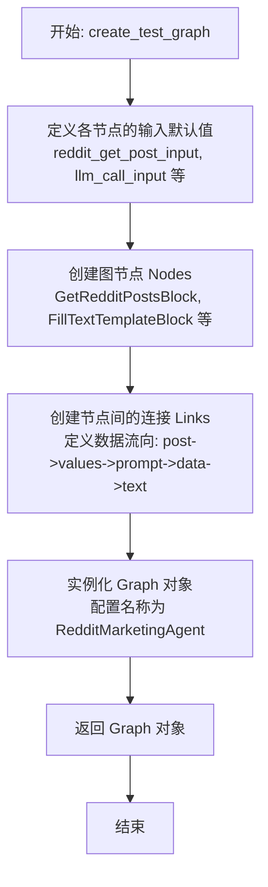
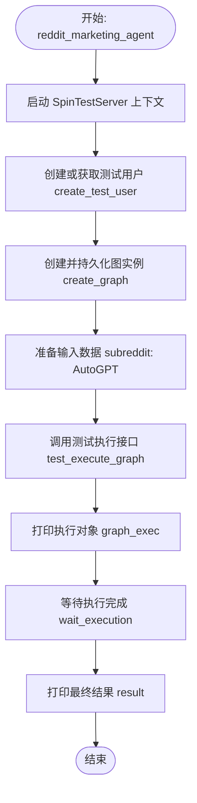

# `.\AutoGPT\autogpt_platform\backend\backend\usecases\reddit_marketing.py` 详细设计文档

该代码定义了一个Reddit营销智能体的测试流程与执行入口，主要用于构建并自动化执行一个工作流：该工作流从指定Subreddit获取帖子，利用大语言模型（LLM）判断帖子相关性并生成营销文案，最后自动回复相关帖子。

## 整体流程

```mermaid
graph TD
    A[开始: reddit_marketing_agent] --> B[启动测试服务器 SpinTestServer]
    B --> C[create_test_user 获取/创建测试用户]
    B --> D[create_test_graph 构建图结构]
    C --> E[create_graph 持久化图到数据库]
    E --> F[test_execute_graph 执行图 输入subreddit]
    F --> G[wait_execution 等待执行结果]
    G --> H[输出结果 结束]
    subgraph Graph内部执行流
    D1[GetRedditPostsBlock 获取帖子] --> D2[FillTextTemplateBlock 格式化文本]
    D2 --> D3[AIStructuredResponseBlock 生成营销文案]
    D3 --> D4[MatchTextPatternBlock 判断相关性]
    D4 -- 相关 --> D5[PostRedditCommentBlock 发布评论]
    D4 -- 不相关 --> D6[结束]
```

## 类结构

```
reddit_marketing_agent.py (脚本模块)
├── create_test_graph (全局函数)
├── create_test_user (全局函数)
└── reddit_marketing_agent (全局函数)
```

## 全局变量及字段


    

## 全局函数及方法


### `create_test_graph`

该函数用于构建并返回一个名为"RedditMarketingAgent"的测试用图对象。该图定义了一个自动化工作流：从指定Subreddit获取帖子，使用大语言模型（LLM）分析帖子是否与"Auto-GPT"产品相关并生成营销文案，最后根据相关性判断结果决定是否在Reddit上发表评论。

参数：

-   (无参数)

返回值：`Graph`，配置好的Graph实例，包含了处理Reddit营销逻辑所需的节点、链接及元数据。

#### 流程图



#### 带注释源码

```python
def create_test_graph() -> Graph:
    """
                    subreddit
                       ||
                        v
        GetRedditPostsBlock (post_id, post_title, post_body)
                  //     ||     \\
              post_id  post_title  post_body
                 ||       ||        ||
                 v        v         v
              FillTextTemplateBlock (format)
                      ||
                      v
            AIStructuredResponseBlock / TextRelevancy
                 ||       ||       ||
            post_id  is_relevant  marketing_text
               ||       ||        ||
               v        v         v
                 MatchTextPatternBlock
                 ||       ||
              positive  negative
                ||
                v
        PostRedditCommentBlock
    """
    # Hardcoded inputs
    # 定义获取Reddit帖子的输入参数，限制获取3条帖子
    reddit_get_post_input = {
        "post_limit": 3,
    }
    # 定义文本格式化模版，用于将Reddit帖子信息格式化为提示词
    text_formatter_input = {
        "format": """
Based on the following post, write your marketing comment:
* Post ID: {id}
* Post Subreddit: {subreddit}
* Post Title: {title}
* Post Body: {body}""".strip(),
    }
    # 定义LLM调用的输入参数，包括系统提示词和期望的输出格式（JSON结构）
    llm_call_input = {
        "sys_prompt": """
You are an expert at marketing.
You have been tasked with picking Reddit posts that are relevant to your product.
The product you are marketing is: Auto-GPT an autonomous AI agent utilizing GPT model.
You reply the post that you find it relevant to be replied with marketing text.
Make sure to only comment on a relevant post.
""",
        "expected_format": {
            "post_id": "str, the reddit post id",
            "is_relevant": "bool, whether the post is relevant for marketing",
            "marketing_text": "str, marketing text, this is empty on irrelevant posts",
        },
    }
    # 定义文本匹配器的输入，用于匹配LLM返回的 is_relevant 字段（匹配 "true"）
    text_matcher_input = {"match": "true", "case_sensitive": False}
    # 定义发布Reddit评论的输入（此处为空字典，使用动态传入的数据）
    reddit_comment_input = {}

    # Nodes
    # 创建节点实例，指定Block ID和默认输入数据
    # 1. 获取Reddit帖子节点
    reddit_get_post_node = Node(
        block_id=GetRedditPostsBlock().id,
        input_default=reddit_get_post_input,
    )
    # 2. 填充文本模版节点
    text_formatter_node = Node(
        block_id=FillTextTemplateBlock().id,
        input_default=text_formatter_input,
    )
    # 3. AI结构化响应生成节点 (LLM)
    llm_call_node = Node(
        block_id=AIStructuredResponseGeneratorBlock().id, input_default=llm_call_input
    )
    # 4. 文本模式匹配节点
    text_matcher_node = Node(
        block_id=MatchTextPatternBlock().id,
        input_default=text_matcher_input,
    )
    # 5. 发布Reddit评论节点
    reddit_comment_node = Node(
        block_id=PostRedditCommentBlock().id,
        input_default=reddit_comment_input,
    )

    # 将所有节点加入列表
    nodes = [
        reddit_get_post_node,
        text_formatter_node,
        llm_call_node,
        text_matcher_node,
        reddit_comment_node,
    ]

    # Links
    # 创建节点之间的连接，定义数据如何在节点之间流动
    links = [
        # 连接: Reddit帖子数据 -> 文本格式化器的输入值
        Link(
            source_id=reddit_get_post_node.id,
            sink_id=text_formatter_node.id,
            source_name="post",
            sink_name="values",
        ),
        # 连接: 格式化后的文本 -> LLM的提示词
        Link(
            source_id=text_formatter_node.id,
            sink_id=llm_call_node.id,
            source_name="output",
            sink_name="prompt",
        ),
        # 连接: LLM的完整响应 -> 匹配器的数据输入
        Link(
            source_id=llm_call_node.id,
            sink_id=text_matcher_node.id,
            source_name="response",
            sink_name="data",
        ),
        # 连接: LLM响应中的is_relevant字段 -> 匹配器的待匹配文本
        Link(
            source_id=llm_call_node.id,
            sink_id=text_matcher_node.id,
            source_name="response_#_is_relevant",
            sink_name="text",
        ),
        # 连接: 匹配成功时的post_id (来自LLM响应) -> 评论节点的目标帖子ID
        Link(
            source_id=text_matcher_node.id,
            sink_id=reddit_comment_node.id,
            source_name="positive_#_post_id",
            sink_name="data_#_post_id",
        ),
        # 连接: 匹配成功时的marketing_text (来自LLM响应) -> 评论节点的内容
        Link(
            source_id=text_matcher_node.id,
            sink_id=reddit_comment_node.id,
            source_name="positive_#_marketing_text",
            sink_name="data_#_comment",
        ),
    ]

    # Create graph
    # 实例化最终的Graph对象，设置名称、描述、节点和链接
    test_graph = Graph(
        name="RedditMarketingAgent",
        description="Reddit marketing agent",
        nodes=nodes,
        links=links,
    )
    return test_graph
```


### `create_test_user`

该函数是一个异步辅助函数，用于构建测试用的用户数据字典，并通过调用 `get_or_create_user` 方法获取或创建对应的 User 对象，通常用于测试环境中初始化用户状态。

参数：

*   (无)

返回值：`User`，表示测试用户的 User 对象。

#### 流程图

```mermaid
flowchart TD
    A([开始]) --> B[定义测试用户数据字典<br/>(sub, email, name)]
    B --> C[调用 get_or_create_user 获取或创建用户]
    C --> D([返回 User 对象])
```

#### 带注释源码

```python
async def create_test_user() -> User:
    # 定义测试用户的模拟数据，包含 sub, email 和 name
    test_user_data = {
        "sub": "ef3b97d7-1161-4eb4-92b2-10c24fb154c1",
        "email": "testuser@example.com",
        "name": "Test User",
    }
    # 异步调用 get_or_create_user 函数，传入测试数据以获取或创建用户
    user = await get_or_create_user(test_user_data)
    # 返回用户对象
    return user
```


### `reddit_marketing_agent`

该异步函数负责初始化并运行一个Reddit营销代理的测试用例。它通过启动测试服务器环境，创建或获取测试用户，注册由`create_test_graph`定义的工作流图，并使用特定输入数据触发图执行，最终等待并输出执行结果。

参数：无

返回值：`None`，函数没有返回值，主要副作用是打印执行过程和结果到标准输出。

#### 流程图



#### 带注释源码

```python
async def reddit_marketing_agent():
    # 进入测试服务器上下文管理器，模拟后端运行环境
    async with SpinTestServer() as server:
        # 异步创建或获取一个用于测试的用户对象
        test_user = await create_test_user()
        
        # 根据预定义的图结构生成 Graph 对象，并将其注册/保存到数据库中，关联到测试用户
        test_graph = await create_graph(create_test_graph(), user_id=test_user.id)
        
        # 定义图执行所需的输入数据，指定目标 subreddit 为 "AutoGPT"
        input_data = {"subreddit": "AutoGPT"}
        
        # 在代理服务器上触发图的测试执行，获取图执行实例
        graph_exec = await server.agent_server.test_execute_graph(
            graph_id=test_graph.id,  # 指定要执行的图ID
            user_id=test_user.id,    # 指定执行用户
            node_input=input_data,   # 传入图的输入数据
        )
        
        # 打印图执行对象的详细信息
        print(graph_exec)
        
        # 阻塞等待图执行完成或超时（120秒），并获取最终执行结果
        result = await wait_execution(test_user.id, graph_exec.id, 120)
        
        # 打印最终执行结果
        print(result)
```


## 关键组件


### GetRedditPostsBlock
从指定的 Subreddit 获取 Reddit 帖子数据，作为工作流的输入源头。

### FillTextTemplateBlock
根据获取的 Reddit 帖子内容（ID、标题、正文等）动态填充文本模板，生成供 LLM 使用的提示词。

### AIStructuredResponseGeneratorBlock
利用 LLM 分析帖子内容，判断其是否与营销产品（Auto-GPT）相关，并生成相应的营销文案或留空。

### MatchTextPatternBlock
作为逻辑路由组件，通过匹配文本模式（在此案例中为布尔值 "true"），根据 LLM 返回的相关性字段决定流程是否继续向下执行。

### PostRedditCommentBlock
在 Reddit 上执行实际操作，接收 LLM 生成的文案并将其作为评论发布到相关的帖子中。

### Graph (RedditMarketingAgent)
定义了整个自动化营销工作流的结构，将上述各个 Block（节点）通过 Link（链接）串联起来，编排数据流转和执行逻辑。


## 问题及建议


### 已知问题

-   **配置硬编码**：Reddit 帖子限制、LLM 提示词（System Prompt）、用户数据以及输入格式字符串均直接硬编码在函数内部，导致代码缺乏灵活性，难以在不同场景下复用或调整。
-   **魔法字符串**：节点连接中使用的 source_name 和 sink_name（如 "post_#_id", "response_#_is_relevant"）均以硬编码字符串形式存在，极易产生拼写错误，且在重构时难以维护。
-   **函数命名混淆**：`reddit_marketing_agent` 函数名义上是营销代理，但内部使用了 `SpinTestServer`，实际上是一个集成测试脚本，容易误导开发者。
-   **缺乏错误处理**：主要的图执行流程中没有 try-catch 块来捕获潜在的异常（如网络请求失败、API 错误或数据验证失败），程序健壮性不足。
-   **对象重复实例化**：在创建 `Node` 时，多次调用 `GetRedditPostsBlock().id` 等构造函数，虽然可能为了获取 ID，但重复实例化可能带来不必要的开销或副作用。

### 优化建议

-   **引入配置管理**：将硬编码的 Prompt、输入参数和用户信息抽离到配置文件（如 JSON/YAML）或环境变量中，实现配置与代码逻辑分离。
-   **定义常量映射**：为 Link 的 `source_name` 和 `sink_name` 以及输入键值定义常量或枚举类，集中管理数据流接口定义，减少魔法字符串的使用。
-   **参数化构建函数**：重构 `create_test_graph` 函数，接受 prompt、subreddit 等参数，使其成为一个通用的图构建器，而不是单一的测试图生成器。
-   **完善异常机制**：在图执行部分增加详细的异常捕获和处理逻辑，针对不同的执行错误（如超时、API 错误）进行相应的回滚或重试处理。
-   **使用结构化日志**：替换 `print` 语句，使用 Python 的 `logging` 模块记录图构建、执行状态和结果，便于后续的问题排查和监控。
-   **模块化代码结构**：将图定义、用户创建和主执行流程拆分到不同的模块或类中，提高代码的可读性和可维护性。


## 其它


### 设计目标与约束

**设计目标：**
1. **自动化营销互动：** 构建一个基于图的智能体，能够从指定 Subreddit（如 "AutoGPT"）获取帖子，利用大语言模型（LLM）判断其相关性，并自动生成并发布营销评论。
2. **结构化处理流程：** 通过模块化的 Block（获取帖子、文本处理、LLM 推理、模式匹配、发帖）串联工作流，实现数据处理与业务逻辑的解耦。
3. **端到端验证：** 提供一个可执行的测试环境，用于验证整个智能体图结构的正确性及其在模拟环境下的运行效果。

**设计约束：**
1. **执行时间限制：** 设置了 120 秒的硬性超时（`wait_execution`），限制了整个图从开始到结束的运行时间，要求外部 API 调用（Reddit/LLM）必须在高延迟下保持响应。
2. **硬编码配置：** 当前设计将 LLM 的 System Prompt、Reddit 搜索限制和格式化模板硬编码在 `create_test_graph` 函数中，缺乏灵活性，仅适用于特定测试场景。
3. **环境依赖：** 必须依赖 `SpinTestServer` 提供的模拟后端环境运行，无法直接作为独立脚本在生产环境中部署。

### 外部依赖与接口契约

**外部依赖：**
1. **后端核心组件 (`backend.blocks`)：**
   *   `GetRedditPostsBlock` / `PostRedditCommentBlock`：负责与 Reddit API 交互，封装了认证和数据抓取/发布逻辑。
   *   `AIStructuredResponseGeneratorBlock`：负责与 LLM 服务交互，处理提示词生成和结构化响应解析。
   *   `FillTextTemplateBlock` / `MatchTextPatternBlock`：负责基础文本处理和逻辑判断。
2. **数据与图模型 (`backend.data`)：**
   *   `Graph`, `Link`, `Node`：定义了有向无环图（DAG）的结构。
   *   `User` / `get_or_create_user`：依赖用户系统进行权限控制和数据隔离。
3. **测试基础设施 (`backend.util.test`)：**
   *   `SpinTestServer`：提供模拟的服务器环境，负责图的实例化、调度和执行管理。

**接口契约：**
1. **图定义接口：**
   *   `Node` 必须包含唯一的 `block_id` 和默认的 `input_default` 数据。
   *   `Link` 必须明确定义 `source_id` (源节点), `sink_id` (目标节点), `source_name` (源输出键), `sink_name` (目标输入键)。如果源输出名称使用了 `#` 分隔符（如 `response_#_is_relevant`），则系统需支持对象属性的提取映射。
2. **执行接口：**
   *   `server.agent_server.test_execute_graph` 接受 `graph_id`, `user_id`, 和 `node_input`，启动异步执行流程。
3. **数据格式契约：**
   *   LLM Block 必须返回符合 `expected_format` 定义的 JSON 对象（包含 `post_id`, `is_relevant`, `marketing_text` 字段）。
   *   `MatchTextPatternBlock` 接收 `data`（任意数据）和 `text`（待匹配字符串），并根据匹配结果输出 `positive` 或 `negative` 分支。

### 数据流与状态机

**数据流：**
1. **输入阶段：**
   *   用户输入 `subreddit` ("AutoGPT") → 流入 `GetRedditPostsBlock`。
2. **获取与转换：**
   *   `GetRedditPostsBlock` 输出 `post` 对象列表（包含 id, title, body 等）。
   *   `FillTextTemplateBlock` 接收 `post` 数据，利用模板将其格式化为 LLM 的 Prompt 字符串。
3. **AI 推理阶段：**
   *   `AIStructuredResponseBlock` 接收 Prompt，调用 LLM 生成结构化 JSON 响应。
   *   输出流分为两路：
     *   全量 `response` 数据 → 传递给 `MatchTextPatternBlock` 的 `data` 口（用于后续分支传递数据）。
     *   提取字段 `is_relevant` (布尔值转为字符串) → 传递给 `MatchTextPatternBlock` 的 `text` 口（用于逻辑判断）。
4. **逻辑判断阶段：**
   *   `MatchTextPatternBlock` 检查 `text` 是否匹配 `"true"`。
5. **执行分支：**
   *   若匹配 (`positive` 分支)：从 `data` 中提取 `post_id` 和 `marketing_text` → 传递给 `PostRedditCommentBlock` 执行发布。
   *   若不匹配 (`negative` 分支)：流程终止，不执行发帖操作。

**状态机：**
*   **Idle (空闲)：** 图创建完成，等待触发。
*   **Fetching (获取中)：** 正在从 Reddit 获取帖子数据。
*   **Processing (处理中)：** 正在进行文本格式化和 LLM 推理。
*   **Evaluating (评估中)：** 正在进行相关性模式匹配。
*   **Posting (发布中)：** (条件状态) 仅当 `is_relevant` 为 true 时进入，正在发布评论。
*   **Completed (完成)：** 流程结束或超时。
*   **Failed (失败)：** 任何环节抛出异常或超时，流程中断。

### 错误处理与异常设计

1. **超时处理：**
   *   代码通过 `wait_execution(..., 120)` 设置了全局超时机制。如果图中所有节点的总执行时间超过 120 秒，等待函数将停止阻塞，可能导致未获取到最终结果或状态未完成。
2. **异常传播策略：**
   *   当前实现缺乏显式的 `try-catch` 块。这意味着如果在 `create_graph`、`test_execute_graph` 或 `wait_execution` 过程中发生任何异常（如网络错误、JSON 解析失败、KeyError），整个 `reddit_marketing_agent` 协程将直接崩溃，并打印堆栈信息到标准输出。
3. **数据完整性风险：**
   *   如果 LLM 返回的 JSON 缺少 `is_relevant` 或 `marketing_text` 字段，`Link` 尝试提取 `response_#_is_relevant` 时可能会引发错误，或者在 `MatchTextPatternBlock` / `PostRedditCommentBlock` 中因缺失输入而失败。代码目前没有针对 LLM 幻觉或格式错误的容错逻辑。

### 并发与执行模型

1. **异步 I/O 模型：**
   *   代码完全基于 Python `asyncio` 框架构建。所有的 I/O 密集型操作（如数据库存储、网络请求）都应该是非阻塞的，通过 `await` 关键字挂起协程，允许事件循环处理其他任务。
2. **上下文管理：**
   *   使用 `async with SpinTestServer() as server` 确保测试服务器的生命周期被正确管理（即进入时启动，退出时清理资源）。
3. **图执行并发性：**
   *   虽然代码没有显式展示图执行引擎的内部实现，但根据 DAG（有向无环图）的通常设计，`SpinTestServer` 可能实现了节点级别的并发调度。即，当一个节点的所有输入依赖都满足时，该节点即被调度执行。这意味着如果图中有独立的分支，它们可能会并行执行，但在本例中主要是串行链路。
4. **轮询与等待：**
   *   `wait_execution` 函数暗示了一种轮询机制或监听机制，用于检查后台图执行任务的状态，直到状态变为“完成”或“错误”，或者超时。

    