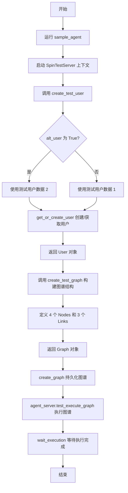
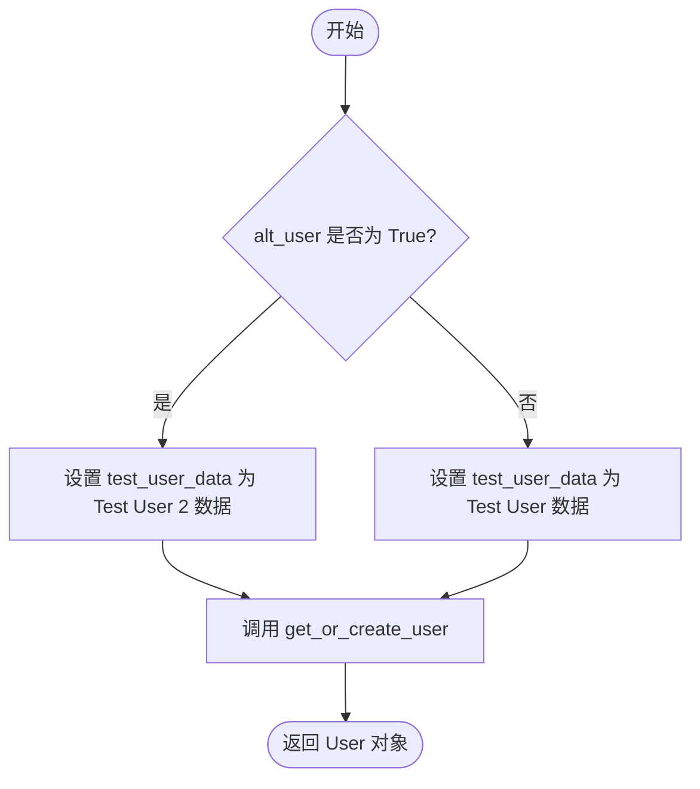
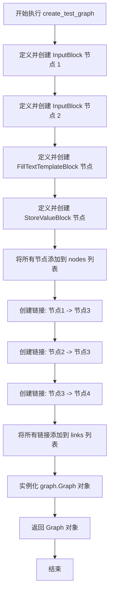
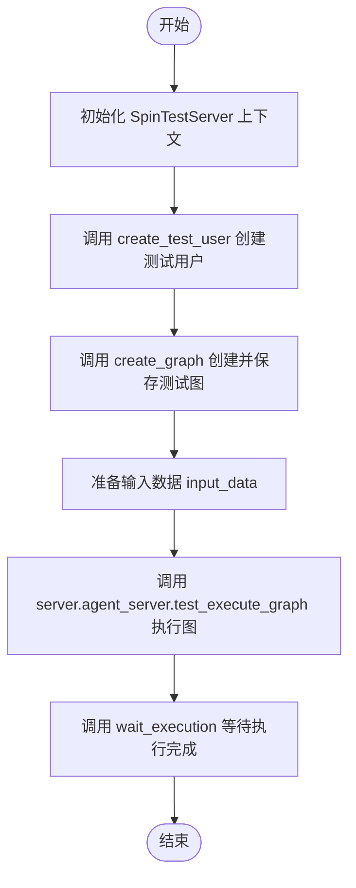

# `.\AutoGPT\autogpt_platform\backend\backend\usecases\sample.py` 详细设计文档

该代码主要用于构建和执行一个工作流代理的测试场景，它定义了创建测试用户、构建包含输入、模板填充和存储节点的测试图谱的函数，并通过异步方式启动测试服务器来执行该图谱，以验证整个数据流和节点交互的正确性。

## 整体流程



## 类结构

```
Global Functions (全局函数)
├── create_test_user
├── create_test_graph
└── sample_agent
```

## 全局变量及字段


    

## 全局函数及方法


### `create_test_user`

该函数是一个异步工具函数，用于根据输入的布尔标志创建并返回一个测试用的 `User` 实例。它允许在默认测试用户和替代测试用户的数据集之间进行选择，并通过调用 `get_or_create_user` 方法持久化或获取用户对象。

参数：

- `alt_user`：`bool`，用于选择创建哪种类型的测试用户的布尔标志。如果为 `True`，则使用替代测试用户数据（Test User 2）；如果为 `False`（默认值），则使用默认测试用户数据。

返回值：`User`，返回创建或获取到的 `User` 模型对象实例。

#### 流程图



#### 带注释源码

```python
async def create_test_user(alt_user: bool = False) -> User:
    # 检查是否需要使用替代用户数据
    if alt_user:
        # 定义替代测试用户的属性（UUID、邮箱、名称）
        test_user_data = {
            "sub": "3e53486c-cf57-477e-ba2a-cb02dc828e1b",
            "email": "testuser2@example.com",
            "name": "Test User 2",
        }
    else:
        # 定义默认测试用户的属性
        test_user_data = {
            "sub": "ef3b97d7-1161-4eb4-92b2-10c24fb154c1",
            "email": "testuser@example.com",
            "name": "Test User",
        }
    
    # 异步调用 get_or_create_user 函数，传入用户数据以创建或获取用户实例
    user = await get_or_create_user(test_user_data)
    
    # 返回最终的 User 对象
    return user
```


### `create_test_graph`

该函数通过定义节点和链接，构建并返回一个用于测试的图结构。该图由两个输入节点、一个文本模板节点和一个存储节点组成，模拟了数据输入、格式化和存储的工作流。

参数：

-   无

返回值：`graph.Graph`，一个包含测试工作流定义的 Graph 对象，包括节点、链接、名称和描述。

#### 流程图



#### 带注释源码

```python
def create_test_graph() -> graph.Graph:
    """
    InputBlock
               \
                 ---- FillTextTemplateBlock ---- StoreValueBlock
               /
    InputBlock
    """
    # 定义图中的节点列表
    nodes = [
        # 创建第一个输入块节点，默认输入名为 "input_1"
        graph.Node(
            block_id=AgentInputBlock().id,
            input_default={"name": "input_1"},
        ),
        # 创建第二个输入块节点，默认输入名为 "input_2" 并带有描述
        graph.Node(
            block_id=AgentInputBlock().id,
            input_default={
                "name": "input_2",
                "description": "This is my description of this parameter",
            },
        ),
        # 创建文本模板填充块节点，预定义格式和部分值
        graph.Node(
            block_id=FillTextTemplateBlock().id,
            input_default={
                "format": "{{a}}, {{b}}{{c}}",
                "values_#_c": "!!!",
            },
        ),
        # 创建存储值块节点
        graph.Node(block_id=StoreValueBlock().id),
    ]
    # 定义图中的链接列表，描述数据流向
    links = [
        # 链接：第一个输入节点的输出 -> 模板节点的输入 'values_#_a'
        graph.Link(
            source_id=nodes[0].id,
            sink_id=nodes[2].id,
            source_name="result",
            sink_name="values_#_a",
        ),
        # 链接：第二个输入节点的输出 -> 模板节点的输入 'values_#_b'
        graph.Link(
            source_id=nodes[1].id,
            sink_id=nodes[2].id,
            source_name="result",
            sink_name="values_#_b",
        ),
        # 链接：模板节点的输出 -> 存储节点的输入
        graph.Link(
            source_id=nodes[2].id,
            sink_id=nodes[3].id,
            source_name="output",
            sink_name="input",
        ),
    ]

    # 返回配置好的 Graph 对象
    return graph.Graph(
        name="TestGraph",
        description="Test graph description",
        nodes=nodes,
        links=links,
    )
```


### `sample_agent`

该函数用于演示和测试图代理的执行流程。它在一个模拟的测试服务器环境中创建测试用户和测试图，通过代理服务接口执行该图并传入输入数据，最后等待执行完成以验证逻辑正确性。

参数：

-   (无参数)

返回值：`None`，函数没有返回值。

#### 流程图



#### 带注释源码

```python
async def sample_agent():
    # 使用上下文管理器启动模拟的测试服务器，用于在隔离环境中运行测试
    async with SpinTestServer() as server:
        # 获取或创建一个测试用户 User 对象，用于权限和归属验证
        test_user = await create_test_user()
        
        # 根据 create_test_graph 定义的节点和连线结构，在数据库中创建一个持久化的 Graph 对象
        test_graph = await create_graph(create_test_graph(), test_user.id)
        
        # 定义图执行的输入数据，对应图中 AgentInputBlock 的输入名称
        input_data = {"input_1": "Hello", "input_2": "World"}
        
        # 调用服务器的测试执行接口，触发图执行
        # 参数包括：目标图ID、执行用户ID、以及节点输入数据
        graph_exec = await server.agent_server.test_execute_graph(
            graph_id=test_graph.id,
            user_id=test_user.id,
            node_input=input_data,
        )
        
        # 阻塞等待图执行完成，最长等待10秒，以确保异步操作结束
        await wait_execution(test_user.id, graph_exec.id, 10)
```


## 关键组件


### 测试用户创建 (`create_test_user`)

异步生成用于测试环境的模拟用户对象，支持根据参数返回默认或备选用户数据的函数。

### 测试图构建 (`create_test_graph`)

构建并返回一个特定的测试图结构，该图由两个输入块、一个文本模板填充块和一个存储值块及其相互连接的链路组成。

### 代理测试执行 (`sample_agent`)

协调整个测试生命周期的主函数，负责启动测试服务器、创建用户和图、执行图逻辑并等待执行结果。

### 功能块组件 (`AgentInputBlock`, `FillTextTemplateBlock`, `StoreValueBlock`)

构成测试图核心逻辑的基础处理单元，分别用于接收代理输入、基于模板格式化文本以及存储最终结果。

### 测试服务器环境 (`SpinTestServer`)

提供异步上下文管理器，用于在测试期间启动和管理后端服务器的生命周期。


## 问题及建议


### 已知问题

-   **硬编码测试数据**：`create_test_user` 函数中用户 UUID、Email 及 `sample_agent` 中的 `input_data` 均为硬编码，导致测试场景单一，难以适应不同的测试用例，且代码复用性低。
-   **缺乏异常处理机制**：代码中的 `sample_agent` 及相关异步调用缺少 `try-except` 块，若数据库连接失败、图创建失败或服务执行超时，程序将直接崩溃，难以定位具体错误环节。
-   **数据库脏数据残留**：脚本在测试过程中创建了 User 和 Graph 实体，但执行结束后未进行清理，长期运行会导致测试数据库中堆积大量无效数据，可能干扰后续测试。
-   **超时时间硬编码**：`wait_execution` 函数中的超时时间（10秒）被硬编码在函数调用中，在性能较差的环境下可能导致误判为测试失败。

### 优化建议

-   **参数化与Fixture化**：建议引入测试框架（如 Pytest）的 Fixture 机制，将用户创建、图构建逻辑参数化，支持从外部配置或测试数据生成器获取数据，提高测试灵活性。
-   **引入日志记录**：在关键步骤（如用户创建、图构建、服务启动、执行等待）添加详细的日志记录，便于追踪测试流程及排查故障。
-   **配置外部化与常量提取**：将 `create_test_graph` 中的模板字符串（如 `"{{a}}, {{b}}{{c}}"`）和 `sample_agent` 中的超时时间提取为模块级常量或配置文件，消除魔术字符串和魔术数字。
-   **实现测试数据自动清理**：利用测试框架的 `yield` 机制或 `teardown` 阶段，在测试结束后显式删除创建的 User 和 Graph 数据，或者使用数据库事务回滚，确保测试环境状态的隔离性。


## 其它


### 设计目标与约束

该代码的设计目标是构建一个集成测试场景，用于验证基础模块（输入块、文本模板填充块、存储值块）在图执行引擎中的数据流转与协同工作能力。其设计约束包括：
1. **异步环境依赖**：必须在 `asyncio` 事件循环中运行，且所有 I/O 操作（如用户获取、图执行）均为异步。
2. **测试服务器生命周期**：依赖 `SpinTestServer` 提供模拟的后端运行环境，服务器必须在测试开始前启动并在结束后自动清理资源。
3. **执行超时限制**：图执行过程被强制限制在 10 秒内完成，以防止测试陷入无限等待或死循环。
4. **硬编码拓扑结构**：测试图的节点和链接在代码中静态定义，不具备动态生成图结构的灵活性。

### 外部依赖与接口契约

代码严重依赖后端模块和测试工具库，主要的依赖及其接口契约如下：

1.  **`backend.blocks` 模块**
    *   `AgentInputBlock`: 契约要求提供 `input_default` 配置，并约定输出端口名称为 `result`。
    *   `FillTextTemplateBlock`: 契约要求提供 `format`（字符串模板）和对应的值输入（如 `values_#_a`），输出端口名称为 `output`。
    *   `StoreValueBlock`: 契约要求接收 `input` 端口的数据进行存储。

2.  **`backend.data.graph` 模块**
    *   `create_graph(graph, user_id)`: 接口契约为接收一个 `Graph` 对象和用户 ID，返回持久化后的图对象（含 ID）。
    *   `Graph`, `Node`, `Link`: 数据模型契约要求节点必须包含 `block_id`，链接必须明确定义 `source_id`, `sink_id`, `source_name`, `sink_name`。

3.  **`backend.data.user` 模块**
    *   `get_or_create_user(data)`: 接口契约为接收包含 `sub`, `email`, `name` 的字典，返回 `User` 对象。

4.  **`backend.util.test` 模块**
    *   `SpinTestServer`: 异步上下文管理器，契约要求支持 `async with` 语法，并提供属性 `agent_server`。
    *   `agent_server.test_execute_graph(graph_id, user_id, node_input)`: 接口契约为触发图的执行并返回执行记录对象。
    *   `wait_execution(user_id, graph_exec_id, timeout)`: 接口契约为阻塞等待直到执行完成或超时。

### 数据流与状态机

**数据流：**
1.  **输入阶段**：外部输入 `{"input_1": "Hello", "input_2": "World"}` 注入执行上下文。
2.  **分发阶段**：
    *   数据流向节点 0 (`AgentInputBlock`)，提取 "Hello" 映射到输出 `result`。
    *   数据流向节点 1 (`AgentInputBlock`)，提取 "World" 映射到输出 `result`。
3.  **处理阶段**：节点 2 (`FillTextTemplateBlock`) 接收数据：
    *   `values_#_a` 接收 "Hello"。
    *   `values_#_b` 接收 "World"。
    *   内部预设 `values_#_c` 为 "!!!"。
    *   应用模板 `"{{a}}, {{b}}{{c}}"` 生成字符串 "Hello, World!!!"。
4.  **存储阶段**：节点 3 (`StoreValueBlock`) 接收 "Hello, World!!!" 并执行存储逻辑。

**状态机：**
*   **Init**: 脚本启动，定义图结构。
*   **User Created**: `create_test_user` 成功返回用户对象。
*   **Graph Persisted**: `create_graph` 将图定义保存至数据库。
*   **Executing**: 调用 `test_execute_graph`，图实例状态转为运行中。
*   **Waiting**: 进入 `wait_execution` 阻塞等待状态，轮询执行结果。
*   **Completed/Timeout**: 若在 10 秒内返回结果，状态变为 Completed；否则触发 Timeout 异常。

### 错误处理与异常设计

当前代码采用了显式的资源管理和简单的异常传播策略：

1.  **资源清理保证**：使用 `async with SpinTestServer() as server` 确保即使在测试执行过程中发生未捕获的异常，测试服务器也能正确执行清理逻辑（如关闭端口、清理临时数据），避免资源泄露。
2.  **超时控制机制**：`wait_execution(test_user.id, graph_exec.id, 10)` 设置了硬性的超时阈值。如果图执行逻辑卡死或处理时间过长，系统会抛出超时异常，而不是无限期挂起。
3.  **异常传播策略**：`sample_agent` 函数内部没有 `try-except` 块。这意味着任何底层错误（如数据库连接失败、图验证失败、节点执行错误）都会直接向上抛出至 `asyncio.run()` 层，导致程序崩溃并打印堆栈信息。这种设计适合测试脚本，因为测试失败时通常需要完整的错误堆栈来进行调试，而不是静默处理错误。
4.  **数据一致性隐式处理**：代码假设 `get_or_create_user` 具有幂等性，能够处理并发创建或已存在用户的情况，而未在当前层处理用户冲突异常。

    