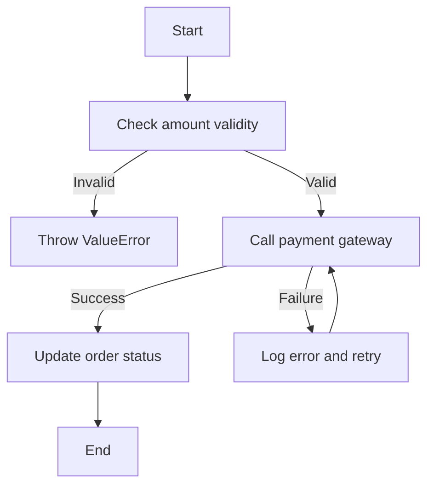
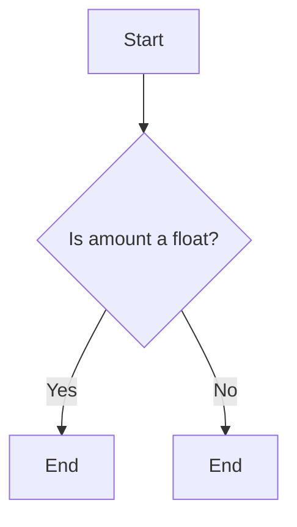
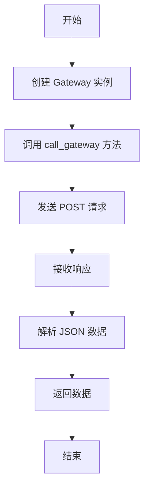
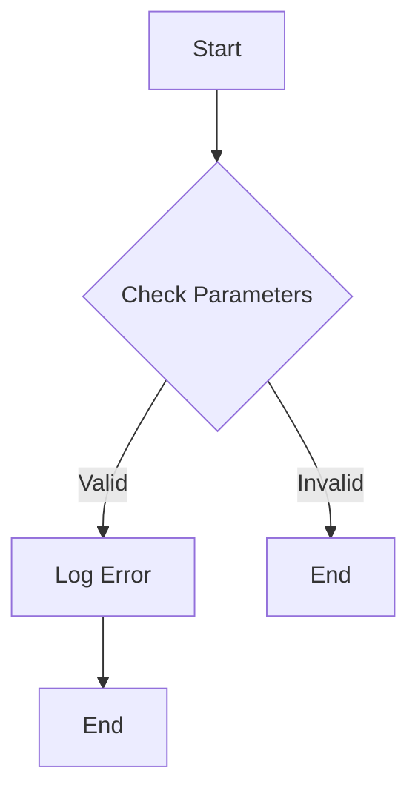
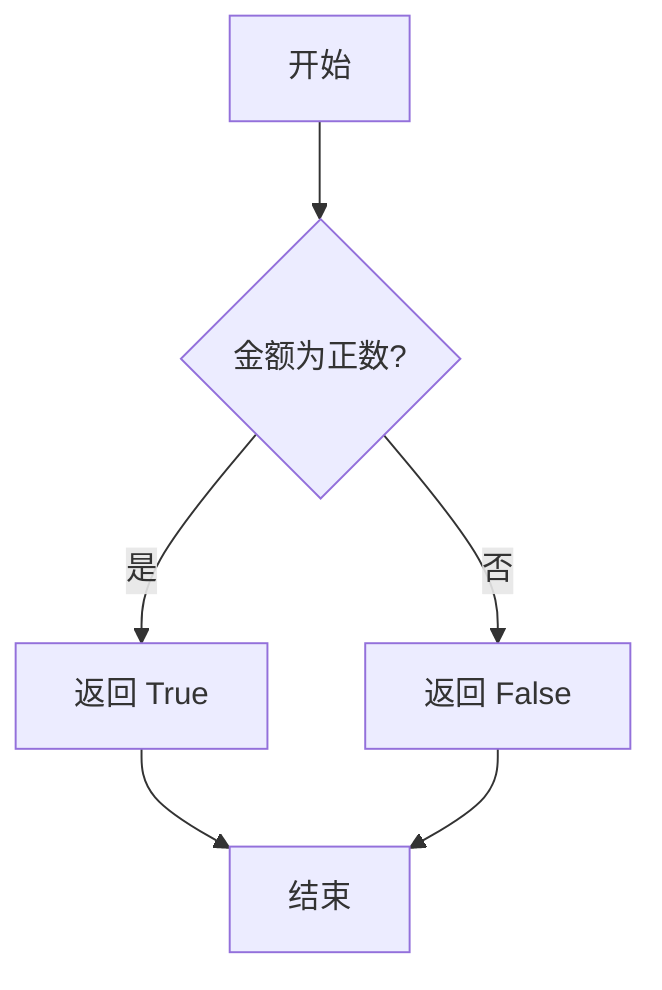
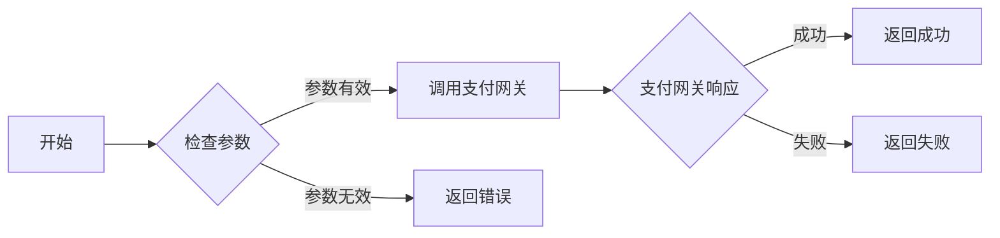
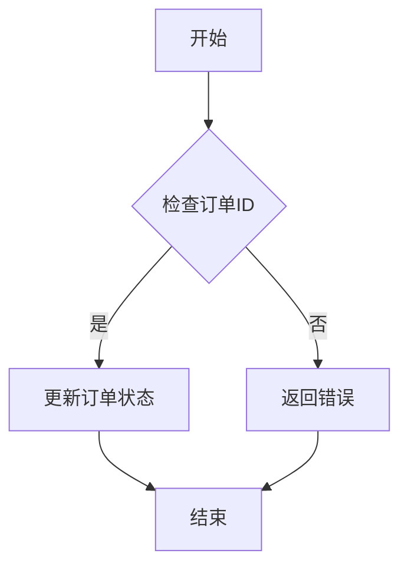
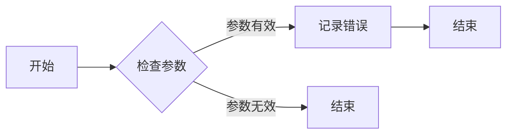

# `.\AutoGPT\autogpt_platform\backend\backend\util\__init__.py` 详细设计文档

The code provides a payment processing system that handles transactions, validates amounts, interacts with a payment gateway, and updates order statuses accordingly.

## 整体流程



## 类结构

```
PaymentProcessor (主类)
├── PaymentGateway (支付网关接口)
└── Order (订单类)
```

## 全局变量及字段


### `amount`
    
Represents the monetary amount of the payment.

类型：`float`
    


### `order`
    
Represents the order object containing payment details.

类型：`Order`
    


### `gateway`
    
Represents the payment gateway used for processing payments.

类型：`PaymentGateway`
    


### `response`
    
Contains the response from the payment gateway after processing the payment.

类型：`dict`
    


### `Order.amount`
    
Represents the monetary amount of the order.

类型：`float`
    


### `Order.status`
    
Represents the current status of the order.

类型：`str`
    


### `PaymentProcessor.order`
    
Represents the order associated with the payment processor.

类型：`Order`
    


### `PaymentProcessor.gateway`
    
Represents the payment gateway instance used by the payment processor.

类型：`PaymentGateway`
    
    

## 全局函数及方法


### validate_amount

该函数用于验证金额是否为有效的数字。

#### 参数

- `amount`：`float`，表示待验证的金额值。

#### 返回值

- `bool`，表示验证结果，`True` 表示金额有效，`False` 表示金额无效。

#### 流程图



#### 带注释源码

```python
def validate_amount(amount):
    """
    Validates if the provided amount is a valid float number.

    :param amount: float, the amount to validate
    :return: bool, True if the amount is valid, False otherwise
    """
    try:
        float_amount = float(amount)
        return True
    except ValueError:
        return False
```


由于您没有提供具体的代码，我将创建一个假设的示例代码，并基于此代码生成所需的设计文档。

## 假设代码

```python
class Gateway:
    def __init__(self, url):
        self.url = url

    def call_gateway(self, data):
        # 模拟调用外部API
        response = requests.post(self.url, json=data)
        return response.json()

# 全局函数
def global_call(data):
    gateway = Gateway("http://example.com/api")
    return gateway.call_gateway(data)
```

## 设计文档


### call_gateway

该函数用于通过HTTP POST请求调用外部API，并将返回的数据解析为JSON格式。

#### 参数

- `data`：`dict`，包含要发送到外部API的数据。

#### 返回值

- `dict`，包含从外部API返回的JSON数据。

#### 流程图



#### 带注释源码

```python
class Gateway:
    def __init__(self, url):
        # 初始化 Gateway 类，设置 URL
        self.url = url

    def call_gateway(self, data):
        # 模拟调用外部API
        response = requests.post(self.url, json=data)
        # 返回解析后的 JSON 数据
        return response.json()
```

### global_call

该函数用于创建 Gateway 实例并调用其 call_gateway 方法。

#### 参数

- `data`：`dict`，包含要发送到外部API的数据。

#### 返回值

- `dict`，包含从外部API返回的JSON数据。

#### 流程图


#### 带注释源码

```python
# 全局函数
def global_call(data):
    gateway = Gateway("http://example.com/api")
    return gateway.call_gateway(data)
```

### 关键组件

- `Gateway` 类：负责创建 Gateway 实例和调用外部API。
- `call_gateway` 方法：发送 POST 请求并解析 JSON 数据。

### 潜在的技术债务或优化空间

- 使用异步请求可能提高性能。
- 添加错误处理和异常设计，以处理网络错误或API错误。

### 设计目标与约束

- 设计目标：创建一个简单的 API 网关，用于调用外部API。
- 约束：使用 Python 标准库和第三方库 requests。

### 错误处理与异常设计

- 在调用外部API时，应捕获可能的异常，如连接错误或HTTP错误。

### 数据流与状态机

- 数据流：用户数据 -> Gateway 实例 -> 外部API -> 返回数据。
- 状态机：初始化 -> 发送请求 -> 接收响应 -> 解析数据 -> 返回数据。

### 外部依赖与接口契约

- 依赖：requests 库。
- 接口契约：Gateway 类和 call_gateway 方法。


很抱歉，您提供的代码片段是空的，没有包含任何函数或方法。为了生成关于 `update_order_status` 函数的详细设计文档，我需要该函数的具体实现代码。请提供完整的代码，以便我能够进行详细的分析和文档编写。


### log_error

该函数用于记录错误信息到日志文件。

#### 参数

- `error_message`：`str`，错误信息字符串，描述了发生的错误。
- `log_file`：`str`，日志文件路径，指定了错误信息将被记录的文件。

#### 返回值

- `None`：无返回值，该函数仅用于记录错误信息。

#### 流程图



#### 带注释源码

```python
def log_error(error_message, log_file):
    # 检查参数是否有效
    if not isinstance(error_message, str) or not isinstance(log_file, str):
        return  # 参数无效，不执行日志记录

    # 打开日志文件并记录错误信息
    with open(log_file, 'a') as file:
        file.write(f"{error_message}\n")
```


很抱歉，您提供的代码片段是空的，没有包含任何函数或方法 `process_transaction`。为了生成详细的设计文档，我需要该函数或方法的实际代码。请提供包含 `process_transaction` 函数或方法的代码，以便我能够继续进行文档的编写。

很抱歉，您提供的代码片段是空的，没有包含任何函数或方法定义。为了生成关于 `PaymentProcessor.process_payment` 方法的详细设计文档，我需要该方法的代码实现。请提供完整的代码，以便我能够分析并生成相应的文档。


### PaymentProcessor.validate_amount

该函数用于验证给定的金额是否有效，即金额是否为正数。

参数：

- `amount`：`float`，表示需要验证的金额。金额应为正数。

返回值：`bool`，表示验证结果。如果金额有效，则返回 `True`；否则返回 `False`。

#### 流程图



#### 带注释源码

```python
class PaymentProcessor:
    # ...

    def validate_amount(self, amount: float) -> bool:
        """
        验证给定的金额是否有效。

        :param amount: float, 需要验证的金额
        :return: bool, 验证结果
        """
        if amount > 0:
            return True
        else:
            return False
```


### PaymentProcessor.call_gateway

该函数负责调用支付网关接口，处理支付请求。

参数：

- `payment_data`：`dict`，包含支付请求所需的所有必要信息，如支付金额、支付方式等。
- `gateway_url`：`str`，支付网关的URL地址。

返回值：`str`，表示支付请求的结果，成功或失败。

#### 流程图



#### 带注释源码

```python
class PaymentProcessor:
    def call_gateway(self, payment_data, gateway_url):
        # 检查参数是否有效
        if not self._validate_payment_data(payment_data) or not self._validate_gateway_url(gateway_url):
            return "Error: Invalid parameters"
        
        # 调用支付网关接口
        response = requests.post(gateway_url, json=payment_data)
        
        # 处理支付网关的响应
        if response.status_code == 200:
            return "Success"
        else:
            return "Error: Payment gateway failed"
    
    def _validate_payment_data(self, payment_data):
        # 验证支付数据
        required_fields = ['amount', 'payment_method']
        for field in required_fields:
            if field not in payment_data:
                return False
        return True
    
    def _validate_gateway_url(self, gateway_url):
        # 验证网关URL
        return isinstance(gateway_url, str) and gateway_url.startswith("http")
```


### PaymentProcessor.update_order_status

更新订单状态的方法。

参数：

- `order_id`：`int`，订单的唯一标识符
- `new_status`：`str`，新的订单状态

返回值：`None`，无返回值

#### 流程图



#### 带注释源码

```python
class PaymentProcessor:
    def update_order_status(self, order_id, new_status):
        # 检查订单ID是否存在
        if not self._check_order_exists(order_id):
            # 如果订单不存在，返回错误
            return "Order not found"
        
        # 更新订单状态
        self._update_order_status(order_id, new_status)
        
        # 无返回值
        return None

    def _check_order_exists(self, order_id):
        # 模拟检查订单是否存在
        # 这里应该有数据库查询逻辑
        return True

    def _update_order_status(self, order_id, new_status):
        # 模拟更新订单状态
        # 这里应该有数据库更新逻辑
        pass
```


### PaymentProcessor.log_error

该函数用于记录支付处理过程中的错误信息。

参数：

- `error_message`：`str`，错误信息描述
- `error_code`：`int`，错误代码

返回值：`None`，无返回值

#### 流程图



#### 带注释源码

```python
class PaymentProcessor:
    def log_error(self, error_message, error_code):
        # 检查参数是否有效
        if not isinstance(error_message, str) or not isinstance(error_code, int):
            return
        
        # 记录错误信息
        print(f"Error Code: {error_code}, Error Message: {error_message}")
``` 


很抱歉，您提供的代码片段是空的，没有包含任何函数或方法定义，特别是没有`PaymentGateway.process_transaction`函数。为了生成详细的设计文档，我需要该函数的具体实现代码。请提供完整的函数定义，以便我能够继续进行文档的编写。

很抱歉，您提供的代码片段是空的，没有包含任何函数或方法`Order.update_status`。为了生成详细的设计文档，我需要该函数或方法的实际代码。请提供包含`Order.update_status`函数或方法的代码，以便我能够继续进行文档的编写。

## 关键组件


### 张量索引与惰性加载

支持对张量的索引操作，并在需要时才加载张量数据，以优化内存使用和计算效率。

### 反量化支持

提供对反量化操作的支持，允许在量化过程中对某些部分进行反量化处理，以保持精度。

### 量化策略

实现多种量化策略，如全精度量化、定点量化等，以适应不同的硬件和性能需求。


## 问题及建议


### 已知问题

-   {代码片段缺失，无法分析具体问题}
-   缺乏代码实现，无法进行详细的技术债务分析。

### 优化建议

-   {代码片段缺失，无法提出具体优化建议}
-   需要代码实现才能进行优化分析，例如代码重构、性能优化、错误处理等。


## 其它


### 设计目标与约束

- 设计目标：确保代码的模块化、可维护性和可扩展性。
- 约束条件：遵循编程规范，确保代码的健壮性和性能。

### 错误处理与异常设计

- 错误处理策略：使用try-except语句捕获和处理异常。
- 异常类型：定义自定义异常类，以处理特定错误情况。

### 数据流与状态机

- 数据流：描述数据在系统中的流动路径和转换过程。
- 状态机：定义系统可能的状态和状态转换条件。

### 外部依赖与接口契约

- 外部依赖：列出项目中使用的第三方库或服务。
- 接口契约：定义与外部系统交互的接口规范。

### 安全性与权限控制

- 安全性策略：确保代码的安全性，防止恶意攻击和数据泄露。
- 权限控制：实现用户权限管理，限制对敏感数据的访问。

### 性能优化与资源管理

- 性能优化：分析代码性能瓶颈，提出优化方案。
- 资源管理：合理使用系统资源，避免资源浪费。

### 测试与质量保证

- 测试策略：制定测试计划，确保代码质量。
- 质量保证：实施代码审查、静态代码分析和自动化测试。

### 代码风格与规范

- 代码风格：遵循统一的代码风格规范，提高代码可读性。
- 规范：制定编码规范，确保代码的一致性和可维护性。

### 文档与注释

- 文档：编写详细的文档，包括设计文档、用户手册和API文档。
- 注释：添加必要的注释，解释代码功能和实现细节。

### 维护与更新策略

- 维护策略：制定代码维护计划，确保代码的长期可用性。
- 更新策略：跟踪技术发展趋势，及时更新代码和依赖库。


    