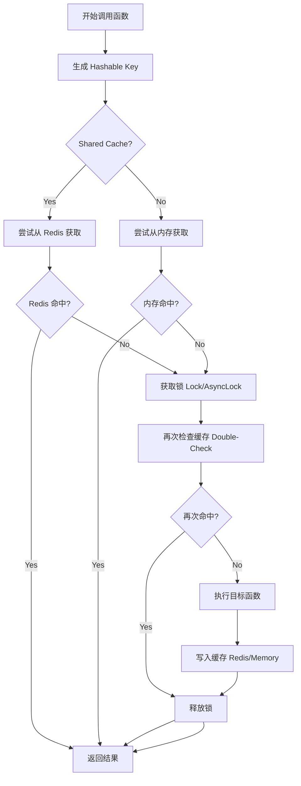
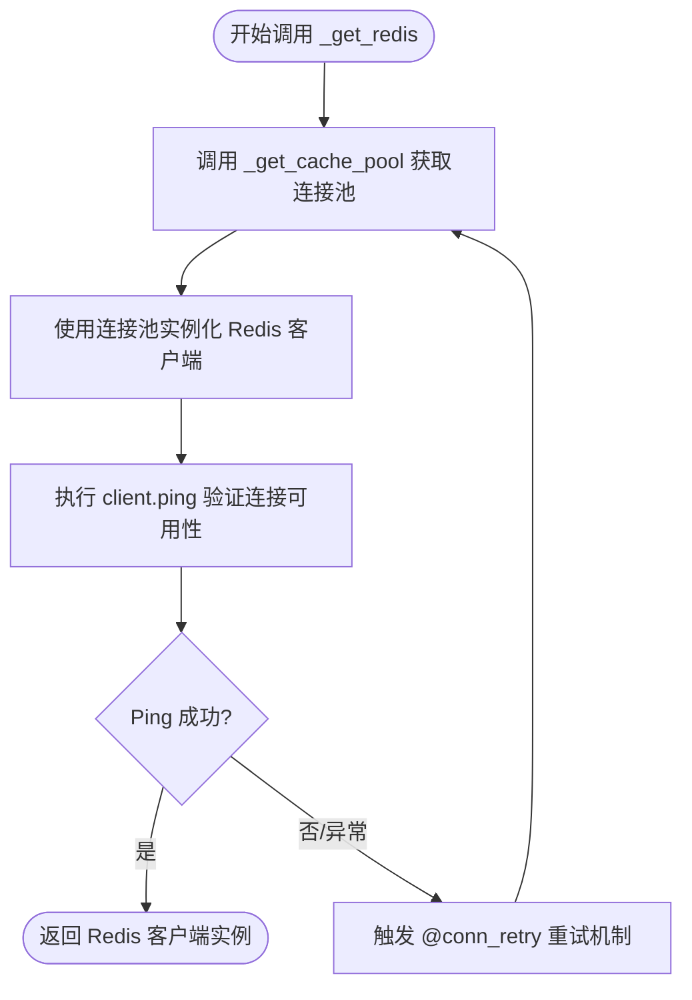
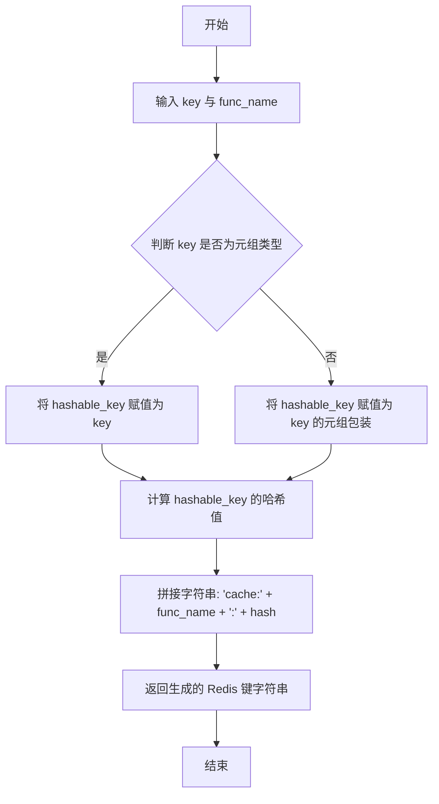
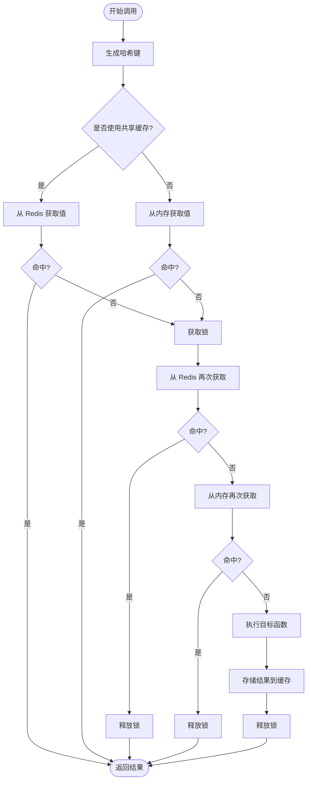
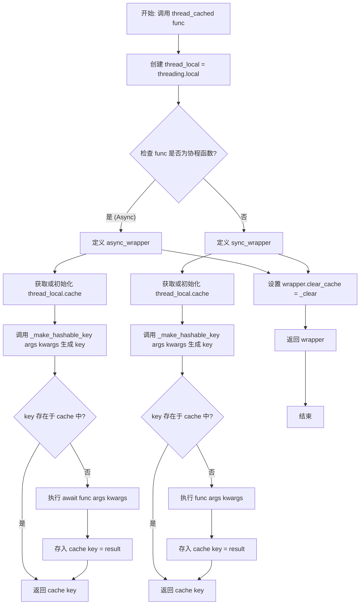
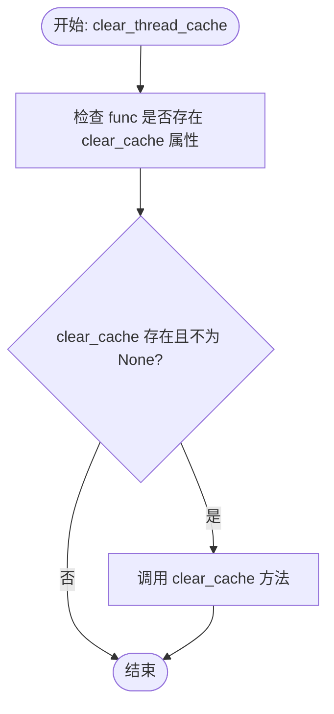
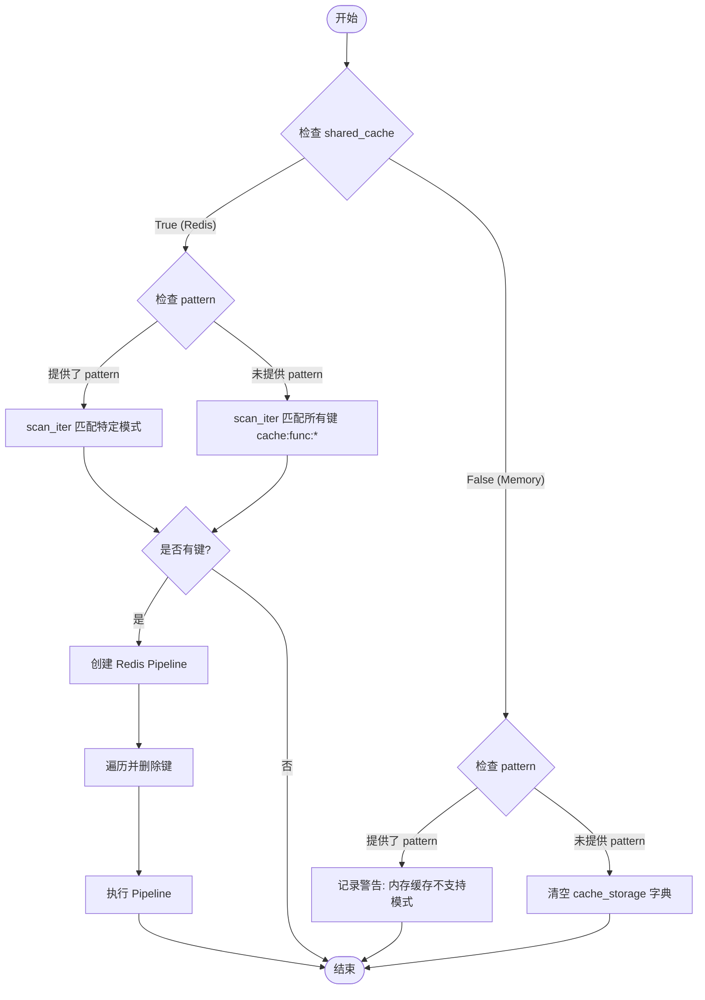
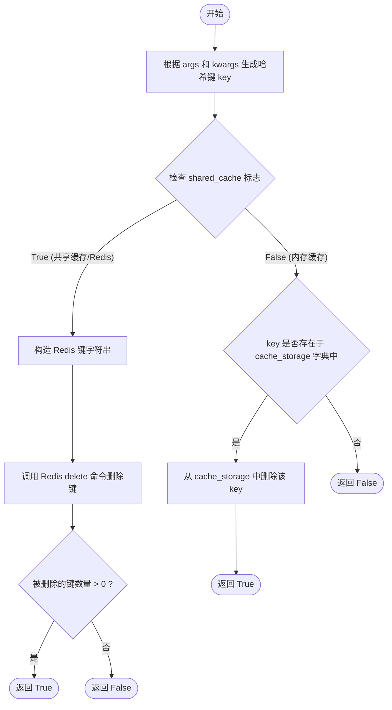
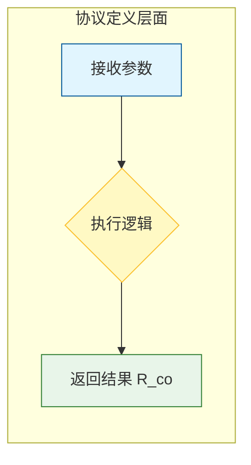

# `.\AutoGPT\autogpt_platform\backend\backend\util\cache.py` 详细设计文档

该代码为 AutoGPT 平台提供了一套全面的缓存工具，支持带 TTL 和 LRU 的内存缓存、跨进程共享的 Redis 缓存、请求作用域的线程本地缓存，以及防止缓存击穿的双重检查锁机制。

## 整体流程



## 类结构

```
CachedValue (数据类)
    ├── result: Any
    └── timestamp: float
CachedFunction (协议/接口)
    ├── cache_clear
    ├── cache_info
    ├── cache_delete
    └── __call__
```

## 全局变量及字段


### `logger`
    
用于记录缓存操作、命中状态及错误信息的日志记录器实例。

类型：`logging.Logger`
    


### `settings`
    
应用程序配置单例，用于读取 Redis 主机、端口等连接配置。

类型：`Settings`
    


### `P`
    
表示参数规范的类型变量，用于保留被装饰函数的参数类型信息。

类型：`ParamSpec`
    


### `R`
    
表示返回类型的类型变量，用于指代被装饰函数的返回值类型。

类型：`TypeVar`
    


### `R_co`
    
表示协变返回类型的类型变量，用于 Protocol 中定义只读返回值。

类型：`TypeVar`
    


### `T`
    
通用类型变量，用于泛型定义。

类型：`TypeVar`
    


### `CachedValue.result`
    
缓存条目中存储的实际函数执行结果。

类型：`Any`
    


### `CachedValue.timestamp`
    
缓存条目创建时的 Unix 时间戳，用于判断缓存是否过期（TTL）。

类型：`float`
    
    

## 全局函数及方法


### `_get_cache_pool`

获取或创建用于缓存操作的 Redis 连接池，采用延迟加载和线程安全的方式，确保全局只有一个连接池实例。

参数：

-   无

返回值：`ConnectionPool`，配置好的 Redis 连接池对象，用于建立与 Redis 服务器的连接。

#### 流程图

```mermaid
flowchart TD
    Start([函数调用]) --> CheckCache{检查缓存<br>@cache装饰器}
    CheckCache -- 缓存命中 --> ReturnExisting[返回已存在的 ConnectionPool]
    CheckCache -- 缓存未命中 --> LoadConfig[加载 Redis 配置信息<br>host, port, password等]
    LoadConfig --> CreatePool[实例化 ConnectionPool<br>设置 max_connections=50<br>设置 decode_responses=False]
    CreatePool --> UpdateCache[将结果存入缓存]
    UpdateCache --> ReturnNew[返回新创建的 ConnectionPool]
    ReturnExisting --> End([结束])
    ReturnNew --> End
```

#### 带注释源码

```python
@cache
def _get_cache_pool() -> ConnectionPool:
    """
    获取或创建用于缓存操作的连接池（延迟加载，线程安全）。
    使用 functools.cache 装饰器确保该函数在应用生命周期内仅执行一次，
    并返回单例的连接池对象。
    """
    return ConnectionPool(
        # 从全局配置中读取 Redis 主机地址
        host=settings.config.redis_host,
        # 从全局配置中读取 Redis 端口号
        port=settings.config.redis_port,
        # 从全局配置中读取 Redis 密码，如果未设置则为 None
        password=settings.config.redis_password or None,
        # 禁用自动响应解码，保持二进制模式，以便用于 pickle 序列化/反序列化
        decode_responses=False,  # Binary mode for pickle
        # 连接池中最大连接数限制为 50
        max_connections=50,
        # 启用 TCP keep-alive 机制，保持连接活性
        socket_keepalive=True,
        # 设置 socket 连接超时时间为 5 秒
        socket_connect_timeout=5,
        # 启用超时重试机制
        retry_on_timeout=True,
    )
```


### `_get_redis`

获取用于共享缓存操作的延迟初始化 Redis 客户端。利用 `@cache` 装饰器实现线程安全的单例模式，确保连接仅在首次访问时建立，这使得仅使用内存缓存的服务无需 Redis 配置即可正常工作。

参数：

无。

返回值：`Redis`，表示已成功连接并经过验证（ping）的 Redis 客户端实例。

#### 流程图



#### 带注释源码

```python
@cache
@conn_retry("Redis", "Acquiring cache connection")
def _get_redis() -> Redis:
    """
    Get the lazily-initialized Redis client for shared cache operations.
    Uses @cache for thread-safe singleton behavior - connection is only
    established when first accessed, allowing services that only use
    in-memory caching to work without Redis configuration.
    """
    # 从内部的 _get_cache_pool 获取预配置的连接池
    # 该函数同样被 @cache 装饰，确保连接池也是单例
    r = Redis(connection_pool=_get_cache_pool())
    
    # 发送 PING 命令以验证与 Redis 服务器的连接是否正常
    # 如果连接失败，此处会抛出异常，触发 @conn_retry 装饰器的重试逻辑
    r.ping()  
    
    # 返回已连接的 Redis 客户端实例
    return r
```


### `_make_hashable_key`

该函数用于将函数的参数（`args` 和 `kwargs`）转换为可哈希的元组，以便用作缓存键。它能够递归地处理字典、列表、集合等不可哈希的类型，将其转换为稳定、有序的字符串或元组表示形式，确保相同逻辑的参数生成一致的哈希键。

参数：

-  `args`：`tuple[Any, ...]`，传递给被缓存函数的位置参数元组。
-  `kwargs`：`dict[str, Any]`，传递给被缓存函数的关键字参数字典。

返回值：`tuple[Any, ...]`，包含转换后的参数和关键字参数的可哈希元组，适合用作字典键或进行哈希计算。

#### 流程图

```mermaid
flowchart TD
    A[开始: _make_hashable_key] --> B[遍历 args 元组]
    B --> C{处理每个 arg<br/>调用 make_hashable}
    
    C --> D[遍历 kwargs 字典]
    D --> E[将键值对转换为元组]
    E --> F[对 kwargs 项进行排序<br/>确保顺序一致性]
    F --> G[处理每个 value<br/>调用 make_hashable]
    
    G --> H[组合结果]
    H --> I[返回 tuple <br/>(hashable_args, hashable_kwargs)]
    I --> J[结束]

    subgraph Recursion [make_hashable 递归逻辑]
        direction TB
        C --> K{判断对象类型}
        K -->|dict| L[返回标记 '__dict__' <br/>及排序后的键值对元组]
        K -->|list/tuple| M[返回标记 '__list__' <br/>及元素元组]
        K -->|set| N[返回标记 '__set__' <br/>及排序后的元素元组]
        K -->|有 __dict__| O[返回标记 '__obj__' <br/>类名及属性字典]
        K -->|可哈希| P[直接返回对象]
        K -->|其他| Q[返回标记 '__str__' <br/>及字符串形式]
        
        L -.-> C
        M -.-> C
        N -.-> C
        O -.-> C
        Q -.-> C
    end
```

#### 带注释源码

```python
def _make_hashable_key(
    args: tuple[Any, ...], kwargs: dict[str, Any]
) -> tuple[Any, ...]:
    """
    Convert args and kwargs into a hashable cache key.

    Handles unhashable types like dict, list, set by converting them to
    their sorted string representations.
    """

    def make_hashable(obj: Any) -> Any:
        """Recursively convert an object to a hashable representation."""
        if isinstance(obj, dict):
            # 处理字典：对键值对进行排序以确保顺序一致性
            # 使用 "__dict__" 标记以区分列表或原始元组
            return (
                "__dict__",
                tuple(sorted((k, make_hashable(v)) for k, v in obj.items())),
            )
        elif isinstance(obj, (list, tuple)):
            # 处理列表或元组：递归转换每个元素
            return ("__list__", tuple(make_hashable(item) for item in obj))
        elif isinstance(obj, set):
            # 处理集合：排序并递归转换每个元素，因为集合本身是无序的
            return ("__set__", tuple(sorted(make_hashable(item) for item in obj)))
        elif hasattr(obj, "__dict__"):
            # 处理自定义对象：使用类名和其属性字典的转换结果
            return ("__obj__", obj.__class__.__name__, make_hashable(obj.__dict__))
        else:
            # 处理基本类型
            try:
                hash(obj)
                return obj
            except TypeError:
                # 无法哈希对象的回退方案：转换为字符串表示
                return ("__str__", str(obj))

    # 递归处理所有位置参数
    hashable_args = tuple(make_hashable(arg) for arg in args)
    # 递归处理所有关键字参数，并按键名排序，确保 {'a':1, 'b':2} 和 {'b':2, 'a':1} 生成相同的键
    hashable_kwargs = tuple(sorted((k, make_hashable(v)) for k, v in kwargs.items()))
    return (hashable_args, hashable_kwargs)
```


### `_make_redis_key`

将哈希化后的键元组和函数名转换为标准化的 Redis 键字符串，用于在 Redis 中唯一标识缓存条目。

参数：

-  `key`：`tuple[Any, ...]`，表示经过哈希化处理后的函数参数元组。
-  `func_name`：`str`，被缓存函数的名称。

返回值：`str`，格式化后的 Redis 键字符串，包含固定前缀、函数名和参数哈希值。

#### 流程图



#### 带注释源码

```python
def _make_redis_key(key: tuple[Any, ...], func_name: str) -> str:
    """Convert a hashable key tuple to a Redis key string."""
    # 确保键是元组格式，如果不是则将其包装为元组
    # 这样做是为了保证一致性，因为 hashable_key 总是期望是元组
    hashable_key = key if isinstance(key, tuple) else (key,)
    
    # 使用格式化字符串生成 Redis 键
    # 结构为 "cache:{函数名}:{参数哈希值}"，确保键名唯一且易于识别
    return f"cache:{func_name}:{hash(hashable_key)}"
```


### `cached`

这是一个具有防惊群效应机制的缓存装饰器工厂，用于同步和异步函数。它支持基于内存的 LRU 缓存（带 TTL）和基于 Redis 的跨进程共享缓存（可选刷新 TTL），通过双重检查锁定模式确保并发安全。

参数：

- `maxsize`：`int`，内存缓存的最大条目数，仅对内存缓存生效，默认为 128。
- `ttl_seconds`：`int`，缓存条目的生存时间（秒），必须指定。
- `shared_cache`：`bool`，如果为 True，则使用 Redis 进行跨进程缓存，否则使用内存缓存，默认为 False。
- `refresh_ttl_on_get`：`bool`，如果为 True，在访问缓存时刷新 TTL（类 LRU 行为），默认为 False。

返回值：`Callable[[Callable[P, R]], CachedFunction[P, R]]`，返回一个装饰器函数，该函数接受目标函数并返回具有缓存管理方法（如 cache_clear, cache_info）的包装函数。

#### 流程图



#### 带注释源码

```python
def cached(
    *,
    maxsize: int = 128,
    ttl_seconds: int,
    shared_cache: bool = False,
    refresh_ttl_on_get: bool = False,
) -> Callable[[Callable[P, R]], CachedFunction[P, R]]:
    """
    Thundering herd safe cache decorator for both sync and async functions.

    Uses double-checked locking to prevent multiple threads/coroutines from
    executing the expensive operation simultaneously during cache misses.

    Args:
        maxsize: Maximum number of cached entries (only for in-memory cache)
        ttl_seconds: Time to live in seconds. Required - entries must expire.
        shared_cache: If True, use Redis for cross-process caching
        refresh_ttl_on_get: If True, refresh TTL when cache entry is accessed (LRU behavior)

    Returns:
        Decorated function with caching capabilities
    """

    def decorator(target_func: Callable[P, R]) -> CachedFunction[P, R]:
        # 初始化内存缓存存储和异步锁字典
        cache_storage: dict[tuple, CachedValue] = {}
        _event_loop_locks: dict[Any, asyncio.Lock] = {}

        # --- Redis 辅助函数 ---
        def _get_from_redis(redis_key: str) -> Any | None:
            """Get value from Redis, optionally refreshing TTL."""
            try:
                if refresh_ttl_on_get:
                    # 使用 GETEX 原子性地获取值并刷新过期时间
                    cached_bytes = _get_redis().getex(redis_key, ex=ttl_seconds)
                else:
                    cached_bytes = _get_redis().get(redis_key)

                if cached_bytes and isinstance(cached_bytes, bytes):
                    return pickle.loads(cached_bytes)
            except Exception as e:
                logger.error(
                    f"Redis error during cache check for {target_func.__name__}: {e}"
                )
            return None

        def _set_to_redis(redis_key: str, value: Any) -> None:
            """Set value in Redis with TTL."""
            try:
                pickled_value = pickle.dumps(value, protocol=pickle.HIGHEST_PROTOCOL)
                _get_redis().setex(redis_key, ttl_seconds, pickled_value)
            except Exception as e:
                logger.error(
                    f"Redis error storing cache for {target_func.__name__}: {e}"
                )

        # --- 内存辅助函数 ---
        def _get_from_memory(key: tuple) -> Any | None:
            """Get value from in-memory cache, checking TTL."""
            if key in cache_storage:
                cached_data = cache_storage[key]
                # 检查 TTL 是否过期
                if time.time() - cached_data.timestamp < ttl_seconds:
                    logger.debug(
                        f"Cache hit for {target_func.__name__} args: {key[0]} kwargs: {key[1]}"
                    )
                    return cached_data.result
            return None

        def _set_to_memory(key: tuple, value: Any) -> None:
            """Set value in in-memory cache with timestamp."""
            cache_storage[key] = CachedValue(result=value, timestamp=time.time())

            # 如果超出最大大小，进行清理 (简单的 LRU 策略，保留一半最新的)
            if len(cache_storage) > maxsize:
                cutoff = maxsize // 2
                oldest_keys = list(cache_storage.keys())[:-cutoff] if cutoff > 0 else []
                for old_key in oldest_keys:
                    cache_storage.pop(old_key, None)

        # --- 异步分支处理 ---
        if inspect.iscoroutinefunction(target_func):

            def _get_cache_lock():
                """Get or create an asyncio.Lock for the current event loop."""
                try:
                    loop = asyncio.get_running_loop()
                except RuntimeError:
                    loop = None

                if loop not in _event_loop_locks:
                    return _event_loop_locks.setdefault(loop, asyncio.Lock())
                return _event_loop_locks[loop]

            @wraps(target_func)
            async def async_wrapper(*args: P.args, **kwargs: P.kwargs):
                # 生成键
                key = _make_hashable_key(args, kwargs)
                redis_key = (
                    _make_redis_key(key, target_func.__name__) if shared_cache else ""
                )

                # 快速路径：无锁检查缓存
                if shared_cache:
                    result = _get_from_redis(redis_key)
                    if result is not None:
                        return result
                else:
                    result = _get_from_memory(key)
                    if result is not None:
                        return result

                # 慢速路径：缓存未命中或过期，获取锁
                async with _get_cache_lock():
                    # 双重检查：可能在等待锁时，其他协程已填充缓存
                    if shared_cache:
                        result = _get_from_redis(redis_key)
                        if result is not None:
                            return result
                    else:
                        result = _get_from_memory(key)
                        if result is not None:
                            return result

                    # 缓存确实未命中，执行目标函数
                    logger.debug(f"Cache miss for {target_func.__name__}")
                    result = await target_func(*args, **kwargs)

                    # 存储结果
                    if shared_cache:
                        _set_to_redis(redis_key, result)
                    else:
                        _set_to_memory(key, result)

                    return result

            wrapper = async_wrapper

        else:
            # --- 同步分支处理 ---
            # 使用线程锁
            cache_lock = threading.Lock()

            @wraps(target_func)
            def sync_wrapper(*args: P.args, **kwargs: P.kwargs):
                # 生成键
                key = _make_hashable_key(args, kwargs)
                redis_key = (
                    _make_redis_key(key, target_func.__name__) if shared_cache else ""
                )

                # 快速路径：无锁检查缓存
                if shared_cache:
                    result = _get_from_redis(redis_key)
                    if result is not None:
                        return result
                else:
                    result = _get_from_memory(key)
                    if result is not None:
                        return result

                # 慢速路径：获取锁
                with cache_lock:
                    # 双重检查
                    if shared_cache:
                        result = _get_from_redis(redis_key)
                        if result is not None:
                            return result
                    else:
                        result = _get_from_memory(key)
                        if result is not None:
                            return result

                    # 缓存未命中，执行函数
                    logger.debug(f"Cache miss for {target_func.__name__}")
                    result = target_func(*args, **kwargs)

                    # 存储结果
                    if shared_cache:
                        _set_to_redis(redis_key, result)
                    else:
                        _set_to_memory(key, result)

                    return result

            wrapper = sync_wrapper

        # --- 添加缓存管理方法 ---
        def cache_clear(pattern: str | None = None) -> None:
            """Clear cache entries. If pattern provided, clear matching entries."""
            if shared_cache:
                # Redis 模式匹配清除
                if pattern:
                    keys = list(
                        _get_redis().scan_iter(
                            f"cache:{target_func.__name__}:{pattern}"
                        )
                    )
                else:
                    keys = list(
                        _get_redis().scan_iter(f"cache:{target_func.__name__}:*")
                    )

                if keys:
                    pipeline = _get_redis().pipeline()
                    for key in keys:
                        pipeline.delete(key)
                    pipeline.execute()
            else:
                # 内存缓存不支持模式匹配
                if pattern:
                    logger.warning(
                        "Pattern-based clearing not supported for in-memory cache"
                    )
                else:
                    cache_storage.clear()

        def cache_info() -> dict[str, int | None]:
            if shared_cache:
                cache_keys = list(
                    _get_redis().scan_iter(f"cache:{target_func.__name__}:*")
                )
                return {
                    "size": len(cache_keys),
                    "maxsize": None,  # Redis manages its own size
                    "ttl_seconds": ttl_seconds,
                }
            else:
                return {
                    "size": len(cache_storage),
                    "maxsize": maxsize,
                    "ttl_seconds": ttl_seconds,
                }

        def cache_delete(*args, **kwargs) -> bool:
            """Delete a specific cache entry. Returns True if entry existed."""
            key = _make_hashable_key(args, kwargs)
            if shared_cache:
                redis_key = _make_redis_key(key, target_func.__name__)
                deleted_count = cast(int, _get_redis().delete(redis_key))
                return deleted_count > 0
            else:
                if key in cache_storage:
                    del cache_storage[key]
                    return True
                return False

        # 将管理方法附加到 wrapper 对象上
        setattr(wrapper, "cache_clear", cache_clear)
        setattr(wrapper, "cache_info", cache_info)
        setattr(wrapper, "cache_delete", cache_delete)

        return cast(CachedFunction[P, R], wrapper)

    return decorator
```


### `thread_cached`

利用 Python 的 `threading.local` 实现线程本地缓存的装饰器。该装饰器确保每个线程拥有独立的缓存存储，避免多线程环境下的竞争条件，同时支持同步和异步函数，适用于请求作用域的数据缓存（如 Web 请求期间）。

参数：

-   `func`：`Callable`，需要进行缓存装饰的原始函数（可以是同步函数或异步函数）。

返回值：`Callable`，经过包装的函数。包装后的函数会根据输入参数在当前线程的本地存储中查找或计算结果，并附带一个 `clear_cache` 方法用于清除当前线程的缓存。

#### 流程图



#### 带注释源码

```python
def thread_cached(func):
    """
    Thread-local cache decorator for both sync and async functions.

    Each thread gets its own cache, which is useful for request-scoped caching
    in web applications where you want to cache within a single request but
    not across requests.

    Args:
        func: The function to cache

    Returns:
        Decorated function with thread-local caching

    Example:
        @thread_cached
        def expensive_operation(param: str) -> dict:
            return {"result": param}

        @thread_cached  # Works with async too
        async def expensive_async_operation(param: str) -> dict:
            return {"result": param}
    """
    # 创建线程本地存储对象，确保每个线程访问该对象时看到的是独立的数据
    thread_local = threading.local()

    # 定义清除当前线程缓存的内部函数
    def _clear():
        if hasattr(thread_local, "cache"):
            del thread_local.cache

    # 检查被装饰的函数是否是协程函数（异步函数）
    if inspect.iscoroutinefunction(func):

        @wraps(func)
        async def async_wrapper(*args, **kwargs):
            # 尝试获取当前线程的缓存字典，如果不存在则初始化为空字典
            cache = getattr(thread_local, "cache", None)
            if cache is None:
                cache = thread_local.cache = {}
            
            # 根据参数生成可哈希的缓存键
            key = _make_hashable_key(args, kwargs)
            
            # 如果键不存在于缓存中，则执行函数并存储结果
            if key not in cache:
                cache[key] = await func(*args, **kwargs)
            
            # 返回缓存中的结果
            return cache[key]

        # 将清除缓存的方法绑定到包装函数上
        setattr(async_wrapper, "clear_cache", _clear)
        return async_wrapper

    else:
        # 处理同步函数的逻辑
        @wraps(func)
        def sync_wrapper(*args, **kwargs):
            # 尝试获取当前线程的缓存字典，如果不存在则初始化为空字典
            cache = getattr(thread_local, "cache", None)
            if cache is None:
                cache = thread_local.cache = {}
            
            # 根据参数生成可哈希的缓存键
            key = _make_hashable_key(args, kwargs)
            
            # 如果键不存在于缓存中，则执行函数并存储结果
            if key not in cache:
                cache[key] = func(*args, **kwargs)
            
            # 返回缓存中的结果
            return cache[key]

        # 将清除缓存的方法绑定到包装函数上
        setattr(sync_wrapper, "clear_cache", _clear)
        return sync_wrapper
```


### `clear_thread_cache`

清除指定函数的线程本地缓存。该函数通过检查输入函数对象是否具有 `clear_cache` 属性来决定是否执行清理操作，主要应用于清除被 `thread_cached` 装饰器修饰的函数所持有的线程级缓存数据。

参数：

-   `func`：`Callable`，需要清除缓存的目标函数对象，通常是被 `@thread_cached` 装饰的函数。

返回值：`None`，无返回值，仅执行清理操作。

#### 流程图



#### 带注释源码

```python
def clear_thread_cache(func: Callable) -> None:
    """Clear thread-local cache for a function."""
    # 使用 getattr 尝试获取 func 对象上的 'clear_cache' 属性
    # 如果属性不存在则返回 None
    # 利用海象操作符 (:=) 将结果赋值给 clear 并判断其真值
    if clear := getattr(func, "clear_cache", None):
        # 如果获取到 clear_cache 方法，则调用它以清除对应的线程本地缓存
        clear()
```


### `CachedFunction.cache_clear`

清除与被装饰函数关联的缓存条目。如果配置了共享缓存（Redis），则支持基于通配符的模式匹配来删除特定条目；如果是内存缓存，则仅支持清空所有缓存，且不支持模式匹配（会记录警告）。

参数：

- `pattern`：`str | None`，可选参数，用于指定 Redis 键的匹配模式。如果提供，仅清除匹配该模式的键；如果为 None，则清除所有与该函数相关的缓存键。

返回值：`None`，无返回值。

#### 流程图



#### 带注释源码

```python
def cache_clear(pattern: str | None = None) -> None:
    """Clear cache entries. If pattern provided, clear matching entries."""
    # 检查是否开启了 Redis 共享缓存
    if shared_cache:
        if pattern:
            # 如果提供了 pattern，则构建并扫描带有该 pattern 的 Redis 键
            # 键格式通常为: cache:{function_name}:{pattern}
            keys = list(
                _get_redis().scan_iter(
                    f"cache:{target_func.__name__}:{pattern}"
                )
            )
        else:
            # 如果未提供 pattern，则扫描该函数名下的所有缓存键
            # 键格式通常为: cache:{function_name}:*
            keys = list(
                _get_redis().scan_iter(f"cache:{target_func.__name__}:*")
            )

        # 如果存在需要删除的键
        if keys:
            # 使用 Redis Pipeline 批量执行删除命令，提高网络效率
            pipeline = _get_redis().pipeline()
            for key in keys:
                pipeline.delete(key)
            pipeline.execute()
    else:
        # 处理内存缓存模式
        if pattern:
            # 内存缓存不支持复杂的模式匹配，记录警告日志
            logger.warning(
                "Pattern-based clearing not supported for in-memory cache"
            )
        else:
            # 直接清空内存缓存字典
            cache_storage.clear()
```


### `CachedFunction.cache_info`

`CachedFunction` 协议中定义的方法，用于获取缓存统计信息。该方法规定了所有符合该协议的缓存函数必须实现返回包含缓存统计数据的字典的能力，例如当前缓存的大小、最大容量和过期时间等。

参数：

- `self`：`CachedFunction[P, R_co]`，协议实例的隐式参数，指代被装饰的缓存函数对象。

返回值：`dict[str, int | None]`，包含缓存统计信息的字典（如当前大小、最大容量和 TTL）。

#### 流程图

```mermaid
flowchart TD
    Start([开始]) --> ReturnDict[返回空字典 {}]
    ReturnDict --> End([结束])
```

#### 带注释源码

```python
def cache_info(self) -> dict[str, int | None]:
    """Get cache statistics."""
    # 协议（Protocol）定义，仅提供接口签名
    # 实际的逻辑由实现该协议的具体缓存装饰器（如 @cached）提供
    return {}
```


### `CachedFunction.cache_delete`

根据传入的参数删除特定的缓存条目。支持内存缓存和共享 Redis 缓存两种模式，返回操作是否实际删除了存在的条目。

参数：

-  `args`：`P.args`，原始被装饰函数的位置参数，用于生成唯一的缓存键。
-  `kwargs`：`P.kwargs`，原始被装饰函数的关键字参数，用于生成唯一的缓存键。

返回值：`bool`，如果缓存条目存在并被成功删除返回 `True`，如果条目不存在则返回 `False`。

#### 流程图



#### 带注释源码

```python
        def cache_delete(*args, **kwargs) -> bool:
            """Delete a specific cache entry. Returns True if entry existed."""
            # 步骤 1: 将参数转换为哈希键，以定位缓存条目
            key = _make_hashable_key(args, kwargs)
            
            # 步骤 2: 检查是否启用了共享缓存
            if shared_cache:
                # 分支 2.1: Redis 缓存模式
                # 生成符合 Redis 命名规范的键字符串
                redis_key = _make_redis_key(key, target_func.__name__)
                # 执行 Redis 删除操作，cast 确保类型检查通过
                deleted_count = cast(int, _get_redis().delete(redis_key))
                # 如果删除数量大于 0，说明之前存在该键
                return deleted_count > 0
            else:
                # 分支 2.2: 内存缓存模式
                if key in cache_storage:
                    # 键存在，从字典中移除
                    del cache_storage[key]
                    return True
                # 键不存在，无需操作
                return False
```


### `CachedFunction.__call__`

定义了 `CachedFunction` 协议的可调用签名。作为协议方法，它强制要求实现该协议的对象（即被装饰的函数包装器）必须像原始函数一样可调用，接受特定的参数并返回特定类型的结果。在实际的 `cached` 装饰器中，此方法由 `async_wrapper` 或 `sync_wrapper` 具体实现，用于执行缓存查找、锁竞争控制及原函数调用。

参数：

-  `args`：`P.args`，传递给被包装函数的位置变量参数，由 `ParamSpec` P 定义。
-  `kwargs`：`P.kwargs`，传递给被包装函数的关键字变量参数，由 `ParamSpec` P 定义。

返回值：`R_co`，函数执行结果的类型，声明为协变类型。

#### 流程图



#### 带注释源码

```python
    def __call__(self, *args: P.args, **kwargs: P.kwargs) -> R_co:
        """
        Call the cached function.
        
        这是一个协议方法，用于类型检查。实际运行时的行为由装饰器返回的
        sync_wrapper 或 async_wrapper 提供。
        """
        # type: ignore 用于忽略类型检查器对协议方法中返回 None 的警告
        # 因为协议只定义签名，不提供具体实现。
        return None  # type: ignore
```


## 关键组件


### Redis 连接管理

基于 `@cache` 装饰器和连接池技术实现的 Redis 客户端惰性初始化与单例模式，确保连接资源的线程安全复用，并集成了连接重试机制以应对网络抖动。

### 缓存键生成与序列化

负责将函数的参数（包含不可哈希类型如字典、列表、集合及自定义对象）递归转换为可哈希的元组键，并结合函数名生成 Redis 字符串键，支持使用 `pickle` 对复杂数据进行二进制序列化。

### 双模式缓存引擎

核心装饰器 `@cached`，同时支持基于内存的 LRU 缓存（带 TTL）和基于 Redis 的跨进程共享缓存，兼容同步和异步函数，并提供清除、查询统计、删除条目等管理接口。

### 并发控制与防击穿

采用双重检查锁定机制，在缓存未命中时获取锁（`threading.Lock` 或 `asyncio.Lock`）防止并发执行，有效解决缓存失效时的惊群效应。

### 线程本地缓存

利用 `threading.local` 实现的线程隔离缓存装饰器 `@thread_cached`，确保每个线程拥有独立的缓存存储空间，适用于请求级别的数据缓存，避免跨线程数据污染。


## 问题及建议


### 已知问题

-   **Redis 跨进程缓存键失效风险**：在 `_make_redis_key` 函数中使用了 Python 内置的 `hash()` 函数生成 Redis 键。自 Python 3.3 起，Python 默认启用了哈希随机化，这意味着同一个对象在不同的进程中（例如不同的 Gunicorn worker 或容器实例）计算出的哈希值不同。这会导致 `shared_cache=True` 时，进程 A 写入的缓存无法被进程 B 读取，从而彻底破坏了共享缓存的功能。
-   **内存缓存淘汰策略与文档不符**：文档中声称支持 "LRU eviction"（最近最少使用淘汰），但实际代码实现的是 FIFO（先进先出）。代码根据插入时间排序并删除旧数据，而不是根据访问时间。只有当缓存已满且发生写入时才清理，且清理逻辑简单截断，并不是真正的 LRU。
-   **Redis 故障时的“惊群效应”隐患**：虽然装饰器使用了锁来防止缓存击穿，但在 Redis 不可用（`_get_from_redis` 抛出异常）时，代码仅记录错误并返回 `None`（视为缓存未命中）。这将导致所有请求线程/协程绕过缓存直接穿透到后端服务，从而引发后端服务的雪崩，丢失了缓存保护层的作用。
-   **反序列化异常被吞没**：在 `_get_from_redis` 中，`pickle.loads` 被包裹在通用的 `Exception` 捕获块中。如果缓存的二进制数据损坏或类结构变更导致反序列化失败，系统仅记录日志并将其视为缓存未命中。这掩盖了数据一致性问题，可能导致代码逻辑进入错误分支。
-   **异步锁字典潜在的内存泄漏**：`_event_loop_locks` 字典用于存储每个事件循环对应的锁。在长期运行的应用中，如果事件循环被销毁但未从字典中移除，旧的锁对象将无法被垃圾回收，导致微小的内存泄漏。

### 优化建议

-   **使用稳定的哈希算法**：修改 `_make_redis_key` 方法，放弃 Python 内置的 `hash()`，改用 `hashlib`（如 `sha256`）对序列化后的键进行摘要计算。确保在不同进程和重启后，相同的参数始终生成相同的 Redis 键。
-   **引入真正的 LRU 实现**：替换手动维护的字典逻辑，使用 `collections.OrderedDict` 并结合 `move_to_end` 方法实现访问时更新顺序，或者直接使用成熟的库如 `cachetools.LRUCache`，以确保淘汰策略符合预期并提升性能。
-   **引入熔断机制**：在 Redis 客户端调用层增加熔断机制。当 Redis 连续失败一定次数后，熔断器打开，后续请求直接返回预设值（如降级数据）或抛出特定异常，避免流量风暴冲击后端数据库，同时在一段时间后尝试半开状态恢复探测。
-   **优化内存缓存清理逻辑**：当前的清理逻辑 `list(cache_storage.keys())[:-cutoff]` 在缓存量大时会产生额外的内存拷贝和计算开销。建议使用惰性删除或分批删除策略，或者直接采用 `cachetools` 中经过优化的缓存容器。
-   **细化异常捕获与处理**：将 `_get_from_redis` 中的通用 `Exception` 捕获拆分。针对 Redis 连接错误执行降级策略，针对 `pickle` 反序列化错误执行数据清理或警告日志，以便于区分网络问题和数据兼容性问题。
-   **增强线程本地缓存的生命周期管理**：`thread_cached` 装饰器目前没有 TTL 或大小限制。在利用线程池的 Web 服务（如 Gunicorn Sync workers）中，线程可能复用导致旧数据残留。建议增加基于时间的清理机制，或提供上下文管理器接口，以便在请求结束时自动清理线程缓存。


## 其它


### 设计目标与约束

**设计目标**
1.  **高性能与低延迟**：通过内存缓存和Redis缓存显著减少数据库查询或昂贵计算的调用次数。
2.  **防击穿保护**：利用双重检查锁定机制防止缓存失效瞬间大量请求穿透到后端服务。
3.  **灵活性**：提供统一的装饰器接口，同时支持同步和异步函数；支持进程内缓存和分布式Redis缓存的无缝切换。
4.  **一致性支持**：提供基于TTL的自动过期机制，以及可选的访问刷新TTL（LRU特性）功能。

**约束条件**
1.  **序列化约束**：使用 `pickle` 进行对象序列化，因此被缓存的函数参数和返回值必须是可序列化的。对于Redis缓存，对象大小受Redis最大内存限制。
2.  **键哈希约束**：函数参数必须能被转换为可哈希的类型，虽然代码内部通过 `_make_hashable_key` 处理了字典、列表等不可哈希类型，但极端复杂的对象可能仍不支持。
3.  **Redis依赖**：当使用 `shared_cache=True` 时，系统强依赖Redis的可用性。虽然代码对Redis错误做了降级处理（返回None并继续执行原函数），但在高并发下Redis故障可能导致雪崩。
4.  **配置要求**：Redis服务端建议配置 `maxmemory-policy` 为 `allkeys-lru` 以配合应用端的淘汰策略。

### 错误处理与异常设计

1.  **Redis连接与操作异常**：
    *   **连接层**：使用 `@conn_retry` 装饰器封装 `_get_redis`，在连接失败时进行自动重试。
    *   **读写层**：在 `_get_from_redis` 和 `_set_to_redis` 中捕获所有 `Exception`。当Redis不可用或操作超时时，记录错误日志，并将该次操作视为缓存未命中，从而回退到执行原函数，确保业务流程不中断。
2.  **键生成异常**：
    *   在 `_make_hashable_key` 中，如果对象无法哈希或转换，会回退到字符串表示。如果字符串转换失败，可能会抛出异常，此时装饰器将无法正常工作，需确保参数对象实现了 `__str__` 或基本类型转换。
3.  **异步锁获取异常**：
    *   在获取 `asyncio.get_running_loop()` 时，如果不在异步上下文中会抛出 `RuntimeError`。代码已处理该情况，但在同步线程中调用异步缓存函数会导致不可预期的行为。
4.  **TTL过期处理**：
    *   内存缓存采用惰性检查，即在读取时检查时间戳。过期数据不会自动清理内存，直到被访问或LRU淘汰。

### 并发与线程安全

1.  **同步函数并发控制**：
    *   使用 `threading.Lock` 确保多线程环境下只有一个线程能执行被装饰的昂贵函数。采用双重检查锁定模式，先查缓存再获取锁，减少锁竞争开销。
2.  **异步函数并发控制**：
    *   使用 `asyncio.Lock` 进行协程并发控制。
    *   **事件循环隔离**：`_event_loop_locks` 字典根据 `asyncio.get_running_loop()` 的ID存储锁。这意味着在不同的线程或不同的事件循环中，锁是独立的。这防止了在一个循环中阻塞等待另一个循环的锁，符合 `asyncio` 的最佳实践。
3.  **线程本地存储**：
    *   `thread_cached` 使用 `threading.local()`，确保每个线程拥有独立的缓存存储，互不干扰，适用于请求作用域的缓存。

### 数据流与状态机

**数据流**：
1.  **请求入口**：调用被装饰的函数，传入参数 `args` 和 `kwargs`。
2.  **键生成**：通过 `_make_hashable_key` 将参数转换为唯一的哈希元组，若开启共享缓存则进一步生成Redis键字符串。
3.  **快速路径**：
    *   未加锁检查缓存（内存或Redis）。
    *   如果命中且未过期：直接返回结果。
4.  **慢路径**：
    *   获取对应的锁（线程锁或异步锁）。
    *   **双重检查**：再次检查缓存，防止在等待锁期间其他协程/线程已经填充了缓存。
    *   **执行**：调用原始函数 `target_func` 计算结果。
    *   **回写**：将结果存入缓存（设置时间戳或TTL）。
    *   释放锁并返回结果。
5.  **异常分支**：若Redis操作失败，视作未命中，进入慢路径执行原函数。

**状态机**：
缓存条目具有隐式状态：
*   `EMPTY`：缓存中不存在该键。
*   `VALID`：缓存中存在数据且时间戳在当前TTL范围内。
*   `EXPIRED`：缓存中存在数据但时间戳已超期（仅在内存模式下逻辑存在，Redis会自动删除，但GETEX可能刷新）。
*   `LOCKED`：该键对应的计算逻辑正在被执行，其他请求需等待锁释放。

### 外部依赖与接口契约

1.  **Redis 服务器**：
    *   **连接接口**：依赖 `host`, `port`, `password` 进行TCP连接。
    *   **契约**：客户端发送 `GET`, `SETEX`, `GETEX`, `DELETE`, `SCAN` 等指令。服务端需响应对应的协议数据。
    *   **配置契约**：必须开启持久化或禁用（根据需求），推荐开启 `maxmemory` 策略。
2.  **Settings 模块 (`backend.util.settings.Settings`)**：
    *   **接口**：必须提供 `config` 对象，包含 `redis_host`, `redis_port`, `redis_password` 属性。
    *   **契约**：属性值需为有效的字符串或整数，用于构建Redis连接。
3.  **Retry 模块 (`backend.util.retry`)**：
    *   **接口**：提供 `conn_retry` 装饰器，用于处理连接重试逻辑。

### 安全性设计

1.  **认证**：
    *   通过 `Settings` 获取 Redis 密码，连接时使用 `password` 参数进行认证。建议在生产环境中强制配置密码。
2.  **序列化安全**：
    *   当前使用 `pickle` 进行序列化。**潜在风险**：如果攻击者能控制Redis中的数据（例如通过其他漏洞注入恶意数据），反序列化 `pickle.loads` 可能导致远程代码执行（RCE）。
    *   **建议**：在受信任的环境中运行Redis，或者考虑替换为JSON等安全的序列化方式，虽然这会牺牲部分复杂对象类型的支持。
3.  **资源耗尽防护**：
    *   内存缓存通过 `maxsize` 限制了LRU缓存的大小，防止无限增长导致OOM（内存溢出）。
    *   Redis连接池限制了 `max_connections`，防止连接数过多耗耗尽文件描述符。

### 扩展性设计

1.  **存储后端扩展**：
    *   当前 `cached` 装饰器通过 `shared_cache` 布尔值在内存和Redis之间切换。设计上可以抽象出 `StorageBackend` 接口，以便未来支持 Memcached 或其他KV存储。
2.  **序列化策略扩展**：
    *   `_set_to_redis` 中硬编码了 `pickle.dumps`。若需支持JSON或MsgPack，可将序列化器作为参数注入装饰器。
3.  **键策略扩展**：
    *   `_make_redis_key` 使用了固定的 `cache:{func_name}:{hash}` 格式。可以通过添加参数自定义键的前缀或生成逻辑，以支持多租户或环境隔离。

    